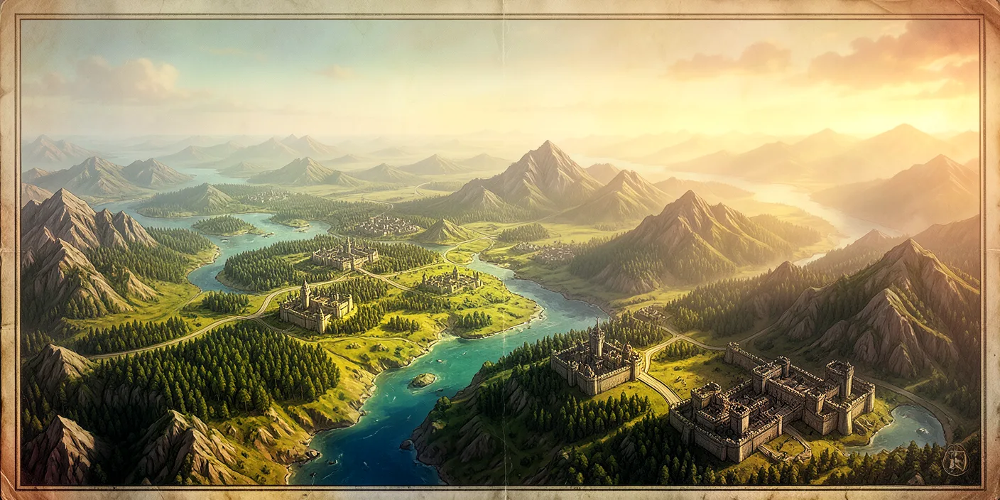

<p align="center">
  
</p>

<h1 align="center">Novus Mundus</h1>

<p align="center">
  <b>A persistent, event-driven strategy world on Solana, where empires rise, alliances form, and only the strategic survive.</b>
</p>

<p align="center">
  
</p>

Novus Mundus is a continuous, fully on-chain strategy game on Solana. Players command armies, capture castles, run dungeons, swing forge hammers, and compete in events to earn **NOVI**, the game's dual-purpose token that fuels both gameplay and real rewards. Core mechanics are deterministic: multipliers come from the golden-ratio family (φ, √φ, φ²), and there is no in-protocol RNG.

- **Multi-kingdom**: each kingdom is an independent world (its own teams, theme, leaderboards, events, castles, dungeons, arena seasons). New kingdoms launch periodically so late joiners compete on equal footing. Your `UserAccount` is per-wallet; your `PlayerAccount` is per-kingdom. The NOVI mint and MPL Core heroes are shared across kingdoms.
- **Theme-flexible**: five themes are defined in code (Medieval, Cyberpunk, SciFi, Modern, PostApocalyptic). Unit names and visuals change per kingdom theme; the strategy underneath stays identical.

> **📚 The authoritative documentation lives in [`docs/onchain/`](docs/onchain/README.md)**

---

## Documentation map

| Document | What it covers |
|---|---|
| **[On-chain docs hub](docs/onchain/README.md)** | The complete program reference (start here) |
| [Architecture](docs/onchain/01-architecture/overview.md) · [Accounts](docs/onchain/01-architecture/accounts.md) · [Instruction map](docs/onchain/01-architecture/instruction-map.md) | Module layout, all account types and PDA seeds, every instruction and discriminant |
| [Player journey](docs/onchain/02-player-journey/onboarding.md) | Onboarding, progression gates, the daily loop |
| [Economy](docs/onchain/03-economy/currencies.md) | Currencies, resource flow, time-value |
| [Formulas](docs/onchain/05-formulas/phi-scaling.md) | Golden-ratio scaling, combat math, time multipliers |
| [Reference](docs/onchain/06-reference/constants.md) | Balance constants, [error codes](docs/onchain/06-reference/error-codes.md), [PDA seeds](docs/onchain/06-reference/seeds.md) |
| [GAME_DESIGN.md](GAME_DESIGN.md) | Design intent and pillars |
| [TECHNICAL_ARCHITECTURE.md](TECHNICAL_ARCHITECTURE.md) | Framework, dispatch, account layouts, the three authorities |
| [TOKENOMICS.md](TOKENOMICS.md) · [TOKENOMICS_FLOW.md](TOKENOMICS_FLOW.md) | NOVI supply, sinks, and flows |
| [docs/WORLD_LORE.md](docs/WORLD_LORE.md) | The storyline |
| [cli/README.md](sdks/novus-mundus-ts/cli/README.md) | The `novus` CLI command reference |

---

## The world

<p align="center">
  
</p>

Each kingdom is a **persistent world**: progress never resets, events run continuously, and decisions compound. You command forces across multiple cities and push into the endgame systems below.

See [Architecture overview](docs/onchain/01-architecture/overview.md) and the [Player journey](docs/onchain/02-player-journey/onboarding.md) for the full picture.

---

## The NOVI economy

A two-account, dual-purpose token:

- **Locked NOVI** (`PlayerAccount.locked_novi`) is your gameplay fuel. Earned passively over time, from `purchase_novi`, and as starter/castle rewards; spent (and often burned) on hiring, combat, collection, travel speedups, builds, and crafting. **Non-withdrawable.**
- **Reserved NOVI** (`UserAccount.reserved_novi`) is your real earnings. Earned from event prizes, encounter loot, arena/dungeon rewards, and high-tier castle revenue; **withdrawable after a 7-day vesting period**, or convertible back to locked.

Passive farming only ever produces locked NOVI you cannot cash out; reserved NOVI must be earned through competition. Full breakdown: [Economy → Currencies](docs/onchain/03-economy/currencies.md) and [TOKENOMICS.md](TOKENOMICS.md).

---

## Systems at a glance

The 17 game systems, each documented in full under [`docs/onchain/04-systems/`](docs/onchain/04-systems/):

| System | Summary |
|---|---|
| [Combat](docs/onchain/04-systems/combat.md) | Deterministic PvP and PvE (encounters). Power = units × weapon coverage × research/hero/level bonuses |
| [Travel](docs/onchain/04-systems/travel.md) | Intracity (grid cells), intercity (between cities), and NOVI-paid teleport |
| [Heroes](docs/onchain/04-systems/heroes.md) | MPL Core hero NFTs; buffs scale √φ per level; mint / lock / level / burn |
| [Research](docs/onchain/04-systems/research.md) | 30-node tree across Battle / Economy / Growth, plus ascension |
| [Estates](docs/onchain/04-systems/estates.md) | 19 buildings, timed construction and upgrades, daily mini-game generation |
| [Expeditions](docs/onchain/04-systems/expeditions.md) | Timed mining / fishing / farming with skill-based strikes |
| [Forge](docs/onchain/04-systems/forge.md) | Staged-tempering equipment crafting; quality tiers Common to Mythic |
| [Sanctuary](docs/onchain/04-systems/sanctuary.md) | Send heroes to meditate for passive XP |
| [Rallies](docs/onchain/04-systems/rallies.md) | Coordinated multi-player attacks, capped per subscription tier |
| [Reinforcements](docs/onchain/04-systems/reinforcements.md) | Send troops to defend allies and castles |
| [Teams](docs/onchain/04-systems/teams.md) | Guilds with treasury, roles, and governance |
| [Events](docs/onchain/04-systems/events.md) | Kingdom-scoped leaderboard competitions with anti-Sybil eligibility |
| [Shop](docs/onchain/04-systems/shop.md) | Items, bundles, layered discounts, and SOL→NOVI purchase |
| [Subscription](docs/onchain/04-systems/subscription.md) | Four tiers (Rookie / Expert / Epic / Legendary) tuning caps and generation |
| [Arena](docs/onchain/04-systems/arena.md) | Seasonal ELO PvP with daily and master rewards |
| [Dungeon](docs/onchain/04-systems/dungeon.md) | "The Catacombs" roguelike PvE with relics and a weekly leaderboard |
| [Castle](docs/onchain/04-systems/castle.md) | Territorial control across 5 tiers; king / court / garrison roles |

Cross-cutting mechanics (the [time-of-day cycle](docs/onchain/03-economy/time-value.md), [golden-ratio scaling](docs/onchain/05-formulas/phi-scaling.md), the Fibonacci-spend efficiency bonus, happiness/abandonment, and the safebox) are covered in the economy and formula docs. Every balance number traces to [`constants.rs`](programs/novus_mundus/src/constants.rs), summarized in [Reference → Constants](docs/onchain/06-reference/constants.md).

---

## Running Locally (Development)

Run the full stack (Solana program, local validator, and web client) on your machine.

### Prerequisites

- **Rust** + the Solana toolchain (`solana-test-validator`, `cargo build-sbf`)
- **Bun** (used for the SDK, CLI, and web app)
- Internet access for the one-time external-program dump (clones MPL Core / ANS from mainnet)

### 1. Build the program

From the repo root:

```bash
cargo build-sbf          # -> target/deploy/novus_mundus.so
```

### 2. Dump external programs (one-time)

```bash
cd sdks/novus-mundus-ts
./scripts/dump-programs.sh    # downloads MPL Core, TLD House, ALT Name Service
```

### 3. Start the local validator

```bash
bun run validator:start       # solana-test-validator on http://127.0.0.1:8899
```

This loads the Novus Mundus program plus MPL Core, TLD House, and ALT Name Service, and clones the `.solana` TLD accounts from mainnet. Leave it running in its own terminal.

Every `validator:start` boots a **fresh ledger** (`start-validator.sh` always passes `--reset`), so game state does not persist across restarts; re-run step 4 after each start. `bun run validator:reset` additionally deletes the `.validator-ledger` directory; `bun run validator:debug` adds `--log`; `bun run validator:stop` stops it.

### 4. Initialize game data

In a second terminal, seed the kingdom with the `novus` CLI:

```bash
cd sdks/novus-mundus-ts
bun run novus airdrop dao --amount 100       # fund the DAO authority
bun run novus airdrop treasury --amount 100  # fund the treasury
bun run novus init all                       # GameEngine, cities, heroes, research, buildings, subscriptions, shop, dungeons, castles, arena, events
bun run novus status                         # verify each system reports OK
bun run novus create-player --tier beginner  # optional: register a CLI player (the web app handles wallet-based creation)
```

`init all` is create-or-skip: existing accounts are never overwritten. Both `init` and `update` first run a client-side seed-data preflight (`cli/lib/validate-data.ts`) that checks cross-references and enum ranges in `cli/data/*` and aborts with line-itemized errors before any account is written. See [cli/README.md](sdks/novus-mundus-ts/cli/README.md) for the full command reference.

### 5. Run the web client

```bash
cd apps/web
bun install
bun dev                       # -> http://localhost:3000
```

The web app reads `apps/web/.env.local` and ships pointing at the local validator. Client-facing variables:

```
NEXT_PUBLIC_RPC_URL=http://127.0.0.1:8899   # local validator
NEXT_PUBLIC_WS_URL=ws://127.0.0.1:8900      # local validator websocket
NEXT_PUBLIC_KINGDOM_ID=0                    # optional, defaults to 0
```

SIWS login and co-signed instructions (dungeon enter, expedition strike, arena matches, estate daily activity) additionally need **server-only** secrets: `GAME_AUTHORITY_SECRET_KEY`, `GAME_AUTHORITY_RNG_SECRET`, and `SESSION_SECRET`. On a local validator `GAME_AUTHORITY_SECRET_KEY` is the DAO authority keypair (`sdks/novus-mundus-ts/keys/dao-authority.json`). Never prefix these with `NEXT_PUBLIC_`; the `game_authority` role is documented in [TECHNICAL_ARCHITECTURE.md](TECHNICAL_ARCHITECTURE.md).

Open `/world` to see the realm map. Point `NEXT_PUBLIC_RPC_URL` at devnet to run against a deployed kingdom instead.

### 6. Smoke-test for DOM-nesting bugs (optional)

A Playwright smoke test walks every route and catches invalid DOM nesting (e.g. a `<button>` inside a `<button>`) that `tsc` and linting miss. It runs against the live app, so the **full stack from steps 1–5 must be up**.

```bash
cd apps/web
bunx playwright install chromium   # one-time: download the browser
bun run test:smoke                 # walks all routes, fails on nesting/hydration errors
```

The dev server from step 5 is reused if already running; otherwise Playwright starts one. Override the target with `SMOKE_BASE_URL`.

---

## Getting Started (as a player)

1. **Connect a wallet** (Phantom, Backpack, any Solana wallet) and fund it with SOL.
2. **Choose a kingdom** by theme and age: new players pick a recently launched kingdom for a fair start; veterans can run several with one wallet.
3. **Register**: `init_user` (once per wallet) then `init_player` (per kingdom), receiving 1M starter locked NOVI and 24-hour new-player protection.
4. **Play**: hire units, keep them happy, attack diverse opponents, collect resources, and claim a `.solana` name.
5. **Compete**: start with daily events (7-day eligibility), then weekly (30-day) and seasonal (60-day+).
6. **Grow**: subscribe for faster generation, join a team, invest in research, mint heroes, build your estate, run dungeons, claim a castle, and fight arena seasons.

Full flow: [Player journey → Onboarding](docs/onchain/02-player-journey/onboarding.md).

---

## Fair Play Commitment

- **Multi-kingdom**: new kingdoms launch periodically; everyone can start fresh
- **Kingdom-scoped competition**: you compete only with players who started when you did
- Free players earn through daily challenges
- Subscriptions accelerate progression but don't guarantee victories
- Deterministic core mechanics
- Transparent on-chain actions and DAO governance

---

## Important Notes

- **Price disclaimer**: any SOL/NOVI figures in the docs are illustrative. Real prices depend on market conditions, DAO governance, and economic balancing.
- **Not financial advice**: Novus Mundus is a game and NOVI is a gaming token, intended as entertainment, not investment. Play responsibly.
- **Continuous evolution**: mechanics, events, and features change with community feedback, governance, and competitive balance.

---

**Framework**: Pinocchio · **Program**: [`programs/novus_mundus/`](programs/novus_mundus/)
