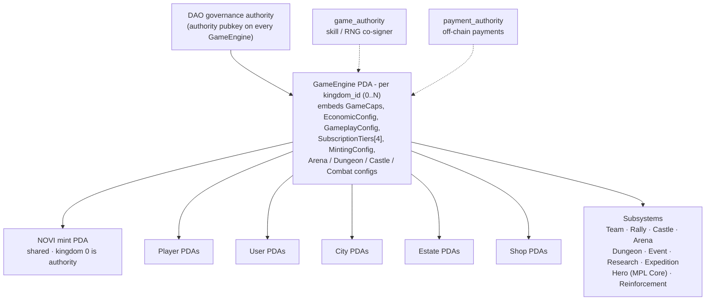
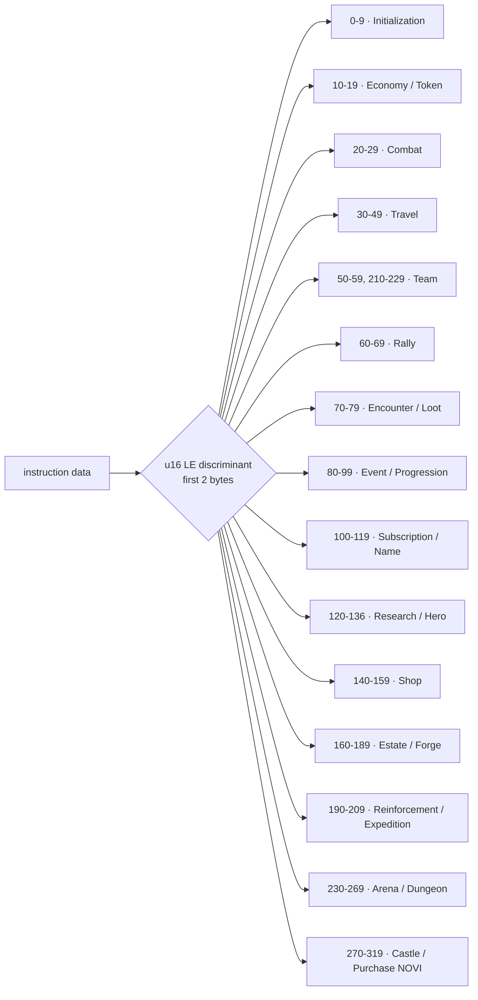

# Novus Mundus: Technical Architecture

> **Solana smart-contract implementation using the Pinocchio framework. Multi-kingdom, MPL-Core hero NFTs, Pyth/Switchboard oracle pricing, ~71,800 LOC across 285 Rust files.**

---

## Table of Contents

1. [Architecture Overview](#architecture-overview)
2. [Framework and Dependencies](#framework-and-dependencies)
3. [Module Structure](#module-structure)
4. [Instruction Dispatch](#instruction-dispatch)
5. [Account Structures](#account-structures)
6. [PDA Seeds](#pda-seeds)
7. [Logic Modules](#logic-modules)
8. [Deterministic Math System](#deterministic-math-system)
9. [Time-of-Day System](#time-of-day-system)
10. [Token Flow (NOVI)](#token-flow-novi)
11. [Oracle Pricing](#oracle-pricing)
12. [Security Model](#security-model)
13. [Compute Optimization](#compute-optimization)

---

## Architecture Overview

### System Components



<details>
<summary>ASCII version</summary>

```
┌──────────────────────────────────────────────────────────────────┐
│                  DAO governance authority                        │
│   (off-chain process; on-chain represented as `authority` pubkey │
│   stored on every kingdom's GameEngine account)                  │
└──────────────────────────────┬───────────────────────────────────┘
                               │
                               ▼
┌──────────────────────────────────────────────────────────────────┐
│              GameEngine PDA per kingdom_id (0..N)                │
│  - Embedded sub-configs: GameCaps, EconomicConfig, GameplayConfig│
│    SubscriptionTiers[4], MintingConfig, ThemeConfig,             │
│    NoviPurchaseConfig, ArenaConfig, ExpeditionConfig,            │
│    DungeonConfig, CastleConfig, CombatConfig.                    │
│  - Stores DAO authority, payment_authority, game_authority,      │
│    treasury_wallet pubkeys.                                      │
│  - Acts as NOVI mint authority for kingdom 0 (mint is shared).   │
└──────────────────────────────┬───────────────────────────────────┘
                               │
   ┌───────────┬───────────────┼───────────────┬─────────────┐
   ▼           ▼               ▼               ▼             ▼
┌────────┐ ┌─────────┐ ┌────────────┐ ┌─────────────┐ ┌──────────┐
│ Player │ │  User   │ │   Cities   │ │   Estates   │ │   Shop   │
│  PDAs  │ │  PDAs   │ │   PDAs     │ │    PDAs     │ │   PDAs   │
└────────┘ └─────────┘ └────────────┘ └─────────────┘ └──────────┘

  + Per subsystem: Team, Rally, Location, Encounter, Loot, Event,
    Research, HeroTemplate, HeroCollection (MPL Core), HeroMintReceipt,
    Castle, CastleGarrison, KingRegistry, CourtPosition,
    Arena (Season, Participant, Loadout), DungeonRun, DungeonTemplate,
    DungeonLeaderboard, Expedition, Reinforcement, SanctuaryMeditation,
    ForgeConfig, ForgeSession, NameRecord, TeamCastleReward,
    AllowedToken, PlayerPurchase, etc.
```

</details>

### Key Design Principles

1. **Pinocchio, not Anchor** — every account validation is hand-written. There is no `#[account]` macro; the codebase uses `unsafe { *::load(&data) }` and a set of `*::load_checked_*` helpers.
2. **Multi-kingdom support** — every gameplay PDA is keyed by the kingdom's `GameEngine` pubkey, so multiple kingdoms can run side-by-side. The NOVI mint PDA, however, has no kingdom_id seed and is therefore shared across kingdoms (only kingdom 0 ever becomes the mint authority).
3. **Section-extension player layout** — `PlayerAccount` is `PlayerCore` (528 bytes, always present) plus optional extension sections (research, inventory, team, rally, heroes, cosmetics, court) that are reallocated on demand. Total `MAX_SIZE = 1248` bytes.
4. **Account-type discriminator** — every account stores its `AccountKey` enum value in byte 0. (Note: `AccountKey::validate` exists but is **not invoked anywhere in production code**.)
5. **Basis-point math, with float exceptions** — multipliers are u16/u32 basis points (10000 = 100%). Some logic (`logic/combat.rs::inflict_damage`, `logic/progression.rs`, `logic/stamina.rs`, `logic/location.rs` Haversine) still uses `f64` via `libm`, which has determinism implications.
6. **Saturating math** — `checked_add` / `saturating_*` is the dominant pattern.
7. **MPL Core for hero NFTs** — heroes are not on-chain accounts owned by this program; they are MPL Core (`p-core`) assets. The program stores per-template metadata (`HeroTemplate`), a shared `HeroCollection`, and per-(player, template) `HeroMintReceipt` PDAs to enforce mint caps.

---

## Framework and Dependencies

```toml
# programs/novus_mundus/Cargo.toml
[dependencies]
pinocchio = { version = "0.9.2", default-features = false }
pinocchio-token = "0.4.0"
pinocchio-system = "0.3.0"
pinocchio-associated-token-account = "0.2.0"
pinocchio-pubkey = "0.3.0"
pinocchio-log = "0.5.1"
p-core = { path = "../../sdks/p-core", features = ["no-panic-handler"] }   # MPL Core
p-pyth = { path = "../../sdks/p-pyth", features = ["no-panic-handler"] }   # Pyth price feeds
switchboard-on-demand = { version = "0.10.0", features = ["pinocchio"] }    # Switchboard On-Demand
alt-name-service = { path = "../../sdks/alt-name-service" }                 # ANS / .alldomains
tld-house = { path = "../../sdks/tld-house" }                               # TLD validation
libm = "0.2"

[features]
no-entrypoint = []
no-idl = []
no-log-ix-name = []
cpi = ["no-entrypoint"]
default = []
test-bpf = []
dao-enabled = []   # Declared but NOT used in source
```

---

## Module Structure

```
programs/novus_mundus/src/
├── lib.rs                    # Entry point + instruction dispatcher (u16 LE discriminator)
├── constants.rs              # Golden ratio, PDA seeds, balance/tier constants
├── types.rs                  # Theme, UnitType, TravelType, EncounterRarity enums
├── error.rs                  # GameError enum with ~240 variants (6000-8200 range)
├── token_helpers.rs          # ATA creation helper (CreateIdempotent)
│
├── state/                    # Account structures and per-struct load_checked helpers
│   ├── mod.rs                # AccountKey discriminator enum, Loaded/LoadedMut wrappers
│   ├── game_engine.rs        # GameEngine + embedded sub-configs
│   ├── player.rs             # PlayerAccount (PlayerCore + extension sections)
│   ├── city.rs               # CityAccount with embedded terrain anchors
│   ├── team.rs               # TeamAccount, TeamMemberSlot, TeamInvite, TreasuryRequest
│   ├── location.rs           # LocationAccount (grid cell)
│   ├── rally.rs              # RallyAccount, RallyParticipant
│   ├── reinforcement.rs      # ReinforcementAccount
│   ├── encounter.rs          # EncounterAccount
│   ├── event.rs              # EventAccount, EventParticipationAccount
│   ├── progression.rs        # ProgressionAccount
│   ├── loot.rs               # LootAccount
│   ├── research.rs           # ResearchTemplate, ResearchProgress
│   ├── hero.rs               # HeroTemplate, HeroCollection (MPL Core), HeroMintReceipt
│   ├── shop.rs               # ShopConfig, ShopItem, Bundle, Sales (Flash/Daily/Weekly/Seasonal),
│   │                         #   DAOPromotion, PlayerPurchase, AllowedToken
│   ├── inventory.rs          # InventoryItem
│   ├── estate.rs             # EstateAccount with embedded buildings
│   ├── expedition.rs         # ExpeditionAccount (Mining/Fishing/Farming)
│   ├── arena.rs              # ArenaSeason, ArenaParticipant, ArenaLoadout
│   ├── dungeon.rs            # DungeonRun, DungeonTemplate, DungeonLeaderboard
│   └── castle.rs             # CastleAccount, CastleGarrison, KingRegistry, CourtPosition,
│                             #   TeamCastleReward
│
├── logic/                    # Pure business logic (no AccountInfo)
│   ├── mod.rs
│   ├── golden_math.rs        # PHI / GOLDEN_ROOT / PHI_SQUARED / inverses (f64 via libm)
│   ├── fibonacci.rs          # is_fibonacci + bonus helpers
│   ├── time_cycle.rs         # TimePeriod, TimeOfDay multipliers
│   ├── combat.rs             # damage, abandonment, deployment, weapon-set math
│   ├── consume.rs            # NOVI consumption with Fibonacci efficiency
│   ├── rewards.rs            # Loot, fragment/gem drops
│   ├── progression.rs        # XP, level scaling, level-based unlocks
│   ├── location.rs           # Haversine distance, intercity/teleport cost
│   ├── eligibility.rs        # Event eligibility checks
│   ├── stamina.rs            # Encounter stamina regen
│   ├── calculations.rs       # Networth, share calculations
│   └── safe_math.rs          # apply_bp / apply_bp_penalty / chain_bp (no_panic helpers)
│
├── processor/                # Instruction handlers — one file per ix
│   ├── mod.rs
│   ├── initialization/       # game_engine, player, user, city, batch_cities,
│   │                         #   close_registration, update_game_config, set_terrain, append_terrain
│   ├── economy/              # update_locked_novi, hire_units, collect_resources, purchase_equipment,
│   │                         #   mint_for_prize, purchase_stamina, transfer_cash, vault_transfer
│   ├── token/                # reserved_to_locked, withdraw_reserved
│   ├── combat/               # attack_player, attack_encounter
│   ├── travel/               # intercity_start/complete/cancel/teleport/speedup,
│   │                         #   intracity_start/complete/cancel
│   ├── team/                 # create, join, leave, invite/accept/decline/cancel_invite,
│   │                         #   kick, disband, transfer_leadership, deposit/withdraw_treasury,
│   │                         #   treasury_request_withdraw/approve/reject/execute/cancel,
│   │                         #   update_settings, update_treasury_settings, set_motd,
│   │                         #   promote/demote_member
│   ├── rally/                # create, join, execute, leave, cancel, process_return,
│   │                         #   speedup, close_rally
│   ├── reinforcement/        # send, process_arrival, recall, relieve, process_return, speedup
│   ├── encounter/            # spawn
│   ├── loot/                 # claim
│   ├── event/                # create, join, finalize, claim_prize
│   ├── progression/          # claim_daily_reward
│   ├── subscription/         # purchase, update_tier, downgrade_expired
│   ├── name/                 # set_player, set_team, remove/update name
│   ├── research/             # initialize_template, create_progress, start, complete,
│   │                         #   speed_up, cancel, update_template, ascend
│   ├── hero/                 # create_template, create_collection, mint, lock, unlock,
│   │                         #   level_up, assign_defensive, burn, update_supply_cap
│   ├── sanctuary/            # start_meditation, claim_meditation, speedup_meditation
│   ├── shop/                 # initialize_config, create/update_item, create/update_bundle,
│   │                         #   create_flash_sale, purchase_item, purchase_bundle,
│   │                         #   purchase_flash_sale, close_sale, create_daily_deal,
│   │                         #   rotate_daily_deal, create_weekly_sale, create_seasonal_sale,
│   │                         #   create_dao_promotion, update_config, activate_sale,
│   │                         #   create/update/close_allowed_token, purchase_novi
│   ├── estate/               # create, build, upgrade, complete, buy_plot, daily_claim,
│   │                         #   daily_activity, convert_materials, speedup, recover_troops
│   ├── forge/                # initialize, start_craft, strike, abandon_craft, equip
│   ├── expedition/           # start, strike, claim, abort, speedup
│   ├── arena/                # create_season, join_season, update_loadout, challenge_player,
│   │                         #   claim_daily_reward, claim_master_reward, close_season
│   ├── dungeon/              # enter, attack, attack_multi, interact, choose_relic, flee, claim,
│   │                         #   resume, create_template, create_leaderboard, claim_leaderboard_prize
│   ├── castle/               # create_castle, claim_vacant_castle, appoint/dismiss/resign_court,
│   │                         #   initiate/cancel/complete_upgrade, join/leave/relieve_garrison,
│   │                         #   claim_castle_rewards, claim_garrison_loot,
│   │                         #   garrison/court/rewards_cleanup, finalize_transition,
│   │                         #   update_castle_config/status, force_remove_king, attack_castle
│   └── utils/leaderboard/    # Helpers for arena/dungeon leaderboards
│
├── events/                   # Event emit! macro payloads (one file per subsystem)
│
├── validation/               # require_signer, require_owner, require_writable,
│                             #   require_data_len, require_empty, require_initialized,
│                             #   require_pda, require_key_match, derive_pda
│
└── helpers/                  # account close, MPL-Core parsing, name service, oracle helpers,
                              #   estate, dungeon, hero, inventory, kingdom, token_ops,
                              #   event_scoring, nft_parser
```

---

## Instruction Dispatch

The dispatcher uses a **u16 little-endian** discriminator (first 2 bytes), not a single byte. See `src/lib.rs:42-298`.



```rust
pub fn process_instruction(
    program_id: &Pubkey,
    accounts: &[AccountInfo],
    data: &[u8],
) -> ProgramResult {
    if program_id != &ID { return Err(ProgramError::IncorrectProgramId); }
    if data.len() < 2 { return Err(ProgramError::InvalidInstructionData); }
    let discriminant = u16::from_le_bytes([data[0], data[1]]);
    let instruction_data = &data[2..];

    match discriminant {
        // Initialization (0-9)
        0 => processor::initialization::game_engine::process(...),
        1 => processor::initialization::player::process(...),
        2 => processor::initialization::user::process(...),
        3 => processor::initialization::city::process(...),
        4 => processor::initialization::close_registration::process(...),
        5 => processor::initialization::batch_cities::process(...),
        6 => processor::initialization::update_game_config::process(...),
        7 => processor::initialization::set_terrain::process(...),
        8 => processor::initialization::append_terrain::process(...),

        // Economy (10-19) + Token (15-19 overlap)
        10 => processor::economy::update_locked_novi::process(...),
        11 => processor::economy::hire_units::process(...),
        12 => processor::economy::collect_resources::process(...),
        13 => processor::economy::purchase_equipment::process(...),
        14 => processor::economy::mint_for_prize::process(...),
        15 => processor::token::reserved_to_locked::process(...),
        16 => processor::token::withdraw_reserved::process(...),
        17 => processor::economy::purchase_stamina::process(...),
        18 => processor::economy::transfer_cash::process(...),
        19 => processor::economy::vault_transfer::process(...),

        // Combat (20-29)
        20 => processor::combat::attack_player::process(...),
        21 => processor::combat::attack_encounter::process(...),

        // Travel — Intercity (30-39), Intracity (40-49)
        30..=42 => /* see lib.rs */,

        // Team (50-59), extended team (210-229)
        50..=59 => /* ... */,
        210..=221 => /* ... */,

        // Rally (60-69), Encounter (70-79), Loot (71), Event (80-89),
        // Progression (90-99), Subscription (100-109), Name (110-119),
        // Research (120-129), Hero (130-136), Sanctuary (137-139),
        // Shop (140-159), Estate (160-179), Forge (180-189),
        // Reinforcement (190-199), Expedition (200-209),
        // Arena (230-236), Dungeon (250-269), Castle (270-299),
        // Token Economy / Purchase NOVI (300), Hero Burn (310-319).

        _ => Err(ProgramError::InvalidInstructionData),
    }
}
```

Full table: see `src/lib.rs:62-296` for the exact discriminant for every instruction.

---

## Account Structures

### Account discriminator (`state/mod.rs`)

Every account stores an `AccountKey` enum value in byte 0:

```rust
#[repr(u8)]
pub enum AccountKey {
    GameEngine = 1, Player = 2, User = 3, City = 4, Team = 5, TeamMemberSlot = 6,
    TeamInvite = 7, TreasuryRequest = 8, Location = 9, Encounter = 10, Loot = 11,
    Rally = 12, RallyParticipant = 13, Reinforcement = 14, Event = 15,
    EventParticipation = 16, ResearchTemplate = 17, ResearchProgress = 18,
    HeroTemplate = 19, HeroCollection = 20, HeroMintReceipt = 21, ShopConfig = 22,
    ShopItem = 23, ShopBundle = 24, FlashSale = 25, DailyDeal = 26, WeeklySale = 27,
    SeasonalSale = 28, DaoPromotion = 29, AllowedToken = 30, PlayerPurchase = 31,
    Estate = 32, Expedition = 33, ArenaSeason = 34, ArenaParticipant = 35,
    ArenaLoadout = 36, DungeonRun = 37, DungeonTemplate = 38, DungeonLeaderboard = 39,
    Castle = 40, CastleGarrison = 41, KingRegistry = 42, CourtPosition = 43,
    TeamCastleReward = 44, ForgeConfig = 45, ForgeSession = 46, NameRecord = 47,
    SanctuaryMeditation = 48,
}
```

### `GameEngine` (`state/game_engine.rs`)

PDA seeds: `["game_engine", kingdom_id_le_bytes]`. Stores:

```rust
#[repr(C)]
pub struct GameEngine {
    pub account_key: u8,
    pub kingdom_id: u16,
    pub _padding_kingdom: [u8; 4],
    pub kingdom_name: [u8; 32],
    pub kingdom_name_len: u8,
    pub _padding_name: [u8; 7],
    pub kingdom_start_time: i64,
    pub registration_open: bool,
    pub _padding_reg: [u8; 7],
    pub registration_closes_at: i64,
    pub kingdom_theme: Theme,                 // Medieval/Cyberpunk/SciFi/Modern/PostApocalyptic
    pub _padding_theme: [u8; 7],
    pub authority: Pubkey,                    // DAO governance authority (gates update_* ix)
    pub payment_authority: Pubkey,            // Backend for off-chain payments
    pub game_authority: Pubkey,               // Backend co-signer for skill/RNG-influenced ix
    pub treasury_wallet: Pubkey,              // SOL recipient for subscriptions
    pub bump: u8,
    pub _padding0: [u8; 7],
    pub novi_mint: Pubkey,                    // Shared across kingdoms (seed has no kingdom_id)
    pub novi_mint_bump: u8,
    pub _padding1: [u8; 7],
    pub version: u64,
    pub paused: bool,
    pub _padding2: [u8; 7],
    pub total_players: u64,
    pub max_players: u64,
    pub allow_offchain_payments: bool,
    pub _padding3: [u8; 7],
    pub usd_price_cents: u64,

    // Embedded sub-configs — DAO-controlled via update_game_config (instr 6).
    pub caps: GameCaps,
    pub economic_config: EconomicConfig,
    pub gameplay_config: GameplayConfig,
    pub subscription_tiers: [SubscriptionTier; 4],   // Rookie, Expert, Epic, Legendary
    pub minting_config: MintingConfig,
    pub theme_config: ThemeModifierConfig,
    pub novi_purchase_config: NoviPurchaseConfig,
    pub arena_config: ArenaConfig,
    pub expedition_config: ExpeditionConfig,
    pub dungeon_config: DungeonConfig,
    pub castle_config: CastleConfig,
    pub combat_config: CombatConfig,
}
```

### `PlayerAccount` (`state/player.rs`)

`PlayerAccount` is `PlayerCore` (always present) + optional **extension sections** appended end-to-end. Sections are reallocated on demand.

```
┌─ PlayerCore ──────────────────────────────── 528 bytes
│  account_key, game_engine, owner, created_at,
│  name (alt-name domain or "Player #N"), extensions u32 bitfield,
│  locked_novi, units (defensive + operative tiers 1-3),
│  weapons / produce / vehicles / armor, cash_on_hand / cash_in_vault,
│  happiness, current_lat/long (f64), travel state,
│  subscription_tier + end, level/xp/reputation/networth,
│  stamina, gems, fragments, stats, protection,
│  mirrored research/hero buff bps, rally aggregates, reinforcement aggregates.
│
│  (Sections are appended in unlock order — the offset chain in player.rs:)
├─ ResearchSection           (48 b, EXT_RESEARCH   = 0x0001)
├─ InventorySection         (144 b, EXT_INVENTORY  = 0x0004)
├─ TeamSection              (112 b, EXT_TEAM       = 0x0010)
├─ RallySection              (80 b, EXT_RALLY      = 0x0008)
├─ HeroesSection            (208 b, EXT_HEROES     = 0x0002)
├─ CosmeticsSection          (80 b, EXT_COSMETICS  = 0x0020)
└─ CourtSection              (48 b, EXT_COURT      = 0x0040)

MAX_SIZE = 1248 bytes (verified by static assertions in player.rs).
```

The `extensions: u32` bitfield in `PlayerCore` records which sections are present so consumers can `unlock_extension_if_eligible` and the account is reallocated accordingly.

### `UserAccount` (`state/player.rs`)

PDA seeds: `["user", owner_wallet]`. Stores withdrawable token state:
- `reserved_novi` (cached balance)
- `reserved_novi_earned_at` (vesting basis; updated by `mint_for_prize` and `purchase_novi` so the 7-day window starts at the time of earning/purchase)
- `total_reserved_earned`
- `novi_purchase_streak`, `novi_last_purchase_day`, `novi_purchased_today`

### `CastleAccount` (`state/castle.rs`)

PDA seeds: `["castle", game_engine, city_id_le, castle_id_le]`. Holds king, team, court_count, garrison_count, status (Vacant/Contest/Protected/Vulnerable/Transitioning), tier (Outpost/Keep/Stronghold/Fortress/Citadel), upgrade state, daily reward rates.

### Hero NFTs

Heroes are **MPL Core assets**, not on-chain accounts owned by this program. The program stores:

- `HeroTemplate` (`["hero_template", template_id_le]`) — base stats, mint cost, supply cap.
- `HeroCollection` (`["hero_collection"]`) — single shared MPL Core collection.
- `HeroMintReceipt` (`["hero_mint_receipt", player_account, template_id_le]`) — per-player per-template cap enforcer.

Buff scaling reads the level off the NFT's MPL Core attributes (via `helpers/nft_parser.rs`).

### Subsystem accounts (brief)

- **Team**: `TeamAccount` (`["team", game_engine, team_id_le]`) + `TeamMemberSlot` (`["team_slot", team, slot_index]`) + `TeamInvite` + `TreasuryRequest`.
- **Rally**: `RallyAccount` + `RallyParticipant` (`["rally_participant", rally, owner]`).
- **Reinforcement**: `ReinforcementAccount`.
- **Estate**: one `EstateAccount` per player with embedded buildings (Mansion, Barracks, Workshop, Vault, Dock, Forge, Market, Academy, Arena, Sanctuary, Observatory, Treasury, Citadel, Camp, Mine, Farm, Stables, Infirmary, Catacombs).
- **Forge**: `ForgeConfig` (per-template) and `ForgeSession` (per-craft).
- **Expedition**: `ExpeditionAccount` (`["expedition", owner]`), mining/fishing/farming.
- **Arena**: `ArenaSeason` per kingdom (`["arena_season", game_engine, season_id]`), `ArenaParticipant` per (season, player), `ArenaLoadout` per player.
- **Dungeon**: `DungeonTemplate` (admin-defined), `DungeonRun` per (player), `DungeonLeaderboard` per (kingdom, week).
- **Sanctuary**: `SanctuaryMeditation` per (player, hero).
- **Shop**: `ShopConfig`, `ShopItem`, `BundleAccount`, `FlashSaleAccount`, `DailyDealAccount`, `WeeklySaleAccount`, `SeasonalSaleAccount`, `DAOPromotionAccount`, `PlayerPurchaseAccount`, `AllowedTokenAccount`.

---

## PDA Seeds

All gameplay PDAs are scoped by either `game_engine` (kingdom) or `owner`. The full constant list lives in `src/constants.rs:107-150`. Key seeds:

| Account | Seeds |
|---|---|
| GameEngine | `["game_engine", kingdom_id_le]` |
| NOVI mint | `["novi_mint"]` *(no kingdom_id — shared)* |
| Player | `["player", game_engine, owner]` |
| User | `["user", owner]` |
| City | `["city", game_engine, city_id_le]` |
| Team | `["team", game_engine, team_id_le]` |
| TeamMemberSlot | `["team_slot", team, slot_index_le]` |
| TeamInvite | `["team_invite", team, invitee]` |
| TreasuryRequest | `["treasury_request", team, requester]` |
| Location | `["location", game_engine, city_id, grid_lat, grid_long]` |
| Rally | `["rally", game_engine, creator, rally_id]` |
| RallyParticipant | `["rally_participant", rally, owner]` |
| Reinforcement | `["reinforcement", sender, receiver]` |
| Encounter | `["encounter", game_engine, encounter_id]` |
| Event | `["event", game_engine, event_id]` |
| EventParticipation | `["event_participation", event, player]` |
| Loot | `["loot", encounter, attacker]` |
| ResearchProgress | `["research", player]` |
| ResearchTemplate | `["research_template", research_id]` |
| HeroTemplate | `["hero_template", template_id_le]` |
| HeroCollection | `["hero_collection"]` |
| HeroMintReceipt | `["hero_mint_receipt", player, template_id_le]` |
| ShopConfig | `["shop_config", game_engine]` |
| ShopItem | `["shop_item", game_engine, item_id_le]` |
| Bundle | `["bundle", game_engine, bundle_id_le]` |
| FlashSale | `["flash_sale", game_engine, sale_id_le]` |
| DailyDeal | `["daily_deal", game_engine, day_le]` |
| AllowedToken | `["allowed_token", game_engine, token_mint]` |
| PlayerPurchase | `["player_purchase", player, item_id_le]` |
| Inventory | `["inventory", player]` |
| Estate | `["estate", game_engine, owner]` |
| Expedition | `["expedition", owner]` |
| Castle | `["castle", game_engine, city_id_le, castle_id_le]` |
| KingRegistry | `["king_registry", game_engine, king]` |
| CourtPosition | `["court", castle, position_index]` |
| Garrison | `["garrison", castle, contributor]` |
| TeamCastleReward | `["team_castle_reward", castle, player]` |
| ArenaSeason | `["arena_season", game_engine, season_id_le]` |
| ArenaParticipant | `["arena_participant", season, player]` |
| ArenaLoadout | `["arena_loadout", player]` |
| DungeonRun | `["dungeon_run", player]` |
| DungeonTemplate | `["dungeon_template", dungeon_id_le]` |
| DungeonLeaderboard | `["dungeon_leaderboard", game_engine, week_le]` |

The `bump` is always stored on the account and recomputed via `validate_pda` (`create_program_address` path), but `load_checked_*` currently uses `find_program_address` (slow).

---

## Logic Modules

### `golden_math.rs`

Golden-ratio constants (f64) and helpers; live in `constants.rs:52-69` as `pub const`.

```rust
pub const PHI: f64           = 1.618033988749895;
pub const GOLDEN_ROOT: f64   = 1.2720196495140689;  // √φ
pub const PHI_SQUARED: f64   = 2.618033988749895;
pub const PHI_INVERSE: f64   = 0.6180339887498949;
pub const PHI_SQUARED_INVERSE: f64 = 0.3819660112501051;
pub const PHI_CUBED_INVERSE:  f64 = 0.2360679774997897;
```

### `combat.rs`

Damage / abandonment / deployment math. Mix of integer bp math and `f64` paths.

### `consume.rs`

NOVI consumption with optional Fibonacci efficiency bonus (`is_fibonacci` ⇒ `× GOLDEN_ROOT`).

### `safe_math.rs`

`apply_bp`, `apply_bp_penalty`, `chain_bp` — overflow-safe basis-point helpers returning `Option<u64>`.

### `time_cycle.rs`

7-period day cycle (Deep Night / Dawn / Morning / Midday / Afternoon / Dusk / Evening) derived from `Clock::unix_timestamp + longitude/15`.

### `fibonacci.rs`

`is_fibonacci(n)` using the `5n² ± 4` perfect-square test.

---

## Deterministic Math System

Multipliers are stored as integers (u16/u32 basis points):

- `10000` = 100% (1.0×)
- `16180` = 161.8% (φ)
- `12720` = 127.2% (√φ)
- `6180` = 61.8% (1/φ)

```rust
pub fn apply_bp(base: u64, bp: u64) -> Option<u64> {
    (base as u128).checked_mul(bp as u128)
        .and_then(|v| v.checked_div(10_000))
        .and_then(|v| u64::try_from(v).ok())
}
```

**Determinism caveats**:

- `logic/combat.rs::inflict_damage` uses `f64` for percentage splits.
- `logic/progression.rs:45` and `logic/stamina.rs:59` cast `f64 → u64`.
- `logic/location.rs` uses `libm::sin/cos/asin/sqrt` (f64 Haversine).
- These are deterministic on current SBF but brittle across future toolchains. The codebase is migrating to integer bps.

---

## Time-of-Day System

Local hour = `(utc_hours + longitude/15 + 24) % 24`. The hour maps into one of seven `TimePeriod` variants, which select activity-specific multipliers used in combat/encounter/expedition/dungeon math.

---

## Token Flow (NOVI)

### NOVI mint authority

- The NOVI mint is a PDA derived from `["novi_mint"]` — no kingdom_id. It exists exactly once per program deployment.
- Mint authority = `GameEngine` PDA. The mint is initialized in `processor::initialization::game_engine::process` during the **first** kingdom's creation. Subsequent kingdom inits skip mint creation.

### Mint flow

NOVI can be minted from these processors, all signed by the `GameEngine` PDA via `seeds!(GAME_ENGINE_SEED, kingdom_id_le, bump)`:

- `processor::initialization::player::process` — starter NOVI (`STARTER_LOCKED_NOVI = 1_000_000`).
- `processor::economy::update_locked_novi::process` — time-based generation (rate from `subscription_tiers[tier].locked_novi_per_5min`, capped by `max_locked_novi`).
- `processor::economy::mint_for_prize::process` — DAO-controlled prize/marketing/dev/treasury/liquidity mints with per-purpose caps.
- `processor::shop::purchase_novi::process` — SOL→NOVI swap with optional Pyth/Switchboard pricing and DAO-set fallback.
- `processor::castle::claim_castle_rewards::process` — castle revenue (locked or reserved depending on castle tier).
- `processor::castle::cancel_upgrade::process` — refunds.
- `processor::arena::{claim_daily_reward, claim_master_reward}::process` — PvP rewards.
- `processor::dungeon::claim_leaderboard_prize::process` — weekly leaderboard.
- `processor::event::claim_prize::process` — generic event prizes.

### Burn flow

NOVI is burned by `processor::token::reserved_to_locked::process` (converts reserved→locked by burning reserved supply and crediting locked balance — implementation detail) and by various gameplay processors that consume tokens (hire_units burns the cost, purchase_stamina burns the price).

### Locked vs Reserved

| Token bucket | Stored where | Withdrawable? | Notes |
|---|---|---|---|
| Locked NOVI (`PlayerAccount.locked_novi`) | Token account owned by `PlayerAccount` PDA | No | Gameplay fuel. |
| Reserved NOVI (`UserAccount.reserved_novi`) | Token account owned by `UserAccount` PDA | Yes, after 7-day vesting | Earned from events, prizes, purchases. |

`reserved_novi_earned_at` is the vesting basis.

---

## Oracle Pricing

Used by `processor::shop::purchase_novi` and `helpers::token_ops::process_token_payment_flow` (the generic token-payment helper for shop purchases priced in non-NOVI SPL tokens).

- **Pyth path** (`p-pyth`): `load_pyth_price_with_confidence(data, current_slot, max_staleness_slots, max_confidence_bps)`. Detected by magic number `0xa1b2c3d4` at offset 0.
- **Switchboard On-Demand path**: `QuoteVerifier::new().slothash_sysvar(...).ix_sysvar(...).clock_slot(...).queue(...).max_age(...).verify_account(...)`.
- Token decimals are read from the SPL mint account at offset 44.
- Slippage protection: each purchase instruction includes a `max_lamports` value that the computed price must not exceed.

---

## Security Model

### Manual account validation

Every processor must, before reading account data:

1. `require_signer(account)` — for the signing wallet(s).
2. `require_writable(account)` — for mutable accounts.
3. `require_owner(account, expected_owner_program_id)` — for program-owned PDAs (and for token accounts, owned by SPL Token).
4. PDA re-derivation via `Account::load_checked_*` or `require_pda` — verifies the account's address matches the seeds.
5. `AccountKey::validate(data, expected_key)` — **not currently invoked**.
6. For token CPIs: `validate_token_account_owner(ata, expected_pda_owner)` — verify the SPL Token account belongs to the correct PDA.

The codebase has helpers for all six but they are not consistently invoked; there are ~161 `unsafe` casts that bypass `load_checked`.

### Anti-Sybil event eligibility

```rust
pub fn check_event_eligibility(
    player: &PlayerAccount,
    event: &EventAccount,
    now: i64,
) -> bool {
    if (now - player.created_at) < event.min_account_age { return false; }
    if player.total_attacks < event.min_attacks { return false; }
    if player.total_received > 0 {
        let ratio = player.total_received / player.total_sent.max(1);
        if ratio > event.max_transfer_ratio { return false; }
    }
    if player.flagged_by_governance { return false; }
    true
}
```

### Transfer restrictions

`processor::economy::transfer_cash`:

- Same team only (`sender.team == receiver.team`).
- Both players ≥ `game_engine.caps.min_account_age_for_events` old.
- Per-tier daily count + daily amount caps from `subscription_tiers[tier]`.
- Vault building level ≥ 5 required (with bonus limits at levels 10/15/20).
- Lifetime `total_sent` / `total_received` tracked on both players.

---

## Compute Optimization

### Saturating math

```rust
player.cash_on_hand = player.cash_on_hand.saturating_add(earned);
player.locked_novi = player.locked_novi.saturating_sub(consumed);
encounter.health = encounter.health.saturating_sub(damage);
```

### Account sizes (current)

| Account | Approx size | Notes |
|---|---|---|
| GameEngine | ~3 KB | All sub-configs embedded. |
| PlayerAccount | 1056-1946 bytes | PlayerCore + on-demand extension sections. |
| UserAccount | ~120 bytes | |
| CityAccount | ~250 bytes | With embedded terrain anchors. |
| TeamAccount | ~200 bytes | |
| TeamMemberSlot | ~80 bytes | |
| ResearchProgress | ~150 bytes | |
| HeroTemplate | ~180 bytes | |
| HeroMintReceipt | ~40 bytes | |
| ShopConfig | ~150 bytes | |
| ShopItem | ~200 bytes | |
| BundleAccount | ~400 bytes | Up to 10 BundleItem entries. |
| AllowedTokenAccount | ~100 bytes | |
| EstateAccount | ~1 KB | With embedded buildings. |
| CastleAccount | ~700 bytes | |
| DungeonRun | ~600 bytes | Per active run. |
| ArenaSeason | ~500 bytes | |

Sizes drift as struct fields change; the canonical figures come from `core::mem::size_of::<T>()` at compile time. Several structs have compile-time `static_assertions` against known sizes (see `state/player.rs` end).

### `find_program_address` vs `create_program_address`

`load_checked_*` currently uses `find_program_address` (~3000 CU) instead of `validate_pda` with stored bump (`create_program_address`, ~500 CU). This is a known optimization opportunity.

---

## Build

```bash
cargo build-sbf
```
