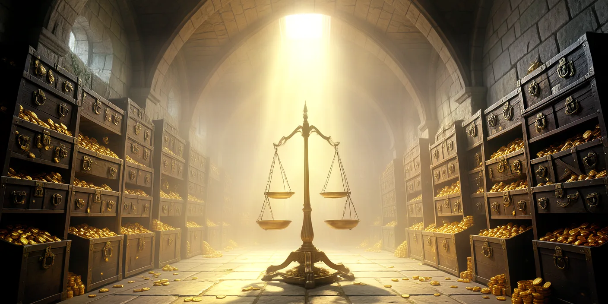
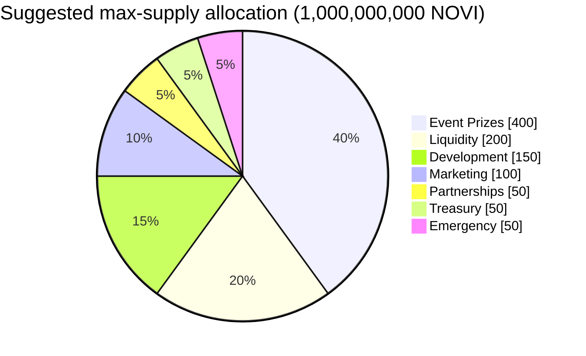
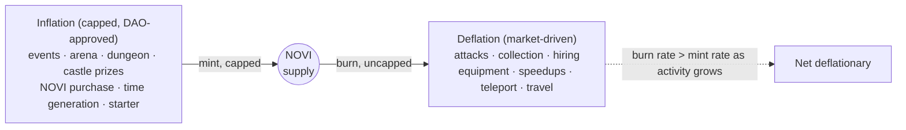

# Novus Mundus: Tokenomics & Economic Model

> **Dual-account NOVI economy with deflationary gameplay consumption and DAO-controlled mint allocations, supporting multi-kingdom play with a shared mint authority.**

<p align="center">
  
</p>

---

## Table of Contents

1. [Dual-Account System](#dual-account-system)
2. [NOVI Mint Authority](#novi-mint-authority)
3. [NOVI Flow Diagram](#novi-flow-diagram)
4. [Token Burns (Deflationary)](#token-burns-deflationary)
5. [Token Mints (Controlled Inflation)](#token-mints-controlled-inflation)
6. [Fibonacci Efficiency System](#fibonacci-efficiency-system)
7. [Golden Ratio Multipliers](#golden-ratio-multipliers)
8. [Anti-Bot Economics](#anti-bot-economics)
9. [Shop & Premium Currency](#shop--premium-currency)
10. [Event Eligibility](#event-eligibility)
11. [Token Supply Management](#token-supply-management)
12. [Player Archetypes & ROI](#player-archetypes--roi)

---

## Dual-Account System

### Core Innovation

**Two separate NOVI balances with different rules** — cleanly separates **gameplay fuel** from **earned rewards**.

```
┌─────────────────────────────────────────────────────────────────┐
│                    TOKEN SEPARATION                              │
├─────────────────────────────────────────────────────────────────┤
│                                                                  │
│  PlayerAccount (per kingdom)        UserAccount (per wallet)     │
│  ┌─────────────────────┐         ┌─────────────────────┐        │
│  │   LOCKED NOVI       │         │   RESERVED NOVI      │        │
│  │                     │         │                     │         │
│  │   - Generated       │         │   - Earned          │         │
│  │   - Purchased       │   ──>   │   - Vested (7 days) │         │
│  │   - BURNED on use   │         │   - WITHDRAWABLE    │         │
│  │   - NOT withdrawable│         │   - Real income     │         │
│  └─────────────────────┘         └─────────────────────┘        │
│                                                                  │
└─────────────────────────────────────────────────────────────────┘
```

### PlayerAccount (Locked NOVI)

**Purpose**: In-game currency that powers all gameplay.

**Key Rule**: **CANNOT BE WITHDRAWN** — exists solely for gameplay. The locked-NOVI SPL token account is owned by the `PlayerAccount` PDA, so the player wallet cannot directly transfer those tokens out.

**Sources**:

| Source | Notes |
|---|---|
| Starter NOVI | `STARTER_LOCKED_NOVI = 1_000_000` on `init_player` |
| Time generation | Rate per 5 minutes from `subscription_tiers[tier].locked_novi_per_5min`, capped by `max_locked_novi` |
| SOL → NOVI swap | `shop::purchase_novi` (instruction 300) — oracle-priced or DAO-fallback price |
| Reserved → Locked | `token::reserved_to_locked` (one-way) |
| Castle rewards (low tier) | Outpost/Keep/Stronghold castles credit locked NOVI |

**Uses** (some burn, some escrow):

- `economy::hire_units` (defensive + operative)
- `combat::attack_player`, `combat::attack_encounter`
- `economy::collect_resources`
- `economy::purchase_equipment` (weapons, produce, vehicles, armor)
- `economy::purchase_stamina`
- `travel::speedup`, `rally::speedup`, `reinforcement::speedup`, `expedition::speedup`, `sanctuary::speedup_meditation`
- `estate::build`, `estate::upgrade`, `estate::buy_plot`
- `forge::start_craft`
- `research::start_research`, `research::speed_up_research`
- `team::create`, `team::deposit_treasury`
- `intercity_teleport` (NOVI cost)

### UserAccount (Reserved NOVI)

**Purpose**: Withdrawable earnings from competitive play.

**Key Rule**: **WITHDRAWABLE** after a 7-day vesting period (`RESERVED_NOVI_VESTING_PERIOD = 604_800`).

**Sources**:

| Source | Frequency |
|---|---|
| Event prizes (`event::claim_prize`) | Daily/Weekly/Seasonal/World |
| Encounter loot (`loot::claim`) | Per kill (Rare+ only) |
| Arena rewards (`arena::claim_daily_reward`, `arena::claim_master_reward`) | Daily / season-end |
| Dungeon leaderboard (`dungeon::claim_leaderboard_prize`) | Weekly |
| Castle rewards (Fortress/Citadel tiers, `castle::claim_castle_rewards`) | Daily |
| Mint-for-prize (`economy::mint_for_prize`) | DAO-controlled |

**Uses**:

- Withdraw to wallet (`token::withdraw_reserved`, after 7-day vesting)
- Trade on DEX (once withdrawn to wallet)
- Deposit to PlayerAccount (`token::reserved_to_locked`, one-way)

---

## NOVI Mint Authority

The NOVI mint is **a single shared SPL mint across all kingdoms** of a given deployment.

- **PDA**: `["novi_mint"]` — no `kingdom_id` in the seed.
- **Mint authority**: the `GameEngine` PDA of the **first** kingdom created (typically kingdom 0). The mint is initialized inside `init_game_engine` for that first kingdom.
- **Subsequent kingdoms**: cannot re-init the mint (`CreateAccount` for the mint account fails since it already exists). Cross-kingdom CPIs to mint NOVI sign with kingdom 0's GameEngine PDA seeds.

---

## NOVI Flow Diagram

```
┌──────────────────────────────────────────────────────────────────┐
│                       EXTERNAL INFLOWS                            │
│   • SOL purchases (shop::purchase_novi)                          │
│   • Subscription payments (subscription::purchase)               │
│   • Time generation (economy::update_locked_novi)                │
└─────────────────────────┬────────────────────────────────────────┘
                          │
                          ▼
┌──────────────────────────────────────────────────────────────────┐
│              PLAYER ACCOUNT (LOCKED NOVI)                         │
│                                                                   │
│  Inflows:                       Outflows:                         │
│  • Starter (init_player)        • Hire units (consume)            │
│  • Time generation              • Attacks (consume)               │
│  • SOL → NOVI swap              • Resource collection (consume)   │
│  • Reserved → Locked            • Equipment purchase (consume)    │
│  • Castle rewards (low tier)    • Stamina purchase (burn)         │
│                                 • Travel/rally/etc. speedups      │
│  ┌────────────────────────┐     • Estate build/upgrade            │
│  │ FIBONACCI EFFICIENCY   │     • Forge crafting                  │
│  │ Spending Fib amounts   │     • Research                        │
│  │ → ×√φ multiplier       │     • Teleport                        │
│  └────────────────────────┘                                       │
│                                 Rule: CANNOT WITHDRAW             │
│                                                                   │
└────────────┬─────────────────────────────────────────────────────┘
             │ Event wins, encounter loot, castle rewards (high tier),
             │ arena/dungeon prizes, DAO mints
             ▼
┌──────────────────────────────────────────────────────────────────┐
│                 USER ACCOUNT (RESERVED NOVI)                      │
│                                                                   │
│  Inflows: events, prizes, mint_for_prize, purchase_novi           │
│  Outflows:                                                        │
│  • WITHDRAW to wallet (after 7-day vesting)                       │
│  • Deposit back to Locked (one-way)                               │
│                                                                   │
│  Rule: WITHDRAWABLE      Effect: Controlled inflation             │
└────────────────────────┬─────────────────────────────────────────┘
                         │
                         ▼
┌──────────────────────────────────────────────────────────────────┐
│                       SOLANA WALLET                                │
│                  (Tradeable on DEX, real value)                    │
└──────────────────────────────────────────────────────────────────┘
```

---

## Token Burns (Deflationary)

NOVI consumed in gameplay is destroyed from the SPL supply via `spl_token::burn`.

### Burn Sources

| Action | Source | Notes |
|---|---|---|
| Hire units | `economy::hire_units` | base_cost × tier scaling |
| Player attacks | `combat::attack_player` | Damage-based cost |
| Encounter attacks | `combat::attack_encounter` | Stamina × research multiplier |
| Resource collection | `economy::collect_resources` | Operative-unit-driven |
| Equipment purchase | `economy::purchase_equipment` | Config costs |
| Stamina purchase | `economy::purchase_stamina` | Burn for instant stamina |
| Speed-ups | `*_speedup` instructions | Gem cost (gems represent NOVI value) |
| Teleport | `travel::intercity_teleport` | Distance-segmented |
| Reserved → Locked | `token::reserved_to_locked` | Reserved supply burned, locked credited |
| Travel | `travel::*` (if cost configured) | Distance-based |

### Deterministic Consumption Formula

```rust
pub fn calculate_consumption(
    novi_amount: u64,
    base_mult_bp: u64,        // From economic_config
    secondary_mult_bp: u64,   // From research/hero buffs
    luck_bp: u64,             // From research
    is_fibonacci: bool,       // Fibonacci efficiency bonus
) -> u64 {
    let base_value = ((novi_amount as u128)
        .saturating_mul(base_mult_bp as u128)
        .saturating_mul(secondary_mult_bp as u128)
        .saturating_mul(luck_bp as u128)
        / 1_000_000_000_000u128) as u64;

    let fib_bonus_bp = if is_fibonacci { 12_720 } else { 10_000 };  // √φ vs 1.0×
    ((base_value as u128).saturating_mul(fib_bonus_bp) / 10_000) as u64
}
```

### SPL Token Burn Pattern

```rust
// 1. Reduce player's locked balance (cached in PlayerAccount)
player.locked_novi = player.locked_novi.saturating_sub(consumed);

// 2. Burn from SPL supply (signed by GameEngine PDA)
let kingdom_id_bytes = game_engine.kingdom_id.to_le_bytes();
let bump_seed = [game_engine.bump];
let seeds = seeds!(GAME_ENGINE_SEED, &kingdom_id_bytes, &bump_seed);
let signer = Signer::from(&seeds);
burn_tokens(player_token_account, novi_mint, game_engine_account, consumed, &[signer])?;
```

---

## Token Mints (Controlled Inflation)

### Mint Sources & Caps

Caps are stored on-chain in `GameEngine.minting_config` (`MintingConfig` struct) and enforced in `economy::mint_for_prize`. Default purpose codes:

| Purpose | Code | Tracker | Cap |
|---|---:|---|---|
| Prizes / Events | 0, 1 | `minted_for_prizes` | 5% of `max_supply_cap` (`apply_bp(max_supply_cap, 500)`) |
| Marketing | 2 | `minted_for_marketing` | `max_marketing_allocation` |
| Development | 3 | `minted_for_development` | `max_development_allocation` |
| Partnerships | 4 | `minted_for_partnerships` | `max_partnership_allocation` |
| Treasury | 5 | `minted_for_treasury` | `max_treasury_allocation` |
| Liquidity | 6 | `minted_for_liquidity` | `max_liquidity_allocation` |

Plus per-proposal cap (`max_mint_per_proposal`) and overall supply cap (`max_supply_cap`).

All caps are configured via `update_game_config` (instruction 6, DAO-only).

### Multi-Token Events (No NOVI Mint)

Sponsors can fund events with BONK, USDC, or other SPL tokens via the `AllowedToken` system. Held in escrow, validated by DAO. **Zero NOVI minted.**

---

## Fibonacci Efficiency System

### The Bonus

Spending Fibonacci amounts on consumption-based actions grants a `√φ` (1.272×) efficiency multiplier.

Fibonacci sequence: 1, 2, 3, 5, 8, 13, 21, 34, 55, 89, 144, 233, 377, 610, 987, 1597, 2584, 4181, 6765, …

### Detection

```rust
// A positive integer n is Fibonacci iff 5n² + 4 or 5n² - 4 is a perfect square.
pub fn is_fibonacci(n: u64) -> bool {
    let n2 = n.saturating_mul(n);
    let five_n2 = n2.saturating_mul(5);
    is_perfect_square(five_n2.saturating_add(4))
        || is_perfect_square(five_n2.saturating_sub(4))
}
```

---

## Golden Ratio Multipliers

### Time-of-Day Bonuses

| Time Period | Attack | Defense | Collection |
|---|---|---|---|
| Deep Night (00-03) | **φ (1.618×)** | 1/φ (0.618×) | 1/φ |
| Dawn (03-06) | √φ (1.272×) | 1.0× | 1.0× |
| Morning (06-09) | 1.0× | 1.0× | 1.0× |
| Midday (09-15) | 1.0× | **φ (1.618×)** | 1.0× |
| Afternoon (15-18) | 1.0× | 1.0× | 1.0× |
| Dusk (18-21) | 1.0× | 1.0× | 1.0× |
| Evening (21-00) | 1.0× | 1.0× | 1/φ |

### Level Scaling

```rust
// Per-level progression via golden root
pub fn level_multiplier(level: u16) -> f64 {
    libm::pow(GOLDEN_ROOT, level as f64 / 10.0)
}
```

| Level | Multiplier |
|---:|---|
| 10 | 1.272× (√φ) |
| 20 | 1.618× (φ) |
| 40 | 2.618× (φ²) |
| 100 | 10.86× ((√φ)^10) |

### Research Scaling

```rust
pub fn research_cost(base: u64, level: u8) -> u64 {
    (base as f64 * libm::pow(1.8, level as f64)) as u64
}
pub fn research_buff(base_bps: u16, level: u8) -> u16 {
    (base_bps as f64 * libm::pow(GOLDEN_ROOT, level as f64 / 5.0)) as u16
}
```

---

## Anti-Bot Economics

### Core Principle

**Make botting unprofitable, not impossible.**

### Passive Farming Fails

```
Bot Strategy: 100 accounts × generate passive NOVI

Why it fails:
✗ All generated NOVI is LOCKED
✗ Locked NOVI cannot be withdrawn
✗ To use it, the bot must burn it in gameplay
✗ Bot gets $0 from passive farming
```

### Consolidation Farming Fails

```
Bot Strategy: 100 accounts farm → transfer to main → enter high-value events

Why it fails:
✗ Main account has high total_received / total_sent ratio
✗ Event eligibility caps the ratio (10:1 → 3:1 → 2:1 by event value)
✗ Big events reject the main account
✗ Only eligible for small events
```

### Transfer Restrictions

| Restriction | Source | Purpose |
|---|---|---|
| Same team only | `economy::transfer_cash:150-152` | Prevents cross-account Sybil |
| Account age | `min_account_age_for_events` (`GameCaps`) | Prevents rapid cycling |
| Tier-based daily caps | `subscription_tiers[tier].max_daily_transfer_amount/count` | Limits mass consolidation |
| Vault Lv5+ required | `economy::transfer_cash:172` | Gates feature behind progression |
| Tracking | `total_sent` / `total_received` | Enables ratio checks |

(Old docs cited a flat "500M/day" limit; the actual limit is tier-based per `SubscriptionTier`.)

---

## Shop & Premium Currency

### Multi-Currency System

| Currency | Source | Use |
|---|---|---|
| **SOL** | External wallet | Premium purchases, NOVI swap, subscriptions |
| **NOVI (Locked)** | Gameplay generation, swap | Most in-game purchases (often burned) |
| **NOVI (Reserved)** | Events, prizes | Withdraw or convert to Locked |
| **Gems** | Premium, events, research | Speed-ups, premium items |
| **Fragments** | Encounters, events | Hero leveling |
| **Cash** | Collection, attacks | Unit hiring (where applicable), networth |

### Shop Discount Layers

**Layer 1 — Base Discounts** (up to 60%):
- Flash Sales, Daily Deals, Weekly/Seasonal Sales, DAO Promotions

**Layer 2 — Bundle Savings** (up to 35%, exact discount stored per bundle).

**Layer 3 — Fibonacci Bonus** (up to 20%): spending Fibonacci amounts grants efficiency.

**Combined Cap**: `ShopConfig.max_total_discount_bps` (target 75%).

### Allowed-Token Payments

Non-NOVI SPL tokens can be configured as payment via `shop::create_allowed_token`. Each `AllowedTokenAccount` stores:
- `mint` (token mint pubkey)
- `discount_bps` (token-specific discount, up to 100% currently allowed)
- Pyth/Switchboard oracle config (staleness, confidence thresholds)

Oracle pricing flow in `helpers/token_ops.rs::process_token_payment_flow`.

### Milestone Loyalty

Permanent discounts unlocked at spend thresholds (configured per `ShopConfig`):

| Milestone | Permanent Discount |
|---|---|
| Bronze | 2% |
| Silver | 4% |
| Gold | 6% |
| Platinum | 8% |
| Diamond | 10% |

---

## Event Eligibility

### Tiered Requirements

| Event Value | Min account age | Min attacks | Max transfer ratio (received:sent) |
|---|---|---:|---|
| < 25K NOVI | 7 days | 5 | 10:1 |
| 25K-100K NOVI | 30 days | 20 | 3:1 |
| 100K+ NOVI | 60 days | 50 | 2:1 |

### Eligibility Check (simplified)

```rust
pub fn check_eligibility(
    player: &PlayerAccount,
    event: &EventAccount,
    now: i64,
) -> bool {
    if (now - player.created_at) < event.min_account_age { return false; }
    if player.total_attacks < event.min_attacks { return false; }
    if player.total_received > 0 {
        let ratio = player.total_received / player.total_sent.max(1);
        if ratio > event.max_transfer_ratio { return false; }
    }
    if player.flagged_by_governance { return false; }
    true
}
```

(`src/logic/eligibility.rs`.)

---

## Token Supply Management

### Allocation Caps (DAO-set)

The on-chain `MintingConfig` tracks both running totals and caps per purpose. Suggested defaults:



```
Max supply (DAO-configurable): 1,000,000,000 NOVI

Suggested allocation caps:
├─ Event Prizes:    400M (40%)  — ongoing reserved NOVI rewards
├─ Liquidity:       200M (20%)  — DEX pools
├─ Development:     150M (15%)  — team (vested)
├─ Marketing:       100M (10%)  — airdrops, campaigns
├─ Partnerships:     50M (5%)   — strategic (vested)
├─ Treasury:         50M (5%)   — DAO reserves
└─ Emergency:        50M (5%)   — crisis response
```

Each allocation is tracked individually in `MintingConfig` and capped per purpose. `mint_for_prize` enforces `total_minted` ≤ `max_supply_cap` plus the per-purpose cap.

### Supply Equilibrium



**Inflationary Pressure** (capped, DAO-approved):

| Source | Notes |
|---|---|
| Daily events | Reserved NOVI rewards |
| Weekly tournaments | Reserved NOVI rewards |
| Seasonal events | Reserved NOVI rewards |
| Arena rewards (daily + master) | Reserved NOVI |
| Dungeon leaderboard | Reserved NOVI |
| Castle rewards (Fortress/Citadel tiers) | Reserved NOVI |
| NOVI purchase | Player pays SOL, mint authority emits NOVI |
| Time generation (locked) | Subscription-driven |
| Starter NOVI | 1M per new player |

**Deflationary Pressure** (market-driven):

| Source | Notes |
|---|---|
| Every attack | Burns NOVI |
| Every collection | Burns NOVI |
| Hiring units | Burns NOVI |
| Equipment purchase | Burns NOVI |
| Speed-ups | Burns gems → effective NOVI burn |
| Teleportation | Burns NOVI |
| Travel | Burns NOVI (if cost configured) |

### Long-Term Target

**Burn rate > Mint rate = Deflationary**

- Mint rate capped by allocation caps and DAO approvals
- Burn rate scales with activity (no cap)
- More attacks / collections → more burns

**Result**: NOVI becomes scarcer as the game matures.

(Earlier docs claimed Reserved NOVI expires after 90 days and is burned. The current code does **not** implement Reserved NOVI expiration — that would need a new instruction. Treat 90-day expiration as a design proposal, not a shipped feature.)

---

## Player Archetypes & ROI

### Free Casual Player (Rookie Tier)

| Metric | Value |
|---|---|
| Subscription | None |
| Generation | 1 NOVI/5min (caps at config limit) |
| Daily passive | ~288 NOVI |
| Weekly | ~2K NOVI (passive only) |
| **Focus** | Event participation for Reserved NOVI |

### Competitive Free Player (Rookie Tier)

| Metric | Value |
|---|---|
| Subscription | None |
| Participation | Daily + weekly events, dungeon runs |
| Weekly earnings | ~50K+ Reserved NOVI |
| **ROI** | Skill-based (event wins, dungeon ranks, encounter loot) |

### Epic Subscriber

| Metric | Value |
|---|---|
| Subscription | SOL subscription |
| Generation | 10 NOVI/5min |
| Daily passive | ~2,880 NOVI (locked) |
| **Focus** | Strong event participation + passive generation + castle/arena |

### Legendary Whale

| Metric | Value |
|---|---|
| Subscription | SOL subscription (highest tier) |
| Generation | 50 NOVI/5min |
| Daily passive | ~14,400 NOVI (locked) |
| **Focus** | Maximum generation + competitive dominance + castle kingship |

**Note**: Locked NOVI is gameplay fuel (some burned, some escrowed). Real income comes from **Reserved NOVI** earned through events, arena, dungeons, castle rewards (high tier), and encounter loot.

---

## Summary

### Dual-Account Design

- **Locked NOVI** (`PlayerAccount`) — cannot withdraw, mostly burned, makes botting worthless
- **Reserved NOVI** (`UserAccount`) — can withdraw after vesting, skill-based earnings

### Anti-Bot Stack

1. Passive farming → locked NOVI → worthless
2. Consolidation → fails event eligibility ratio
3. Same-team-only transfers + age requirements
4. Deterministic outcomes — no exploitation surface for RNG

### Token Supply

- **Deflationary** forces: gameplay burns
- **Controlled inflation**: capped per-purpose mints, DAO approval, transparent on-chain tracking via `MintingConfig`
- Long-term equilibrium target: burn > mint as activity grows
