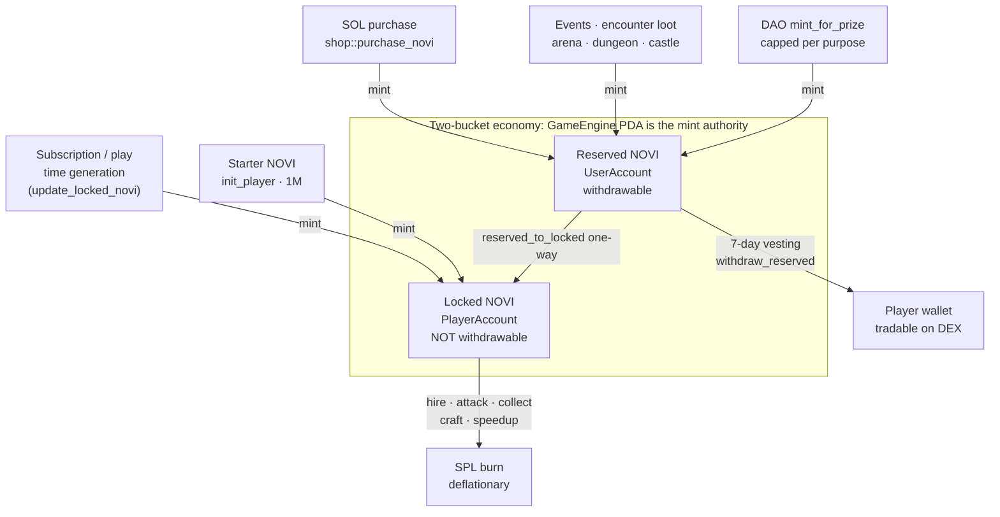

# NOVI Token Flow: Technical Implementation

> **Instruction-level NOVI token flow using Pinocchio. Multi-kingdom-aware.**

<p align="center">
  
</p>

---

## Overview

This document describes the complete NOVI token flow:

1. **Single shared SPL mint** across all kingdoms. PDA seed: `["novi_mint"]` — no kingdom_id.
2. **Mint authority** is the **kingdom 0** `GameEngine` PDA. The mint is initialized inside `init_game_engine` for the first kingdom.
3. **Subscription-tier generation** mints NOVI to a player's locked token account on demand via `economy::update_locked_novi`.
4. **Consumption** burns NOVI from the SPL supply (deflationary).
5. **DAO mints** are capped per purpose in `MintingConfig` and gated by the DAO authority on each kingdom's GameEngine.
6. **Calculations are deterministic** — golden-ratio multipliers + basis-point math. The few skill/RNG-influenced flows (dungeon crits, expedition strikes, forge precision, estate daily activity) are designed to be co-signed by an off-chain `game_authority`.

### Flow at a glance



---

## Token Buckets

### Locked NOVI (`PlayerAccount.locked_novi` + Player's locked ATA)

| Property | Value |
|---|---|
| Withdrawable | No (token account is owned by PlayerAccount PDA) |
| Sources | Starter NOVI, time generation, SOL→NOVI swap, reserved→locked, castle rewards (low tier) |
| Outflows | Consumed (burned or escrowed) by gameplay instructions |
| Tracked in | `PlayerAccount.locked_novi` cache |
| Storage | SPL token account owned by `["player", game_engine, owner]` PDA |

### Reserved NOVI (`UserAccount.reserved_novi` + User's reserved ATA)

| Property | Value |
|---|---|
| Withdrawable | Yes — after 7-day vesting (`RESERVED_NOVI_VESTING_PERIOD = 604_800`) |
| Sources | Events, encounter loot (Rare+), arena, dungeon leaderboard, castle (high tier), mint_for_prize, purchase_novi |
| Tracked in | `UserAccount.reserved_novi`, `reserved_novi_earned_at`, `total_reserved_earned` |
| Storage | SPL token account owned by `["user", owner_wallet]` PDA |

---

## NOVI Mint PDA Signer

Every mint or burn CPI signed by the GameEngine uses:

```rust
let kingdom_id_bytes = game_engine_data.kingdom_id.to_le_bytes();
let bump_seed = [game_engine_data.bump];
let seeds = pinocchio::seeds!(GAME_ENGINE_SEED, &kingdom_id_bytes, &bump_seed);
let signer = pinocchio::instruction::Signer::from(&seeds);
```

The NOVI mint authority is exclusively **kingdom 0's** GameEngine PDA. Multi-kingdom mints work because: (1) the mint PDA is shared (no kingdom_id in seed), (2) but only kingdom 0 was the authority when `InitializeMint` ran during `init_game_engine`. Any cross-kingdom CPI that wants to mint NOVI must therefore use kingdom 0's `kingdom_id_le_bytes + bump` in the signer seeds.

---

## Token Generation Flow

### Subscription-Based Generation (`economy::update_locked_novi`, instruction 10)

```
User holds a subscription
         │
         ▼
┌─────────────────────────────────────────────────────────────────┐
│  player.subscription_tier = tier (0-3)                          │
│  player.subscription_end = now + duration                       │
└─────────────────────────────────────────────────────────────────┘
         │
         ▼ on update_locked_novi call (or any instruction that calls it inline)
         │
┌─────────────────────────────────────────────────────────────────┐
│  intervals = (now - last_updated_tokens_at) / 5_minutes         │
│  rate = subscription_tiers[tier].locked_novi_per_5min           │
│  tokens_to_mint = intervals × rate                              │
│  cap_remaining = subscription_tiers[tier].max_locked_novi       │
│                  - player.locked_novi                           │
│  tokens_to_mint = min(tokens_to_mint, cap_remaining)            │
└─────────────────────────────────────────────────────────────────┘
         │
         ▼
┌─────────────────────────────────────────────────────────────────┐
│  GameEngine PDA signs the SPL mint CPI                          │
│  mint_to(novi_mint, player_locked_ata, GameEngine_PDA, amount)? │
│  player.locked_novi += tokens_to_mint                           │
│  player.last_updated_tokens_at = now                            │
└─────────────────────────────────────────────────────────────────┘
```

### Starter NOVI (`init_player`, instruction 1)

Every new player gets `STARTER_LOCKED_NOVI = 1_000_000` minted at registration. ATA is created via `CreateIdempotent` with `player` (PDA) as the wallet owner.

---

## Token Consumption Flow (Burns + Escrows)

### Deterministic Consumption Formula

```rust
/// (logic/consume.rs)
pub fn calculate_consumption(
    novi_amount: u64,
    base_mult_bp: u64,        // from economic_config
    secondary_mult_bp: u64,   // from research / hero buffs
    luck_bp: u64,             // from research
    is_fibonacci: bool,       // Fibonacci efficiency bonus
) -> u64 {
    let base_value = ((novi_amount as u128)
        .saturating_mul(base_mult_bp as u128)
        .saturating_mul(secondary_mult_bp as u128)
        .saturating_mul(luck_bp as u128)
        / 1_000_000_000_000u128) as u64;

    let fib_bonus_bp = if is_fibonacci { 12_720 } else { 10_000 };  // √φ
    ((base_value as u128).saturating_mul(fib_bonus_bp) / 10_000) as u64
}
```

### Hire Units (`economy::hire_units`, instruction 11)

```
Player wants to hire N units
         │
         ▼
┌─────────────────────────────────────────────────────────────────┐
│  Compute cost:                                                   │
│   base_cost = unit_cost(tier) × N                                │
│   adjusted = base_cost × cost_multiplier_bps / 10_000            │
│   fib_bonus = is_fibonacci(adjusted) ? √φ : 1.0                  │
│   final_cost = adjusted × fib_bonus_bps / 10_000                 │
└─────────────────────────────────────────────────────────────────┘
         │
         ▼
┌─────────────────────────────────────────────────────────────────┐
│  require!(player.locked_novi >= final_cost)                      │
│  player.locked_novi -= final_cost                                │
│  player.defensive_unit_N += N (or operative_unit_N)              │
└─────────────────────────────────────────────────────────────────┘
         │
         ▼
┌─────────────────────────────────────────────────────────────────┐
│  SPL Token Burn (signed by GameEngine PDA)                       │
│  burn_tokens(player_locked_ata, novi_mint, GameEngine, final)?;  │
└─────────────────────────────────────────────────────────────────┘
```

### Collect Resources (`economy::collect_resources`, instruction 12)

```
Player wants to collect with X NOVI
         │
         ▼
┌─────────────────────────────────────────────────────────────────┐
│  Operative power:                                                │
│    power = Σ(operative_unit_i × weight_i)                        │
│    efficiency_bps = production_efficiency_bps (research)         │
│    time_mult_bps = get_time_multiplier(Collecting, time_of_day)  │
└─────────────────────────────────────────────────────────────────┘
         │
         ▼
┌─────────────────────────────────────────────────────────────────┐
│  NOVI consumption:                                               │
│    base = X × base_consumption_rate_bps / 10_000                 │
│    fib_bonus_bps = is_fibonacci(X) ? √φ : 1.0                    │
│    consumed = base × efficiency_bps × time_mult_bps × fib_bonus  │
│              / 1_000_000_000_000                                  │
└─────────────────────────────────────────────────────────────────┘
         │
         ▼
┌─────────────────────────────────────────────────────────────────┐
│  Cash generated:                                                 │
│    base_cash = power × consumed × cash_per_novi                  │
│    research_bonus = cash_generation_bps                          │
│    hero_bonus    = hero_economy_bps                              │
│    final_cash = base_cash × (10_000 + research + hero) / 10_000  │
└─────────────────────────────────────────────────────────────────┘
         │
         ▼
┌─────────────────────────────────────────────────────────────────┐
│  player.locked_novi -= consumed                                  │
│  player.cash_on_hand += final_cash                               │
│  burn_tokens(player_locked_ata, novi_mint, GameEngine, consumed)?│
└─────────────────────────────────────────────────────────────────┘
```

### Attack Player (`combat::attack_player`, instruction 20)

```
Attacker submits attack against defender
         │
         ▼
┌─────────────────────────────────────────────────────────────────┐
│  Validate same city, both within city radius (haversine)         │
│  Validate not traveling, not in active rally                     │
│  Validate cannot self-attack, defender not protected             │
└─────────────────────────────────────────────────────────────────┘
         │
         ▼
┌─────────────────────────────────────────────────────────────────┐
│  Attacker power (deterministic):                                 │
│   base = Σ(defensive_unit_i × power_i)                           │
│   weapon_cov = min(weapons / total_units, 1.0)                   │
│   time_mult = get_time_multiplier(Attacking, time_of_day)        │
│   research_bps = research_attack_bps                             │
│   hero_bps    = hero_attack_bps                                  │
│   level_bonus = level/10                                         │
│   total_bps = 10_000 + research + hero + level_bonus             │
│   power = base × weapon_cov × time_mult × total_bps / 10_000     │
│   if research_crit_chance_bps >= 5000 {                          │
│       crit_mult_bps = 10_000 + research_crit_damage_bps          │
│       power = power × crit_mult / 10_000                         │
│   }                                                              │
└─────────────────────────────────────────────────────────────────┘
         │
         ▼
┌─────────────────────────────────────────────────────────────────┐
│  Defender power similar — Midday φ, DeepNight 1/φ                │
│  Both sides take mutual damage (combat::inflict_damage)          │
└─────────────────────────────────────────────────────────────────┘
         │
         ▼
┌─────────────────────────────────────────────────────────────────┐
│  Loot:                                                           │
│   cash_loot = defender.cash_on_hand × loot_bps / 10_000          │
│   weapon_loot = dead_enemy_weapons × WEAPON_LOOT_RATE_BPS/10_000 │
│   transfer loot to attacker; update happiness/networth/XP        │
└─────────────────────────────────────────────────────────────────┘
```

PvP crit is research-driven and deterministic (`research_crit_chance_bps >= 5000` → guaranteed crit). See `combat/attack_player.rs:374, 451, 489`.

### Dungeon Attack (`dungeon::attack`, instruction 251)

`dungeon::attack` is intended to use `game_authority`-signed crit/double-strike flags but **currently reads them from instruction data (player-controlled)**:

```rust
// Current code:
let double_strike_triggered = data.get(1).map(|&b| b == 1).unwrap_or(false);
let crit_triggered           = data.get(2).map(|&b| b == 1).unwrap_or(false);
```

Production adds `game_authority` as a required signer and verifies with Ed25519-program payloads bound to `(player_pda, dungeon_run_pda, attack_index, nonce)`.

---

## Time-of-Day Multipliers

`logic/time_cycle.rs`:

```rust
pub fn get_local_hour(utc_timestamp: i64, longitude: f64) -> u8 {
    let utc_hours = ((utc_timestamp % 86_400) / 3_600) as f64;
    let offset = longitude / 15.0;  // 15° per hour
    let local = (utc_hours + offset + 24.0) % 24.0;
    local as u8
}

pub fn get_time_of_day(hour: u8) -> TimeOfDay {
    match hour {
        0..=2   => TimeOfDay::DeepNight,   // 00:00-03:00
        3..=5   => TimeOfDay::Dawn,        // 03:00-06:00 (Golden Hour)
        6..=8   => TimeOfDay::Morning,
        9..=14  => TimeOfDay::Midday,
        15..=17 => TimeOfDay::Afternoon,
        18..=20 => TimeOfDay::Dusk,        // (Golden Hour)
        21..=23 => TimeOfDay::Evening,
        _       => TimeOfDay::Midday,
    }
}

pub fn get_time_multiplier(activity: ActivityType, time: TimeOfDay) -> f64 {
    match (activity, time) {
        (Attacking, DeepNight) => PHI,
        (Attacking, Dawn)      => GOLDEN_ROOT,
        (Defending, Midday)    => PHI,
        (Defending, DeepNight) => PHI_INVERSE,
        (Hiring, Midday)       => PHI,
        (Hiring, DeepNight) | (Hiring, Evening) => PHI_INVERSE,
        (Collecting, DeepNight) | (Collecting, Evening) => PHI_INVERSE,
        (Mining, DeepNight)    => PHI,
        (Fishing, Dawn)        => PHI,
        (Traveling, DeepNight) => PHI,
        (Traveling, Dawn)      => GOLDEN_ROOT,
        (Traveling, Midday)    => PHI_INVERSE,
        _                       => 1.0,
    }
}
```


---

## Reserved NOVI Flow (Withdrawable)

### Earning via Events (`event::claim_prize`, instruction 83)

```
Event finalized; player ranked in top 10
         │
         ▼
┌─────────────────────────────────────────────────────────────────┐
│  Prize share (deterministic, PRIZE_DISTRIBUTION constant):       │
│   Rank 1: 35%, Rank 2: 25%, Rank 3: 15%                          │
│   Ranks 4-5: 7.5% each                                           │
│   Ranks 6-10: 2% each                                            │
│   share_bps = PRIZE_DISTRIBUTION[rank - 1]                       │
│   player_prize = event.total_prize × share_bps / 10_000          │
└─────────────────────────────────────────────────────────────────┘
         │
         ▼
┌─────────────────────────────────────────────────────────────────┐
│  Verify eligibility (logic/eligibility.rs):                      │
│   account_age >= event.min_account_age                           │
│   total_attacks >= event.min_attacks                             │
│   total_received / total_sent <= event.max_transfer_ratio        │
│   !flagged_by_governance                                         │
└─────────────────────────────────────────────────────────────────┘
         │
         ▼
┌─────────────────────────────────────────────────────────────────┐
│  validate_token_account_owner(winner_novi_ata, winner.key())     │
│  Mint NOVI to winner's reserved ATA (signed by GameEngine PDA)   │
│  user.reserved_novi += player_prize                              │
│  user.reserved_novi_earned_at = now                              │
└─────────────────────────────────────────────────────────────────┘
```

### Withdrawal (`token::withdraw_reserved`, instruction 16)

```
Player wants to withdraw N reserved NOVI to their wallet
         │
         ▼
┌─────────────────────────────────────────────────────────────────┐
│  Vesting check:                                                  │
│   require!(now - user.reserved_novi_earned_at                    │
│            >= RESERVED_NOVI_VESTING_PERIOD)   // 7 days          │
└─────────────────────────────────────────────────────────────────┘
         │
         ▼
┌─────────────────────────────────────────────────────────────────┐
│  Balance check:                                                  │
│   require!(user.reserved_novi >= amount)                         │
└─────────────────────────────────────────────────────────────────┘
         │
         ▼
┌─────────────────────────────────────────────────────────────────┐
│  Transfer signed by UserAccount PDA:                             │
│   transfer(user_reserved_ata, wallet_ata, UserAccount, amount)   │
│  user.reserved_novi -= amount                                    │
└─────────────────────────────────────────────────────────────────┘
```

### Reserved → Locked (`token::reserved_to_locked`, instruction 15)

One-way conversion: burns from reserved supply, credits player's locked balance.

```
Player wants to move R reserved NOVI to locked
         │
         ▼
┌─────────────────────────────────────────────────────────────────┐
│  Validate accounts, check user.reserved_novi >= R                │
│  Burn R from user_reserved_ata (signed by UserAccount PDA)       │
│  player.locked_novi += R                                         │
│  user.reserved_novi -= R                                         │
└─────────────────────────────────────────────────────────────────┘
```


---

## SOL → NOVI Purchase Flow

### `shop::purchase_novi` (instruction 300)

```
Player chooses package_index (0-4) + max_lamports (slippage)
         │
         ▼
┌─────────────────────────────────────────────────────────────────┐
│  Load GameEngine, ShopConfig (oracle settings).                  │
│  base_amount = novi_purchase_config.get_purchase_amount(idx).    │
│  Compute streak (consecutive day purchase, max 7).               │
│  Reset daily counter if new day.                                 │
│  Verify base_amount + already_today <= daily_cap[tier].          │
│  Compute total_bonus_bps from:                                   │
│    - package_index (bulk discount)                               │
│    - subscription_tier bonus                                     │
│    - streak_day bonus                                            │
│  bonus_amount = base × total_bonus_bps / 10_000                  │
│  total_novi = base + bonus_amount                                │
└─────────────────────────────────────────────────────────────────┘
         │
         ▼
┌─────────────────────────────────────────────────────────────────┐
│  Compute SOL cost:                                               │
│   If oracle configured & accounts supplied:                      │
│     Pyth path:  load_pyth_price_with_confidence(...)             │
│     Switchboard path: QuoteVerifier::new()...verify_account(...) │
│     undercut = novi_market_undercut_bps (e.g. 15%)               │
│     price = oracle_price × (10_000 - undercut) / 10_000          │
│   Else (or on error): fallback = base × novi_base_price_lamports │
└─────────────────────────────────────────────────────────────────┘
         │
         ▼
┌─────────────────────────────────────────────────────────────────┐
│  Slippage:  require!(cost_lamports <= max_lamports)              │
│  validate_token_account_owner(reserved_ata, user.key())          │
│  SOL transfer:  buyer -> treasury (system::transfer)             │
│  Mint NOVI to reserved ATA (signed by GameEngine PDA)            │
│  user.reserved_novi += total_novi                                │
└─────────────────────────────────────────────────────────────────┘
```

---

## Shop Purchase Flow (Generic)

### Multi-Layer Discount Calculation

```
┌─────────────────────────────────────────────────────────────────┐
│                    SHOP DISCOUNT LAYERS                          │
└─────────────────────────────────────────────────────────────────┘

Base price: 1,000,000 lamports
         │
         ▼
┌─────────────────────────────────────────────────────────────────┐
│  Layer 1: Base Discounts (cap: max_base_discount_bps = 60%)      │
│   flash_sale = 30%, daily_deal = 0%                              │
│   base_discount = max applicable, capped to 60%                  │
└─────────────────────────────────────────────────────────────────┘
         │
         ▼
┌─────────────────────────────────────────────────────────────────┐
│  Layer 2: Bundle Savings (cap: max_bundle_discount_bps = 35%)    │
│   bundle.discount_bps clamped to cap                             │
└─────────────────────────────────────────────────────────────────┘
         │
         ▼
┌─────────────────────────────────────────────────────────────────┐
│  Layer 3: Milestone Loyalty (permanent)                          │
│   total_spent crosses Bronze/Silver/Gold/Platinum/Diamond        │
│   milestone_discount_bps = config (2%-10%)                       │
└─────────────────────────────────────────────────────────────────┘
         │
         ▼
┌─────────────────────────────────────────────────────────────────┐
│  Layer 4: Fibonacci Bonus (cap: max_fib_discount_bps = 20%)      │
│   Only if final price (lamports) is a Fibonacci number           │
└─────────────────────────────────────────────────────────────────┘
         │
         ▼
┌─────────────────────────────────────────────────────────────────┐
│  Combined cap (max_total_discount_bps = 75%):                    │
│   total_discount = min(layer1 + layer2 + layer3 + layer4, cap)   │
│   final_price = base × (10_000 - total) / 10_000                 │
└─────────────────────────────────────────────────────────────────┘
```

### Allowed-Token Payment Flow (`helpers/token_ops.rs::process_token_payment_flow`)

Used by shop purchases priced in non-NOVI tokens (BONK, USDC, etc.):

1. Load `AllowedTokenAccount::load_checked` (program ownership + PDA + bump verified).
2. Detect oracle type (Pyth magic `0xa1b2c3d4` vs. Switchboard).
3. Fetch SOL/USD and TOKEN/USD prices with staleness + confidence checks.
4. Compute `token_amount = (sol_price_lamports × sol_usd) / token_usd` adjusted for token decimals.
5. Apply `allowed_token.discount_bps` (Layer 0 — token-specific discount).
6. SPL transfer from buyer to treasury.

---

## Research Cost & Buff Flow

### Starting Research (`research::start_research`)

```
Player starts research node R, level L
         │
         ▼
┌─────────────────────────────────────────────────────────────────┐
│  Prerequisites:                                                  │
│   completed_levels[R] >= L - 1 (upgrading)                       │
│   current_research == NONE (no active research)                  │
│   require_extension(player, EXT_RESEARCH)                        │
└─────────────────────────────────────────────────────────────────┘
         │
         ▼
┌─────────────────────────────────────────────────────────────────┐
│  Cost = template.base_novi_cost × 1.8^L                          │
│  Time = template.base_time_secs × 1.5^L                          │
└─────────────────────────────────────────────────────────────────┘
         │
         ▼
┌─────────────────────────────────────────────────────────────────┐
│  Deduct cost & start:                                            │
│   player.locked_novi -= cost                                     │
│   burn_tokens(player_locked_ata, novi_mint, GameEngine, cost)?   │
│   research.current_research = R                                  │
│   research.current_level = L                                     │
│   research.started_at = now                                      │
│   research.completes_at = now + time                             │
└─────────────────────────────────────────────────────────────────┘
```

### Completing Research (`research::complete_research`)

```
Player completes research after timer
         │
         ▼
┌─────────────────────────────────────────────────────────────────┐
│  require!(now >= research.completes_at)                          │
└─────────────────────────────────────────────────────────────────┘
         │
         ▼
┌─────────────────────────────────────────────────────────────────┐
│  Compute new buff:                                               │
│   base_buff = template.base_buff_bps                             │
│   buff = base_buff × (√φ)^(level/5)                              │
└─────────────────────────────────────────────────────────────────┘
         │
         ▼
┌─────────────────────────────────────────────────────────────────┐
│  Apply buff:                                                     │
│   research.completed_levels[R] = L                               │
│   player.<corresponding>_bps = buff   (mirrored on PlayerCore)   │
│   research.current_research = NONE                               │
└─────────────────────────────────────────────────────────────────┘
```

---

## Hero Buff Flow (MPL Core NFTs)

### Lock / Unlock

`hero::lock`:
- Verify hero is owned by the caller (read MPL Core `AssetV1.owner`)
- Verify `HeroTemplate` PDA derivation matches the parsed NFT's `template_id`
- Add buffs: `player.hero_*_bps += template.base_*_bps × (√φ)^level`
- Insert hero into `player.active_heroes[slot]`

`hero::unlock`:
- Subtract buffs: `player.hero_*_bps -= template.base_*_bps × (√φ)^level`
- Clear slot

### Level Up (`hero::level_up`)

```
Player levels hero from L to L+1
         │
         ▼
┌─────────────────────────────────────────────────────────────────┐
│  Fragment cost = 10 × 1.5^L                                      │
│  require!(player.fragments >= cost)                              │
│  player.fragments -= cost                                        │
└─────────────────────────────────────────────────────────────────┘
         │
         ▼
┌─────────────────────────────────────────────────────────────────┐
│  Update NFT level via MPL Core UpdatePluginV1                    │
│  (hero is locked — program signs as authority)                   │
└─────────────────────────────────────────────────────────────────┘
         │
         ▼
┌─────────────────────────────────────────────────────────────────┐
│  Apply buff delta:                                               │
│   new_buff = template.base_attack × (√φ)^(L+1)                   │
│   old_buff = template.base_attack × (√φ)^L                       │
│   player.hero_attack_bps += (new_buff - old_buff)                │
└─────────────────────────────────────────────────────────────────┘
```

### Burn (`hero::burn`)

```
Player burns hero NFT (must NOT be locked)
         │
         ▼
┌─────────────────────────────────────────────────────────────────┐
│  Verify NFT.owner == caller AND hero not in player.active_heroes │
│  Verify HeroTemplate PDA + HeroCollection PDA                    │
│  Parse hero NFT attributes (level, template_id)                  │
│  Compute reward = calculate_burn_reward(level, tier_from_cost)   │
└─────────────────────────────────────────────────────────────────┘
         │
         ▼
┌─────────────────────────────────────────────────────────────────┐
│  Burn NFT via p_core::BurnV1                                     │
│  player.locked_novi += reward                                    │
│  template.minted_count -= 1   (recyclable supply)                │
│  Close per-(burner, template) HeroMintReceipt if owned by burner │
└─────────────────────────────────────────────────────────────────┘
```

---

## DAO-Controlled Minting (`economy::mint_for_prize`, instruction 14)

```rust
// Purpose codes: 0/1 = prizes, 2 = marketing, 3 = development,
//                4 = partnerships, 5 = treasury, 6 = liquidity
pub fn process(
    program_id: &Pubkey,
    accounts: &[AccountInfo],
    instruction_data: &[u8],
) -> ProgramResult {
    // 1. Parse: dao_authority, recipient_user, game_engine, user_token_account, novi_mint
    // 2. Verify dao_authority is signer
    // 3. require_owner(game_engine_account, program_id)
    //    (preferably load via GameEngine::load_checked_mut_by_key)
    let game_engine_data = unsafe { &mut *(game_engine_account.data_ptr() as *mut GameEngine) };
    require!(dao_authority.key() == &game_engine_data.authority, DaoRequired);

    // 4. Validate destination ATA
    validate_token_account_owner(user_token_account, recipient_user.key())?;

    // 5. Cap checks (per purpose)
    let minting_config = &mut game_engine_data.minting_config;
    let new_total = minting_config.total_minted.checked_add(amount)?;
    require!(new_total <= minting_config.max_supply_cap, ExceedsMaxCap);
    require!(amount <= minting_config.max_mint_per_proposal, ExceedsMaxCap);

    match purpose {
        0 | 1 => {                  // Prizes/Events
            let new_prize_total = minting_config.minted_for_prizes.checked_add(amount)?;
            let max_prize = apply_bp(minting_config.max_supply_cap, 500)?; // 5%
            require!(new_prize_total <= max_prize, ExceedsMaxCap);
        }
        2 => { /* marketing */ }
        3 => { /* development */ }
        4 => { /* partnerships */ }
        5 => { /* treasury */ }
        6 => { /* liquidity */ }
        _ => return Err(InvalidParameter.into()),
    }

    // 6. Mint via SPL CPI (GameEngine PDA signs)
    let kingdom_id_bytes = game_engine_data.kingdom_id.to_le_bytes();
    let bump_seed = [game_engine_data.bump];
    let seeds = seeds!(GAME_ENGINE_SEED, &kingdom_id_bytes, &bump_seed);
    let signer = Signer::from(&seeds);
    mint_tokens(novi_mint, user_token_account, game_engine_account, amount, &[signer])?;

    // 7. Update tracking
    minting_config.total_minted = new_total;
    // increment per-purpose tracker
    user_data.reserved_novi = user_data.reserved_novi.checked_add(amount)?;
    user_data.total_reserved_earned = user_data.total_reserved_earned.checked_add(amount)?;
    // Also set user_data.reserved_novi_earned_at = now to start the vesting window

    Ok(())
}
```

---

## Supply Controls

### `MintingConfig` (embedded in `GameEngine`)

```rust
pub struct MintingConfig {
    pub max_supply_cap: u64,                 // overall cap
    pub max_mint_per_proposal: u64,          // per-call cap
    pub total_minted: u64,                   // running total

    // Purpose-specific caps (DAO-configurable)
    pub max_marketing_allocation: u64,
    pub max_development_allocation: u64,
    pub max_partnership_allocation: u64,
    pub max_treasury_allocation: u64,
    pub max_liquidity_allocation: u64,

    // Per-purpose trackers
    pub minted_for_prizes: u64,
    pub minted_for_marketing: u64,
    pub minted_for_development: u64,
    pub minted_for_partnerships: u64,
    pub minted_for_treasury: u64,
    pub minted_for_liquidity: u64,
}
```

Prize/event cap is computed dynamically: `apply_bp(max_supply_cap, 500) = 5% of supply`.

### `GameCaps`

```rust
pub struct GameCaps {
    pub min_account_age_for_events: i64,    // e.g. 604_800 (7 days)
    pub max_event_minted_prize: u64,        // optional event cap
    pub max_daily_minted_prize_pool: u64,   // optional daily cap
    pub max_weekly_minted_prize_pool: u64,  // optional weekly cap
    // ... plus various gameplay caps
}
```

---

## Summary

### Token Flow Overview

```
INFLOW:
  Subscription → time generation → mint to player_locked_ata
  SOL purchase  → shop::purchase_novi → mint to user_reserved_ata
  Reserved → Locked → burn + locked credit (one-way)
  Event win / encounter loot / arena / dungeon / castle (high tier) → mint to user_reserved_ata
  Starter NOVI → init_player → mint 1M to player_locked_ata

OUTFLOW (BURNS):
  Locked NOVI → hire / attack / collect / equipment / stamina / speedup / etc. → spl_token::burn

WITHDRAWAL:
  Reserved NOVI → 7-day vesting → user_reserved_ata transfer → wallet

DETERMINISTIC MULTIPLIERS:
  Time-of-Day: φ / √φ / 1 / 1/φ per activity
  Fibonacci: √φ efficiency for Fibonacci amounts
  Level: (√φ)^(level/10) general progression
  Research: (√φ)^(level/5) buff scaling
  Hero: (√φ)^level buff scaling
```

### Key Implementation Points

1. **GameEngine is mint authority** — PDA signs for SPL mint/burn CPIs. Kingdom 0's GameEngine is the canonical authority for the shared NOVI mint.
2. **All burns use `spl_token::burn`** — actual supply reduction.
3. **Core math is deterministic** — golden-ratio constants + basis-point arithmetic. A few skill/RNG moments (dungeon crits, expedition strikes, forge precision, estate daily) are `game_authority`-co-signed.
4. **Fibonacci detection** grants √φ efficiency.
5. **Basis points** for all percentages (10000 = 100%).
6. **Saturating math** prevents overflow panics.
