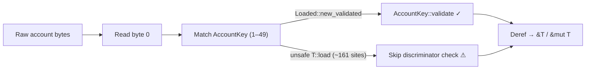
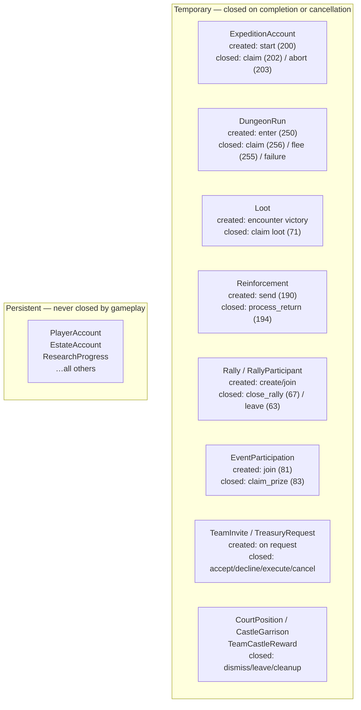
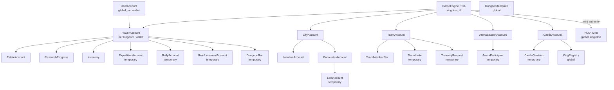
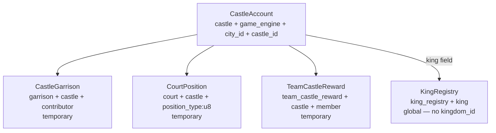
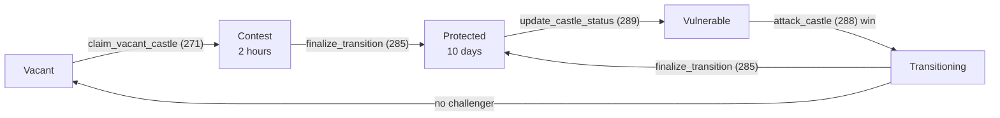

# Accounts

> Master index of all 49 on-chain account types: discriminators, PDA seeds, sizes, and system ownership.

## Account Discriminator Pattern

Every on-chain account stores its `AccountKey` enum value in **byte 0** as a `u8`. This lets a single `onProgramAccountChange` subscription route raw bytes to the correct deserializer before PDA seeds are known.

```rust
// state/mod.rs
#[repr(u8)]
pub enum AccountKey {
    GameEngine = 1,
    Player     = 2,
    // ... 49 variants total (1–49)
    BuildingTemplate = 49,
}
```

`AccountKey::validate(data, expected)` checks byte 0 and returns `GameError::InvalidAccountKey` on mismatch. The safe constructors `Loaded::new_validated` / `LoadedMut::new_validated` call it automatically. Approximately 161 `unsafe { T::load(data) }` call sites skip the check — a known hardening gap.



[Source: state/mod.rs](../../../programs/novus_mundus/src/state/mod.rs)

---

## Variable-Size PlayerAccount

`PlayerAccount` is the most complex account: `PlayerCore` (always present) plus up to 7 optional extension sections appended end-to-end via `realloc` as features unlock.

```
Offset  Size  Section           Flag constant
──────────────────────────────────────────────
0       528   PlayerCore        (always present)
528      48   ResearchSection   EXT_RESEARCH   = 0x01
576     144   InventorySection  EXT_INVENTORY  = 0x04
720     112   TeamSection       EXT_TEAM       = 0x10
832      80   RallySection      EXT_RALLY      = 0x08
912     208   HeroesSection     EXT_HEROES     = 0x02
1120     80   CosmeticsSection  EXT_COSMETICS  = 0x20
1200     48   CourtSection      EXT_COURT      = 0x40
──────────────────────────────────────────────
1248        MAX_SIZE (all sections present)
```

The `extensions: u32` bitfield in `PlayerCore` records which sections are allocated. Sections are appended in the **offset order above** (Research → Inventory → Team → Rally → Heroes → Cosmetics → Court); an earlier section must exist before a later one can be added. Sizes are verified by compile-time `static_assert`s in `state/player.rs`.

> **Note:** `TECHNICAL_ARCHITECTURE.md` and `GAME_DESIGN.md` quote `MAX_SIZE = 1946` with different section sizes — those root docs have drifted. The values above (from `state/player.rs`) are authoritative.

```mermaid
graph LR
    PC["PlayerCore<br/>528 b<br/>(always present)"]
    RS["ResearchSection<br/>48 b<br/>0x01"]
    IS["InventorySection<br/>144 b<br/>0x04"]
    TS["TeamSection<br/>112 b<br/>0x10"]
    RA["RallySection<br/>80 b<br/>0x08"]
    HS["HeroesSection<br/>208 b<br/>0x02"]
    CS["CosmeticsSection<br/>80 b<br/>0x20"]
    CT["CourtSection<br/>48 b<br/>0x40"]

    PC -->|"realloc on unlock"| RS
    RS -->|"realloc on unlock"| IS
    IS -->|"realloc on unlock"| TS
    TS -->|"realloc on unlock"| RA
    RA -->|"realloc on unlock"| HS
    HS -->|"realloc on unlock"| CS
    CS -->|"realloc on unlock"| CT
```



[Source: state/player.rs](../../../programs/novus_mundus/src/state/player.rs)

---

## Temporary vs Persistent Accounts

Some accounts are created for a single activity and closed when it ends; all others are permanent for the lifetime of the player or kingdom.



> `CraftedEquipmentAccount` (the forge account) is **persistent** — created once by forge `initialize` (180); craft sessions are state *within* it, not separate accounts.

---

## Account Relationship Graph

How the major accounts hang together within a kingdom:



---

## PDA Derivation Tree

Global accounts have no kingdom seed; all others are scoped under a `GameEngine` address.

```mermaid
graph TD
    ROOT["Program ID"]

    ROOT --> GE["GameEngine<br/>game_engine + kingdom_id:u16"]
    ROOT --> NOVI["NOVI Mint<br/>novi_mint"]
    ROOT --> RT["ResearchTemplate<br/>research_template + research_type:u8"]
    ROOT --> HT["HeroTemplate<br/>hero_template + template_id:u16"]
    ROOT --> HC["HeroCollection<br/>hero_collection"]
    ROOT --> DT["DungeonTemplate<br/>dungeon_template + dungeon_id:u16"]
    ROOT --> KR["KingRegistry<br/>king_registry + king"]
    ROOT --> UA["UserAccount<br/>user + owner"]

    GE --> PA["Player<br/>player + game_engine + owner"]
    GE --> CI["City<br/>city + game_engine + city_id:u16"]
    GE --> TM["Team<br/>team + game_engine + team_id:u64"]
    GE --> SC["ShopConfig<br/>shop_config + game_engine"]
    GE --> AS["ArenaSeason<br/>arena_season + game_engine + season_id:u32"]
    GE --> DL["DungeonLeaderboard<br/>dungeon_leaderboard + game_engine + dungeon_id:u16 + week:u16"]

    PA --> EA["Estate<br/>estate + player_account"]
    PA --> EX["Expedition<br/>expedition + player_account"]
    PA --> DR["DungeonRun<br/>dungeon_run + player_account"]
    PA --> RP["ResearchProgress<br/>research + player"]
    PA --> AL["ArenaLoadout<br/>arena_loadout + game_engine + player"]
    PA --> CE["CraftedEquipment<br/>crafted_equipment + owner"]
    PA --> HMR["HeroMintReceipt<br/>hero_mint_receipt + player + template_id:u16"]
    PA --> LT["Loot<br/>loot + player + loot_id:u64"]
    PA --> PP["PlayerPurchase<br/>player_purchase + player + item_id:u32"]

    CI --> LO["Location<br/>location + game_engine + city_id:u16 + lat:i32 + long:i32"]
    CI --> EN["Encounter<br/>encounter + game_engine + city_id:u16 + encounter_id:u64"]
    CI --> CA["Castle<br/>castle + game_engine + city_id:u16 + castle_id:u16"]

    TM --> TMS["TeamMemberSlot<br/>team_slot + team + slot_index:u16"]
    TM --> TI["TeamInvite<br/>team_invite + team + invitee"]
    TM --> TR["TreasuryRequest<br/>treasury_request + team + requester"]

    AS --> AP["ArenaParticipant<br/>arena_participant + game_engine + season_id:u32 + player"]

    CA --> CG["CastleGarrison<br/>garrison + castle + contributor"]
    CA --> CP["CourtPosition<br/>court + castle + position_type:u8"]
    CA --> TCR["TeamCastleReward<br/>team_castle_reward + castle + member"]
```



---

## Account Index

Seed notation: string literals are UTF-8 bytes; integers use little-endian (LE) encoding. `game_engine` means the 32-byte address of the kingdom's `GameEngine` PDA. Full component widths and deriving sources are in [Seeds](../06-reference/seeds.md).

### Core Accounts

| Key | AccountKey | Seeds | Approx size | Purpose | Docs |
|-----|-----------|-------|-------------|---------|------|
| `GameEngine` | 1 | `["game_engine", kingdom_id:u16 LE]` | ~3 KB | Per-kingdom config, embedded sub-configs, authority keys | [Onboarding](../02-player-journey/onboarding.md) |
| `Player` | 2 | `["player", game_engine, owner]` | 528–1248 b | Per-player state + extension sections | [Player Journey](../02-player-journey/onboarding.md) |
| `User` | 3 | `["user", owner]` | ~120 b | Per-wallet reserved-NOVI vesting + purchase streak | [Currencies](../03-economy/currencies.md) |
| `City` | 4 | `["city", game_engine, city_id:u16 LE]` | ~250 b | City metadata + terrain anchors | [Travel](../04-systems/travel.md) |

### Team System

| Key | AccountKey | Seeds | Approx size | Purpose | Docs |
|-----|-----------|-------|-------------|---------|------|
| `Team` | 5 | `["team", game_engine, team_id:u64 LE]` | 280 b | Team state, treasury, settings, MOTD | [Teams](../04-systems/teams.md) |
| `TeamMemberSlot` | 6 | `["team_slot", team, slot_index:u16 LE]` | ~104 b | Per-member slot (rank, joined_at) | [Teams](../04-systems/teams.md) |
| `TeamInvite` | 7 | `["team_invite", team, invitee]` | ~136 b | Pending invite (7-day expiry) | [Teams](../04-systems/teams.md) |
| `TreasuryRequest` | 8 | `["treasury_request", team, requester]` | ~112 b | Pending multi-sig treasury withdrawal | [Teams](../04-systems/teams.md) |

### Location & Encounters

| Key | AccountKey | Seeds | Approx size | Purpose | Docs |
|-----|-----------|-------|-------------|---------|------|
| `Location` | 9 | `["location", game_engine, city_id:u16 LE, grid_lat:i32 LE, grid_long:i32 LE]` | 92 b | Grid-cell occupancy | [Travel](../04-systems/travel.md) |
| `Encounter` | 10 | `["encounter", game_engine, city_id:u16 LE, encounter_id:u64 LE]` | ~200 b | Spawned PvE encounter | [Combat](../04-systems/combat.md) |
| `Loot` | 11 | `["loot", player, loot_id:u64 LE]` | ~120 b | Claimable loot from a victory | [Combat](../04-systems/combat.md) |

### Rally System

| Key | AccountKey | Seeds | Approx size | Purpose | Docs |
|-----|-----------|-------|-------------|---------|------|
| `Rally` | 12 | `["rally", game_engine, creator, rally_id:u64 LE]` | ~200 b | Rally coordination account | [Rallies](../04-systems/rallies.md) |
| `RallyParticipant` | 13 | `["rally_participant", game_engine, rally_creator, rally_id:u64 LE, participant]` | ~80 b | Per-participant slot + contribution + buff snapshot | [Rallies](../04-systems/rallies.md) |

### Reinforcement

| Key | AccountKey | Seeds | Approx size | Purpose | Docs |
|-----|-----------|-------|-------------|---------|------|
| `Reinforcement` | 14 | player target: `["reinforcement", game_engine, sender, destination]`<br>castle target: `["garrison", game_engine, sender, castle]` | ~150 b | In-flight troop reinforcement / castle garrison support | [Reinforcements](../04-systems/reinforcements.md) |

### Events

| Key | AccountKey | Seeds | Approx size | Purpose | Docs |
|-----|-----------|-------|-------------|---------|------|
| `Event` | 15 | `["event", game_engine, event_id:u64 LE]` | ~300 b | DAO-created competitive event | [Events](../04-systems/events.md) |
| `EventParticipation` | 16 | `["event_participation", game_engine, event_id:u64 LE, player_owner]` | ~80 b | Player's event entry + score | [Events](../04-systems/events.md) |

### Research System

| Key | AccountKey | Seeds | Approx size | Purpose | Docs |
|-----|-----------|-------|-------------|---------|------|
| `ResearchTemplate` | 17 | `["research_template", research_type:u8]` | ~32 b | DAO-defined node configuration | [Research](../04-systems/research.md) |
| `ResearchProgress` | 18 | `["research", player]` | ~144 b | Per-player research state, buff cache, completed levels | [Research](../04-systems/research.md) |

> `ResearchTemplate` is **not** kingdom-scoped — its seed is the single `research_type` byte. `MAX_RESEARCH_NODES = 31`; node IDs 0–29 are active (ID 30 is reserved/unused).

### Hero System

| Key | AccountKey | Seeds | Approx size | Purpose | Docs |
|-----|-----------|-------|-------------|---------|------|
| `HeroTemplate` | 19 | `["hero_template", template_id:u16 LE]` | ~90 b | DAO-defined hero base stats + 4 `BuffConfig` slots | [Heroes](../04-systems/heroes.md) |
| `HeroCollection` | 20 | `["hero_collection"]` | ~100 b | Shared MPL Core collection (global singleton) | [Heroes](../04-systems/heroes.md) |
| `HeroMintReceipt` | 21 | `["hero_mint_receipt", player, template_id:u16 LE]` | ~40 b | Per-player per-template mint-cap enforcer | [Heroes](../04-systems/heroes.md) |

Heroes themselves are **MPL Core assets** — not program-owned accounts. Level and buff stats are read from NFT attributes via `helpers/nft_parser.rs`.

### Shop System

| Key | AccountKey | Seeds | Approx size | Purpose | Docs |
|-----|-----------|-------|-------------|---------|------|
| `ShopConfig` | 22 | `["shop_config", game_engine]` | ~190 b | Global shop settings, discount caps, milestone thresholds | [Shop](../04-systems/shop.md) |
| `ShopItem` | 23 | `["shop_item", game_engine, item_id:u32 LE]` | ~200 b | Individual purchasable item | [Shop](../04-systems/shop.md) |
| `ShopBundle` | 24 | `["bundle", game_engine, bundle_id:u32 LE]` | ~400 b | Bundle of up to 10 items | [Shop](../04-systems/shop.md) |
| `FlashSale` | 25 | `["flash_sale", game_engine, sale_id:u64 LE]` | ~120 b | Time-limited flash sale | [Shop](../04-systems/shop.md) |
| `DailyDeal` | 26 | `["daily_deal", game_engine, slot_index:u8]` | ~100 b | Rotating daily deal slot | [Shop](../04-systems/shop.md) |
| `WeeklySale` | 27 | `["weekly_sale", game_engine, week_number:u64 LE]` | ~120 b | Weekly sale event | [Shop](../04-systems/shop.md) |
| `SeasonalSale` | 28 | `["seasonal_sale", game_engine, event]` | ~120 b | Event-tied seasonal sale | [Shop](../04-systems/shop.md) |
| `DaoPromotion` | 29 | `["dao_promo", game_engine, proposal_id:u64 LE]` | ~100 b | DAO-controlled promotional event | [Shop](../04-systems/shop.md) |
| `AllowedToken` | 30 | `["allowed_token", game_engine, token_mint]` | ~100 b | Whitelisted SPL token for shop payments | [Shop](../04-systems/shop.md) |
| `PlayerPurchase` | 31 | `["player_purchase", player, item_id:u32 LE]` | ~40 b | Per-player purchase counter (enforces limits) | [Shop](../04-systems/shop.md) |

### Estate System

| Key | AccountKey | Seeds | Approx size | Purpose | Docs |
|-----|-----------|-------|-------------|---------|------|
| `Estate` | 32 | `["estate", player_account]` | ~350 b–1 KB | 19 embedded building slots + construction state | [Estates](../04-systems/estates.md) |
| `BuildingTemplate` | 49 | `["building_template", building_type:u8]` | 32 b | DAO-tunable per-building cost/time configuration | [Estates](../04-systems/estates.md) |

`EstateAccount` is seeded by the **player-account PDA** (not the wallet). All 19 `BuildingType` slots are inline (no separate building accounts). Building IDs (`BuildingType::from_u8`): 0 Mansion, 1 Barracks, 2 Workshop, 3 Vault, 4 Dock, 5 Forge, 6 Market, 7 Academy, 8 Arena, 9 MeditationChamber, 10 Observatory, 11 Treasury, 12 Citadel, 13 Camp, 14 Mine, 15 DungeonEntry, 16 Farm, 17 TransportBay, 18 Infirmary.

`BuildingTemplate` is **not** kingdom-scoped — its seed is the single `building_type` byte (one PDA per building type, 0–18). Build/upgrade processors read it instead of hardcoded per-tier values, so costs are tunable without a program redeploy. It stores `base_novi_cost`, `base_time_seconds`, per-level `cost_growth_bps`/`time_growth_bps`, `max_level`, and an `is_active` flag the DAO can use to disable a building. The 32-byte zero-copy layout is `static_assert`-verified.

### Expedition System

| Key | AccountKey | Seeds | Approx size | Purpose | Docs |
|-----|-----------|-------|-------------|---------|------|
| `Expedition` | 33 | `["expedition", player_account]` | 112 b | Active mining/fishing expedition (temporary) | [Expeditions](../04-systems/expeditions.md) |

### Arena PvP System

| Key | AccountKey | Seeds | Approx size | Purpose | Docs |
|-----|-----------|-------|-------------|---------|------|
| `ArenaSeason` | 34 | `["arena_season", game_engine, season_id:u32 LE]` | 608 b | Season state + 10-slot leaderboard | [Arena](../04-systems/arena.md) |
| `ArenaParticipant` | 35 | `["arena_participant", game_engine, season_id:u32 LE, player]` | 536 b | Per-player season stats, ELO, daily battle count | [Arena](../04-systems/arena.md) |
| `ArenaLoadout` | 36 | `["arena_loadout", game_engine, player]` | 168 b | Player's persistent PvP loadout | [Arena](../04-systems/arena.md) |

Starting ELO = 1000, K-factor = 32. Season duration 7 days; claim deadline +30 days. Daily limit 10 battles per rolling 24 h, max 2 vs the same opponent.

### Dungeon System

| Key | AccountKey | Seeds | Approx size | Purpose | Docs |
|-----|-----------|-------|-------------|---------|------|
| `DungeonRun` | 37 | `["dungeon_run", player_account]` | ~600 b | Active roguelike run (temporary) | [Dungeon](../04-systems/dungeon.md) |
| `DungeonTemplate` | 38 | `["dungeon_template", dungeon_id:u16 LE]` | ~150 b | DAO-defined dungeon config, floor powers, room weights | [Dungeon](../04-systems/dungeon.md) |
| `DungeonLeaderboard` | 39 | `["dungeon_leaderboard", game_engine, dungeon_id:u16 LE, week_number:u16 LE]` | ~500 b | Weekly leaderboard per dungeon | [Dungeon](../04-systems/dungeon.md) |

> `DungeonTemplate` is **not** kingdom-scoped. `DungeonLeaderboard.week_number` is a **u16**.

### Castle System

| Key | AccountKey | Seeds | Approx size | Purpose | Docs |
|-----|-----------|-------|-------------|---------|------|
| `Castle` | 40 | `["castle", game_engine, city_id:u16 LE, castle_id:u16 LE]` | ~700 b | Castle: tier, status, king, garrison/court counts, upgrades, reward rates | [Castle](../04-systems/castle.md) |
| `CastleGarrison` | 41 | `["garrison", castle, contributor]` | ~120 b | Individual garrison contribution | [Castle](../04-systems/castle.md) |
| `KingRegistry` | 42 | `["king_registry", king]` | ~200 b | Maps king wallet → held castles (enforces `MAX_CASTLES_PER_KING = 5`) | [Castle](../04-systems/castle.md) |
| `CourtPosition` | 43 | `["court", castle, position_type:u8]` | ~80 b | Court advisor slot (Advisor/Scholar/Guardian/Treasurer/Marshal) | [Castle](../04-systems/castle.md) |
| `TeamCastleReward` | 44 | `["team_castle_reward", castle, member]` | ~60 b | Per-member unclaimed castle-reward accumulator | [Castle](../04-systems/castle.md) |

> `KingRegistry` is **not** kingdom-scoped — its seed is just the king wallet.



Castle status lifecycle:



### Forge, Name & Sanctuary

| Key | AccountKey | Seeds | Approx size | Purpose | Docs |
|-----|-----------|-------|-------------|---------|------|
| `ForgeConfig` | 45 | — | — | Reserved `AccountKey` value; no standalone account exists | [Forge](../04-systems/forge.md) |
| `ForgeSession` | 46 | `["crafted_equipment", owner]` | ~150 b | The forge account is `CraftedEquipmentAccount` — persistent, one per player | [Forge](../04-systems/forge.md) |
| `NameRecord` | 47 | ANS-managed | — | `.alldomains` name binding via `alt-name-service` / `tld-house` — not a program-owned PDA | [Instruction Map](./instruction-map.md) |
| `SanctuaryMeditation` | 48 | — | — | Reserved `AccountKey` value; no standalone account — meditation state lives on `PlayerAccount` | [Sanctuary](../04-systems/sanctuary.md) |

> `AccountKey` values 45, 46, and 48 exist in the enum for routing/historical reasons, but the program never creates standalone PDAs for them. Forge state is the `CraftedEquipmentAccount` (seeded `["crafted_equipment", owner]`); meditation state is fields on `PlayerAccount`.

### Untagged Program-Owned Accounts

Not every program-owned account carries an `AccountKey` discriminator. The following accounts deliberately sit **outside** the AccountKey-indexed tables above.

| Account | Seeds | Size | Purpose | Docs |
|---------|-------|------|---------|------|
| `OracleQuote` | `["oracle_quote", switchboard_queue:32]` | 1064 b | Switchboard On-Demand price quote cache | [Oracle](../04-systems/oracle.md) |

> `OracleQuote` (`state/oracle_quote.rs`, `ORACLE_QUOTE_ACCOUNT_LEN = 1064`) has **no `AccountKey` tag**. Under "Model B", an off-chain crank (`crank_oracle_quote`, ix 302) writes a verified Switchboard `OracleQuote` into this program-owned account; purchase instructions then read it via `p_switchboard::QuoteVerifier::verify_account`. Its first 8 bytes are the Switchboard `SBOracle` discriminator, not a game discriminator — the layout is `[SBOracle(8)][queue(32)][len(2)][ed25519 quote data]`. It is keyed by the 32-byte Switchboard queue address, so it is **not** kingdom-scoped.

---

## PDA Seeds Quick Reference

The complete reference with component byte-widths and `derive_pda` sources is in [06-reference/seeds.md](../06-reference/seeds.md).

```
GameEngine         ["game_engine", kingdom_id:u16 LE]
NOVI Mint          ["novi_mint"]                                  ← global; no kingdom_id
Player             ["player", game_engine, owner]
User               ["user", owner]
City               ["city", game_engine, city_id:u16 LE]
Location           ["location", game_engine, city_id:u16 LE, grid_lat:i32 LE, grid_long:i32 LE]
Encounter          ["encounter", game_engine, city_id:u16 LE, encounter_id:u64 LE]
Loot               ["loot", player, loot_id:u64 LE]
Team               ["team", game_engine, team_id:u64 LE]
TeamMemberSlot     ["team_slot", team, slot_index:u16 LE]
TeamInvite         ["team_invite", team, invitee]
TreasuryRequest    ["treasury_request", team, requester]
Rally              ["rally", game_engine, creator, rally_id:u64 LE]
RallyParticipant   ["rally_participant", game_engine, rally_creator, rally_id:u64 LE, participant]
Reinforcement      ["reinforcement", game_engine, sender, destination]
Garrison (reinf.)  ["garrison", game_engine, sender, castle]
Event              ["event", game_engine, event_id:u64 LE]
EventParticipation ["event_participation", game_engine, event_id:u64 LE, player_owner]
ResearchTemplate   ["research_template", research_type:u8]        ← global; no kingdom_id
ResearchProgress   ["research", player]
Progression        ["progression", player]
HeroTemplate       ["hero_template", template_id:u16 LE]          ← global; no kingdom_id
HeroCollection     ["hero_collection"]                            ← global singleton
HeroMintReceipt    ["hero_mint_receipt", player, template_id:u16 LE]
ShopConfig         ["shop_config", game_engine]
ShopItem           ["shop_item", game_engine, item_id:u32 LE]
ShopBundle         ["bundle", game_engine, bundle_id:u32 LE]
FlashSale          ["flash_sale", game_engine, sale_id:u64 LE]
DailyDeal          ["daily_deal", game_engine, slot_index:u8]
WeeklySale         ["weekly_sale", game_engine, week_number:u64 LE]
SeasonalSale       ["seasonal_sale", game_engine, event]
DaoPromotion       ["dao_promo", game_engine, proposal_id:u64 LE]
AllowedToken       ["allowed_token", game_engine, token_mint]
PlayerPurchase     ["player_purchase", player, item_id:u32 LE]
Inventory          ["inventory", player]
Estate             ["estate", player_account]
BuildingTemplate   ["building_template", building_type:u8]        ← global; no kingdom_id
CraftedEquipment   ["crafted_equipment", owner]
Expedition         ["expedition", player_account]
ArenaSeason        ["arena_season", game_engine, season_id:u32 LE]
ArenaParticipant   ["arena_participant", game_engine, season_id:u32 LE, player]
ArenaLoadout       ["arena_loadout", game_engine, player]
DungeonRun         ["dungeon_run", player_account]
DungeonTemplate    ["dungeon_template", dungeon_id:u16 LE]        ← global; no kingdom_id
DungeonLeaderboard ["dungeon_leaderboard", game_engine, dungeon_id:u16 LE, week_number:u16 LE]
Castle             ["castle", game_engine, city_id:u16 LE, castle_id:u16 LE]
CastleGarrison     ["garrison", castle, contributor]
KingRegistry       ["king_registry", king]                       ← global; no kingdom_id
CourtPosition      ["court", castle, position_type:u8]
TeamCastleReward   ["team_castle_reward", castle, member]
OracleQuote        ["oracle_quote", switchboard_queue]            ← global; no kingdom_id; no AccountKey tag
```

> **Note:** Every PDA bump is stored on its account. `load_checked_*` currently re-derives with `find_program_address` (~3000 CU) rather than `create_program_address` with the stored bump (~500 CU) — a known optimization opportunity.

[Source: constants.rs](../../../programs/novus_mundus/src/constants.rs)

---

## Account Size Summary

| Account | Size | Notes |
|---------|------|-------|
| `GameEngine` | ~3 KB | All sub-configs embedded |
| `PlayerAccount` | 528–1248 b | `PlayerCore` + up to 7 extension sections |
| `UserAccount` | ~120 b | |
| `CityAccount` | ~250 b | With terrain anchors |
| `TeamAccount` | 280 b | |
| `TeamMemberSlot` | ~104 b | |
| `ResearchProgress` | ~144 b | |
| `ResearchTemplate` | ~32 b | |
| `HeroTemplate` | ~90 b | 4 `BuffConfig` slots |
| `EstateAccount` | ~350 b–1 KB | Grows with purchased plots |
| `ExpeditionAccount` | 112 b | `static_assert`-verified |
| `ArenaSeasonAccount` | 608 b | |
| `ArenaParticipantAccount` | 536 b | |
| `ArenaLoadoutAccount` | 168 b | |
| `DungeonRun` | ~600 b | |
| `CastleAccount` | ~700 b | |

Exact sizes are `core::mem::size_of::<T>()` at compile time; several structs carry compile-time `static_assert`s.

---

Next: [Instruction Map](./instruction-map.md)
