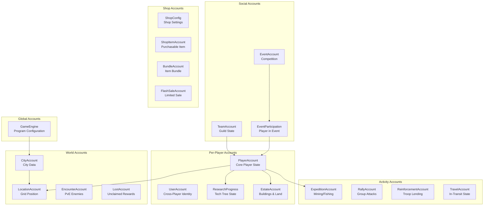
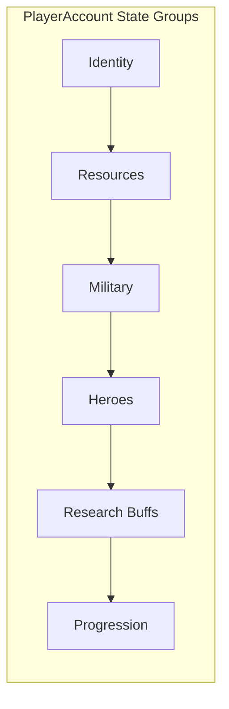
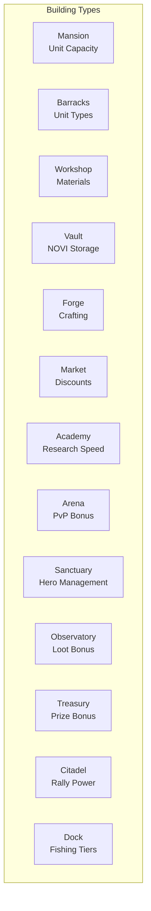
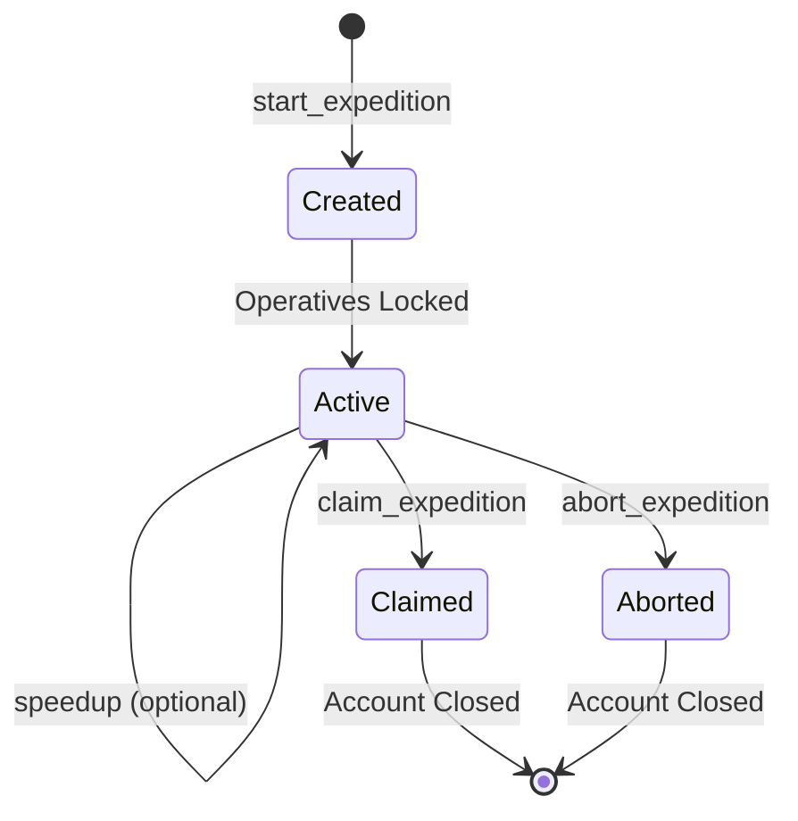
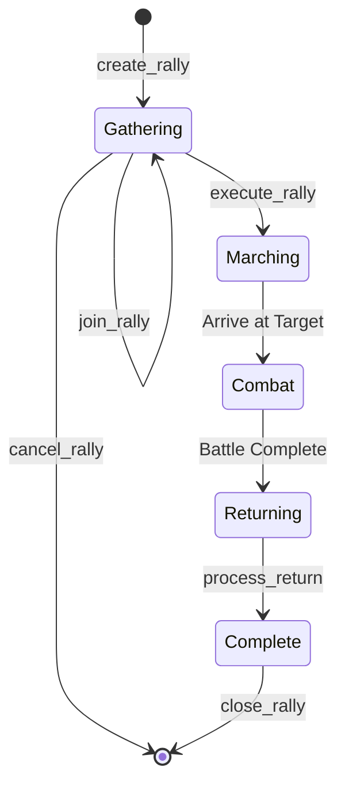

# Account Types

> All Program Derived Accounts (PDAs) used by Novus Mundus and their relationships.

## Account Hierarchy

## Core Accounts

### GameEngine
[Source: state/game_engine.rs](../../../programs/novus_mundus/src/state/game_engine.rs)

The singleton configuration account for the entire program.

| Field | Type | Description |
|-------|------|-------------|
| `authority` | Pubkey | Admin who can modify settings |
| `novi_mint` | Pubkey | NOVI token mint address |
| `treasury` | Pubkey | Program treasury wallet |
| `bump` | u8 | PDA bump seed |
| `total_players` | u64 | Global player count |
| `settings` | GameSettings | Tunable parameters |

**Seeds:** `["game_engine"]`

**Created by:** `initialize_game_engine` (instruction 0)

---

### PlayerAccount
[Source: state/player.rs](../../../programs/novus_mundus/src/state/player.rs)

The primary account for each player, containing all core state.

| Field | Type | Description |
|-------|------|-------------|
| `owner` | Pubkey | Player's wallet address |
| `bump` | u8 | PDA bump seed |
| `extensions` | u32 | Feature unlock flags |
| `current_city` | u16 | Current city ID |
| `current_lat/long` | i32 | Grid coordinates |
| **Resources** | | |
| `locked_novi` | u64 | NOVI locked in program |
| `reserved_novi` | u64 | NOVI pending withdrawal |
| `gems` | u64 | Premium currency |
| `fragments` | u64 | Crafting material |
| `cash` | u64 | Soft currency |
| `produce` | u64 | Farmable resource |
| **Units** | | |
| `operative_unit_1/2/3` | u64 | Troops by tier |
| `melee/ranged/siege_weapons` | u64 | Equipment counts |
| `armor/vehicles` | u64 | Defensive equipment |
| **Heroes** | | |
| `active_heroes` | [Pubkey; 3] | Locked hero NFT mints |
| `defensive_heroes` | [Pubkey; 2] | Heroes defending estate |
| `hero_*_bps` | u16 | Aggregated hero buff values |
| **Research Buffs** | | |
| `research_*_bps` | u16 | Research-granted bonuses |
| **Progression** | | |
| `level` | u16 | Player level |
| `experience` | u64 | Total XP earned |
| `daily_streak` | u16 | Consecutive login days |

**Seeds:** `["player", owner_pubkey]`

**Created by:** `initialize_player` (instruction 1)

---

### UserAccount
[Source: state/player.rs](../../../programs/novus_mundus/src/state/player.rs)

Links a wallet to cross-game identity features.

| Field | Type | Description |
|-------|------|-------------|
| `owner` | Pubkey | Wallet address |
| `player_account` | Pubkey | Associated PlayerAccount |
| `referrer` | Pubkey | Who referred this player |
| `subscription_tier` | u8 | Premium subscription level |
| `subscription_expires` | i64 | Expiration timestamp |

**Seeds:** `["user", owner_pubkey]`

**Created by:** `initialize_user` (instruction 2)

---

### EstateAccount
[Source: state/estate.rs](../../../programs/novus_mundus/src/state/estate.rs)

Manages a player's buildings and land plots.

| Field | Type | Description |
|-------|------|-------------|
| `owner` | Pubkey | Player's wallet |
| `player` | Pubkey | Associated PlayerAccount |
| `bump` | u8 | PDA bump |
| `plots_owned` | u8 | Number of land plots |
| `buildings` | [BuildingSlot; 20] | Building array |
| `daily_*` | fields | Daily activity tracking |

**BuildingSlot Structure:**
| Field | Type | Description |
|-------|------|-------------|
| `building_type` | u8 | Building type enum |
| `level` | u8 | Current level (1-20) |
| `status` | u8 | Idle/Building/Ready |
| `upgrade_start` | i64 | When upgrade began |

**Seeds:** `["estate", player_pubkey]`

**Created by:** `create_estate` (instruction 160)

---

### ResearchProgress
[Source: state/research.rs](../../../programs/novus_mundus/src/state/research.rs)

Tracks a player's progress through the technology tree.

| Field | Type | Description |
|-------|------|-------------|
| `player` | Pubkey | Owner's PlayerAccount |
| `bump` | u8 | PDA bump |
| `ascension_level` | u8 | Prestige tier |
| `mastery_points` | u32 | Accumulated mastery |
| `active_research` | Pubkey | Currently researching |
| `research_start` | i64 | When research began |
| `completed` | [u64; 4] | Bitfield of completed research |

**Seeds:** `["research", player_pubkey]`

**Created by:** `create_research_progress` (instruction 121)

---

## Activity Accounts

### ExpeditionAccount
[Source: state/expedition.rs](../../../programs/novus_mundus/src/state/expedition.rs)

Temporary account for active mining/fishing expeditions.

| Field | Type | Description |
|-------|------|-------------|
| `player` | Pubkey | Expedition owner |
| `hero_mint` | Pubkey | Hero sent (or NULL_PUBKEY) |
| `expedition_type` | u8 | Mining (1) or Fishing (2) |
| `tier` | u8 | Difficulty tier (0-4) |
| `city_id` | u16 | Location for origin bonus |
| `start_time` | i64 | When expedition began |
| `strikes` | u8 | Interactive actions taken |
| `score` | u16 | Performance score |
| `operative_unit_1/2/3` | u64 | Locked operatives |

**Seeds:** `["expedition", owner_pubkey]`

**Lifecycle:**

---

### RallyAccount
[Source: state/rally.rs](../../../programs/novus_mundus/src/state/rally.rs)

Coordinates group attacks on cities. Uses a two-account architecture with separate RallyParticipant accounts.

| Field | Type | Description |
|-------|------|-------------|
| `id` | u64 | Unique rally ID |
| `creator` | Pubkey | Rally leader |
| `team` | Pubkey | Team this rally belongs to |
| `rally_city` | u16 | Gathering city |
| `target_city` | u16 | Attack target city |
| `target_type` | u8 | 0=player, 1=encounter |
| `target` | Pubkey | Target address |
| `status` | u8 | RallyStatus enum |
| `gather_at` | i64 | Join deadline |
| `march_started_at` | i64 | When march began |
| `arrive_at` | i64 | Combat time |
| `leader_*_bps` | u16 | Leader's snapshotted buffs |
| `participant_count` | u8 | Current count |
| `arrived_count` | u8 | Arrived at rally point |
| `total_units` | u64 | Aggregated unit count |
| `total_*_weapons` | u64 | Aggregated weapon counts |
| `total_casualties` | u64 | Units lost in combat |
| `total_loot_*` | u64 | Resources captured |
| `attacker_won` | bool | Battle outcome |

**Seeds:** `["rally", creator_pubkey, rally_id_bytes]`

**Lifecycle:**

---

### RallyParticipant
[Source: state/rally.rs](../../../programs/novus_mundus/src/state/rally.rs)

Per-joiner state for a rally. Each participant pays rent for their own account.

| Field | Type | Description |
|-------|------|-------------|
| `rally_id` | u64 | Which rally |
| `rally_creator` | Pubkey | For PDA derivation |
| `participant` | Pubkey | This joiner's wallet |
| `home_city` | u16 | Return destination |
| `units_committed_1/2/3` | u64 | Units deducted at join |
| `melee/ranged/siege_weapons_committed` | u64 | Weapons deducted |
| `research_*_bps` | u16 | Snapshotted buffs |
| `hero` | Pubkey | Committed hero NFT |
| `arrives_at_rally` | i64 | Arrival time at rally point |
| `included_in_march` | bool | Made it in time? |
| `casualties_1/2/3` | u64 | Units lost |
| `loot_*` | u64 | Personal loot share |
| `contribution_bps` | u16 | % of rally power |

**Seeds:** `["rally_participant", creator_pubkey, rally_id_bytes, participant_pubkey]`

---

### ReinforcementAccount
[Source: state/reinforcement.rs](../../../programs/novus_mundus/src/state/reinforcement.rs)

Unified account for player reinforcements and castle garrisons.

| Field | Type | Description |
|-------|------|-------------|
| `sender` | Pubkey | Who sent reinforcement |
| `destination` | Pubkey | PlayerAccount OR CastleAccount |
| `destination_type` | u8 | 0=Player, 1=Castle |
| `sender_city` | u16 | For return travel calc |
| `destination_city` | u16 | Target city |
| `units_def_1/2/3` | u64 | Defense units sent |
| `melee/ranged/siege_weapons` | u64 | Weapons sent |
| `hero` | Pubkey | Committed hero (or NULL) |
| `hero_defense_bps` | u16 | Snapshotted buff |
| `sent_at` | i64 | Departure time |
| `arrives_at` | i64 | Arrival time |
| `return_started_at` | i64 | When return began (0 if not) |
| `status` | u8 | Traveling/Active/Returning/Completed |
| `combats_participated` | u64 | Defense battles fought |

**Seeds (Player):** `["reinforcement", sender, destination_player]`

**Seeds (Castle):** `["garrison", sender, castle]`

---

## World Accounts

### CityAccount
[Source: state/city.rs](../../../programs/novus_mundus/src/state/city.rs)

Represents a city in the game world.

| Field | Type | Description |
|-------|------|-------------|
| `city_id` | u16 | Unique identifier |
| `name` | [u8; 32] | City name |
| `latitude/longitude` | i32 | World coordinates |
| `players_present` | u32 | Current population |
| `resources` | CityResources | Claimable resources |
| `controller` | Pubkey | Dominant team |

**Seeds:** `["city", city_id_bytes]`

---

### LocationAccount
[Source: state/location.rs](../../../programs/novus_mundus/src/state/location.rs)

A grid cell (~11m × 11m) that can hold players or encounters. Supports speed-based reservation stealing.

| Field | Type | Description |
|-------|------|-------------|
| `grid_lat` | i32 | Grid latitude (coord × 10000) |
| `grid_long` | i32 | Grid longitude (coord × 10000) |
| `city_id` | u16 | Parent city |
| `bump` | u8 | PDA bump |
| `occupant_type` | u8 | 0=none, 1=player, 2=encounter |
| `occupant` | Pubkey | Entity occupying cell |
| `occupied_since` | i64 | Arrival timestamp |
| `location_creator` | Pubkey | Receives rent refund |
| `reserved_arrival_time` | i64 | For traveling occupants |

**Seeds:** `["location", city_id_bytes, grid_lat_bytes, grid_long_bytes]`

**Reservation Stealing:** If a player would arrive BEFORE the current reservation holder, they can steal the cell and reverse the other player's journey.

---

### EncounterAccount
[Source: state/encounter.rs](../../../programs/novus_mundus/src/state/encounter.rs)

A PvE enemy that can be attacked.

| Field | Type | Description |
|-------|------|-------------|
| `encounter_type` | u8 | Enemy type |
| `tier` | u8 | Difficulty |
| `health` | u64 | Remaining HP |
| `max_health` | u64 | Starting HP |
| `location` | Pubkey | Where it spawned |
| `rewards` | EncounterRewards | Loot on defeat |

**Seeds:** `["encounter", location_pubkey]`

---

## Social Accounts

### TeamAccount
[Source: state/team.rs](../../../programs/novus_mundus/src/state/team.rs)

Guild/clan organization with up to 50 members.

| Field | Type | Description |
|-------|------|-------------|
| `id` | u64 | Unique team ID |
| `leader` | Pubkey | Team leader |
| `name` | [u8; 32] | Team name bytes |
| `name_len` | u8 | Name length |
| `disbanded` | bool | True if dissolved |
| `members` | [Pubkey; 50] | Member array |
| `member_count` | u8 | Current size (0-50) |
| `created_at` | i64 | Creation timestamp |
| `treasury` | u64 | Shared NOVI balance |

**Seeds:** `["team", team_id_bytes]`

---

### EventAccount
[Source: state/event.rs](../../../programs/novus_mundus/src/state/event.rs)

Time-limited competition with leaderboard and prizes.

| Field | Type | Description |
|-------|------|-------------|
| `id` | u64 | Unique event ID |
| `name` | [u8; 64] | Event name |
| `start_time` | i64 | When event starts |
| `end_time` | i64 | When event ends |
| `status` | u8 | Pending/Active/Finalized/Cancelled |
| `event_type` | u8 | Scoring method (kills, resources, etc.) |
| `min_level` | u8 | Participation requirement |
| `min_reputation` | u64 | Participation requirement |
| `leaderboard` | [LeaderboardEntry; 10] | Top 10 players |
| `prize_type` | u8 | LockedNovi/Gems/Cash/SPLToken |
| `prize_amount` | u64 | Total prize pool |
| `prize_remaining` | u64 | Unclaimed amount |
| `participant_count` | u32 | Total participants |

**Seeds:** `["event", event_id_bytes]`

---

### EventParticipation
[Source: state/event.rs](../../../programs/novus_mundus/src/state/event.rs)

Per-player-per-event tracking. Closed after claiming prize.

| Field | Type | Description |
|-------|------|-------------|
| `event_id` | u64 | Which event |
| `player` | Pubkey | Participant |
| `score` | u64 | Current score |
| `joined_at` | i64 | Join timestamp |
| `last_update` | i64 | Last score update |

**Seeds:** `["event_participation", event_id_bytes, player_pubkey]`

---

## Shop Accounts

### ShopItemAccount
[Source: state/shop.rs](../../../programs/novus_mundus/src/state/shop.rs)

A purchasable item in the shop.

| Field | Type | Description |
|-------|------|-------------|
| `item_id` | u16 | Unique identifier |
| `price_novi/sol` | u64 | Cost options |
| `item_type` | u8 | What it grants |
| `quantity` | u64 | Amount given |
| `max_purchases` | u32 | Limit per player |

**Seeds:** `["shop_item", item_id_bytes]`

---

## Account Size Reference

| Account Type | Size (bytes) | Rent (SOL) |
|--------------|--------------|------------|
| GameEngine | ~256 | ~0.002 |
| PlayerAccount | ~1024 | ~0.008 |
| UserAccount | ~128 | ~0.001 |
| EstateAccount | ~512 | ~0.004 |
| ResearchProgress | ~256 | ~0.002 |
| ExpeditionAccount | 104 | ~0.001 |
| RallyAccount | ~1024 | ~0.008 |
| CityAccount | ~256 | ~0.002 |
| LocationAccount | ~128 | ~0.001 |
| TeamAccount | ~2048 | ~0.016 |

*Rent values are approximate based on current Solana rent rates.*

---

## Research Accounts

### ResearchTemplate
[Source: state/research.rs](../../../programs/novus_mundus/src/state/research.rs)

DAO-controlled configuration for each research node.

| Field | Type | Description |
|-------|------|-------------|
| `research_type` | u8 | Node ID (0-29) |
| `category` | u8 | Battle/Economy/Growth |
| `max_level` | u8 | Maximum level (5-25) |
| `base_time_seconds` | u32 | Base research time |
| `base_novi_cost` | u64 | NOVI cost for level 1 |
| `buff_type` | u8 | ResearchBuffType enum |
| `buff_per_level_bps` | u16 | Buff per level (basis points) |
| `prerequisite_research` | u8 | Required prior research (255=none) |
| `prerequisite_level` | u8 | Required level of prereq |
| `is_active` | bool | DAO can disable nodes |

**Seeds:** `["research_template", research_type]`

---

## Hero Accounts

### HeroTemplateAccount
[Source: state/hero.rs](../../../programs/novus_mundus/src/state/hero.rs)

Definition for a hero collection/type.

| Field | Type | Description |
|-------|------|-------------|
| `collection` | Pubkey | NFT collection address |
| `name` | [u8; 32] | Hero template name |
| `origin_city` | u16 | Home city (for location bonus) |
| `buff_slots` | [HeroBuff; 4] | Buff definitions |
| `max_supply` | u32 | Maximum mintable |
| `current_supply` | u32 | Currently minted |
| `mint_price_lamports` | u64 | SOL mint cost |
| `is_active` | bool | Can be minted |

**Seeds:** `["hero_template", collection_pubkey]`

### HeroAccount
[Source: state/hero.rs](../../../programs/novus_mundus/src/state/hero.rs)

Per-hero NFT state tracking.

| Field | Type | Description |
|-------|------|-------------|
| `mint` | Pubkey | NFT mint address |
| `template` | Pubkey | Hero template |
| `owner` | Pubkey | Current owner |
| `level` | u8 | Hero level (1-100) |
| `experience` | u64 | Current XP |
| `locked_by` | Pubkey | PlayerAccount using this hero |
| `lock_slot` | u8 | Which slot (active/defensive) |
| `meditation_start` | i64 | Sanctuary meditation start |

**Seeds:** `["hero", mint_pubkey]`

---

## Forge Accounts

### CraftedEquipmentAccount
[Source: state/estate.rs](../../../programs/novus_mundus/src/state/estate.rs)

Tracks crafted equipment and active staging tempering.

| Field | Type | Description |
|-------|------|-------------|
| `owner` | Pubkey | Player's wallet |
| `active_craft_equipment` | u8 | Equipment being crafted |
| `target_tier` | u8 | Target quality tier |
| `stages_required` | u8 | Total stages needed |
| `current_stage` | u8 | Current stage (1-indexed) |
| `stages_completed` | u8 | Successful strikes |
| `window_opens_at` | i64 | When strike window opens |
| `window_closes_at` | i64 | When window closes |
| `precision_score` | u16 | Accumulated precision |
| `equipment` | [CraftedItem; 8] | Completed equipment slots |
| `total_crafts` | u32 | Total attempts |
| `successful_crafts` | u32 | Successful completions |

**Seeds:** `["crafted_equipment", owner_pubkey]`

---

## Shop Accounts (Extended)

### ShopConfigAccount
[Source: state/shop.rs](../../../programs/novus_mundus/src/state/shop.rs)

Global shop configuration with multi-layer discount caps.

| Field | Type | Description |
|-------|------|-------------|
| `max_base_discount_bps` | u16 | Layer 1 cap (default 6000) |
| `max_bundle_discount_bps` | u16 | Layer 2 cap (default 3500) |
| `max_fib_discount_bps` | u16 | Layer 3 cap (default 2000) |
| `max_total_discount_bps` | u16 | Combined cap (default 7500) |
| `bronze/silver/gold/platinum/diamond_threshold` | u64 | Milestone thresholds |
| `bronze/silver/gold/platinum/diamond_discount_bps` | u16 | Milestone discounts |
| `streak_day_*_bps` | u16 | Loyalty streak discounts |

**Seeds:** `["shop_config", game_engine_pubkey]`

### FlashSaleAccount
[Source: state/shop.rs](../../../programs/novus_mundus/src/state/shop.rs)

Time-limited deep discount sales.

| Field | Type | Description |
|-------|------|-------------|
| `sale_id` | u64 | Unique sale ID |
| `item_id` | u64 | Item on sale |
| `discount_bps` | u16 | Sale discount |
| `started_at` | i64 | Sale start |
| `ends_at` | i64 | Sale end |
| `quantity_available` | u32 | Stock limit |
| `quantity_sold` | u32 | Units sold |
| `max_per_player` | u8 | Per-player limit |

**Seeds:** `["flash_sale", game_engine, sale_id_bytes]`

### PlayerPurchaseAccount
[Source: state/shop.rs](../../../programs/novus_mundus/src/state/shop.rs)

Per-player purchase tracking for loyalty system.

| Field | Type | Description |
|-------|------|-------------|
| `player` | Pubkey | Player's wallet |
| `total_sol_spent` | u64 | For milestone tracking |
| `total_novi_spent` | u64 | Lifetime spend |
| `last_purchase_day` | u32 | For streak tracking |
| `current_streak` | u8 | Consecutive purchase days |
| `milestone_tier` | u8 | 0-5 (none to diamond) |

**Seeds:** `["player_purchase", player_pubkey]`

---

Next: [Instruction Map](./instruction-map.md) - Complete instruction reference
