# Instruction Map

> Complete reference of all Novus Mundus instructions organized by category.

## Instruction Format

All instructions use a 2-byte little-endian discriminant followed by instruction-specific data:

```
[discriminant: u16 LE] [instruction_data: bytes...]
```

## Overview by Category

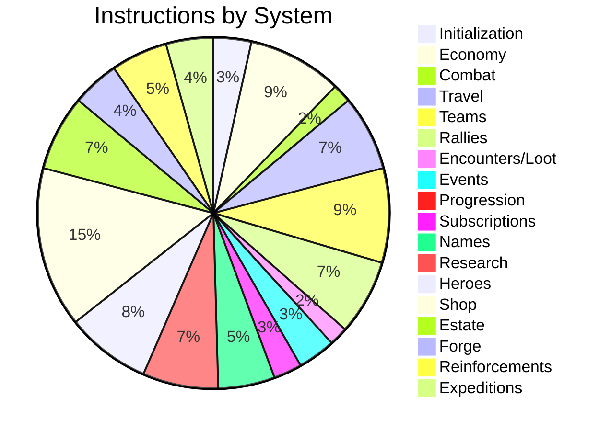

---

## Initialization (0-9)
[Source: processor/initialization/](../../../programs/novus_mundus/src/processor/initialization/)

| ID | Name | Description | Key Accounts |
|----|------|-------------|--------------|
| 0 | `initialize_game_engine` | Create global config | GameEngine (create) |
| 1 | `initialize_player` | Create player account | PlayerAccount (create) |
| 2 | `initialize_user` | Create user identity | UserAccount (create) |
| 3 | `initialize_city` | Create a city | CityAccount (create) |

### Flow
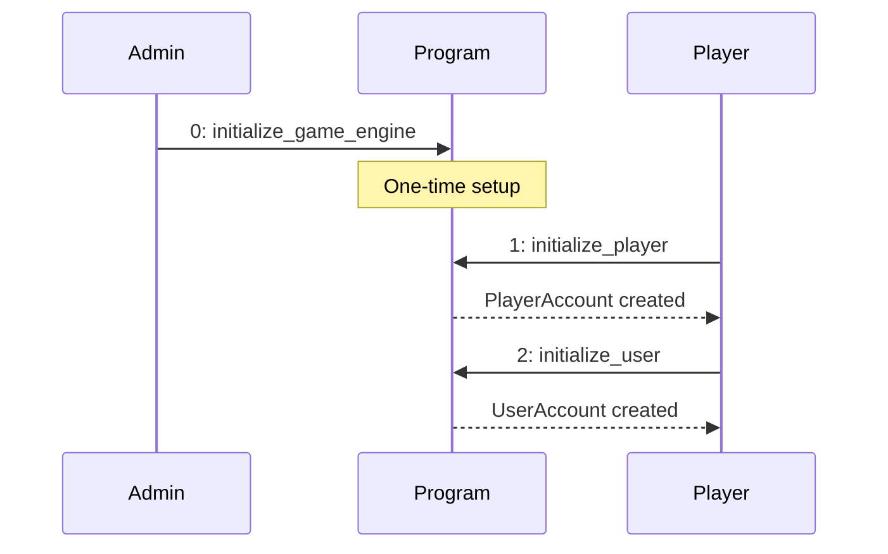

---

## Economy (10-19)
[Source: processor/economy/](../../../programs/novus_mundus/src/processor/economy/)

| ID | Name | Description | Data |
|----|------|-------------|------|
| 10 | `update_locked_novi` | Deposit NOVI to locked balance | amount: u64 |
| 11 | `hire_units` | Purchase operative units | unit_type: u8, amount: u64 |
| 12 | `collect_resources` | Gather resources from current location | resource_type: u8 |
| 13 | `purchase_equipment` | Buy weapons/armor/vehicles | equipment_type: u8, amount: u64 |
| 14 | `mint_for_prize` | Mint NOVI for event prizes | amount: u64 |
| 15 | `reserved_to_locked` | Move reserved NOVI to locked | amount: u64 |
| 16 | `withdraw_reserved` | Withdraw reserved NOVI | amount: u64 |
| 17 | `purchase_stamina` | Buy stamina refill | - |
| 18 | `transfer_cash` | Send cash to another player | recipient: Pubkey, amount: u64 |
| 19 | `vault_transfer` | Transfer between vault and inventory | direction: u8, amount: u64 |

### Resource Flow
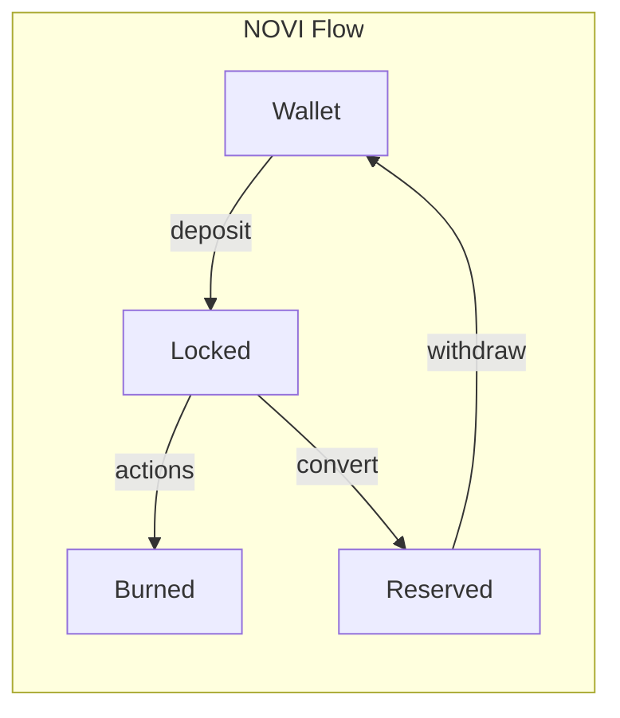

---

## Combat (20-29)
[Source: processor/combat/](../../../programs/novus_mundus/src/processor/combat/)

| ID | Name | Description | Data |
|----|------|-------------|------|
| 20 | `attack_player` | PvP attack | target: Pubkey |
| 21 | `attack_encounter` | PvE attack | damage_type: u8 |

### Combat Flow
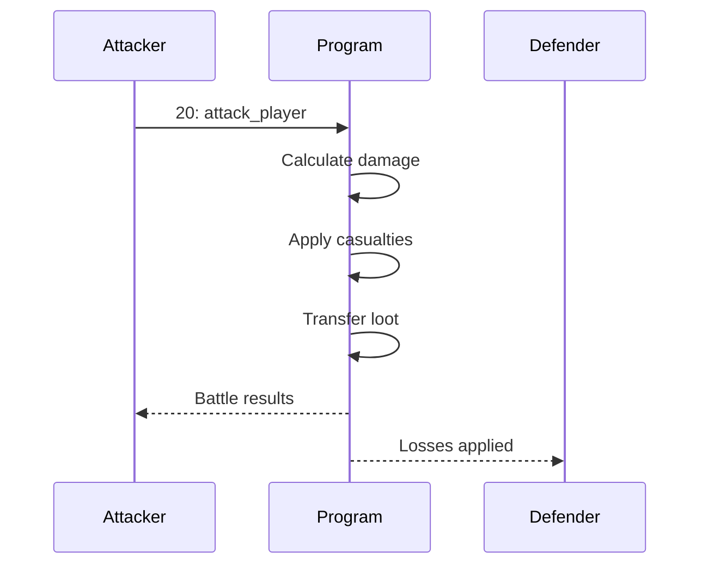

---

## Travel - Intercity (30-39)
[Source: processor/travel/](../../../programs/novus_mundus/src/processor/travel/)

| ID | Name | Description | Data |
|----|------|-------------|------|
| 30 | `intercity_start` | Begin travel to another city | destination_city: u16 |
| 31 | `intercity_complete` | Arrive at destination | - |
| 32 | `intercity_cancel` | Cancel travel, return home | - |
| 33 | `intercity_teleport` | Instant travel (costs gems) | destination_city: u16 |

### Travel Flow
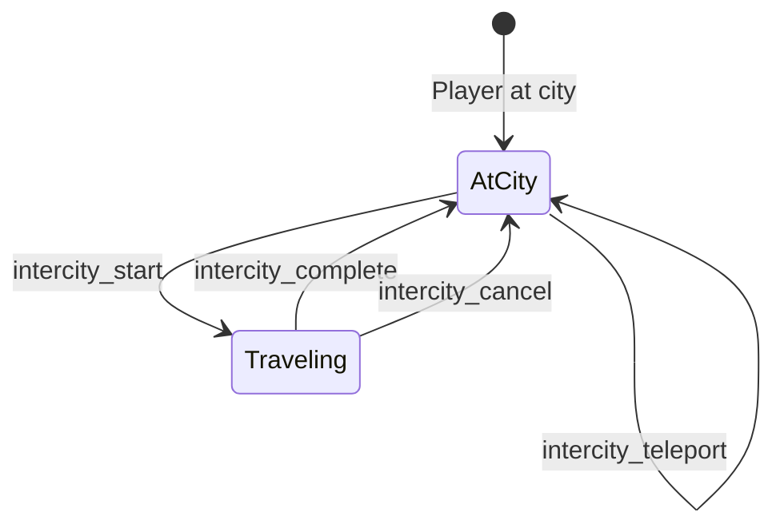

---

## Travel - Intracity (40-49)

| ID | Name | Description | Data |
|----|------|-------------|------|
| 40 | `intracity_start` | Move within city grid | target_lat: i16, target_long: i16 |
| 41 | `intracity_complete` | Arrive at grid location | - |

---

## Teams (50-59)
[Source: processor/team/](../../../programs/novus_mundus/src/processor/team/)

| ID | Name | Description | Data |
|----|------|-------------|------|
| 50 | `create_team` | Create a new team | name: [u8; 32] |
| 51 | `join_team` | Join existing team | team: Pubkey |
| 52 | `leave_team` | Leave current team | - |
| 53 | `deposit_treasury` | Add funds to team treasury | amount: u64 |
| 54 | `invite_player` | Invite player to team | invitee: Pubkey |
| 55 | `accept_invite` | Accept team invitation | team: Pubkey |
| 56 | `transfer_leadership` | Hand over leadership | new_leader: Pubkey |
| 57 | `kick_member` | Remove member from team | member: Pubkey |
| 58 | `disband_team` | Dissolve the team | - |
| 59 | `withdraw_treasury` | Leader withdraws funds | amount: u64 |

---

## Rallies (60-69)
[Source: processor/rally/](../../../programs/novus_mundus/src/processor/rally/)

| ID | Name | Description | Data |
|----|------|-------------|------|
| 60 | `create_rally` | Start a group attack | target_city: u16, execute_delay: i64 |
| 61 | `join_rally` | Join existing rally | rally: Pubkey, units... |
| 62 | `execute_rally` | Launch the attack | - |
| 63 | `leave_rally` | Leave before execution | - |
| 64 | `cancel_rally` | Leader cancels rally | - |
| 65 | `process_return` | Handle returning troops | - |
| 66 | `speedup_rally` | Speed up march/return | tier: u8 |
| 67 | `close_rally` | Clean up completed rally | - |

### Rally Lifecycle
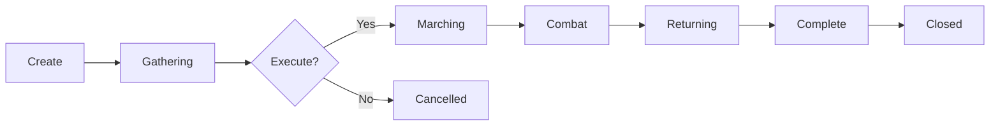

---

## Encounters & Loot (70-79)
[Source: processor/encounter/](../../../programs/novus_mundus/src/processor/encounter/)

| ID | Name | Description | Data |
|----|------|-------------|------|
| 70 | `spawn_encounter` | Create PvE enemy | encounter_type: u8, tier: u8 |
| 71 | `claim_loot` | Collect unclaimed rewards | - |

---

## Events (80-89)
[Source: processor/event/](../../../programs/novus_mundus/src/processor/event/)

| ID | Name | Description | Data |
|----|------|-------------|------|
| 80 | `create_event` | Start competition | event_type: u8, duration: i64 |
| 81 | `join_event` | Enter competition | event: Pubkey |
| 82 | `finalize_event` | End and rank participants | - |
| 83 | `claim_prize` | Collect event rewards | - |

---

## Progression (90-99)
[Source: processor/progression/](../../../programs/novus_mundus/src/processor/progression/)

| ID | Name | Description | Data |
|----|------|-------------|------|
| 90 | `claim_daily_reward` | Collect daily login bonus | - |

---

## Subscriptions (100-109)
[Source: processor/subscription/](../../../programs/novus_mundus/src/processor/subscription/)

| ID | Name | Description | Data |
|----|------|-------------|------|
| 100 | `purchase_subscription` | Buy premium tier | tier: u8, duration: u8 |
| 101 | `update_tier` | Change subscription tier | new_tier: u8 |
| 102 | `downgrade_expired` | Handle expired subscription | - |

---

## Names (110-119)
[Source: processor/name/](../../../programs/novus_mundus/src/processor/name/)

| ID | Name | Description | Data |
|----|------|-------------|------|
| 110 | `set_player_name` | Set display name | name: String |
| 111 | `set_team_name` | Set team display name | name: String |
| 112 | `remove_player_name` | Clear player name | - |
| 113 | `remove_team_name` | Clear team name | - |
| 114 | `update_player_name` | Change player name | name: String |
| 115 | `update_team_name` | Change team name | name: String |

---

## Research (120-129)
[Source: processor/research/](../../../programs/novus_mundus/src/processor/research/)

| ID | Name | Description | Data |
|----|------|-------------|------|
| 120 | `initialize_template` | Create research definition | template_data... |
| 121 | `create_progress` | Create player's research account | - |
| 122 | `start_research` | Begin researching | template: Pubkey |
| 123 | `complete_research` | Finish research | - |
| 124 | `speed_up_research` | Reduce remaining time | tier: u8 |
| 125 | `cancel_research` | Abandon research | - |
| 126 | `update_template` | Modify research template | template_data... |
| 127 | `ascend` | Prestige reset for bonuses | - |

### Research Flow
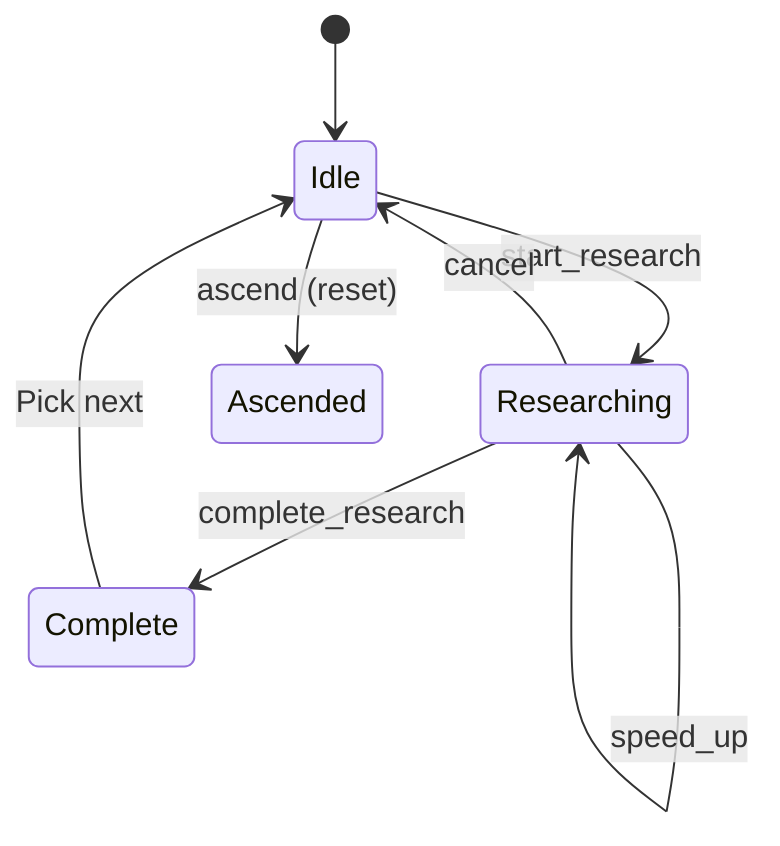

---

## Heroes (130-139)
[Source: processor/hero/](../../../programs/novus_mundus/src/processor/hero/)

| ID | Name | Description | Data |
|----|------|-------------|------|
| 130 | `create_template` | Define hero type | template_data... |
| 131 | `mint_hero` | Mint hero NFT | template: Pubkey |
| 132 | `lock_hero` | Activate hero buffs | slot: u8 |
| 133 | `unlock_hero` | Deactivate hero | slot: u8 |
| 134 | `level_up_hero` | Increase hero level | - |
| 135 | `assign_defensive` | Set hero for defense | slot: u8 |
| 136 | `create_collection` | Create hero NFT collection | - |
| 137 | `start_meditation` | Begin hero meditation | slot: u8 |
| 138 | `claim_meditation` | Complete meditation | - |

### Hero States
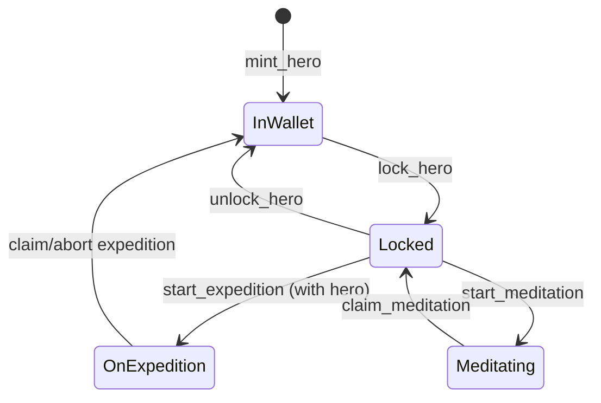

---

## Shop (140-159)
[Source: processor/shop/](../../../programs/novus_mundus/src/processor/shop/)

| ID | Name | Description |
|----|------|-------------|
| 140 | `initialize_config` | Set up shop configuration |
| 141 | `create_item` | Add purchasable item |
| 142 | `create_bundle` | Create item bundle |
| 143 | `purchase_item` | Buy single item |
| 144 | `purchase_bundle` | Buy bundle |
| 145 | `create_flash_sale` | Create limited-time sale |
| 146 | `purchase_flash_sale` | Buy flash sale item |
| 147 | `close_sale` | End a sale |
| 148 | `create_daily_deal` | Set up daily rotation |
| 149 | `rotate_daily_deal` | Change daily offering |
| 150 | `create_weekly_sale` | Set up weekly sale |
| 151 | `update_item` | Modify item details |
| 152 | `create_seasonal_sale` | Create seasonal event |
| 153 | `create_dao_promotion` | DAO-voted promotion |
| 154 | `update_bundle` | Modify bundle |
| 155 | `update_config` | Change shop settings |
| 156 | `activate_sale` | Enable a sale |

---

## Estate (160-179)
[Source: processor/estate/](../../../programs/novus_mundus/src/processor/estate/)

| ID | Name | Description | Data |
|----|------|-------------|------|
| 160 | `create_estate` | Initialize estate account | - |
| 161 | `build` | Start building construction | building_type: u8, plot: u8 |
| 162 | `upgrade` | Start building upgrade | plot: u8 |
| 163 | `complete` | Finish construction/upgrade | plot: u8 |
| 164 | `buy_plot` | Purchase additional land | - |
| 165 | `daily_claim` | Collect daily building bonuses | - |
| 166 | `daily_activity` | Record daily engagement | activity_type: u8 |
| 167 | `convert_materials` | Transform resources | from_type: u8, to_type: u8, amount: u64 |

### Building Progression
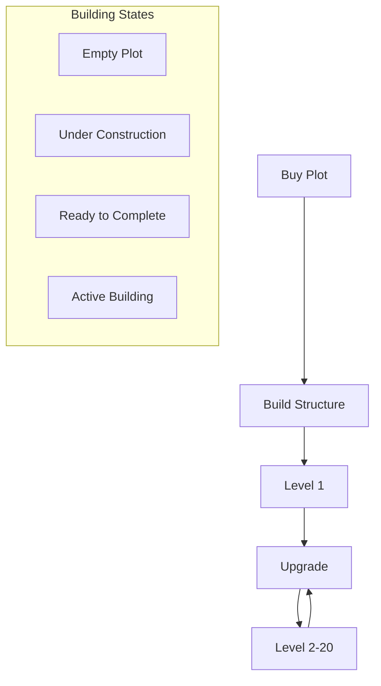

---

## Forge (180-189)
[Source: processor/forge/](../../../programs/novus_mundus/src/processor/forge/)

| ID | Name | Description | Data |
|----|------|-------------|------|
| 180 | `initialize_forge` | Set up forge account | - |
| 181 | `start_craft` | Begin crafting item | recipe: u8 |
| 182 | `strike` | Perform tempering action | - |
| 183 | `abandon_craft` | Cancel crafting | - |
| 184 | `equip` | Equip crafted item | slot: u8 |

### Staged Tempering
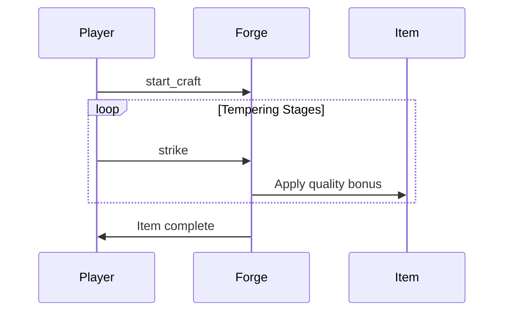

---

## Reinforcements (190-199)
[Source: processor/reinforcement/](../../../programs/novus_mundus/src/processor/reinforcement/)

| ID | Name | Description | Data |
|----|------|-------------|------|
| 190 | `send_reinforcement` | Send troops to ally | receiver: Pubkey, units... |
| 191 | `process_arrival` | Handle troop arrival | - |
| 192 | `recall` | Call troops back | - |
| 193 | `relieve` | Dismiss received troops | sender: Pubkey |
| 194 | `process_return` | Handle returning troops | - |
| 195 | `speedup` | Speed up march | tier: u8 |

---

## Expeditions (200-209)
[Source: processor/expedition/](../../../programs/novus_mundus/src/processor/expedition/)

| ID | Name | Description | Data |
|----|------|-------------|------|
| 200 | `start_expedition` | Begin mining/fishing | type: u8, tier: u8, operatives... |
| 201 | `strike` | Perform expedition action | - |
| 202 | `claim_expedition` | Collect rewards | - |
| 203 | `abort_expedition` | Cancel early | - |
| 204 | `speedup_expedition` | Reduce remaining time | tier: u8 |

### Expedition Flow
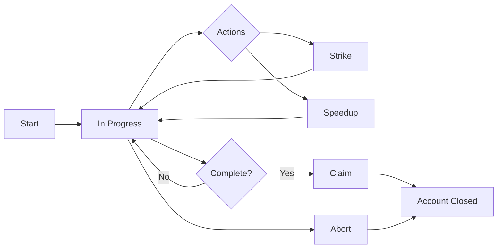

---

## Quick Reference: Instruction by Purpose

### Creating Accounts
| Purpose | Instruction |
|---------|-------------|
| New player | 1: initialize_player |
| User identity | 2: initialize_user |
| Research tracking | 121: create_progress |
| Estate | 160: create_estate |
| Team | 50: create_team |

### Spending Resources
| Resource | Instructions |
|----------|--------------|
| NOVI | 10 (deposit), 11 (hire), various |
| Gems | 17 (stamina), 33 (teleport), 204 (speedup) |
| Cash | 18 (transfer), 143/144 (shop) |

### Time-Based Actions
| Action | Start | Complete | Speedup | Abort |
|--------|-------|----------|---------|-------|
| Travel | 30 | 31 | 33 (teleport) | 32 |
| Research | 122 | 123 | 124 | 125 |
| Expedition | 200 | 202 | 204 | 203 |
| Rally | 60 | 62→65 | 66 | 64 |
| Building | 161/162 | 163 | - | - |

---

*For detailed account structures, see [Accounts](./accounts.md)*
