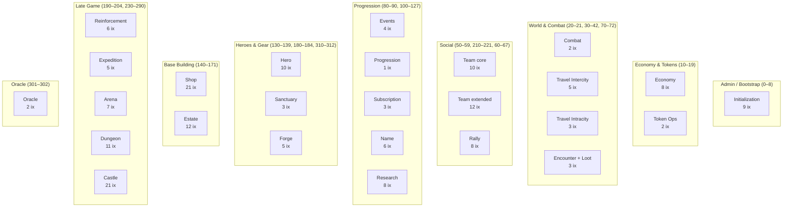
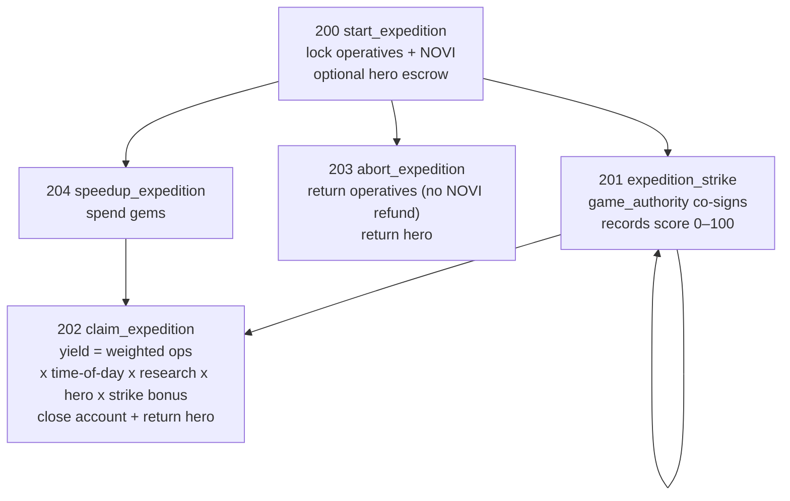
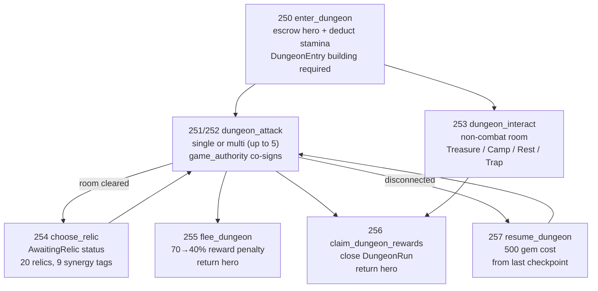
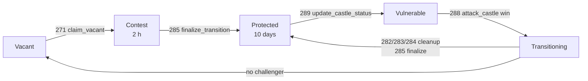

# Instruction Map

> Complete reference of all 189 Novus Mundus instructions. Source of truth: `programs/novus_mundus/src/lib.rs`.

## Instruction Format

Every instruction shares the same wire format:

```
Byte 0–1 : u16 little-endian discriminant
Byte 2+  : instruction-specific payload (passed as &data[2..])
```

The `msg!` string in each match arm (e.g. `"init game engine"`) is the canonical instruction name. There is no IDL.

**Total: 189 instructions across 25 systems.**

Discriminant **gaps** (reserved for future use): 9, 22–29, 35–39, 43–49, 68–69, 73–79, 84–89, 91–99, 103–109, 116–119, 128–129, 172–179, 185–189, 196–199, 205–209, 222–229, 237–249, 261–269, 291–299, 303–309, 322–329.

[Source: lib.rs](../../../programs/novus_mundus/src/lib.rs)

---

## System Map

Instruction discriminant ranges, grouped by functional area:



---

## Systems Index

| System | Discriminants | Count |
|--------|--------------|-------|
| [Initialization](#initialization-09) | 0–8 | 9 |
| [Economy](#economy-1014-1719) | 10–14, 17–19 | 8 |
| [Token Operations](#token-operations-1516) | 15–16 | 2 |
| [Combat](#combat-2021) | 20–21 | 2 |
| [Travel — Intercity](#travel--intercity-3034) | 30–34 | 5 |
| [Travel — Intracity](#travel--intracity-4042) | 40–42 | 3 |
| [Team (core)](#team-core-5059) | 50–59 | 10 |
| [Rally](#rally-6067) | 60–67 | 8 |
| [Encounter](#encounter-70-72) | 70, 72 | 2 |
| [Loot](#loot-71) | 71 | 1 |
| [Events](#events-8083) | 80–83 | 4 |
| [Progression](#progression-90) | 90 | 1 |
| [Subscription](#subscription-100102) | 100–102 | 3 |
| [Name](#name-110115) | 110–115 | 6 |
| [Research](#research-120127) | 120–127 | 8 |
| [Hero](#hero-130136-310312) | 130–136, 310–312 | 10 |
| [Sanctuary](#sanctuary-137139) | 137–139 | 3 |
| [Shop](#shop-140159-300) | 140–159, 300 | 21 |
| [Estate](#estate-160171) | 160–171 | 12 |
| [Forge](#forge-180184) | 180–184 | 5 |
| [Reinforcement](#reinforcement-190195) | 190–195 | 6 |
| [Expedition](#expedition-200204) | 200–204 | 5 |
| [Team (extended)](#team-extended-210221) | 210–221 | 12 |
| [Arena](#arena-230236) | 230–236 | 7 |
| [Dungeon](#dungeon-250260) | 250–260 | 11 |
| [Castle](#castle-270290) | 270–290 | 21 |
| [Oracle](#oracle-301302) | 301–302 | 2 |

---

## Initialization (0–9)

**9 instructions.** Admin/DAO operations for bootstrapping kingdoms and world geometry.

| ID | Canonical name | Processor | Description |
|----|---------------|-----------|-------------|
| 0 | `init game engine` | `processor::initialization::game_engine` | Create a `GameEngine` PDA for a new kingdom; initializes NOVI mint on first call |
| 1 | `init player` | `processor::initialization::player` | Create `PlayerAccount` PDA for a new player; mints `STARTER_LOCKED_NOVI = 1_000_000` |
| 2 | `init user` | `processor::initialization::user` | Create `UserAccount` PDA (reserved NOVI vesting account) |
| 3 | `init city` | `processor::initialization::city` | Create a `CityAccount` at a geographic coordinate |
| 4 | `close registration` | `processor::initialization::close_registration` | DAO closes new-player registration for a kingdom |
| 5 | `batch init cities` | `processor::initialization::batch_cities` | Create multiple city accounts in one transaction |
| 6 | `update game config` | `processor::initialization::update_game_config` | DAO updates embedded `GameEngine` sub-configs (caps, economic config, gameplay config, etc.) |
| **7** | *(retired)* | — | Was `set terrain` — biome is now a pure function of `(biome_seed, ox, oy)`, no per-city anchor block. |
| **8** | *(retired)* | — | Was `append terrain` — see ID 7. |
| **9** | *(reserved)* | — | — |

[Source: processor/initialization/](../../../programs/novus_mundus/src/processor/initialization/)

---

## Economy (10–14, 17–19)

**8 instructions.** Token generation, unit hiring, resource collection, equipment purchases.

| ID | Canonical name | Processor | Description |
|----|---------------|-----------|-------------|
| 10 | `update locked novi` | `processor::economy::update_locked_novi` | Time-based NOVI generation; mints based on `subscription_tiers[tier].locked_novi_per_5min`, capped by `max_locked_novi` |
| 11 | `hire units` | `processor::economy::hire_units` | Buy defensive or operative units by burning locked NOVI |
| 12 | `collect resources` | `processor::economy::collect_resources` | Collect accrued cash/produce from estate buildings |
| 13 | `purchase equipment` | `processor::economy::purchase_equipment` | Buy weapons, armor, or vehicles from the market |
| 14 | `mint for prize` | `processor::economy::mint_for_prize` | DAO mints NOVI for prizes, marketing, dev, treasury, or liquidity (per-purpose caps) |
| *15–16* | *(token ops)* | — | See [Token Operations](#token-operations-1516) |
| 17 | `purchase stamina` | `processor::economy::purchase_stamina` | Buy encounter stamina by burning locked NOVI |
| 18 | `transfer cash` | `processor::economy::transfer_cash` | Transfer cash between same-team players (Vault level ≥ 5 required; daily caps by subscription tier) |
| 19 | `vault transfer` | `processor::economy::vault_transfer` | Move cash between a player's `cash_on_hand` and `cash_in_vault` |

[Source: processor/economy/](../../../programs/novus_mundus/src/processor/economy/)

---

## Token Operations (15–16, 320–321)

**4 instructions.** Direct NOVI token operations.

| ID | Canonical name | Processor | Description |
|----|---------------|-----------|-------------|
| 15 | `reserved to locked` | `processor::token::reserved_to_locked` | Move vested `reserved_novi` into `locked_novi` (SPL transfer between the User PDA and Player PDA token accounts) |
| 16 | `withdraw reserved` | `processor::token::withdraw_reserved` | Withdraw vested `reserved_novi` to a player-owned ATA (7-day vesting enforced) |
| 320 | `deposit novi` | `processor::economy::deposit_novi` | Wallet → reserved NOVI deposit. Burns `DEPOSIT_FEE_BPS` (500 bps = 5%) of the gross from the source ATA; transfers the remainder to the UserAccount PDA-owned reserved ATA. `reserved_novi_earned_at` is NOT touched so depositors cannot reset their own 7-day withdraw vesting clock. Wallet signs |
| 321 | `treasury sweep untracked novi` | `processor::economy::treasury_sweep_untracked_novi` | Self-recover NOVI sitting in a program-PDA-owned ATA with no backing state (mis-sends, partner transfers without the matching deposit_novi ix). Compares ATA balance to `player.locked_novi` (kind=0) or `user.reserved_novi` (kind=1); transfers surplus to the **caller's** wallet ATA. Signer must equal the PDA's stored owner. Silent no-op when balance ≤ tracked |

[Source: processor/token/](../../../programs/novus_mundus/src/processor/token/) | [Source: processor/economy/deposit_novi.rs](../../../programs/novus_mundus/src/processor/economy/deposit_novi.rs)

---

## Combat (20–21)

**2 instructions.** PvP and PvE combat resolution.

| ID | Canonical name | Processor | Description |
|----|---------------|-----------|-------------|
| 20 | `attack player` | `processor::combat::attack_player` | PvP attack; proximity-gated (≤ 15 m), resolves damage, loot, unit losses, happiness; requires `game_authority` co-sign |
| 21 | `attack encounter` | `processor::combat::attack_encounter` | PvE encounter attack; proximity-gated (≤ 10 m), costs encounter stamina by rarity; resolves damage and creates `LootAccount` |

Gaps 22–29 reserved.

[Source: processor/combat/](../../../programs/novus_mundus/src/processor/combat/) | [System doc](../04-systems/combat.md)

---

## Travel — Intercity (30–34)

**5 instructions.** Long-distance travel between cities using Haversine distance.

| ID | Canonical name | Processor | Description |
|----|---------------|-----------|-------------|
| 30 | `start intercity travel` | `processor::travel::intercity_start` | Begin travel to another city; locks position, sets `arrival_time` |
| 31 | `complete intercity travel` | `processor::travel::intercity_complete` | Arrive at destination (requires `now >= arrival_time`) |
| 32 | `cancel intercity travel` | `processor::travel::intercity_cancel` | Cancel in-flight intercity travel; returns to departure city |
| 33 | `intercity teleport` | `processor::travel::intercity_teleport` | Instant city-to-city teleport; burns distance-scaled locked NOVI; requires Stables (TransportBay) ≥ 10 |
| 34 | `speedup travel` | `processor::travel::speedup` | Spend gems to reduce remaining travel time |

Gaps 35–39 reserved.

[Source: processor/travel/](../../../programs/novus_mundus/src/processor/travel/) | [System doc](../04-systems/travel.md)

---

## Travel — Intracity (40–42)

**3 instructions.** Local movement within a city at walking speed (5 km/h).

| ID | Canonical name | Processor | Description |
|----|---------------|-----------|-------------|
| 40 | `start intracity travel` | `processor::travel::intracity_start` | Begin walking to a local coordinate |
| 41 | `complete intracity travel` | `processor::travel::intracity_complete` | Arrive at destination |
| 42 | `cancel intracity travel` | `processor::travel::intracity_cancel` | Cancel local travel |

Gaps 43–49 reserved.

[Source: processor/travel/](../../../programs/novus_mundus/src/processor/travel/)

---

## Team (core) (50–59)

**10 instructions.** Team creation, membership, treasury.

| ID | Canonical name | Processor | Description |
|----|---------------|-----------|-------------|
| 50 | `create team` | `processor::team::create` | Create `TeamAccount`; creator becomes leader |
| 51 | `join team` | `processor::team::join` | Join an open team (no invite needed if `SETTING_PUBLIC`) |
| 52 | `leave team` | `processor::team::leave` | Leave team; leadership transfers if leader |
| 53 | `deposit treasury` | `processor::team::deposit_treasury` | Deposit cash into team treasury |
| 54 | `invite to team` | `processor::team::invite` | Create `TeamInvite` PDA (expires 7 days) |
| 55 | `accept team invite` | `processor::team::accept_invite` | Accept invite and join team |
| 56 | `transfer leadership` | `processor::team::transfer_leadership` | Leader transfers ownership to another member |
| 57 | `kick member` | `processor::team::kick_member` | Leader/officer removes a member |
| 58 | `disband team` | `processor::team::disband` | Leader disbands team; closes `TeamAccount` |
| 59 | `withdraw treasury` | `processor::team::withdraw_treasury` | Instant withdrawal within rank's daily cap |

[Source: processor/team/](../../../programs/novus_mundus/src/processor/team/) | [System doc](../04-systems/teams.md)

---

## Rally (60–67)

**8 instructions.** Coordinated multi-player attacks.

| ID | Canonical name | Processor | Description |
|----|---------------|-----------|-------------|
| 60 | `create rally` | `processor::rally::create` | Create `RallyAccount`; opens recruiting window (default 1 hour) |
| 61 | `join rally` | `processor::rally::join` | Join an open rally; creates `RallyParticipant` PDA |
| 62 | `execute rally` | `processor::rally::execute` | Launch the rally attack (requires minimum participants) |
| 63 | `leave rally` | `processor::rally::leave` | Leave a rally that has not yet launched |
| 64 | `cancel rally` | `processor::rally::cancel` | Creator cancels rally before execution |
| 65 | `process rally return` | `processor::rally::process_return` | Process returning units and distribute rewards after attack |
| 66 | `speedup rally` | `processor::rally::speedup` | Spend gems to reduce rally travel time |
| 67 | `close rally` | `processor::rally::close_rally` | Close `RallyAccount` after all participants have processed return |

Gaps 68–69 reserved.

[Source: processor/rally/](../../../programs/novus_mundus/src/processor/rally/) | [System doc](../04-systems/rallies.md)

---

## Encounter (70, 72)

**2 instructions.**

| ID | Canonical name | Processor | Description |
|----|---------------|-----------|-------------|
| 70 | `spawn encounter` | `processor::encounter::spawn` | DAO/game server spawns a PvE `EncounterAccount` at a location |
| 72 | `cleanup encounter` | `processor::encounter::cleanup` | Permissionless garbage-collection; closes a terminal `EncounterAccount` past `despawn_at + ENCOUNTER_CLEANUP_GRACE`, decrements the city's `active_encounters` counter, releases the grid cell, and refunds rent to the cell's `location_creator` (or `game_engine.authority` if the cell is already closed). No instruction data |

[Source: processor/encounter/](../../../programs/novus_mundus/src/processor/encounter/)

---

## Loot (71)

**1 instruction.**

| ID | Canonical name | Processor | Description |
|----|---------------|-----------|-------------|
| 71 | `claim loot` | `processor::loot::claim` | Claim a `LootAccount` created by a successful encounter attack |

Gaps 73–79 reserved.

[Source: processor/loot/](../../../programs/novus_mundus/src/processor/loot/)

---

## Events (80–83)

**4 instructions.** DAO-created competitive events with leaderboard prizes.

| ID | Canonical name | Processor | Description |
|----|---------------|-----------|-------------|
| 80 | `create event` | `processor::event::create` | DAO creates an `EventAccount` with eligibility requirements and prize pool |
| 81 | `join event` | `processor::event::join` | Player joins event; creates `EventParticipationAccount`; eligibility checks (account age, attack count, transfer ratio, governance flag) |
| 82 | `finalize event` | `processor::event::finalize` | DAO finalizes event, locks leaderboard, sets prize distribution |
| 83 | `claim event prize` | `processor::event::claim_prize` | Eligible finisher claims their prize from `PRIZE_DISTRIBUTION` (35/25/15/7.5/7.5/2/2/2/2/2%) |

Gaps 84–89 reserved.

[Source: processor/event/](../../../programs/novus_mundus/src/processor/event/) | [System doc](../04-systems/events.md)

---

## Progression (90)

**1 instruction.**

| ID | Canonical name | Processor | Description |
|----|---------------|-----------|-------------|
| 90 | `claim daily reward` | `processor::progression::claim_daily_reward` | Claim daily login reward (requires `has_daily_rewards` research unlock in `ResearchSection`) |

Gaps 91–99 reserved.

[Source: processor/progression/](../../../programs/novus_mundus/src/processor/progression/)

---

## Subscription (100–102)

**3 instructions.** Real-money subscription tier management.

| ID | Canonical name | Processor | Description |
|----|---------------|-----------|-------------|
| 100 | `purchase subscription` | `processor::subscription::purchase` | Purchase a subscription tier; requires `payment_authority` co-sign; pays SOL to `treasury_wallet` |
| 101 | `update subscription tier` | `processor::subscription::update_tier` | DAO/payment authority updates a player's subscription tier |
| 102 | `downgrade expired sub` | `processor::subscription::downgrade_expired` | Anyone can call to downgrade a player's tier after `subscription_end` |

Gaps 103–109 reserved.

[Source: processor/subscription/](../../../programs/novus_mundus/src/processor/subscription/)

---

## Name (110–115)

**6 instructions.** `.alldomains` ANS name binding for players and teams.

| ID | Canonical name | Processor | Description |
|----|---------------|-----------|-------------|
| 110 | `set player name` | `processor::name::set_player` | Bind an ANS domain to a player account |
| 111 | `set team name` | `processor::name::set_team` | Bind an ANS domain to a team account |
| 112 | `remove player name` | `processor::name::remove_player` | Remove a player's ANS name binding |
| 113 | `remove team name` | `processor::name::remove_team` | Remove a team's ANS name binding |
| 114 | `update player name` | `processor::name::update_player` | Update an existing player name binding |
| 115 | `update team name` | `processor::name::update_team` | Update an existing team name binding |

Gaps 116–119 reserved.

[Source: processor/name/](../../../programs/novus_mundus/src/processor/name/)

---

## Research (120–127)

**8 instructions.** Technology tree with 30 active nodes (IDs 0–29) across Battle/Economy/Growth categories.

| ID | Canonical name | Processor | Description |
|----|---------------|-----------|-------------|
| 120 | `init research template` | `processor::research::initialize_template` | DAO creates a `ResearchTemplate` account (node config, cost, time, buff, prerequisites) |
| 121 | `create research progress` | `processor::research::create_progress` | Player creates their `ResearchProgress` PDA |
| 122 | `start research` | `processor::research::start_research` | Begin researching a node; deducts locked NOVI; requires Academy building; validates prerequisites |
| 123 | `complete research` | `processor::research::complete_research` | Finish research after `completes_at`; increments node level; applies buffs to `ResearchSection` |
| 124 | `speedup research` | `processor::research::speed_up_research` | Spend gems to reduce remaining research time (1–20 gems/minute, scales by level) |
| 125 | `cancel research` | `processor::research::cancel_research` | Cancel active research; refunds NOVI cost |
| 126 | `update research template` | `processor::research::update_template` | DAO updates a `ResearchTemplate`'s parameters |
| 127 | `ascend research` | `processor::research::ascend` | Prestige a maxed node; sets ascension bit; applies +25% buff effectiveness |

Gaps 128–129 reserved.

[Source: processor/research/](../../../programs/novus_mundus/src/processor/research/) | [System doc](../04-systems/research.md)

---

## Hero (130–136, 310–312)

**10 instructions.** MPL Core hero NFT lifecycle.

| ID | Canonical name | Processor | Description |
|----|---------------|-----------|-------------|
| 130 | `create hero template` | `processor::hero::create_template` | DAO creates a `HeroTemplate` with 4 `BuffConfig` slots; sets `supply_cap` |
| 131 | `mint hero` | `processor::hero::mint` | Mint a hero NFT via MPL Core; enforces supply cap via `HeroMintReceipt`; costs `mint_cost_sol` lamports |
| 132 | `lock hero` | `processor::hero::lock` | Lock a hero NFT into a `HeroesSection` active slot (up to max active heroes) |
| 133 | `unlock hero` | `processor::hero::unlock` | Unlock a hero from the active slot; buffs are removed |
| 134 | `level up hero` | `processor::hero::level_up` | Level up a hero NFT by burning locked NOVI + fragments; increases buff power |
| 135 | `assign defensive hero` | `processor::hero::assign_defensive` | Assign a hero to the defensive slot (provides buffs when player is offline) |
| 136 | `create hero collection` | `processor::hero::create_collection` | DAO creates the shared `HeroCollection` MPL Core collection account |
| *137–139* | *(sanctuary)* | — | See [Sanctuary](#sanctuary-137139) |
| *…* | | | |
| 310 | `burn hero` | `processor::hero::burn` | Burn a hero NFT via MPL Core; decrements `minted_count` on `HeroTemplate` |
| 311 | `update supply cap` | `processor::hero::update_supply_cap` | DAO updates the `supply_cap` on a `HeroTemplate` |
| 312 | `use hero ability` | `processor::hero::use_ability` | Activate a locked hero's active ability for a given slot; reads ability config from `HeroTemplate`, enforces the per-slot cooldown, then either arms a pending one-shot combat effect (`BuffNext`/`CritNext`/`ShieldNext`/`EncounterSkip`) or instantly credits a balance (`InstantResource`→cash, `FragmentRefund`→fragments). Data: `[0]` `slot_index: u8` (0–2) |

[Source: processor/hero/](../../../programs/novus_mundus/src/processor/hero/) | [System doc](../04-systems/heroes.md)

---

## Sanctuary (137–139)

**3 instructions.** Time-locked hero XP meditation.

| ID | Canonical name | Processor | Description |
|----|---------------|-----------|-------------|
| 137 | `start meditation` | `processor::sanctuary::start_meditation` | Begin hero meditation; creates `SanctuaryMeditation`; requires MeditationChamber building; some heroes require specific `meditation_city_id` |
| 138 | `claim meditation` | `processor::sanctuary::claim_meditation` | Claim meditation rewards after `completes_at`; burns locked NOVI; levels up hero |
| 139 | `speedup meditation` | `processor::sanctuary::speedup_meditation` | Spend gems to reduce remaining meditation time |

[Source: processor/sanctuary/](../../../programs/novus_mundus/src/processor/sanctuary/)

---

## Shop (140–159, 300)

**21 instructions.** Multi-tier store with flash sales, bundles, daily deals, and NOVI purchase.

| ID | Canonical name | Processor | Description |
|----|---------------|-----------|-------------|
| 140 | `init shop config` | `processor::shop::initialize_config` | DAO creates `ShopConfig`; sets discount caps, milestone thresholds, oracle feeds |
| 141 | `create shop item` | `processor::shop::create_item` | DAO creates a `ShopItem` PDA (price, type, quantity) |
| 142 | `create bundle` | `processor::shop::create_bundle` | DAO creates a `ShopBundle` of up to 10 items |
| 143 | `purchase item` | `processor::shop::purchase_item` | Buy a shop item; creates `PlayerPurchase` PDA as receipt; supports SPL token payment via oracle |
| 144 | `purchase bundle` | `processor::shop::purchase_bundle` | Buy a bundle at a bundled discount |
| 145 | `create flash sale` | `processor::shop::create_flash_sale` | DAO creates a time-limited `FlashSale` |
| 146 | `purchase flash sale` | `processor::shop::purchase_flash_sale` | Buy an item during a flash sale window |
| 147 | `close sale` | `processor::shop::close_sale` | DAO closes an expired sale account |
| 148 | `create daily deal` | `processor::shop::create_daily_deal` | DAO creates a `DailyDeal` for a specific day |
| 149 | `rotate daily deal` | `processor::shop::rotate_daily_deal` | Advance daily deal to the next day's configuration |
| 150 | `create weekly sale` | `processor::shop::create_weekly_sale` | DAO creates a `WeeklySale` event |
| 151 | `update shop item` | `processor::shop::update_item` | DAO updates a `ShopItem`'s price or metadata |
| 152 | `create seasonal sale` | `processor::shop::create_seasonal_sale` | DAO creates a `SeasonalSale` event |
| 153 | `create dao promotion` | `processor::shop::create_dao_promotion` | DAO creates a `DaoPromotion` |
| 154 | `update bundle` | `processor::shop::update_bundle` | DAO updates a `ShopBundle` |
| 155 | `update shop config` | `processor::shop::update_config` | DAO updates `ShopConfig` parameters |
| 156 | `activate sale` | `processor::shop::activate_sale` | DAO activates a pending sale |
| 157 | `create allowed token` | `processor::shop::create_allowed_token` | DAO whitelist an SPL token for shop payments |
| 158 | `update allowed token` | `processor::shop::update_allowed_token` | DAO updates an `AllowedToken`'s oracle feed or settings |
| 159 | `close allowed token` | `processor::shop::close_allowed_token` | DAO removes an SPL token from the whitelist |
| 300 | `purchase novi` | `processor::shop::purchase_novi` | SOL → locked NOVI swap; Pyth or Switchboard oracle pricing; `max_lamports` slippage protection; purchase streak discount |

[Source: processor/shop/](../../../programs/novus_mundus/src/processor/shop/) | [System doc](../04-systems/shop.md)

---

## Estate (160–171)

**12 instructions.** Player base with 19 buildings and time-locked construction.

| ID | Canonical name | Processor | Description |
|----|---------------|-----------|-------------|
| 160 | `create estate` | `processor::estate::create` | Create `EstateAccount` for a player |
| 161 | `build on estate` | `processor::estate::build` | Begin construction of a new building; locks locked NOVI |
| 162 | `upgrade building` | `processor::estate::upgrade` | Begin upgrade of an existing building |
| 163 | `complete building` | `processor::estate::complete` | Finalize construction/upgrade after `completes_at` |
| 164 | `buy plot` | `processor::estate::buy_plot` | Purchase an additional estate plot |
| 165 | `estate daily claim` | `processor::estate::daily_claim` | Claim daily building output (cash, produce) |
| 166 | `estate daily activity` | `processor::estate::daily_activity` | Perform daily interactive action on buildings (XP, bonuses) |
| 167 | `convert materials` | `processor::estate::convert_materials` | Convert between produce, fragments, and other materials |
| 168 | `speedup estate` | `processor::estate::speedup` | Spend gems to reduce remaining construction time |
| 169 | `recover troops` | `processor::estate::recover_troops` | Recover wounded units using Infirmary building; costs NOVI (50% of normal hire cost) |
| 170 | `init building template` | `processor::estate::initialize_building_template` | DAO creates a `BuildingTemplate` PDA (one per building type) defining build cost/time. Data (19 bytes): `[0]` `building_type: u8` (0–18), `[1]` `tier: u8` (1–3), `[2]` `max_level: u8`, `[3..7]` `base_time_seconds: u32`, `[7..15]` `base_novi_cost: u64`, `[15..17]` `cost_growth_bps: u16`, `[17..19]` `time_growth_bps: u16` |
| 171 | `update building template` | `processor::estate::update_building_template` | DAO retunes a single `BuildingTemplate` field. Data: `[0]` `field_to_update: u8` (0=`base_time_seconds` u32, 1=`base_novi_cost` u64, 2=`cost_growth_bps` u16, 3=`time_growth_bps` u16, 4=`is_active` bool, 5=`max_level` u8, 6=`tier` u8), `[1..]` new value (size depends on field) |

Gaps 172–179 reserved.

[Source: processor/estate/](../../../programs/novus_mundus/src/processor/estate/) | [System doc](../04-systems/estates.md)

---

## Forge (180–184)

**5 instructions.** Staged tempering system for crafting quality weapons and equipment.

| ID | Canonical name | Processor | Description |
|----|---------------|-----------|-------------|
| 180 | `init forge` | `processor::forge::initialize` | DAO creates a `ForgeConfig` (recipe/template) |
| 181 | `start craft` | `processor::forge::start_craft` | Begin a craft session; creates `ForgeSession`; deducts NOVI and materials; requires Forge building |
| 182 | `forge strike` | `processor::forge::strike` | Perform one tempering strike (mini-game); `game_authority` co-signs; affects final quality |
| 183 | `abandon craft` | `processor::forge::abandon_craft` | Abandon active craft; closes `ForgeSession`; partial NOVI refund |
| 184 | `equip forged item` | `processor::forge::equip` | Finalize craft, claim equipment, close `ForgeSession` |

Gaps 185–189 reserved.

[Source: processor/forge/](../../../programs/novus_mundus/src/processor/forge/) | [System doc](../04-systems/forge.md)

---

## Reinforcement (190–195)

**6 instructions.** Ally troop deployment to defend another player's position.

| ID | Canonical name | Processor | Description |
|----|---------------|-----------|-------------|
| 190 | `send reinforcement` | `processor::reinforcement::send` | Send units to reinforce an ally; creates `ReinforcementAccount`; deducts units from sender |
| 191 | `process reinforcement arrival` | `processor::reinforcement::process_arrival` | Mark reinforcement as arrived; units become available for defense |
| 192 | `recall reinforcement` | `processor::reinforcement::recall` | Sender recalls their reinforcement back |
| 193 | `relieve reinforcement` | `processor::reinforcement::relieve` | Receiver dismisses reinforcement |
| 194 | `process reinforcement return` | `processor::reinforcement::process_return` | Process units returning to sender after recall |
| 195 | `speedup reinforcement` | `processor::reinforcement::speedup` | Spend gems to reduce reinforcement travel time |

Gaps 196–199 reserved. Max receivable reinforcements = `MAX_REINFORCEMENT_RECEIVE = 10,000` units.

[Source: processor/reinforcement/](../../../programs/novus_mundus/src/processor/reinforcement/) | [System doc](../04-systems/reinforcements.md)

---

## Expedition (200–204)

**5 instructions.** Mining and fishing expeditions with optional hero escrow.

| ID | Canonical name | Processor | Description |
|----|---------------|-----------|-------------|
| 200 | `start expedition` | `processor::expedition::start` | Create `ExpeditionAccount`; locks operatives + NOVI cost; optionally escrows hero NFT; requires research unlock + building |
| 201 | `expedition strike` | `processor::expedition::strike` | Perform a timed strike during expedition window; `game_authority` co-signs; records score (0–100) |
| 202 | `claim expedition` | `processor::expedition::claim` | Claim yield after `end_time`; calculates weighted-operative yield with time-of-day, research, hero, and strike-score bonuses; close account |
| 203 | `abort expedition` | `processor::expedition::abort` | Abort active expedition; return operatives (no NOVI refund — burnt as penalty); return hero |
| 204 | `speedup expedition` | `processor::expedition::speedup` | Spend gems to reduce remaining expedition time (tier 1: 50% reduction; tier 2: 75% reduction) |

Gaps 205–209 reserved.

Expedition types: Mining (1), Fishing (2). Tiers 0–4. Max tier = `EXPEDITION_MAX_TIER = 4`. Operative tier multipliers: tier-1 = 1.0× (10000 bps), tier-2 = 1.5× (15000 bps), tier-3 = 2.0× (20000 bps). Rare find: 5× multiplier when deterministic seed < rare-chance bps. Perfect score threshold: avg ≥ 80 → +25% bonus.



[Source: processor/expedition/](../../../programs/novus_mundus/src/processor/expedition/) | [System doc](../04-systems/expeditions.md)

---

## Team (extended) (210–221)

**12 instructions.** Extended team management — invites, treasury multi-sig, ranks.

| ID | Canonical name | Processor | Description |
|----|---------------|-----------|-------------|
| 210 | `cancel team invite` | `processor::team::cancel_invite` | Inviter cancels a pending `TeamInvite` |
| 211 | `decline team invite` | `processor::team::decline_invite` | Invitee declines a `TeamInvite` |
| 212 | `set team motd` | `processor::team::set_motd` | Set the team's message of the day (32 bytes, `PERM_MOTD` required) |
| 213 | `update team settings` | `processor::team::update_settings` | Update `settings` bitfield (public/auto-accept) and `min_level_to_join` |
| 214 | `request treasury withdraw` | `processor::team::treasury_request_withdraw` | Create a `TreasuryRequest` for amounts above the rank's instant limit |
| 215 | `approve treasury request` | `processor::team::treasury_approve_request` | Higher-rank approves a pending `TreasuryRequest` |
| 216 | `reject treasury request` | `processor::team::treasury_reject_request` | Leader rejects a `TreasuryRequest` |
| 217 | `execute treasury request` | `processor::team::treasury_execute_request` | Execute an approved request after `treasury_cooldown_hours` |
| 218 | `cancel treasury request` | `processor::team::treasury_cancel_request` | Requester cancels their own `TreasuryRequest` |
| 219 | `update treasury settings` | `processor::team::update_treasury_settings` | Update per-rank `treasury_instant_limit`, `treasury_daily_cap`, `treasury_cooldown_hours` |
| 220 | `promote member` | `processor::team::promote_member` | Increase a member's rank (`PERM_PROMOTE` required) |
| 221 | `demote member` | `processor::team::demote_member` | Decrease a member's rank |

Gaps 222–229 reserved.

[Source: processor/team/](../../../programs/novus_mundus/src/processor/team/) | [System doc](../04-systems/teams.md)

---

## Arena (230–236)

**7 instructions.** Non-lethal PvP season with ELO rating and weekly leaderboard.

| ID | Canonical name | Processor | Description |
|----|---------------|-----------|-------------|
| 230 | `create arena season` | `processor::arena::create_season` | DAO creates an `ArenaSeasonAccount` (7-day duration) |
| 231 | `join arena season` | `processor::arena::join_season` | Player joins season; creates `ArenaParticipant` with starting ELO 1000 |
| 232 | `update arena loadout` | `processor::arena::update_loadout` | Player sets their `ArenaLoadout` (troops, weapons used in PvP calculations) |
| 233 | `challenge arena player` | `processor::arena::challenge_player` | Execute a challenge; `game_authority` co-signs; updates ELO (K=32), points, daily battle count; max 10/day, 2 vs same opponent |
| 234 | `claim arena daily reward` | `processor::arena::claim_daily_reward` | Claim daily reward for completing ≥ `ARENA_MIN_BATTLES_FOR_DAILY_REWARD = 5` battles |
| 235 | `claim arena master reward` | `processor::arena::claim_master_reward` | Top-10 finisher claims their share of `ARENA_PRIZE_DISTRIBUTION` after season ends |
| 236 | `close arena season` | `processor::arena::close_season` | DAO closes season after claim deadline (30 days post-end) |

Gaps 237–249 reserved.

[Source: processor/arena/](../../../programs/novus_mundus/src/processor/arena/) | [System doc](../04-systems/arena.md)

---

## Dungeon (250–260)

**11 instructions.** Solo roguelike PvE — The Catacombs.

| ID | Canonical name | Processor | Description |
|----|---------------|-----------|-------------|
| 250 | `enter dungeon` | `processor::dungeon::enter` | Create `DungeonRun`; escrow champion hero NFT; deduct stamina; requires DungeonEntry building |
| 251 | `dungeon attack` | `processor::dungeon::attack` | Single attack in combat room; resolves with `game_authority` co-sign |
| 252 | `dungeon attack multi` | `processor::dungeon::attack_multi` | Up to `DUNGEON_MAX_MULTI_ATTACKS = 5` attacks in one transaction |
| 253 | `dungeon interact` | `processor::dungeon::interact` | Interact with non-combat room (Treasure/Camp/Rest/Trap); applies room effects |
| 254 | `choose dungeon relic` | `processor::dungeon::choose_relic` | Select one of N offered relics between floors (status = `AwaitingRelic`); 20 relics, 9 synergy tags |
| 255 | `flee dungeon` | `processor::dungeon::flee` | Abandon run; pay flee penalty (70/60/50/40% of rewards by floor range); return hero |
| 256 | `claim dungeon rewards` | `processor::dungeon::claim` | Claim accumulated rewards on completion; close `DungeonRun`; return hero |
| 257 | `resume dungeon` | `processor::dungeon::resume` | Resume from last checkpoint; costs `DUNGEON_RESUME_GEM_COST = 500` gems |
| 258 | `create dungeon template` | `processor::dungeon::create_template` | DAO creates a `DungeonTemplate` (floor powers, room weights, darkness config) |
| 259 | `claim dungeon leaderboard` | `processor::dungeon::claim_leaderboard_prize` | Top finisher claims weekly `DungeonLeaderboard` prize |
| 260 | `create dungeon leaderboard` | `processor::dungeon::create_leaderboard` | DAO/crank creates weekly `DungeonLeaderboard` account |

Gaps 261–269 reserved.

Darkness effects: damage penalty 0.5%/floor, crit penalty at floor 4+ (0.3%/floor), defense penalty at floor 7+ (0.2%/floor), enemy buff at floor 10+ (0.5%/floor). Floor reward multiplier: 1.2^floor (precomputed in `DUNGEON_FLOOR_MULTIPLIERS`).



[Source: processor/dungeon/](../../../programs/novus_mundus/src/processor/dungeon/) | [System doc](../04-systems/dungeon.md)

---

## Castle (270–290)

**21 instructions.** Territorial control and kingdom politics.

| ID | Canonical name | Processor | Description |
|----|---------------|-----------|-------------|
| 270 | `create castle` | `processor::castle::create_castle` | DAO creates a `CastleAccount` at a city coordinate; sets tier, reward rates, activation time |
| 271 | `claim vacant castle` | `processor::castle::claim_vacant_castle` | Claim an uncontested `Vacant` castle; enters 2-hour contest period |
| 272 | `appoint court member` | `processor::castle::appoint_court` | King appoints a player to a court position (Citadel only); creates `CourtPosition` PDA |
| 273 | `dismiss court member` | `processor::castle::dismiss_court` | King dismisses a court member |
| 274 | `resign from court` | `processor::castle::resign_court` | Court member voluntarily resigns |
| 275 | `initiate castle upgrade` | `processor::castle::initiate_upgrade` | King begins upgrading Fortification/Treasury/Chambers/Watchtower/Armory; burns locked NOVI |
| 276 | `cancel castle upgrade` | `processor::castle::cancel_upgrade` | King cancels active upgrade; refunds NOVI |
| 277 | `join garrison` | `processor::castle::join_garrison` | Player contributes troops to garrison; creates `CastleGarrison` PDA |
| 278 | `leave garrison` | `processor::castle::leave_garrison` | Player withdraws from garrison |
| 279 | `relieve garrison` | `processor::castle::relieve_garrison` | King forcibly relieves a garrison member |
| 280 | `claim castle rewards` | `processor::castle::claim_castle_rewards` | King/court/member claims accrued daily rewards; mints locked or reserved NOVI based on tier |
| 281 | `claim garrison loot` | `processor::castle::claim_garrison_loot` | Garrison member claims their share of combat loot |
| 282 | `garrison cleanup` | `processor::castle::garrison_cleanup` | Batch-close `CastleGarrison` accounts during ownership transition |
| 283 | `court cleanup` | `processor::castle::court_cleanup` | Batch-close `CourtPosition` accounts during ownership transition |
| 284 | `rewards cleanup` | `processor::castle::rewards_cleanup` | Batch-close `TeamCastleReward` accounts during ownership transition |
| 285 | `finalize castle transition` | `processor::castle::finalize_transition` | Complete multi-phase ownership handover; set new king; re-open contest |
| 286 | `update castle config` | `processor::castle::update_castle_config` | DAO updates castle reward rates, eligibility requirements |
| 287 | `force remove king` | `processor::castle::force_remove_king` | DAO/governance forcibly removes king (governance action) |
| 288 | `attack castle` | `processor::castle::attack_castle` | Attack a `Contest` or `Vulnerable` castle; proximity-gated (≤ 50 m); `game_authority` co-signs |
| 289 | `update castle status` | `processor::castle::update_castle_status` | Crank-callable status transition (Protected → Vulnerable after 10-day window) |
| 290 | `complete castle upgrade` | `processor::castle::complete_upgrade` | Finalize upgrade after `upgrade_end_at`; increments upgrade level |

Gaps 291–299 reserved.

Castle status lifecycle: `Vacant` → `Contest` (2h) → `Protected` (10 days) → `Vulnerable` → `Transitioning` → `Vacant`. King loot cut: 15% (`KING_LOOT_CUT_BPS = 1500`). Daily rewards: King = 500,000 NOVI + 10,000,000 cash; Court = 50,000 NOVI + 1,000,000 cash; Member = 5,000 NOVI + 500,000 cash (all at 1.0× Stronghold tier multiplier).



[Source: processor/castle/](../../../programs/novus_mundus/src/processor/castle/) | [System doc](../04-systems/castle.md)

---

## Token Economy (300)

Handled under [Shop](#shop-140159-300) (ix 300 = `purchase novi`).

---

## Oracle (301–302)

**2 instructions.** Switchboard On-Demand oracle-quote PDA lifecycle, feeding shop/NOVI purchase pricing.

| ID | Canonical name | Processor | Description |
|----|---------------|-----------|-------------|
| 301 | `init oracle quote` | `processor::oracle::init_quote` | DAO creates the program-owned `OracleQuote` PDA (one per Switchboard queue, derived `["oracle_quote", switchboard_queue]`); requires `game_engine.authority` signer. No instruction data |
| 302 | `crank oracle quote` | `processor::oracle::crank_quote` | Persist a fresh oracle-signed quote into the `OracleQuote` PDA; cranker must equal `game_engine.game_authority`; the transaction pairs an ed25519 verify instruction whose quote is extracted via `OracleQuote::write_from_ix` (enforces slot freshness + anti-replay). Data: optional `[0]` `ed25519_ix_index: u8` (default 0) |

Gaps 303–309 reserved.

[Source: processor/oracle/](../../../programs/novus_mundus/src/processor/oracle/)

---

## Hero Burn and Supply (310–312)

Handled under [Hero](#hero-130136-310312) (ix 310 = `burn hero`, ix 311 = `update supply cap`, ix 312 = `use hero ability`).

---

## Instruction Count Verification

Counts by system (verified against `lib.rs` match arms):

| System | IDs | Count |
|--------|-----|-------|
| Initialization | 0–8 | 9 |
| Economy | 10–14, 17–19 | 8 |
| Token | 15–16, 320–321 | 4 |
| Combat | 20–21 | 2 |
| Travel Intercity | 30–34 | 5 |
| Travel Intracity | 40–42 | 3 |
| Team (core) | 50–59 | 10 |
| Rally | 60–67 | 8 |
| Encounter | 70, 72 | 2 |
| Loot | 71 | 1 |
| Events | 80–83 | 4 |
| Progression | 90 | 1 |
| Subscription | 100–102 | 3 |
| Name | 110–115 | 6 |
| Research | 120–127 | 8 |
| Hero (core) | 130–136 | 7 |
| Sanctuary | 137–139 | 3 |
| Shop | 140–159 | 20 |
| Estate | 160–171 | 12 |
| Forge | 180–184 | 5 |
| Reinforcement | 190–195 | 6 |
| Expedition | 200–204 | 5 |
| Team (extended) | 210–221 | 12 |
| Arena | 230–236 | 7 |
| Dungeon | 250–260 | 11 |
| Castle | 270–290 | 21 |
| Shop (NOVI purchase) | 300 | 1 |
| Oracle | 301–302 | 2 |
| Hero (burn/supply) | 310–312 | 3 |
| **Total** | | **189** |
