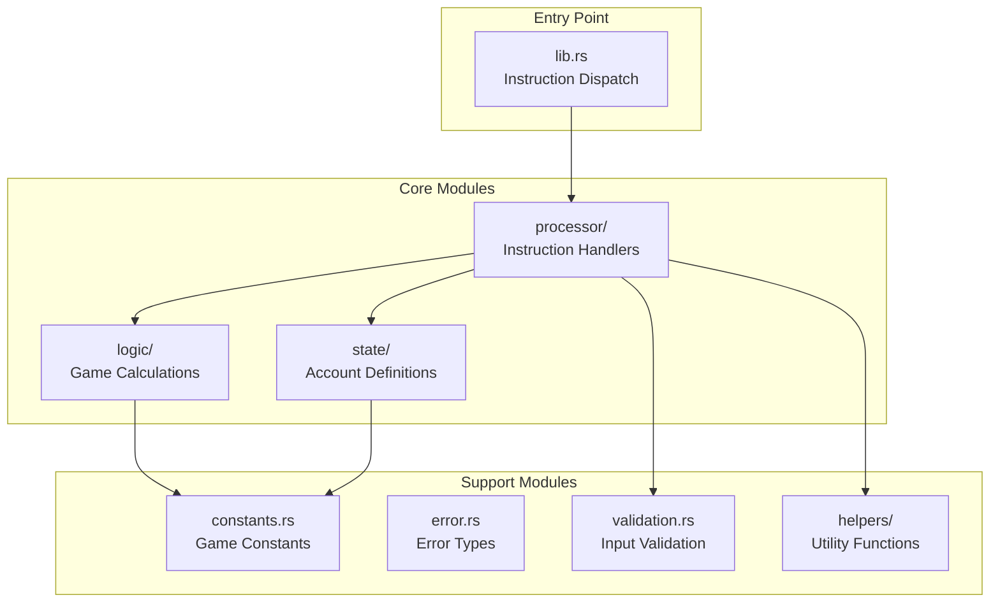
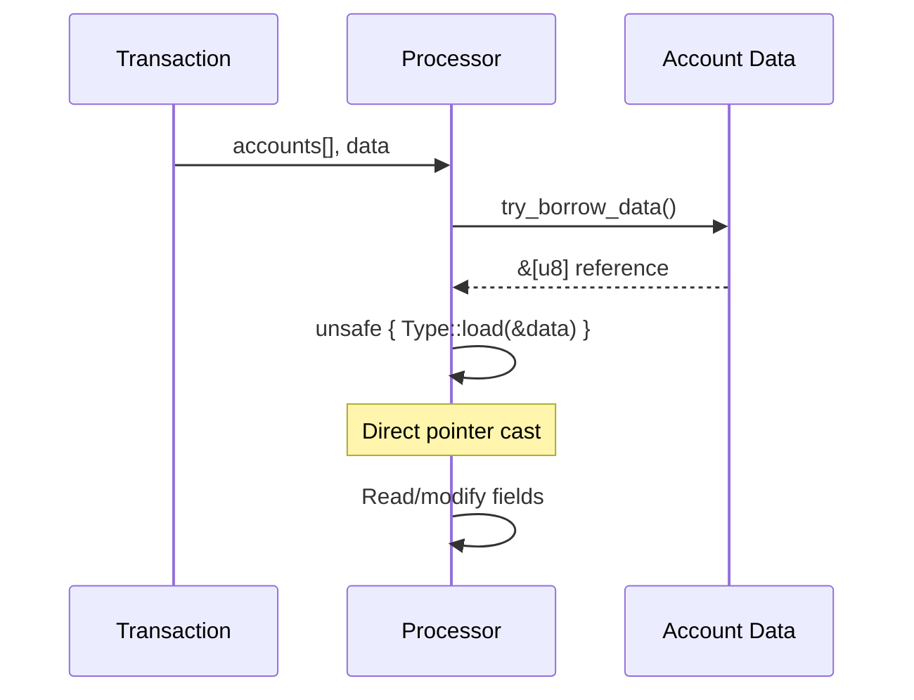
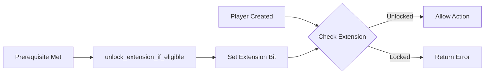
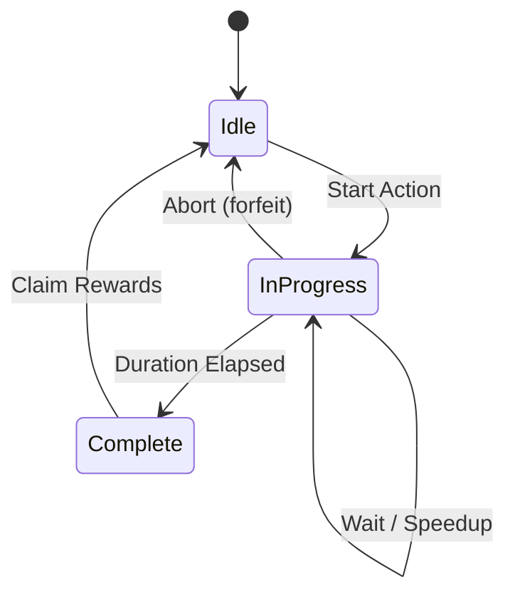
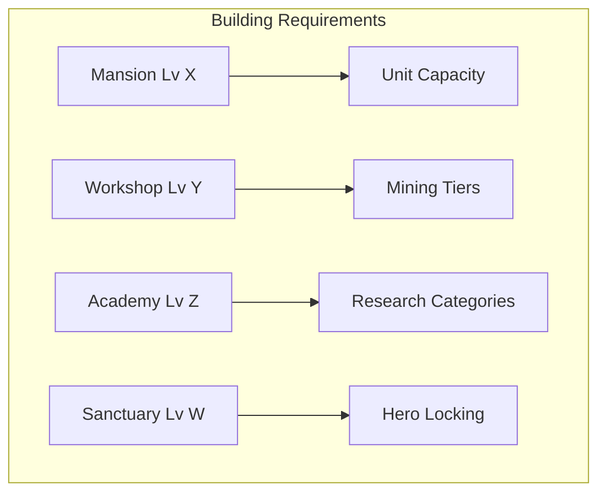
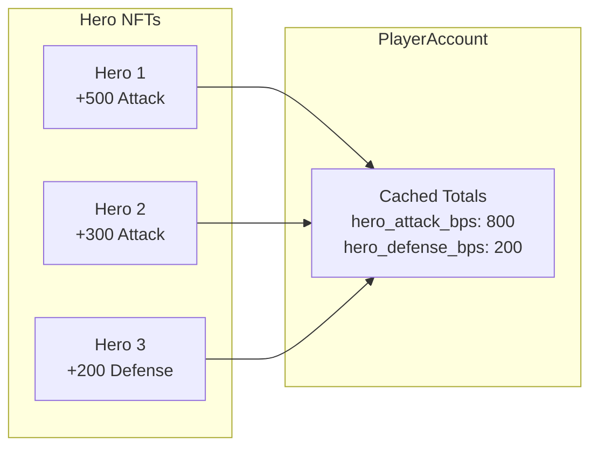

# Architecture Overview

> Understanding the structure and design patterns of the Novus Mundus program.

## Program Structure

The program follows a modular architecture with clear separation of concerns:



## Module Breakdown

### Entry Point: `lib.rs`
[Source: lib.rs](../../../programs/novus_mundus/src/lib.rs)

The program entry point receives all transactions and routes them to appropriate processors based on a 2-byte instruction discriminant:

```
Instruction Data: [discriminant (2 bytes)] [instruction-specific data...]
```

Discriminant ranges organize instructions by category:
- `0-9`: Initialization
- `10-19`: Economy
- `20-29`: Combat
- `30-39`: Intercity Travel
- `40-49`: Intracity Travel
- `50-59`: Teams
- `60-69`: Rallies
- `70-79`: Encounters
- `80-89`: Events
- `90-99`: Progression
- `100-109`: Subscriptions
- `110-119`: Names
- `120-129`: Research
- `130-139`: Heroes
- `140-159`: Shop
- `160-179`: Estate
- `180-189`: Forge
- `190-199`: Reinforcements
- `200-209`: Expeditions

### State Module: `state/`
[Source: state/](../../../programs/novus_mundus/src/state/)

Defines all account structures (PDAs) used by the program. Each account type:
- Has a fixed size known at compile time
- Uses `#[repr(C)]` for predictable memory layout
- Implements `load()` and `load_mut()` for zero-copy access
- Defines its PDA seeds as constants

Key account types:
- `PlayerAccount` - Core player state (resources, units, buffs)
- `EstateAccount` - Building and land ownership
- `ResearchProgress` - Player's research state
- `ExpeditionAccount` - Active expedition tracking
- `RallyAccount` - Group attack coordination

### Processor Module: `processor/`
[Source: processor/](../../../programs/novus_mundus/src/processor/)

Contains instruction handlers organized by system:

```
processor/
├── initialization/     # Account creation
├── economy/           # Resource management
├── combat/            # Attack logic
├── travel/            # Movement
├── team/              # Guild operations
├── rally/             # Group attacks
├── encounter/         # PvE encounters
├── event/             # Competitions
├── progression/       # Daily rewards
├── subscription/      # Premium tiers
├── name/              # Display names
├── research/          # Tech tree
├── hero/              # NFT heroes
├── sanctuary/         # Meditation
├── shop/              # Purchases
├── estate/            # Buildings
├── forge/             # Crafting
├── reinforcement/     # Troop lending
├── expedition/        # Mining/fishing
└── loot/              # Reward claims
```

Each processor follows a standard pattern:
1. Parse accounts from the accounts array
2. Validate account ownership and signatures
3. Parse instruction data
4. Validate PDA derivations
5. Load account data
6. Perform business logic
7. Update state
8. Return success or error

### Logic Module: `logic/`
[Source: logic/](../../../programs/novus_mundus/src/logic/)

Pure calculation functions that don't touch accounts:

- `combat.rs` - Damage formulas, casualty calculations
- `location.rs` - Distance, travel time, coordinates
- `rewards.rs` - Loot tables, XP formulas
- `consume.rs` - Resource consumption rates
- `time.rs` - Time-of-day bonuses, duration calculations

This separation allows logic to be tested independently and reused across processors.

### Constants: `constants.rs`
[Source: constants.rs](../../../programs/novus_mundus/src/constants.rs)

All game balance constants in one place:
- PDA seed prefixes
- Resource costs and rates
- Duration values
- Tier thresholds
- Bonus multipliers

Centralizing constants makes balance tuning straightforward.

### Helpers: `helpers/`
[Source: helpers/](../../../programs/novus_mundus/src/helpers/)

Utility functions for common operations:

- `hero.rs` - Hero buff calculations, NFT attribute building
- `nft_parser.rs` - Reading MPL Core NFT attributes
- `estate.rs` - Building requirement checks, bonus calculations
- `token_ops.rs` - SPL token operations
- `close_account.rs` - Safe account closure with rent return

## Design Patterns

### Pattern 1: Zero-Copy Account Access

Accounts are accessed without deserialization overhead:



This pattern is critical for Solana's compute limits.

### Pattern 2: Extension Gating

Features unlock progressively through the extension system:



Extensions are stored as bit flags in `PlayerAccount.extensions`:
- Bit 0: `EXT_RESEARCH` - Can do research
- Bit 1: `EXT_HEROES` - Can lock heroes
- Bit 2: `EXT_RALLY` - Can join rallies
- ... and more

### Pattern 3: Time-Locked Activities

Many activities follow the start → wait → complete pattern:



Examples:
- Research: `start_research` → wait → `complete_research`
- Travel: `intercity_start` → wait → `intercity_complete`
- Expedition: `start` → optional strikes → `claim`
- Rally: `create` → gather → `execute` → wait → `process_return`

### Pattern 4: Building-Gated Features

Estate buildings unlock and enhance features:



Helpers in `estate.rs` check requirements:
- `require_building(estate, BuildingType, min_level)`
- `has_building_at_level(estate, type, level)`

### Pattern 5: Hero Buff Aggregation

Hero buffs are aggregated on the player account for quick access:



When heroes are locked/unlocked, buffs are added/subtracted from the player's cached totals. This avoids parsing all NFTs on every action.

## Security Considerations

### Account Ownership Verification

Every processor verifies:
1. Signer matches expected authority
2. Account owner is the program ID
3. PDA derivation matches expected seeds

### Reentrancy Protection

The program uses careful borrow management:
- Drop account borrows before CPIs
- Single mutable borrow at a time
- No recursive calls possible

### Integer Overflow Protection

All arithmetic uses:
- `checked_add/sub/mul` with error handling
- `saturating_*` operations where safe
- Explicit overflow checks for critical calculations

### PDA Seed Uniqueness

Seeds are designed to prevent collision:
- Include owner pubkey where applicable
- Use distinct prefixes per account type
- Validate full PDA derivation, not just key match

---

Next: [Accounts](./accounts.md) - Deep dive into all account types
