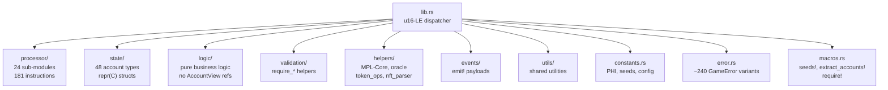
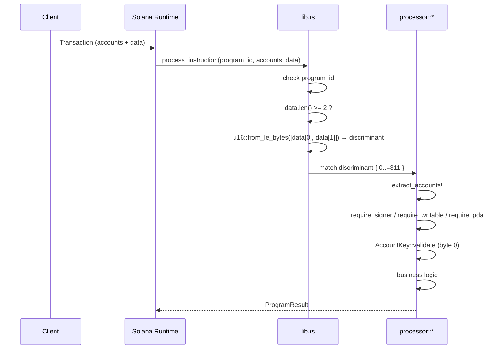
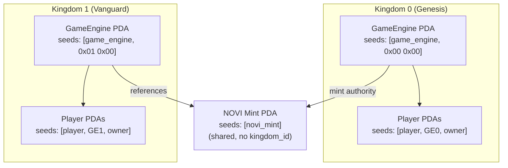
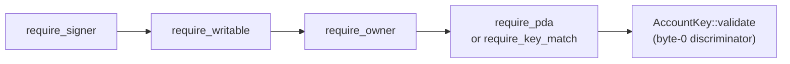
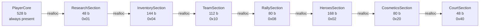
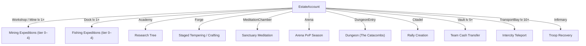
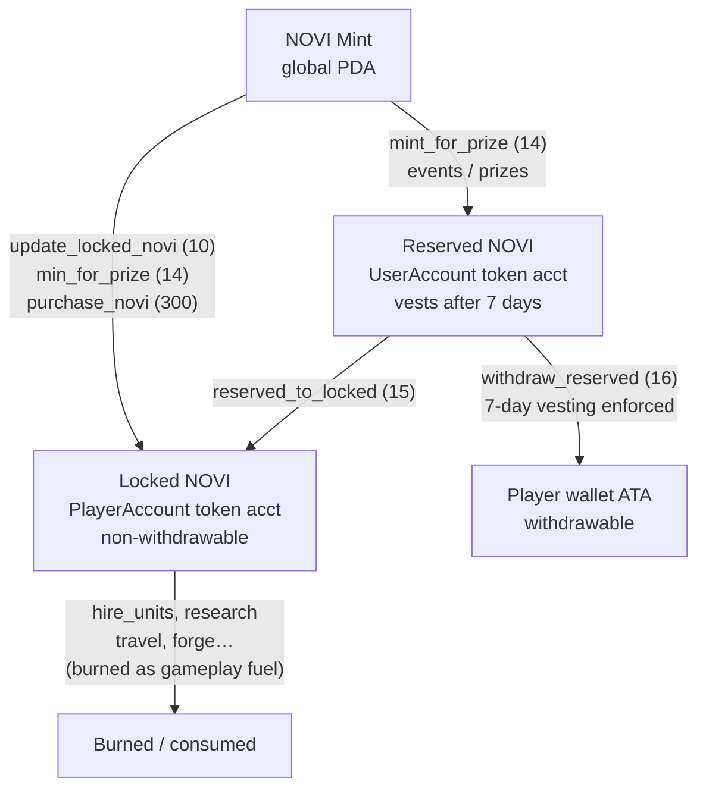
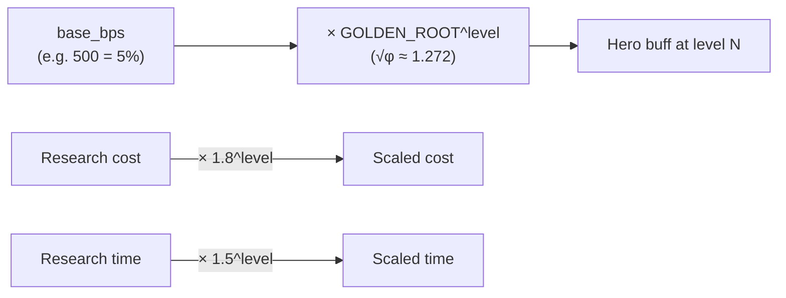
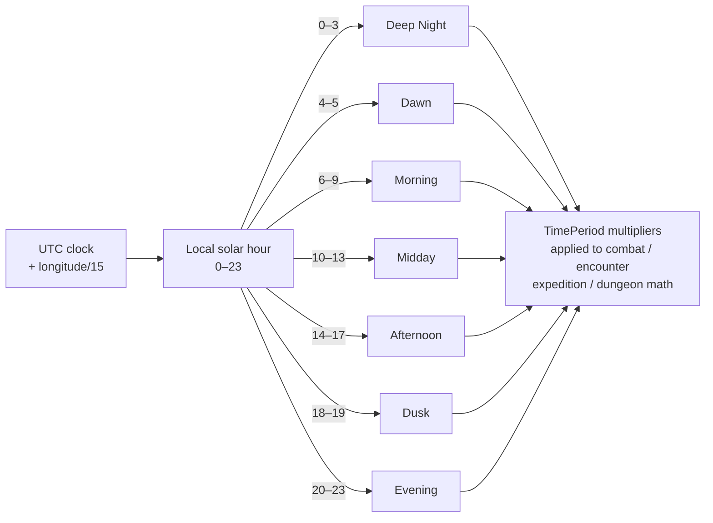

# Architecture Overview

> How Novus Mundus is structured on-chain: framework, modules, dispatch model, and cross-cutting design patterns.

## Summary

Novus Mundus is a multi-kingdom Solana strategy MMO built on **Pinocchio 0.10.2** — a `#![no_std]` smart-contract framework with no Anchor dependency, no IDL generation, and no heap allocator. The program contains **181 instructions** across **24 systems** implemented in ~285 Rust files (~71,800 LOC). Every account is validated by hand; every multiplication is saturating or checked; there is no runtime allocation.

[Source: lib.rs](../../../programs/novus_mundus/src/lib.rs) | [Source: Cargo.toml](../../../programs/novus_mundus/Cargo.toml)

---

## Framework and Key Dependencies

```toml
[dependencies]
# --- Runtime framework ---
pinocchio            = "0.10.2"   # #![no_std]; AccountView / Address types
pinocchio-token      = "0.5.0"
pinocchio-system     = "0.5.0"
pinocchio-associated-token-account = "0.3.0"
pinocchio-log        = "0.5.1"

# --- Path-based SDKs (workspace) ---
p-core               = { path = "../../sdks/p-core" }           # MPL Core (hero NFTs)
p-pyth               = { path = "../../sdks/p-pyth" }           # Pyth price feeds
p-switchboard        = { path = "../../sdks/p-switchboard" }    # Switchboard On-Demand
alt-name-service     = { path = "../../sdks/alt-name-service" } # .alldomains / ANS
tld-house            = { path = "../../sdks/tld-house" }

# --- Math & hashing ---
libm                 = "0.2"       # f64 math (Haversine, progression scaling)
five8_const          = "0.1"       # Compile-time base58 decoding
five8                = "0.1"       # Runtime base58 encode/decode
const-crypto         = "0.3.0"    # Compile-time PDA pre-computation (NOVI mint)
solana-address       = "*"         # Address type re-exports
solana-sha256-hasher = "*"         # SHA-256 hashing
sha2                 = "*"         # SHA-2 family (sha256)
```

> **Note:** `TECHNICAL_ARCHITECTURE.md` references Pinocchio 0.9.2 and a crates.io `switchboard-on-demand`. The actual `Cargo.toml` is Pinocchio **0.10.2** with a path-based `p-switchboard`. Type names changed between 0.9 and 0.10: `Pubkey` → `Address`, `AccountInfo` → `AccountView`. There is no `dao-enabled` feature in the current Cargo.toml.

---

## Module Structure

```
programs/novus_mundus/src/
├── lib.rs               # program_entrypoint!, no_allocator!, u16-LE dispatcher (181 arms)
├── constants.rs         # PHI/GOLDEN_ROOT constants, PDA seeds, expedition/castle/
│                        # arena/dungeon config, PRIZE_DISTRIBUTION
├── types.rs             # Theme, UnitType, TravelType, EncounterRarity enums
├── error.rs             # GameError (~240 variants, 6000–8200 range)
├── macros.rs            # msg!, seeds!, extract_accounts!, require!, require_eq!,
│                        # require_keys_eq!
├── token_helpers.rs     # ATA CreateIdempotent helper
│
├── state/               # Account structs (repr(C)) + AccountKey enum
│   ├── mod.rs           # AccountKey (1–48), Loaded<T>, LoadedMut<T> wrappers
│   ├── game_engine.rs   # GameEngine + embedded sub-configs
│   ├── player.rs        # PlayerCore (528 b) + 7 extension sections
│   ├── city.rs          # CityAccount with terrain anchors
│   ├── team.rs          # TeamAccount, TeamMemberSlot, TeamInvite, TreasuryRequest
│   ├── location.rs      # LocationAccount (grid cell)
│   ├── rally.rs         # RallyAccount, RallyParticipant
│   ├── reinforcement.rs # ReinforcementAccount
│   ├── encounter.rs     # EncounterAccount
│   ├── event.rs         # EventAccount, EventParticipationAccount
│   ├── progression.rs   # ProgressionAccount
│   ├── loot.rs          # LootAccount
│   ├── research.rs      # ResearchTemplate, ResearchProgress
│   ├── hero.rs          # HeroTemplate, HeroCollection, HeroMintReceipt, BuffConfig
│   ├── shop.rs          # ShopConfig, ShopItem, ShopBundle, FlashSale, DailyDeal,
│   │                    # WeeklySale, SeasonalSale, DaoPromotion, AllowedToken,
│   │                    # PlayerPurchase
│   ├── inventory.rs     # InventoryItem
│   ├── estate.rs        # EstateAccount (19 BuildingType, 8 QualityTier)
│   ├── expedition.rs    # ExpeditionAccount (112 b, temporary)
│   ├── arena.rs         # ArenaSeasonAccount (608 b), ArenaParticipant, ArenaLoadout
│   ├── dungeon.rs       # DungeonTemplate, DungeonRun, DungeonLeaderboard
│   └── castle.rs        # CastleAccount, CastleGarrison, KingRegistry, CourtPosition,
│                        # TeamCastleReward, CastleTier (5 tiers), CastleStatus (5 states)
│
├── logic/               # Pure business logic — no AccountView references
│   ├── mod.rs
│   ├── golden_math.rs   # calculate_buff_at_level (base_bps × √φ^level)
│   ├── fibonacci.rs     # is_fibonacci via 5n²±4 perfect-square test
│   ├── time_cycle.rs    # 7-period TimePeriod / TimeOfDay system
│   ├── combat.rs        # damage, abandonment, deployment, weapon-set math
│   ├── consume.rs       # NOVI consumption with Fibonacci efficiency bonus
│   ├── rewards.rs       # Loot, fragment/gem drop calculation
│   ├── progression.rs   # XP, level scaling, level-based unlocks
│   ├── location.rs      # Haversine distance (libm), intercity/teleport cost
│   ├── eligibility.rs   # Anti-Sybil event eligibility checks
│   ├── stamina.rs       # Encounter stamina regeneration
│   ├── calculations.rs  # Networth, share calculations
│   └── safe_math.rs     # apply_bp / apply_bp_penalty / chain_bp / exp_growth
│
├── processor/           # One sub-module per system, one file per instruction
│   ├── mod.rs
│   ├── initialization/  # 9 instructions  (0–8)
│   ├── economy/         # 8 instructions  (10–14, 17–19)
│   ├── token/           # 2 instructions  (15–16)
│   ├── combat/          # 2 instructions  (20–21)
│   ├── travel/          # 8 instructions  (30–34, 40–42)
│   ├── team/            # 22 instructions (50–59, 210–221)
│   ├── rally/           # 8 instructions  (60–67)
│   ├── encounter/       # 1 instruction   (70)
│   ├── loot/            # 1 instruction   (71)
│   ├── event/           # 4 instructions  (80–83)
│   ├── progression/     # 1 instruction   (90)
│   ├── subscription/    # 3 instructions  (100–102)
│   ├── name/            # 6 instructions  (110–115)
│   ├── research/        # 8 instructions  (120–127)
│   ├── hero/            # 9 instructions  (130–136, 310–311)
│   ├── sanctuary/       # 3 instructions  (137–139)
│   ├── shop/            # 21 instructions (140–159, 300)
│   ├── estate/          # 10 instructions (160–169)
│   ├── forge/           # 5 instructions  (180–184)
│   ├── reinforcement/   # 6 instructions  (190–195)
│   ├── expedition/      # 5 instructions  (200–204)
│   ├── arena/           # 7 instructions  (230–236)
│   ├── dungeon/         # 11 instructions (250–260)
│   └── castle/          # 21 instructions (270–290)
│
├── events/              # Event emit! payloads (one file per subsystem)
│
├── validation/          # require_signer, require_owner, require_writable,
│                        # require_data_len, require_empty, require_initialized,
│                        # require_pda, require_key_match, derive_pda
│
├── helpers/             # account close, MPL-Core parsing, name service, oracle,
│                        # estate, dungeon, hero, inventory, kingdom, token_ops,
│                        # event_scoring, nft_parser
│
└── utils/               # Shared utility functions (declared in lib.rs)
```

> **Note:** There is no `logic/time.rs`. The correct module name is `logic/time_cycle.rs`.



---

## Instruction Dispatch

The program uses a **u16 little-endian discriminant** in the first two bytes of every instruction payload. `&data[2..]` is passed as instruction-specific data.

```rust
// lib.rs — condensed
pub fn process_instruction(
    program_id: &Address,
    accounts: &[AccountView],
    data: &[u8],
) -> ProgramResult {
    if program_id != &ID { return Err(ProgramError::IncorrectProgramId); }
    if data.len() < 2    { return Err(ProgramError::InvalidInstructionData); }

    let discriminant = u16::from_le_bytes([data[0], data[1]]);
    let instruction_data = &data[2..];

    match discriminant {
        0  => { msg!("init game engine");   processor::initialization::game_engine::process(...) }
        1  => { msg!("init player");        processor::initialization::player::process(...) }
        // ... 179 more arms ...
        _  => Err(ProgramError::InvalidInstructionData),
    }
}
```

The string literal in `msg!("...")` is the **canonical instruction name** and is the primary label used in the instruction map. There is no IDL.



Discriminant **gaps** (reserved / unimplemented): 9, 22–29, 35–39, 43–49, 68–69, 72–79, 84–89, 91–99, 103–109, 116–119, 128–129, 170–179, 185–189, 196–199, 205–209, 222–229, 237–249, 261–269, 291–299, 301–309, 312+.

---

## Multi-Kingdom Architecture

`GameEngine` is **not a singleton**. Each kingdom has its own `GameEngine` PDA keyed by `kingdom_id: u16 LE`. Every gameplay PDA is scoped by the `GameEngine` address. The NOVI mint (`["novi_mint"]`) has no kingdom seed and is shared.



---

## Design Patterns

### Manual Account Validation

Every processor follows this chain before reading account data:



`Loaded::new_validated` / `LoadedMut::new_validated` enforce the discriminator check at construction time. However, approximately 161 call sites use `unsafe { T::load(data) }` which skips the discriminator check. This is a known hardening gap.

[Source: validation/mod.rs](../../../programs/novus_mundus/src/validation/mod.rs)

### Zero-Copy Account Loading

All account structs are `#[repr(C)] Copy Clone`. Loading is a raw pointer cast held behind a borrow guard:

```rust
// Preferred (validates byte-0 discriminator):
let player = LoadedMut::new_validated(guard, AccountKey::Player)?;

// Common (no discriminator check — ~161 sites):
let player = unsafe { &mut *(data.as_mut_ptr() as *mut PlayerCore) };
```

`Loaded<'a, T>` / `LoadedMut<'a, T>` wrap a `Ref<'a, [u8]>` / `RefMut<'a, [u8]>` guard and implement `Deref` / `DerefMut` transparently.

[Source: state/mod.rs](../../../programs/novus_mundus/src/state/mod.rs)

### Extension-Gated PlayerAccount

`PlayerAccount` starts as a 528-byte `PlayerCore`. Six additional sections are appended via `realloc` when unlocked. The `extensions: u32` bitfield in `PlayerCore` records which sections are present. Section offsets are compile-time constants.

```
Section           Size   Flag constant     Unlock order
──────────────────────────────────────────────────────
PlayerCore         528   (always present)  base
ResearchSection     48   EXT_RESEARCH=0x01 1st
InventorySection   144   EXT_INVENTORY=0x04 2nd
TeamSection        112   EXT_TEAM=0x10     3rd
RallySection        80   EXT_RALLY=0x08    4th
HeroesSection      168   EXT_HEROES=0x02   5th
CosmeticsSection    80   EXT_COSMETICS=0x20 6th
CourtSection        48   EXT_COURT=0x40    7th
──────────────────────────────────────────────────────
MAX_SIZE          1208   (all sections)
```



> **Note:** `TECHNICAL_ARCHITECTURE.md` quotes `MAX_SIZE = 1946` with different section sizes. The values in `state/player.rs` are authoritative: `CORE_SIZE=528`, `RESEARCH_SIZE=48`, `INVENTORY_SIZE=144`, `TEAM_SIZE=112`, `RALLY_SIZE=80`, `HEROES_SIZE=168`, `COSMETICS_SIZE=80`, `COURT_SIZE=48`, `MAX_SIZE=1208`.

[Source: state/player.rs](../../../programs/novus_mundus/src/state/player.rs)

### Building-Gated Features

Estate buildings are required to access higher-tier content:

| Building | Feature gated |
|----------|--------------|
| Workshop / Mine | Mining expeditions (tier 0–4 need Workshop level 1/5/10/15/20) |
| Dock | Fishing expeditions (same tier curve) |
| Academy | Research tree access |
| Forge | Staged tempering (craft quality weapons) |
| MeditationChamber | Sanctuary hero meditation |
| Arena | Arena PvP season participation |
| DungeonEntry | Dungeon entry |
| Citadel | Rally creation |



[Source: state/estate.rs](../../../programs/novus_mundus/src/state/estate.rs)

### Hero Buff Aggregation

Heroes are MPL Core assets (not program-owned accounts). The program reads level and `BuffStat` slots off the NFT via `helpers/nft_parser.rs`. Buffs scale as `base_bps × (√φ)^level`. Combat-relevant hero buffs are mirrored onto `PlayerCore` fields for fast mid-combat resolution without re-reading hero accounts.

[Source: state/hero.rs](../../../programs/novus_mundus/src/state/hero.rs)

---

## Security Model

### Token Buckets

| Bucket | Storage | Withdrawable | Notes |
|--------|---------|-------------|-------|
| Locked NOVI (`PlayerCore.locked_novi`) | SPL token account, PlayerAccount PDA owner | No | Gameplay fuel |
| Reserved NOVI (`UserAccount.reserved_novi`) | SPL token account, UserAccount PDA owner | Yes, after 7-day vesting | Prizes, purchases |



### Anti-Sybil

Event eligibility enforces account age, minimum attack count, transfer ratio, and a governance-set flag via `logic/eligibility.rs`.

### Transfer Restrictions

`transfer_cash` (ix 18) requires: same team, both players older than `min_account_age_for_events`, per-tier daily amount and count caps from `subscription_tiers`, Vault building level ≥ 5.

---

## Deterministic Math System

All multipliers are `u16`/`u32` basis points (10000 = 100%). `safe_math.rs` provides overflow-safe helpers:

| Helper | Description |
|--------|-------------|
| `apply_bp(base, bp)` | `base × bp / 10000` (u128 intermediate) |
| `apply_bp_penalty(base, bp)` | `base × (10000 - bp) / 10000` |
| `chain_bp(base, bps)` | multiplicative chain of basis-point multipliers |
| `exp_growth(base, num, den, exp)` | `base × (num/den)^exp` without overflow |

### Golden Ratio Constants

```rust
pub const PHI:                 f64 = 1.618033988749895;   // φ
pub const GOLDEN_ROOT:         f64 = 1.2720196495140689;  // √φ
pub const PHI_SQUARED:         f64 = 2.618033988749895;   // φ²
pub const PHI_INVERSE:         f64 = 0.6180339887498949;  // 1/φ
pub const PHI_SQUARED_INVERSE: f64 = 0.3819660112501051;  // 1/φ²
pub const PHI_CUBED_INVERSE:   f64 = 0.2360679774997897;  // 1/φ³
```

Integer basis-point equivalents: φ ≈ 16180, √φ ≈ 12720, 1/φ ≈ 6180.

Hero buff formula: `base_bps × (√φ)^level` (implemented via `calculate_buff_at_level`).
Research cost scaling: `base × 1.8^level` (via `exp_growth(base, 18, 10, level)`).
Research time scaling: `base × 1.5^level` (via `exp_growth(base, 3, 2, level)`).



### Fibonacci Efficiency Bonus

`consume.rs` detects Fibonacci NOVI amounts using the `5n²±4` perfect-square test (`logic/fibonacci.rs`) and applies a `×GOLDEN_ROOT` efficiency bonus.

### Determinism Caveats

Three `f64` paths exist that are deterministic on current SBF but brittle across toolchain upgrades:

- `logic/combat.rs` — percentage splits in `inflict_damage`
- `logic/progression.rs` / `logic/stamina.rs` — `f64 → u64` casts
- `logic/location.rs` — libm Haversine (`sin`, `cos`, `asin`, `sqrt`)

The codebase is migrating these to integer basis-point math.

---

## Time-of-Day System

Local solar time = `(utc_hours + longitude / 15 + 24) % 24`. Seven `TimePeriod` variants select activity multipliers for combat, encounter, expedition, and dungeon math:

| Period | Local hours |
|--------|------------|
| Deep Night | 0–3 |
| Dawn | 4–5 |
| Morning | 6–9 |
| Midday | 10–13 |
| Afternoon | 14–17 |
| Dusk | 18–19 |
| Evening | 20–23 |



[Source: logic/time_cycle.rs](../../../programs/novus_mundus/src/logic/time_cycle.rs)

---

## Oracle Integration

Used by `purchase_novi` (ix 300) and shop token payments in `helpers/token_ops.rs`:

- **Pyth** (`p-pyth`): detected by magic `0xa1b2c3d4` at offset 0; validated via `load_pyth_price_with_confidence(data, slot, max_staleness_slots, max_confidence_bps)`.
- **Switchboard On-Demand** (`p-switchboard`): verified via queue, slothash sysvar, ix sysvar, clock slot, and age.
- Slippage protection: every purchase instruction includes a `max_lamports` bound checked against the computed price.

[Source: TECHNICAL_ARCHITECTURE.md — Oracle Pricing section](../../../TECHNICAL_ARCHITECTURE.md)

---

Next: [Accounts](./accounts.md)
