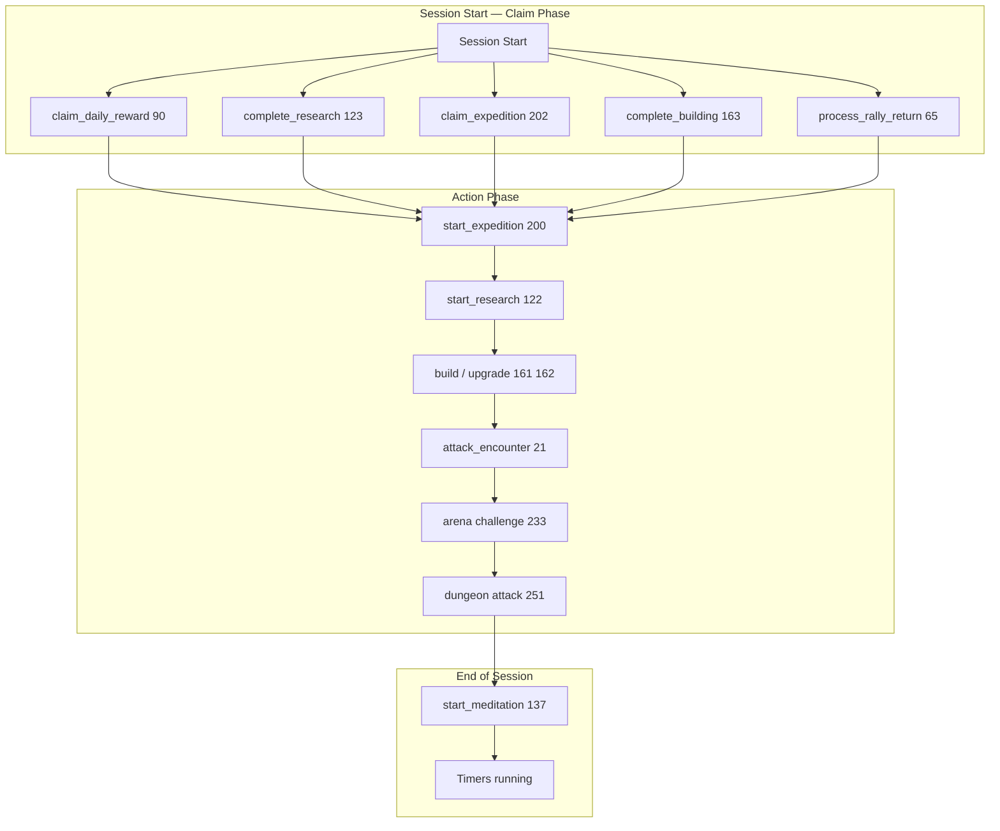
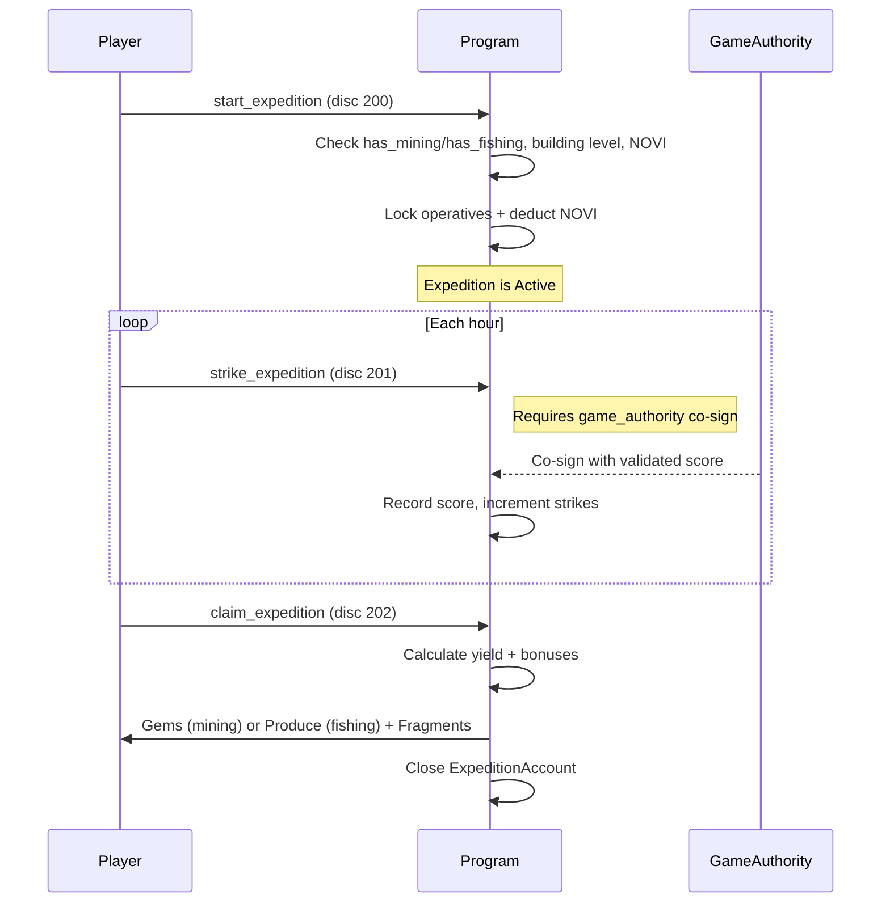
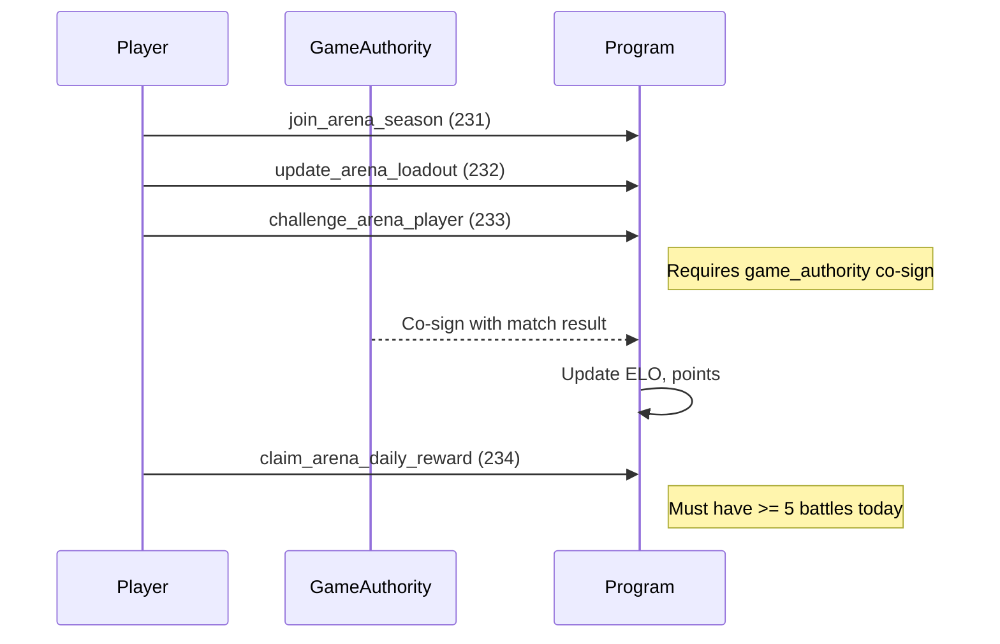
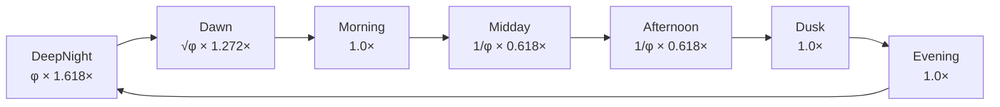
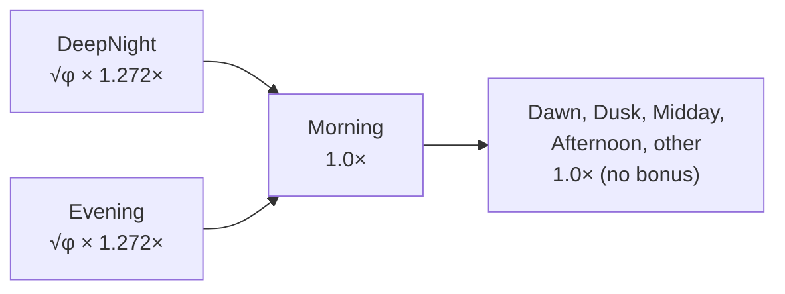

# Daily Loop

> The on-chain activities that constitute a full Novus Mundus session: rewards, expeditions, research, building, combat, and the arena.

## Session Overview



---

## Claim Daily Reward — discriminant 90

**Requires:** `EXT_RESEARCH` unlocked AND `has_daily_rewards == true` (complete `DailyRewardsSystem` research node in the Growth tree).

The reward is a combination of **cash + produce + XP** (not gems). There is no login-streak counter in this processor — the daily claim simply enforces a cooldown stored in `ResearchSection.last_daily_claim`.

> **Note:** The Estate system has a separate `daily_claim` feature (discriminant 165) that tracks a login streak. Do not conflate the two. The progression `claim_daily_reward` (discriminant 90) has no streak logic.

**Accounts:**

| # | Account | Role |
|---|---------|------|
| 1 | `player` PDA | Mutable — receives rewards |
| 2 | `player_owner` | Signer |
| 3 | `game_engine` | Read-only — provides configs and subscription tiers |

**Guards:**
- `player_data.has_daily_rewards()` must be `true`
- `now - last_daily_claim >= gameplay_config.daily_reward_cooldown`

**Reward calculation:**

```
base_cash    = gameplay_config.daily_cash_base
base_produce = gameplay_config.daily_produce_base
base_xp      = gameplay_config.daily_xp_base

tier_multiplier = subscription_tiers[effective_tier].daily_reward_multiplier  // basis points
rewards *= tier_multiplier / 10000

// Research buff on top (additive bonus)
rewards *= (1 + research_daily_reward_bps / 10000)

// XP is then passed through grant_xp_with_time_bonus
// DeepNight: √φ (1.272×) XP bonus
// Evening:   √φ (1.272×) XP bonus
// All other periods (Dawn, Dusk, Morning, Midday, Afternoon): 1.0× (no bonus)
```

**Effects:** `cash_on_hand += cash`, `produce += produce`, `current_xp += xp` (with level-up handling), `last_daily_claim = now`.

[Source: processor/progression/claim_daily_reward.rs](../../../programs/novus_mundus/src/processor/progression/claim_daily_reward.rs)

---

## Expeditions — discriminants 200–204

### Start Expedition — 200

**Requires:** `has_mining` or `has_fishing` flag in `ResearchSection` (from Growth research nodes `MiningOperations` / `FishingIndustry`).

Locks operatives and optionally escrows a hero NFT. The `strike_expedition` instruction (201) requires a **`game_authority` co-signature** — the game server validates the strike score (0–100) before accepting it on-chain.



**Yield bonuses (multiplicative, applied in order):**
1. Operative tier weights: tier 1 = 1.0×, tier 2 = 1.5×, tier 3 = 2.0×
2. Time-of-day multiplier
3. Research `collection_bonus_bps`
4. Hero `hero_collection_rate_bps` (mining) or `hero_produce_generation_bps` (fishing)
5. Strike score bonus: +25% (`PERFECT_EXPEDITION_BONUS_BPS = 2500`) if average strike score ≥ 80
6. Hero affinity bonus (MiningAffinity stat 17 / FishingAffinity stat 18)
7. Origin city bonus: +25% if hero has affinity AND origin_city matches expedition city
8. Rare find: 5× multiplier if `(start_time / 3600) % 10000 < rare_chance_bps`

**Abort expedition (203):** Returns locked operatives; NOVI cost is **not refunded** (burnt).

[Source: processor/expedition/](../../../programs/novus_mundus/src/processor/expedition/)

---

## Research Cycle — discriminants 120–127

### Complete Research — 123

Call after `completes_at` has passed. Writes battle buff totals back to `ResearchSection` on the `PlayerAccount`.

### Start Research — 122

Picks the next technology node. NOVI is deducted from `locked_novi` when research starts.

### Speedup Research — 124

Spends gems to reduce `completes_at`. Cost is `remaining_minutes × gem_cost_per_minute` from the `ResearchTemplate`.

[Source: processor/research/](../../../programs/novus_mundus/src/processor/research/)

---

## Estate — Daily Activity — discriminant 166

The Estate's `daily_activity` instruction is a mini-game where the player performs an action on their estate plot. This instruction requires a **`game_authority` co-signature** to prevent automated farming.

The estate also has a `daily_claim` (discriminant 165) which tracks login streaks and grants estate-specific rewards independent of the progression `claim_daily_reward`.

[Source: processor/estate/](../../../programs/novus_mundus/src/processor/estate/)

---

## Combat — discriminants 20–21

### Attack Encounter — 21

Attack a PvE encounter spawned at the player's location. Consumes stamina.

**Stamina costs by rarity:**

| Rarity | Stamina Cost |
|--------|-------------|
| Common | 10 |
| Uncommon | 25 |
| Rare | 50 |
| Epic | 100 |
| Legendary | 250 |
| World Event | 500 |

Stamina regenerates at 1 point per 5 minutes (`STAMINA_REGEN_INTERVAL = 300 seconds`). The regen rate varies by time of day — see [Stamina Regeneration](#stamina-regeneration) below. Max stamina is tier-gated: Rookie 100, Expert 500, Epic 1,000, Legendary 10,000.

**Grants:** XP, loot (gems/fragments if research flags active), encounter rewards.

### Attack Player — 20

PvP combat within 15 meters (`PVP_ATTACK_RANGE_METERS`). Loot rate for defeated enemy weapons is 60% (`WEAPON_LOOT_RATE_BPS`). No `game_authority` required.

---

## Rally Combat — discriminants 60–67

Rallies let teams combine forces against a single target. The key operations:

| Disc | Instruction | Notes |
|------|-------------|-------|
| 60 | `create_rally` | Requires `EXT_RALLY`; deducts NOVI |
| 61 | `join_rally` | Participant commits units |
| 62 | `execute_rally` | Runs combat resolution |
| 65 | `process_rally_return` | Returns surviving units to each participant |

Requires `EXT_RALLY` to be unlocked (which requires `EXT_TEAM` → `EXT_INVENTORY` → `EXT_RESEARCH` chain).

---

## Arena PvP — discriminants 230–236

The arena is a weekly ranked season. Each day players can battle up to `ARENA_MAX_DAILY_BATTLES = 10` opponents. The `challenge_arena_player` instruction (233) requires a **`game_authority` co-signature** — the game server resolves the match and reports the result on-chain.



After the 7-day season (`ARENA_SEASON_DURATION`) ends, top players claim prizes via `claim_arena_master_reward` (235).

---

## Dungeon — discriminants 250–260

The Catacombs is a roguelike PvE mode. `dungeon_attack` (251) and `dungeon_attack_multi` (252) require a **`game_authority` co-signature** for each attack to verify floor progress. Players accumulate relics between floors and can flee with a penalty (scaling by floor range: 70% → 40% of rewards).

---

## Hero Meditation — discriminants 137–139

Send an active hero to the Sanctuary for meditation. One hero at a time meditates, earning passive XP toward hero level-up. `start_meditation` (137) sets `meditation_started_at`; `claim_meditation` (138) closes the session and grants the accumulated bonus.

---

## Daily Action Summary

| Activity | Discriminant | Authority Required | Reward Type |
|----------|-------------|-------------------|-------------|
| Claim daily reward | 90 | None | Cash + Produce + XP |
| Estate daily claim | 165 | None | Estate resources + streak |
| Estate daily activity | 166 | `game_authority` | Estate mini-game reward |
| Start expedition | 200 | None | — |
| Strike expedition | 201 | `game_authority` | Score toward yield bonus |
| Claim expedition | 202 | None | Gems (mining) or Produce (fishing) + Fragments |
| Attack encounter | 21 | None | XP + loot |
| Attack player | 20 | None | Loot |
| Arena challenge | 233 | `game_authority` | ELO + points |
| Arena daily reward | 234 | None | NOVI (requires ≥ 5 battles) |
| Dungeon attack | 251/252 | `game_authority` | Floor rewards |
| Start meditation | 137 | None | — |
| Claim meditation | 138 | None | Hero XP |

---

## Stamina Regeneration

Stamina is the gate on encounter attacks. It regenerates automatically — the player does not need to call any instruction; the program updates it lazily when stamina-consuming instructions are processed.

```
regen_rate = 1 stamina per 300 seconds (5 minutes)

StaminaRegen time-of-day multipliers:
  DeepNight multiplier:  φ  ≈ 1.618×   (fastest — regenerate overnight)
  Dawn multiplier:       √φ ≈ 1.272×   (slightly boosted)
  Midday multiplier:     1/φ ≈ 0.618×  (slowest — peak play hours)
  Afternoon multiplier:  1/φ ≈ 0.618×  (slowed)
  All other periods:     1.0×           (Morning, Evening, Dusk)

hero_stamina_regen_bps applied multiplicatively on top
```



[Source: logic/stamina.rs](../../../programs/novus_mundus/src/logic/stamina.rs)

---

## XP and Leveling

XP required to level up from level N to N+1:

```
xp_required(level) = 100 × 2.5^(level - 2)   for level ≥ 2
xp_required(1) = 0
```

Sample values:

| Level → | XP Required |
|---------|-------------|
| 1 → 2 | 100 |
| 2 → 3 | 250 |
| 3 → 4 | 625 |
| 4 → 5 | 1,563 |

XP sources and their time-of-day multipliers are applied inside `grant_xp_with_time_bonus`:



Only **DeepNight** and **Evening** grant an XP bonus (√φ ≈ 1.272×). All other periods — including Dawn, Dusk, Morning, Midday, and Afternoon — apply no XP multiplier (1.0×).

[Source: logic/progression.rs](../../../programs/novus_mundus/src/logic/progression.rs)

---

Next: [Currencies](../03-economy/currencies.md)
