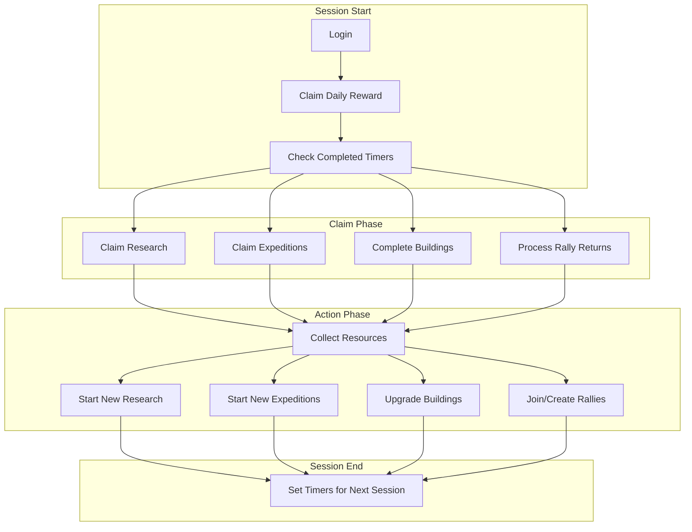
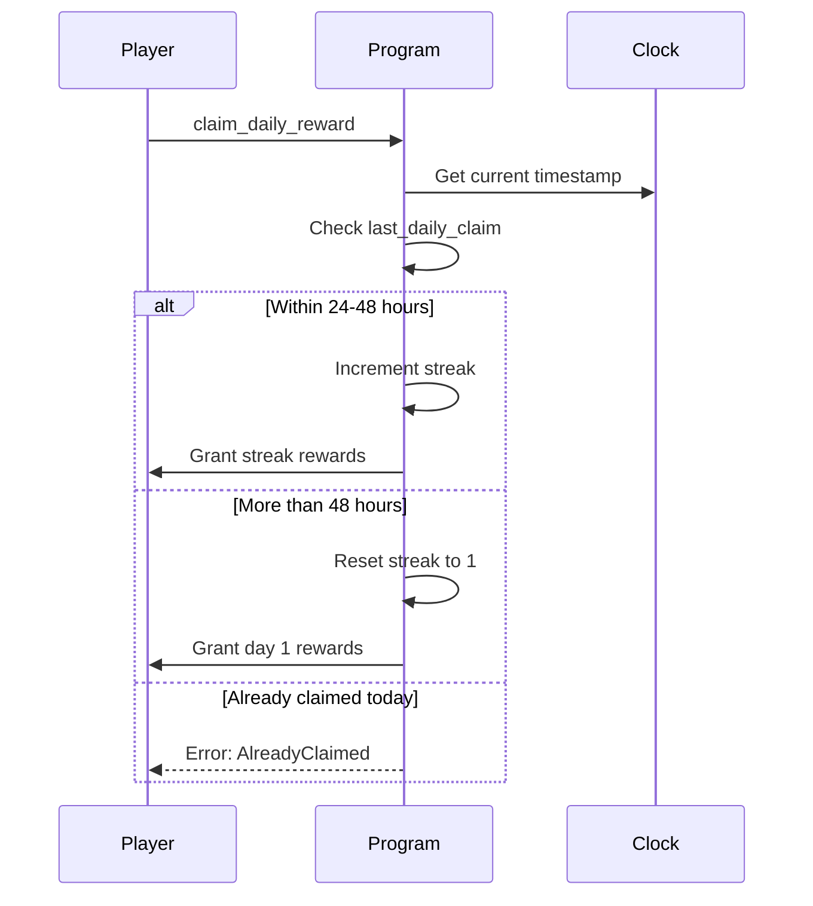
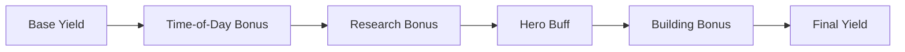
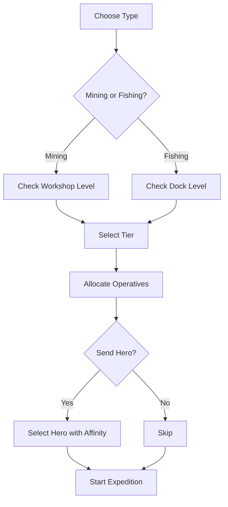
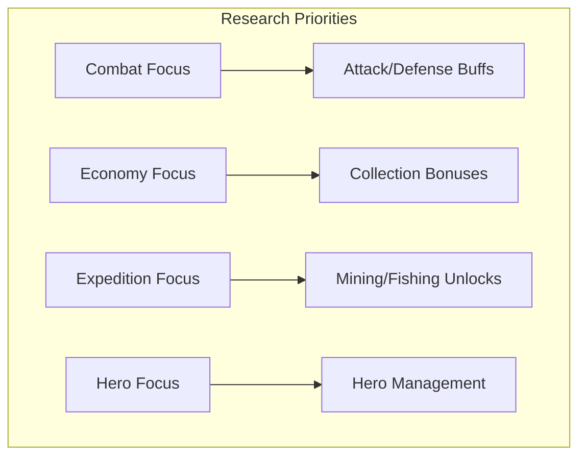

# Daily Loop

> The typical activities a player performs each session in Novus Mundus.

## Session Structure

A typical play session follows a predictable pattern of check-ins, actions, and planning:

## Daily Rewards

**Instruction:** `90 - claim_daily_reward`

Players receive escalating rewards for consecutive daily logins:

| Streak Day | Reward |
|------------|--------|
| 1 | 100 gems |
| 2 | 150 gems |
| 3 | 200 gems |
| 4 | 250 gems |
| 5 | 300 gems |
| 6 | 350 gems |
| 7+ | 500 gems + bonus |

**Streak Rules:**
- Must claim within 48 hours of last claim
- Missing a day resets streak to 1
- Maximum streak bonus caps at day 30

[Source: processor/progression/claim_daily_reward.rs](../../../programs/novus_mundus/src/processor/progression/claim_daily_reward.rs)

## Resource Collection

**Instruction:** `12 - collect_resources`

Players collect resources from their current location:

| Location Type | Resources | Cooldown |
|---------------|-----------|----------|
| City Center | Cash | 4 hours |
| Mine | Gems, Fragments | 2 hours |
| Farm | Produce | 2 hours |
| Market | Cash | 6 hours |

**Bonuses Applied:**
1. Time-of-day multiplier
2. Research bonuses (research_collection_bonus_bps)
3. Hero buffs (hero_collection_rate_bps)
4. Building bonuses (Market, Observatory)

[Source: processor/economy/collect_resources.rs](../../../programs/novus_mundus/src/processor/economy/collect_resources.rs)

## Expedition Management

### Claiming Completed Expeditions

**Instruction:** `202 - claim_expedition`

When expeditions complete, players claim rewards:

| Expedition Type | Primary Reward | Secondary |
|-----------------|----------------|-----------|
| Mining | Gems | Fragments |
| Fishing | Produce | Fragments |

**Bonus Sources:**
1. Operative tier multipliers
2. Time-of-day bonus
3. Research collection bonus
4. Hero collection buffs
5. Strike score bonus (if strikes performed)
6. Hero affinity bonus (MiningAffinity/FishingAffinity)
7. Origin city bonus (+25% if hero matches location AND has affinity)
8. Rare find multiplier (5x on lucky rolls)

### Starting New Expeditions

**Instruction:** `200 - start_expedition`

After claiming, immediately start new expeditions:

**Optimal Hero Selection:**
- Mining: Hero with MiningAffinity buff
- Fishing: Hero with FishingAffinity buff
- Bonus: Hero whose origin_city matches current city

[Source: processor/expedition/](../../../programs/novus_mundus/src/processor/expedition/)

## Research Cycle

### Completing Research

**Instruction:** `123 - complete_research`

When research timer completes:
1. Research benefits are applied to player
2. Tech tree advances
3. New researches become available
4. Extension unlocks may trigger

### Starting Next Research

**Instruction:** `122 - start_research`

Select next research based on goals:

**Academy Bonus:**
Higher Academy levels reduce research time:
- Level 5: -10% time
- Level 10: -20% time
- Level 15: -30% time
- Level 20: -40% time

[Source: processor/research/](../../../programs/novus_mundus/src/processor/research/)

## Building Management

### Completing Construction

**Instruction:** `163 - complete`

When building timers finish:
1. Building becomes active
2. Bonuses immediately apply
3. New features may unlock
4. Slot available for next upgrade

### Starting Upgrades

**Instruction:** `162 - upgrade`

Priority buildings to upgrade:

| Priority | Building | Why |
|----------|----------|-----|
| 1 | Mansion | Unit capacity |
| 2 | Workshop/Dock | Higher expedition tiers |
| 3 | Sanctuary | More locked heroes |
| 4 | Academy | Faster research |
| 5 | Citadel | Rally power |

[Source: processor/estate/](../../../programs/novus_mundus/src/processor/estate/)

## Combat Activities

### Rally Participation

**Instruction:** `61 - join_rally`

Daily rally checklist:
1. Check active rallies in your city
2. Join rallies targeting valuable cities
3. Allocate appropriate forces
4. Wait for execution and return

### PvP Attacks

**Instruction:** `20 - attack_player`

Target selection:
- Players at same location
- Profitable loot potential
- Acceptable retaliation risk

### Encounter Hunting

**Instruction:** `21 - attack_encounter`

Find and defeat PvE encounters for:
- Gems
- Fragments
- Experience
- Loot drops

## Session Planning

### Timer Alignment

Smart players align timers to minimize wasted time:

```mermaid
gantt
    title Optimal Timer Alignment
    dateFormat HH:mm
    axisFormat %H:%M

    section Research
    Research 1    :08:00, 4h
    Research 2    :12:00, 4h
    Research 3    :16:00, 4h

    section Expeditions
    Mining        :08:00, 2h
    Mining        :10:00, 2h
    Mining        :12:00, 2h

    section Buildings
    Upgrade       :08:00, 8h
```

### Before Logging Off

Checklist before ending session:
- [ ] All expeditions started
- [ ] Research in progress
- [ ] Buildings upgrading (if resources allow)
- [ ] Operatives deployed (not idle)
- [ ] Hero meditation started (if available)

## Daily Activity Tracking

**Instruction:** `166 - daily_activity`

The estate tracks daily engagement:

| Activity | Reward |
|----------|--------|
| Login | Activity point |
| Collect resources | Activity point |
| Complete expedition | Activity point |
| Win combat | Activity point |

Reaching daily activity thresholds grants bonus rewards.

[Source: processor/estate/daily_activity.rs](../../../programs/novus_mundus/src/processor/estate/daily_activity.rs)

## Weekly Patterns

Beyond daily loops, weekly patterns emerge:

| Day | Focus |
|-----|-------|
| Monday | Rally organization |
| Tuesday-Thursday | Grinding expeditions |
| Friday | Building upgrades |
| Weekend | Events, competitions |

## Efficiency Tips

### Maximize Resource Gain
1. **Time your collections** - Hit peak time-of-day bonuses
2. **Use hero buffs** - Lock heroes matching activities
3. **Chain expeditions** - No idle time between

### Minimize Wasted Compute
1. **Batch transactions** - Claim multiple in one tx
2. **Pre-check timers** - Don't call complete early
3. **Align sessions** - Login when multiple timers complete

### Progression Efficiency
1. **Research queue** - Always have research running
2. **Building priority** - Upgrade bottleneck buildings first
3. **Expedition tiers** - Match tier to play frequency

---

*The daily loop is the heartbeat of Novus Mundus. Consistent daily engagement compounds into significant progression over time.*

---

Next: [Economy - Currencies](../03-economy/currencies.md)
