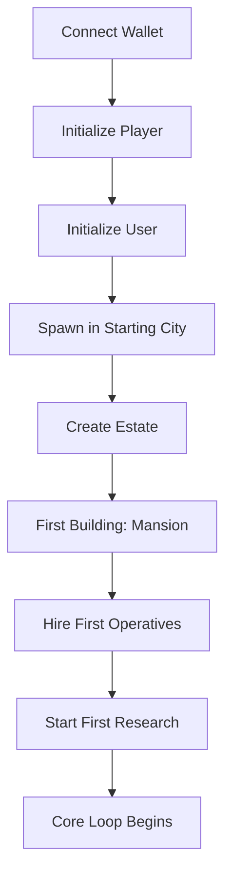
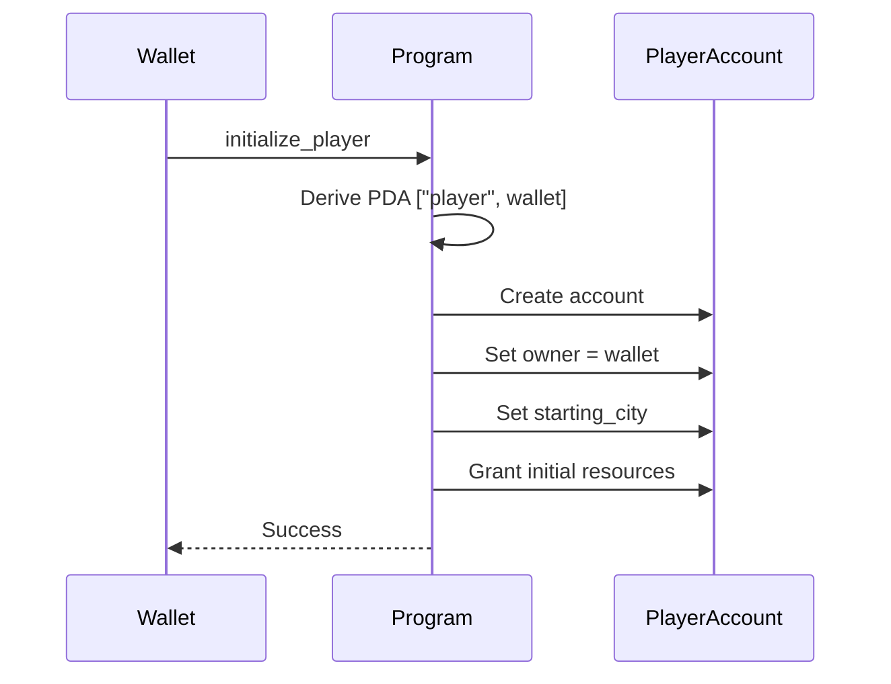
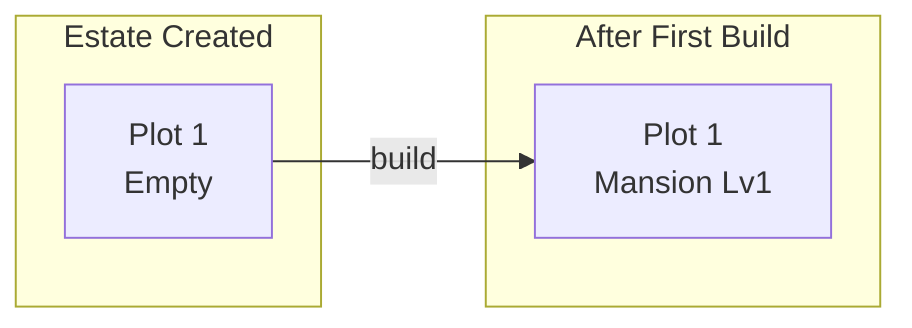
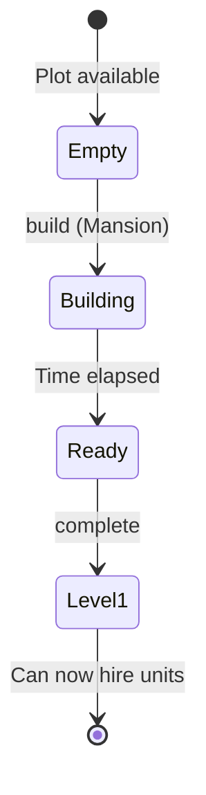
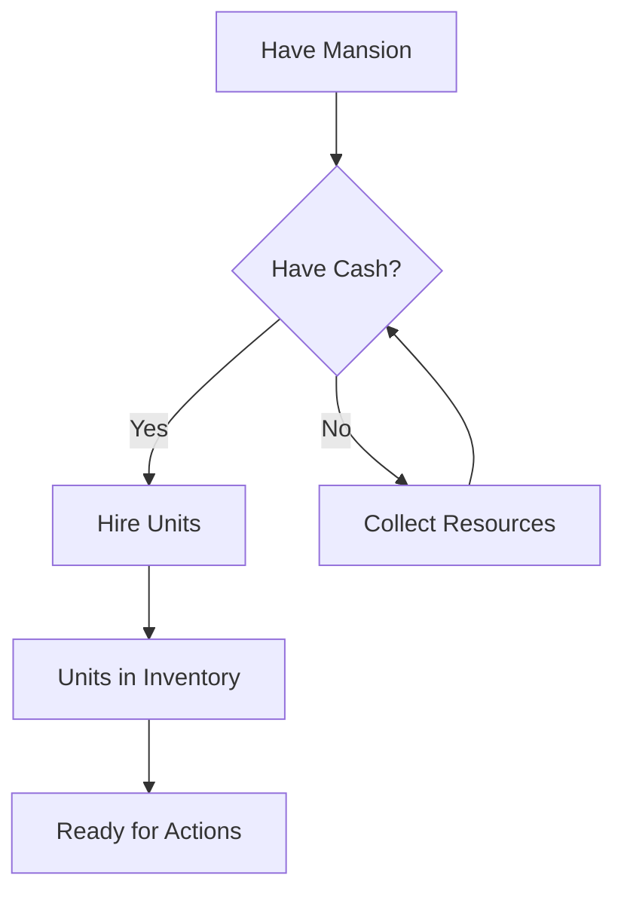
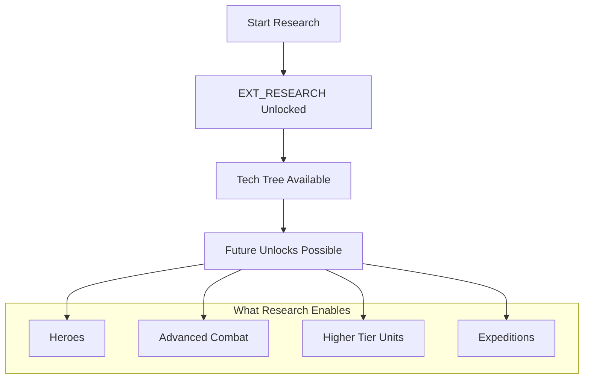

# Player Onboarding

> The first steps a new player takes in Novus Mundus, from wallet connection to first meaningful action.

## Overview

Onboarding in Novus Mundus is designed to be progressive - players don't see all complexity at once. The initial flow is streamlined to get players into the core loop quickly.



## Step 1: Account Initialization

### PlayerAccount Creation

The first transaction creates the player's core account:

**Instruction:** `1 - initialize_player`

**What happens:**
1. System derives PlayerAccount PDA from wallet
2. Account is created with rent-exempt SOL
3. Player is assigned a starting city
4. Initial resources are granted
5. Extension flags are set to minimal defaults

**Starting Resources:**
| Resource | Amount | Purpose |
|----------|--------|---------|
| Cash | 10,000 | Initial purchases |
| Locked NOVI | 0 | Must deposit |
| Operatives | 0 | Must hire |
| Gems | 100 | Tutorial actions |



### UserAccount Creation

Immediately after, the user identity account is created:

**Instruction:** `2 - initialize_user`

**What happens:**
1. Links wallet to PlayerAccount
2. Records referrer (if any)
3. Sets subscription to free tier
4. Enables cross-game features

[Source: processor/initialization/player.rs](../../../programs/novus_mundus/src/processor/initialization/player.rs)
[Source: processor/initialization/user.rs](../../../programs/novus_mundus/src/processor/initialization/user.rs)

## Step 2: Estate Creation

Before meaningful progression, players need an estate:

**Instruction:** `160 - create_estate`

**What happens:**
1. EstateAccount PDA is created
2. Player receives 1 starting plot
3. Building slots are initialized
4. Daily tracking is set up

The estate is the foundation for all progression - buildings unlock features and provide bonuses.



[Source: processor/estate/create.rs](../../../programs/novus_mundus/src/processor/estate/create.rs)

## Step 3: First Building - Mansion

The Mansion is the mandatory first building:

**Instruction:** `161 - build`

**Why Mansion First:**
- Increases unit capacity (can't hire without it)
- Foundation for all other buildings
- Represents player's "home base"

**Building Flow:**


The Mansion at Level 1 provides:
- 100 base unit capacity
- Ability to hire Tier 1 operatives
- Unlock other building options

[Source: processor/estate/build.rs](../../../programs/novus_mundus/src/processor/estate/build.rs)

## Step 4: Hire First Operatives

With a Mansion built, players can hire their first troops:

**Instruction:** `11 - hire_units`

**Requirements:**
- Mansion Level 1 (for Tier 1 units)
- Sufficient cash
- Available unit capacity

**First Hire Recommendation:**
| Unit Type | Cost | Purpose |
|-----------|------|---------|
| Operative T1 | 100 cash each | Basic workforce |

Operatives are essential for:
- Resource collection
- Expeditions (mining/fishing)
- Combat
- Rallies



[Source: processor/economy/hire_units.rs](../../../programs/novus_mundus/src/processor/economy/hire_units.rs)

## Step 5: Start First Research

The final onboarding step unlocks the extension system:

**Instruction:** `122 - start_research`

**What This Does:**
1. Creates ResearchProgress account (if not exists)
2. Unlocks `EXT_RESEARCH` extension
3. Begins first research timer
4. Opens the tech tree UI

**Why Research is Required:**
- Research unlocks all major features
- First research is quick (tutorial pacing)
- Teaches the research mechanic early
- Gates hero system, rallies, etc.



[Source: processor/research/start_research.rs](../../../programs/novus_mundus/src/processor/research/start_research.rs)

## Onboarding Complete Checklist

After completing onboarding, a player has:

| Requirement | Status |
|-------------|--------|
| PlayerAccount | Created |
| UserAccount | Created |
| EstateAccount | Created |
| Mansion | Level 1 |
| Operatives | Some hired |
| Research | In progress |
| Extensions | EXT_RESEARCH unlocked |

## What's Next?

After onboarding, players enter the **core loop**:

1. **Complete first research** → Unlocks new features
2. **Start expeditions** → Earn gems and resources
3. **Upgrade buildings** → Increase capacity and bonuses
4. **Lock heroes** → Gain combat buffs (requires Sanctuary)
5. **Join rallies** → Team-based gameplay

See [Progression Gates](./progression-gates.md) for how features unlock.

## Client Integration Notes

### Recommended UI Flow

```
1. Wallet Connect
   └── Check if PlayerAccount exists
       ├── No  → Show "Create Account" button
       │         └── Call initialize_player + initialize_user
       └── Yes → Check EstateAccount exists
                 ├── No  → Show "Create Estate" prompt
                 │         └── Call create_estate
                 └── Yes → Check Mansion exists
                           ├── No  → Show "Build Mansion" tutorial
                           └── Yes → Show main game UI
```

### Transactions to Batch

These can be combined in a single transaction for better UX:
- `initialize_player` + `initialize_user`
- `create_estate` + `build` (Mansion)

### Error Handling

| Error | Meaning | Recovery |
|-------|---------|----------|
| `AccountAlreadyExists` | Player account exists | Skip to next step |
| `InsufficientFunds` | Not enough SOL for rent | Show deposit prompt |
| `PlotNotAvailable` | No empty plot | Should not happen on fresh account |

---

Next: [Progression Gates](./progression-gates.md) - How features unlock over time
