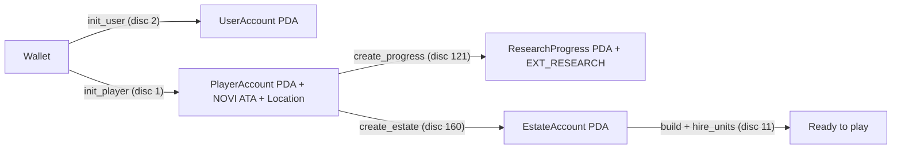
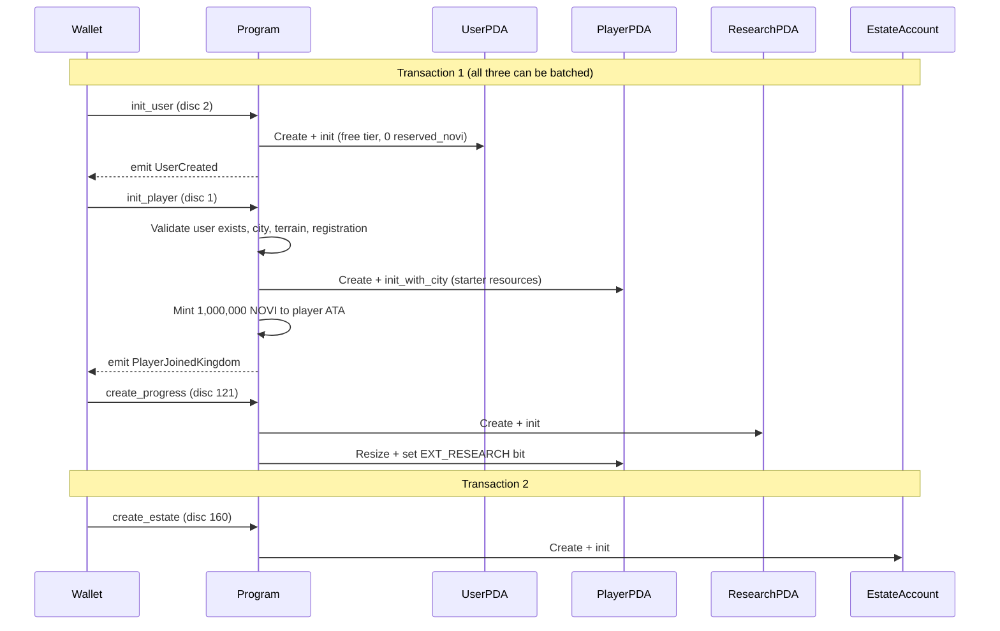
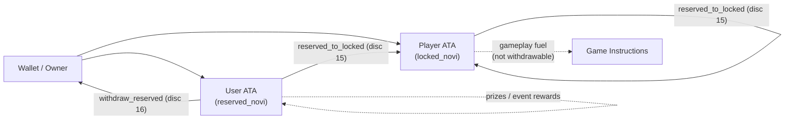

# Player Onboarding

> From zero to kingdom citizen: creating accounts, receiving starter resources, and establishing your estate.

## Overview

Joining Novus Mundus requires three on-chain instructions executed in strict order. The program enforces this sequence: `init_player` (discriminant 1) reads the `UserAccount` and errors `UserAccountNotCreated` if it does not exist, so `init_user` (discriminant 2) **must** be submitted first.

All three initialization instructions — `init_user`, `init_player`, and `create_progress` — can be batched into a single Solana transaction. Within one transaction, instructions execute sequentially and see state changes from prior instructions in the same batch.

[Source: processor/initialization/](../../../programs/novus_mundus/src/processor/initialization/)

---

## Instruction Reference

### `init_user` — discriminant 2

Creates the global **UserAccount** PDA. This account is kingdom-agnostic: one per wallet, shared across all kingdoms.

**Accounts:**

| # | Account | Role |
|---|---------|------|
| 1 | `user` PDA | Created; seeds `[b"user", owner]` |
| 2 | `owner` | Signer + fee payer |
| 3 | `user_token_account` | NOVI ATA for reserved (withdrawable) NOVI |
| 4 | `game_engine` | GameEngine PDA (provides NOVI mint address) |
| 5 | `novi_mint` | NOVI token mint |
| 6 | `system_program` | System program |
| 7 | `token_program` | SPL Token program |
| 8 | `associated_token_program` | ATA program |

**Instruction data:** none

**Effects:**
- Allocates `UserAccount` at `[b"user", owner_pubkey]`
- Initializes with free (tier 0) subscription and zero `reserved_novi`
- Creates the owner's NOVI ATA for reserved NOVI withdrawals
- Emits `UserCreated` event

[Source: processor/initialization/user.rs](../../../programs/novus_mundus/src/processor/initialization/user.rs)

---

### `init_player` — discriminant 1

Creates the kingdom-scoped **PlayerAccount** PDA, a NOVI ATA for locked gameplay NOVI, and a `LocationAccount` for the spawn cell.

> **Note:** The program checks `user.data_len() == 0` and returns `GameError::UserAccountNotCreated` if the UserAccount does not exist. Always call `init_user` before `init_player` — old documentation showing the reverse order is wrong.

**Accounts:**

| # | Account | Role |
|---|---------|------|
| 1 | `player` PDA | Created; seeds `[b"player", game_engine, owner]` |
| 2 | `owner` | Signer + fee payer |
| 3 | `player_token_account` | NOVI ATA for locked (non-withdrawable) NOVI |
| 4 | `game_engine` | GameEngine PDA (mutable — increments `total_players`) |
| 5 | `novi_mint` | NOVI token mint |
| 6 | `starting_city` | CityAccount for spawn city (mutable — increments `players_present`) |
| 7 | `spawn_location` | LocationAccount for spawn cell (created if absent) |
| 8 | `user` | Existing UserAccount PDA — must already exist |
| 9 | `system_program` | System program |
| 10 | `token_program` | SPL Token program |
| 11 | `associated_token_program` | ATA program |

**Instruction data:**

| Bytes | Field | Type | Description |
|-------|-------|------|-------------|
| 0–1 | `starting_city_id` | u16 LE | City where the player spawns |
| 2–9 | `spawn_lat` | f64 LE | Spawn latitude (must be within city radius) |
| 10–17 | `spawn_long` | f64 LE | Spawn longitude (must be within city radius) |

**Guards:**

```mermaid
flowchart TD
    A["init_player called"] --> B{"UserAccount exists?"}
    B -->|No| ERR1["GameError::UserAccountNotCreated"]
    B -->|Yes| C{"registration_open == true?"}
    C -->|No| ERR2["RegistrationClosed error"]
    C -->|Yes| D{"max_players == 0 or under limit?"}
    D -->|No| ERR3["MaxPlayersReached error"]
    D -->|Yes| E{"Spawn coords within city radius?"}
    E -->|No| ERR4["InvalidSpawnLocation error"]
    E -->|Yes| F{"Cell terrain passable?"}
    F -->|No| ERR5["ImpassableTerrain error"]
    F -->|Yes| G{"Spawn cell unoccupied?"}
    G -->|No| ERR6["CellOccupied error"]
    G -->|Yes| H["Create PlayerAccount + mint 1,000,000 NOVI"]
```

**Starter resources granted by `PlayerCore::init_with_city`:**

| Resource | Amount |
|----------|--------|
| `locked_novi` | 1,000,000 (`STARTER_LOCKED_NOVI`) |
| `defensive_unit_1` | 10,000 |
| `defensive_unit_2` | 4,000 |
| `defensive_unit_3` | 2,000 |
| `operative_unit_1` | 10,000 |
| `operative_unit_2` | 4,000 |
| `operative_unit_3` | 1,000 |
| `melee_weapons` | 8,000 |
| `ranged_weapons` | 4,000 |
| `siege_weapons` | 2,000 |
| `armor_pieces` | 8,000 |
| `produce` | 50,000 |
| `vehicles` | 500 |
| `cash_on_hand` | 130,000,000 |
| `gems` | 10,000 |
| New-player protection | `created_at + gameplay_config.new_player_protection_duration` |

1,000,000 NOVI tokens are minted to the player's ATA (matching `locked_novi`).

**Emits:** `PlayerJoinedKingdom`

[Source: processor/initialization/player.rs](../../../programs/novus_mundus/src/processor/initialization/player.rs)

---

### `create_progress` — discriminant 121

Creates the `ResearchProgress` PDA and unlocks `EXT_RESEARCH` on the `PlayerAccount`. This is the first extension in the chain and is required before all subsequent extensions (`EXT_INVENTORY`, `EXT_TEAM`, etc.).

**Seeds:** `[b"research", player_pda]`

After this instruction the player account is grown to `CORE_SIZE + RESEARCH_SIZE = 576 bytes`.

---

### `create_estate` — discriminant 160

Creates the player's `EstateAccount` in a specified city. Buildings are constructed here and the daily mini-game (`daily_activity`, discriminant 166) takes place on the estate.

**Seeds:** `[b"estate", player_pda]`

---

## Full Onboarding Sequence

---

## PDA Derivation Reference

| Account | Seeds |
|---------|-------|
| `UserAccount` | `[b"user", owner_pubkey]` |
| `PlayerAccount` | `[b"player", game_engine_pubkey, owner_pubkey]` |
| `ResearchProgress` | `[b"research", player_pda]` |
| `EstateAccount` | `[b"estate", player_pda]` |
| `LocationAccount` | `[b"location", game_engine, city_id_le, grid_lat_le, grid_long_le]` |

---

## Two-Token Design

Novus Mundus uses two distinct NOVI token accounts per player:

| Token Account | Owner | NOVI Type | Withdrawable |
|---------------|-------|-----------|--------------|
| Player ATA | PlayerAccount PDA | Locked | No — gameplay fuel only |
| User ATA | UserAccount PDA | Reserved | Yes — prizes and event rewards |

The `locked_novi` field on `PlayerCore` tracks gameplay NOVI. Reserved NOVI flows through the `UserAccount` and can be converted to locked via `reserved_to_locked` (discriminant 15) or withdrawn via `withdraw_reserved` (discriminant 16).

---

## What Happens After Onboarding

After `init_user` + `init_player` + `create_progress`, the player has:
- A fully initialized `PlayerAccount` with all starter resources
- `EXT_RESEARCH` unlocked (account is 576 bytes: `CORE_SIZE` + `RESEARCH_SIZE`)
- A `ResearchProgress` account for the technology tree
- 1,000,000 locked NOVI for immediate hiring and building

Typical next steps:
1. `create_estate` (discriminant 160) — establish home base
2. `build` (discriminant 161) + `complete_building` (discriminant 163) — construct Mansion and other buildings
3. `hire_units` (discriminant 11) — build up troops using locked NOVI
4. `start_research` (discriminant 122) — begin unlocking Growth and Battle nodes

---

Next: [Progression Gates](./progression-gates.md)
