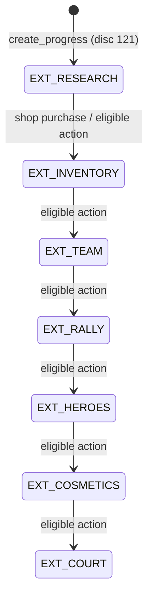
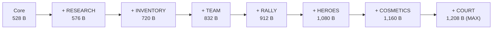
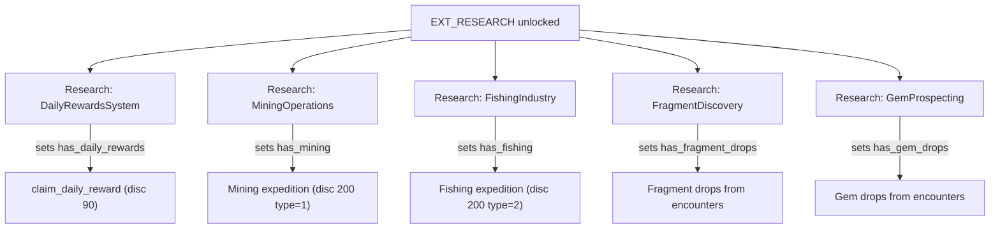
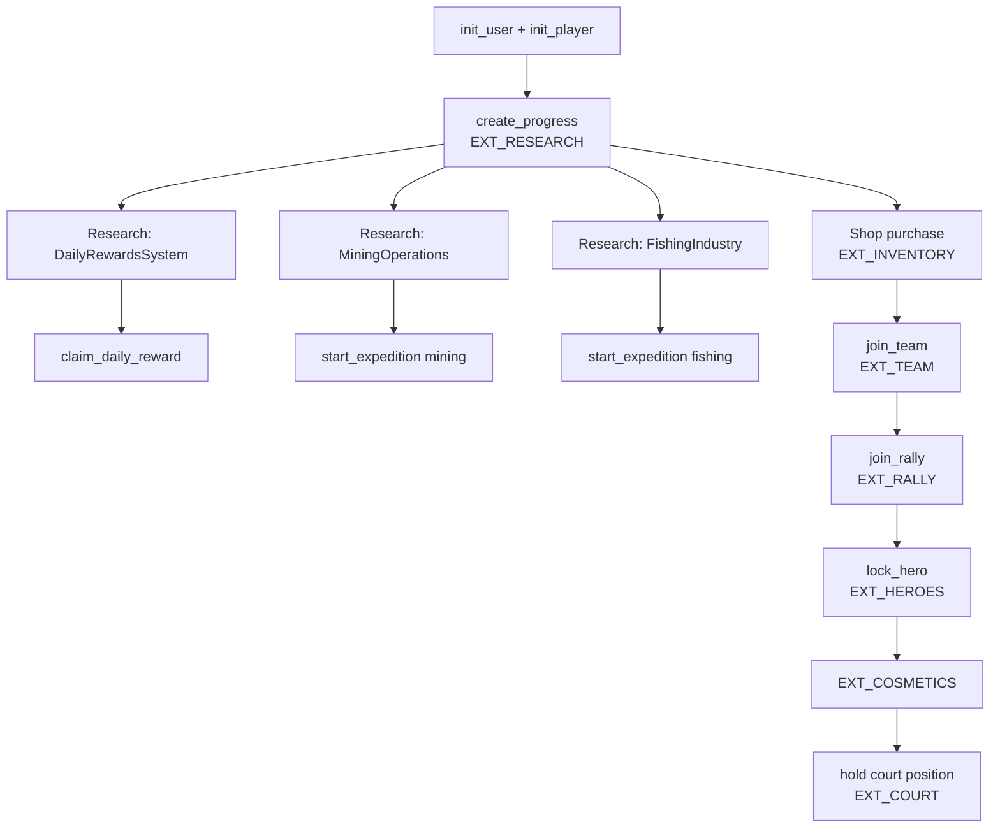

# Progression Gates

> How the sequential extension chain and research flags gate every major feature in Novus Mundus.

## The Extension Chain

`PlayerAccount.extensions` is a `u32` bitmap. Extensions must be unlocked **in strict sequential order** — each extension requires the previous one as a prerequisite. The program enforces this in `prerequisite_for_extension` and `unlock_extension_if_eligible`.

The **seven extensions** and their bit values:

| Constant | Bit | Decimal |
|----------|-----|---------|
| `EXT_RESEARCH` | `1 << 0` | 1 |
| `EXT_HEROES` | `1 << 1` | 2 |
| `EXT_INVENTORY` | `1 << 2` | 4 |
| `EXT_RALLY` | `1 << 3` | 8 |
| `EXT_TEAM` | `1 << 4` | 16 |
| `EXT_COSMETICS` | `1 << 5` | 32 |
| `EXT_COURT` | `1 << 6` | 64 |

> **Note:** Old documentation referenced `EXT_FORGE` and `EXT_EXPEDITION` — these do not exist in the program. Mining/fishing expeditions are gated by research flags on the `ResearchSection`, not by extension bits.

The **unlock chain** (each entry requires the one above it):

```
EXT_RESEARCH  (no prereq)
  └─ EXT_INVENTORY  (prereq: EXT_RESEARCH)
       └─ EXT_TEAM  (prereq: EXT_INVENTORY)
            └─ EXT_RALLY  (prereq: EXT_TEAM)
                 └─ EXT_HEROES  (prereq: EXT_RALLY)
                      └─ EXT_COSMETICS  (prereq: EXT_HEROES)
                           └─ EXT_COURT  (prereq: EXT_COSMETICS)
```



When an extension is unlocked the `PlayerAccount` is **resized on-chain** and the new section bytes are zero-initialized. Each unlock is paid for by transferring additional rent-exempt lamports from the payer.

[Source: state/player.rs](../../../programs/novus_mundus/src/state/player.rs)

---

## Account Growth by Extension

| Extensions active | Account size |
|-------------------|-------------|
| None (core only) | 528 bytes (`CORE_SIZE`) |
| + EXT_RESEARCH | 576 bytes (+ 48 `RESEARCH_SIZE`) |
| + EXT_INVENTORY | 720 bytes (+ 144 `INVENTORY_SIZE`) |
| + EXT_TEAM | 832 bytes (+ 112 `TEAM_SIZE`) |
| + EXT_RALLY | 912 bytes (+ 80 `RALLY_SIZE`) |
| + EXT_HEROES | 1,080 bytes (+ 168 `HEROES_SIZE`) |
| + EXT_COSMETICS | 1,160 bytes (+ 80 `COSMETICS_SIZE`) |
| + EXT_COURT (MAX) | 1,208 bytes (+ 48 `COURT_SIZE`) |

All sizes are verified by compile-time `const_assert` in `player.rs`.



---

## Extension-Gated Features

### EXT_RESEARCH (bit 0)

Unlocked by: `create_progress` (discriminant 121).

**Adds to PlayerAccount:** `ResearchSection` — stores battle buff cache, unlock flags (`has_daily_rewards`, `has_mining`, `has_fishing`, `has_fragment_drops`, `has_gem_drops`), and `last_daily_claim`.

**Enables:**
- Full research tree (`start_research` 122, `complete_research` 123, etc.)
- `claim_daily_reward` (discriminant 90) — requires `has_daily_rewards` flag inside this section
- `start_expedition` (discriminant 200) — requires `has_mining` or `has_fishing` flag

### EXT_INVENTORY (bit 2)

Unlocked after EXT_RESEARCH. Typically triggered by the first shop purchase (buying gems, for example).

**Adds to PlayerAccount:** `InventorySection` — consumable counts, crafting material tiers, shop state, and daily transfer tracking.

**Enables:**
- Shop purchasing (consumables, materials)
- Item equip bonuses (`equipped_weapon_bonus_bps`, `equipped_armor_bonus_bps`)
- Transfer rate limiting (`daily_transfer_count`, `daily_transferred`)

### EXT_TEAM (bit 4)

Unlocked after EXT_INVENTORY.

**Adds to PlayerAccount:** `TeamSection` — team pubkey, slot index, reinforcement unit aggregates, and hero weapon/armor efficiency contributions.

**Enables:**
- `create_team` (50), `join_team` (51), and related team instructions
- Receiving reinforcements (`send_reinforcement` 190, `process_arrival` 191)
- Team treasury operations (53, 59)

### EXT_RALLY (bit 3)

Unlocked after EXT_TEAM.

**Adds to PlayerAccount:** `RallySection` — `PlayerRallyCaps` (max concurrent + daily limits) and `RallyStats` (lifetime rally counters).

Default caps: `max_concurrent_rallies = 3`, `max_rallies_per_day = 5`.

**Enables:**
- `create_rally` (60), `join_rally` (61), `execute_rally` (62), and all rally instructions

### EXT_HEROES (bit 1)

Unlocked after EXT_RALLY.

**Adds to PlayerAccount:** `HeroesSection` — three active hero slots (pubkeys), defensive/meditation hero slot indexes, and 18 hero buff fields in basis points.

**Enables:**
- `lock_hero` (132), `unlock_hero` (133), `assign_defensive` (135)
- `start_meditation` (137), `claim_meditation` (138)
- Hero buffs active in combat, expeditions, and XP gain

### EXT_COSMETICS (bit 5)

Unlocked after EXT_HEROES.

**Adds to PlayerAccount:** `CosmeticsSection` — equipped frame/color/title/badge/effect/pose IDs, and six `owned_*` u64 bitfields.

**Enables:** Cosmetic equip/unequip instructions.

### EXT_COURT (bit 6)

Unlocked after EXT_COSMETICS.

**Adds to PlayerAccount:** `CourtSection` — castle pubkey, position type, and four court buff fields in basis points (`court_attack_bps`, `court_research_speed_bps`, `court_defense_bps`, `court_economy_bps`).

**Enables:**
- Holding a court position inside a King's Castle (Castle system, discriminants 270+)
- Receiving passive castle buffs

---

## Research Flag Gates

Beyond extensions, features within `EXT_RESEARCH` are gated by boolean flags set by completing specific research nodes:

| Flag | Research Node | Gates |
|------|--------------|-------|
| `has_daily_rewards` | `DailyRewardsSystem` (Growth tree) | `claim_daily_reward` (disc 90) |
| `has_mining` | `MiningOperations` (Growth tree) | Mining expeditions (disc 200 with type=1) |
| `has_fishing` | `FishingIndustry` (Growth tree) | Fishing expeditions (disc 200 with type=2) |
| `has_fragment_drops` | `FragmentDiscovery` (Growth tree) | Fragment drops from encounters |
| `has_gem_drops` | `GemProspecting` (Growth tree) | Gem drops from encounters |



---

## Building-Gated Feature Tiers

Buildings gate expedition **tiers** and are independent of the extension system:

### Mining — Workshop Level Required

| Tier | Name | Workshop Level | Duration |
|------|------|---------------|----------|
| 0 | Surface | 1 | 1 hour |
| 1 | Shallow | 5 | 2 hours |
| 2 | Deep | 10 | 4 hours |
| 3 | Volcanic | 15 | 8 hours |
| 4 | Abyssal | 20 | 16 hours |

### Fishing — Dock Level Required

| Tier | Name | Dock Level | Duration |
|------|------|-----------|----------|
| 0 | Shore | 1 | 1 hour |
| 1 | River | 5 | 2 hours |
| 2 | Lake | 10 | 4 hours |
| 3 | DeepSea | 15 | 8 hours |
| 4 | Abyss | 20 | 16 hours |

[Source: constants.rs](../../../programs/novus_mundus/src/constants.rs) — `MINING_WORKSHOP_REQ`, `FISHING_DOCK_REQ`

---

## Subscription Tier Gates

The player's effective subscription tier (`get_effective_tier`) affects several caps:

| Tier | Name | Max Stamina | Daily Reward Multiplier |
|------|------|-------------|------------------------|
| 0 | Rookie | 100 | 1.0× |
| 1 | Expert | 500 | configurable |
| 2 | Epic | 1,000 | configurable |
| 3 | Legendary | 10,000 | configurable |

`get_effective_tier` returns 0 if the subscription has expired.

[Source: constants.rs](../../../programs/novus_mundus/src/constants.rs) — `MAX_STAMINA_BY_TIER`

---

## Progression Path



---

## Client-Side Extension Check

```typescript
const EXT_RESEARCH  = 1 << 0;  // 1
const EXT_HEROES    = 1 << 1;  // 2
const EXT_INVENTORY = 1 << 2;  // 4
const EXT_RALLY     = 1 << 3;  // 8
const EXT_TEAM      = 1 << 4;  // 16
const EXT_COSMETICS = 1 << 5;  // 32
const EXT_COURT     = 1 << 6;  // 64

function hasExtension(extensions: number, ext: number): boolean {
  return (extensions & ext) !== 0;
}

// Example: show hero UI only when EXT_HEROES is active
if (hasExtension(player.extensions, EXT_HEROES)) {
  renderHeroSection();
}
```

---

Next: [Daily Loop](./daily-loop.md)
