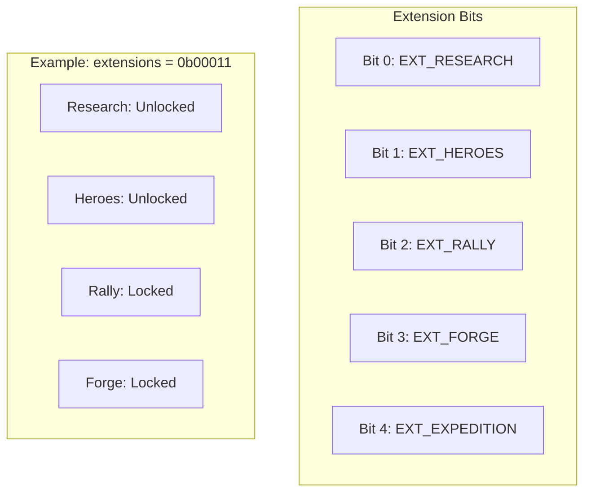
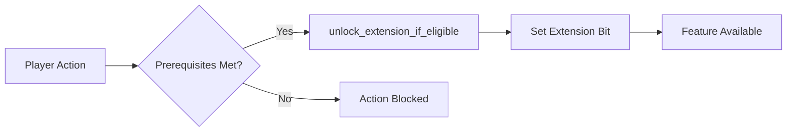
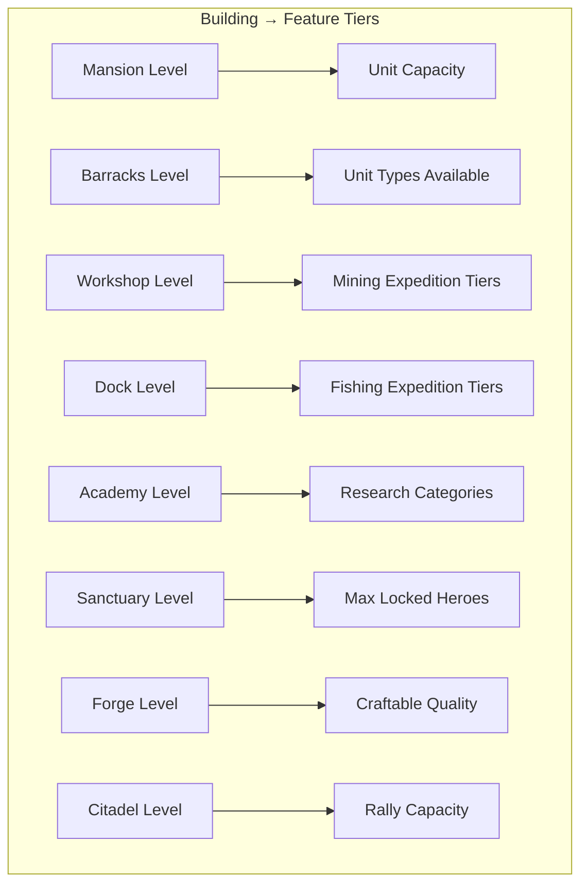
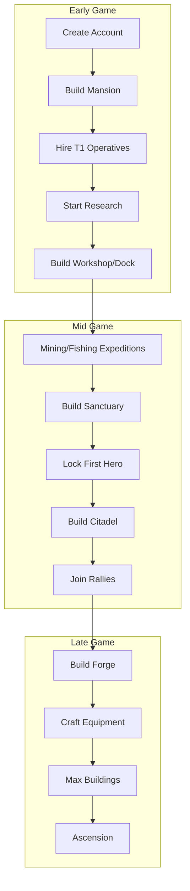

# Progression Gates

> How features unlock progressively through the extension system and building requirements.

## The Extension System

Novus Mundus uses a **bit-flag extension system** to gate features. Extensions are stored in `PlayerAccount.extensions` as a 32-bit integer where each bit represents an unlocked feature.



[Source: state/player.rs](../../../programs/novus_mundus/src/state/player.rs) - Extension constants

## Extension Unlock Flow

Extensions unlock automatically when prerequisites are met:



### EXT_RESEARCH (Bit 0)
**Unlocks:** Research system, tech tree

**How to unlock:**
- Automatic on first valid action
- Or explicitly via `start_research`

**What it enables:**
- `start_research` instruction
- `complete_research` instruction
- `speed_up_research` instruction
- Access to tech tree UI

---

### EXT_HEROES (Bit 1)
**Unlocks:** Hero locking and buffs

**Prerequisites:**
1. `EXT_RESEARCH` must be unlocked
2. Sanctuary building at Level 1+

**How to unlock:**
- Triggered on first `lock_hero` call
- Must have Sanctuary built

**What it enables:**
- `lock_hero` instruction
- `unlock_hero` instruction
- Hero buff aggregation on player
- Heroes in expeditions

---

### EXT_RALLY (Bit 2)
**Unlocks:** Group attack coordination

**Prerequisites:**
1. `EXT_RESEARCH` must be unlocked
2. Specific research completed (Rally Technology)
3. Citadel building at Level 1+

**What it enables:**
- `create_rally` instruction
- `join_rally` instruction
- Team-based combat

---

### EXT_FORGE (Bit 3)
**Unlocks:** Equipment crafting

**Prerequisites:**
1. Forge building at Level 1+
2. Specific research completed

**What it enables:**
- `start_craft` instruction
- Equipment quality tiers
- Staged tempering mechanic

---

### EXT_EXPEDITION (Bit 4)
**Unlocks:** Mining and fishing expeditions

**Prerequisites:**
1. Workshop (for mining) at Level 1+
2. Dock (for fishing) at Level 1+
3. Relevant research completed

**What it enables:**
- `start_expedition` instruction
- Resource gathering activities
- Hero expedition assignments

---

## Building Requirements

Beyond extensions, buildings gate feature **tiers** and **power levels**:



### Unit Type Requirements

| Unit Type | Barracks Level Required |
|-----------|------------------------|
| Tier 1 Operative | 1 |
| Tier 2 Operative | 5 |
| Tier 3 Operative | 10 |
| Melee Weapons | 3 |
| Ranged Weapons | 7 |
| Siege Weapons | 12 |
| Vehicles | 15 |

[Source: helpers/estate.rs](../../../programs/novus_mundus/src/helpers/estate.rs) - `required_barracks_level_for_unit`

### Mining Tier Requirements

| Mining Tier | Workshop Level | Duration |
|-------------|---------------|----------|
| Surface | 1 | 1 hour |
| Shallow | 5 | 2 hours |
| Deep | 10 | 4 hours |
| Volcanic | 15 | 8 hours |
| Abyssal | 20 | 16 hours |

### Fishing Tier Requirements

| Fishing Tier | Dock Level | Duration |
|--------------|-----------|----------|
| Shore | 1 | 1 hour |
| River | 5 | 2 hours |
| Lake | 10 | 4 hours |
| Deep Sea | 15 | 8 hours |
| Abyss | 20 | 16 hours |

### Hero Locking Limits

| Sanctuary Level | Max Locked Heroes |
|-----------------|-------------------|
| 1-4 | 1 |
| 5-9 | 2 |
| 10-14 | 3 |
| 15-19 | 4 |
| 20 | 5 |

[Source: helpers/estate.rs](../../../programs/novus_mundus/src/helpers/estate.rs) - `max_locked_heroes_for_sanctuary_level`

### Research Category Requirements

| Research Category | Academy Level |
|-------------------|---------------|
| Basic | 1 |
| Intermediate | 5 |
| Advanced | 10 |
| Expert | 15 |
| Master | 20 |

---

## Progression Path Diagram



## Checking Requirements (Client-Side)

### Extension Check
```javascript
function hasExtension(extensions, extBit) {
  return (extensions & (1 << extBit)) !== 0;
}

// Usage
const EXT_RESEARCH = 0;
const EXT_HEROES = 1;

if (hasExtension(player.extensions, EXT_HEROES)) {
  // Show hero UI
}
```

### Building Level Check
```javascript
function getBuildingLevel(estate, buildingType) {
  for (const slot of estate.buildings) {
    if (slot.building_type === buildingType) {
      return slot.level;
    }
  }
  return 0; // Not built
}

// Check if can mine at tier 2
const workshopLevel = getBuildingLevel(estate, BuildingType.Workshop);
if (workshopLevel >= 5) {
  // Can do Shallow mining
}
```

## Common Error Codes

| Error | Meaning | Solution |
|-------|---------|----------|
| `ExtensionNotUnlocked` | Missing required extension | Complete prerequisites |
| `BuildingLevelTooLow` | Building level insufficient | Upgrade the building |
| `ResearchRequired` | Missing research unlock | Complete required research |
| `MaxHeroesLocked` | Sanctuary limit reached | Upgrade Sanctuary or unlock hero |

---

## Unlock Summary Table

| Feature | Extension | Building Requirement | Research Requirement |
|---------|-----------|---------------------|---------------------|
| Research | EXT_RESEARCH | None | None |
| Hero Locking | EXT_HEROES | Sanctuary Lv1+ | Research started |
| Expeditions | - | Workshop/Dock Lv1+ | Relevant unlock |
| Rallies | EXT_RALLY | Citadel Lv1+ | Rally Technology |
| Forging | EXT_FORGE | Forge Lv1+ | Crafting research |
| Higher Tiers | - | Building level | Category unlocks |

---

Next: [Daily Loop](./daily-loop.md) - What players do each session
