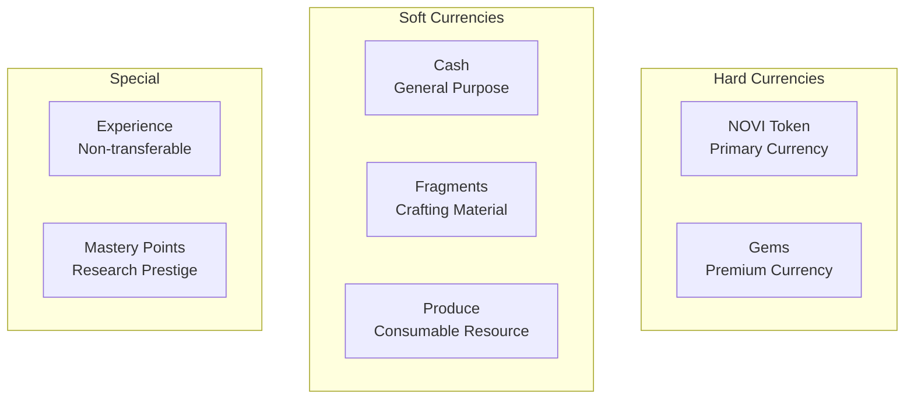
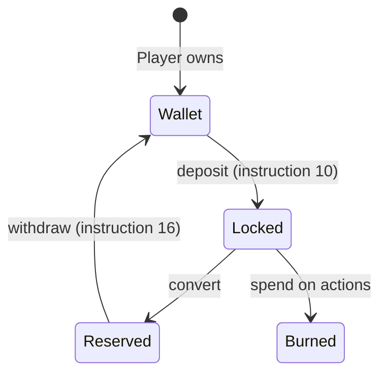
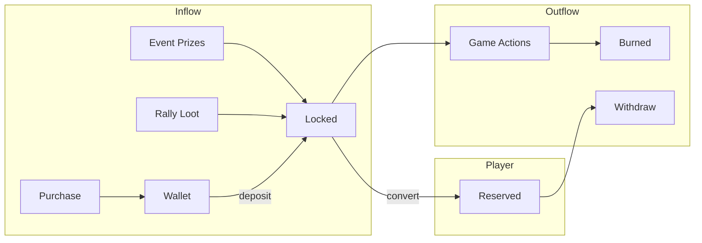
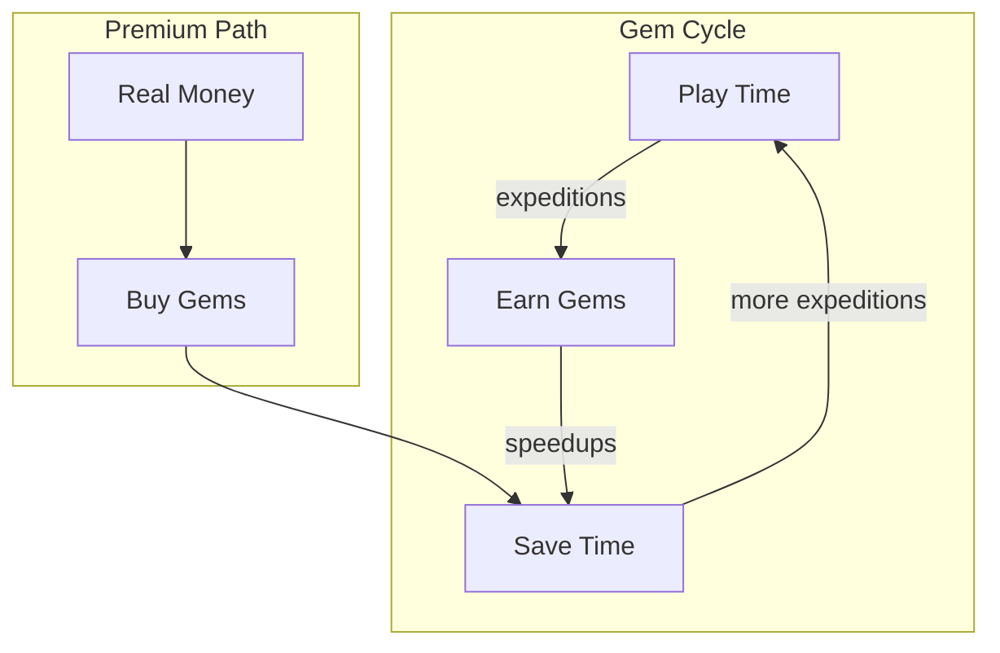
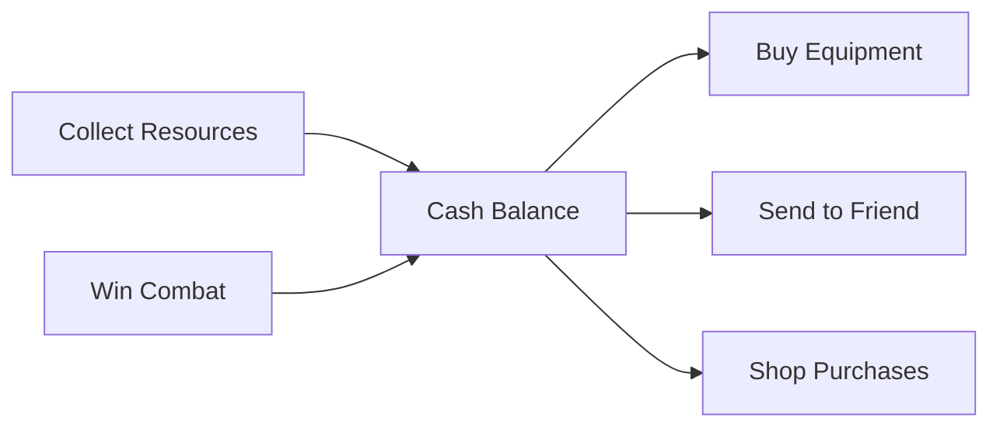
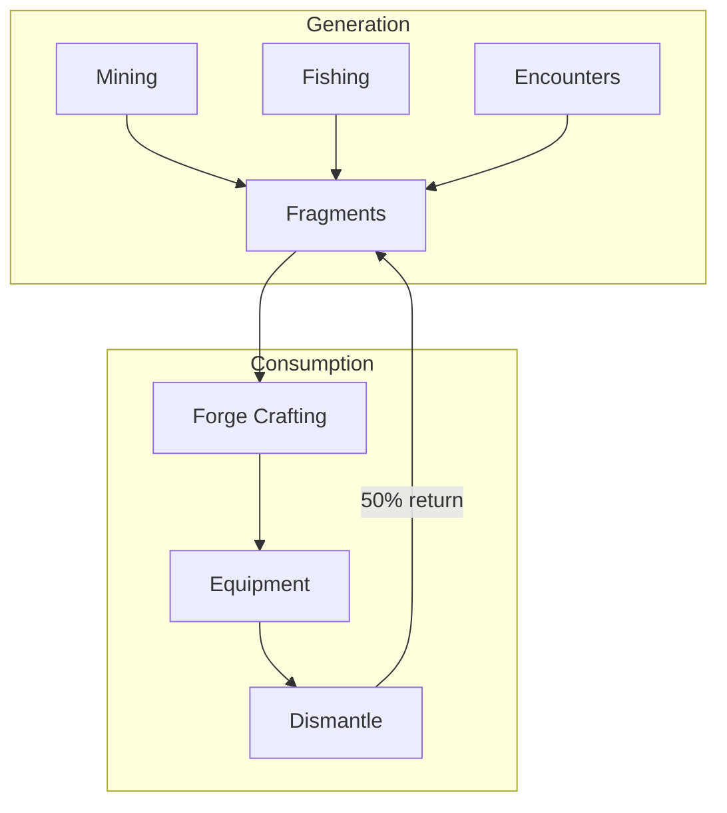
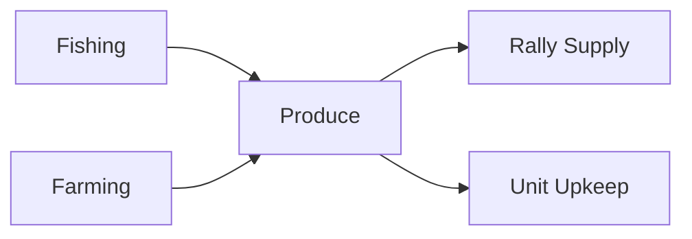
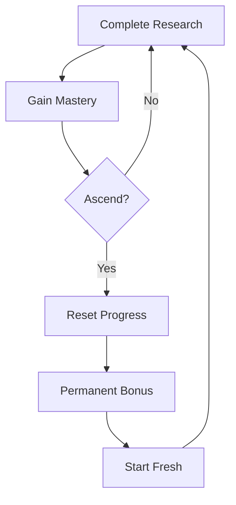
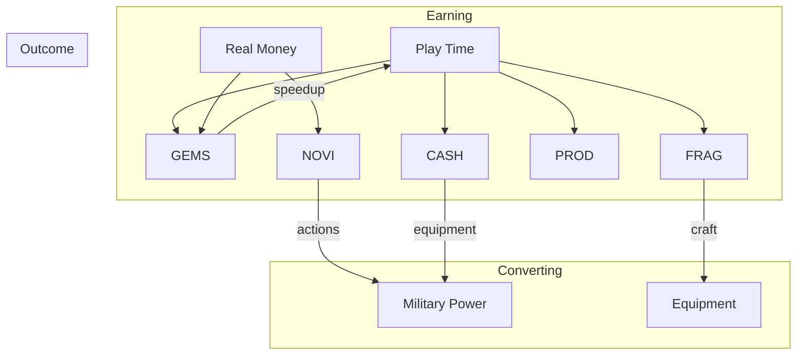

# Currencies

> Understanding the multiple currency types in Novus Mundus and their purposes.

## Currency Overview

Novus Mundus uses a multi-currency economy designed to create distinct value propositions and prevent single-resource dominance:



## NOVI Token

**Type:** SPL Token (on-chain)
**Primary Use:** Core game actions, staking value

NOVI is the blockchain-native currency that bridges real value with in-game economy.

### NOVI States



| State | Location | Can Spend | Can Withdraw |
|-------|----------|-----------|--------------|
| Wallet | Player's SPL Token Account | No | Yes (external) |
| Locked | PlayerAccount.locked_novi | Yes | No |
| Reserved | PlayerAccount.reserved_novi | No | Yes |

### NOVI Uses

| Action | NOVI Cost | Notes |
|--------|-----------|-------|
| **Hire Units** | 100 - 2,000 | Primary unit currency |
| Start Expedition | 5,000 - 30,000 | Based on tier |
| Research | 1,000 - 50,000 | Based on category |
| Building Upgrade | 5,000 - 100,000 | Based on level |
| Rally Creation | 10,000 | Refunded if cancelled |

### NOVI Flow



[Source: state/player.rs](../../../programs/novus_mundus/src/state/player.rs) - `locked_novi`, `reserved_novi`

---

## Gems

**Type:** In-game currency (off-chain tracking in PlayerAccount)
**Primary Use:** Premium actions, speedups, convenience

Gems are the premium currency earned through gameplay or purchased.

### Gem Sources

| Source | Amount | Frequency |
|--------|--------|-----------|
| Daily Login | 100-500 | Daily |
| Mining Expeditions | 10-100 | Per expedition |
| Event Prizes | 500-5,000 | Per event |
| Shop Purchase | Variable | On demand |
| Encounter Loot | 5-50 | Per kill |

### Gem Uses

| Action | Gem Cost | Effect |
|--------|----------|--------|
| Teleport | 500 | Instant intercity travel |
| Expedition Speedup (T1) | ~100/min | 50% time reduction |
| Expedition Speedup (T2) | ~200/min | 75% time reduction |
| Rally Speedup | Variable | Based on remaining time |
| Stamina Refill | 100 | Restore action points |
| Research Speedup | Variable | Based on remaining time |

### Gem Economy Design

Gems serve as a **time-value exchange**:
- Players with time earn gems through expeditions
- Players without time spend gems to accelerate
- Creates natural exchange value



[Source: state/player.rs](../../../programs/novus_mundus/src/state/player.rs) - `gems`

---

## Cash

**Type:** In-game soft currency
**Primary Use:** Basic transactions, equipment, transfers

Cash is the most common currency, freely earned and spent on everyday activities.

### Cash Sources

| Source | Amount | Notes |
|--------|--------|-------|
| Resource Collection | 100-1,000 | Location dependent |
| Combat Victory | 50-500 | Based on opponent |
| Daily Rewards | 500-2,000 | Streak bonus |
| Selling Items | Variable | Market prices |

### Cash Uses

| Action | Cash Cost | Notes |
|--------|-----------|-------|
| Basic Equipment | 200-1,000 | Weapons, armor |
| Transfer to Player | Any | Instruction 18 |
| Shop Purchases | Variable | Some shop items |
| Building Materials | Variable | Construction costs |

**Note:** Unit hiring uses **locked NOVI**, not cash.

### Cash Flow Pattern



[Source: state/player.rs](../../../programs/novus_mundus/src/state/player.rs) - `cash`

---

## Fragments

**Type:** Crafting material
**Primary Use:** Equipment forging, special items

Fragments are the backbone of the crafting economy.

### Fragment Sources

| Source | Amount | Notes |
|--------|--------|-------|
| Mining Expeditions | 5-50 | Secondary reward |
| Fishing Expeditions | 5-30 | Secondary reward |
| Encounter Loot | 10-100 | Based on tier |
| Building Daily | 20-100 | Observatory bonus |
| Dismantling | Variable | Equipment salvage |

### Fragment Uses

| Action | Fragment Cost | Result |
|--------|---------------|--------|
| Basic Craft | 100 | Common equipment |
| Quality Craft | 500 | Uncommon equipment |
| Masterwork | 2,000 | Rare equipment |
| Special Items | 5,000+ | Legendary tier |

### Fragment Economy



[Source: state/player.rs](../../../programs/novus_mundus/src/state/player.rs) - `fragments`

---

## Produce

**Type:** Consumable resource
**Primary Use:** Unit sustenance, trading

Produce represents food and supplies for maintaining armies.

### Produce Sources

| Source | Amount | Notes |
|--------|--------|-------|
| Fishing Expeditions | 15-100 | Primary reward |
| Farm Collection | 50-200 | Location based |
| Daily Claim | 100-500 | Estate bonus |

### Produce Uses

| Action | Produce Cost | Notes |
|--------|--------------|-------|
| Rally Sustenance | 10/unit/hour | March duration |
| Unit Maintenance | 1/unit/day | Optional upkeep |
| Trading | Variable | Player economy |

### Produce Balance

Produce creates a natural **army size limiter**:
- Large armies consume more produce
- Long rallies require significant stockpiles
- Encourages efficient unit deployment



[Source: state/player.rs](../../../programs/novus_mundus/src/state/player.rs) - `produce`

---

## Experience & Mastery

### Experience (XP)

**Type:** Non-transferable progression metric
**Primary Use:** Player leveling

| Action | XP Gain |
|--------|---------|
| Complete Research | 100-1,000 |
| Win Combat | 50-500 |
| Complete Expedition | 25-200 |
| Finish Building | 200-2,000 |
| Travel | 10-50 |

XP drives player level which unlocks:
- UI features
- Leaderboard eligibility
- Certain content gates

### Mastery Points

**Type:** Research prestige currency
**Primary Use:** Ascension benefits

Earned through research completion and ascension resets:



[Source: state/research.rs](../../../programs/novus_mundus/src/state/research.rs) - `mastery_points`

---

## Currency Relationships



## Client Integration

### Displaying Balances

```javascript
// All currencies from PlayerAccount
const currencies = {
  novi: {
    locked: player.locked_novi,
    reserved: player.reserved_novi,
    // Wallet balance from SPL token account
    wallet: await getTokenBalance(wallet, noviMint)
  },
  gems: player.gems,
  cash: player.cash,
  fragments: player.fragments,
  produce: player.produce
};
```

### Formatting

| Currency | Format | Example |
|----------|--------|---------|
| NOVI | 2 decimals | 1,234.56 NOVI |
| Gems | Integer with icon | 💎 5,000 |
| Cash | Integer with $ | $12,345 |
| Fragments | Integer | 🔷 890 |
| Produce | Integer | 🌾 2,500 |

---

Next: [Resource Flow](./resource-flow.md) - Sources, sinks, and circulation
