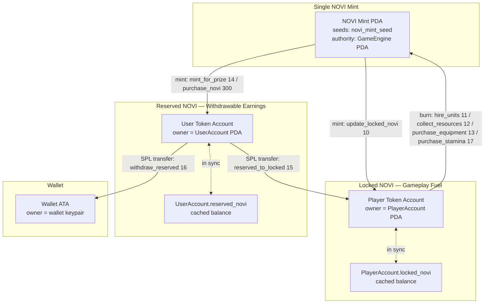
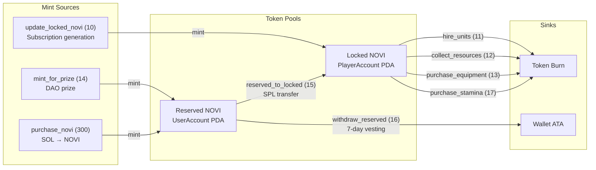
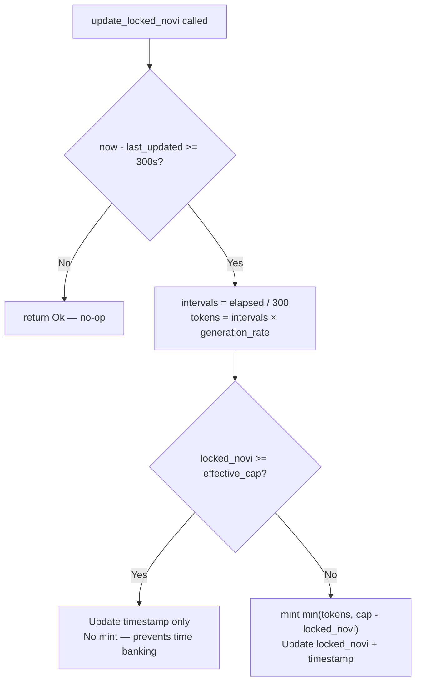

# Currencies

> The dual-token model that separates gameplay fuel from market-tradeable value.

## Overview

Novus Mundus uses a **dual-token architecture** built on a single SPL token mint (NOVI). The distinction is not in the token itself but in *which Program Derived Account owns the token account*. Locked NOVI fuels gameplay and cannot be withdrawn; Reserved NOVI is earned as prizes and rewards and can be withdrawn to a wallet after a 7-day vesting period.



## NOVI Token Flows at a Glance



## Currency Types

### Locked NOVI

| Property | Detail |
|----------|--------|
| Cached field | `PlayerAccount.locked_novi: u64` |
| Token account owner | `PlayerAccount` PDA |
| PDA seeds | `[b"player", game_engine, owner_wallet]` |
| Non-withdrawable | Token account is PDA-owned; no instruction transfers it to the wallet |
| Minted by | `update_locked_novi` (10) |
| Transferred in by | `reserved_to_locked` (15) — SPL transfer from reserved, not a mint |
| Burned by | `hire_units` (11), `collect_resources` (12), `purchase_equipment` (13), `purchase_stamina` (17) |
| Generation interval | 300 seconds (5 minutes) |
| Generation rate | `SubscriptionTier.generation_multiplier` NOVI per interval |
| Cap | `SubscriptionTier.max_locked_novi` × Vault building bonus multiplier |
| Starter grant | 1,000,000 NOVI on player init (`STARTER_LOCKED_NOVI`) |

**Vault building cap bonus** (applied multiplicatively on top of tier base cap):

| Vault Level | Cap Bonus |
|-------------|-----------|
| 1-4 | +0% |
| 5-9 | +50% |
| 10-14 | +100% |
| 15-19 | +150% |
| 20+ | +200% |

Cap formula:
```
effective_cap = base_cap × (10000 + vault_bonus_bps) / 10000
```

**Default subscription generation rates:**

| Tier | Name | NOVI / 5 min | Base Max Cap |
|------|------|--------------|--------------|
| 0 | Rookie | 50 | 3,000 |
| 1 | Expert | 100 | 6,000 |
| 2 | Epic | 500 | 30,000 |
| 3 | Legendary | 2,500 | 150,000 |

> **Note:** Default values from `GameEngine.subscription_tiers` — all DAO-adjustable. The program stores amounts with 1 raw decimal (multiply by 10 internally for precision); values above are the human-readable display amounts.

When `locked_novi >= effective_cap`, the timestamp advances immediately and no tokens are generated — the "banking time" exploit is closed.



### Reserved NOVI

| Property | Detail |
|----------|--------|
| Cached field | `UserAccount.reserved_novi: u64` |
| Token account owner | `UserAccount` PDA |
| PDA seeds | `[b"user", owner_wallet]` |
| Withdrawable | Yes — after 7-day vesting: `RESERVED_NOVI_VESTING_PERIOD = 604_800` seconds |
| Minted by | `mint_for_prize` (14) — DAO; `purchase_novi` (300) — player buys with SOL |
| Converted to locked by | `reserved_to_locked` (15) — one-way, permanent SPL transfer |
| Withdrawn to wallet by | `withdraw_reserved` (16) — SPL transfer after vesting |
| Vesting clock | `UserAccount.reserved_novi_earned_at` — reset on every mint |

> **CRITICAL:** `reserved_novi` is a field on `UserAccount`, not `PlayerAccount`. The `UserAccount` PDA is keyed by `[b"user", owner_wallet]`. Previous documentation that placed `reserved_novi` on `PlayerAccount` is wrong.

The vesting guard in `withdraw_reserved`:
```
now - user.reserved_novi_earned_at >= RESERVED_NOVI_VESTING_PERIOD (604800 s = 7 days)
```

`purchase_novi` resets `reserved_novi_earned_at` to `now` on every purchase, ensuring fresh-minted tokens are always subject to the full 7-day window.

### Cash

| Property | Detail |
|----------|--------|
| Fields | `PlayerAccount.cash_on_hand: u64`, `PlayerAccount.cash_in_vault: u64` |
| Token | Off-chain integer — no SPL token, program-internal only |
| Source | `collect_resources` (12) collection type = Cash |
| Transfer | `transfer_cash` (18): Expert+ subscription, same team; tier-based daily limits |
| Vault | `vault_transfer` (19): moves between `cash_on_hand` ↔ `cash_in_vault` |
| Vault protection cap | 75% of total cash (`gameplay_config.safebox_protection_percent = 7500` bps); 25% minimum stays on hand (lootable) |
| Networth contribution | Yes — both `cash_on_hand` and `cash_in_vault` count |

### Gems

| Property | Detail |
|----------|--------|
| Field | `PlayerAccount.gems: u64` |
| Source | `collect_resources` (12) collection type = Mining |
| Sink | Expedition and research speedups |
| Networth | No |

### Produce

| Property | Detail |
|----------|--------|
| Field | `PlayerAccount.produce: u64` |
| Source | `collect_resources` (12) collection type = Fishing or Farming |
| Sink | Consumed per `collect_resources` call based on operative units |
| Networth | Yes — via `economic_config.produce_value` |

### Stamina

| Property | Detail |
|----------|--------|
| Fields | `PlayerAccount.encounter_stamina: u64`, `PlayerAccount.max_encounter_stamina: u64` |
| Regeneration | 1 stamina per 300 seconds (`STAMINA_REGEN_INTERVAL`), modified by time-of-day |
| Time multiplier | DeepNight = φ (1.618×), Dawn = √φ (1.272×), Midday = 1/φ (0.618×), Afternoon = 1/φ (0.618×), others = 1.0× |
| Purchase | `purchase_stamina` (17): burns locked NOVI at `stamina_cost × cost_multiplier / 10000` per unit |
| Consumed by | `attack_encounter` — cost varies by rarity |

**Max stamina by subscription tier:**

| Tier | Max Stamina |
|------|-------------|
| 0 Rookie | 100 |
| 1 Expert | 500 |
| 2 Epic | 1,000 |
| 3 Legendary | 10,000 |

**Stamina cost to attack encounters:**

| Rarity | Cost |
|--------|------|
| Common | 10 |
| Uncommon | 25 |
| Rare | 50 |
| Epic | 100 |
| Legendary | 250 |
| WorldEvent | 500 |

## Instruction Reference

| ID | Instruction | Token Operation | Notes |
|----|-------------|-----------------|-------|
| 10 | `update_locked_novi` | Mint → locked token account | 5-min interval; GameEngine PDA signs |
| 11 | `hire_units` | Burn locked NOVI | PlayerAccount PDA signs burn |
| 12 | `collect_resources` | Burn locked NOVI; credit cash/gems/produce | PlayerAccount PDA signs burn |
| 13 | `purchase_equipment` | Burn locked NOVI | PlayerAccount PDA signs burn |
| 14 | `mint_for_prize` | Mint → reserved token account | DAO authority only |
| 15 | `reserved_to_locked` | SPL transfer reserved → locked | UserAccount PDA signs; one-way |
| 16 | `withdraw_reserved` | SPL transfer reserved → wallet | 7-day vesting required; UserAccount PDA signs |
| 17 | `purchase_stamina` | Burn locked NOVI | PlayerAccount PDA signs burn |
| 18 | `transfer_cash` | Move `cash_on_hand` P2P | Expert+ sub; same team; daily limits |
| 19 | `vault_transfer` | `cash_on_hand` ↔ `cash_in_vault` | Requires Vault building |
| 300 | `purchase_novi` | Mint → reserved token account | SOL payment; oracle or fallback pricing |

[Source: processor/economy/](../../../programs/novus_mundus/src/processor/economy/)
[Source: processor/token/](../../../programs/novus_mundus/src/processor/token/)
[Source: processor/shop/purchase_novi.rs](../../../programs/novus_mundus/src/processor/shop/purchase_novi.rs)
[Source: constants.rs](../../../programs/novus_mundus/src/constants.rs)
[Source: state/game_engine.rs](../../../programs/novus_mundus/src/state/game_engine.rs)
[Source: state/player.rs](../../../programs/novus_mundus/src/state/player.rs)

---

Next: [Resource Flow](./resource-flow.md)
