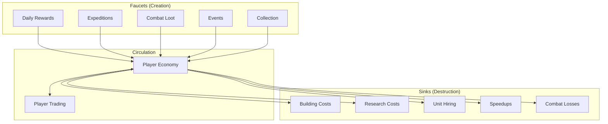
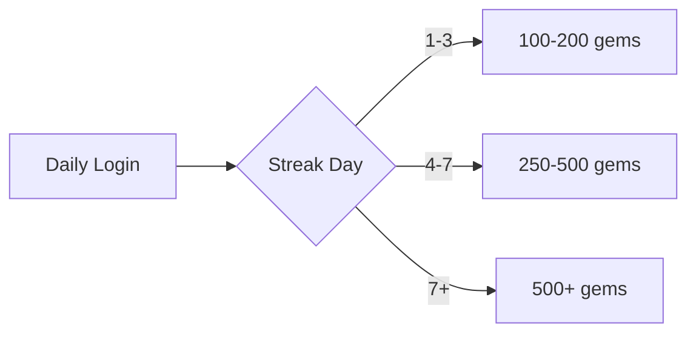
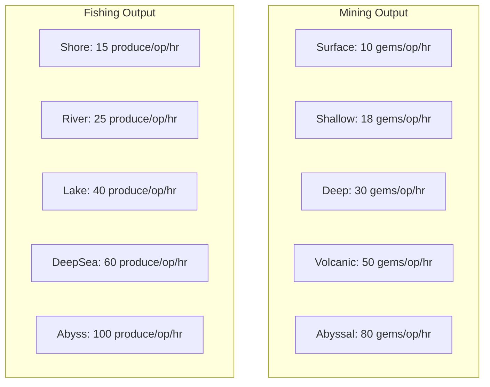
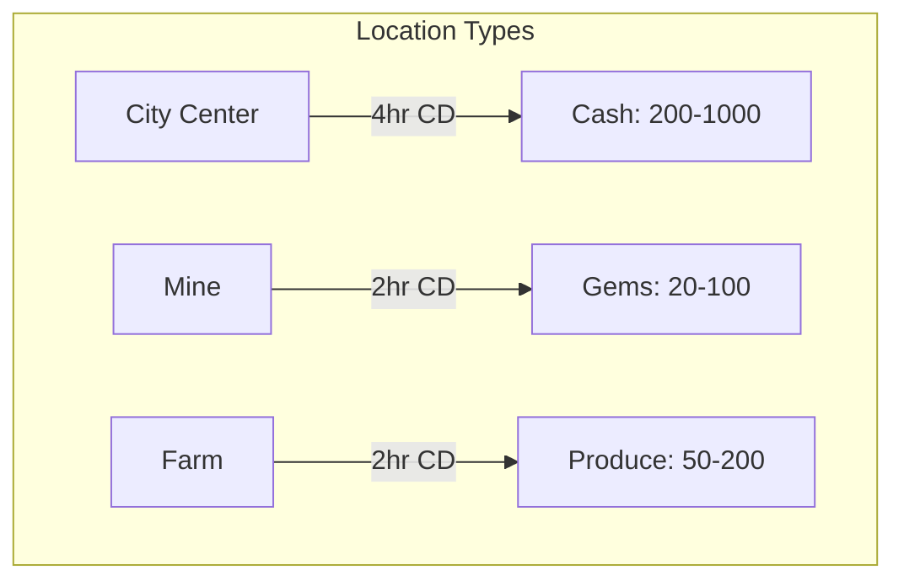
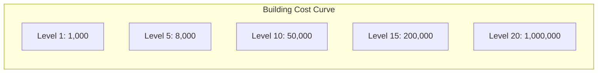
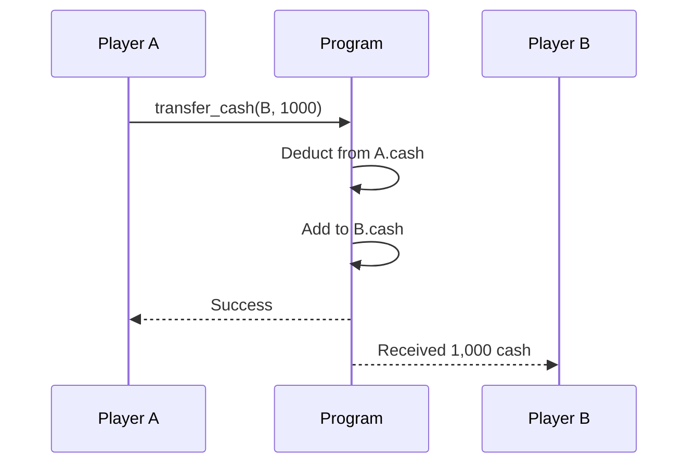
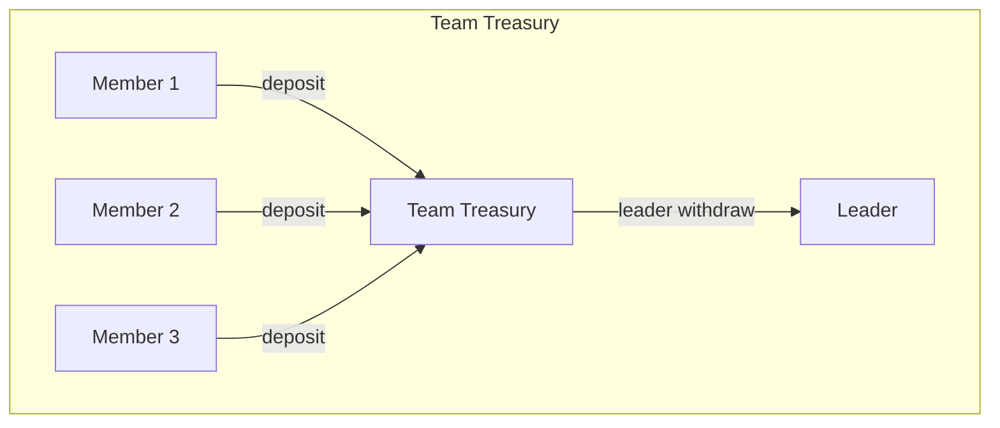
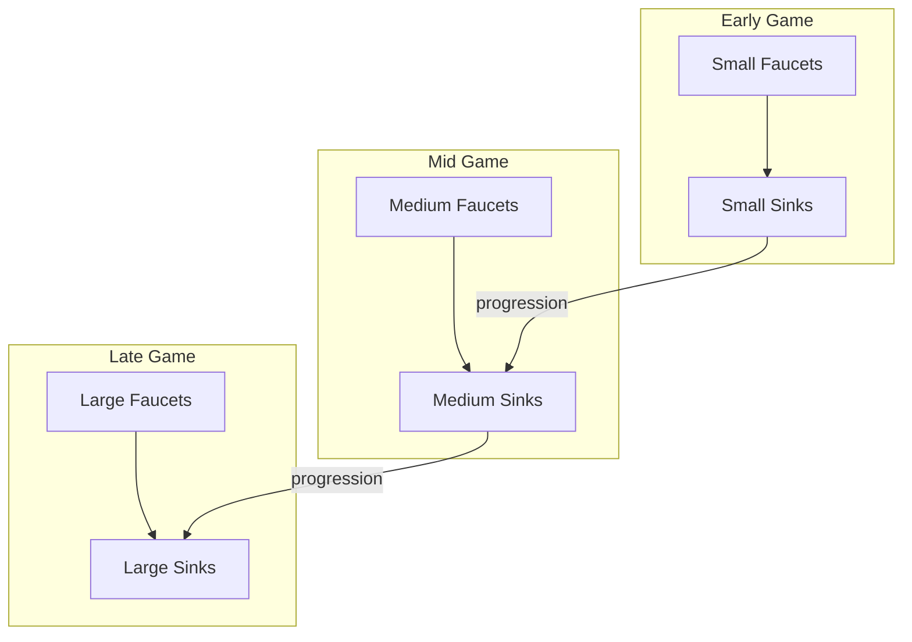
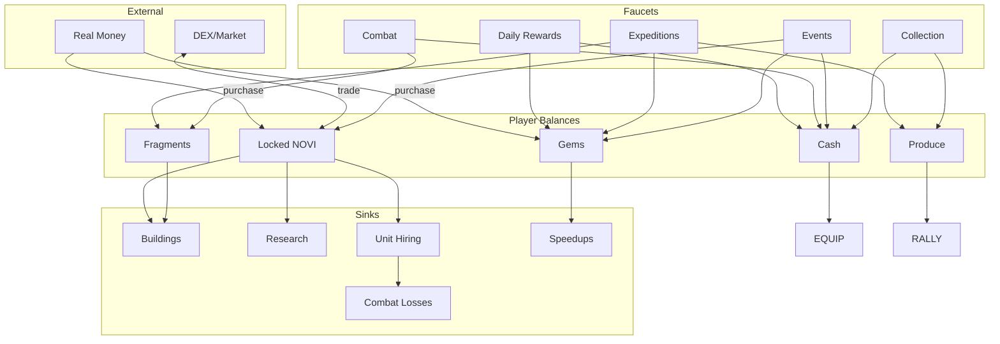

# Resource Flow

> How resources enter, circulate, and exit the Novus Mundus economy.

## Economic Model Overview

Novus Mundus uses a **sink-faucet economy** where resources are continuously created (faucets) and destroyed (sinks). Balance between these determines inflation/deflation.



**Note:** Unit hiring uses locked NOVI, not cash.

## Faucets (Resource Creation)

### Daily Rewards
**Consistency:** Guaranteed daily
**Scale:** Small but reliable



| Day | Gems | Cash | Notes |
|-----|------|------|-------|
| 1 | 100 | 500 | Base rewards |
| 7 | 500 | 2,000 | Week streak |
| 30 | 1,000 | 5,000 | Month streak |

### Expeditions
**Consistency:** Player-controlled
**Scale:** Primary income source



**Expedition Modifiers:**
| Modifier | Effect | Source |
|----------|--------|--------|
| Operative Tier | +50-100% | T2/T3 operatives |
| Time of Day | ±20% | Peak/off-peak hours |
| Hero Affinity | +5-25% | MiningAffinity/FishingAffinity |
| Origin Bonus | +25% | Hero origin matches location |
| Research | +10-50% | Collection research |
| Observatory | +5-20% | Building bonus |
| Perfect Score | +15% | Strike minigame |
| Rare Find | +400% | Lucky roll |

[Source: processor/expedition/claim.rs](../../../programs/novus_mundus/src/processor/expedition/claim.rs)

### Combat Loot
**Consistency:** Variable (PvP/PvE)
**Scale:** Risk-reward based

**PvP Loot Formula:**
```
loot = defender_resources × loot_percentage × (1 + hero_loot_bonus)
loot_percentage = base_rate × (attacker_power / total_power)
```

**Encounter Loot:**
| Encounter Tier | Gems | Fragments | Cash |
|----------------|------|-----------|------|
| Common | 5-20 | 10-30 | 100-500 |
| Uncommon | 20-50 | 30-80 | 500-1,500 |
| Rare | 50-150 | 80-200 | 1,500-5,000 |
| Epic | 150-500 | 200-500 | 5,000-15,000 |

### Events
**Consistency:** Periodic
**Scale:** Large bursts

Events create temporary faucets:
- **Competition prizes** - Top performers get massive rewards
- **Participation rewards** - Everyone who joins gets something
- **Milestone rewards** - Reaching thresholds unlocks bonuses

### Resource Collection
**Consistency:** Cooldown-based
**Scale:** Location dependent



[Source: processor/economy/collect_resources.rs](../../../programs/novus_mundus/src/processor/economy/collect_resources.rs)

---

## Sinks (Resource Destruction)

### Building Costs
**Type:** NOVI, Cash, Time
**Scale:** Increasing per level



Buildings follow φ-based cost scaling:
```
cost(level) = base_cost × φ^(level-1)
```

### Research Costs
**Type:** NOVI, Time
**Scale:** Category dependent

| Category | Base Cost | Time |
|----------|-----------|------|
| Basic | 1,000 | 1 hour |
| Intermediate | 5,000 | 4 hours |
| Advanced | 20,000 | 12 hours |
| Expert | 50,000 | 24 hours |
| Master | 100,000 | 48 hours |

### Unit Hiring
**Type:** Locked NOVI
**Scale:** Tier dependent

| Unit | NOVI Cost | Sink Rate |
|------|-----------|-----------|
| T1 Operative | 100 | High volume |
| T2 Operative | 500 | Medium volume |
| T3 Operative | 2,000 | Low volume |
| Weapons | 200-2,000 | Combat losses |

### Speedups
**Type:** Gems (primary)
**Scale:** Time-based

Speedups are the **primary gem sink**:
```
gem_cost = remaining_minutes × rate × tier_multiplier
```

| Speedup Type | Base Rate | Tier 2 Multiplier |
|--------------|-----------|-------------------|
| Expedition | 100/min | 2x |
| Research | 50/min | 2x |
| Rally | 75/min | 2x |
| Building | 100/min | N/A |

### Combat Losses
**Type:** Units, Equipment
**Scale:** Battle outcome

Combat creates a natural unit sink:
```
casualties = units × casualty_rate × (1 - defense_reduction)
casualty_rate = damage_taken / unit_hp
```

---

## Circulation Mechanics

### Player-to-Player Trading



**Tradeable:**
- Cash (instruction 18)
- NOVI (via SPL transfer)

**Non-tradeable:**
- Gems
- Fragments (bound)
- Experience
- Research progress

### Team Treasury

Teams act as economic pools:


[Source: processor/team/deposit_treasury.rs](../../../programs/novus_mundus/src/processor/team/deposit_treasury.rs)

---

## Economic Balance

### Inflation Control

**Problem:** Too many faucets → currency devaluation
**Solution:** Scale sinks with progression



### Deflation Prevention

**Problem:** Too many sinks → player frustration
**Solution:** Guaranteed minimum income

- Daily rewards always available
- Expedition base yield unaffected by competition
- Collection cooldowns, not competition

### Economic Velocity

Different currencies have different velocities:

| Currency | Velocity | Design Intent |
|----------|----------|---------------|
| Cash | High | Frequent transactions |
| Gems | Medium | Strategic spending |
| NOVI | Low | Value store |
| Fragments | Medium | Crafting cycles |

---

## Flow Visualization

### Complete Economy Flow



---

## Balance Levers

Game designers can tune economy via constants:

| Lever | Location | Effect |
|-------|----------|--------|
| `MINING_GEMS_PER_OP_HOUR` | constants.rs | Gem faucet rate |
| `BUILDING_COST_BASE` | constants.rs | NOVI sink rate |
| `SPEEDUP_GEMS_PER_MINUTE` | speedup.rs | Gem sink rate |
| `DAILY_REWARD_BASE` | constants.rs | Guaranteed income |
| `COMBAT_CASUALTY_RATE` | combat.rs | Unit sink rate |

[Source: constants.rs](../../../programs/novus_mundus/src/constants.rs)

---

Next: [Time Value](./time-value.md) - How time creates economic value
