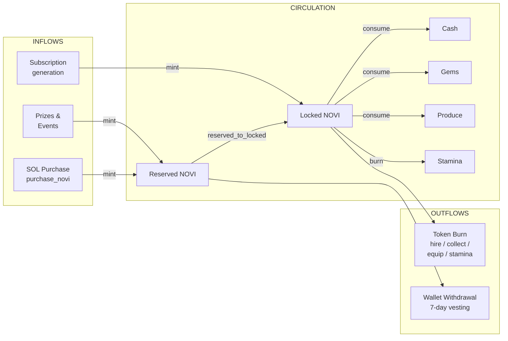
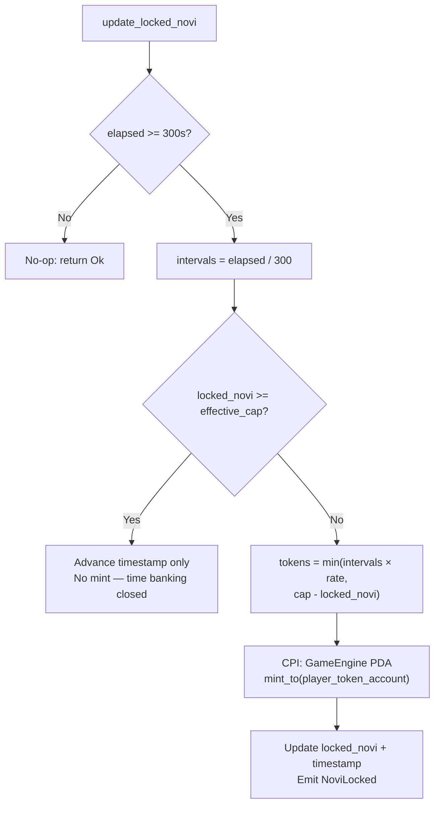
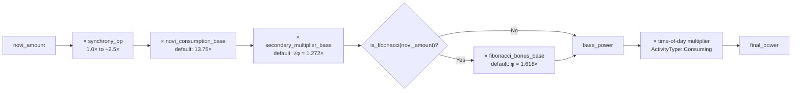
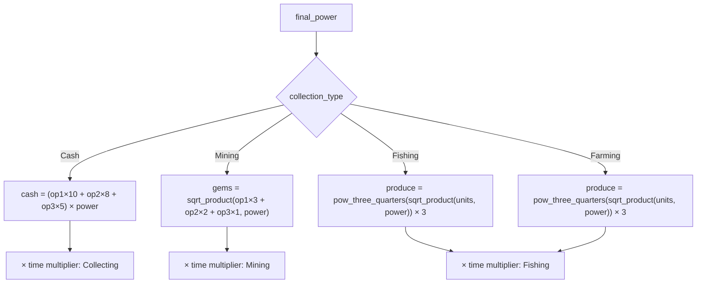
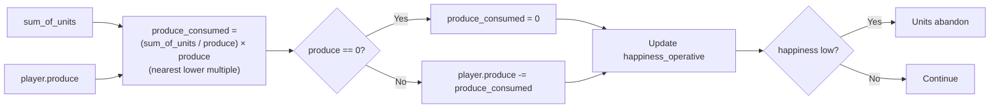
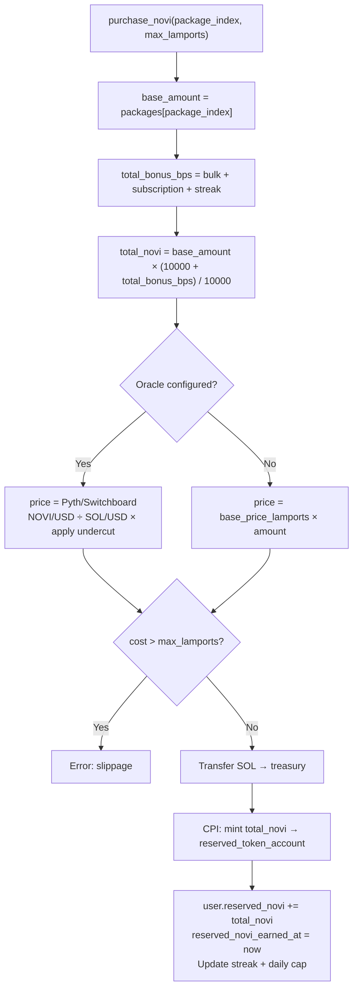
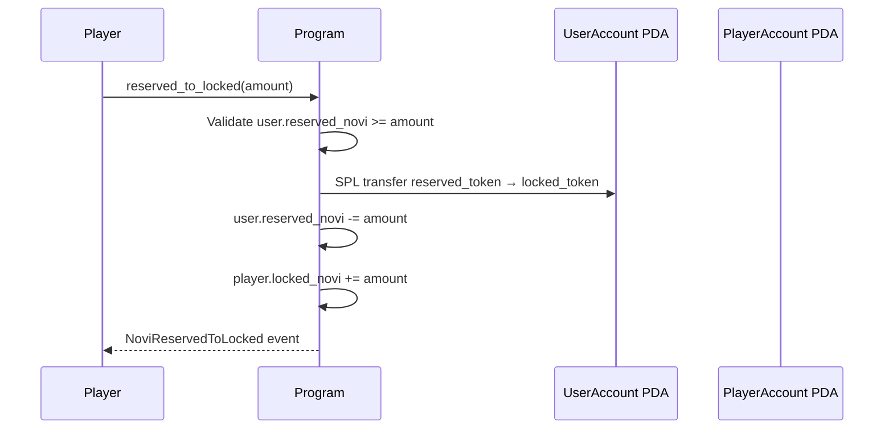
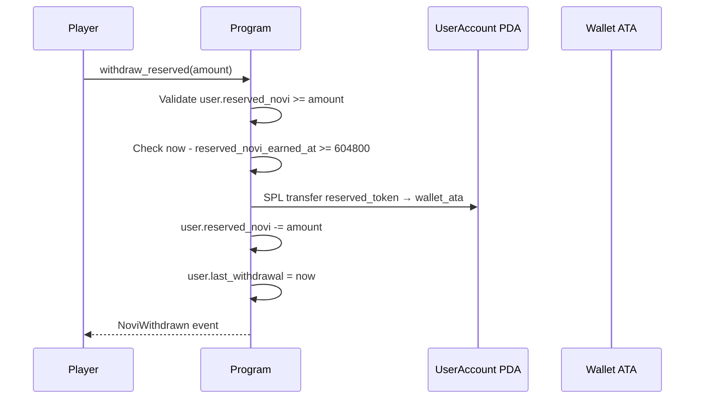
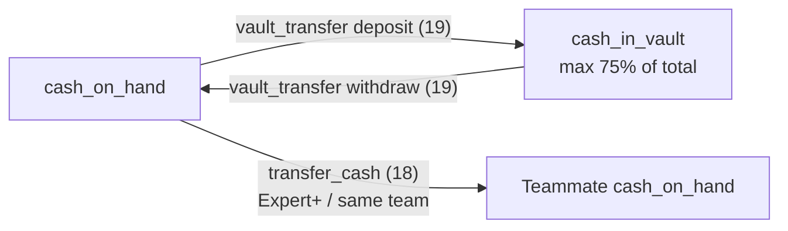

# Resource Flow

> How resources enter, circulate, and exit the Novus Mundus economy.

## Overview

The Novus Mundus economy is a **closed-loop with controlled inflows and outflows**. Locked NOVI is continuously minted at subscription-determined rates and burned through gameplay actions. Reserved NOVI enters via prizes and real-money purchases and exits via wallet withdrawal after vesting. Cash, gems, produce, and stamina circulate purely within the program.



## Generation: Locked NOVI

The primary inflow is **subscription-based token generation** handled by `update_locked_novi` (instruction 10).

### Generation Formula

```
time_interval        = 300 seconds (5 minutes)
intervals_elapsed    = (now - last_updated_tokens_at) / time_interval
tokens_to_generate   = intervals_elapsed × generation_rate
new_locked_novi      = min(locked_novi + tokens_to_generate, effective_cap)
```

The processor updates `last_updated_tokens_at` to `now` even when the cap is already reached. This prevents time from banking up: a player at cap for days cannot instantly refill after spending.



### Generation Rates (default)

| Tier | Rate per 5 min | Fill Time to Base Cap |
|------|----------------|-----------------------|
| 0 Rookie | 50 | 60 intervals = 5 hours |
| 1 Expert | 100 | 60 intervals = 5 hours |
| 2 Epic | 500 | 60 intervals = 5 hours |
| 3 Legendary | 2,500 | 60 intervals = 5 hours |

All tiers fill in 5 hours at their respective rates. The higher tiers earn more per interval and have proportionally larger caps.

If the subscription has expired, tier 0 rates apply (`subscription_end <= now` check in the processor).

## Consumption: Burning Locked NOVI

All gameplay actions that burn locked NOVI share a common pattern:

1. Validate sufficient `player.locked_novi`
2. Deduct from `player.locked_novi` (state mutation)
3. Call `burn_tokens` CPI — the `PlayerAccount` PDA signs (PDA controls the token account)
4. Grant the resource or unit

### NOVI Consumption Formula (`collect_resources`, `hire_units`)

The power generated from burning NOVI is calculated by `consume_novi_logic`:



```
synchrony_bp       = calculate_synchrony(player, config, tiers, now) × 10000
base_mult_bp       = economic_config.novi_consumption_base    // default: 137500 (13.75×)
secondary_mult_bp  = economic_config.secondary_multiplier_base // default: 12720  (√φ = 1.272×)

base_value = chain_bp(novi_amount, [base_mult_bp, secondary_mult_bp, synchrony_bp])

if is_fibonacci(novi_amount):
    fibonacci_bonus_bp = economic_config.fibonacci_bonus_base  // default: 16180 (φ = 1.618×)
    power = apply_bp(base_value, fibonacci_bonus_bp)
else:
    power = base_value
```

`chain_bp` interleaves multiply/divide to stay within `u64` without `u128`.

`is_fibonacci` uses the perfect-square property: `n` is Fibonacci iff `5n² + 4` or `5n² - 4` is a perfect square (computed in `u128` for safety).

After the base power is computed, a **time-of-day multiplier** is applied to the result (see [Time-of-Day](../05-formulas/time-multipliers.md)).

### Synchrony Calculation

Synchrony amplifies NOVI consumption efficiency:

```
synchrony_bp = 10000                                    // 1.0× base
             + subscription_tiers[tier].synchrony_bonus
             + min(avg_happiness × happiness_synchrony_max, happiness_synchrony_max)
             + reputation_synchrony_bonuses[rank]
             + level × level_synchrony_bonus_per_level
```

`avg_happiness = (happiness_defensive + happiness_operative) / 2.0`

Reputation ranks (Novice 0, Skilled 1k, Veteran 5k, Elite 20k, Legendary 100k).

### Resource Output by Collection Type



| Collection Type | Output Currency | Unit Multipliers | Diminishing Returns |
|-----------------|-----------------|------------------|---------------------|
| Cash | `cash_on_hand` | Op1 × 10, Op2 × 8, Op3 × 5, all × power | Linear |
| Mining | `gems` | Op1 × 3, Op2 × 2, Op3 × 1 | `sqrt_product(unit_factor, power)` |
| Fishing | `produce` | Op1 × 5, Op2 × 4, Op3 × 3 | `pow_three_quarters(sqrt_product(...))` × 3 |
| Farming | `produce` | Op1 × 5, Op2 × 4, Op3 × 3 | `pow_three_quarters(sqrt_product(...))` × 3 |

Mining and fishing use integer square-root and `x^0.75` approximations (no `u128`) to implement diminishing returns while preventing overflows.

### Produce Consumption

After each `collect_resources` call, produce is consumed based on total operative units via `consume_produce(sum_of_units, produce)`:

```
produce_consumed = (sum_of_units / produce) * produce
                 // i.e. sum_of_units rounded DOWN to the nearest multiple of produce
                 // returns 0 if produce == 0
player.produce  -= produce_consumed
```

This computes `sum_of_units` floored to the nearest multiple of `produce`. If `produce` is zero the function returns 0 (no consumption, no panic).



If produce falls short, `happiness_operative` declines, which can trigger unit abandonment on the next call.

## Reserved NOVI Flows

### Mint for Prize (`mint_for_prize`, instruction 14)

DAO-only. Mints NOVI to a `UserAccount`'s reserved token account for events, tournaments, marketing, etc. Tracked against per-purpose allocation caps in `MintingConfig`. Sets `reserved_novi_earned_at = now` to start the 7-day vesting clock.

> **Note (Audit M-17):** The per-purpose cap is not atomic across multiple instructions in the same transaction. DAO frontends must issue exactly one `mint_for_prize` per transaction.

### Purchase NOVI (`purchase_novi`, instruction 300)

Players buy NOVI with SOL. Always mints to reserved (never locked). Resets `reserved_novi_earned_at` on every purchase.

**Pricing cascade:**
1. If oracle feeds are configured: use Pyth or Switchboard NOVI/USD ÷ SOL/USD × 10^8 for lamports, then apply `novi_market_undercut_bps` discount (default 15%).
2. If oracle not configured: use `novi_base_price_lamports` (DAO fallback).

When oracle is configured, oracle errors are fatal — no silent fallback. Slippage protection via `max_lamports` parameter.



**Package amounts, bonuses, and daily caps** are stored in `GameEngine.novi_purchase_config`:

| Package | Default Amount |
|---------|---------------|
| 0 | 1,000 NOVI |
| 1 | 10,000 NOVI |
| 2 | 100,000 NOVI |
| 3 | 1,000,000 NOVI |
| 4 | 5,000,000 NOVI |

Bonuses (additive bps, applied to base amount):

| Bonus Type | Applies to |
|------------|-----------|
| Bulk bonus | Per package (default 3%, 5%, 8%, 12%, 15%) |
| Subscription bonus | Rookie 0%, Expert 4%, Epic 8%, Legendary 12% |
| Streak bonus | Days 1–7: 0%, 1%, 2%, 3%, 5%, 7%, 10% (streak resets if a day is skipped) |

Daily cap by subscription tier: 100k, 500k, 1M, 10M NOVI.

### Reserved → Locked (`reserved_to_locked`, instruction 15)

Permanent, one-way SPL transfer. `UserAccount` PDA signs.



This is **not** a burn — it is an SPL `transfer` between two token accounts. The total NOVI supply does not change.

### Withdraw Reserved (`withdraw_reserved`, instruction 16)

SPL transfer from reserved token account to the user's wallet ATA. `UserAccount` PDA signs.



This is **not** a mint — it is an SPL `transfer` of existing tokens. Total supply is unchanged.

## Networth

Networth is recalculated on every `collect_resources` call via `calculate_networth`:

```
networth = Σ(units × unit_value)
         + Σ(weapons × weapon_value)
         + Σ(armor × armor_value)
         + produce × produce_value
         + vehicles × vehicle_value
         + cash_on_hand
         + cash_in_vault
```

**Excluded from networth:** `locked_novi`, `gems`, buildings. Only assets in `EconomicConfig` value tables count.

Unit values use φ-ratio differentiation (melee weapon = base, ranged = ≈φ×, siege = ≈φ²×).

## Cash Transfer and Vault



### Transfer Cash (instruction 18)

Peer-to-peer `cash_on_hand` transfer between team members. The transfer subtracts from sender and adds to receiver — no NOVI involved.

**Transfer limits by tier** (default):

| Tier | Max Daily Amount | Max Daily Count |
|------|-----------------|-----------------|
| 0 Rookie | 0 (disabled) | 0 |
| 1 Expert | 100M | 5 |
| 2 Epic | 500M | 10 |
| 3 Legendary | 2B | 25 |

Vault building can extend these limits:
- Lv 10-14: +100% daily limit
- Lv 15-19: +250% daily limit
- Lv 20+: Unlimited

### Vault Transfer (instruction 19)

Moves cash between `cash_on_hand` and `cash_in_vault`. Requires Vault building.

```
direction 0 (deposit):  cash_on_hand → cash_in_vault
direction 1 (withdraw): cash_in_vault → cash_on_hand
```

Safebox cap: vault can hold at most 75% of total cash (`cash_on_hand + cash_in_vault`).

[Source: processor/economy/](../../../programs/novus_mundus/src/processor/economy/)
[Source: processor/shop/purchase_novi.rs](../../../programs/novus_mundus/src/processor/shop/purchase_novi.rs)
[Source: processor/token/](../../../programs/novus_mundus/src/processor/token/)
[Source: logic/consume.rs](../../../programs/novus_mundus/src/logic/consume.rs)
[Source: logic/calculations.rs](../../../programs/novus_mundus/src/logic/calculations.rs)
[Source: logic/fibonacci.rs](../../../programs/novus_mundus/src/logic/fibonacci.rs)
[Source: logic/safe_math.rs](../../../programs/novus_mundus/src/logic/safe_math.rs)
[Source: state/game_engine.rs](../../../programs/novus_mundus/src/state/game_engine.rs)

---

Next: [Time Value](./time-value.md)
