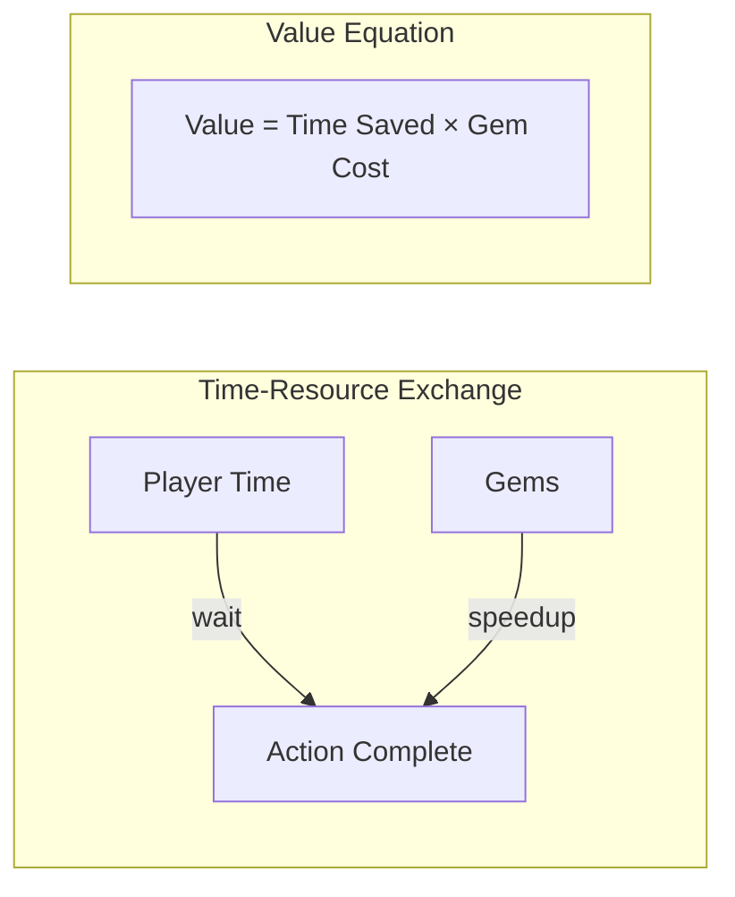
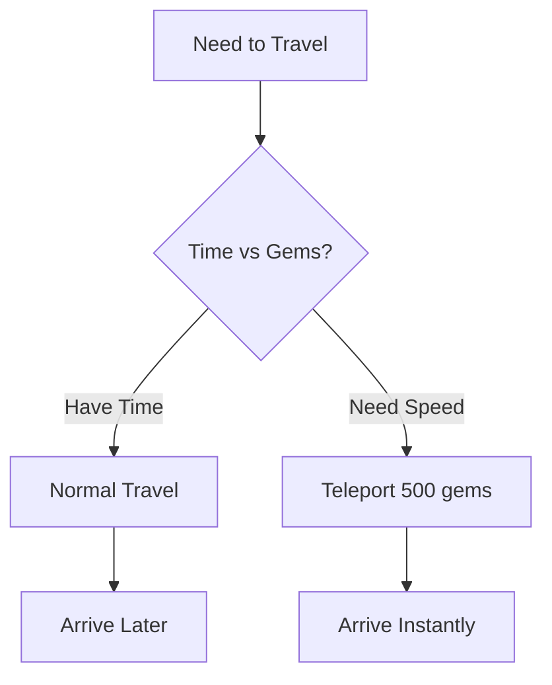
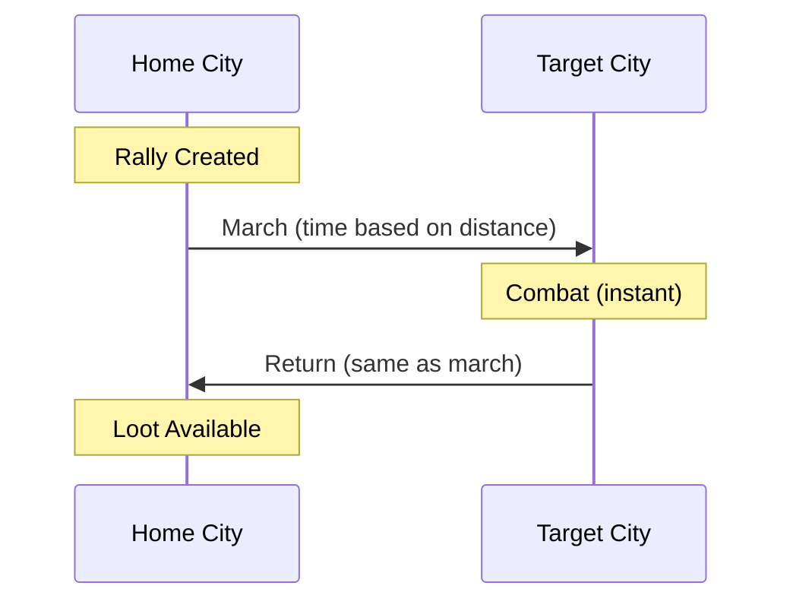
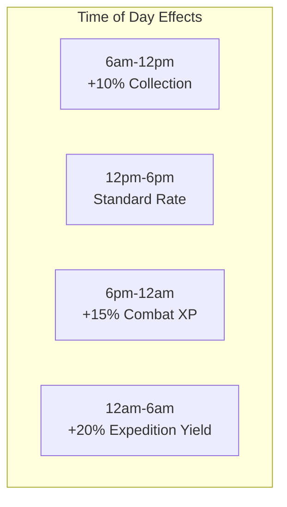
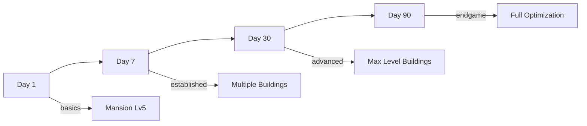

# Time Value

> How time gates create economic value and strategic depth in Novus Mundus.

## Time as Currency

In Novus Mundus, **time is the universal currency**. Every major action involves time:
- Waiting (free but slow)
- Spending gems (fast but costly)

This creates a natural exchange rate between time and premium currency.



## Time-Gated Activities

### Research
**Duration:** 1 hour - 48 hours
**Speedup Cost:** ~50 gems/minute

```mermaid
gantt
    title Research Time by Category
    dateFormat HH:mm
    axisFormat %H

    section Basic
    Research    :00:00, 1h

    section Intermediate
    Research    :00:00, 4h

    section Advanced
    Research    :00:00, 12h

    section Expert
    Research    :00:00, 24h

    section Master
    Research    :00:00, 48h
```



**Time Reduction Sources:**
| Source | Reduction |
|--------|-----------|
| Academy Level 5 | -10% |
| Academy Level 10 | -20% |
| Academy Level 15 | -30% |
| Academy Level 20 | -40% |
| Research Buff | Variable |

### Travel
**Duration:** Distance-based
**Speedup:** Teleport (500 gems)

```
travel_time = distance_km × base_time_per_km × (1 - speed_bonus)
```

| Distance | Normal Time | With Speed Buff |
|----------|-------------|-----------------|
| 100 km | 30 min | 24 min |
| 500 km | 2.5 hours | 2 hours |
| 1000 km | 5 hours | 4 hours |
| 5000 km | 25 hours | 20 hours |

**Teleport Tradeoff:**


### Expeditions
**Duration:** 1 hour - 16 hours
**Speedup Cost:** ~100 gems/minute

| Tier | Duration | Gem Cost to Skip |
|------|----------|------------------|
| 0 | 1 hour | ~3,000 gems |
| 1 | 2 hours | ~6,000 gems |
| 2 | 4 hours | ~12,000 gems |
| 3 | 8 hours | ~24,000 gems |
| 4 | 16 hours | ~48,000 gems |

**Speedup Tiers:**
- Tier 1: 50% reduction, 1x cost
- Tier 2: 75% reduction, 2x cost

### Building Construction
**Duration:** Minutes to days
**No Direct Speedup** (design choice)

Buildings intentionally have no speedup to:
- Create natural pacing
- Prevent pay-to-win perception
- Encourage strategic planning

| Building Level | Time |
|----------------|------|
| 1-5 | 5 min - 2 hours |
| 6-10 | 2 hours - 8 hours |
| 11-15 | 8 hours - 24 hours |
| 16-20 | 24 hours - 72 hours |

### Rallies
**Duration:** March + Combat + Return
**Speedup Cost:** ~75 gems/minute



**Rally Time Breakdown:**
```
total_time = march_time + return_time
march_time = distance × base_rate
return_time = march_time (same distance)
```

---

## Time-of-Day Mechanics

Real-world time affects in-game activities:



**Implementation:**
```
bonus = get_time_of_day_multiplier(timestamp, longitude)
final_yield = base_yield × (1 + bonus)
```

Each city has a longitude that determines local time:
- Collection bonuses during "work hours"
- Combat bonuses during "evening"
- Expedition bonuses during "night" (miners work overnight)

[Source: logic/time.rs](../../../programs/novus_mundus/src/logic/time.rs)

---

## Strategic Time Management

### Parallel Processing

Smart players run multiple timers simultaneously:

```mermaid
gantt
    title Optimal Parallel Activities
    dateFormat HH:mm
    axisFormat %H:%M

    section Research
    Advanced Research :08:00, 12h

    section Expedition 1
    Mining T2    :08:00, 2h
    Mining T2    :10:00, 2h
    Mining T2    :12:00, 2h

    section Expedition 2
    Fishing T2   :08:00, 2h
    Fishing T2   :10:00, 2h
    Fishing T2   :12:00, 2h

    section Building
    Upgrade Mansion :08:00, 8h
```



### Session Alignment

Aligning timers to play sessions maximizes efficiency:

**Casual Player (2 sessions/day):**
- Morning: Start 8-hour activities
- Evening: Claim and restart

**Active Player (4+ sessions/day):**
- Shorter expeditions (2-4 hour)
- More frequent claims
- Higher total yield

### Speedup Efficiency

When to speedup vs wait:

| Scenario | Recommendation |
|----------|----------------|
| 5 minutes remaining | Wait |
| 2 hours remaining, going to sleep | Consider speedup |
| Blocking other activities | Speedup |
| Just impatient | Wait (save gems) |

**Optimal Speedup Timing:**
```
efficiency = time_saved / gem_cost
```

Speedup early in long timers = poor efficiency
Speedup near completion = good efficiency (if any)

---

## Time as Progression Gate

Time gates serve multiple design purposes:

### 1. Natural Pacing


### 2. Preventing Burnout
- Can't "finish" in one session
- Encourages daily return
- Spreads engagement over time

### 3. Monetization without P2W
- Time = Free path
- Gems = Accelerated path
- Same destination, different speed

### 4. Strategic Depth
- What to prioritize?
- When to speedup?
- How to parallelize?

---

## Cooldown Systems

Beyond timers, cooldowns limit action frequency:

### Collection Cooldowns
| Location | Cooldown |
|----------|----------|
| City Center | 4 hours |
| Mine | 2 hours |
| Farm | 2 hours |
| Market | 6 hours |

### Combat Cooldowns
| Action | Cooldown |
|--------|----------|
| Attack same player | 1 hour |
| Attack same encounter | None (if alive) |
| Rally participation | 30 minutes after return |

### Daily Limits
| Action | Limit |
|--------|-------|
| Daily reward claim | 1 per 24h |
| Free teleport | 0 (always costs) |
| Event entry | 1 per event |

---

## Time Constants Reference

Key time-related constants in the codebase:

| Constant | Value | Location |
|----------|-------|----------|
| `SECONDS_PER_HOUR` | 3600 | constants.rs |
| `MINING_DURATION_HOURS` | [1,2,4,8,16] | constants.rs |
| `FISHING_DURATION_HOURS` | [1,2,4,8,16] | constants.rs |
| `COLLECTION_COOLDOWN` | 7200 (2h) | constants.rs |
| `TRAVEL_BASE_SECONDS_PER_KM` | 18 | constants.rs |

[Source: constants.rs](../../../programs/novus_mundus/src/constants.rs)

---

## Client Integration

### Displaying Timers

```javascript
function formatTimeRemaining(endTime) {
  const now = Date.now() / 1000;
  const remaining = Math.max(0, endTime - now);

  const hours = Math.floor(remaining / 3600);
  const minutes = Math.floor((remaining % 3600) / 60);
  const seconds = Math.floor(remaining % 60);

  return `${hours}h ${minutes}m ${seconds}s`;
}
```

### Speedup Cost Preview

```javascript
function calculateSpeedupCost(remainingSeconds, ratePerMinute, tierMultiplier) {
  const remainingMinutes = Math.ceil(remainingSeconds / 60);
  return remainingMinutes * ratePerMinute * tierMultiplier;
}

// Example: Expedition speedup
const cost = calculateSpeedupCost(7200, 100, 1); // 2 hours = 12,000 gems
```

### Timer Synchronization

Always use on-chain timestamp:
```javascript
const clock = await connection.getAccountInfo(SYSVAR_CLOCK_PUBKEY);
const onChainTime = clock.data.readBigInt64LE(32); // unix_timestamp offset
```

---

*Time is the great equalizer in Novus Mundus. Everyone gets the same 24 hours - success comes from using them wisely.*

---

Next: [Systems - Combat](../04-systems/combat.md)
