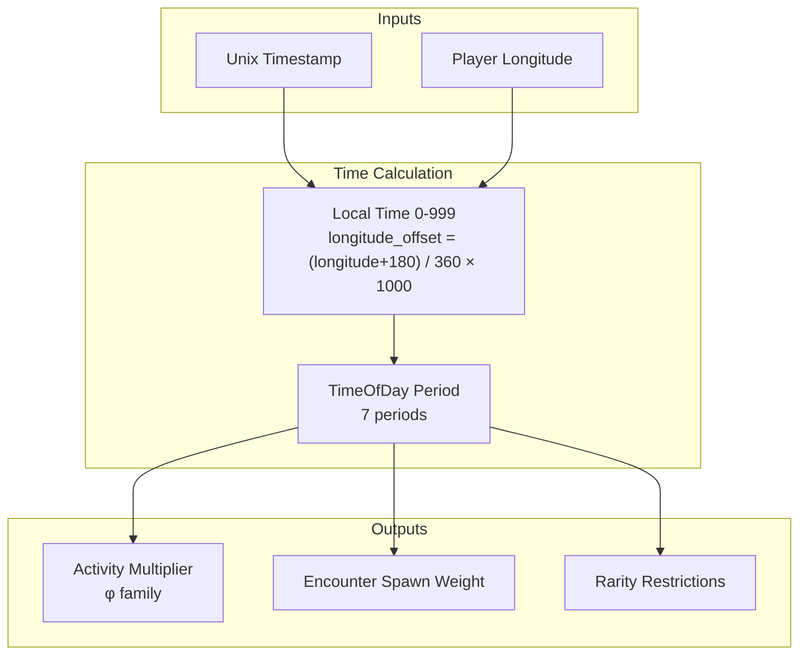
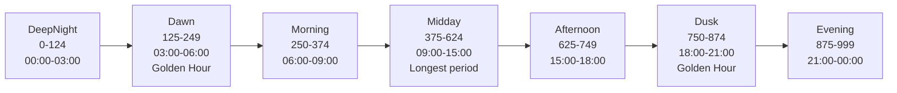
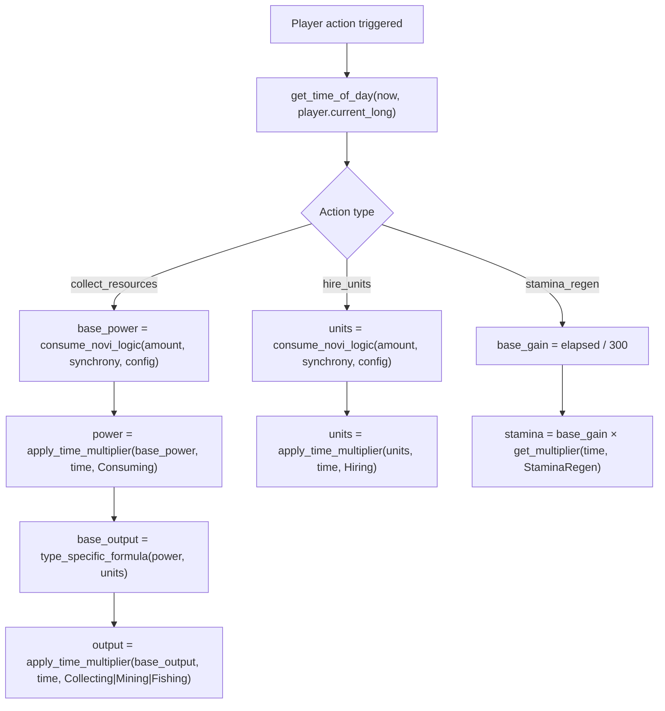
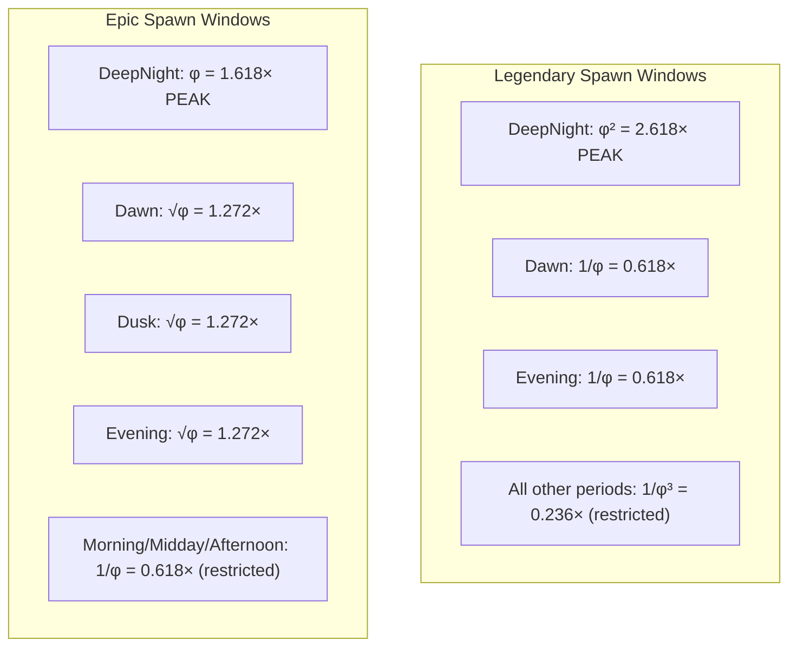
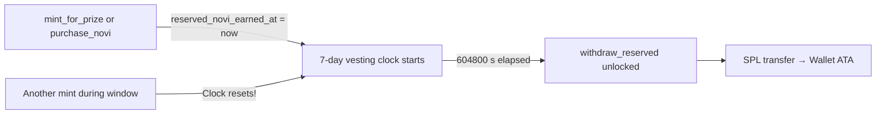

# Time Value

> How time-of-day and time-gated mechanics create strategic depth across the economy.

## Overview

Every economically significant action in Novus Mundus is modified by **when** it happens, **where** the player is located, and **how long** they wait. The time system is fully deterministic — the same timestamp and longitude always produce the same result.



## Local Time Calculation

```
cycle_position   = timestamp mod 86400          // position in current day (0..86399)
global_time      = (cycle_position × 1000) / 86400   // normalized to 0..999
longitude_offset = ((longitude + 180.0) / 360.0) × 1000  // -500 to +500

local_time       = (global_time + longitude_offset) mod 1000
```

Eastern longitudes see dawn earlier (higher offset). A player at longitude 180° is exactly 12 hours (500 units) ahead of UTC.

## Seven Time Periods



| Period | Local Time Range | Real Clock (approx) | Type |
|--------|-----------------|---------------------|------|
| DeepNight | 0-124 | 00:00-03:00 | Night |
| Dawn | 125-249 | 03:00-06:00 | Golden Hour |
| Morning | 250-374 | 06:00-09:00 | Day |
| Midday | 375-624 | 09:00-15:00 | Peak Day (longest) |
| Afternoon | 625-749 | 15:00-18:00 | Day |
| Dusk | 750-874 | 18:00-21:00 | Golden Hour |
| Evening | 875-999 | 21:00-00:00 | Night |

**Dawn** and **Dusk** are the golden hours — transitions between night and day where the φ² (2.618×) multiplier applies to rare encounter spawns.

## Activity Multipliers

All multipliers are drawn from the golden ratio family: φ = 1.618034, √φ = 1.272020, 1/φ = 0.618034, 1/φ² = 0.381966, 1/φ³ = 0.236068.

### Complete 12-Activity × 7-Period Table

The multiplier returned by `get_time_multiplier(time, activity)`:

| Activity | DeepNight | Dawn | Morning | Midday | Afternoon | Dusk | Evening |
|----------|-----------|------|---------|--------|-----------|------|---------|
| **Hiring** (0) | 1/φ (0.618) | 1.0 | √φ (1.272) | φ (1.618) | √φ (1.272) | 1.0 | 1/φ (0.618) |
| **Purchasing** (1) | 1/φ (0.618) | 1.0 | √φ (1.272) | φ (1.618) | √φ (1.272) | 1.0 | 1/φ (0.618) |
| **Collecting** (2) | 1/φ (0.618) | 1.0 | 1.0 | 1.0 | 1.0 | 1.0 | 1/φ (0.618) |
| **Mining** (3) | φ (1.618) | 1.0 | 1.0 | 1.0 | 1.0 | 1.0 | 1.0 |
| **Fishing** (4) | 1.0 | φ (1.618) | 1.0 | 1.0 | 1.0 | 1.0 | 1.0 |
| **Attacking** (5) | φ (1.618) | √φ (1.272) | 1.0 | 1.0 | 1.0 | 1.0 | 1.0 |
| **Defending** (6) | 1/φ (0.618) | 1.0 | √φ (1.272) | φ (1.618) | √φ (1.272) | 1.0 | 1.0 |
| **Traveling** (7) | φ (1.618) | √φ (1.272) | 1/φ (0.618) | 1.0 | 1/φ (0.618) | 1.0 | 1.0 |
| **Consuming** (11) | 1/φ (0.618) | √φ (1.272) | 1.0 | 1.0 | 1.0 | 1.0 | 1/φ (0.618) |
| **Researching** (12) | φ (1.618) | √φ (1.272) | √φ (1.272) | 1/φ (0.618) | 1/φ (0.618) | 1.0 | 1.0 |
| **XPGain** (13) | √φ (1.272) | 1.0 | 1.0 | 1.0 | 1.0 | 1.0 | √φ (1.272) |
| **StaminaRegen** (14) | φ (1.618) | √φ (1.272) | 1.0 | 1/φ (0.618) | 1/φ (0.618) | 1.0 | 1.0 |
| **LootDrop** (15) | √φ (1.272) | 1.0 | φ (1.618) | 1.0 | 1.0 | 1.0 | √φ (1.272) |

> **Note:** `ActivityType` enum discriminants are not contiguous: Consuming = 11, Researching = 12, XPGain = 13, StaminaRegen = 14, LootDrop = 15. Variants 8, 9, 10 are absent.

> **Code Inconsistency:** The test in `time_cycle.rs` (line 420) asserts `Collecting` at `Dawn` returns `PHI_SQUARED` (2.618×), asserting a "golden hour" cash bonus. The actual `get_time_multiplier` implementation for `ActivityType::Collecting` does **not** implement this — `Dawn` falls through to the wildcard `_` arm returning `1.0`. The table above reflects the actual code behavior, not the test comment. The test fails on this assertion, indicating a planned feature not yet implemented.

> **Code Inconsistency:** The comment on `Researching` for `Morning` reads `"1.0x - Normal study"` but the actual code returns `GOLDEN_ROOT` (1.272×). The table above reflects the actual code value.

> **Code Inconsistency:** The comment on `LootDrop` for `Morning` reads `"1.0x - Normal drops"` but the actual code returns `PHI` (1.618×). The table above reflects the actual code value.

[Source: logic/time_cycle.rs](../../../programs/novus_mundus/src/logic/time_cycle.rs)

## How Multipliers Are Applied



### NOVI Consumption (collect_resources, hire_units)

```
base_power       = consume_novi_logic(novi_amount, synchrony, economic_config)
time_of_day      = get_time_of_day(now, player.current_long)
final_power      = apply_time_multiplier(base_power, time_of_day, ActivityType::Consuming)
```

The consuming multiplier applies *before* collection type multipliers.

### Collection Output

```
base_output           = <type-specific calculation using final_power>
time_activity         = Collecting | Mining | Fishing (by collection_type)
time_adjusted_output  = apply_time_multiplier(base_output, time_of_day, time_activity)
```

Both the NOVI→power conversion and the output are separately time-modified.

### Stamina Regeneration

```
intervals           = elapsed / STAMINA_REGEN_INTERVAL
base_gain           = intervals
regen_multiplier    = get_time_multiplier(time_of_day, ActivityType::StaminaRegen)
time_stamina        = base_gain × regen_multiplier   // f64 → u64
```

### XP Gain

```
xp_multiplier  = get_time_multiplier(time_of_day, ActivityType::XPGain)
time_xp        = base_xp × xp_multiplier
```

## Encounter Spawn Timing

Rarity spawn weights also use the φ family. Note that **Dusk** and **Dawn** are not symmetric for all rarities:



| Rarity | DeepNight | Dawn | Morning | Midday | Afternoon | Dusk | Evening |
|--------|-----------|------|---------|--------|-----------|------|---------|
| Common (0) | 1/φ (0.618) | 1.0 | 1.0 | √φ (1.272) | 1.0 | 1.0 | 1.0 |
| Uncommon (1) | 1/φ (0.618) | 1.0 | φ (1.618) | √φ (1.272) | φ (1.618) | 1.0 | 1/φ (0.618) |
| Rare (2) | √φ (1.272) | φ² (2.618) | 1.0 | 1/φ (0.618) | 1.0 | φ² (2.618) | 1.0 |
| Epic (3) | φ (1.618) | √φ (1.272) | 1/φ (0.618) | 1/φ² (0.382) | 1/φ (0.618) | √φ (1.272) | √φ (1.272) |
| Legendary (4) | φ² (2.618) | 1/φ (0.618) | 1/φ³ (0.236) | 1/φ³ (0.236) | 1/φ³ (0.236) | 1/φ³ (0.236) | 1/φ (0.618) |

> **Dusk ≠ Dawn for Legendary:** Legendary spawn weight at Dusk is 1/φ³ (0.236), the same low weight as Morning/Midday/Afternoon — it does **not** share Dawn's 1/φ (0.618) value. Dawn and Dusk are only symmetric for Rare spawns.

Legendary spawns are **restricted** to DeepNight, Dawn, or Evening only (`can_spawn_rarity_at_time`). Epic spawns require DeepNight, Evening, Dawn, or Dusk.

## Vesting Time Gate

Reserved NOVI cannot be withdrawn until 7 days after earning:

```
RESERVED_NOVI_VESTING_PERIOD = 604800 seconds
```

Every `mint_for_prize` or `purchase_novi` resets `UserAccount.reserved_novi_earned_at` to `now`, restarting the window. This prevents instant arbitrage after prize events.



## Generation Interval Gate

Locked NOVI generates at discrete 300-second (5-minute) intervals:

```
intervals_elapsed   = (now - last_updated_tokens_at) / 300
tokens_to_generate  = intervals_elapsed × generation_rate
```

Fractional intervals are dropped (integer division). A player who triggers `update_locked_novi` at 4:59 gets 0 intervals, not 0.99.

[Source: logic/time_cycle.rs](../../../programs/novus_mundus/src/logic/time_cycle.rs)
[Source: logic/stamina.rs](../../../programs/novus_mundus/src/logic/stamina.rs)
[Source: logic/progression.rs](../../../programs/novus_mundus/src/logic/progression.rs)
[Source: processor/economy/update_locked_novi.rs](../../../programs/novus_mundus/src/processor/economy/update_locked_novi.rs)
[Source: constants.rs](../../../programs/novus_mundus/src/constants.rs)

---

Next: [Combat](../04-systems/combat.md)
