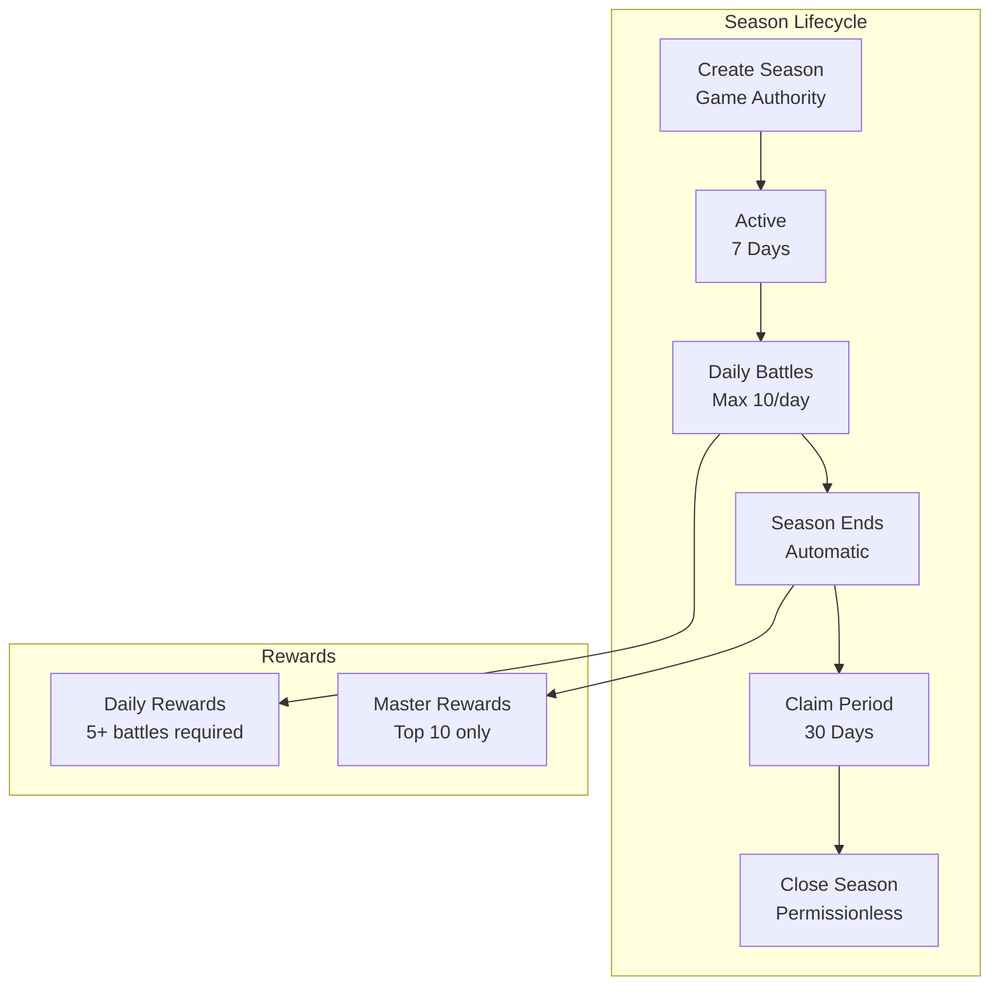
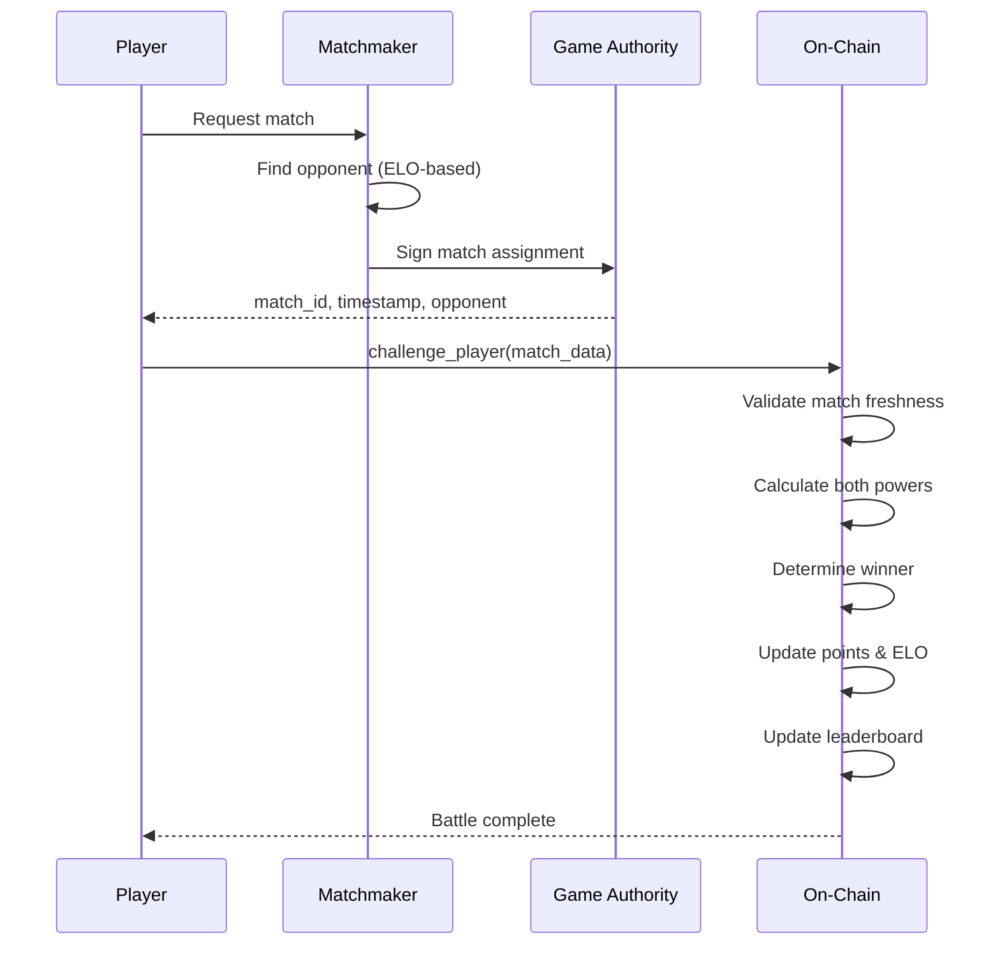
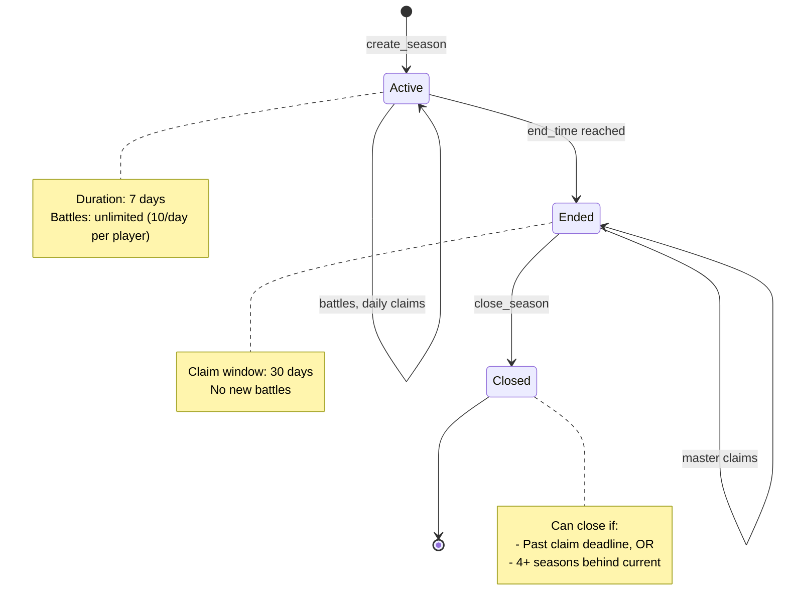

# Arena PvP System

> Weekly competitive battles for glory and NOVI rewards - without losing your troops.

## Arena Overview

The Arena is a **non-lethal** PvP mode where players compete in weekly city-based seasons. Unlike regular combat, arena battles never destroy assets - it's purely a test of strategic loadout optimization and accumulated power.



## Key Principles

| Principle | Description |
|-----------|-------------|
| **Non-Lethal** | Units, weapons, armor never consumed or destroyed |
| **Per-City** | Each city has independent seasons and leaderboards |
| **Trusted Loadouts** | No validation against assets (arena is isolated) |
| **Permissionless Claims** | Anyone can trigger reward distribution |
| **Deterministic** | Same power = same outcome, no randomness |

---

## Battle Flow



### Why Off-Chain Matchmaking?

The `game_authority` must co-sign every battle to prevent:
- **Collusion**: Two players farming points off each other
- **Target Selection**: Always picking weak opponents
- **Sybil Attacks**: Fighting your own alt accounts
- **Win Trading**: Coordinated point manipulation

On-chain still validates:
- Match freshness (5 minute expiry)
- Opponent cooldown (max 2 battles vs same player per day)
- Daily limit (max 10 battles per day)

---

## Power Calculation

Arena power is computed at battle time from your loadout plus all accumulated buffs.

### Base Power Formula

```
base_power = unit_power + equipment_power

unit_power = (tier1_units × 10) + (tier2_units × 25) + (tier3_units × 60)

equipment_power = (melee × 10) + (ranged × 16) + (siege × 26) + (armor × 5)
```

### Power Values

| Asset Type | Power per Unit |
|------------|---------------|
| Tier 1 Defensive Unit | 10 |
| Tier 2 Defensive Unit | 25 |
| Tier 3 Defensive Unit | 60 |
| Melee Weapon | 10 |
| Ranged Weapon | 16 |
| Siege Weapon | 26 |
| Armor Piece | 5 |

*Note: Ranged and siege follow phi ratio (1.618) scaling*

### Buff Multiplier

```
total_power = base_power × (1 + total_bonus_bps / 10000)
```

**Buff Sources:**

| Source | Buffs Applied |
|--------|--------------|
| Research | `attack_bps + defense_bps` |
| Active Heroes | `attack_bps + defense_bps + weapon_efficiency + armor_efficiency` |
| Location Synergy | Heroes at home city bonus |
| Sanctuary Blessing | `blessed_hero_bonus_bps` (24h buff) |
| Equipped Items | `weapon_bonus + armor_bonus` |
| Arena Hero | Direct NFT buff read |
| Estate Buildings | `attack + defense + pvp_damage + unit_effectiveness + arena_damage` |

---

## Points System

### Battle Points

| Outcome | Challenger Points | Defender Points |
|---------|------------------|-----------------|
| Challenger Wins | 100 + underdog bonus | 20 |
| Defender Wins | 20 | 100 + underdog bonus |
| Draw | 50 | 50 |

### Underdog Bonus

Beating a stronger opponent rewards bonus points:

```
if winner_power < loser_power:
    disadvantage_ratio = (loser_power - winner_power) / loser_power
    disadvantage_bps = min(disadvantage_ratio × 10000, 5000)  # Cap at 50%
    bonus = base_points × disadvantage_bps × 0.05 / 10000
    total_points = base_points + bonus
```

**Example:**
- You have 8,000 power, opponent has 10,000 power
- Disadvantage = 20% → 2000 bps
- Bonus = 100 × 2000 × 0.05 / 10000 = 1 point
- Total = 101 points for the upset victory

### Leaderboard

- **Minimum Entry**: 500 total points required
- **Size**: Top 10 players only
- **Sorting**: By total_points descending
- **Updates**: After every battle for both participants

---

## ELO Rating System

ELO tracks skill independent of raw power. Used for matchmaking, not rewards.

### Starting Values
- New participants: **1000 ELO**
- Floor: **100 ELO** (minimum)
- K-Factor: **32** (rating volatility)

### ELO Update Formula

```
expected_score = 1 / (1 + 10^((opponent_elo - your_elo) / 400))

actual_score = 1.0 (win), 0.5 (draw), 0.0 (loss)

new_elo = old_elo + K × (actual_score - expected_score)
```

### ELO Probability Table

| Your ELO vs Opponent | Your Win Probability |
|---------------------|---------------------|
| +0 (equal) | 50% |
| +100 | 64% |
| +200 | 76% |
| +300 | 85% |
| +400 | 91% |
| -100 | 36% |
| -200 | 24% |
| -300 | 15% |
| -400 | 9% |

---

## Daily Rewards

### Requirements
- **Minimum Battles**: 5 in rolling 24-hour window
- **Season Status**: Must be Active

### Calculation

```
battle_multiplier = battles_today / 10  # 5 battles = 0.5x, 10 = 1.0x

win_rate = season_wins / (season_wins + season_losses)
win_bonus = max(0, (win_rate - 0.5) × 10000)  # 0-5000 bps bonus

reward = BASE_REWARD × battle_multiplier × (1 + win_bonus / 10000)
```

**Base Reward**: 100 NOVI (before multipliers)

### Reward Examples

| Battles | Season Record | Win Rate | Reward |
|---------|--------------|----------|--------|
| 5 | 10W-10L | 50% | 50 NOVI |
| 10 | 10W-10L | 50% | 100 NOVI |
| 10 | 14W-6L | 70% | 120 NOVI |
| 10 | 18W-2L | 90% | 140 NOVI |

*Note: Rewards capped by daily distribution cap and remaining pool*

---

## Master Rewards

Top 10 leaderboard players claim master rewards after season ends.

### Prize Distribution

| Rank | Share |
|------|-------|
| 1st | 40% |
| 2nd | 20% |
| 3rd | 13% |
| 4th | 9% |
| 5th | 6% |
| 6th | 4% |
| 7th | 3% |
| 8th | 2% |
| 9th | 2% |
| 10th | 1% |

### Example Pool (10,000 NOVI)

| Rank | NOVI Reward |
|------|-------------|
| 1st | 4,000 |
| 2nd | 2,000 |
| 3rd | 1,300 |
| 4th | 900 |
| 5th | 600 |
| 6th | 400 |
| 7th | 300 |
| 8th | 200 |
| 9th | 200 |
| 10th | 100 |

### Claim Window
- **Start**: When season ends (after 7 days)
- **Deadline**: 30 days after season end
- **After Deadline**: Unclaimed rewards remain in closed account until close_season

---

## Anti-Exploit Mechanisms

### Rolling Time Windows

All limits use **rolling 24-hour windows**, not UTC day boundaries:

```
is_within_window = (now - battle_timestamp) < 86400
```

This prevents timezone exploitation.

### Battle Limits

| Limit | Value | Window |
|-------|-------|--------|
| Total battles | 10 max | Rolling 24h |
| Same opponent | 2 max | Rolling 24h |
| Match expiry | 5 minutes | From assignment |

### Match Replay Prevention

```
require!(new_match_id > participant.last_match_id)
```

Match IDs are monotonically increasing. Once used, cannot be replayed.

### Sybil Resistance

- **500 point minimum** for leaderboard entry
- At 100 points per win, need ~5 wins minimum
- Combined with opponent diversity, makes multi-accounting expensive

---

## Season Lifecycle



### Timing Constants

| Phase | Duration |
|-------|----------|
| Active Season | 7 days |
| Claim Deadline | 30 days after end |
| Auto-Close Threshold | 4 seasons behind |

---

## City Integration

Each city tracks its own `arena_season_id`:

```
CityAccount {
    arena_season_id: u32,  // Incremented on create_season
    ...
}
```

**Why Per-City?**
- Local competition within geographic regions
- Different prize pools per city
- Parallel seasons across cities
- City-specific leaderboards

---

## Loadout Strategy

Since loadouts aren't validated against actual assets, optimization focuses on:

1. **Maximize Base Power**: Stack highest power-per-unit assets
2. **Buff Synergy**: Research + heroes + estate all compound
3. **Hero Selection**: Arena-specific hero can differ from active heroes
4. **Estate Investment**: Arena building provides dedicated buff

### Power Efficiency

| Asset | Power | Cost (typical) | Efficiency |
|-------|-------|----------------|------------|
| T3 Unit | 60 | High | Best for whales |
| T2 Unit | 25 | Medium | Good balance |
| Siege Weapon | 26 | Medium | High efficiency |
| Ranged Weapon | 16 | Low | Budget option |

---

## Reward Mechanics

### NOVI Token Minting

Both daily and master rewards mint fresh NOVI tokens:

```
1. Calculate reward amount
2. Mint NOVI to player's token account (GameEngine is mint authority)
3. Update player.locked_novi balance
```

**Locked NOVI**: Rewards are added to `locked_novi` which requires unlock period before withdrawal.

### Permissionless Claims

Anyone can trigger claims for any player:

```
Accounts required:
- participant_account (identifies player)
- player_account (receives locked_novi)
- player_owner (for PDA validation)
- player_novi_ata (receives minted tokens)
- novi_mint
- game_engine (mint authority)
- token_program
```

This enables:
- Backend automation of claims
- Gas-less claiming for players
- No missed deadlines due to inactivity

---

## Summary

| Feature | Value |
|---------|-------|
| Season Duration | 7 days |
| Battles per Day | 10 max |
| Daily Reward Requirement | 5+ battles |
| Leaderboard Size | Top 10 |
| Leaderboard Minimum | 500 points |
| Base Win Points | 100 |
| Base Loss Points | 20 |
| Starting ELO | 1000 |
| ELO K-Factor | 32 |
| Claim Deadline | 30 days |
| Auto-Close Threshold | 4 seasons |
