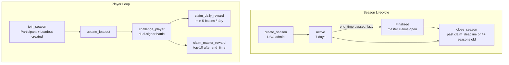
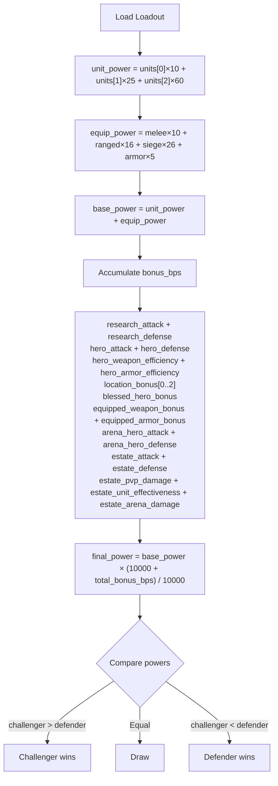
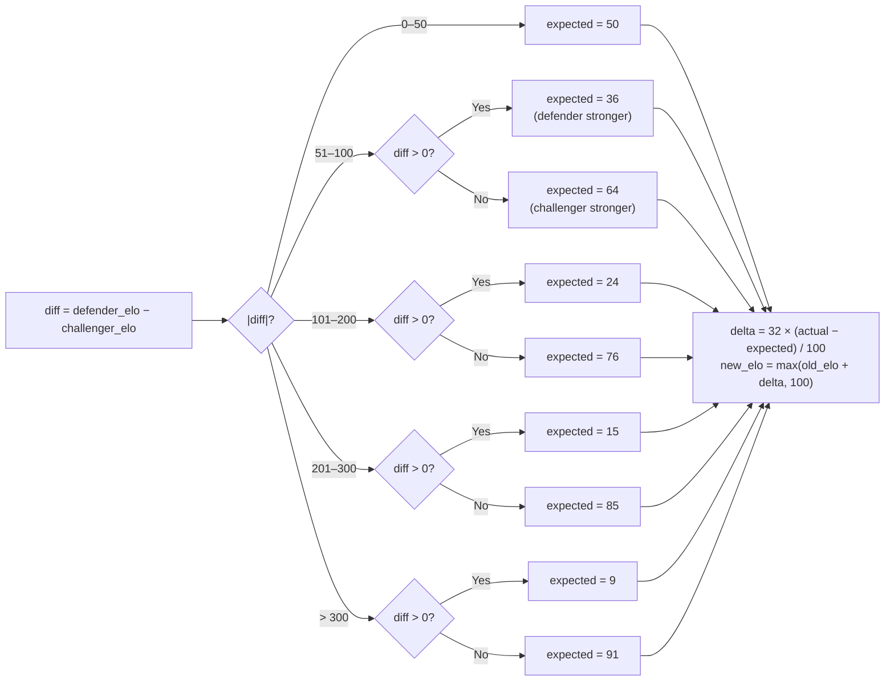
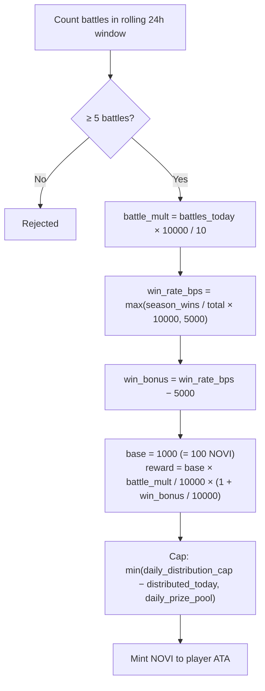
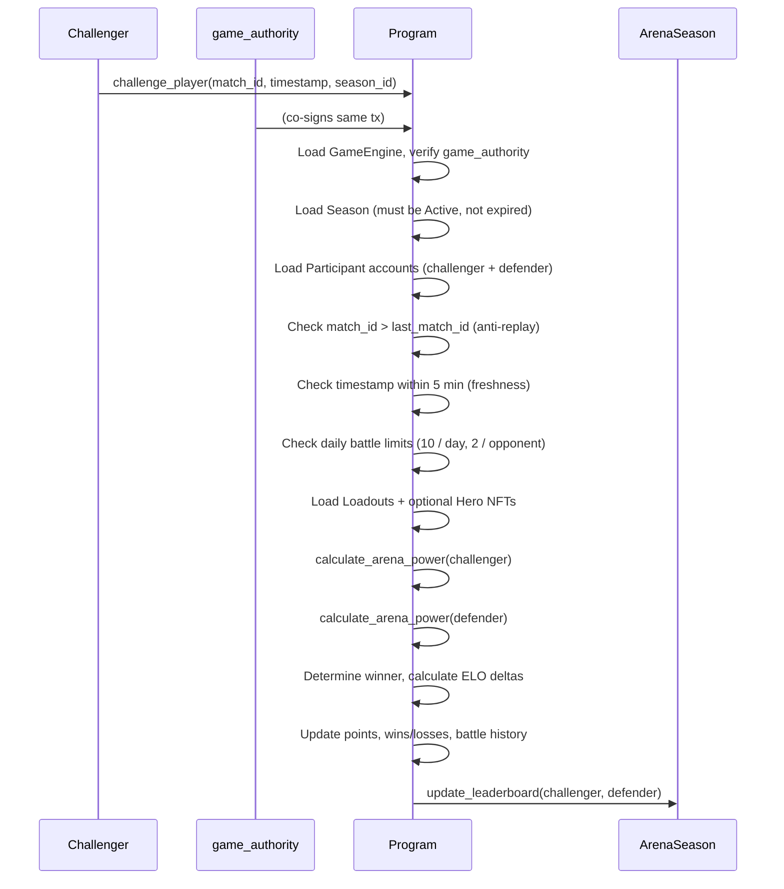

# Arena System

> Seasonal kingdom-scoped PvP — ELO-rated 1v1 combat with daily participation rewards and a top-10 master prize pool.

## System Overview

The Arena is a **non-lethal** competitive PvP mode. Battles are resolved entirely on-chain in a single transaction using a pre-committed loadout snapshot; no units are lost permanently. Matchmaking is off-chain and validated by `game_authority` co-signature. Each kingdom runs its own independent seasons.



## Instructions

| ID  | Instruction | Signers | Accounts | Data (bytes) | Description |
|-----|-------------|---------|----------|--------------|-------------|
| 230 | `create_season` | authority | 4 | 29 | DAO creates a new arena season |
| 231 | `join_season` | player_authority | 6 | 4 | Player joins; creates Participant + Loadout |
| 232 | `update_loadout` | player_authority | 2 | 88 | Update army/equipment/hero configuration |
| 233 | `challenge_player` | challenger_authority, game_authority | 14 | 20 | Execute a ranked battle |
| 234 | `claim_daily_reward` | — (permissionless) | 8 | 4 | Claim daily NOVI reward |
| 235 | `claim_master_reward` | — (permissionless) | 8 | 4 | Top-10 player claims season master reward |
| 236 | `close_season` | — (permissionless) | 3 | 6 | Reclaim rent from expired season account |

[Source: processor/arena/](../../../programs/novus_mundus/src/processor/arena/)

---

## Accounts

### ArenaSeasonAccount — 608 bytes

**PDA:** `["arena_season", game_engine, season_id:u32 LE]`

```rust
pub struct ArenaSeasonAccount {
    pub account_key:               u8,         // AccountKey::ArenaSeason
    pub game_engine:               Address,    // 32 — kingdom
    pub season_id:                 u32,
    pub city_id:                   u16,        // 0 = kingdom-wide
    pub authority:                 Address,    // 32 — receives rent on close
    pub start_time:                i64,
    pub end_time:                  i64,        // start + 7 days
    pub claim_deadline:            i64,        // end + 30 days
    pub status:                    u8,         // ArenaStatus enum
    pub leaderboard:               [ArenaLeaderboardEntry; 10], // 400
    pub leaderboard_count:         u8,
    pub leaderboard_claimed:       [bool; 10],
    pub master_prize_pool:         u64,
    pub daily_prize_pool:          u64,
    pub daily_distribution_cap:    u64,
    pub distributed_today:         u64,
    pub last_distribution_day:     u32,
    pub _padding1:                 [u8; 4],
    pub prize_remaining:           u64,
    pub min_level_required:        u8,
    pub _padding2:                 [u8; 7],
    pub min_points_for_leaderboard: u64,       // default 500
    pub total_battles:             u64,
    pub bump:                      u8,
    pub _reserved:                 [u8; 7],
}
```

**`ArenaLeaderboardEntry` (40 bytes):** `{ player: Address, total_points: u64 }`

**ArenaStatus:**

| Byte | Variant | Meaning |
|------|---------|---------|
| 0 | `Pending` | Unused; seasons begin `Active` immediately |
| 1 | `Active` | Battles and daily rewards open |
| 2 | `Finalized` | `end_time` passed; master claims open |
| 3 | `RewardsDistributed` | Informational end state |

> **Note:** There is NO "Ended" status. Seasons transition `Active → Finalized` lazily inside `claim_master_reward` when `now > end_time`; no separate finalize instruction exists.

### ArenaParticipantAccount — 536 bytes

**PDA:** `["arena_participant", game_engine, season_id:u32 LE, player_account_pda]`

> **Note:** The fourth seed is the **PlayerAccount PDA** (not the player wallet). All load/derive calls pass the player account address, not the wallet.

```rust
pub struct ArenaParticipantAccount {
    pub account_key:               u8,
    pub game_engine:               Address,
    pub player:                    Address,    // PlayerAccount PDA
    pub season_id:                 u32,
    pub battle_timestamps:         [i64; 10], // circular buffer
    pub battle_opponents:          [Address; 10],
    pub battle_index:              u8,
    pub last_match_id:             u64,       // anti-replay monotonic
    pub daily_reward_claimed_day:  u32,
    pub elo_rating:                u32,       // starts 1000
    pub total_points:              u64,
    pub wins:                      u32,
    pub losses:                    u32,
    pub master_reward_claimed:     bool,
    pub bump:                      u8,
    pub _reserved:                 [u8; 17],
}
```

### ArenaLoadoutAccount — 168 bytes

**PDA:** `["arena_loadout", game_engine, player_account_pda]`
Reusable across seasons. Created on first `join_season`, updated any time via `update_loadout`.

```rust
pub struct ArenaLoadoutAccount {
    pub account_key:     u8,
    pub game_engine:     Address,
    pub player:          Address,  // PlayerAccount PDA
    pub bump:            u8,
    pub arena_hero:      Address,  // NFT mint; default = no hero
    pub defensive_units: [u64; 3], // tier 1/2/3
    pub melee_weapons:   u64,
    pub ranged_weapons:  u64,
    pub siege_weapons:   u64,
    pub armor_pieces:    u64,
    pub _reserved:       [u8; 7],
}
```

---

## Battle Mechanics

### Arena Power Calculation



```
unit_power   = units[0]×10 + units[1]×25 + units[2]×60
equip_power  = melee×10 + ranged×16 + siege×26 + armor×5
base_power   = unit_power + equip_power

total_bonus_bps = research_attack + research_defense          (from PlayerAccount)
                + hero_attack + hero_defense                   (cached hero buffs)
                + hero_weapon_efficiency + hero_armor_efficiency
                + location_bonus[0] + location_bonus[1] + location_bonus[2]
                + blessed_hero_bonus
                + equipped_weapon_bonus + equipped_armor_bonus
                + arena_hero_attack + arena_hero_defense       (from NFT attributes)
                + estate_attack + estate_defense
                + estate_pvp_damage + estate_unit_effectiveness + estate_arena_damage

final_power = base_power × (10000 + total_bonus_bps) / 10000
```

Winner = higher `final_power`. Draw if equal.

### Points

| Outcome | Points |
|---------|--------|
| Win | 100 + underdog bonus |
| Loss | 20 |
| Draw | 50 each |

**Underdog bonus** (winner had lower power):
```
gap_bps     = min((loser_power - winner_power) × 10000 / loser_power, 5000)
bonus       = win_points × gap_bps × 500 / (10000 × 1000)
max_bonus   = +50% (gap ≥ 50%)
```

### ELO Rating

Starting: **1000**. K-factor: **32**. Minimum: **100**.

Expected score lookup (challenger perspective, `diff = defender_elo - challenger_elo`):

| |diff| | Expected (challenger) |
|------|----------------------|
| 0–50 | 50 |
| 51–100 | 36 if diff > 0, 64 if diff < 0 |
| 101–200 | 24 / 76 |
| 201–300 | 15 / 85 |
| >300 | 9 / 91 |

```
delta     = K × (actual − expected) / 100
new_elo   = max(old_elo + delta, 100)
```
Actual: 100 win, 50 draw, 0 loss.



### Battle Limits

| Rule | Value | Window |
|------|-------|--------|
| Max battles | 10 | Rolling 24 h |
| Max vs same opponent | 2 | Rolling 24 h |
| Match expiry | 5 minutes | From `match_timestamp` |
| Anti-replay | `match_id` > `last_match_id` | monotonic |

### Leaderboard

Updated live after every `challenge_player`. In-place bubble-sort in `ArenaSeasonAccount`. Minimum 500 points to qualify. Top-10 only; displaces lowest scorer when full.

---

## Reward System

### Daily Reward (234)

Permissionless. Season must be `Active`.



```
battles_today     = count in rolling 24 h window (must be ≥ 5)
battle_mult       = battles_today × 10000 / 10
win_rate_bps      = max(wins / (wins + losses) × 10000, 5000)
win_bonus         = win_rate_bps − 5000

base              = 1000 (= 100 NOVI, 1 decimal)
reward            = base × battle_mult / 10000 × (1 + win_bonus / 10000)
capped at         = min(daily_distribution_cap − distributed_today, daily_prize_pool)
```

Win rate uses **season cumulative** wins/losses, not just today's battles.

### Master Reward (235)

Permissionless. Available after `end_time`. Auto-finalizes if still `Active`.

```
ARENA_PRIZE_DISTRIBUTION = [3500, 2500, 1500, 750, 750, 200, 200, 200, 200, 200]  // bps

reward = master_prize_pool × distribution[rank] / 10000
```

| Rank | Share |
|------|-------|
| 1st | 35% |
| 2nd | 25% |
| 3rd | 15% |
| 4th–5th | 7.5% each |
| 6th–10th | 2% each |

Deadline: 30 days after `end_time`. One claim per player; double-guarded by `participant.master_reward_claimed` and `season.leaderboard_claimed[rank]`.

### Season Close (236)

Permissionless. Two unlock conditions (either suffices):
1. `now > claim_deadline`
2. Current season is ≥ 4 seasons ahead of this one (`current_city_season - season_id ≥ 4`)

Rent returned to `season.authority`.

---

## Challenge Flow



---

## Client Integration

```typescript
import { PublicKey } from "@solana/web3.js";

// PDA derivations (note: player_account_pda is the PlayerAccount PDA, not wallet)
function deriveArenaPDAs(gameEngine: PublicKey, seasonId: number, playerAccountPda: PublicKey) {
  const seasonIdBuf = Buffer.allocUnsafe(4);
  seasonIdBuf.writeUInt32LE(seasonId);

  const [seasonPda] = PublicKey.findProgramAddressSync(
    [Buffer.from("arena_season"), gameEngine.toBuffer(), seasonIdBuf],
    PROGRAM_ID
  );
  const [participantPda] = PublicKey.findProgramAddressSync(
    [Buffer.from("arena_participant"), gameEngine.toBuffer(), seasonIdBuf, playerAccountPda.toBuffer()],
    PROGRAM_ID
  );
  const [loadoutPda] = PublicKey.findProgramAddressSync(
    [Buffer.from("arena_loadout"), gameEngine.toBuffer(), playerAccountPda.toBuffer()],
    PROGRAM_ID
  );
  return { seasonPda, participantPda, loadoutPda };
}

// Check battle readiness
async function getBattleStatus(connection, participantPda) {
  const data = await connection.getAccountInfo(participantPda);
  if (!data) return { joined: false };
  const p = decodeArenaParticipant(data.data);
  const now = Date.now() / 1000;
  const cutoff = now - 86400;
  const recentBattles = p.battleTimestamps.filter(ts => ts > cutoff).length;
  return {
    joined: true,
    eloRating: p.eloRating,
    totalPoints: p.totalPoints,
    battlesRemaining: Math.max(0, 10 - recentBattles),
    canClaimDaily: recentBattles >= 5 && p.dailyRewardClaimedDay < Math.floor(now / 86400),
  };
}
```

---

*Seasons run 7 days. Daily rewards reward consistency; master rewards reward excellence.*

---

Next: [Dungeon](./dungeon.md)
