# King's Castle System

> Territorial control, garrison warfare, and dynastic rewards across the kingdom.

## System Overview

The King's Castle system is the **largest territorial mechanic** in Novus Mundus: 21 on-chain instructions governing how players claim, defend, upgrade, and lose strategic castle positions. Every castle is a persistent PDA scoped to a kingdom (`game_engine`). The ruling king's team earns daily NOVI and cash rewards; the garrison provides defense against solo attackers and rally strikes.

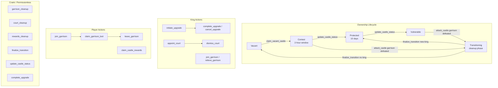

## Instructions

| ID | Instruction | Description |
|----|-------------|-------------|
| 270 | `create_castle` | DAO creates a new castle with tier, location, and eligibility requirements |
| 271 | `claim_vacant_castle` | Player claims an unoccupied castle, entering a 2-hour contest window |
| 272 | `appoint_court` | King appoints a teammate to a court position (Citadel only) |
| 273 | `dismiss_court` | King dismisses a court member, closing the position account |
| 274 | `resign_court` | Court member voluntarily resigns their position |
| 275 | `initiate_upgrade` | King starts a castle facility upgrade, burning NOVI |
| 276 | `cancel_upgrade` | King cancels an in-progress upgrade, receiving a 50% NOVI refund |
| 277 | `join_garrison` | Team member commits units, weapons, and optionally a hero to defend the castle |
| 278 | `leave_garrison` | Garrison member voluntarily withdraws their contribution |
| 279 | `relieve_garrison` | King forcibly removes a garrison member |
| 280 | `claim_castle_rewards` | King, court, or team member claims daily NOVI and cash rewards |
| 281 | `claim_garrison_loot` | Garrison member claims weapons captured in a successful defense |
| 282 | `garrison_cleanup` | Permissionless crank: returns assets and closes one garrison account during Transitioning |
| 283 | `court_cleanup` | Permissionless crank: closes one court position account during Transitioning |
| 284 | `rewards_cleanup` | Permissionless crank: closes one TeamCastleRewardAccount during Transitioning |
| 285 | `finalize_transition` | Permissionless crank: installs new king (Protected) or clears to Vacant after cleanup |
| 286 | `update_castle_config` | DAO updates reward rates, tier multiplier, treasury level, or name |
| 287 | `force_remove_king` | DAO forcibly evicts a king, initiating Transitioning toward Vacant |
| 288 | `attack_castle` | Solo attacker at ≤50 m fights the garrison; if garrison is defeated, triggers Transitioning |
| 289 | `update_castle_status` | Permissionless time-based crank: Contest→Protected or Protected→Vulnerable |
| 290 | `complete_upgrade` | Permissionless crank: applies upgrade once timer has expired |

[Source: processor/castle/](../../../programs/novus_mundus/src/processor/castle/)

---

## Castle Tiers

| Tier | Name | Reward Multiplier | has_king() | has_court() | has_garrison() | Max Garrison Slots |
|------|------|-------------------|-----------|-------------|----------------|--------------------|
| 0 | Outpost | 0.25× (2500 bps) | false | false | false | 0 |
| 1 | Keep | 0.5× (5000 bps) | false | false | false | king's sub tier |
| 2 | Stronghold | 1.0× (10000 bps) | false | false | true | king's sub tier |
| 3 | Fortress | 1.5× (15000 bps) | false | false | true | king's sub tier |
| 4 | Citadel | 2.0× (20000 bps) | true | true | true | king's sub tier |

> **Note:** `create_castle` sets `max_court = 1` for Keep and `max_court = 3` for Stronghold/Fortress/Citadel (Outpost gets 0). `has_king()` and `has_court()` both return `true` **only for Citadel** in the type system — the court system is intended for Citadel-tier castles. Non-Citadel castles are team-controlled objectives rather than individual kingdoms.

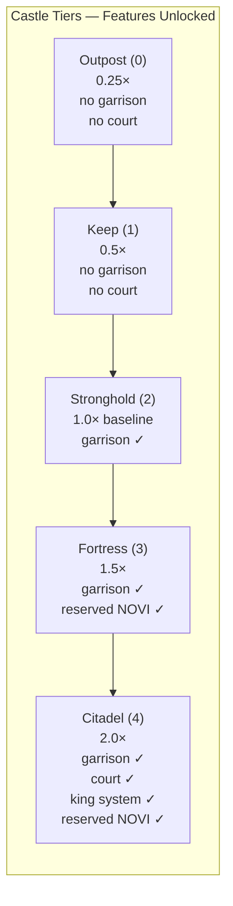

Garrison capacity is determined by the **king's subscription tier** at claim time:

| King's Subscription Tier | Max Garrison Members |
|--------------------------|---------------------|
| 0 Rookie | 5 |
| 1 Expert | 10 |
| 2 Epic | 15 |
| 3 Legendary | 25 |

[Source: state/castle.rs](../../../programs/novus_mundus/src/state/castle.rs)

---

## Account Structures

### CastleAccount

The primary account for a castle. One per (kingdom, city, castle) triple. Persists across ownership changes — upgrade levels survive transitions.

**PDA Seeds:** `[b"castle", game_engine (Pubkey), city_id (u16 LE), castle_id (u16 LE)]`

```
CastleAccount (~600 bytes):
├── account_key: u8               // AccountKey::Castle discriminator
├── game_engine: Pubkey           // Kingdom scope (32 bytes)
│
├── // Identity (8 bytes)
├── castle_id: u16                // Castle ID within city
├── city_id: u16                  // City containing this castle
├── tier: u8                      // 0=Outpost .. 4=Citadel
├── status: u8                    // 0=Vacant, 1=Contest, 2=Protected, 3=Vulnerable, 4=Transitioning
├── bump: u8
├── _padding1: u8
│
├── // Name (36 bytes)
├── name: [u8; 32]                // UTF-8 castle name
├── name_len: u8
├── _padding2: [u8; 3]
│
├── // Location (16 bytes)
├── latitude: i32                 // Fixed-point ×1,000,000 (NOT f64)
├── longitude: i32                // Fixed-point ×1,000,000 (NOT f64)
├── _padding_loc: [u8; 8]
│
├── // Ruler Info (80 bytes)
├── king: Pubkey                  // Current king's PlayerAccount PDA (NULL if vacant)
├── team: Pubkey                  // King's team PDA (NULL if vacant)
├── claimed_at: i64               // When current king claimed
├── contest_end_at: i64           // End of contest window / protection reference point
│
├── // Garrison Tracking (4 bytes)
├── garrison_count: u8            // Active garrison members
├── max_garrison: u8              // Set from king's subscription tier at claim time
├── _padding3: [u8; 2]
│
├── // Court Tracking (4 bytes)
├── court_count: u8               // Active court positions filled
├── max_court: u8                 // 0/1/3 based on tier (see note above)
├── court_appointment_cooldown: u16
│
├── // Upgrade Levels (8 bytes) — survive ownership changes
├── fortification_level: u8       // Upgrade type 1; uncapped (255 max)
├── treasury_level: u8            // Upgrade type 2; max 20
├── chambers_level: u8            // Upgrade type 3; max 5 (court slot count)
├── watchtower_level: u8          // Upgrade type 4; max 15
├── armory_level: u8              // Upgrade type 5; uncapped (255 max)
├── _padding4: [u8; 3]
│
├── // Upgrade In Progress (16 bytes)
├── upgrade_type: u8              // 0=none, 1–5 active upgrade type
├── upgrade_target_level: u8
├── _padding5: [u8; 6]
├── upgrade_end_at: i64
│
├── // DAO Eligibility (16 bytes)
├── min_level: u8
├── min_networth_millions: u8
├── min_troops_thousands: u8
├── _padding6: [u8; 5]
├── protection_duration: i64      // Base protection window in seconds
│
├── // Reward Rates (48 bytes) — DAO configurable per castle
├── tier_multiplier_bps: u16      // e.g., 10000 for Stronghold (1.0×)
├── king_loot_cut_bps: u16        // 1500 = 15% of combat loot
├── _padding7: [u8; 4]
├── king_novi_per_day: u64        // Base NOVI/day for king at 1.0× multiplier
├── king_cash_per_day: u64
├── court_novi_per_day: u64
├── court_cash_per_day: u64
├── member_novi_per_day: u64
├── member_cash_per_day: u64
│
├── // Statistics (24 bytes)
├── times_claimed: u32
├── successful_defenses: u32
├── failed_defenses: u32
├── _padding8: [u8; 4]
├── total_rewards_distributed: u64
│
├── // Transition Progress (48 bytes)
├── transition_garrison_cleaned: u8
├── transition_court_cleaned: bool
├── transition_rewards_cleaned: u8
├── _transition_padding: [u8; 5]
├── transition_new_king: Pubkey   // NULL if transitioning to Vacant
├── _transition_reserved: [u8; 8]
│
├── // Activation (16 bytes)
├── activates_at: i64             // Castle dormant until this timestamp
└── _activation_padding: [u8; 8]
```

**Derived protection formula:**
```
effective_protection_duration = protection_duration × (10000 + watchtower_bonus_bps) / 10000
// watchtower_bonus_bps = watchtower_level × 1000 (max level 15 → +150%)
```

**Attackability logic:**
```
Contest    → attackable if now < contest_end_at
Vulnerable → always attackable
Protected  → attackable if now >= contest_end_at + effective_protection_duration
Transitioning → attackable if now < contest_end_at  (2-hour contest for new challenger)
```

[Source: state/castle.rs](../../../programs/novus_mundus/src/state/castle.rs)

---

### KingRegistryAccount

Tracks all castles a single player is currently ruling. Created lazily on first claim. Never closed — persists permanently.

**PDA Seeds:** `[b"king_registry", king_player_account (Pubkey)]`

> **Note:** The seed uses the **PlayerAccount PDA** (`player_account.address()`), not the wallet pubkey.

```
KingRegistryAccount (~200 bytes):
├── account_key: u8               // AccountKey::KingRegistry
├── king: Pubkey                  // PlayerAccount PDA of king (32 bytes)
├── bump: u8
├── castle_count: u8              // Current number of castles ruled
├── max_castles: u8               // Always 5 (MAX_CASTLES_PER_KING)
├── _padding1: [u8; 5]
└── castles: [CastleReference; 5] // 160 bytes total (32 bytes each)

CastleReference (32 bytes):
├── city_id: u16
├── castle_id: u16
├── claimed_at: i64
├── tier: u8
└── _padding: [u8; 19]
```

[Source: state/castle.rs](../../../programs/novus_mundus/src/state/castle.rs)

---

### CourtPositionAccount

Created when a court position is filled; closed when the holder is dismissed, resigns, or transition cleanup runs. One account per (castle, position_type) pair.

**PDA Seeds:** `[b"court", castle (Pubkey), position_type (u8)]`

```
CourtPositionAccount (~80 bytes):
├── account_key: u8               // AccountKey::CourtPosition
├── castle: Pubkey                // Parent castle PDA (32 bytes)
├── position_type: u8             // 0=Advisor, 1=Scholar, 2=Guardian, 3=Treasurer, 4=Marshal
├── bump: u8
├── _padding1: [u8; 6]
├── holder: Pubkey                // Appointed player's PlayerAccount PDA (32 bytes)
└── appointed_at: i64
```

**Court position buffs (Citadel only):**

| Position | Type | Attack Buff | Defense Buff | Research Speed | Economy Buff |
|----------|------|-------------|--------------|----------------|--------------|
| 0 | Advisor | +15% (1500 bps) | — | — | — |
| 1 | Scholar | — | — | +20% (2000 bps) | — |
| 2 | Guardian | — | +15% (1500 bps) | — | — |
| 3 | Treasurer | — | — | — | +10% (1000 bps) |
| 4 | Marshal | — | — | — | +rally capacity |

[Source: state/castle.rs](../../../programs/novus_mundus/src/state/castle.rs)

---

### GarrisonContributionAccount

Created when a player joins the garrison; closed when they leave, are relieved, or transition cleanup runs. One account per (castle, contributor).

**PDA Seeds:** `[b"garrison", castle (Pubkey), contributor_player_account (Pubkey)]`

```
GarrisonContributionAccount (~200 bytes):
├── account_key: u8               // AccountKey::CastleGarrison
├── castle: Pubkey                // Parent castle PDA (32 bytes)
├── contributor: Pubkey           // Contributor's PlayerAccount PDA (32 bytes)
├── bump: u8
├── is_king: bool                 // True if contributor is the king
├── _padding1: [u8; 6]
├── contributed_at: i64
│
├── // Units Committed (24 bytes)
├── units_1: u64                  // Tier-1 defensive units
├── units_2: u64                  // Tier-2 defensive units
├── units_3: u64                  // Tier-3 defensive units
│
├── // Weapons Committed (24 bytes)
├── melee_weapons: u64
├── ranged_weapons: u64
├── siege_weapons: u64
│
├── // Hero Escrow (40 bytes)
├── hero_mint: Pubkey             // MPL Core asset (NULL if no hero)
├── hero_defense_bps: u16         // Cached from hero NFT stat 2 (DefensePower)
├── hero_weapon_eff_bps: u16      // Cached from hero NFT stat 10 (WeaponEfficiency)
├── _padding2: [u8; 4]
│
├── // Combat Loot (24 bytes) — weapons captured from attackers
├── loot_melee: u64
├── loot_ranged: u64
├── loot_siege: u64
│
└── loot_claimed: bool            // Prevents double-claiming loot
```

**Power formula** (used for proportional loot distribution):
```
unit_power   = units_1×10 + units_2×25 + units_3×60
weapon_power = (melee + ranged + siege) × 5
hero_power   = hero_defense_bps (flat)
total_power  = unit_power + weapon_power + hero_power
```

[Source: state/castle.rs](../../../programs/novus_mundus/src/state/castle.rs)

---

### TeamCastleRewardAccount

Tracks when a player last claimed daily rewards from a specific castle. Created lazily on first `claim_castle_rewards` call; closed during transition cleanup.

**PDA Seeds:** `[b"team_castle_reward", castle (Pubkey), member_player_account (Pubkey)]`

```
TeamCastleRewardAccount (~80 bytes):
├── account_key: u8               // AccountKey::TeamCastleReward
├── castle: Pubkey                // Parent castle PDA (32 bytes)
├── member: Pubkey                // Member's PlayerAccount PDA (32 bytes)
├── bump: u8
├── _padding1: [u8; 7]
├── last_claim_at: i64            // Initialised to `now` on first creation
└── total_claimed_novi: u64
```

[Source: state/castle.rs](../../../programs/novus_mundus/src/state/castle.rs)

---

## Status State Machine

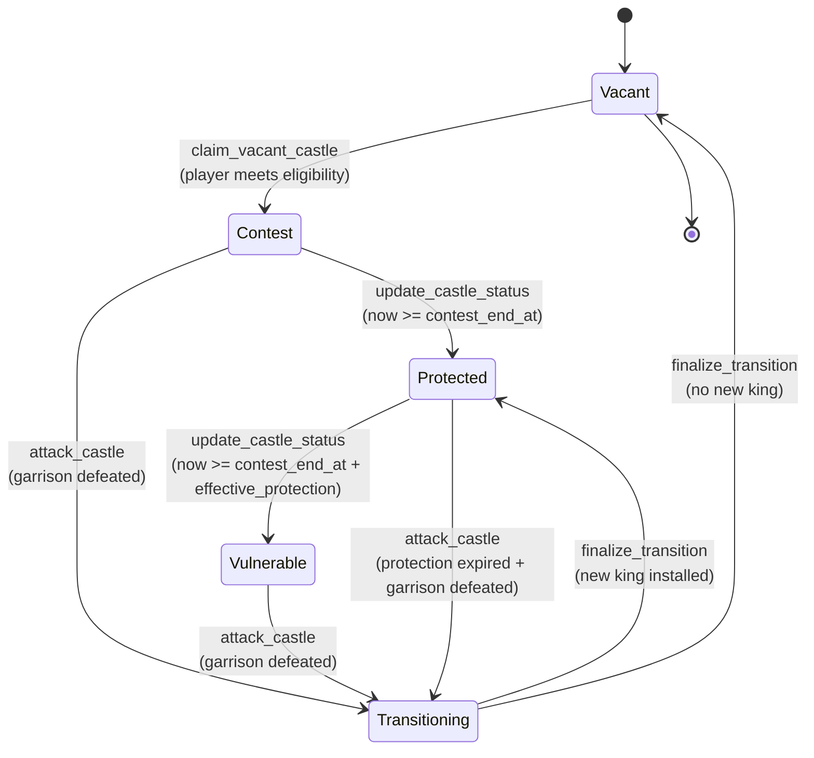

ASCII reference diagram:

```
┌──────────┐  claim_vacant_castle  ┌──────────┐
│          │ ─────────────────────>│          │
│  Vacant  │                       │ Contest  │ (2 hours: CASTLE_CONTEST_DURATION = 7200 s)
│    (0)   │<─────────────────┐    │   (1)    │
└──────────┘  finalize_        │    └────┬─────┘
              transition       │         │ update_castle_status
              (no new king)    │         │ (now >= contest_end_at)
                               │         ▼
                               │    ┌──────────┐
                               │    │Protected │ (duration: protection_duration × watchtower_mult)
                               │    │   (2)    │
                               │    └────┬─────┘
                               │         │ update_castle_status
                               │         │ (now >= contest_end_at + effective_protection)
                               │         ▼
                               │    ┌──────────┐
                               │    │Vulnerable│
                               │    │   (3)    │
                               │    └────┬─────┘
                               │         │
                               │    attack_castle (garrison defeated)
                               │    OR Contest attack (garrison defeated)
                               │         │
                               │         ▼
                               │    ┌──────────────┐
                               │    │Transitioning │
                               │    │    (4)       │
                               └────┤ cleanup phase│
                                    └──────────────┘
```

**Transition rules:**
- `update_castle_status` handles only Contest→Protected and Protected→Vulnerable. All other status changes require specific instructions.
- `attack_castle` sets status to Transitioning when garrison casualties exceed 90% of garrison total, or garrison is empty. A new 2-hour `contest_end_at` window is set so other attackers can challenge the incoming king.
- `finalize_transition` requires: `status == Transitioning`, `now >= contest_end_at`, `garrison_count == 0`, `court_count == 0`.
- `force_remove_king` (DAO) sets status to Transitioning with `transition_new_king = NULL_PUBKEY`, directing `finalize_transition` to the Vacant branch.

---

## Upgrade System

The king can initiate upgrades at any time (one at a time). Upgrades are irreversible but can be cancelled before completion.

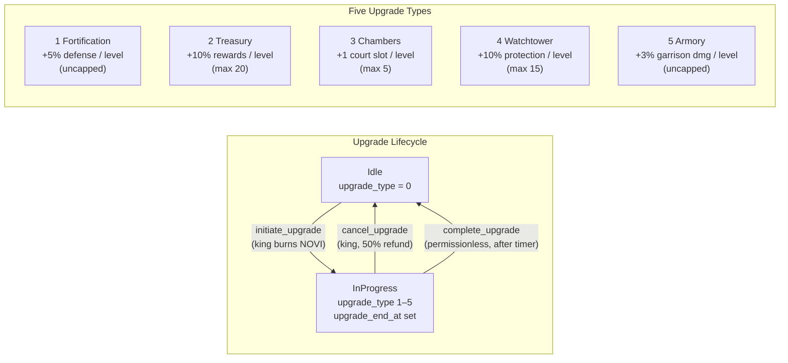

| Type | ID | Effect | Max Level | Bonus Per Level |
|------|----|--------|-----------|-----------------|
| Fortification | 1 | Damage reduction vs attackers | 255 (uncapped) | +5% defense (500 bps) |
| Treasury | 2 | Reward rate bonus | 20 | +10% rewards (1000 bps) |
| Chambers | 3 | Court slot capacity | 5 | +1 court slot |
| Watchtower | 4 | Extended protection duration | 15 | +10% protection time (1000 bps) |
| Armory | 5 | Garrison damage output | 255 (uncapped) | +3% garrison damage (300 bps) |

### Upgrade Cost Formula

```
cost(target_level) = 10,000 × 1.5^target_level   [NOVI, burned from locked balance]

Examples:
  Level 1: 10,000 × 1.5^1  = 15,000 NOVI
  Level 2: 10,000 × 1.5^2  = 22,500 NOVI
  Level 5: 10,000 × 1.5^5  = 75,937 NOVI
  Level 10: 10,000 × 1.5^10 = 576,650 NOVI
  Level 20: 10,000 × 1.5^20 = 33,254,526 NOVI
```

### Upgrade Duration Formula

```
duration(target_level) = 259,200 × target_level   [seconds = 3 days × target_level]

Examples:
  Level 1:  259,200 s  = 3 days
  Level 5:  1,296,000 s = 15 days
  Level 10: 2,592,000 s = 30 days
```

### Cancel Upgrade

`cancel_upgrade` refunds **50%** of the original NOVI cost, minted back to the king's locked token account. The upgrade is cleared immediately.

### Complete Upgrade

`complete_upgrade` (instruction 290) is **permissionless** — anyone can call it once `now >= upgrade_end_at`. Chambers upgrades also update `castle.max_court = target_level`.

---

## Reward System

### Daily Reward Rates

> **Note:** Reward rates are stored directly on each `CastleAccount` and set at creation time by `create_castle` from `constants.rs`. The table below shows those initial values (at 1.0× Stronghold tier multiplier). `CastleConfig::default()` in `game_engine.rs` is the DAO-governed template for new kingdoms and is **not** what individual castle accounts are initialized with. Per-castle rates can be adjusted via `update_castle_config`.

| Role | NOVI / day | Cash / day |
|------|------------|------------|
| King (Citadel only) | 500,000 | 10,000,000 |
| Court member (Citadel only) | 50,000 | 1,000,000 |
| Team member | 5,000 | 500,000 |

All rates are stored on `CastleAccount` and can be adjusted per-castle via `update_castle_config`.

### Reward Formula

```
reward = base_rate
       × (tier_multiplier_bps / 10000)
       × (1 + treasury_level × 0.10)
       × days_elapsed

// days_elapsed is capped at 7 days per claim
```

```
calculate_reward(base_rate, tier_mult_bps, treasury_level, days):
  tier_adjusted  = base_rate × tier_mult_bps / 10000
  with_treasury  = tier_adjusted × (10000 + treasury_level × 1000) / 10000
  total          = with_treasury × days
```

### Token Destination by Tier

| Tier | NOVI Destination | Withdrawable? |
|------|-----------------|---------------|
| Outpost, Keep, Stronghold | `locked_novi` (PlayerAccount locked token account) | No |
| Fortress, Citadel | `reserved_novi` (UserAccount reserved token account) | Yes |

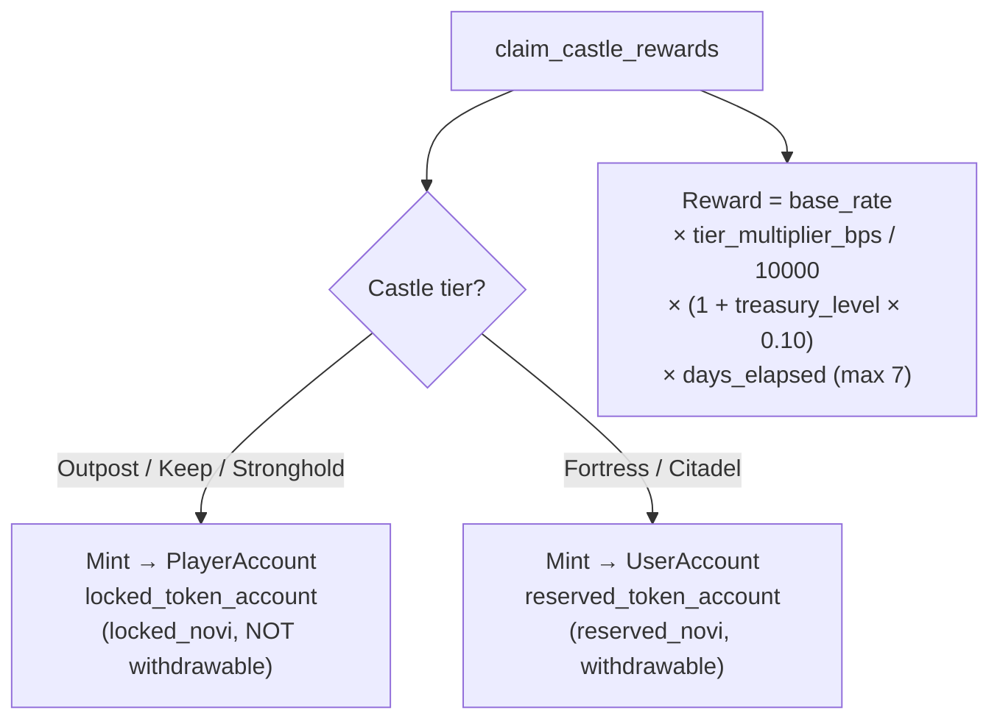

### Claim Rules

1. A `TeamCastleRewardAccount` is created on first claim (initialised to `last_claim_at = now`). The first call returns immediately; rewards start accumulating from that moment.
2. Minimum 1 full day (`SECONDS_PER_DAY = 86400`) must elapse between claims.
3. Maximum 7 days of rewards can be claimed at once (anti-griefing cap).
4. Claimant must be on `castle.team`. King is determined by `castle.king == player_account`.

---

## Combat System

### Attack Castle (Instruction 288)

Solo attack on a castle's garrison from within 50 meters of the castle location.

**Prerequisites:**
- `castle.can_be_attacked(now)` — status is Contest (within window), Vulnerable, or Protected (protection expired), or Transitioning (within 2-hour window)
- Attacker is not traveling, not in an active rally
- Attacker has defensive units (castle attacks use defensive forces, not operatives)
- Attacker is within `CASTLE_ATTACK_RANGE_METERS = 50.0` meters of castle coordinates

**Combat resolution:**
```
attacker_damage = calculate_damage_output(attacker_defensive_units, attacker_weapons, ...)
garrison_damage = calculate_damage_output(garrison_units, garrison_weapons, ...)
                × (1 + armory_bonus_bps / 10000)       // armory boosts garrison output

effective_attacker_damage = attacker_damage
                           × 10000 / (10000 + fortification_bonus_bps)  // fortification reduces attacker damage

garrison_casualty_ratio = effective_attacker_damage / (garrison_units × 10)   [capped at 100%]
```

> The `× 10` denominator is an **implicit garrison-HP**: each garrison unit
> absorbs ~10 damage. Open-field combat (see [combat-math §4.4](../05-formulas/combat-math.md#44-per-tier-hp--casualties))
> uses per-tier HP `[2, 5, 12]` averaging ~4–5 for a typical starter mix, so
> castle defenders are intentionally ~2× tankier than the same units fighting
> in the open. Garrison aggregates multiple players without carrying per-tier
> breakdowns, which is why the castle path keeps a single scalar instead of
> calling `inflict_damage`.

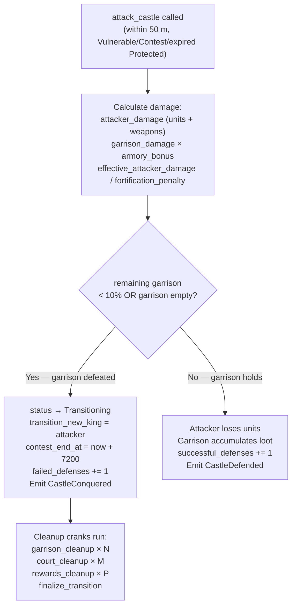

**Garrison defeated condition:** remaining garrison < 10% of original, or garrison was empty.

When garrison is defeated:
- `castle.status` → Transitioning
- `castle.transition_new_king` = attacker's PlayerAccount PDA
- `castle.contest_end_at` = now + 7200 (fresh 2-hour challenge window)
- Emits `CastleConquered`

When garrison wins (attacker repelled):
- Attacker loses units proportional to garrison damage
- Garrison members accumulate loot in their `GarrisonContributionAccount.loot_*` fields
- Emits `CastleDefended`

**Locations:** `castle.latitude` and `castle.longitude` are `i32` fixed-point values (degrees × 1,000,000). The attack range check converts these back to float degrees before calling `calculate_distance_meters`.

---

## Ownership Transition Flow

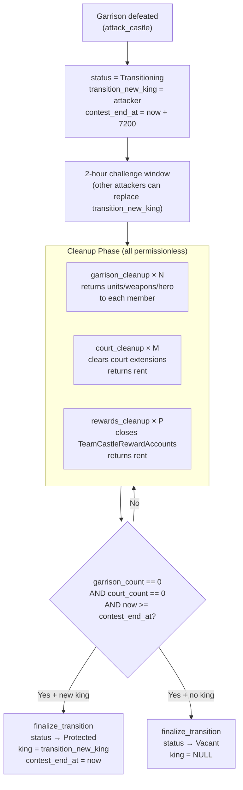

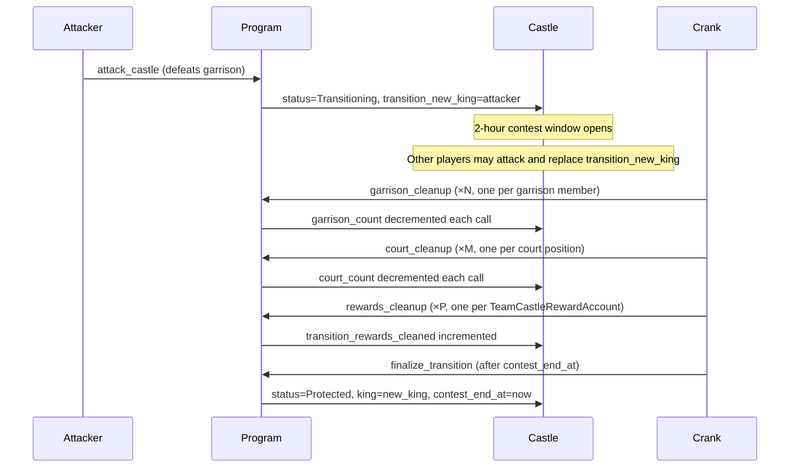

**Cleanup instructions are fully permissionless** — any crank can call them. Rent from closed accounts is returned to the original account holders (contributors' wallets).

**`finalize_transition` dual-path:**
- `transition_new_king != NULL_PUBKEY` → new king installed, status = Protected, `contest_end_at = now` (protection starts immediately)
- `transition_new_king == NULL_PUBKEY` → status = Vacant, `king = NULL_PUBKEY`

---

## Garrison Lifecycle

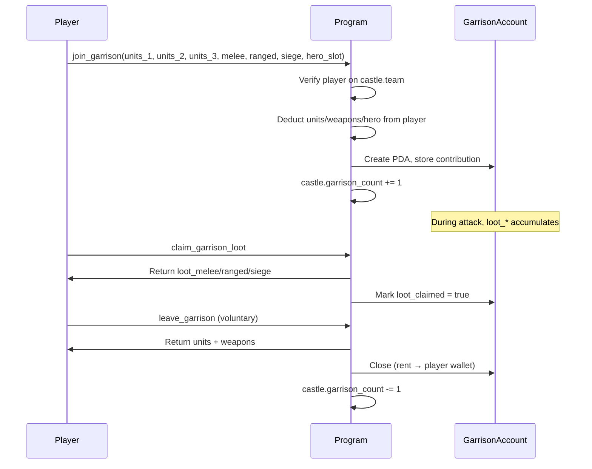

**Hero escrow:** Hero NFT is transferred (MPL Core `TransferV1`) from the player's PlayerAccount PDA to the GarrisonContributionAccount PDA during `join_garrison`. On exit (leave, relieve, cleanup), hero is returned to player's first empty active slot (PlayerAccount PDA), or to the wallet directly if all three slots are occupied.

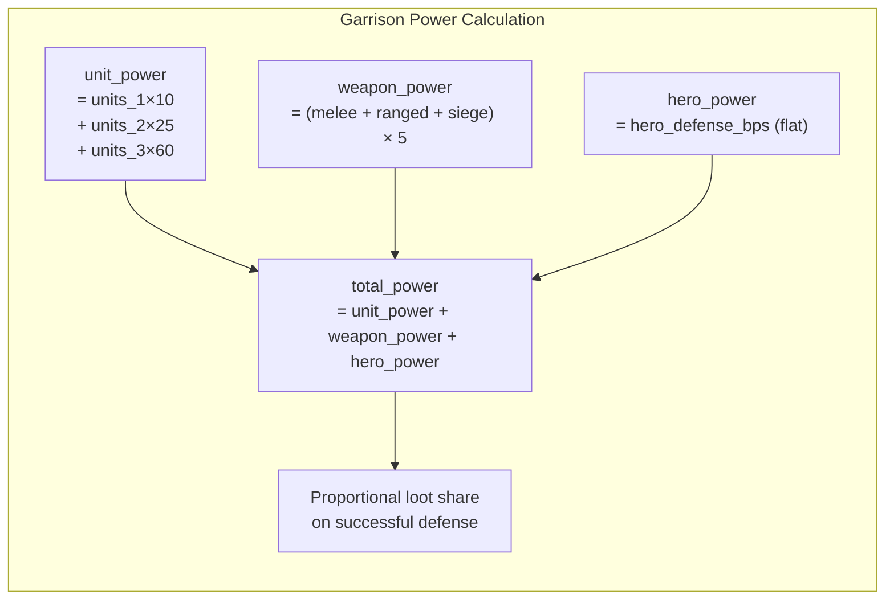

---

## Court Lifecycle

### Prerequisites (appoint_court)

- Castle is Citadel tier (`has_court() == true`)
- Status is not Contest or Transitioning
- `court_count < max_court` (limited by Chambers upgrade level)
- Appointee is on king's team and is not the king
- Position is not already filled (CourtPositionAccount does not exist)

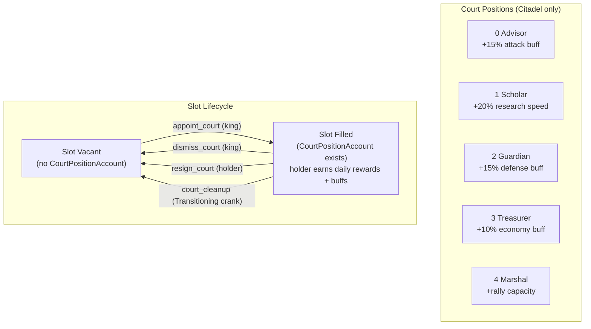

### Court Position Flow

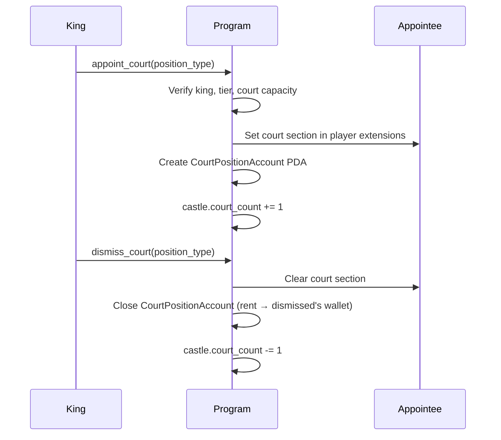

`resign_court` follows the same flow as `dismiss_court` but is called by the holder themselves. Emits `CourtDismissed` with `resigned = true`.

---

## Client Integration

```typescript
import {
  createClaimVacantCastleInstruction,
  createJoinGarrisonInstruction,
  createClaimCastleRewardsInstruction,
  createUpdateCastleStatusInstruction,
  createAttackCastleInstruction,
} from '@novus-mundus/sdk';
import { deriveCastlePda, deriveKingRegistryPda, deriveTeamCastleRewardPda } from '@novus-mundus/sdk/pda';

// Step 1: Claim a vacant castle
const [castlePda] = deriveCastlePda(gameEngine, cityId, castleId);
const [registryPda] = deriveKingRegistryPda(playerPda);

const claimIx = createClaimVacantCastleInstruction(
  { playerWallet: wallet.publicKey, playerAccount: playerPda, gameEngine },
  { cityId, castleId }
);

// Step 2: Transition Contest → Protected (permissionless, after 2 hours)
const updateStatusIx = createUpdateCastleStatusInstruction(
  { caller: wallet.publicKey, castleAccount: castlePda }
);

// Step 3: Claim daily rewards
const [rewardPda] = deriveTeamCastleRewardPda(castlePda, playerPda);

const rewardIx = createClaimCastleRewardsInstruction(
  {
    playerWallet: wallet.publicKey,
    playerAccount: playerPda,
    castleAccount: castlePda,
    rewardAccount: rewardPda,
    gameEngine,
    noviMint,
    lockedTokenAccount,   // for Outpost/Keep/Stronghold
    // userAccount + reservedTokenAccount for Fortress/Citadel
  }
);

// Step 4: Check if castle is attackable before sending attack
const castle = await fetchCastleAccount(connection, castlePda);
const now = Math.floor(Date.now() / 1000);

// Attackable if: Contest (within window), Vulnerable, or Protected (expired)
function isAttackable(castle, now) {
  switch (castle.status) {
    case 1 /* Contest */: return now < castle.contestEndAt;
    case 3 /* Vulnerable */: return true;
    case 2 /* Protected */:
      const watchtowerBonus = castle.watchtowerLevel * 1000;
      const effectiveDuration = castle.protectionDuration
        * (10000 + watchtowerBonus) / 10000;
      return now >= castle.contestEndAt + effectiveDuration;
    case 4 /* Transitioning */: return now < castle.contestEndAt;
    default: return false;
  }
}
```

---

*The castle is the apex of territorial power — claim it, fortify it, garrison it, and grow rich. But know that the crown passes to those with greater strength.*

---

Next: [Combat](./combat.md)
