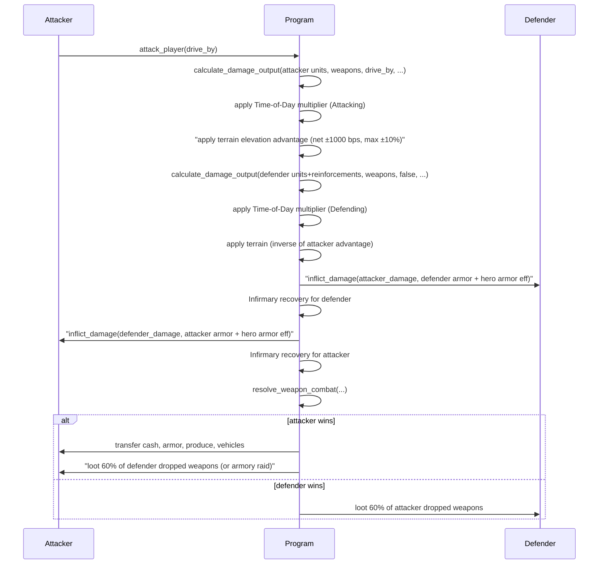
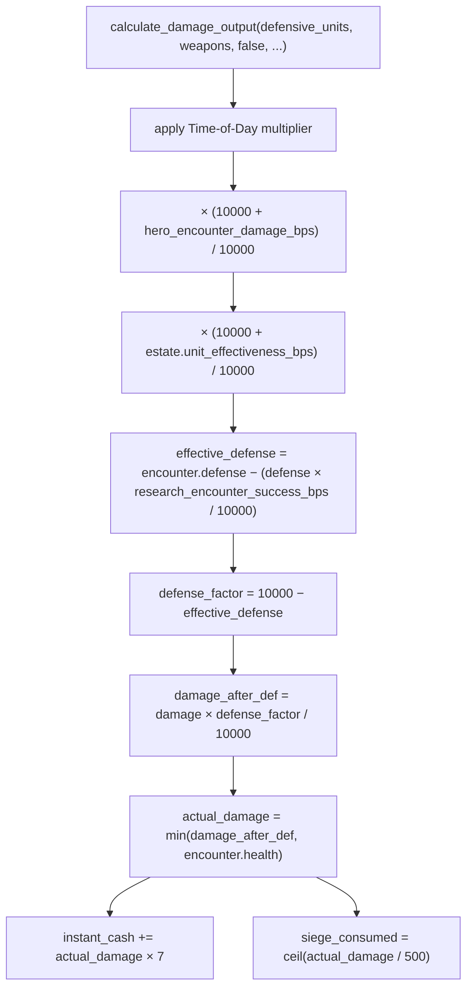
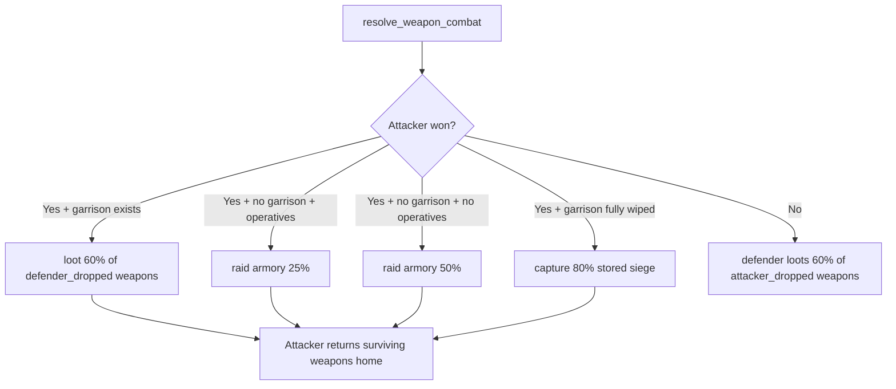
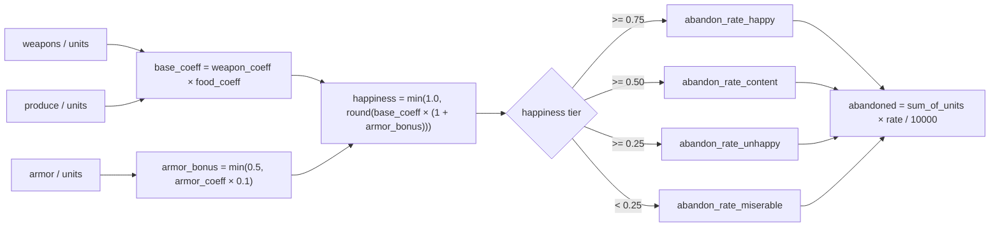

# Combat System

> Deterministic, location-aware PvP and PvE combat with weapon economics.

## Overview

The Combat System governs all player-versus-player (PvP) and player-versus-encounter (PvE) battles. All damage is calculated deterministically — no random seeds, no timestamp hashing. Critical hits are a skill threshold, not probability. Combat is location-gated: players must be physically within range of their target.

```mermaid
graph TB
    subgraph "PvP — attack_player (20)"
        A1[Both in same city] --> A2["Within 15 m range"]
        A2 --> A3[Calc attacker damage]
        A3 --> A4[Calc defender counter]
        A4 --> A5[Inflict mutual damage]
        A5 --> A6{Attacker wins?}
        A6 -->|Yes| A7["Steal cash + weapons + gear"]
        A6 -->|No| A8[Defender loots attacker weapons]
    end

    subgraph "PvE — attack_encounter (21)"
        B1["Player within 10 m"] --> B2[Defensive units required]
        B2 --> B3[Calc damage vs encounter defense]
        B3 --> B4[Instant cash reward]
        B4 --> B5{Encounter dies?}
        B5 -->|Yes| B6["Create LootAccount + XP + close cell"]
        B5 -->|No| B6b[Update attacker list]
    end

    subgraph "Encounter Lifecycle"
        C1[spawn 70] --> C2["EncounterAccount + LocationAccount"]
        C2 --> C3["attack_encounter × N"]
        C3 --> C4[claim loot 71]
    end
```



## Instructions

| ID | Instruction | Description |
|----|-------------|-------------|
| 20 | `attack_player` | PvP — attack another player at your coordinates |
| 21 | `attack_encounter` | PvE — attack a spawned encounter NPC |
| 70 | `spawn` | Spawn an encounter in the current city |
| 71 | `claim` | Claim loot from a defeated encounter |

[Source: processor/combat/](../../../programs/novus_mundus/src/processor/combat/)
[Source: processor/encounter/spawn.rs](../../../programs/novus_mundus/src/processor/encounter/spawn.rs)
[Source: processor/loot/claim.rs](../../../programs/novus_mundus/src/processor/loot/claim.rs)

---

## PvP Combat — `attack_player` (ID 20)

### Requirements

| Guard | Condition |
|-------|-----------|
| `EXT_RESEARCH` | Attacker must have the Research extension unlocked |
| Same city | Both players' `current_city` must match |
| Within range | Distance ≤ `PVP_ATTACK_RANGE_METERS = 15.0 m` |
| City bounds | Both coordinates must lie inside their respective city radius |
| Not traveling | Neither attacker nor defender may be traveling |
| Not in rally | Attacker must have no active rallies |
| Not protected | Defender's `new_player_protection_until` must have expired |

Attacking revokes the attacker's own new-player protection immediately.

### Instruction Data

```
[0] drive_by: u8   // 0 = normal, non-zero = drive-by (requires >= 10,000 attacker units for bonus)
```

### Account Order

```
0. [writable] attacker_player
1. [writable] defender_player
2. [signer]   attacker_owner
3. []          attacker_city
4. []          defender_city (may be same as attacker_city)
5. []          game_engine
6. []          attacker_estate
7. []          defender_estate
8-9.   [writable] attacker_event_participation + attacker_event       (optional)
10-11. [writable] defender_event_participation + defender_event       (optional)
```

### Damage Flow



### Cash Loot (Attacker Wins)

```
loot_bps = gameplay_config.pvp_loot_percentage_base

// Multiplicative buff stacking
loot_bps = loot_bps * (10000 + research_loot_bonus_bps) / 10000
loot_bps = loot_bps * (10000 + hero_loot_bonus_bps)     / 10000
loot_bps = min(loot_bps, 10000)

cash_from_hand   = defender.cash_on_hand * loot_bps / 10000

unprotected_vault = defender.cash_in_vault
    * (10000 - gameplay_config.safebox_protection_percent) / 10000
cash_from_vault  = unprotected_vault * loot_bps / 10000
```

> **Note:** `player.locked_novi` is never lootable regardless of safebox setting. Only `cash_on_hand` and the unprotected fraction of `cash_in_vault` are at risk.

### Operative Attrition

Operatives are only attacked when the **entire garrison is wiped** — all defensive tier-1/2/3 units (including reinforcements) reach 0. A second `inflict_damage` call then applies the same attacker damage against the defender's operative units with the same armor coverage.

[Source: processor/combat/attack_player.rs](../../../programs/novus_mundus/src/processor/combat/attack_player.rs)

---

## PvE Combat — `attack_encounter` (ID 21)

### Requirements

| Guard | Condition |
|-------|-----------|
| Defensive units | `player.total_defensive_units() > 0` — **defensive** (not operative) units |
| Within range | Distance ≤ `ENCOUNTER_ATTACK_RANGE_METERS = 10.0 m` |
| Encounter alive | `encounter.health > 0` |
| Not despawned | `now < encounter.despawn_at` |
| Level gap | `abs(player.level − encounter.level) ≤ gameplay_config.max_encounter_level_diff` |
| Not traveling | Player must not be traveling |
| Not in rally | Player must have no active rallies |

> **Old-docs trap:** The old documentation and some SDK comments call for "operative units". The Rust processor at line 199 explicitly checks `player_data.total_defensive_units()` and returns `InsufficientUnits` if zero. Operatives are **not** used for encounter attacks.

### Instruction Data

```
[0..8] encounter_id: u64   // little-endian — ID of the encounter to attack
```

### Damage Pipeline (PvE)



```
1. base_damage = calculate_damage_output(
       defensive_units, total_weapons, false /* no drive-by */,
       gameplay_config,
       research_attack_bps, research_crit_chance_bps, research_crit_damage_bps,
       boosted_hero_attack, hero_weapon_efficiency_bps,
       hero_crit_chance_bps, equipped_weapon_bonus_bps)

2. time_damage = apply_time_multiplier(base_damage, time_of_day, Attacking)

3. hero_damage = time_damage * (10000 + hero_encounter_damage_bps) / 10000

4. damage = hero_damage * (10000 + estate.unit_effectiveness_bps) / 10000

// Encounter defense (reduced by research_encounter_success_bps)
effective_defense = encounter.defense
    - (encounter.defense * research_encounter_success_bps / 10000)
defense_factor    = 10000 - effective_defense
damage_after_def  = damage * defense_factor / 10000

actual_damage = min(damage_after_def, encounter.health)
```

The Blessed Hero bonus (`blessed_hero_bonus_bps`) boosts `hero_attack_bps` multiplicatively before the damage call.

### Instant Cash Reward

```
// a fixed 7× multiplier (inline literal, not a named constant)
instant_cash    = actual_damage * 7
player.cash_on_hand += instant_cash
```

### Siege Weapon Consumption

```
DAMAGE_PER_SIEGE_WEAPON = 500
siege_consumed = ceil(actual_damage / 500)
siege_consumed = min(siege_consumed, player.siege_weapons)
player.siege_weapons -= siege_consumed
```

### Death Rewards (encounter.health drops to 0)

```mermaid
flowchart LR
    Death["encounter.health == 0"] --> Loot["LootAccount created<br/>[LOOT_SEED, player, loot_id]"]
    Loot --> Pool["calculate_encounter_loot_pool<br/>(level, rarity, time-of-day)"]
    Pool --> HeroLoot["× hero_loot_bonus_bps"]
    HeroLoot --> Sync["× hero_synchrony_bonus_bps"]
    Sync --> Obs["× daily_loot_bonus_bps (Observatory)"]
    Obs --> Split["Weapons: 50% melee / 30% ranged / 20% siege"]
    Split --> Frags["Fragments/gems if research unlocked"]
    Frags --> Close["Close LocationAccount → rent to location_creator"]
    Close --> XP["XP to killing-blow player (× time-of-day)"]
```



1. `LootAccount` created at PDA `[LOOT_SEED, player, loot_id]`.
2. `loot_pool` calculated from `calculate_encounter_loot_pool` (level, rarity, time-of-day).
3. Hero loot bonus (`hero_loot_bonus_bps`) applied multiplicatively to all loot quantities.
4. Hero synchrony bonus (`hero_synchrony_bonus_bps`) applied multiplicatively.
5. Observatory estate mini-game bonus (`daily_loot_bonus_bps`) applied multiplicatively.
6. Loot weapons split: 50% melee, 30% ranged, 20% siege.
7. Fragments/gems granted if player has fragment/gem-drop research unlocked; loot magnetism research boosts both.
8. **Encounter's LocationAccount** is closed; rent returned to `location_creator`.
9. XP granted to killing-blow player (with time-of-day multiplier).

### Stamina Costs

| Encounter Rarity | Stamina Cost |
|-----------------|--------------|
| Common (0) | 10 |
| Uncommon (1) | 25 |
| Rare (2) | 50 |
| Epic (3) | 100 |
| Legendary (4) | 250 |
| WorldEvent (5) | 500 |

[Source: constants.rs — ENCOUNTER_STAMINA_COSTS](../../../programs/novus_mundus/src/constants.rs)
[Source: processor/combat/attack_encounter.rs](../../../programs/novus_mundus/src/processor/combat/attack_encounter.rs)

---

## Encounter Spawn — `spawn` (ID 70)

| Mode | Authority | Rarity | NOVI Burn |
|------|-----------|--------|-----------|
| Player-initiated | Player wallet | Common / Uncommon / Rare only | Yes — scaled by time-of-day weight |
| Auto-spawn | `game_engine.authority` | Any (incl. Epic / Legendary) | No |

### Instruction Data

```
[0]    encounter_type: u8          // 0=Common 1=Uncommon 2=Rare 3=Epic 4=Legendary 5=WorldEvent
[1..5] grid_lat:  i32 (LE)
[5..9] grid_long: i32 (LE)
```

Coordinates are client-computed and validated on-chain: must fall inside the city radius and on passable terrain.

Encounter level:
- **Player spawn**: `player.level` clamped to `[city.min_encounter_level, city.max_encounter_level]`
- **Auto-spawn**: deterministic golden-ratio distribution using `city.total_encounters_spawned` as seed

### EncounterAccount

```rust
pub struct EncounterAccount {
    pub account_key: u8,        // 1  — AccountKey::Encounter
    pub game_engine: Address,   // 32 — kingdom scope
    pub id: u64,                // 8  — per-city monotonic counter
    pub city_id: u16,           // 2
    pub level: u8,              // 1  — 1–100
    pub rarity: u8,             // 1  — EncounterType (0–5)
    pub _padding0: [u8; 4],     // 4
    pub location_lat: f64,      // 8  — spawn latitude
    pub location_long: f64,     // 8  — spawn longitude
    pub spawned_at: i64,        // 8
    pub despawn_at: i64,        // 8
    pub health: u64,            // 8  — base_health + level * health_per_level
    pub max_health: u64,        // 8
    pub defense: u32,           // 4  — bps; capped at 9000 (90% damage reduction)
    pub _padding1: [u8; 4],     // 4
    pub attacker_count: u8,     // 1  — grows as players attack; account reallocated dynamically
    pub bump: u8,               // 1
    pub _padding2: [u8; 6],     // 6
    // [BASE_LEN..] attacker pubkeys: Address × attacker_count (dynamically appended)
}
// PDA: [ENCOUNTER_SEED, game_engine, city_id_le2, encounter_id_le8]
```

[Source: state/encounter.rs](../../../programs/novus_mundus/src/state/encounter.rs)
[Source: processor/encounter/spawn.rs](../../../programs/novus_mundus/src/processor/encounter/spawn.rs)

---

## Weapon Combat Resolution

`resolve_weapon_combat` (`logic/combat.rs`) runs after unit damage and determines all weapon transfers:



### Weapon Loot Rates

| Condition | Rate Constant | Value |
|-----------|--------------|-------|
| Loot from dead enemy troops | `WEAPON_LOOT_RATE_BPS` | 60% |
| Armory raid — defender has operatives | `ARMORY_RAID_WITH_OPERATIVES_BPS` | 25% |
| Armory raid — completely undefended | `ARMORY_RAID_UNDEFENDED_BPS` | 50% |
| Siege capture when defender fully wiped | `SIEGE_CAPTURE_RATE_BPS` | 80% |

Reinforcement weapons die proportionally with reinforcement units and are not lootable — they return to their owners after the battle.

[Source: logic/combat.rs](../../../programs/novus_mundus/src/logic/combat.rs)
[Source: constants.rs — weapon constants](../../../programs/novus_mundus/src/constants.rs)

---

## Happiness & Abandonment



```
// Defensive unit happiness (update_happiness_defensive)
weapon_coeff = weapons / units
food_coeff   = produce / units
armor_coeff  = armor   / units
armor_bonus  = min(0.5, armor_coeff * 0.1)
happiness    = min(1.0, round(weapon_coeff * food_coeff * (1 + armor_bonus)))

// Abandonment rate (deterministic, from GameplayConfig)
rate = abandon_rate_happy      if happiness >= 0.75
     | abandon_rate_content    if happiness >= 0.50
     | abandon_rate_unhappy    if happiness >= 0.25
     | abandon_rate_miserable  if happiness <  0.25

abandoned = sum_of_units * rate / 10000
```

---

## Infirmary Recovery

When an EstateAccount with an Infirmary building exists, a fraction of units lost in combat are recovered:

```
recovery_bps = infirmary_recovery_bps(estate)    // from estate building level
recovered_1  = lost_def_1 * recovery_bps / 10000
// Tracked in estate.wounded_def_* / wounded_op_*; healed via recovery instruction
```

Both attacker and defender estates are checked independently. Operative attrition losses (when garrison is wiped) are also eligible for infirmary recovery.

---

## Client Integration

```typescript
import { buildAttackPlayerIx, buildAttackEncounterIx } from "@novus-mundus/sdk";

// PvP — drive-by attack
const pvpIx = buildAttackPlayerIx({
  attackerPlayer: attackerPDA,
  defenderPlayer: defenderPDA,
  attackerOwner:  wallet.publicKey,
  attackerCity:   attackerCityPDA,
  defenderCity:   defenderCityPDA,
  gameEngine:     gameEnginePDA,
  attackerEstate: attackerEstatePDA,
  defenderEstate: defenderEstatePDA,
  driveBy:        true,   // 1 byte bool
});

// PvE — attack encounter, encounter near death (pass death accounts)
const pveIx = buildAttackEncounterIx({
  player:                  playerPDA,
  encounter:               encounterPDA,
  owner:                   wallet.publicKey,
  gameEngine:              gameEnginePDA,
  estateAccount:           estatePDA,
  // Required when encounter will die:
  loot:                    lootPDA,
  encounterLocation:       encounterLocationPDA,
  locationCreatorRefund:   creatorWallet,
  encounterId:             BigInt(encounterAccount.id),  // u64
});
```

---

Next: [Travel](./travel.md)
