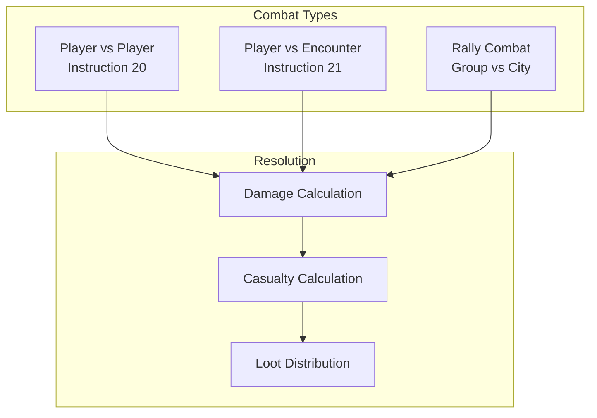
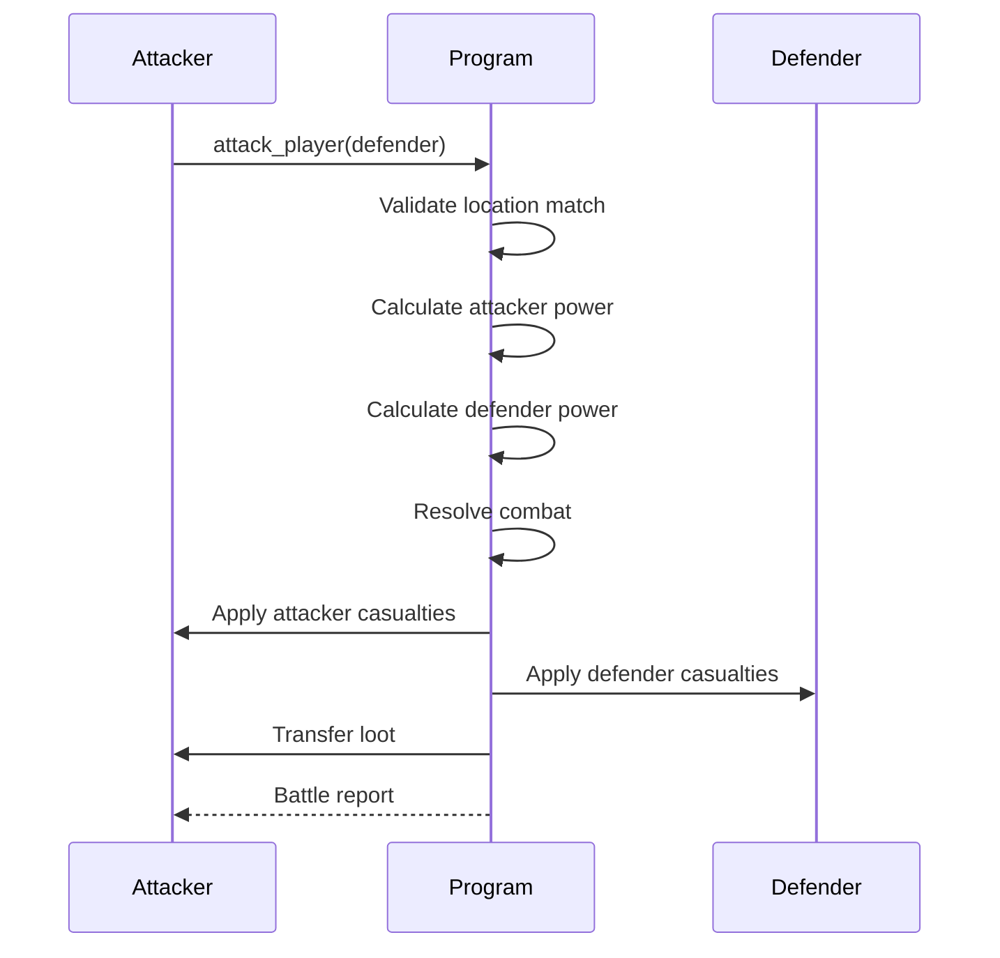
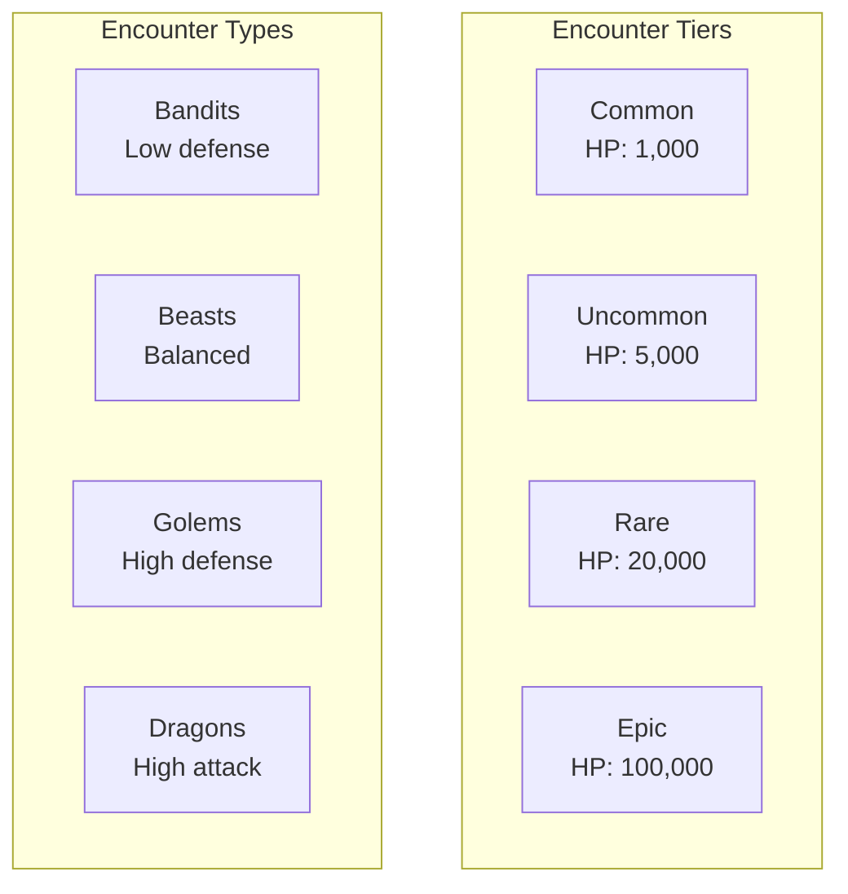
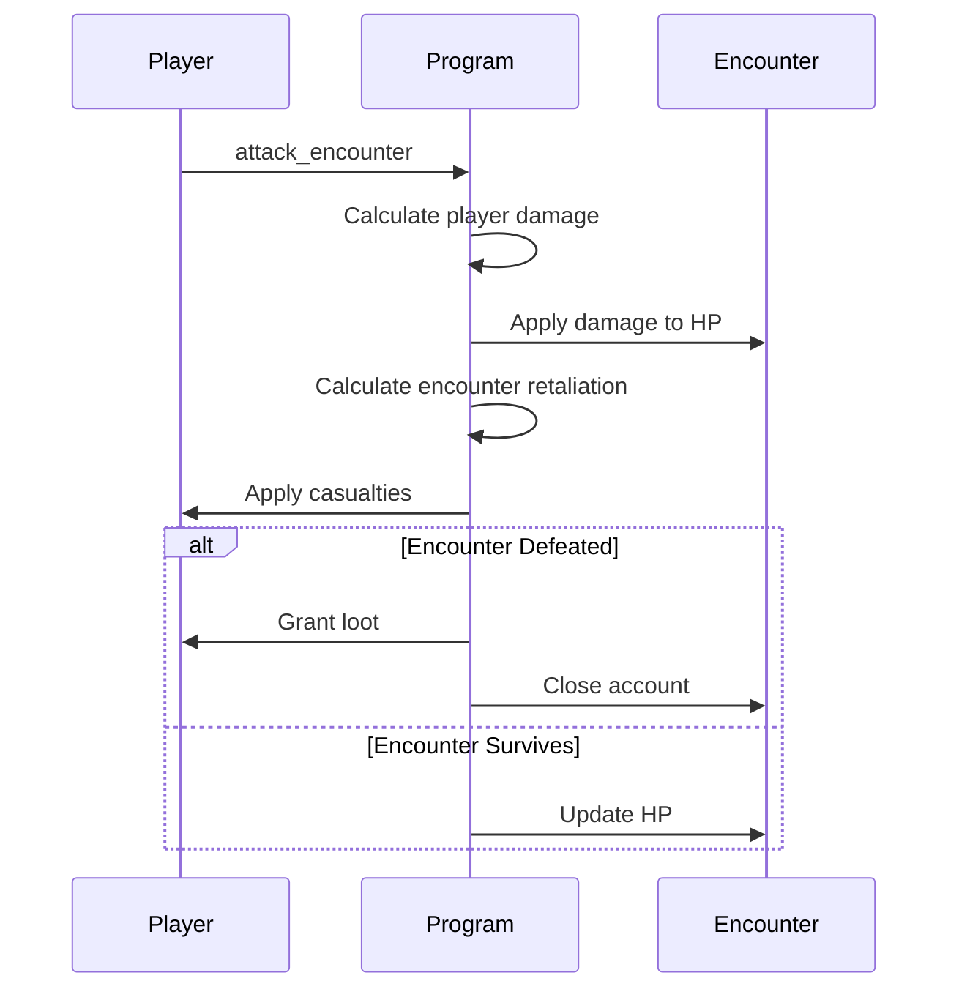
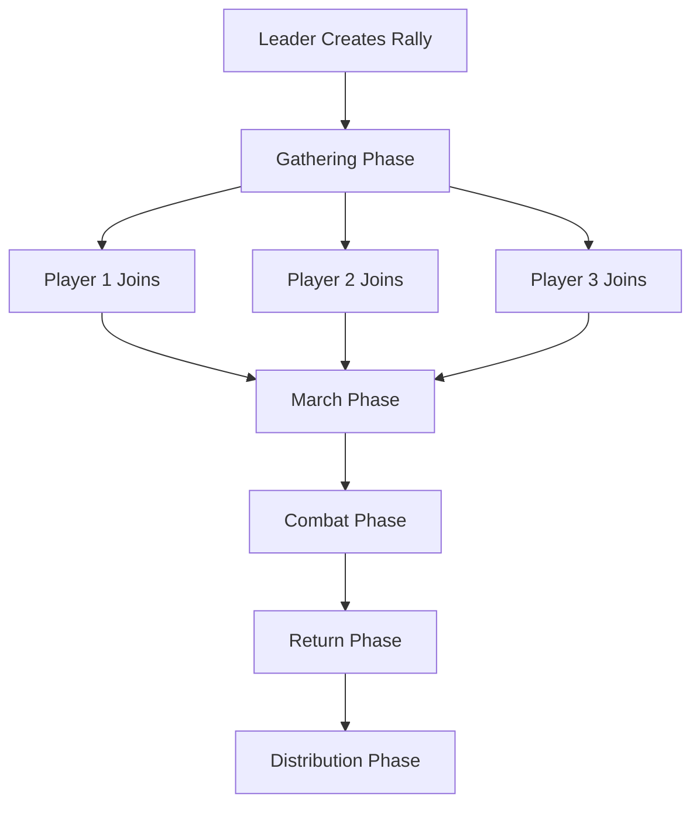
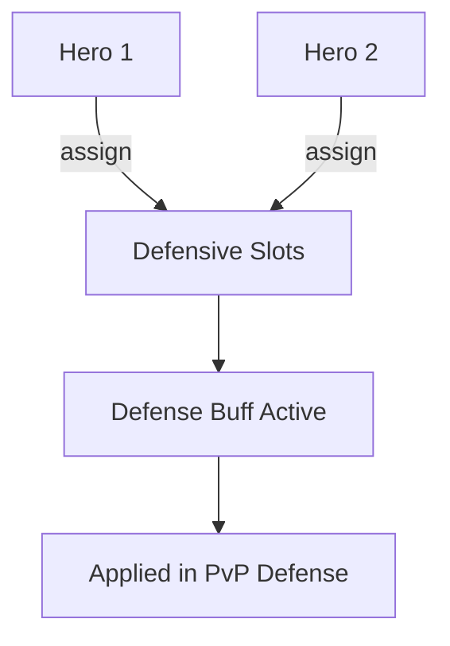

# Combat System

> PvP attacks, PvE encounters, and the mechanics of battle in Novus Mundus.

## Combat Overview

Combat in Novus Mundus is **deterministic** - given the same inputs, the outcome is always the same. This enables trustless on-chain resolution without randomness oracles.



## Player vs Player (PvP)

**Instruction:** `20 - attack_player`

### Prerequisites
- Attacker and defender at same location
- Attacker has combat units
- Not on cooldown from previous attack

### Combat Flow



### Power Calculation

```
attack_power = Σ(units × unit_attack) × (1 + attack_buffs)
defense_power = Σ(units × unit_defense) × (1 + defense_buffs)
```

**Unit Combat Stats:**
| Unit Type | Attack | Defense | HP |
|-----------|--------|---------|-----|
| T1 Operative | 10 | 5 | 100 |
| T2 Operative | 25 | 15 | 150 |
| T3 Operative | 50 | 30 | 200 |
| Melee Weapon | +20 | +5 | - |
| Ranged Weapon | +30 | 0 | - |
| Siege Weapon | +50 | 0 | - |
| Armor | 0 | +25 | - |
| Vehicle | +10 | +50 | - |

**Buff Sources:**
| Source | Attack Buff | Defense Buff |
|--------|-------------|--------------|
| Hero (locked) | hero_attack_bps | hero_defense_bps |
| Research | research_attack_bps | research_defense_bps |
| Equipment | equipment_attack_bps | equipment_defense_bps |
| Building (Arena) | arena_pvp_damage_bps | - |

### Damage Formula

```
damage_dealt = attack_power × (attack_power / (attack_power + defense_power))
```

This creates diminishing returns:
- Equal power: 50% of attack dealt as damage
- 2x advantage: 67% of attack dealt
- 4x advantage: 80% of attack dealt

### Casualty Calculation

```
casualty_rate = damage_taken / total_unit_hp
casualties = units × casualty_rate × (1 - armor_reduction)
```

Casualties are distributed proportionally across unit types.

### Loot Transfer

Attackers can steal resources on victory:

```
loot_percentage = min(50%, base_rate × power_ratio)
loot = defender_resources × loot_percentage
```

**Lootable Resources:**
- Cash (up to 50%)
- Produce (up to 30%)
- Unlocked NOVI (up to 20%)

[Source: processor/combat/attack_player.rs](../../../programs/novus_mundus/src/processor/combat/attack_player.rs)

---

## Player vs Encounter (PvE)

**Instruction:** `21 - attack_encounter`

### Encounter Types



### PvE Combat Flow



### Encounter Rewards

| Tier | Gems | Fragments | Cash | XP |
|------|------|-----------|------|-----|
| Common | 5-20 | 10-30 | 100-500 | 25 |
| Uncommon | 20-50 | 30-80 | 500-1.5k | 75 |
| Rare | 50-150 | 80-200 | 1.5k-5k | 200 |
| Epic | 150-500 | 200-500 | 5k-15k | 500 |

**Reward Modifiers:**
- Hero loot bonus (hero_loot_bps)
- Observatory building bonus
- Research bonuses
- Event multipliers

[Source: processor/combat/attack_encounter.rs](../../../programs/novus_mundus/src/processor/combat/attack_encounter.rs)

---

## Rally Combat

Rallies are coordinated group attacks against cities.

### Rally Formation



### Combined Forces

Rally power is the sum of all participants:

```
rally_attack = Σ(participant_attack_power)
rally_defense = Σ(participant_defense_power)
```

**Participant Contribution:**
| Player | Units | Attack Power | Share |
|--------|-------|--------------|-------|
| Leader | 1,000 | 50,000 | 40% |
| Member A | 500 | 25,000 | 20% |
| Member B | 750 | 37,500 | 30% |
| Member C | 250 | 12,500 | 10% |
| **Total** | 2,500 | 125,000 | 100% |

### City Defense

Cities have base defense plus player defenders:

```
city_defense = base_defense + Σ(defender_power)
```

Defenders are players who have set the city as their "home" or have reinforcements stationed.

### Loot Distribution

After victory, loot is distributed by contribution:

```
player_loot = total_loot × (player_power / rally_power)
```

[Source: processor/rally/execute.rs](../../../programs/novus_mundus/src/processor/rally/execute.rs)

---

## Combat Buffs

### Hero Buffs

Locked heroes provide combat bonuses:

| Buff | Effect |
|------|--------|
| AttackPower | +X% attack |
| DefensePower | +X% defense |
| CriticalHitChance | +X% crit rate |
| EncounterDamage | +X% vs PvE |

### Research Buffs

Completed research grants permanent bonuses:

| Research | Effect |
|----------|--------|
| Combat I | +5% attack |
| Combat II | +10% attack |
| Fortification I | +5% defense |
| Fortification II | +10% defense |

### Building Buffs

| Building | Effect |
|----------|--------|
| Arena Lv1-20 | +1-20% PvP damage |
| Citadel Lv1-20 | +1-20% rally damage |

### Equipment Buffs

Forged equipment provides additional stats:

| Quality | Attack Bonus | Defense Bonus |
|---------|--------------|---------------|
| Common | +5% | +5% |
| Uncommon | +10% | +10% |
| Rare | +20% | +20% |
| Epic | +35% | +35% |
| Legendary | +50% | +50% |

---

## Combat Cooldowns

### PvP Cooldowns
- Same target: 1 hour
- Any target: 5 minutes

### PvE Cooldowns
- Same encounter: None (while alive)
- After death: New encounter spawns

### Rally Cooldowns
- After return: 30 minutes
- Failed rally: 1 hour

---

## Defensive Heroes

Players can assign heroes to defend their estate:

**Instruction:** `135 - assign_defensive`



Defensive heroes:
- Provide buffs when player is attacked
- Don't provide buffs for attacking
- Limited to 2 slots (Sanctuary dependent)

[Source: processor/hero/assign_defensive.rs](../../../programs/novus_mundus/src/processor/hero/assign_defensive.rs)

---

## Client Integration

### Pre-Combat Check

```javascript
async function canAttack(attacker, defender) {
  // Check same location
  if (attacker.current_city !== defender.current_city ||
      attacker.current_lat !== defender.current_lat ||
      attacker.current_long !== defender.current_long) {
    return { canAttack: false, reason: "Not at same location" };
  }

  // Check cooldown
  const lastAttack = await getLastAttackTime(attacker, defender);
  if (Date.now()/1000 - lastAttack < 3600) {
    return { canAttack: false, reason: "On cooldown" };
  }

  // Check has units
  if (getTotalUnits(attacker) === 0) {
    return { canAttack: false, reason: "No units" };
  }

  return { canAttack: true };
}
```

### Battle Preview

```javascript
function previewBattle(attacker, defender) {
  const atkPower = calculatePower(attacker, 'attack');
  const defPower = calculatePower(defender, 'defense');

  const damageDealt = atkPower * (atkPower / (atkPower + defPower));
  const expectedCasualties = estimateCasualties(attacker, defender);

  return {
    winChance: atkPower > defPower ? 'Favorable' : 'Unfavorable',
    estimatedDamage: damageDealt,
    estimatedLosses: expectedCasualties,
    potentialLoot: estimateLoot(defender, atkPower, defPower)
  };
}
```

---

*Combat is where preparation meets execution. Build your forces, choose your buffs, and strike decisively.*

---

Next: [Travel System](./travel.md)
