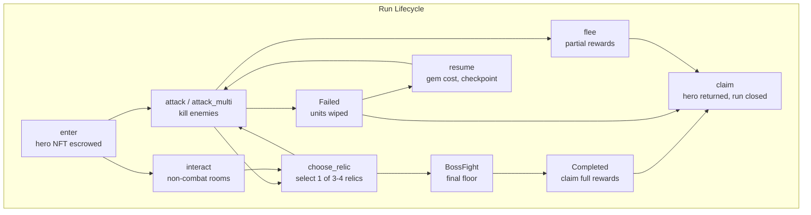
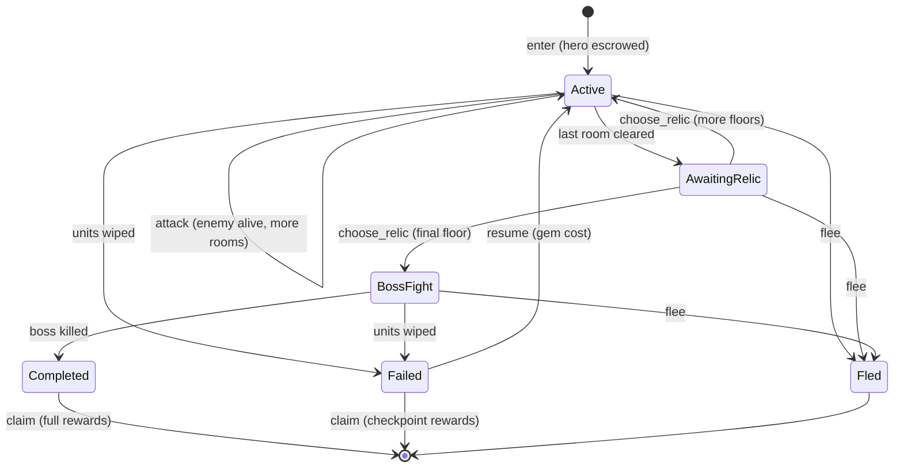
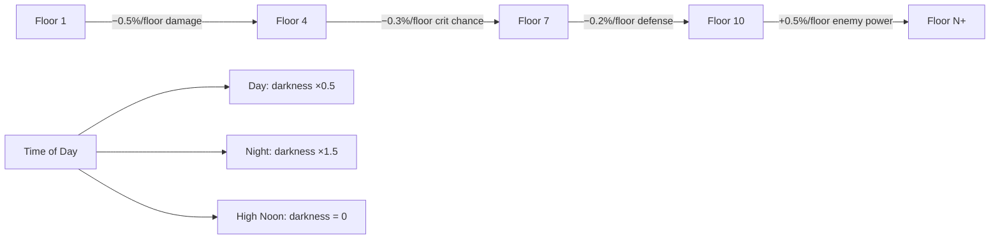
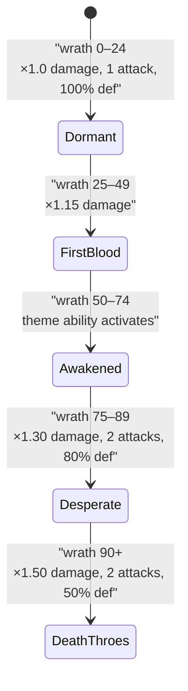
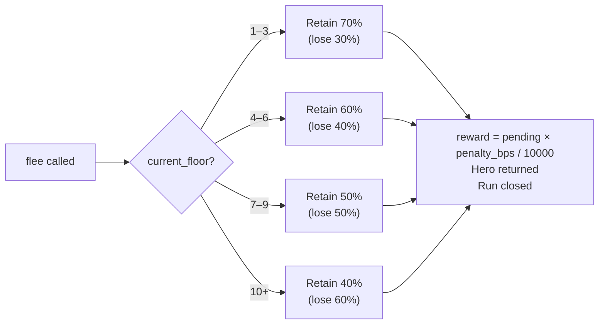
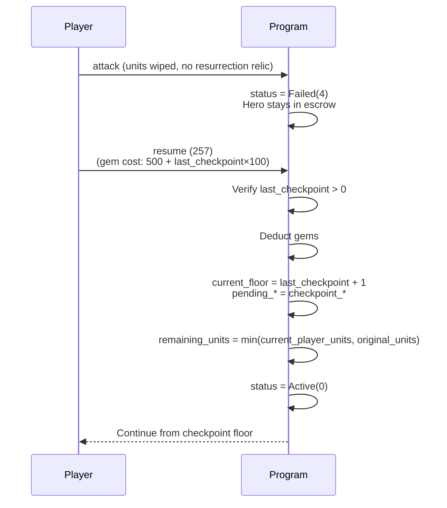

# Dungeon System

> The Catacombs — a solo roguelike PvE experience with multi-floor progression, a 20-relic collection, darkness escalation, and weekly leaderboards.

## System Overview

Players enter a dungeon by committing a champion hero NFT (transferred to the `DungeonRun` PDA as escrow) and a snapshot of their defensive army. They clear rooms floor by floor, choose relics between floors, and either reach the boss to claim full rewards or flee with a penalty. Darkness intensifies with each floor, imposing stacking penalties that synergy relics can mitigate. A weekly leaderboard rewards the fastest full-clear scores with NOVI prizes.



## Instructions

| ID  | Instruction | Signers | Description |
|-----|-------------|---------|-------------|
| 250 | `enter` | owner | Enter dungeon; escrow hero NFT, create DungeonRun |
| 251 | `attack` | owner, game_authority | Single attack on current combat room |
| 252 | `attack_multi` | owner, game_authority | Up to 5 attacks in one transaction |
| 253 | `interact` | owner, game_authority | Non-combat room interaction (treasure/camp/rest/trap) |
| 254 | `choose_relic` | owner, game_authority | Select relic after floor clear |
| 255 | `flee` | owner | Exit with partial rewards; hero returned |
| 256 | `claim` | owner | Collect rewards; close run; return hero |
| 257 | `resume` | owner | Restart from last checkpoint (gem cost) |
| 258 | `create_template` | dao_authority | DAO creates a dungeon definition |
| 259 | `claim_leaderboard_prize` | owner | Claim weekly leaderboard NOVI prize |
| 260 | `create_leaderboard` | — | Create a weekly leaderboard account |

[Source: processor/dungeon/](../../../programs/novus_mundus/src/processor/dungeon/)

---

## Accounts

### DungeonTemplate

**PDA:** `["dungeon_template", dungeon_id:u16 LE]`
DAO-created and immutable after creation. Defines all dungeon parameters.

Key fields: `dungeon_id`, `theme` (u8), `total_floors` (u8), `rooms_per_floor` (u8), `checkpoint_interval` (u8), `min_player_level`, `required_building_level`, `stamina_cost` (u16), `boss_power_multiplier` (u16, e.g. 25000 = 2.5×), `name` ([u8; 32]), `floor_power` ([u32; 10]), room type weights, darkness config, time limit, and reward parameters.

**Room weight defaults:** Combat 60%, Treasure 15%, Camp 10%, Rest 10%, Trap 5%.

### DungeonRun

**PDA:** `["dungeon_run", player_account_pda]`

> **Note:** The seed uses the **PlayerAccount PDA**, not the player's wallet. This is consistent across all dungeon instructions.

One run at a time per player. Created at `enter`, closed at `claim` or `flee`.

Key fields: `player` (PlayerAccount PDA), `hero_mint`, `dungeon_id`, `status`, `current_floor`, `current_room`, `room_type`, `last_checkpoint`, `enemy_health / enemy_max_health / enemy_power / enemy_defense / is_boss`, `boss_wrath / boss_ability_active / boss_ability_counter / boss_shield`, `remaining_units [3]`, `original_units [3]`, `remaining_weapons [3]`, `relic_mask` (u32 bitmask), `darkness_level`, `pending_xp / pending_novi / pending_gems / pending_materials`, `checkpoint_xp / checkpoint_novi / checkpoint_gems`, `started_at`, `camp_bonus_bps / camp_expires_floor`, `xp_building_bonus_bps`, `novi_building_bonus_bps`.

**DungeonStatus enum:**



| Value | Name | Description |
|-------|------|-------------|
| 0 | `Active` | In a combat or non-combat room |
| 1 | `AwaitingRelic` | Floor cleared; awaiting relic choice |
| 2 | `BossFight` | On final floor boss |
| 3 | `Completed` | Boss killed on final floor |
| 4 | `Failed` | All units wiped |
| 5 | `Fled` | Player called `flee` |

> **Note:** The old documentation listed only 3 statuses (Active/Completed/Failed). The actual enum has 6 values including `AwaitingRelic`, `BossFight`, and `Fled`.

### DungeonLeaderboard

**PDA:** `["dungeon_leaderboard", game_engine, dungeon_id:u16 LE, week_number:u16 LE]`

> **Note:** The seed uses `week_number` as **u16**, not u32. `week_number = unix_timestamp / (7 × 86400)`.

Kingdom-scoped weekly leaderboard. Tracks top-10 scores. Prize pool distributed per `PRIZE_DISTRIBUTION = [3500, 2500, 1500, 750, 750, 200, 200, 200, 200, 200]` bps.

**Score formula:**
```
score = floors_cleared × 10000
      + enemies_killed × 100
      + relics_collected × 500
      − time_seconds
      + (50000 if full_clear)
```

---

## Entry Requirements

```mermaid
flowchart TD
    A[Player calls enter] --> B{Level >=<br/>min_player_level?}
    B -->|No| FAIL[Rejected]
    B -->|Yes| C{Stamina >=<br/>stamina_cost?}
    C -->|No| FAIL
    C -->|Yes| D{"DungeonEntry building<br/>>= required_level?"}
    D -->|No| FAIL
    D -->|Yes| E{At least<br/>1 defensive unit?}
    E -->|No| FAIL
    E -->|Yes| F{Not traveling<br/>or in rally?}
    F -->|No| FAIL
    F -->|Yes| G{No existing run<br/>(lamports == 0)?}
    G -->|No| FAIL
    G -->|Yes| H[Escrow hero NFT<br/>Snapshot units + weapons<br/>Create DungeonRun]
```

| Check | Source |
|-------|--------|
| Player level ≥ template `min_player_level` | PlayerAccount |
| Stamina ≥ template `stamina_cost` | PlayerAccount.encounter_stamina |
| **DungeonEntry** building ≥ template `required_building_level` | EstateAccount |
| At least 1 defensive unit | PlayerAccount |
| Not traveling or in rally | PlayerAccount flags |

Building bonuses snapshotted at entry (stored in DungeonRun):
- **Academy** building: XP bonus = `level × 5%`, capped at **25%**
- **Treasury** building: NOVI bonus = `level × 5%`, capped at **25%**

> **Note:** The entry gate is the **DungeonEntry** building — not "Catacombs". Old documentation used the wrong building name.

At entry, a champion hero NFT is transferred from the player's wallet to the `DungeonRun` PDA via MPL Core `TransferV1`. Defensive units and weapons are snapshotted into `remaining_units` and `remaining_weapons`.

---

## Room Types

| Byte | Name | Effect |
|------|------|--------|
| 0 | `Combat` | Fight an enemy; `attack` / `attack_multi` |
| 1 | `Treasure` | 2× loot multiplier; gain gems + materials |
| 2 | `Camp` | Abandoned camp: temporary attack buff this floor |
| 3 | `Rest` | Heal **20%** of lost units |
| 4 | `Trap` | Take 10% of total unit HP as damage; gain **1.5× XP** |

> **Note:** There is no "BossRoom" or "Exit" room type in the enum. The boss is a combat room on the final floor triggered by `choose_relic` advancing to `total_floors`. The old documentation listed these incorrectly.

---

## Combat System

### Unit & Weapon Power

```
DUNGEON_UNIT_POWER  = [15, 35, 80]  (tier 1 / 2 / 3)
DUNGEON_UNIT_HEALTH = [100, 250, 600]

player_damage = (unit_power + weapon_power) × buffs
```

> **Note:** DUNGEON_UNIT_POWER values are 15/35/80 — NOT 10/25/60. The values 10/25/60 are the **arena** constants (`DEFENSIVE_UNIT_1/2/3_POWER`), separate from dungeon power.

### Damage Pipeline

```mermaid
flowchart TD
    subgraph "Player Damage Out"
        P1["base = unit_power_sum + total_remaining_weapons"] --> P2[Apply hero attack buff]
        P2 --> P3["Apply relic attack bonus (relics 0, 12, 17)"]
        P3 --> P4[Apply OFFENSE synergy bonus]
        P4 --> P5["Darkness penalty (−0.5%/floor from floor 1)"]
        P5 --> P6[Apply time-of-day modifier]
        P6 --> P7["Boss reduction relics/synergy (if boss)"]
        P7 --> P8["Camp buff (if active)"]
        P8 --> P9["Warrior +20% / Guardian −15%"]
        P9 --> P10["Hero-effectiveness relic 9 (+25%)"]
        P10 --> P11["Crit: 150% base + relic/synergy bonuses"]
    end

    subgraph "Damage Taken"
        D1["base = enemy_power"] --> D2[Apply player research defense]
        D2 --> D3["Relic defense (relics 1, 8; relics 12/17 add penalty)"]
        D3 --> D4[Apply DEFENSE synergy bonus]
        D4 --> D5["Darkness defense penalty (−0.2%/floor from floor 7)"]
        D5 --> D6["Guardian survival bonus (−25% damage taken)"]
        D6 --> D7["One-shot immunity relic 13: cap at total_hp − 1"]
    end
```



Damage pipeline:
1. `base = unit_power_sum + total_remaining_weapons`
2. Apply hero attack buff (PlayerAccount cached value)
3. Apply relic attack bonus (relics 0, 12, 17)
4. Apply OFFENSE synergy bonus
5. Apply darkness damage penalty (−0.5% per floor from floor 1)
6. Apply time-of-day modifier
7. Apply boss reduction relics/synergy (if boss)
8. Apply camp buff (if active)
9. Apply Warrior spec (+20%) or Guardian spec (−15%)
10. Apply hero-effectiveness relic (id 9, +25%)
11. Apply crit multiplier (150% base + relic/synergy bonuses)

Damage taken pipeline:
1. Base = `enemy_power`
2. Apply player research defense bps
3. Apply relic defense bonus (relics 1, 8; relic 12 and 17 add penalties)
4. Apply DEFENSE synergy bonus
5. Apply darkness defense penalty (−0.2%/floor from floor 7)
6. Guardian survival bonus (−25% damage taken)
7. One-shot immunity relic (relic 13): damage capped at `total_hp − 1`

### Floor Reward Multipliers

```
DUNGEON_FLOOR_MULTIPLIERS = [10000, 12000, 14400, 17280, 20736, 24883, 29860, 35832, 42998, 51598]
// (×10000 precision; floor N = 1.2^N)
```

XP per room = `base_xp_per_room × floor_multiplier / 10000`
NOVI per floor = `base_novi_per_floor × floor_multiplier / 10000 × (2 if relic 15 "double-NOVI")`

---

## Darkness Escalation



Darkness penalties apply per floor and stack cumulatively. All values in basis points (10000 = 100%).

| Effect | Rate | Start Floor |
|--------|------|-------------|
| Player damage penalty | −50 bps/floor | Floor 1 |
| Player crit chance penalty | −30 bps/floor | Floor 4 |
| Player defense penalty (extra damage taken) | −20 bps/floor | Floor 7 |
| Enemy power buff | +50 bps/floor | Floor 10 |

Time-of-day modifies darkness:
- **Day:** Darkness ×0.5 (halved)
- **Night:** Darkness ×1.5 (+50%)
- **High Noon (Midday):** Darkness = 0 (nullified)

---

## Relic System

20 relics (IDs 0–19), tracked via `relic_mask: u32` bitmask. Chosen one-per-floor from 3 options (4 during Dawn or with relic 19 "META"). Cannot duplicate a relic.

### Relic Catalog

| ID | Effect | Synergy Tag |
|----|--------|-------------|
| 0 | +15% attack | OFFENSE |
| 1 | +10% damage reduction | DEFENSE |
| 2 | +20% crit chance | CRIT |
| 3 | +30% crit damage | CRIT |
| 4 | 5% lifesteal | SUSTAIN |
| 5 | −30% darkness effects | DARKNESS |
| 6 | +25% loot | LOOT |
| 7 | −15% boss power | BOSS |
| 8 | +15% unit survival | DEFENSE |
| 9 | +25% hero effectiveness | HERO |
| 10 | Guaranteed rare find (+50% gems in treasure) | LOOT |
| 11 | One-time resurrection (25% of original units) | SUSTAIN |
| 12 | +30% attack, +15% damage taken | OFFENSE |
| 13 | Cannot be one-shot (min 1 unit survives per hit) | DEFENSE |
| 14 | 15% double-attack chance (backend-validated) | OFFENSE |
| 15 | 2× NOVI per floor | LOOT |
| 16 | Immune to darkness crit penalty | DARKNESS |
| 17 | +50% attack, −30% defense | OFFENSE |
| 18 | +40% attack when below 50% units | SUSTAIN |
| 19 | +1 relic choice (flag, backend-handled) | META |

### Synergy Bonuses

9 synergy tags (OFFENSE=0 … META=8). 2-piece and 3-piece thresholds:

| Tag | 2-piece bonus | 3-piece bonus | 3-piece special |
|-----|---------------|---------------|-----------------|
| OFFENSE | +10% attack | +25% attack | +10% crit chance |
| DEFENSE | +15% defense | +30% defense | +10% unit HP |
| CRIT | +15% crit damage | +40% crit damage | Crits heal 2% |
| SUSTAIN | +5% lifesteal | +10% lifesteal | +20% heal effectiveness |
| DARKNESS | −20% darkness | Immune (100%) | — |
| LOOT | +20% loot | +50% loot | +1 boss drop |
| BOSS | −10% boss power | −25% boss power | +15% damage to boss |
| HERO | +10% hero effectiveness | +20% hero effectiveness | — |
| META | — | — | — |

Tactician hero specialization applies +30% to all relic effects.

---

## Hero Specializations

| Value | Name | Bonuses |
|-------|------|---------|
| 0 | Warrior | +20% attack, −10% healing received |
| 1 | Guardian | +25% damage reduction, −15% damage dealt |
| 2 | Scout | −25% darkness effects, +15% loot |
| 3 | Tactician | +30% to all relic effects |

---

## Boss Wrath System



Boss wrath = `damage_taken × 100 / max_hp`. Thresholds:

| Wrath | Name | Boss Damage | Boss Attacks | Boss Defense |
|-------|------|-------------|--------------|--------------|
| 0–24 | Dormant | ×1.0 | 1 | 100% |
| 25–49 | First Blood | ×1.15 | 1 | 100% |
| 50–74 | Awakened | Theme ability activates | 1 | 100% |
| 75–89 | Desperate | ×1.30 | 2 | 80% |
| 90+ | Death Throes | ×1.50 | 2 | 50% |

DEFENSE 3-piece halves wrath damage bonuses. BOSS 3-piece negates the theme ability entirely.

**Theme abilities (trigger at wrath 50):**

| Theme | Ability |
|-------|---------|
| RadiantWeakness | Soul Harvest: Boss heals 20% of damage dealt |
| FastMobs | Blood Frenzy: 3 attacks that pierce all defense |
| DarknessVulnerable | Abyssal Rift: Darkness effects ×3 |
| ArmoredMobs | Iron Shell: 30% max-HP shield absorbs damage first |

---

## Flee Mechanics

`flee` accepts any active `DungeonStatus` (not ended).



```
DUNGEON_FLEE_PENALTY_BPS = [7000, 6000, 5000, 4000]
// indices: floor 1–3, 4–6, 7–9, 10+
```

These values are the **fraction of pending rewards the player KEEPS** (70%, 60%, 50%, 40%). The remainder is forfeit. Checkpoint rewards are NOT used on flee — only `pending_*` fields.

> **Note:** The old documentation described these values as "penalty percentages lost". They are retention percentages: floor 1–3 keeps 70% (loses 30%), not loses 70%.

---

## Checkpoint & Resume



Checkpoints are saved every `checkpoint_interval` floors (configurable per template). On reaching a checkpoint floor, `checkpoint_xp / checkpoint_novi / checkpoint_gems` are snapped from `pending_*` values.

`resume` (instruction 257):
- Only from `Failed` status with a valid checkpoint
- Gem cost: `500 + (last_checkpoint × 100)`
- Resets floor to `last_checkpoint + 1`
- Restores `remaining_units = min(current_player_units, original_units)` — cannot exceed entry snapshot
- Restores weapons to current player values
- Resets `pending_*` to checkpoint values

---

## Time of Day

Time period is snapshotted at dungeon entry and stored in `DungeonRun.time_period`.

| Period | Darkness | Enemy Power | XP | NOVI | Treasure |
|--------|----------|-------------|-----|------|----------|
| Dawn | ×0.75 | ×0.90 | +15% | — | — |
| Day | ×0.50 | ×1.0 | — | — | — |
| Dusk | ×1.0 | ×1.10 | — | — | ×2.0 gems |
| Night | ×1.50 | ×1.15 | — | +25% | — |

**First Light** (06:00–06:30 UTC): +50% XP bonus.
**High Noon (Midday)**: Darkness = 0.

---

## Weekly Leaderboard

Scores submitted automatically on `claim` for `Completed` runs. Players must pass the optional leaderboard account to `claim`.

Prizes use `PRIZE_DISTRIBUTION = [3500, 2500, 1500, 750, 750, 200, 200, 200, 200, 200]` bps of the leaderboard's `prize_pool`. Claimed via `claim_leaderboard_prize` (instruction 259).

---

## Client Integration

```typescript
import { PublicKey } from "@solana/web3.js";

// DungeonRun PDA uses PlayerAccount PDA as seed
const [dungeonRunPda] = PublicKey.findProgramAddressSync(
  [Buffer.from("dungeon_run"), playerAccountPda.toBuffer()],
  PROGRAM_ID
);

// DungeonTemplate PDA
function deriveTemplatePda(dungeonId: number) {
  const idBuf = Buffer.allocUnsafe(2);
  idBuf.writeUInt16LE(dungeonId);
  const [pda] = PublicKey.findProgramAddressSync(
    [Buffer.from("dungeon_template"), idBuf],
    PROGRAM_ID
  );
  return pda;
}

// Weekly leaderboard PDA
function deriveLeaderboardPda(gameEngine: PublicKey, dungeonId: number, weekNumber: number) {
  const idBuf = Buffer.allocUnsafe(2);
  idBuf.writeUInt16LE(dungeonId);
  const wkBuf = Buffer.allocUnsafe(2);
  wkBuf.writeUInt16LE(weekNumber);   // u16, not u32
  const [pda] = PublicKey.findProgramAddressSync(
    [Buffer.from("dungeon_leaderboard"), gameEngine.toBuffer(), idBuf, wkBuf],
    PROGRAM_ID
  );
  return pda;
}

const currentWeek = Math.floor(Date.now() / 1000 / (7 * 86400));

// Check active run
async function getRunStatus(connection, dungeonRunPda) {
  const data = await connection.getAccountInfo(dungeonRunPda);
  if (!data || data.lamports === 0) return { active: false };
  const run = decodeDungeonRun(data.data);
  return {
    active: true,
    floor: run.currentFloor,
    status: run.status,
    relics: run.relicMask.toString(2).padStart(20, "0"),
    pendingNovi: run.pendingNovi,
  };
}
```

---

*Descend deeper to earn more. Every floor adds darkness — every relic pushes back.*

---

Next: [Castle](./castle.md)
