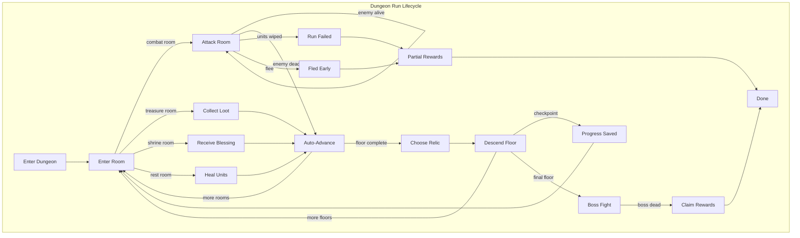
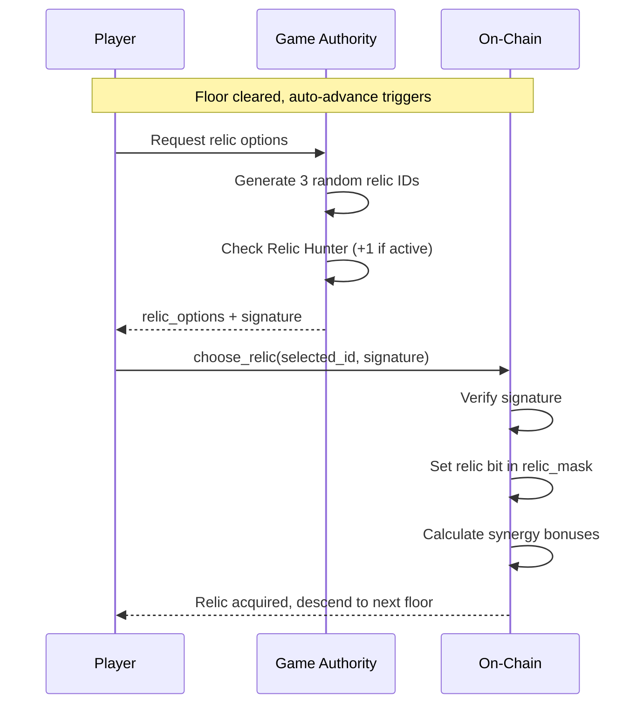

# Dungeon System: The Catacombs

> Solo roguelike dungeon experience with multi-floor progression, relic collection, and boss fights.

## Overview

Dungeons are **active multi-stage combat sessions** where players descend through floors of increasing difficulty. Unlike encounters (single fights) or expeditions (passive journeys), dungeons require continuous engagement with meaningful choices between floors.



## Key Principles

| Principle | Description |
|-----------|-------------|
| **Solo PvE** | Single player experience, no coordination needed |
| **Persistent Run** | Progress saved at checkpoints, partial progress on failure |
| **Champion Hero** | ONE hero locked in escrow for entire run |
| **Roguelike Relics** | Random buff choices between floors with synergies |
| **Darkness Mechanic** | Escalating effects as you descend deeper |
| **Risk vs Reward** | Flee early for partial rewards or push for full clear |
| **Auto-Advance** | Seamless progression when rooms are cleared |

---

## Dungeon Structure

### Floors and Rooms

```
Dungeon (5-10 floors)
├── Floor 1 (3-5 rooms)
│   ├── Room 1: Combat - Common enemy
│   ├── Room 2: Treasure - Bonus loot
│   └── Room 3: Combat - Elite enemy
│   → Choose Relic
├── Floor 2 (3-5 rooms)
│   ├── Room 1: Combat - Common enemy
│   ├── Room 2: Shrine - Temporary buff
│   └── Room 3: Combat - Elite enemy
│   → Choose Relic
├── Floor 3 (CHECKPOINT - progress saved)
│   ├── Room 1: Combat - Elite enemy
│   ├── Room 2: Rest - Heal units
│   └── Room 3: Combat - Elite enemy
│   → Choose Relic
├── ...
└── Final Floor
    ├── Room 1: Combat - Elite enemy
    ├── Room 2: Combat - Elite enemy
    └── Room 3: BOSS (multi-phase)
    → Claim Rewards
```

### Room Types

| Type | Frequency | Description |
|------|-----------|-------------|
| **Combat** | 60% | Standard enemy encounter |
| **Treasure** | 15% | Bonus gems/materials, no combat |
| **Shrine** | 10% | Temporary buff for current floor |
| **Rest** | 10% | Heal 20% of lost units |
| **Trap** | 5% | Take damage but gain bonus XP |

### Checkpoints

Progress is saved every **3 floors** (configurable per dungeon):

```
Floor 3:  Checkpoint 1 - If you fail after this, you restart at Floor 3
Floor 6:  Checkpoint 2 - Restart at Floor 6
Floor 9:  Checkpoint 3 - Restart at Floor 9
```

Checkpoints save:
- Current floor and room
- Collected relics
- Accumulated rewards (locked in)
- Remaining units

### Enemy Scaling

```
enemy_power = base_power × (1.15 ^ floor)  // Exponential scaling

Floor 1:  Power 100
Floor 5:  Power 201 (2x harder)
Floor 10: Power 405 (4x harder)

Boss: enemy_power × boss_multiplier (typically 2.5x)
```

Enemy power is **precomputed** in DungeonTemplate for each floor, avoiding on-chain math complexity.

---

## Combat System

Dungeon combat **reuses the existing encounter combat pipeline** with optimizations for multi-room efficiency.

### Attack Modes

#### Single Attack (`attack_room`)
Standard attack - deals damage once, enemy counterattacks.

#### Multi-Attack (`attack_room_multi`)
Execute up to **5 attacks** in a single transaction:

```rust
// Instruction: attack_room_multi
// Data: [attacks: u8] - number of attacks (1-5)

for _ in 0..attacks {
    deal_damage_to_enemy();
    if enemy.health == 0 {
        break; // Stop early if enemy dies
    }
    apply_counterattack();
}
```

Benefits:
- Reduces transaction count by 5x
- Lower total fees for players
- Faster dungeon clear times

#### Auto-Advance on Kill

When an enemy dies during `attack_room` or `attack_room_multi`:

```rust
// Automatic sequence when enemy_health reaches 0:
1. Grant room rewards (XP, loot)
2. Increment enemies_killed
3. If more rooms on floor:
   - Advance to next room
   - Auto-spawn next enemy (if combat room)
   - Set room_type for non-combat rooms
4. If floor complete:
   - Set status = AwaitingRelic
   - Player must call choose_relic to continue
```

This eliminates the need for separate `advance_room` and `spawn_room` calls in most cases.

### Damage Calculation

```
1. Base damage = units + weapons (melee/ranged/siege)
2. Apply champion hero buffs
3. Apply research buffs (attack, crit)
4. Apply Barracks daily bonus (unit effectiveness)
5. Apply relic bonuses (collected during run)
6. Apply relic synergy multipliers
7. Apply darkness penalty (escalating effects)
8. Calculate enemy defense reduction
9. Final damage dealt to enemy
```

### Counterattack (Enemy Damages Player)

```
enemy_damage = enemy_power × base_damage_factor
reduced_damage = enemy_damage × (10000 - player_defense) / 10000
unit_casualties = reduced_damage / unit_health_per_tier

Player units can be damaged/killed during the run.
Units are NOT permanently lost - they recover after the run ends.
```

### Unit Survival

During a dungeon run, your units can take damage:

| Unit Tier | Health | Power |
|-----------|--------|-------|
| Tier 1 | 100 HP | 10 |
| Tier 2 | 250 HP | 25 |
| Tier 3 | 600 HP | 60 |

If all units are wiped:
- **Before checkpoint**: Run fails, restart from beginning with 25% rewards
- **After checkpoint**: Restart from last checkpoint with 50% rewards

---

## Darkness Mechanic

**Darkness** is a dungeon-specific debuff with **escalating effects** as you descend deeper.

### Escalating Effects

| Floor Range | Darkness Level | Effects |
|-------------|----------------|---------|
| 1-3 | Low | -5% damage per floor |
| 4-6 | Medium | -5% damage, -3% crit chance per floor |
| 7-9 | High | -5% damage, -3% crit, -2% defense per floor |
| 10+ | Abyssal | All above + enemies gain +5% power per floor |

### Darkness Calculation

```
base_penalty_bps = floor × 50  // 0.5% per floor base

// Additional effects based on darkness tier
if floor >= 4:
    crit_penalty_bps = (floor - 3) × 30  // 0.3% crit loss
if floor >= 7:
    defense_penalty_bps = (floor - 6) × 20  // 0.2% defense loss
if floor >= 10:
    enemy_power_bonus_bps = (floor - 9) × 50  // 0.5% enemy buff
```

### Mitigation

| Source | Effect |
|--------|--------|
| Observatory building | -1 darkness level per 1 building levels |
| Shadow Cloak relic | -30% all darkness effects |
| Torch Bearer relic | Immunity to crit penalty |
| Champion with Night Vision | -50% darkness damage penalty |

---

## Relic System

Between each floor, players choose **1 of 3 random relics**. Relics stack and persist for the entire run.

### Available Relics (20 total)

| ID | Relic | Effect | Synergy Tag |
|----|-------|--------|-------------|
| 0 | Warrior's Fury | +15% attack damage | OFFENSE |
| 1 | Iron Skin | +10% damage reduction | DEFENSE |
| 2 | Swift Blade | +20% crit chance | CRIT |
| 3 | Executioner | +30% crit damage | CRIT |
| 4 | Vampiric Touch | Heal 5% of damage dealt | SUSTAIN |
| 5 | Shadow Cloak | -30% darkness effects | DARKNESS |
| 6 | Fortune's Favor | +25% loot bonus | LOOT |
| 7 | Time Dilation | -15% boss power | BOSS |
| 8 | Unit Rally | +15% unit survival | DEFENSE |
| 9 | Hero's Blessing | +25% hero buff effectiveness | HERO |
| 10 | Treasure Sense | Guaranteed rare find on boss | LOOT |
| 11 | Phoenix Feather | One-time full unit resurrection | SUSTAIN |
| 12 | Berserker | +30% attack, +15% damage taken | OFFENSE |
| 13 | Stalwart | Cannot be one-shot, min 1 unit survives | DEFENSE |
| 14 | Double Strike | 15% chance for double attack | OFFENSE |
| 15 | Golden Touch | 2x NOVI rewards | LOOT |
| 16 | Torch Bearer | Immune to darkness crit penalty | DARKNESS |
| 17 | Glass Cannon | +50% attack, -30% defense | OFFENSE |
| 18 | Blood Pact | +40% attack when below 50% units | SUSTAIN |
| 19 | Relic Hunter | +1 relic choice per floor | META |

### Relic Synergies

Collecting multiple relics with the same tag grants bonus effects:

| Tag | 2 Relics | 3 Relics |
|-----|----------|----------|
| **OFFENSE** | +10% attack | +25% attack, +10% crit |
| **DEFENSE** | +15% defense | +30% defense, +10% unit health |
| **CRIT** | +15% crit damage | +40% crit damage, crits heal 2% |
| **SUSTAIN** | +5% lifesteal | +10% lifesteal, +20% heal effectiveness |
| **DARKNESS** | -20% darkness | Immune to darkness (all effects) |
| **LOOT** | +20% loot | +50% loot, +1 boss drop |
| **BOSS** | -10% boss power | -25% boss power, boss takes +15% damage |

### Relic Selection Flow



---

## Champion Hero System

Dungeons use a **hard lock** Champion system - the hero NFT is transferred to escrow for the duration of the run.

### How It Works

1. **Selection**: Player selects a hero when entering the dungeon
2. **Transfer to Escrow**: Hero NFT is transferred to the DungeonRun PDA
3. **Locked**: Hero cannot be used for ANY other activity while in dungeon
4. **Buffs**: Only the champion's buffs apply during the run
5. **Return**: Hero is transferred back when run ends (success, failure, or flee)

### Why Hard Lock (Escrow)?

- **True exclusivity**: Hero physically locked, impossible to exploit elsewhere
- **Meaningful commitment**: Player must commit their best hero
- **Consistent with other systems**: Matches how rallies and expeditions work
- **Clear ownership**: DungeonRun PDA holds the hero, no ambiguity

### Safety Mechanisms

- **Auto-return on failure**: If run fails, hero is automatically returned
- **Flee always available**: Player can always flee to get hero back
- **Time limit protection**: If time_limit expires, hero can be reclaimed
- **Admin recovery**: DAO can force-return stuck heroes (emergency only)

### Champion Specialization

Different hero traits excel in different dungeon types:

| Dungeon Theme | Best Traits |
|---------------|-------------|
| Crypts (undead) | Holy damage, Radiant aura |
| Caverns (beasts) | Beast slayer, Trap detection |
| Abyss (demons) | Demon bane, Darkness resistance |
| Forge (constructs) | Siege specialist, Armor pierce |

---

## Building: Catacombs

A new estate building that unlocks and enhances dungeon gameplay.

### Building Stats

| Level | Unlock | Bonuses |
|-------|--------|---------|
| 1-4 | Tier 1 dungeons | +5% dungeon XP |
| 5-9 | Tier 2 dungeons | +10% XP, +5% loot |
| 10-14 | Tier 3 dungeons | +15% XP, +10% loot |
| 15-19 | Tier 4 dungeons | +20% XP, +15% loot, +1 checkpoint |
| 20 | All dungeons | +25% XP, +20% loot, +1 relic choice |

### Other Building Synergies

| Building | Dungeon Bonus |
|----------|---------------|
| Barracks | Unit effectiveness applies to dungeon combat |
| Observatory | Loot bonus + reduces darkness levels |
| Treasury | Bonus NOVI on completion |
| Sanctuary | Champion hero buff strength |
| Armory | +10% damage per 5 levels |
| Infirmary | +5% unit survival per 5 levels |

---

## Rewards

### Exponential Scaling

Rewards scale exponentially to incentivize deeper progression:

```
floor_multiplier = 1.2 ^ floor

Floor 1:  1.0x rewards
Floor 5:  2.5x rewards
Floor 10: 6.2x rewards
```

### Per-Room Rewards

```
room_xp = base_xp × floor_multiplier
room_loot = random materials/gems based on enemy type × floor_multiplier

Treasure rooms: 2x loot bonus
Shrine rooms: Temporary buff (no loot)
Rest rooms: Unit healing (no loot)
Trap rooms: 1.5x XP bonus
```

### Per-Floor Rewards

```
floor_novi = base_novi × floor_multiplier
floor_bonus = accumulated room rewards
```

### Completion Rewards

```
completion_bonus = total_rewards × completion_bonus_bps / 10000

Final rewards multiplied by:
- Observatory bonus (5-60%)
- Treasury bonus (10-50%)
- Catacombs bonus (5-25%)
- Golden Touch relic (2x if active)
- LOOT synergy bonus (up to +50%)
```

### Flee/Failure Penalties (Scaling)

Flee penalty increases the deeper you go (more risk = more reward):

| Outcome | Floor 1-3 | Floor 4-6 | Floor 7-9 | Floor 10+ |
|---------|-----------|-----------|-----------|-----------|
| Full clear | 100% + bonus | 100% + bonus | 100% + bonus | 100% + bonus |
| Fled early | 70% | 60% | 50% | 40% |
| Failed (pre-checkpoint) | 25% | 25% | 25% | 25% |
| Failed (post-checkpoint) | 50% | 50% | 50% | 50% |

---

## Leaderboards

Weekly leaderboards track the fastest dungeon clears.

### Scoring

```
score = floors_cleared × 10000
      + enemies_killed × 100
      + (relics_collected × 500)
      - time_seconds
      + (full_clear_bonus ? 50000 : 0)

Higher score = better rank
```

### Prize Distribution

| Rank | Share |
|------|-------|
| 1st | 40% |
| 2nd | 20% |
| 3rd | 13% |
| 4th | 9% |
| 5th | 6% |
| 6th | 4% |
| 7th | 3% |
| 8th | 2% |
| 9th | 2% |
| 10th | 1% |

---

## Instructions

| # | Instruction | Description |
|---|-------------|-------------|
| 240 | `enter_dungeon` | Start a dungeon run, designate champion hero |
| 241 | `attack_room` | Deal damage once to room enemy (auto-advances on kill) |
| 242 | `attack_room_multi` | Deal 1-5 attacks in single tx (auto-advances on kill) |
| 243 | `interact_room` | Interact with non-combat rooms (treasure, shrine, rest) |
| 244 | `choose_relic` | Select relic between floors |
| 245 | `flee_dungeon` | Exit early with partial rewards |
| 246 | `claim_rewards` | Finish run and collect rewards |
| 247 | `resume_from_checkpoint` | Continue from last checkpoint after failure |

---

## State Accounts

### DungeonTemplate (Global, DAO-created)

```rust
struct DungeonTemplate {
    dungeon_id: u16,
    name: [u8; 32],
    theme: u8,              // 0=RadiantWeakness, 1=FastMobs, 2=DarknessVulnerable, 3=ArmoredMobs

    // Structure
    total_floors: u8,
    rooms_per_floor: u8,
    checkpoint_interval: u8, // Save progress every N floors

    // Requirements
    min_player_level: u8,
    required_building_level: u8,
    stamina_cost: u16,

    // Enemy Power (precomputed per floor)
    floor_power: [u32; 10],  // Power for floors 1-10
    boss_power_multiplier: u16,

    // Room type weights (bps, must sum to 10000)
    combat_weight: u16,      // Default: 6000 (60%)
    treasure_weight: u16,    // Default: 1500 (15%)
    shrine_weight: u16,      // Default: 1000 (10%)
    rest_weight: u16,        // Default: 1000 (10%)
    trap_weight: u16,        // Default: 500 (5%)

    // Darkness config
    darkness_base_bps: u16,
    darkness_per_floor_bps: u16,

    // Time limit (0 = unlimited)
    time_limit_seconds: u32,

    // Rewards
    base_xp_per_room: u64,
    base_novi_per_floor: u64,
    completion_bonus_bps: u16,
    reward_scaling_bps: u16,  // 1200 = 1.2x per floor
}
```

### DungeonRun (Per-player, temporary)

```rust
struct DungeonRun {
    // Identity
    player: Pubkey,
    dungeon_id: u16,
    bump: u8,

    // Progress
    status: u8,           // Active, AwaitingRelic, BossFight, Completed, Failed, Fled
    current_floor: u8,
    current_room: u8,
    room_type: u8,        // 0=Combat, 1=Treasure, 2=Shrine, 3=Rest, 4=Trap
    last_checkpoint: u8,  // Floor number of last checkpoint

    // Current enemy (for combat rooms)
    enemy_health: u64,
    enemy_max_health: u64,
    enemy_power: u32,
    enemy_defense: u16,
    is_boss: bool,

    // Run state
    remaining_units: [u64; 3],
    hero_assigned: Pubkey,
    relic_mask: u32,      // Expanded to 32 bits for 20+ relics
    synergy_mask: u8,     // Active synergy bonuses

    // Darkness tracking
    darkness_level: u8,
    darkness_mitigation: u8,

    // Accumulated rewards
    pending_xp: u64,
    pending_novi: u64,
    pending_gems: u64,
    pending_materials: u32,

    // Stats
    total_damage_dealt: u64,
    total_damage_taken: u64,
    enemies_killed: u16,
    relics_collected: u8,
    started_at: i64,

    // Checkpoint data
    checkpoint_xp: u64,
    checkpoint_novi: u64,
    checkpoint_gems: u64,
}
```

### DungeonLeaderboard (Weekly reset)

```rust
struct DungeonLeaderboard {
    dungeon_id: u16,
    week_number: u16,
    leaderboard: [LeaderboardEntry; 10],
    prize_pool: u64,
    claimed_mask: u16,
}
```

---

## Example Run

```
Player enters "Crypts of the Fallen" (Tier 2 dungeon)
├── Entry: 50 stamina consumed
├── Champion: "Shadow Assassin" hero transferred to escrow
│
├── Floor 1 (Power 100)
│   ├── Room 1 [Combat]: Skeleton Warrior → attack_room_multi(3) → CLEARED
│   │   └── Auto-advance triggered
│   ├── Room 2 [Treasure]: Bone Chest → interact_room → +50 gems
│   │   └── Auto-advance triggered
│   └── Room 3 [Combat]: Skeleton Knight → attack_room_multi(5) → CLEARED
│   └── Relic Choice: [Swift Blade, Iron Skin, Fortune's Favor]
│   └── Player picks: Swift Blade (+20% crit) [CRIT tag]
│
├── Floor 2 (Power 120, darkness = 1)
│   ├── Room 1 [Combat]: Zombie Horde → attack_room_multi(4) → CLEARED
│   ├── Room 2 [Shrine]: Ancient Altar → +15% attack for this floor
│   └── Room 3 [Combat]: Ghoul → attack_room_multi(3) → CLEARED
│   └── Relic Choice: [Executioner, Warrior's Fury, Shadow Cloak]
│   └── Player picks: Executioner (+30% crit dmg) [CRIT tag]
│   └── SYNERGY UNLOCKED: 2x CRIT = +15% crit damage bonus!
│
├── Floor 3 (CHECKPOINT SAVED - Power 144, darkness = 2)
│   ├── Room 1 [Combat]: Wraith → attack_room_multi(5) → CLEARED, lost 30 T1
│   ├── Room 2 [Rest]: Safe Haven → Healed 20% units (+6 T1)
│   └── Room 3 [Combat]: Banshee → attack_room_multi(4) → CLEARED
│   └── Relic Choice: [Swift Blade, Vampiric Touch, Treasure Sense]
│   └── Player picks: Swift Blade (another!) [CRIT tag]
│   └── SYNERGY UPGRADED: 3x CRIT = +40% crit dmg, crits heal 2%!
│
├── ... Floors 4-5 ...
│
└── Floor 5 (Boss floor, Power 201, darkness = 5)
    ├── Room 1 [Combat]: Elite Revenant → attack_room_multi(5) x2 → CLEARED
    ├── Room 2 [Combat]: Elite Banshee → attack_room_multi(5) x2 → CLEARED
    └── Room 3 [Boss]: Lich King (Power 502) → attack_room_multi(5) x5 → VICTORY!

Rewards (with 2.5x floor multiplier + synergies):
- 37,500 XP (base 15k × 2.5)
- 20,000 NOVI (base 8k × 2.5)
- 1,250 gems (base 500 × 2.5)
- 500 uncommon materials
- Building bonuses: +25% Observatory, +20% Treasury = +45%
- Final: 54,375 XP, 29,000 NOVI, 1,812 gems
- Leaderboard: Rank #3 (2:47 clear time, full clear bonus)
```

---

## Summary

| Feature | Value |
|---------|-------|
| Floors | 5-10 per dungeon |
| Rooms per floor | 3-5 (5 types) |
| Room types | Combat, Treasure, Shrine, Rest, Trap |
| Combat efficiency | Multi-attack (5 hits/tx), auto-advance |
| Relics | 20 available, synergy system |
| Relic synergies | 7 tags, 2-piece and 3-piece bonuses |
| Darkness | Escalating effects (damage, crit, defense, enemy power) |
| Champion | Hard lock (hero transferred to escrow) |
| Checkpoints | Every 3 floors, saves progress |
| Building | Catacombs (unlocks tiers, bonuses) |
| Reward scaling | Exponential (1.2x per floor) |
| Flee penalty | Scales with depth (70% → 40%) |
| Leaderboard | Weekly, top 10 |
| Instructions | 240-247 (8 total) |
