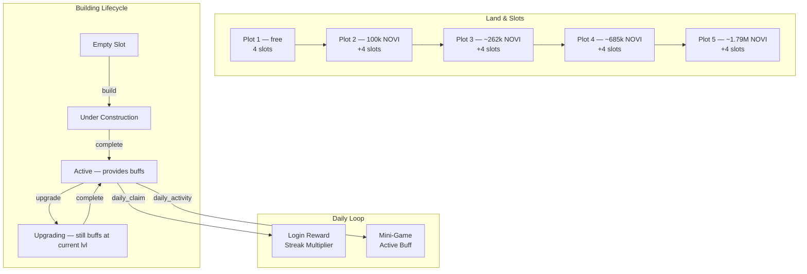
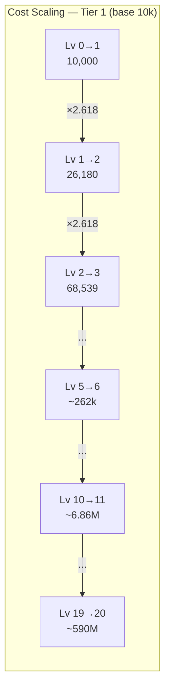
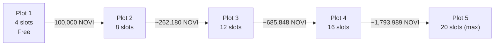
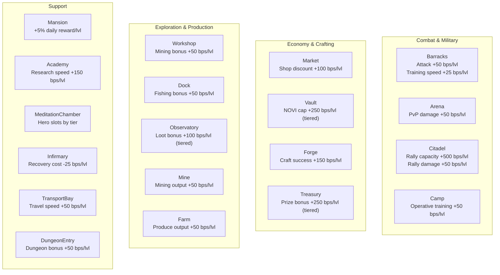
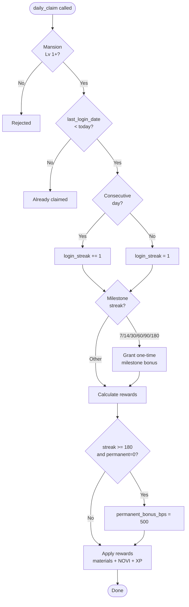
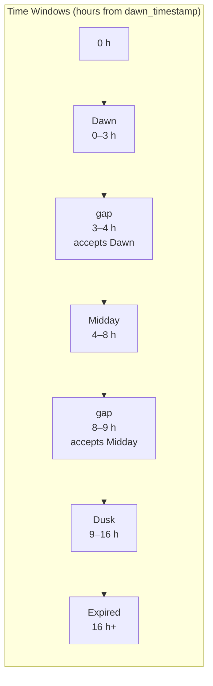
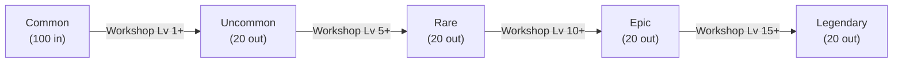
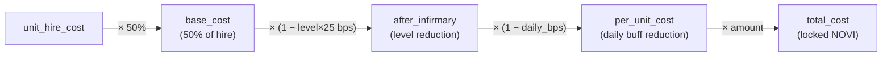
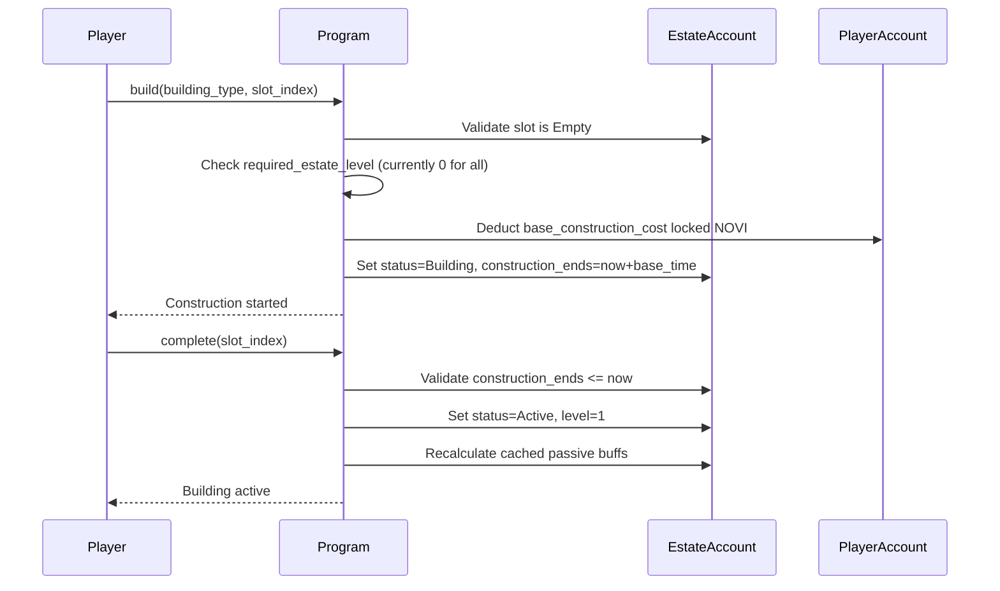

# Estate System

> Personal kingdoms — build, upgrade, and activate a city of 19 building types to amplify every dimension of play.

## System Overview

Each player owns exactly one Estate: a persistent PDA housing up to 20 building slots across 5 land plots. Buildings provide passive cached buffs, unlock daily mini-games that grant time-limited active buffs, and gate core game actions (hiring units, expeditions, research, hero management, crafting, and more).



## Instructions

| ID | Instruction | Description |
|----|-------------|-------------|
| 160 | `create_estate` | Create EstateAccount PDA for player (one-time) |
| 161 | `build` | Place a building in an empty slot (starts construction) |
| 162 | `upgrade` | Begin upgrading an active building to next level |
| 163 | `complete` | Finalise construction or upgrade after timer elapses |
| 164 | `buy_plot` | Purchase the next land plot, unlocking 4 new slots |
| 165 | `daily_claim` | Claim daily login reward from Mansion (streak-multiplied) |
| 166 | `daily_activity` | Submit mini-game score for a building (game_authority co-signs) |
| 167 | `convert_materials` | Refine 100 lower-tier materials into 20 higher-tier materials |
| 168 | `speedup` | Spend gems to reduce active construction/upgrade time |
| 169 | `recover_troops` | Heal wounded units via the Infirmary at discounted NOVI cost |

[Source: processor/estate/](../../../programs/novus_mundus/src/processor/estate/)

---

## Account Structure

### EstateAccount

**PDA:** `[ESTATE_SEED, player_account_address]` — seeds use the **player PDA** (not the wallet pubkey).

**Initial size:** `INITIAL_LEN` = header fields + 4 `BuildingSlot`s (1 plot × 4 slots). Grows by 36 bytes × 4 slots per plot via `buy_plot`.

```rust
pub struct EstateAccount {
    pub account_key: u8,            // discriminator
    pub owner: Address,             // player wallet
    pub city_id: u16,
    pub bump: u8,

    // Progression
    pub estate_level: u8,           // sum of all building levels
    pub plots_owned: u8,            // 1–5
    pub total_buildings: u8,        // non-empty slots
    pub current_slots: u8,          // usable slot capacity

    // Cached passive buffs (recalculated on building change)
    pub attack_bps: u16,
    pub defense_bps: u16,
    pub resource_gen_bps: u16,
    pub xp_gain_bps: u16,
    pub storage_bps: u16,
    pub training_speed_bps: u16,
    pub research_speed_bps: u16,
    pub craft_success_bps: u16,
    pub trade_discount_bps: u16,
    pub novi_cap_bonus_bps: u16,
    pub loot_bonus_bps: u16,
    pub prize_bonus_bps: u16,
    pub rally_capacity_bonus_bps: u16,
    pub pvp_damage_bps: u16,

    // Daily activity tracking
    pub last_login_date: u16,       // days since epoch
    pub login_streak: u16,
    pub longest_login_streak: u16,
    pub permanent_bonus_bps: u16,   // 500 at 180-day streak milestone
    pub daily_date: u16,
    pub dawn_timestamp: i64,        // first action of the day anchors time windows
    pub windows_completed: u8,      // bitflags: 0b00000DML
    pub dawn_buildings: u16,        // bitflags of buildings completed at Dawn
    pub midday_buildings: u16,
    pub dusk_buildings: u16,

    // Active daily buffs (reset each day)
    pub unit_effectiveness_bps: u16,
    pub mastery_bonus_bps: u16,
    pub arena_damage_bps: u16,
    pub daily_loot_bonus_bps: u16,
    pub market_discount_bps: u16,
    pub blessed_hero: Address,
    pub citadel_stance: u8,

    pub created_at: i64,
    pub last_activity: i64,

    // Expansion building daily buffs (buildings 16–18)
    pub camp_discount_bps: u16,
    pub stables_speed_bps: u16,
    pub infirmary_recovery_daily_bps: u16,
    pub expansion_daily: u8,        // bitflags for buildings 16+

    // Wounded unit counters (stored as [u8;4] for repr(C) alignment)
    pub wounded_def_1: [u8; 4],     // u32 via get/set_wounded_def_1()
    pub wounded_def_2: [u8; 4],
    pub wounded_def_3: [u8; 4],
    pub wounded_op_1: [u8; 4],
    pub wounded_op_2: [u8; 4],
    pub wounded_op_3: [u8; 4],

    // MUST BE LAST — expandable building array
    pub buildings: [BuildingSlot; 20],  // 20 × 36 = 720 bytes at full capacity
}
```

### BuildingSlot (36 bytes)

```rust
pub struct BuildingSlot {
    pub building_type: u8,           // BuildingType enum value
    pub status: u8,                  // 0=Empty, 1=Building, 2=Active, 3=Upgrading
    pub level: u8,                   // current level (1–20)
    pub mastery_level: u8,           // building-specific mastery (0–100)
    pub mastery_xp: u32,             // XP towards next mastery level
    pub construction_started: i64,
    pub construction_ends: i64,
    pub total_novi_invested: u64,
    pub _padding: [u8; 4],
}
```

`is_active()` returns `true` for both `Active` (2) and `Upgrading` (3) — upgrading buildings continue to provide buffs at their current level.

[Source: state/estate.rs](../../../programs/novus_mundus/src/state/estate.rs)

---

## Building Types (19 Total)

Buildings are assigned to one of three construction tiers that determine base NOVI cost and build time.

| ID | Name | Tier | Base Build Cost | Base Build Time |
|----|------|------|----------------|-----------------|
| 0 | Mansion | 1 | 10,000 NOVI | 4 h |
| 1 | Barracks | 1 | 10,000 NOVI | 4 h |
| 2 | Workshop | 1 | 10,000 NOVI | 4 h |
| 3 | Vault | 1 | 10,000 NOVI | 4 h |
| 4 | Dock | 1 | 10,000 NOVI | 4 h |
| 5 | Forge | 3 | 30,000 NOVI | 24 h |
| 6 | Market | 2 | 20,000 NOVI | 12 h |
| 7 | Academy | 2 | 20,000 NOVI | 12 h |
| 8 | Arena | 3 | 30,000 NOVI | 24 h |
| 9 | MeditationChamber | 2 | 20,000 NOVI | 12 h |
| 10 | Observatory | 3 | 30,000 NOVI | 24 h |
| 11 | Treasury | 3 | 30,000 NOVI | 24 h |
| 12 | Citadel | 2 | 20,000 NOVI | 12 h |
| 13 | Camp | 1 | 10,000 NOVI | 4 h |
| 14 | Mine | 2 | 20,000 NOVI | 12 h |
| 15 | DungeonEntry | 3 | 30,000 NOVI | 24 h |
| 16 | Farm | 1 | 10,000 NOVI | 4 h |
| 17 | TransportBay | 2 | 20,000 NOVI | 12 h |
| 18 | Infirmary | 3 | 30,000 NOVI | 24 h |

> **Note:** `required_estate_level()` currently returns `0` for all 19 building types. All buildings are constructable from estate level 0 during the current SDK development phase. The story-based chapter progression (Foundation → Expansion → Mastery) is embedded in code comments and will be re-enabled in a future release.

### Upgrade Cost Formula

```
upgrade_cost(level) = base_cost × φ²^current_level
```

Where `φ² ≈ 2.618`. The integer approximation iterates: `cost = cost × 2618 / 1000` per level.

| Current Level | Tier 1 Upgrade Cost | Tier 2 Upgrade Cost | Tier 3 Upgrade Cost |
|:-------------|--------------------:|--------------------:|--------------------:|
| 0 → 1 | 10,000 NOVI | 20,000 NOVI | 30,000 NOVI |
| 1 → 2 | 26,180 NOVI | 52,360 NOVI | 78,540 NOVI |
| 5 → 6 | ~262,180 NOVI | ~524,360 NOVI | ~786,540 NOVI |
| 10 → 11 | ~6.86M NOVI | ~13.72M NOVI | ~20.58M NOVI |

Maximum level: **20**.



### Build Time Scaling

```
time(level) = base_time × φ²^(level / 5)
```

The divisor of 5 means one φ² multiplication per 5 levels, making time scaling much gentler than cost scaling.

---

## Land Plot System

Players begin with **1 plot** (4 building slots). Up to 4 additional plots can be purchased, each unlocking 4 more slots.



| Plot | Total Slots | Purchase Cost (NOVI) |
|:----:|:-----------:|---------------------:|
| 1 | 4 | Free (at estate creation) |
| 2 | 8 | 100,000 |
| 3 | 12 | ~262,180 |
| 4 | 16 | ~685,848 |
| 5 | 20 (max) | ~1,793,989 |

Plot costs use the same `base × φ²^(plots_owned - 1)` formula with base = 100,000 NOVI.

[Source: state/estate.rs `next_plot_cost()`](../../../programs/novus_mundus/src/state/estate.rs)

---

## Building Buff Reference

Passive buffs are accumulated into `EstateAccount` cached fields and applied globally. Active daily buffs are set by mini-games and reset at the next `daily_date` rollover.



| Building | Passive Buff Rate | Cap / Notes |
|----------|-------------------|-------------|
| Mansion | +5% daily reward bonus per level | Gates `daily_claim` |
| Barracks | Attack +50 bps/level; training speed +25 bps/level | Unlocks defensive units |
| Workshop | Mining bonus +50 bps/level | Gates `convert_materials`; Lv 1/5/10/15 unlock tiers |
| Vault | NOVI cap bonus +250 bps/level (tiered) | Lv 5→+50%, Lv 10→+100%, Lv 15→+150%, Lv 20→+200% |
| Dock | Fishing bonus +50 bps/level | Fishing expedition gate |
| Forge | Craft success +150 bps/level | Gates staged tempering; Lv 1/5/8/12/16/18/20 unlock quality tiers |
| Market | Shop discount +100 bps/level | Required to purchase non-gem items |
| Academy | Research speed +150 bps/level | Academy mastery system for research speed/cost |
| Arena | PvP damage +50 bps/level | Arena system gate |
| MeditationChamber | Hero slot cap: Lv 1→1, Lv 5→2, Lv 10→3, Lv 15→4, Lv 20→5 | Hero level cap scales with Sanctuary level |
| Observatory | Loot bonus (tiered): Lv 5→+10%, Lv 10→+25%, Lv 15→+40%, Lv 20→+60% | +100 bps/level base |
| Treasury | Prize bonus (tiered): Lv 5→+10%, Lv 10→+25%, Lv 15→+40%, Lv 20→+50% | +250 bps/level base |
| Citadel | Rally capacity +500 bps/level; rally damage +50 bps/level | Rally gate |
| Camp | Operative training +50 bps/level | Operative unit gate |
| Mine | Mining output +50 bps/level | Mining expedition gate |
| DungeonEntry | Dungeon bonus +50 bps/level | Dungeon access gate |
| Farm | Produce output +50 bps/level | Produce collection gate |
| TransportBay | Travel speed +50 bps/level | Travel gating |
| Infirmary | Recovery cost reduction +25 bps/level | Gates `recover_troops` |

---

## Daily Mechanics

### daily_claim (Instruction 165)

Gate: **Mansion Lv 1+**. One claim per calendar day (tracked by `last_login_date` in days since epoch).



**Reward calculation:**

```
base = { materials: 100, locked_novi: 50, xp: 10 }
after_mansion = base × (1 + mansion_level × 500 bps)
final = after_mansion × streak_multiplier_bps / 10000
final += final × permanent_bonus_bps / 10000  (if 180-day milestone earned)
```

**Streak multipliers (`get_streak_multiplier_bps`):**

| Streak Days | Multiplier (bps) | Effective |
|-------------|-----------------|-----------|
| 0–6 | 10,000 | 1.0× |
| 7–13 | 12,500 | 1.25× |
| 14–29 | 15,000 | 1.5× |
| 30–59 | 20,000 | 2.0× |
| 60–89 | 25,000 | 2.5× |
| 90+ | 30,000 | 3.0× |

**One-time streak milestones:**

| Streak | Bonus |
|--------|-------|
| 7 days | 500 locked NOVI + 100 uncommon materials |
| 14 days | 1,000 locked NOVI + 50 rare materials |
| 30 days | 5,000 locked NOVI + 25 epic materials |
| 60 days | 15,000 locked NOVI + 10 legendary materials |
| 90 days | 30,000 locked NOVI + artifact |
| 180 days | 100,000 locked NOVI + legendary artifact + `permanent_bonus_bps = 500` |

[Source: processor/estate/daily_claim.rs](../../../programs/novus_mundus/src/processor/estate/daily_claim.rs)

### daily_activity (Instruction 166)

The `game_authority` keypair (from `GameEngine`) must co-sign every call, validating the score (0–100) from the game server.



**Time windows** (relative to `dawn_timestamp` — set on the day's first activity call):

| Window | Hours from Dawn | `windows_completed` bit |
|--------|-----------------|------------------------|
| Dawn | 0 – 3 h | `0b001` |
| Midday | 4 – 8 h | `0b010` |
| Dusk | 9 – 16 h | `0b100` |
| Expired | > 16 h | — |

Gap periods between windows still accept the preceding window's buildings (e.g. Dawn closes at 3h but its buildings may still be played in the 3–4h gap).

**Building → Window assignments:**

| Window | Buildings |
|--------|-----------|
| Dawn only | Barracks, Camp |
| Dawn or Midday | Workshop, Dock, Vault, Forge, Mine, Farm |
| Midday only | Market, Academy, Arena, TransportBay |
| Dusk only | MeditationChamber, Observatory, Treasury, Citadel, DungeonEntry, Infirmary |

**Rewards by building (linear interpolation, score 0–100):**

| Building | Reward | At score=0 | At score=100 |
|----------|--------|-----------|-------------|
| Barracks | `unit_effectiveness_bps` | 500 | 1,500 |
| Workshop | common materials | 10 | 65 |
| Dock | produce | 10 | 65 |
| Vault | common materials | 50 | 200 |
| Forge | `mastery_bonus_bps` | 2,500 | 10,000 |
| Market | `market_discount_bps` | 500 | 2,000 |
| Academy | research time reduction (s) + Academy mastery XP | 10 XP | 50 XP |
| Arena | `arena_damage_bps` | 500 | 1,500 |
| MeditationChamber | `blessed_hero` set → player +2,500 bps hero bonus | — | +2,500 bps |
| Observatory | `daily_loot_bonus_bps` | 500 | 2,500 |
| Treasury | locked NOVI minted directly | 100 | 900 |
| Citadel | `citadel_stance` (0=Defensive, 1=Balanced, 2=Aggressive) | 0 | 2 |
| Camp | `camp_discount_bps` | 300 | 1,200 |
| Mine | gems | 5 | 30 |
| Farm | produce | 10 | 65 |
| DungeonEntry | fragments | 1 | 5 |
| TransportBay | `stables_speed_bps` | 500 | 2,000 |
| Infirmary | `infirmary_recovery_daily_bps` | 200 | 800 |

[Source: processor/estate/daily_activity.rs](../../../programs/novus_mundus/src/processor/estate/daily_activity.rs)

### convert_materials (Instruction 167)

Converts 100 materials of one tier into 20 of the next tier (5:1 ratio per conversion). Multiple conversions can be batched in one call.



| Conversion | Workshop Level Gate |
|-----------|---------------------|
| Common → Uncommon | Lv 1 |
| Uncommon → Rare | Lv 5 |
| Rare → Epic | Lv 10 |
| Epic → Legendary | Lv 15 |

[Source: processor/estate/convert_materials.rs](../../../programs/novus_mundus/src/processor/estate/convert_materials.rs)

### recover_troops (Instruction 169)

Gate: **Infirmary Lv 1+**. Payment is in locked NOVI.



```
base_cost    = unit_hire_cost × RECOVERY_COST_DISCOUNT_BPS / 10000  // 50% of hire cost
after_infirmary = base_cost × (1 - infirmary_level × 25 bps / 10000)
per_unit_cost   = after_infirmary × (1 - infirmary_recovery_daily_bps / 10000)
total_cost      = per_unit_cost × amount
```

`RECOVERY_COST_DISCOUNT_BPS = 5000` (50%).

[Source: processor/estate/recover_troops.rs](../../../programs/novus_mundus/src/processor/estate/recover_troops.rs)

---

## Construction Flow



---

## Client Integration

```typescript
import {
  createEstateInstruction,
  buildInstruction,
  dailyClaimInstruction,
  dailyActivityInstruction,
} from "@novus-mundus/sdk";

// Create estate — one-time per player
const createIx = createEstateInstruction({
  owner: wallet.publicKey,
  playerAccount: playerPda,
  estateAccount: estatePda,
  systemProgram: SystemProgram.programId,
  cityId: 1,
});

// Build a Mansion in slot 0
const buildIx = buildInstruction({
  owner: wallet.publicKey,
  playerAccount: playerPda,
  estateAccount: estatePda,
  buildingType: 0,   // BuildingType.Mansion
  slotIndex: 0,
});

// Daily login claim
const claimIx = dailyClaimInstruction({
  owner: wallet.publicKey,
  playerAccount: playerPda,
  estateAccount: estatePda,
});

// Mini-game activity (game server constructs and co-signs)
const activityIx = dailyActivityInstruction({
  owner: wallet.publicKey,
  gameAuthority: gameAuthorityKeypair.publicKey,
  playerAccount: playerPda,
  estateAccount: estatePda,
  gameEngine: gameEnginePda,
  heroMint: NULL_PUBLIC_KEY,      // required for MeditationChamber
  buildingType: 6,                // BuildingType.Market
  score: 85,
});
```

---

*An estate is never finished. Every plot unlocked and every building leveled compounds into a web of bonuses that defines your play style.*

---

Next: [Expeditions](./expeditions.md)
