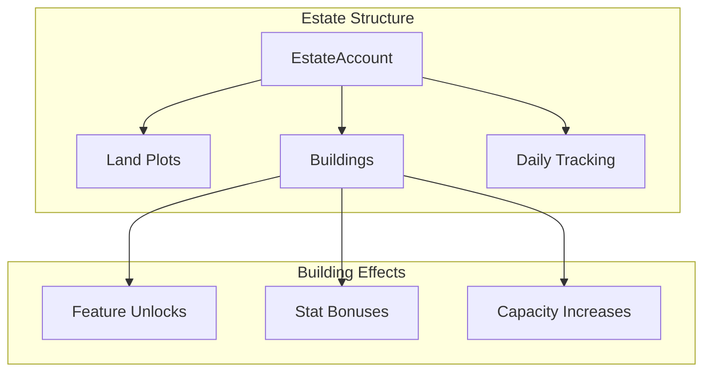
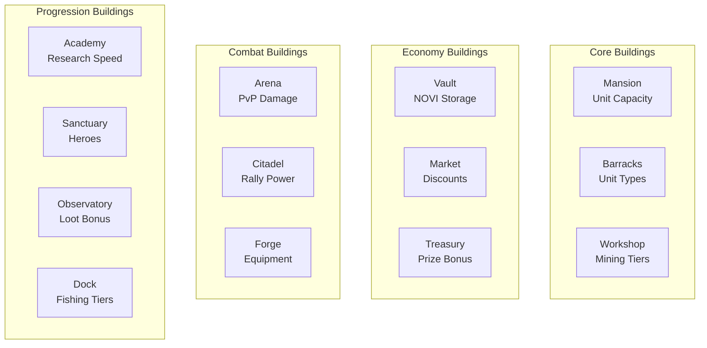
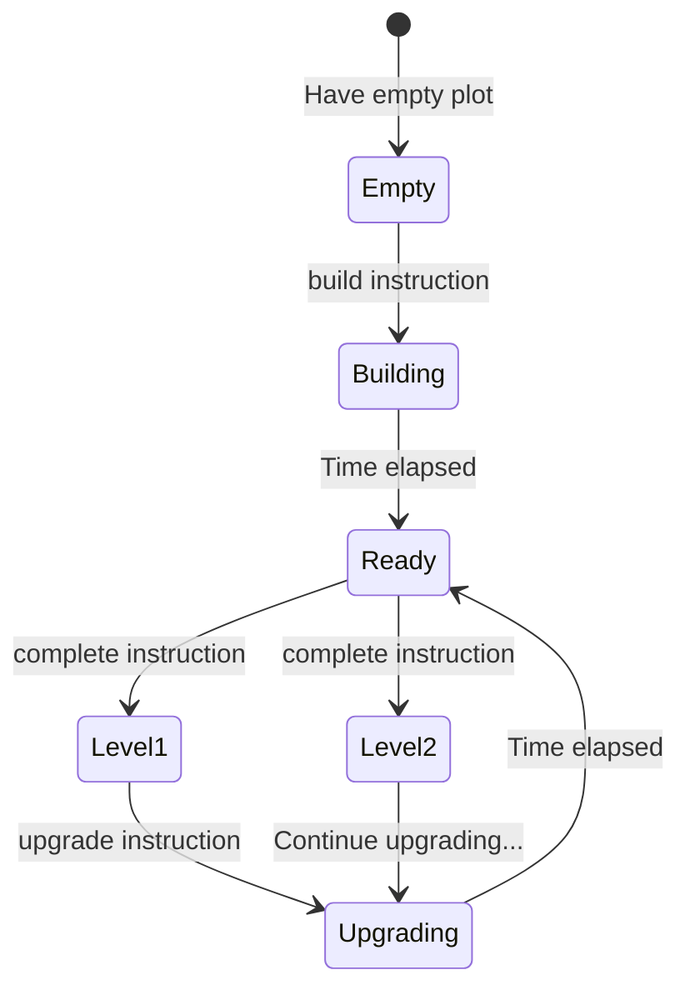
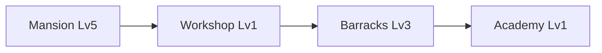
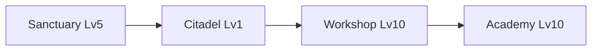
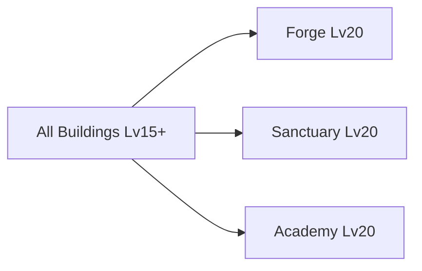

# Estate System

> Building management, land ownership, and the foundation of player progression.

## System Overview

The Estate System is the **core progression backbone** of Novus Mundus. Buildings unlock features, provide bonuses, and gate content access.



## Instructions

| ID | Instruction | Description |
|----|-------------|-------------|
| 160 | `create_estate` | Initialize estate account |
| 161 | `build` | Start building construction |
| 162 | `upgrade` | Start building upgrade |
| 163 | `complete` | Finish construction/upgrade |
| 164 | `buy_plot` | Purchase additional land |
| 165 | `daily_claim` | Collect daily building bonuses |
| 166 | `daily_activity` | Record engagement |
| 167 | `convert_materials` | Transform resources |

[Source: processor/estate/](../../../programs/novus_mundus/src/processor/estate/)

---

## Building Types



### Building Details

| Building | Primary Effect | Secondary Effect |
|----------|----------------|------------------|
| **Mansion** | +Unit capacity | Unlocks other buildings |
| **Barracks** | Unlock unit types | +Training efficiency |
| **Workshop** | Mining tier access | Material conversion |
| **Dock** | Fishing tier access | Ship capacity |
| **Vault** | +NOVI storage cap | +Transfer bonus |
| **Market** | Purchase discounts | Trade efficiency |
| **Academy** | -Research time | +Mastery gain |
| **Arena** | +PvP damage | Tournament access |
| **Sanctuary** | +Hero slots | Meditation bonuses |
| **Observatory** | +Loot bonus | Encounter tracking |
| **Treasury** | +Prize bonus | Interest on deposits |
| **Citadel** | +Rally power | +Rally capacity |
| **Forge** | Equipment crafting | Quality tiers |

[Source: state/estate.rs](../../../programs/novus_mundus/src/state/estate.rs)

---

## Building Progression

### Construction Flow



### Building States

| State | Description |
|-------|-------------|
| `Empty` | Plot available for building |
| `Building` | Under construction |
| `Ready` | Construction complete, awaiting claim |
| `Active` | Building operational |
| `Upgrading` | Level increase in progress |

### Time Requirements

Buildings use φ-based time scaling:

```
construction_time(level) = base_time × φ^(level-1)
```

| Level Range | Typical Time |
|-------------|--------------|
| 1-5 | 5 min - 2 hours |
| 6-10 | 2 hours - 8 hours |
| 11-15 | 8 hours - 24 hours |
| 16-20 | 24 hours - 72 hours |

---

## φ-Based Bonuses

Building bonuses scale using the Golden Ratio (φ ≈ 1.618):

```
bonus(level) = base_bonus × φ^(level-1)
```

### Example: Academy Research Speed

| Level | Bonus | Time Reduction |
|-------|-------|----------------|
| 1 | 100 bps | -1% |
| 5 | 685 bps | -6.85% |
| 10 | 4,807 bps | -48% |
| 15 | 33,700 bps | -100%+ (capped) |
| 20 | 236,338 bps | Max bonus |

### Bonus Caps

Most bonuses are capped to prevent exploitation:
- Research speed: -75% maximum
- Loot bonus: +100% maximum
- Damage bonus: +50% maximum

[Source: helpers/estate.rs](../../../programs/novus_mundus/src/helpers/estate.rs)

---

## Building-Gated Features

### Unit Types (Barracks)

| Barracks Level | Unlocked Units |
|----------------|----------------|
| 1 | T1 Operatives |
| 3 | Melee Weapons |
| 5 | T2 Operatives |
| 7 | Ranged Weapons |
| 10 | T3 Operatives |
| 12 | Siege Weapons |
| 15 | Vehicles |

### Expedition Tiers (Workshop/Dock)

| Level | Mining Tier | Fishing Tier |
|-------|-------------|--------------|
| 1 | Surface | Shore |
| 5 | Shallow | River |
| 10 | Deep | Lake |
| 15 | Volcanic | DeepSea |
| 20 | Abyssal | Abyss |

### Hero Slots (Sanctuary)

| Sanctuary Level | Max Locked Heroes |
|-----------------|-------------------|
| 1-4 | 1 |
| 5-9 | 2 |
| 10-14 | 3 |
| 15-19 | 4 |
| 20 | 5 |

### Research Categories (Academy)

| Academy Level | Research Access |
|---------------|-----------------|
| 1 | Basic |
| 5 | Intermediate |
| 10 | Advanced |
| 15 | Expert |
| 20 | Master |

### Equipment Quality (Forge)

| Forge Level | Max Quality |
|-------------|-------------|
| 1-4 | Common |
| 5-9 | Uncommon |
| 10-14 | Rare |
| 15-19 | Epic |
| 20 | Legendary |

---

## Land Plots

### Plot Acquisition

Players start with 1 plot and can purchase more:

**Instruction:** `164 - buy_plot`

| Plot Number | Cost (NOVI) |
|-------------|-------------|
| 2 | 10,000 |
| 3 | 25,000 |
| 4 | 50,000 |
| 5 | 100,000 |
| 6+ | 100,000 × 2^(n-5) |

### Maximum Plots

- Standard: 10 plots
- Premium subscription: 15 plots
- Maximum ever: 20 plots

---

## Daily Systems

### Daily Claim

**Instruction:** `165 - daily_claim`

Buildings generate passive rewards claimable once per day:

| Building | Daily Reward |
|----------|--------------|
| Treasury | Interest on deposited NOVI |
| Observatory | Bonus fragments |
| Sanctuary | Hero XP bonus |

### Daily Activity

**Instruction:** `166 - daily_activity`

Tracks player engagement for bonus rewards:

| Activity | Points |
|----------|--------|
| Login | 1 |
| Resource collection | 1 |
| Expedition complete | 2 |
| Combat victory | 2 |
| Building complete | 3 |

| Points Threshold | Bonus |
|------------------|-------|
| 5 | Small bonus |
| 10 | Medium bonus |
| 20 | Large bonus |

---

## EstateAccount Structure

```
EstateAccount:
├── owner: Pubkey (32)           // Player wallet
├── player: Pubkey (32)          // PlayerAccount PDA
├── bump: u8                     // PDA bump
├── plots_owned: u8              // Number of plots
├── buildings: [BuildingSlot; 20] // Building array
├── daily_claim_time: i64        // Last daily claim
├── daily_activity_points: u8    // Today's points
└── daily_activity_date: u32     // Date tracking

BuildingSlot:
├── building_type: u8            // BuildingType enum
├── level: u8                    // 1-20
├── status: u8                   // BuildingStatus enum
└── upgrade_start: i64           // When upgrade began
```

**Seeds:** `["estate", player_pubkey]`

[Source: state/estate.rs](../../../programs/novus_mundus/src/state/estate.rs)

---

## Building Priority Guide

### Early Game (Day 1-7)



### Mid Game (Week 2-4)



### Late Game (Month 2+)



---

## Client Integration

### Check Building Level

```javascript
function getBuildingLevel(estate, buildingType) {
  for (const slot of estate.buildings) {
    if (slot.building_type === buildingType && slot.level > 0) {
      return slot.level;
    }
  }
  return 0;
}
```

### Calculate Bonus

```javascript
const PHI = 1.618033988749895;

function calculateBuildingBonus(level, baseBps) {
  if (level === 0) return 0;
  return Math.floor(baseBps * Math.pow(PHI, level - 1));
}

// Example: Academy research speed
const academyLevel = getBuildingLevel(estate, BuildingType.Academy);
const speedBonus = calculateBuildingBonus(academyLevel, 100);
// Level 10 → 4807 bps → 48% faster research
```

### Building Status Display

```javascript
function getBuildingStatus(slot) {
  if (slot.level === 0) {
    return { status: 'empty', canBuild: true };
  }

  if (slot.status === BuildingStatus.Upgrading) {
    const now = Date.now() / 1000;
    const duration = calculateUpgradeDuration(slot.building_type, slot.level + 1);
    const endTime = slot.upgrade_start + duration;

    if (now >= endTime) {
      return { status: 'ready', canComplete: true };
    }

    return {
      status: 'upgrading',
      remainingSeconds: endTime - now,
      targetLevel: slot.level + 1
    };
  }

  return {
    status: 'active',
    level: slot.level,
    canUpgrade: slot.level < 20
  };
}
```

---

*Your estate is your kingdom. Build wisely, upgrade strategically, and watch your power grow.*

---

Next: [Research](./research.md)
