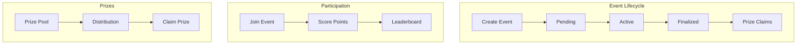
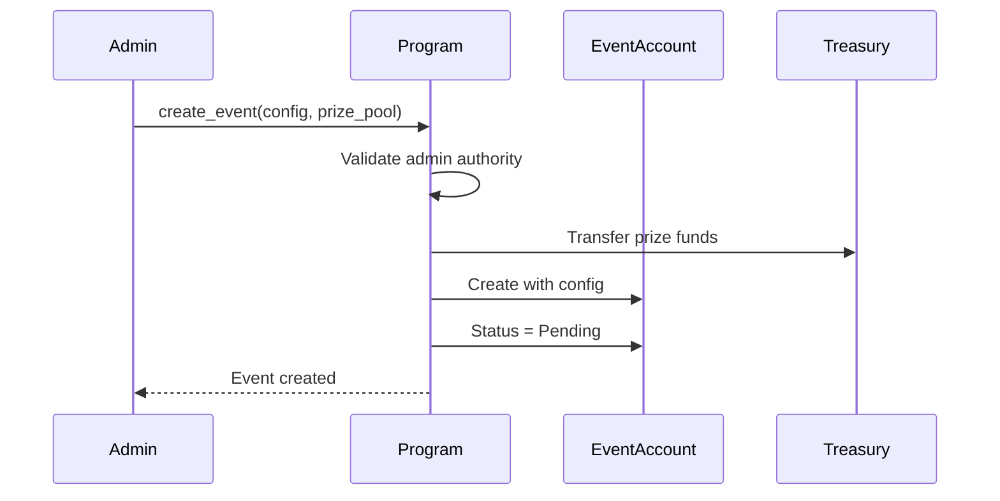
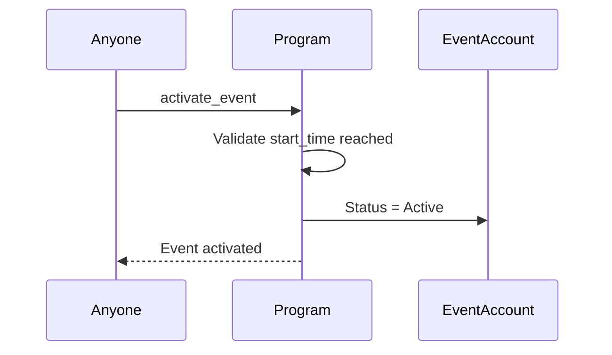
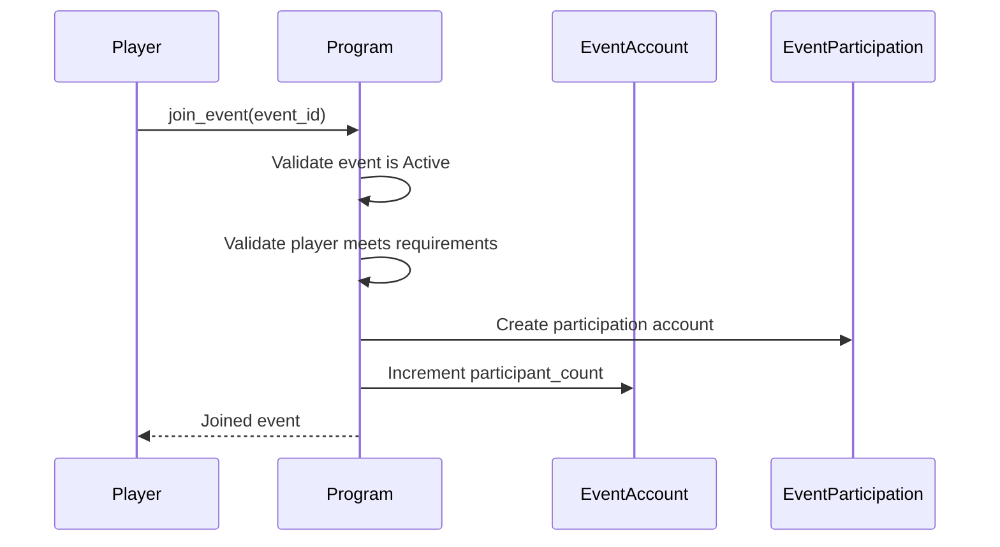
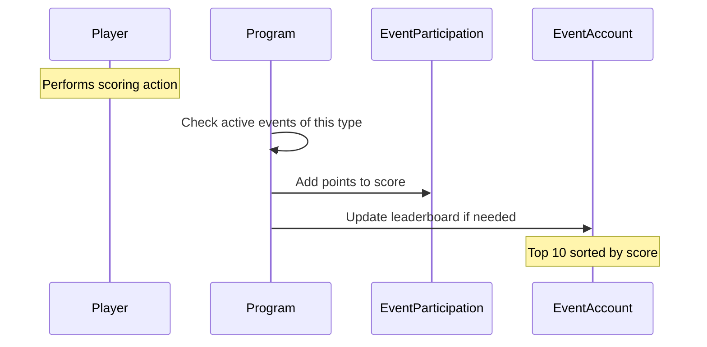
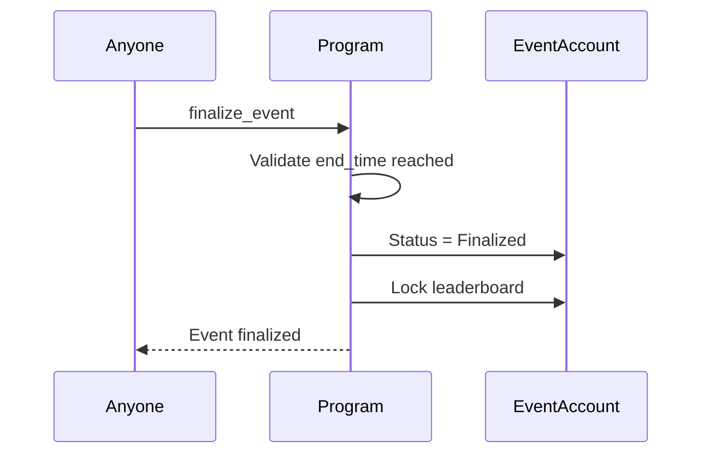
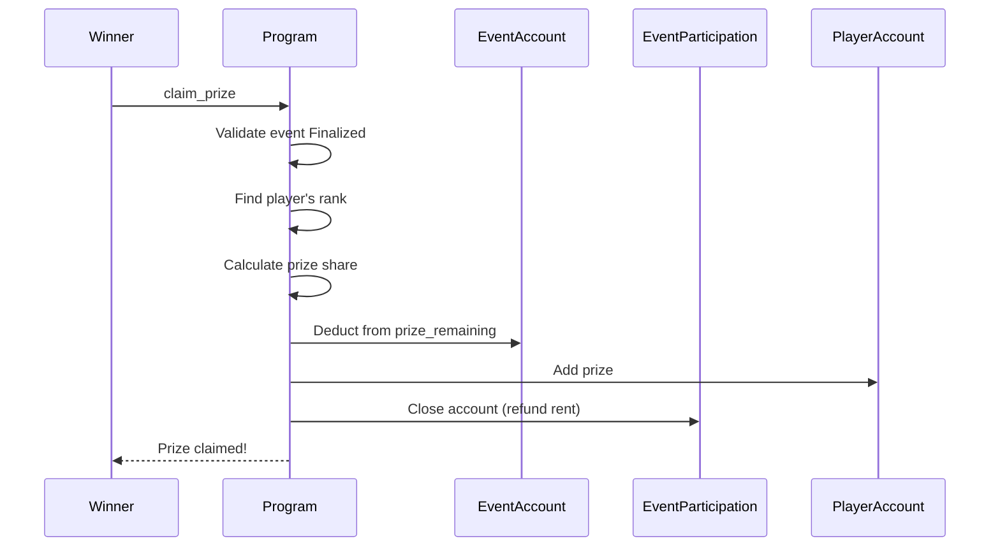

# Events System

> Timed competitions with leaderboards and prize pools.

## System Overview

Events are **time-limited competitions** where players compete for rankings and prizes. The system supports multiple event types, participation tracking, and automated prize distribution.



## Instructions

| ID | Instruction | Description |
|----|-------------|-------------|
| 90 | `create_event` | Admin creates new event |
| 91 | `join_event` | Player joins competition |
| 92 | `update_score` | Increment player's score |
| 93 | `activate_event` | Start the event |
| 94 | `finalize_event` | End and lock rankings |
| 95 | `claim_prize` | Winner claims reward |
| 96 | `cancel_event` | Admin cancels event |

[Source: processor/event/](../../../programs/novus_mundus/src/processor/event/)

---

## EventAccount Structure

```
EventAccount:
├── id: u64                       // Unique event ID
├── name: [u8; 64]                // Event name
├── name_len: u8
│
├── // Timing
├── start_time: i64               // When event starts
├── end_time: i64                 // When event ends
├── status: u8                    // EventStatus enum
├── auto_activate: bool           // Auto-start at start_time
│
├── // Event Type
├── event_type: u8                // EventType enum
│
├── // Requirements
├── min_level: u8                 // Minimum player level
├── min_reputation: u64           // Minimum reputation
├── required_subscription_tier: u8
│
├── // Leaderboard (Top 10)
├── leaderboard: [LeaderboardEntry; 10]
├── leaderboard_count: u8
│
├── // Prize Pool
├── prize_type: u8                // PrizeType enum
├── prize_amount: u64             // Total pool
├── prize_remaining: u64          // Unclaimed
├── prize_token_mint: Pubkey      // For SPL prizes
│
├── participant_count: u32
└── bump: u8
```

**Seeds:** `["event", event_id_bytes]`

### LeaderboardEntry

```
LeaderboardEntry:
├── player: Pubkey    // Player's address
└── score: u64        // Player's score
```

---

## Event Status

| Status | Value | Description |
|--------|-------|-------------|
| Pending | 0 | Created but not started |
| Active | 1 | In progress, accepting scores |
| Finalized | 2 | Ended, prizes claimable |
| Cancelled | 3 | Admin cancelled |

---

## Event Types

| Type | Value | Scoring Method |
|------|-------|----------------|
| CombatKills | 0 | Encounter/PvP kills |
| ResourcesCollected | 1 | Total resources gathered |
| ExpeditionPoints | 2 | Expedition completions |
| RallyDamage | 3 | Damage dealt in rallies |
| TravelDistance | 4 | Kilometers traveled |
| ResearchCompleted | 5 | Research nodes finished |
| BuildingsUpgraded | 6 | Building level gains |
| HeroXPGained | 7 | Hero experience earned |

Each event type automatically increments scores when the relevant action occurs.

---

## Prize Types

| Type | Value | Description |
|------|-------|-------------|
| LockedNovi | 0 | NOVI added to locked balance |
| Gems | 1 | Gem currency |
| Cash | 2 | Cash currency |
| SPLToken | 3 | Custom SPL token |

---

## EventParticipation Account

Per-player-per-event tracking:

```
EventParticipation:
├── event_id: u64       // Which event
├── player: Pubkey      // Participant
├── score: u64          // Current score
├── joined_at: i64      // Join timestamp
├── last_update: i64    // Last score update
└── bump: u8
```

**Seeds:** `["event_participation", event_id_bytes, player_pubkey]`

**Note:** This account is **closed after claiming prize** (rent refunded).

---

## Event Lifecycle

### 1. Create Event (Admin)

**Instruction:** `90 - create_event`



### 2. Activate Event

**Instruction:** `93 - activate_event`

Can be manual or automatic (`auto_activate = true`):



### 3. Join Event

**Instruction:** `91 - join_event`



**Requirements checked:**
- `player.level >= event.min_level`
- `player.reputation >= event.min_reputation`
- `player.subscription_tier >= event.required_subscription_tier`

### 4. Score Updates

**Instruction:** `92 - update_score`

Scores are updated **automatically** when relevant actions occur:



### Leaderboard Management

The leaderboard maintains the **top 10 players** sorted by score descending:

```rust
fn update_leaderboard(&mut self, player: Pubkey, score: u64) {
    // Check if player already on board
    if let Some(pos) = self.find_rank(&player) {
        self.leaderboard[pos].score = score;
        self.sort_leaderboard();
        return;
    }

    // Check if score beats #10
    if self.leaderboard_count < 10 ||
       score > self.leaderboard[9].score {
        // Add new entry, remove lowest if full
        self.insert_entry(player, score);
    }
}
```

### 5. Finalize Event

**Instruction:** `94 - finalize_event`



### 6. Claim Prize

**Instruction:** `95 - claim_prize`



---

## Prize Distribution

Prizes are distributed based on rank:

| Rank | Share of Pool |
|------|---------------|
| 1st | 35% |
| 2nd | 20% |
| 3rd | 15% |
| 4th | 10% |
| 5th | 7% |
| 6th | 5% |
| 7th | 3% |
| 8th | 2% |
| 9th | 2% |
| 10th | 1% |

**Example:** 100,000 NOVI pool
- 1st: 35,000 NOVI
- 2nd: 20,000 NOVI
- 3rd: 15,000 NOVI
- ...and so on

---

## Automatic Score Increment

When players perform actions, the system checks for relevant active events:

| Action | Event Type Triggered |
|--------|---------------------|
| `attack_encounter` | CombatKills |
| `attack_player` | CombatKills |
| `collect_resources` | ResourcesCollected |
| `complete_expedition` | ExpeditionPoints |
| `execute_rally` | RallyDamage |
| `intercity_complete` | TravelDistance |
| `complete_research` | ResearchCompleted |
| `complete_building` | BuildingsUpgraded |
| `claim_meditation` | HeroXPGained |

This happens atomically within the action's transaction.

---

## Client Integration

### Display Active Events

```javascript
async function getActiveEvents(connection) {
  const events = await fetchAllEvents(connection);

  return events
    .filter(e => e.status === 1) // Active
    .map(e => ({
      id: e.id,
      name: decodeEventName(e.name, e.nameLen),
      type: getEventTypeName(e.eventType),
      endsAt: new Date(e.endTime * 1000),
      prizePool: e.prizeAmount,
      prizeType: getPrizeTypeName(e.prizeType),
      participantCount: e.participantCount,
      leaderboard: e.leaderboard.slice(0, e.leaderboardCount),
      requirements: {
        minLevel: e.minLevel,
        minReputation: e.minReputation,
        subscriptionTier: e.requiredSubscriptionTier
      }
    }));
}
```

### Check Participation

```javascript
async function getMyEventStatus(connection, wallet, eventId) {
  const [participationPda] = PublicKey.findProgramAddress(
    [
      Buffer.from("event_participation"),
      eventId.toBuffer(),
      wallet.toBuffer()
    ],
    PROGRAM_ID
  );

  try {
    const participation = await fetchEventParticipation(connection, participationPda);
    const event = await fetchEvent(connection, eventId);

    const rank = event.leaderboard
      .slice(0, event.leaderboardCount)
      .findIndex(e => e.player.equals(wallet));

    return {
      joined: true,
      score: participation.score,
      rank: rank >= 0 ? rank + 1 : null, // 1-indexed for display
      inTopTen: rank >= 0,
      prizeEstimate: rank >= 0 ? calculatePrize(event.prizeAmount, rank) : 0
    };
  } catch {
    return { joined: false };
  }
}
```

### Join Event

```javascript
async function joinEvent(connection, wallet, eventId) {
  const event = await fetchEvent(connection, eventId);
  const player = await getPlayerAccount(connection, wallet.publicKey);

  // Client-side validation
  if (event.status !== 1) throw new Error('Event not active');
  if (player.level < event.minLevel) throw new Error('Level too low');
  if (player.reputation < event.minReputation) throw new Error('Reputation too low');

  const [participationPda] = PublicKey.findProgramAddress(
    [
      Buffer.from("event_participation"),
      eventId.toBuffer(),
      wallet.publicKey.toBuffer()
    ],
    PROGRAM_ID
  );

  const ix = joinEventInstruction({ eventId });
  return sendTransaction(connection, wallet, [ix]);
}
```

### Display Leaderboard

```javascript
function renderLeaderboard(event, currentPlayer) {
  const board = event.leaderboard.slice(0, event.leaderboardCount);

  return `
    EVENT: ${event.name}
    Prize Pool: ${formatAmount(event.prizePool)} ${event.prizeType}
    Ends: ${formatDate(event.endTime)}

    LEADERBOARD
    -----------
    ${board.map((entry, idx) => {
      const isMe = entry.player.equals(currentPlayer);
      const prize = calculatePrize(event.prizePool, idx);
      return `${idx + 1}. ${formatAddress(entry.player)} - ${entry.score} pts (${formatAmount(prize)}) ${isMe ? '← YOU' : ''}`;
    }).join('\n')}
  `;
}
```

### Claim Prize

```javascript
async function claimPrize(connection, wallet, eventId) {
  const status = await getMyEventStatus(connection, wallet.publicKey, eventId);

  if (!status.joined) throw new Error('Not a participant');
  if (!status.inTopTen) throw new Error('Not in top 10');

  const event = await fetchEvent(connection, eventId);
  if (event.status !== 2) throw new Error('Event not finalized');

  const ix = claimPrizeInstruction({ eventId });
  return sendTransaction(connection, wallet, [ix]);
}
```

---

## Admin Operations

### Create Event Example

```javascript
async function createEvent(connection, admin, config) {
  const nextEventId = await getNextEventId(connection);

  const ix = createEventInstruction({
    eventId: nextEventId,
    name: config.name,
    eventType: config.type,
    startTime: Math.floor(config.startDate.getTime() / 1000),
    endTime: Math.floor(config.endDate.getTime() / 1000),
    autoActivate: config.autoActivate,
    minLevel: config.minLevel || 0,
    minReputation: config.minReputation || 0,
    requiredSubscriptionTier: config.requiredTier || 0,
    prizeType: config.prizeType,
    prizeAmount: config.prizeAmount,
    prizeTokenMint: config.prizeType === 3 ? config.tokenMint : null
  });

  return sendTransaction(connection, admin, [ix]);
}
```

---

*Events transform daily gameplay into epic competitions. Join the battle, climb the ranks, claim your glory.*

---

Next: [Shop](./shop.md)
