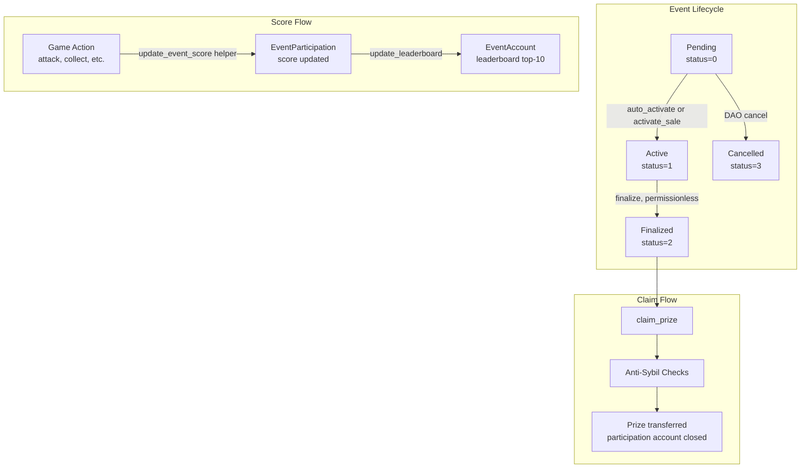
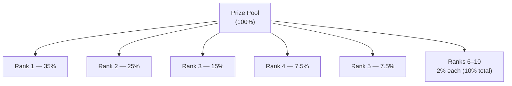
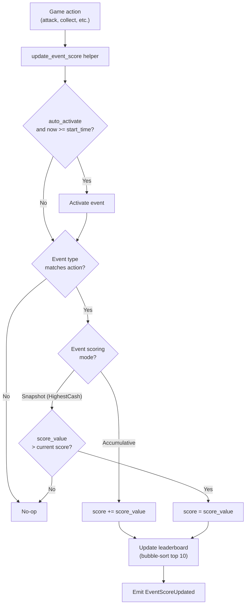
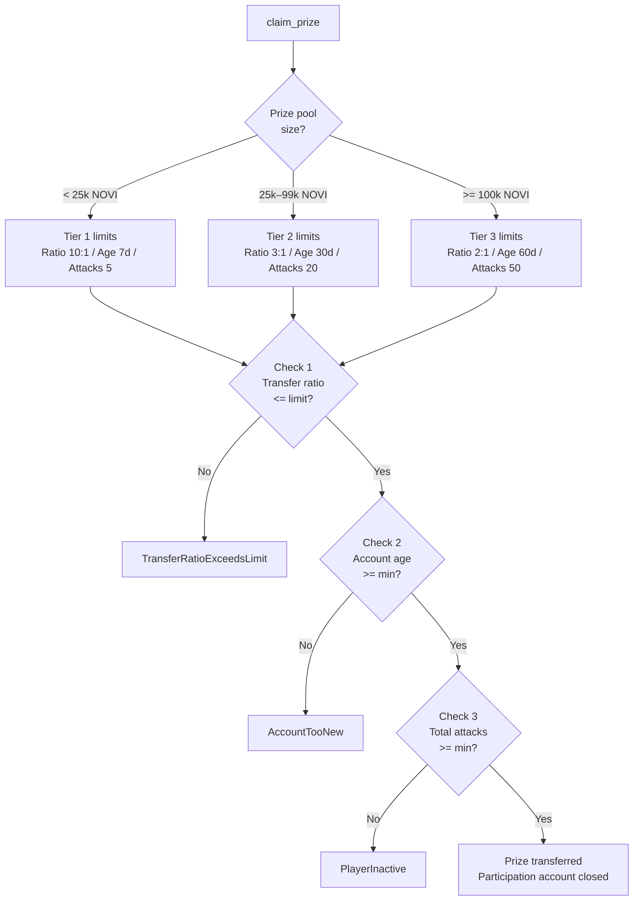
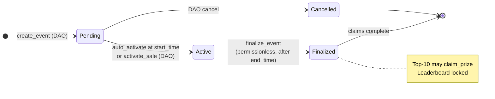
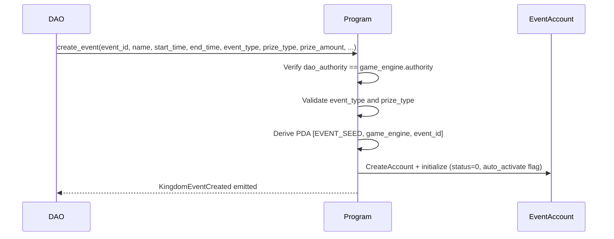
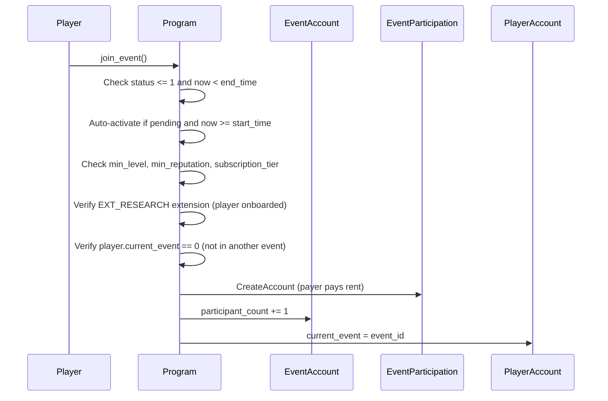
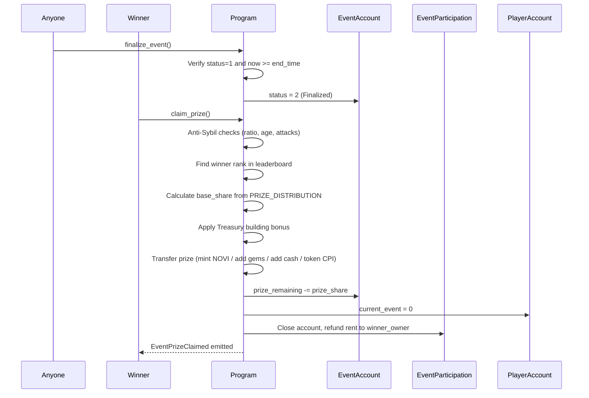

# Events System

> Kingdom-scoped skill competitions — leaderboard scoring, anti-Sybil eligibility, and tiered prize distribution.

## System Overview

Events are time-bounded competitions where players accumulate or snapshot a score based on in-game actions. A top-10 leaderboard updates live as scores are submitted (via other game processors that call the shared `update_event_score` helper). After `end_time` elapses, any caller can finalize the event and the top-10 players may claim their weighted share of the prize pool.

Events are **kingdom-scoped**: the `GameEngine` pubkey is embedded in both the `EventAccount` and `EventParticipation` PDAs, ensuring leaderboards are isolated per kingdom.



## Instructions

| ID | Instruction | Description |
|----|-------------|-------------|
| 80 | `create_event` | Create EventAccount PDA (DAO only) |
| 81 | `join_event` | Player joins an active/pending event, creates EventParticipation |
| 82 | `finalize_event` | Permissionless — finalize after end_time |
| 83 | `claim_prize` | Top-10 player claims weighted prize share |

[Source: processor/event/](../../../programs/novus_mundus/src/processor/event/)

---

## Account Structures

### EventAccount

**PDA:** `[EVENT_SEED, game_engine, event_id_u64_le]`

```rust
pub struct EventAccount {
    pub account_key: u8,
    pub game_engine: Address,               // kingdom reference
    pub id: u64,
    pub name: [u8; 64],                     // UTF-8, length in name_len
    pub name_len: u8,

    pub start_time: i64,
    pub end_time: i64,
    pub status: u8,                         // 0=Pending, 1=Active, 2=Finalized, 3=Cancelled
    pub auto_activate: bool,                // if true, activates at start_time automatically

    pub event_type: u8,                     // EventType enum (0–7)

    // Participation requirements (0 = no requirement)
    pub min_level: u8,
    pub min_reputation: u64,
    pub required_subscription_tier: u8,

    // Top-10 leaderboard (sorted descending by score)
    pub leaderboard: [LeaderboardEntry; 10], // 40 bytes × 10 = 400 bytes
    pub leaderboard_count: u8,

    // Prize pool
    pub prize_type: u8,                     // PrizeType enum (0–3)
    pub prize_amount: u64,                  // total pool
    pub prize_remaining: u64,               // decrements as prizes are claimed
    pub prize_token_mint: Address,          // only used when prize_type=SPLToken

    pub participant_count: u32,
    pub bump: u8,
}

pub struct LeaderboardEntry {
    pub player: Address,    // player wallet pubkey
    pub score: u64,
}
```

`EventAccount::LEN` is fixed at allocation time and does not change.

### EventParticipation

**PDA:** `[EVENT_PARTICIPATION_SEED, game_engine, event_id_u64_le, player_owner_wallet]`

Created by `join_event`, **closed** (rent refunded to winner) by `claim_prize`.

```rust
pub struct EventParticipation {
    pub account_key: u8,
    pub game_engine: Address,
    pub event_id: u64,
    pub player: Address,          // player wallet pubkey
    pub score: u64,
    pub joined_at: i64,
    pub last_update: i64,
    pub bump: u8,
}
```

[Source: state/event.rs](../../../programs/novus_mundus/src/state/event.rs)

---

## Event Types

| Value | Name | Scoring Mode |
|-------|------|-------------|
| 0 | `TotalDamageDealt` | Accumulative |
| 1 | `MostAttacksWonPvP` | Accumulative |
| 2 | `MostAttacksWonPvE` | Accumulative |
| 3 | `HighestCash` | **Snapshot** — replaces score only if higher |
| 4 | `MostXPGained` | Accumulative |
| 5 | `MostEncountersDefeated` | Accumulative |
| 6 | `MostResourcesCollected` | Accumulative |
| 7 | `MostNoviConsumed` | Accumulative |

`HighestCash` is the only snapshot type. All others add the reported `score_value` to `EventParticipation.score`.

---

## Prize Types

| Value | Name | How Prize is Delivered |
|-------|------|------------------------|
| 0 | `LockedNovi` | Minted to winner's NOVI token account; `player.locked_novi` incremented |
| 1 | `Gems` | Added to `player.gems` |
| 2 | `Cash` | Added to `player.cash_on_hand` |
| 3 | `SPLToken` | CPI transfer from event vault (EventAccount PDA as authority) to winner's token account |

---

## Prize Distribution

`PRIZE_DISTRIBUTION` is a compile-time constant guaranteed to sum to exactly 10,000 bps:



| Rank | Percentage | Basis Points |
|:----:|:-----------:|:------------:|
| 1 | 35.0% | 3,500 |
| 2 | 25.0% | 2,500 |
| 3 | 15.0% | 1,500 |
| 4 | 7.5% | 750 |
| 5 | 7.5% | 750 |
| 6–10 | 2.0% each | 200 each |

[Source: constants.rs `PRIZE_DISTRIBUTION`](../../../programs/novus_mundus/src/constants.rs)

### Treasury Building Prize Bonus

Players with a Treasury building in their estate receive a bonus applied to their prize share:

| Treasury Level | Prize Bonus |
|:-------------:|:-----------:|
| 1–4 | 0% |
| 5–9 | +10% (1,000 bps) |
| 10–14 | +25% (2,500 bps) |
| 15–19 | +40% (4,000 bps) |
| 20 | +50% (5,000 bps) |

```
prize_share = base_share × (10000 + treasury_bonus_bps) / 10000
```

This bonus can push a winner's prize above their nominal percentage share, funded by the remaining `prize_remaining` pool.

---

## Scoring Engine



Score updates are driven by game processors calling the shared `update_event_score()` helper in `helpers/event_scoring.rs`. The helper:

1. Auto-activates the event if `auto_activate=true` and `now >= start_time`.
2. Verifies the event type matches the calling action.
3. Applies accumulative (`+=`) or snapshot (`replace if higher`) logic.
4. Maintains the `leaderboard` array (top 10, descending) via bubble-sort insertion.
5. Emits `EventScoreUpdated` if the score changed.

A player can accumulate score from multiple different in-game actions within the event window with no direct on-chain interaction — the leaderboard always reflects the latest state.

[Source: helpers/event_scoring.rs](../../../programs/novus_mundus/src/helpers/event_scoring.rs)

---

## Anti-Sybil Eligibility

Prize claims apply three tiered eligibility checks, all sourced from `logic/eligibility.rs`. Thresholds scale with `event.prize_amount`:



### Tier Thresholds

| Prize Pool | Transfer Ratio Limit | Min Account Age | Min Attacks |
|:----------:|:-------------------:|:---------------:|:-----------:|
| < 25,000 NOVI | 10:1 | 7 days | 5 |
| 25,000 – 99,999 NOVI | 3:1 | 30 days | 20 |
| ≥ 100,000 NOVI | 2:1 | 60 days | 50 |

### Check 1: Transfer Ratio

```
ratio = player.total_received / max(player.total_sent, 1)
if ratio > max_ratio → Err(TransferRatioExceedsLimit)
```

Detects bot accounts that consolidate resources from many source accounts. Legitimate players have balanced send/receive ratios from team cooperation.

### Check 2: Account Age

```
if (now - player.created_at) < min_age_seconds → Err(AccountTooNew)
```

Prevents newly created bot accounts from farming events.

### Check 3: Activity Requirement

```
if player.total_attacks < min_attacks → Err(PlayerInactive)
```

Ensures players have actually engaged in combat, not passively farmed.

[Source: logic/eligibility.rs](../../../programs/novus_mundus/src/logic/eligibility.rs)

---

## Status State Machine



| Status | Value | Description | Transitions |
|--------|:-----:|-------------|------------|
| Pending | 0 | Created, not yet started | → Active (auto or manual activate) |
| Active | 1 | Accepting score updates | → Finalized (after end_time) |
| Finalized | 2 | Leaderboard locked; claims open | Terminal |
| Cancelled | 3 | Abandoned by DAO | Terminal |

`finalize_event` (instruction 82) is **permissionless** — any caller can invoke it after `end_time`. It requires `status == 1` (Active); Pending events that were never activated must be cancelled via DAO rather than finalized.

---

## Event Lifecycle Flow

### Create



### Join



### Finalize + Claim



---

## Client Integration

```typescript
import {
  createEventInstruction,
  joinEventInstruction,
  finalizeEventInstruction,
  claimPrizeInstruction,
} from "@novus-mundus/sdk";

// Join an active event
const joinIx = joinEventInstruction({
  payer: wallet.publicKey,
  playerAccount: playerPda,
  eventAccount: eventPda,
  eventParticipation: participationPda,
  playerOwner: wallet.publicKey,
  systemProgram: SystemProgram.programId,
});

// Finalize after end_time (permissionless — any caller)
const finalizeIx = finalizeEventInstruction({
  eventAccount: eventPda,
});

// Claim prize (winner only)
const claimIx = claimPrizeInstruction({
  payer: wallet.publicKey,     // can be backend for gas-less claims
  winnerPlayer: playerPda,
  eventAccount: eventPda,
  eventParticipation: participationPda,
  winnerOwner: wallet.publicKey,
  winnerNoviAta: winnerNoviTokenAccount,
  noviMint: noviMintAddress,
  gameEngine: gameEnginePda,
  tokenProgram: TOKEN_PROGRAM_ID,
  winnerEstate: estatePda,     // for Treasury bonus
});
```

---

*Events are the arena of kingdoms — every attack dealt, every resource gathered, and every encounter defeated can tip the leaderboard. Score updates happen automatically as you play.*

---

Next: [Shop](./shop.md)
