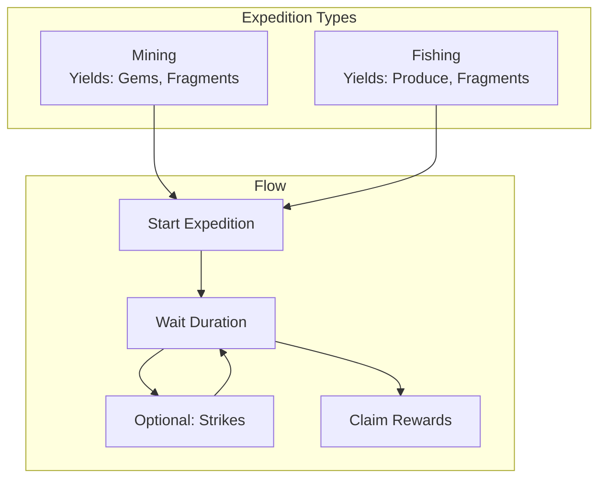
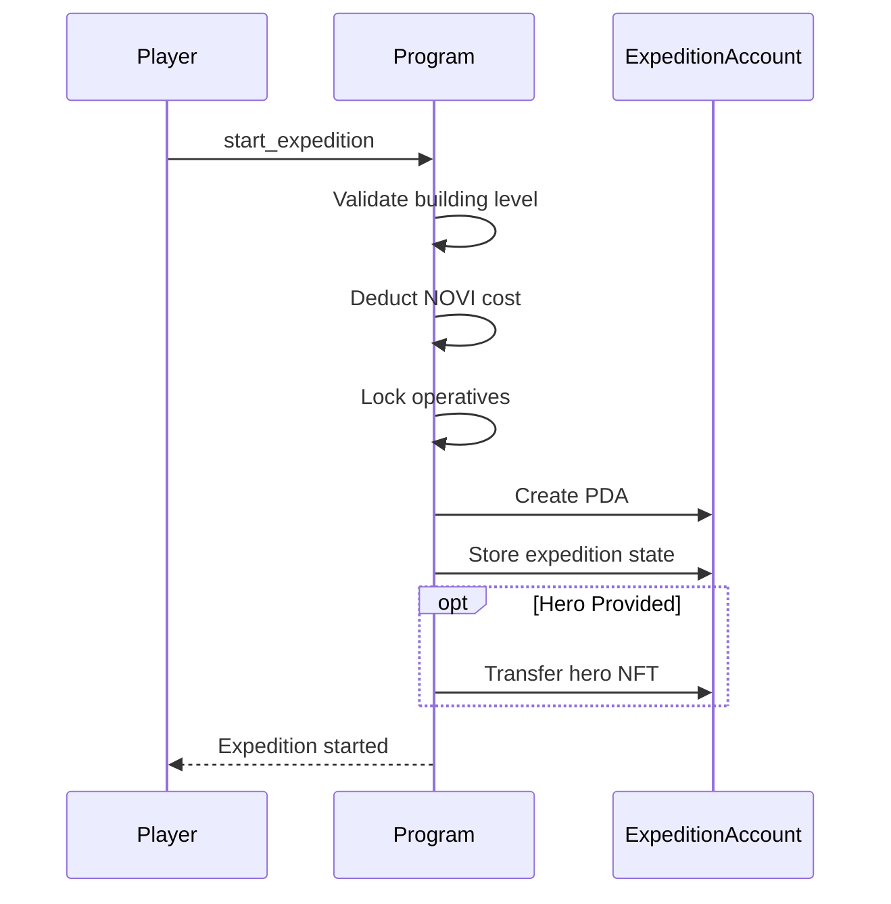
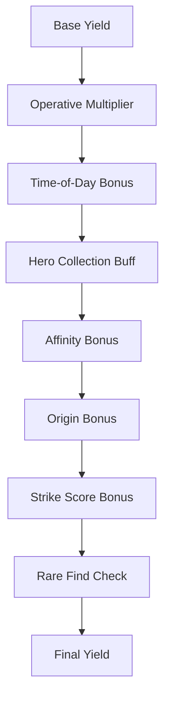

# Expedition System

> Mining and fishing expeditions for resource gathering in Novus Mundus.

## System Overview

Expeditions are **time-locked resource gathering activities**. Players send operatives (and optionally heroes) on expeditions to earn gems, produce, and fragments.



## Instructions

| ID | Instruction | Description |
|----|-------------|-------------|
| 200 | `start_expedition` | Begin mining or fishing |
| 201 | `strike` | Perform action during expedition |
| 202 | `claim_expedition` | Collect rewards |
| 203 | `abort_expedition` | Cancel early |
| 204 | `speedup_expedition` | Reduce remaining time |

[Source: processor/expedition/](../../../programs/novus_mundus/src/processor/expedition/)

---

## Starting an Expedition

**Instruction:** `200 - start_expedition`

### Requirements

| Requirement | Mining | Fishing |
|-------------|--------|---------|
| Research Unlock | `has_mining` | `has_fishing` |
| Building | Workshop | Dock |
| Currency | Locked NOVI | Locked NOVI |
| Units | Operatives | Operatives |

### Instruction Data

```
expedition_type: u8    // 1=Mining, 2=Fishing
tier: u8               // 0-4
operative_unit_1: u64  // T1 operatives to send
operative_unit_2: u64  // T2 operatives to send
operative_unit_3: u64  // T3 operatives to send
```

### Process Flow



### Accounts Layout

| Index | Account | Writable | Description |
|-------|---------|----------|-------------|
| 0 | owner | Signer | Player's wallet |
| 1 | player_account | Yes | PlayerAccount PDA |
| 2 | expedition_account | Yes | ExpeditionAccount (created) |
| 3 | estate_account | No | For building check |
| 4 | system_program | No | For account creation |
| 5 | hero_mint | Yes | Optional: Hero NFT |
| 6 | hero_collection | No | Optional: Hero collection |
| 7 | p_core_program | No | Optional: MPL Core |

[Source: processor/expedition/start.rs](../../../programs/novus_mundus/src/processor/expedition/start.rs)

---

## Expedition Tiers

### Mining Tiers

| Tier | Name | Duration | Gems/Op/Hr | Workshop Level |
|------|------|----------|------------|----------------|
| 0 | Surface | 1h | 10 | 1 |
| 1 | Shallow | 2h | 18 | 5 |
| 2 | Deep | 4h | 30 | 10 |
| 3 | Volcanic | 8h | 50 | 15 |
| 4 | Abyssal | 16h | 80 | 20 |

### Fishing Tiers

| Tier | Name | Duration | Produce/Op/Hr | Dock Level |
|------|------|----------|---------------|------------|
| 0 | Shore | 1h | 15 | 1 |
| 1 | River | 2h | 25 | 5 |
| 2 | Lake | 4h | 40 | 10 |
| 3 | DeepSea | 8h | 60 | 15 |
| 4 | Abyss | 16h | 100 | 20 |

### NOVI Costs

| Tier | Cost |
|------|------|
| 0 | 5,000 |
| 1 | 10,000 |
| 2 | 15,000 |
| 3 | 20,000 |
| 4 | 30,000 |

---

## Operative Tier Multipliers

Higher-tier operatives provide better yields:

| Operative Tier | Yield Multiplier |
|----------------|------------------|
| T1 | 1.0x (100%) |
| T2 | 1.5x (150%) |
| T3 | 2.0x (200%) |

**Calculation:**
```
effective_operatives = (t1 × 1.0) + (t2 × 1.5) + (t3 × 2.0)
base_yield = effective_operatives × yield_per_op_per_hour × hours
```

---

## Hero Integration

Heroes with expedition affinities provide bonus yields.

### Sending a Hero

When starting an expedition with hero accounts (5-7):
1. Hero NFT is transferred to ExpeditionAccount PDA (escrow)
2. Hero's active_heroes slot is cleared if it was locked
3. Hero mint is stored in expedition state

### Affinity Buffs

| Buff | Effect | Expedition Type |
|------|--------|-----------------|
| MiningAffinity (17) | +X% yield | Mining |
| FishingAffinity (18) | +X% yield | Fishing |

**Affinity Calculation:**
```
affinity_multiplier = 1 + (affinity_bps / 10000)
yield_after_affinity = base_yield × affinity_multiplier
```

### Origin City Bonus

If the hero's origin city matches the expedition location AND the hero has the relevant affinity:

```
origin_bonus = +25% (multiplicative)
final_yield = yield_after_affinity × 1.25
```

**Requirements for Origin Bonus:**
1. `hero.origin_city == expedition.city_id` OR `hero.origin_city == 0` (universal)
2. Hero has MiningAffinity (for mining) or FishingAffinity (for fishing)

[Source: processor/expedition/claim.rs](../../../programs/novus_mundus/src/processor/expedition/claim.rs)

---

## Strike System (Phase 2)

Strikes are interactive actions during an expedition that can boost rewards.

**Instruction:** `201 - strike`

### Strike Mechanics

- 1 strike available per hour of expedition duration
- Each strike has a score (0-100)
- Higher average score = better bonus

| Average Score | Bonus |
|---------------|-------|
| 0-49 | 0% |
| 50-74 | +5% |
| 75-89 | +10% |
| 90-100 | +15% (Perfect) |

### Strike Timing

```mermaid
gantt
    title Strike Windows (4-hour expedition)
    dateFormat HH:mm
    axisFormat %H:%M

    section Strikes
    Strike 1 Available :00:00, 1h
    Strike 2 Available :01:00, 1h
    Strike 3 Available :02:00, 1h
    Strike 4 Available :03:00, 1h
```



[Source: processor/expedition/strike.rs](../../../programs/novus_mundus/src/processor/expedition/strike.rs)

---

## Claiming Rewards

**Instruction:** `202 - claim_expedition`

### Claim Requirements
- Expedition duration must be complete
- OR expedition must have been sped up sufficiently

### Reward Calculation



**Full Formula:**
```
base = effective_operatives × rate × hours
with_time = base × (1 + time_bonus)
with_hero = with_time × (1 + hero_collection_bps/10000)
with_affinity = with_hero × (1 + affinity_bps/10000)
with_origin = with_affinity × (1 + origin_bonus)  // if eligible
with_strikes = with_origin × (1 + strike_bonus)
final = with_strikes × (1 + rare_multiplier)  // 5x if lucky
```

### Rare Finds

Based on expedition start time (deterministic):
```
is_rare = hash(start_time) < RARE_THRESHOLD
rare_multiplier = is_rare ? 5.0 : 1.0
```

Rare chance varies by tier:
| Tier | Base Chance |
|------|-------------|
| 0 | 2% |
| 1 | 3% |
| 2 | 4% |
| 3 | 5% |
| 4 | 7% |

### Hero Return

On claim, the hero NFT is transferred back to the player's wallet.

[Source: processor/expedition/claim.rs](../../../programs/novus_mundus/src/processor/expedition/claim.rs)

---

## Speedup

**Instruction:** `204 - speedup_expedition`

### Speedup Tiers

| Tier | Time Reduction | Cost Multiplier |
|------|----------------|-----------------|
| 1 | 50% | 1x |
| 2 | 75% | 2x |

### Cost Calculation

```
remaining_minutes = (end_time - now) / 60
minutes_to_reduce = remaining_minutes × reduction_percentage
gem_cost = minutes_to_reduce × 100 × tier_multiplier
```

**Example (4 hours remaining, Tier 2):**
```
remaining_minutes = 240
minutes_to_reduce = 240 × 0.75 = 180
gem_cost = 180 × 100 × 2 = 36,000 gems
```

### Implementation

Speedup works by moving `start_time` backward:
```
time_saved = remaining_seconds × reduction_bps / 10000
expedition.start_time -= time_saved
```

[Source: processor/expedition/speedup.rs](../../../programs/novus_mundus/src/processor/expedition/speedup.rs)

---

## Aborting

**Instruction:** `203 - abort_expedition`

Aborting cancels the expedition early:
- Operatives are returned
- NOVI cost is NOT refunded (burned)
- Hero is returned (if sent)
- No rewards granted

Use cases:
- Need operatives urgently for combat
- Made a mistake in expedition setup
- Emergency recall

[Source: processor/expedition/abort.rs](../../../programs/novus_mundus/src/processor/expedition/abort.rs)

---

## ExpeditionAccount Structure

```
ExpeditionAccount (104 bytes):
├── player: Pubkey (32)      // Owner
├── hero_mint: Pubkey (32)   // Hero NFT or NULL_PUBKEY
├── expedition_type: u8      // 1=Mining, 2=Fishing
├── tier: u8                 // 0-4
├── strikes: u8              // Actions performed
├── bump: u8                 // PDA bump
├── score: u16               // Accumulated strike score
├── city_id: u16             // Expedition location
├── start_time: i64          // Unix timestamp
├── operative_unit_1: u64    // T1 operatives
├── operative_unit_2: u64    // T2 operatives
└── operative_unit_3: u64    // T3 operatives
```

**Seeds:** `["expedition", owner_pubkey]`

[Source: state/expedition.rs](../../../programs/novus_mundus/src/state/expedition.rs)

---

## Client Integration

### Check Can Start

```javascript
function canStartExpedition(player, estate, type, tier) {
  // Check research unlock
  if (type === 'mining' && !player.has_mining) {
    return { can: false, reason: 'Mining not researched' };
  }
  if (type === 'fishing' && !player.has_fishing) {
    return { can: false, reason: 'Fishing not researched' };
  }

  // Check building level
  const building = type === 'mining' ? 'Workshop' : 'Dock';
  const requiredLevel = [1, 5, 10, 15, 20][tier];
  if (getBuildingLevel(estate, building) < requiredLevel) {
    return { can: false, reason: `${building} level ${requiredLevel} required` };
  }

  // Check NOVI
  const cost = [5000, 10000, 15000, 20000, 30000][tier];
  if (player.locked_novi < cost) {
    return { can: false, reason: 'Insufficient locked NOVI' };
  }

  return { can: true };
}
```

### Calculate Expected Yield

```javascript
function calculateExpectedYield(expedition, player, hero = null) {
  const rates = expedition.type === 'mining'
    ? [10, 18, 30, 50, 80]
    : [15, 25, 40, 60, 100];

  const hours = [1, 2, 4, 8, 16][expedition.tier];
  const rate = rates[expedition.tier];

  // Effective operatives
  const effective = expedition.op_t1 + (expedition.op_t2 * 1.5) + (expedition.op_t3 * 2.0);

  let yield = effective * rate * hours;

  // Hero buffs
  if (player.hero_collection_rate_bps > 0) {
    yield *= (1 + player.hero_collection_rate_bps / 10000);
  }

  // Affinity
  if (hero) {
    const affinityBuff = hero.type === 'mining' ? hero.miningAffinity : hero.fishingAffinity;
    if (affinityBuff > 0) {
      yield *= (1 + affinityBuff / 10000);

      // Origin bonus
      if (hero.origin === expedition.city_id || hero.origin === 0) {
        yield *= 1.25;
      }
    }
  }

  return Math.floor(yield);
}
```

### Timer Display

```javascript
function getExpeditionStatus(expedition) {
  const now = Date.now() / 1000;
  const endTime = expedition.start_time + getExpeditionDuration(expedition.tier);

  if (now >= endTime) {
    return { status: 'complete', canClaim: true };
  }

  const remaining = endTime - now;
  return {
    status: 'in_progress',
    canClaim: false,
    remainingSeconds: remaining,
    remainingFormatted: formatDuration(remaining),
    speedupCost: calculateSpeedupCost(remaining)
  };
}
```

---

*Expeditions are the steady heartbeat of your economy. Send your operatives, enhance with heroes, and reap the rewards.*

---

Next: [Estates](./estates.md)
