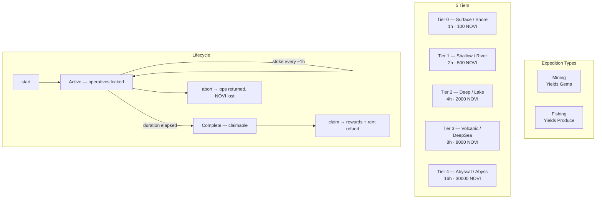
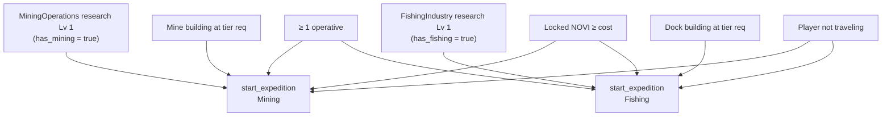
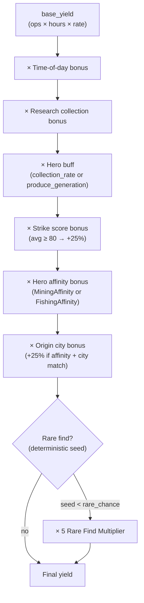
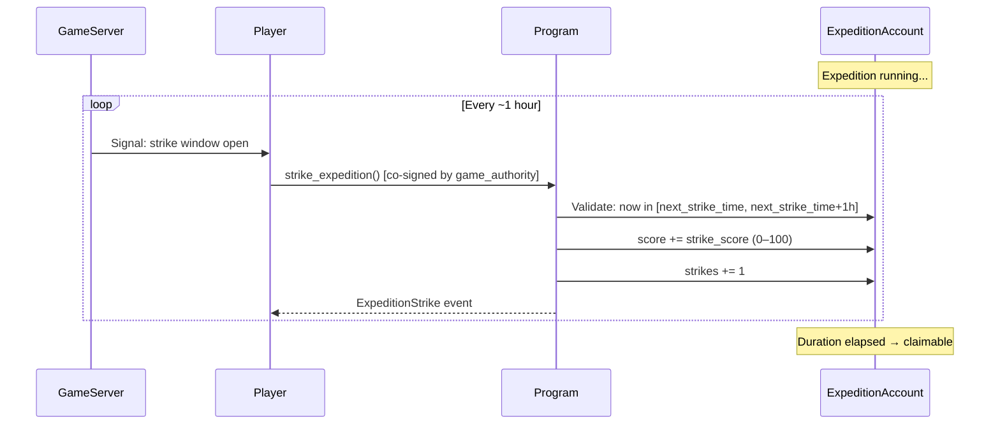
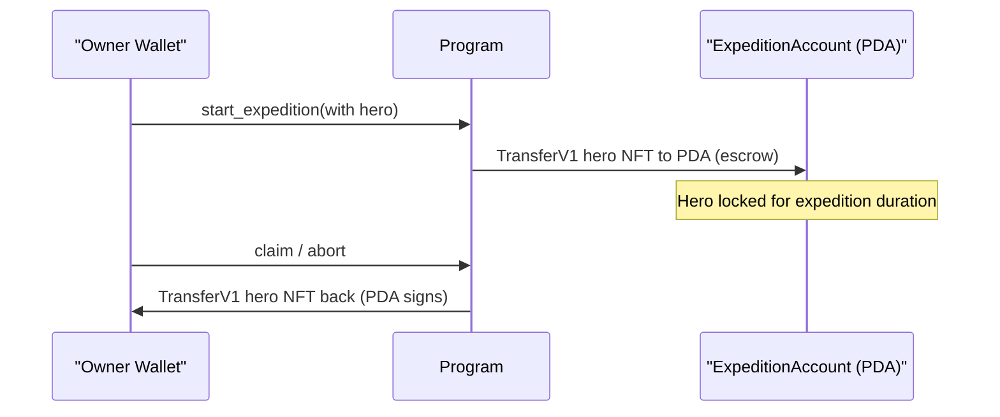

# Expedition System

> Send operatives into the world to mine gems and haul in produce — then strike at exactly the right moment for the best haul.

## System Overview

Expeditions are timed resource-gathering operations where players lock operatives (and optionally a Hero NFT) for a fixed duration. During the expedition, the game server co-signs periodic `strike` calls that accumulate a score. At the end, the score determines whether the player earns a **perfect bonus** (+25%).



## Instructions

| ID | Instruction | Description |
|----|-------------|-------------|
| 200 | `start_expedition` | Lock operatives and create `ExpeditionAccount` |
| 201 | `strike_expedition` | Game-server co-signed strike (once per hour) |
| 202 | `claim_expedition` | Collect rewards, return operatives, close account |
| 203 | `abort_expedition` | Cancel early — operatives returned, NOVI forfeited |
| 204 | `speedup_expedition` | Spend gems to reduce remaining time |

[Source: processor/expedition/](../../../programs/novus_mundus/src/processor/expedition/)

> **Note:** Farming (`ExpeditionType::None = 0`) appears in the enum but is **not implemented** — only Mining (1) and Fishing (2) are live.

---

## Expedition Types

### Mining — yields Gems

| Tier | Name | Building Gate | Duration | NOVI Cost | Rare Chance |
|------|------|--------------|----------|-----------|-------------|
| 0 | Surface | Mine Lv 1 | 1h | 100 | 1% (100 bps) |
| 1 | Shallow | Mine Lv 5 | 2h | 500 | 3% (300 bps) |
| 2 | Deep | Mine Lv 10 | 4h | 2,000 | 5% (500 bps) |
| 3 | Volcanic | Mine Lv 15 | 8h | 8,000 | 10% (1000 bps) |
| 4 | Abyssal | Mine Lv 20 | 16h | 30,000 | 20% (2000 bps) |

### Fishing — yields Produce

| Tier | Name | Building Gate | Duration | NOVI Cost | Rare Chance |
|------|------|--------------|----------|-----------|-------------|
| 0 | Shore | Dock Lv 1 | 1h | 100 | 1% (100 bps) |
| 1 | River | Dock Lv 5 | 2h | 500 | 3% (300 bps) |
| 2 | Lake | Dock Lv 10 | 4h | 2,000 | 5% (500 bps) |
| 3 | DeepSea | Dock Lv 15 | 8h | 8,000 | 10% (1000 bps) |
| 4 | Abyss | Dock Lv 20 | 16h | 30,000 | 20% (2000 bps) |

The **Mine** building (not Workshop) gates mining; the **Dock** building gates fishing.

[Source: constants.rs](../../../programs/novus_mundus/src/constants.rs)

---

## Prerequisites



| Requirement | Mining | Fishing |
|-------------|--------|---------|
| Research unlock | `has_mining = true` (MiningOperations research Lv 1) | `has_fishing = true` (FishingIndustry research Lv 1) |
| Building | Mine at `MINING_WORKSHOP_REQ[tier]` | Dock at `FISHING_DOCK_REQ[tier]` |
| NOVI | Locked NOVI ≥ `MINING_NOVI_COST[tier]` | Locked NOVI ≥ `FISHING_NOVI_COST[tier]` |
| Operatives | ≥ 1 operative (any tier) | ≥ 1 operative (any tier) |
| Player | Not currently traveling | Not currently traveling |

---

## Operative Tier Multipliers

| Operative Tier | Yield Multiplier | BPS Value |
|---------------|-----------------|-----------|
| Tier 1 | 1.0× | 10000 |
| Tier 2 | 1.5× | 15000 |
| Tier 3 | 2.0× | 20000 |

```
weighted_ops = (op1 × 10000 + op2 × 15000 + op3 × 20000) / 10000
```

Diminishing returns apply above `GameEngine.economic_config.max_operatives_per_expedition`:

```
effective_ops = min(weighted, cap) + sqrt(max(0, weighted - cap))
```

---

## Yield Calculation

Base yield and actual rates are loaded from `GameEngine.economic_config` (kingdom-configurable). Rates are stored as `value × 100` (e.g., `10 = 0.10 gems/op/hour`).

```
base_yield = effective_ops × duration_hours × rate[tier] / 100
```

### Bonus Stack (multiplicative, applied in order)



1. **Time-of-day bonus** — computed from claim time and player longitude
2. **Research collection bonus** — `player.research_collection_bonus_bps`
3. **Hero buff** — mining uses `hero_collection_rate_bps`; fishing uses `hero_produce_generation_bps`
4. **Strike score bonus** — avg score ≥ 80 → +25% (`PERFECT_EXPEDITION_BONUS_BPS = 2500`); partial below 80: `(avg_score × 2500) / 100`
5. **Hero affinity bonus** — MiningAffinity (stat 17) or FishingAffinity (stat 18) from hero NFT attribute
6. **Origin city bonus** — +25% (`ORIGIN_CITY_BONUS_BPS = 2500`) if hero's origin city matches expedition city AND hero has the matching affinity

### Rare Find (deterministic)

```
rare_seed = (start_time / 3600) % 10000
total_rare_chance = MINING_RARE_CHANCE_BPS[tier] + observatory_bonus_bps
is_rare = rare_seed < total_rare_chance
```

A rare find multiplies the final yield by 5× (`RARE_FIND_MULTIPLIER = 5`).

### Fragment Bonus (guaranteed)

Each expedition grants a guaranteed fragment bonus regardless of yield:

| Tier | Mining Fragments | Fishing Fragments |
|------|-----------------|-------------------|
| 0 | 1 | 1 |
| 1 | 3 | 2 |
| 2 | 8 | 5 |
| 3 | 20 | 12 |
| 4 | 50 | 30 |

---

## Strike System



The game server co-signs `strike_expedition` approximately once per hour. Each strike records a score (0–100). Strikes accumulate for the duration; the maximum is one per hour of expedition.

```
max_strikes = duration_hours
next_strike_time = start_time + (strikes_done × 3600)
```

If a strike window passes without the player calling the instruction, `strikes` is not incremented but the window advances (score contribution is simply missed).

`PERFECT_SCORE_THRESHOLD = 80` — if `score / strikes >= 80`, the +25% perfect bonus applies.

---

## Speedup

| Tier | Time Reduction | Gem Cost Formula |
|------|---------------|------------------|
| 1 | 50% of remaining | `remaining_minutes × 0.50 × 100 gems/min` |
| 2 | 75% of remaining | `remaining_minutes × 0.75 × 200 gems/min` |

Speedup adjusts `start_time` backwards so `end_time()` moves closer to the present.

---

## Hero Integration

Heroes provide yield bonuses and can optionally be escrowed with the expedition.



```
start_expedition (with hero):
  hero in owner wallet → TransferV1 to ExpeditionAccount (owner signs)
  hero in PlayerAccount (locked) → TransferV1 to ExpeditionAccount (PDA signs)
                                    + clears active_heroes slot

claim / abort:
  TransferV1 from ExpeditionAccount → owner wallet (expedition PDA signs)
```

Hero affinity stats (stat IDs 17/18) and origin city are read from MPL Core NFT attributes at claim time.

---

## Account Structure

### ExpeditionAccount (112 bytes)

Temporary PDA — created on start, closed on claim/abort (rent refunded).

```rust
pub struct ExpeditionAccount {
    pub account_key: u8,          // 1  — AccountKey::Expedition = 33
    pub player: Address,          // 32 — Owner wallet pubkey
    pub hero_mint: Address,       // 32 — Escrowed hero (NULL if none)
    pub expedition_type: u8,      // 1  — Mining=1, Fishing=2
    pub tier: u8,                 // 1  — 0–4
    pub strikes: u8,              // 1  — Strikes performed
    pub bump: u8,                 // 1  — PDA bump
    pub score: u16,               // 2  — Accumulated strike score
    pub city_id: u16,             // 2  — Expedition location (origin bonus check)
    pub start_time: i64,          // 8  — Unix timestamp
    pub operative_unit_1: u64,    // 8  — Tier 1 ops locked
    pub operative_unit_2: u64,    // 8  — Tier 2 ops locked
    pub operative_unit_3: u64,    // 8  — Tier 3 ops locked
}
// compile-time assert: size == 112
```

**PDA seeds:** `["expedition", owner_wallet]`

[Source: state/expedition.rs](../../../programs/novus_mundus/src/state/expedition.rs)

---

## Abort Behavior

`abort_expedition` always:
- Returns all locked operatives to the player
- Returns the escrowed hero NFT to the owner wallet (if applicable)
- Closes the `ExpeditionAccount` (refunds rent)
- **Does NOT refund NOVI** — it is burned as a penalty

---

## Client Integration

```typescript
import {
  createStartExpeditionInstruction,
  createClaimExpeditionInstruction,
  createAbortExpeditionInstruction,
  createSpeedupExpeditionInstruction,
} from '@novus-mundus/sdk';

// Start a Tier 2 Mining expedition with 10 Tier-1 operatives
const startIx = createStartExpeditionInstruction(
  { owner, gameEngine },
  {
    expeditionType: 1,  // Mining
    tier: 2,
    operativeUnit1: BigInt(10),
    operativeUnit2: BigInt(0),
    operativeUnit3: BigInt(0),
  }
);

// Poll and claim when complete
const expeditionPda = deriveExpeditionPda(owner);
const account = await fetchExpeditionAccount(connection, expeditionPda);
const now = Math.floor(Date.now() / 1000);
const endTime = account.startTime + (account.tier === 2 ? 4 * 3600 : /* ... */);

if (now >= endTime) {
  const claimIx = createClaimExpeditionInstruction({ owner, gameEngine });
}
```

---

*The world is rich with resources. Send your operatives, keep your attention, and claim what the depths have to offer.*

---

Next: [Forge](./forge.md)
