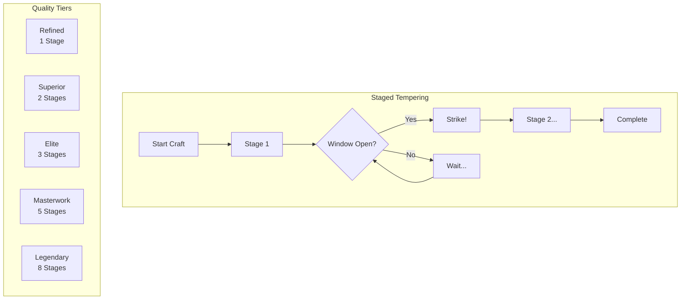
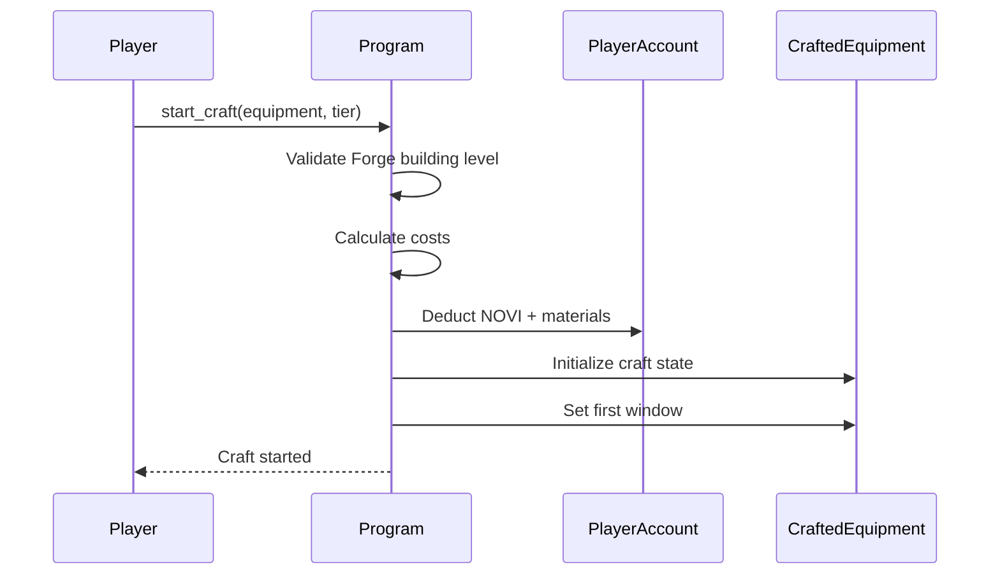
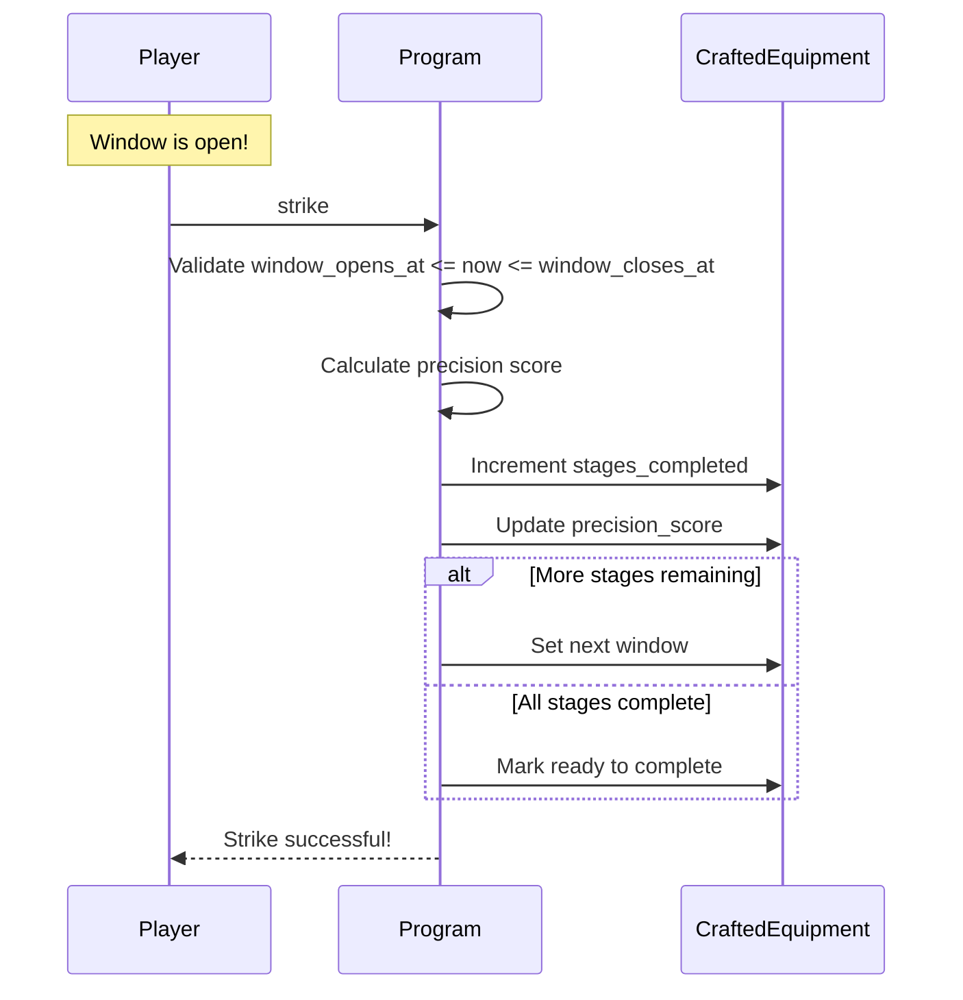
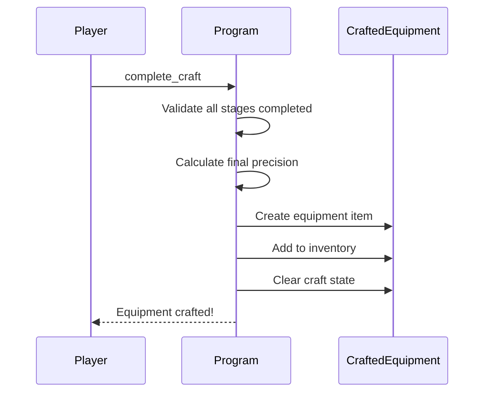
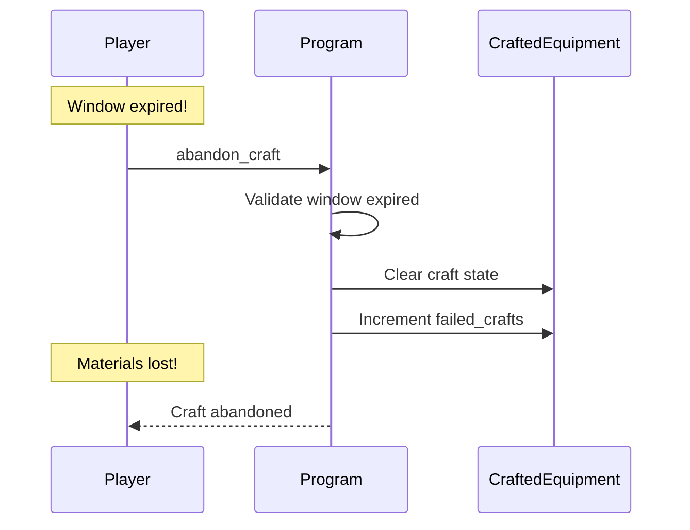
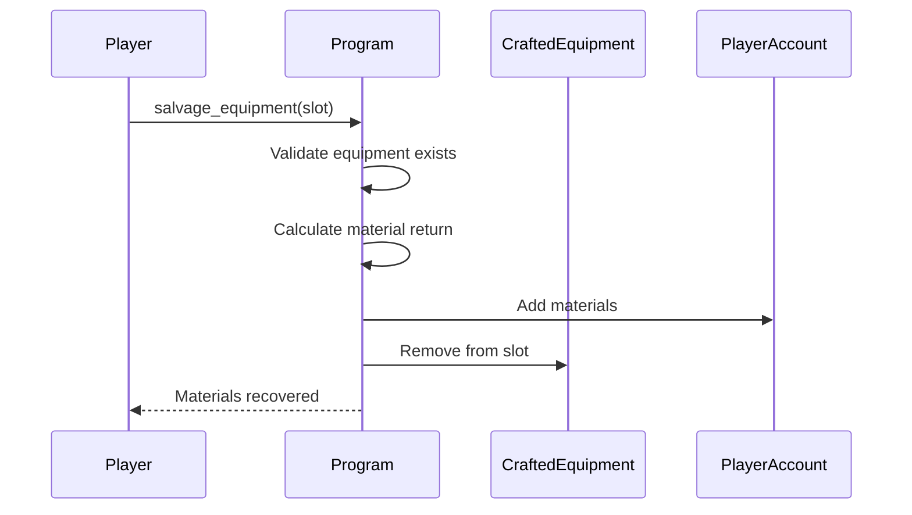

# Forge System

> Staged tempering crafting for equipment with skill-based progression.

## System Overview

The Forge System implements **Staged Tempering**, a skill-based crafting mechanic where players must interact with the crafting process at precise moments. Higher quality tiers require more stages and tighter timing windows.



## Instructions

| ID | Instruction | Description |
|----|-------------|-------------|
| 160 | `start_craft` | Begin staged tempering |
| 161 | `strike` | Hit during window |
| 162 | `complete_craft` | Finish successful craft |
| 163 | `abandon_craft` | Cancel failed craft |
| 164 | `salvage_equipment` | Break down for materials |

[Source: processor/forge/](../../../programs/novus_mundus/src/processor/forge/)

---

## Quality Tiers

| Tier | Value | Stages | Forge Level | Stat Bonus |
|------|-------|--------|-------------|------------|
| Common | 0 | - | Shop bought | Base |
| Refined | 1 | 1 | 1+ | +10% |
| Superior | 2 | 2 | 5+ | +25% |
| Elite | 3 | 3 | 8+ | +50% |
| Masterwork | 4 | 5 | 12+ | +100% |
| Legendary | 5 | 8 | 16+ | +200% |
| Mythic | 6 | 11 | 18+ | +350% |
| Divine | 7 | 13 | 20 | +500% |

Stage requirements follow **Fibonacci-like progression**: 1, 2, 3, 5, 8, 11, 13...

---

## CraftedEquipmentAccount

Each player has one account tracking their crafted equipment:

```
CraftedEquipmentAccount:
├── owner: Pubkey
├── bump: u8
│
├── // Active Craft State
├── active_craft_equipment: u8  // Equipment type being crafted
├── target_tier: u8             // Target quality tier
├── stages_required: u8         // Total stages needed
├── current_stage: u8           // Current stage (1-indexed)
├── stages_completed: u8        // Successful strikes
├── window_opens_at: i64        // When window opens
├── window_closes_at: i64       // When window closes
├── craft_started_at: i64       // Start timestamp
├── precision_score: u16        // Accumulated precision
│
├── // Crafted Equipment Slots (8 slots)
├── equipment: [CraftedItem; 8]
│
├── // Stats
├── total_crafts: u32
├── successful_crafts: u32
├── failed_crafts: u32
├── total_novi_spent: u64
└── total_materials_spent: u64
```

### CraftedItem Structure

```
CraftedItem:
├── equipment_type: u8    // CraftableEquipment enum
├── quality_tier: u8      // QualityTier enum
├── crafted_at: i64       // Timestamp
├── precision_score: u16  // How well crafted
└── equipped: bool        // Currently in use
```

---

## Craftable Equipment Types

| Type | Value | Category | Effect |
|------|-------|----------|--------|
| Sword | 0 | Melee | +Attack |
| Shield | 1 | Armor | +Defense |
| Bow | 2 | Ranged | +Ranged Attack |
| Helmet | 3 | Armor | +HP |
| Chestplate | 4 | Armor | +Defense |
| Boots | 5 | Armor | +Speed |
| Ring | 6 | Accessory | +Crit |
| Amulet | 7 | Accessory | +All stats |

---

## Staged Tempering Process

### 1. Start Craft

**Instruction:** `160 - start_craft`



**Costs by Tier:**

| Tier | NOVI | Common | Uncommon | Rare | Epic | Legendary |
|------|------|--------|----------|------|------|-----------|
| Refined | 1,000 | 10 | 0 | 0 | 0 | 0 |
| Superior | 5,000 | 25 | 5 | 0 | 0 | 0 |
| Elite | 15,000 | 50 | 15 | 3 | 0 | 0 |
| Masterwork | 50,000 | 100 | 40 | 10 | 2 | 0 |
| Legendary | 150,000 | 200 | 100 | 30 | 8 | 1 |
| Mythic | 400,000 | 500 | 250 | 80 | 20 | 5 |
| Divine | 1,000,000 | 1000 | 500 | 200 | 50 | 15 |

### 2. Strike During Window

**Instruction:** `161 - strike`



### Window Timing

Each stage has a window when the "metal is at the right temperature":

```
stage_interval = quality_tier.stage_interval_secs()
window_opens = previous_strike + stage_interval
window_closes = window_opens + window_duration

// Window duration varies by tier and Forge level
base_window = tier.base_window_duration()
forge_bonus = forge_level * 2  // +2 seconds per Forge level
window_duration = base_window + forge_bonus
```

### Precision Scoring

How close to the center of the window you strike:

```
window_center = window_opens + (window_duration / 2)
deviation = |now - window_center|
max_deviation = window_duration / 2

precision = 100 - (deviation / max_deviation * 100)
```

Higher precision scores improve final equipment stats.

### 3. Complete Craft

**Instruction:** `162 - complete_craft`



### 4. Failed Craft (Missed Window)

If you miss a window (don't strike before `window_closes_at`):

**Instruction:** `163 - abandon_craft`



**Materials are NOT refunded** on failed crafts. This creates meaningful skill-based risk.

---

## Forge Building Requirements

| Forge Level | Max Tier Craftable | Window Bonus |
|-------------|-------------------|--------------|
| 1-4 | Refined | +2-8 sec |
| 5-7 | Superior | +10-14 sec |
| 8-11 | Elite | +16-22 sec |
| 12-15 | Masterwork | +24-30 sec |
| 16-17 | Legendary | +32-34 sec |
| 18-19 | Mythic | +36-38 sec |
| 20 | Divine | +40 sec |

Higher Forge levels also **reduce required stages**:

```
base_stages = tier.base_stages()
reduction = forge_level / 5  // 1 stage per 5 levels
actual_stages = max(base_stages - reduction, 1)
```

---

## Salvage System

**Instruction:** `164 - salvage_equipment`

Break down equipment to recover materials:



**Recovery Rates:**

| Tier | Recovery % |
|------|------------|
| Refined | 30% |
| Superior | 35% |
| Elite | 40% |
| Masterwork | 45% |
| Legendary | 50% |
| Mythic | 55% |
| Divine | 60% |

NOVI is never recovered - it's burned in the forge fire.

---

## Equipment Stats

Final stats are calculated from:

```
base_stats = equipment_type.base_stats()
tier_multiplier = quality_tier.stat_multiplier()
precision_bonus = (precision_score / 100) * 0.1  // Up to +10%

final_stats = base_stats * tier_multiplier * (1 + precision_bonus)
```

**Example:**
- Sword (base 100 attack)
- Masterwork tier (2.0x multiplier)
- 85% precision score (+8.5%)
- Final: 100 × 2.0 × 1.085 = **217 attack**

---

## Client Integration

### Start Craft

```javascript
async function startCraft(connection, wallet, equipmentType, qualityTier) {
  // Check Forge level
  const estate = await getPlayerEstate(connection, wallet.publicKey);
  const forgeLevel = estate.buildings.forge;

  if (forgeLevel < getRequiredForgeLevel(qualityTier)) {
    throw new Error(`Forge level ${getRequiredForgeLevel(qualityTier)} required`);
  }

  // Check materials
  const player = await getPlayerAccount(connection, wallet.publicKey);
  const costs = getMaterialCosts(qualityTier);

  if (player.commonMaterials < costs.common ||
      player.uncommonMaterials < costs.uncommon) {
    throw new Error('Insufficient materials');
  }

  const ix = startCraftInstruction({
    equipmentType,
    qualityTier
  });

  return sendTransaction(connection, wallet, [ix]);
}
```

### Monitor Craft Window

```javascript
function getCraftStatus(craftedEquipment) {
  if (craftedEquipment.activeCraftEquipment === 255) {
    return { status: 'idle' };
  }

  const now = Date.now() / 1000;
  const windowOpens = craftedEquipment.windowOpensAt;
  const windowCloses = craftedEquipment.windowClosesAt;

  if (now < windowOpens) {
    return {
      status: 'waiting',
      stage: craftedEquipment.currentStage,
      totalStages: craftedEquipment.stagesRequired,
      windowOpensIn: windowOpens - now
    };
  }

  if (now >= windowOpens && now <= windowCloses) {
    const windowCenter = windowOpens + (windowCloses - windowOpens) / 2;
    const distanceFromCenter = Math.abs(now - windowCenter);

    return {
      status: 'window_open',
      stage: craftedEquipment.currentStage,
      totalStages: craftedEquipment.stagesRequired,
      windowClosesIn: windowCloses - now,
      precision: calculatePrecision(now, windowOpens, windowCloses),
      optimalTime: windowCenter
    };
  }

  // Window expired
  return {
    status: 'failed',
    stage: craftedEquipment.currentStage,
    reason: 'Window expired'
  };
}
```

### Strike Timing UI

```javascript
function renderCraftingUI(craftStatus) {
  if (craftStatus.status === 'idle') {
    return '[Start New Craft]';
  }

  if (craftStatus.status === 'waiting') {
    return `
      Stage ${craftStatus.stage}/${craftStatus.totalStages}
      Window opens in: ${formatDuration(craftStatus.windowOpensIn)}
      [Preparing...]
    `;
  }

  if (craftStatus.status === 'window_open') {
    const precisionColor = craftStatus.precision > 80 ? 'green' :
                          craftStatus.precision > 50 ? 'yellow' : 'red';
    return `
      Stage ${craftStatus.stage}/${craftStatus.totalStages}
      STRIKE NOW!
      Precision: ${craftStatus.precision}% (${precisionColor})
      Window closes in: ${craftStatus.windowClosesIn.toFixed(1)}s
      [STRIKE!]
    `;
  }

  if (craftStatus.status === 'failed') {
    return `
      CRAFT FAILED
      ${craftStatus.reason}
      [Abandon Craft]
    `;
  }
}
```

---

## Materials Acquisition

| Material Tier | Sources |
|---------------|---------|
| Common | Encounters, Collections, Salvage |
| Uncommon | Mining Expeditions, Rallies |
| Rare | Fishing Expeditions, Events |
| Epic | Boss Encounters, High-Tier Expeditions |
| Legendary | World Bosses, Event Prizes |

Materials can also be converted upward:

```
10 Common → 1 Uncommon
10 Uncommon → 1 Rare
10 Rare → 1 Epic
10 Epic → 1 Legendary
```

---

*The Forge demands precision and patience. Master the art of tempering, and your weapons will be legend.*

---

Next: [Events](./events.md)
