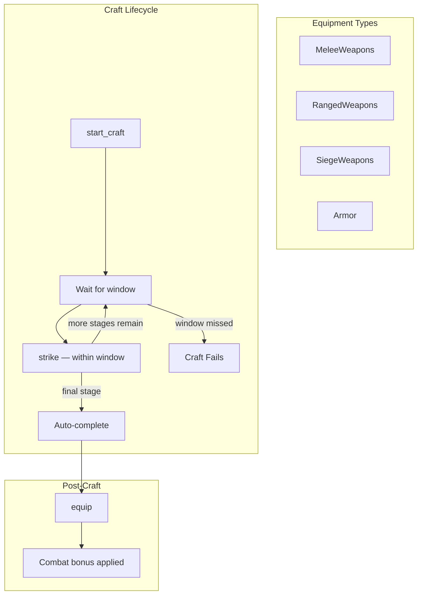
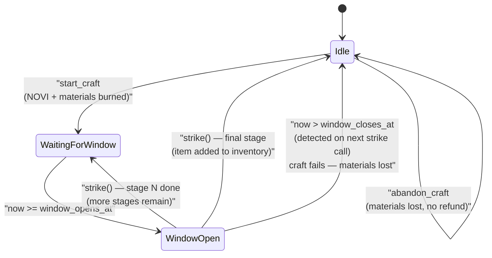
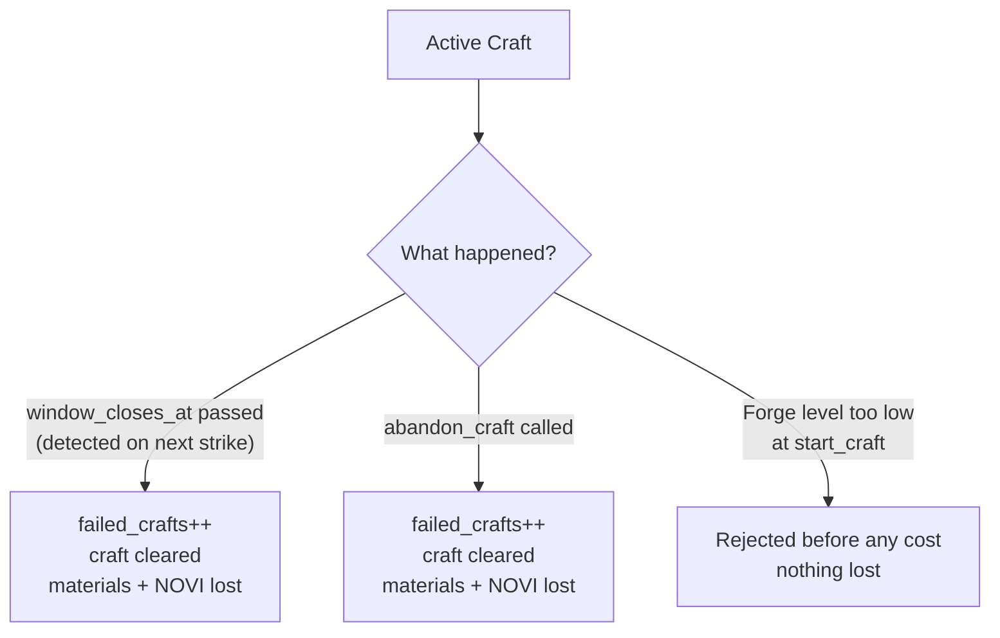
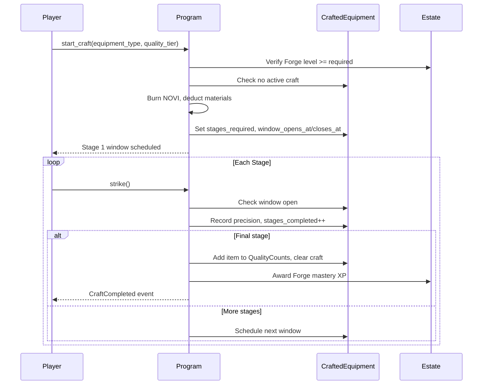

# Forge System

> Skill-based equipment crafting through staged tempering — strike while the iron is hot.

## System Overview

The Forge System lets players craft combat equipment at ascending quality tiers. Unlike passive wait-and-collect systems, crafting requires active participation: each quality tier demands multiple **tempering stages** where the player must call `strike` within a precise time window. Missing a window fails the craft and forfeits all materials.



## Instructions

| ID | Instruction | Description |
|----|-------------|-------------|
| 180 | `initialize` | Create `CraftedEquipmentAccount` for player |
| 181 | `start_craft` | Begin a staged tempering session |
| 182 | `strike` | Perform one tempering stage (within window) |
| 183 | `abandon_craft` | Cancel in-progress craft (materials lost) |
| 184 | `equip` | Equip a crafted item to gain combat bonus |

[Source: processor/forge/](../../../programs/novus_mundus/src/processor/forge/)

> **Note:** There is **no `complete_craft`** and **no `salvage`** instruction. The final `strike` auto-completes the craft. Old documentation listing a `complete_craft` or discriminants in the 160s was incorrect.

---

## Equipment Types

Four equipment categories can be crafted, each occupying its own equip slot:

| Value | Type | Combat Effect |
|-------|------|---------------|
| 0 | `MeleeWeapons` | Melee weapon damage bonus |
| 1 | `RangedWeapons` | Ranged weapon damage bonus |
| 2 | `SiegeWeapons` | Siege weapon damage bonus |
| 3 | `Armor` | Damage reduction bonus |

[Source: state/estate.rs — `CraftableEquipment`](../../../programs/novus_mundus/src/state/estate.rs)

---

## Quality Tiers

Eight quality tiers exist. Only tiers 1–7 are craftable (Common = 0 is shop-only baseline).


| Value | Tier | Forge Level Gate | Stages | Equip Bonus | NOVI Cost | Craft Time |
|-------|------|-----------------|--------|-------------|-----------|------------|
| 0 | Common | — | — | 0% | — | — |
| 1 | Refined | Lv 1 | 1 | +2.5% | 1,000 | 4h |
| 2 | Superior | Lv 5 | 2 | +5% | 2,618 | 8h |
| 3 | Elite | Lv 8 | 3 | +10% | 6,854 | 16h |
| 4 | Masterwork | Lv 12 | 5 | +15% | 17,944 | 24h |
| 5 | Legendary | Lv 16 | 8 | +25% | 46,979 | 48h |
| 6 | Mythic | Lv 18 | 11 | +40% | 122,991 | 72h |
| 7 | Divine | Lv 20 | 13 | +60% | 322,069 | 7d |

Stages listed are **base values** at Forge Lv 0. Higher Forge levels reduce stages required (see Staged Tempering section).

> **Note:** There is **no mastery gate** to start a craft. The only gate is the Forge building level.

[Source: state/estate.rs — `QualityTier`](../../../programs/novus_mundus/src/state/estate.rs)

---

## Material Costs

Each tier requires specific crafting materials (held in player inventory):

| Tier | Common | Uncommon | Rare | Epic | Legendary |
|------|--------|----------|------|------|-----------|
| Refined | 50 | 0 | 0 | 0 | 0 |
| Superior | 100 | 25 | 0 | 0 | 0 |
| Elite | 0 | 100 | 25 | 0 | 0 |
| Masterwork | 0 | 0 | 100 | 25 | 0 |
| Legendary | 0 | 0 | 0 | 100 | 25 |
| Mythic | 0 | 0 | 0 | 0 | 200 |
| Divine | 0 | 0 | 0 | 0 | 400 |

NOVI is **burned** at craft start. Materials and NOVI are **not refunded** on failure or abandon.

---

## Staged Tempering System

### Core Mechanic

Each craft consists of `stages_required` tempering windows. The player must call `strike` within the active window for each stage.



```
Stage timing:
  window_opens  = craft_start + stage_interval
  window_closes = window_opens + window_duration

  Too early (now < window_opens)  → Error: StrikeTooEarly
  On time  (now in [opens, closes]) → Stage complete, precision recorded
  Too late (now > window_closes)   → Craft fails, materials lost
```

### Forge Level Bonuses

Higher Forge levels make crafting more forgiving:

- **Window duration**: `base + base × forge_level × 5 / 100` (capped at +100% at Lv 20)
- **Stages required**: −1 stage per 5 Forge levels (min 1 stage)

**Examples (Divine tier, 13 base stages, 60s base window):**

| Forge Level | Stages Required | Window Duration |
|-------------|----------------|-----------------|
| 0 | 13 | 60s |
| 5 | 12 | 75s |
| 10 | 11 | 90s |
| 15 | 10 | 105s |
| 20 | 9 | 120s |

### Stage Intervals by Tier

| Tier | Stage Interval | Base Window |
|------|---------------|-------------|
| Refined | 60s | 3600s (1h) |
| Superior | 50s | 1800s (30m) |
| Elite | 40s | 900s (15m) |
| Masterwork | 30s | 300s (5m) |
| Legendary | 25s | 120s (2m) |
| Mythic | 20s | 90s (1.5m) |
| Divine | 15s | 60s (1m) |

### Precision Scoring

Each strike calculates a precision score (0–10000) based on how close to the center of the window it was struck. Average precision across all stages is recorded and used to award Forge mastery XP.

```
precision = 10000 - (distance_from_center × 10000 / max_distance)
```

---

## Account Structure

### CraftedEquipmentAccount

Persistent per-player account (not closed after crafting). Tracks all crafted inventory and active craft state.

```rust
pub struct CraftedEquipmentAccount {
    pub owner: Address,               // 32 — Player wallet pubkey

    // Inventory: quality counts per equipment type
    pub melee_weapons: QualityCounts, // 32 — [u32; 8] counts per tier
    pub ranged_weapons: QualityCounts,// 32
    pub siege_weapons: QualityCounts, // 32
    pub armor: QualityCounts,         // 32

    // Active craft state (cleared on success/failure)
    pub active_craft_equipment: u8,   // 255 = none
    pub target_tier: u8,
    pub stages_required: u8,
    pub current_stage: u8,            // 1-indexed
    pub stages_completed: u8,
    pub window_opens_at: i64,
    pub window_closes_at: i64,
    pub craft_started_at: i64,
    pub precision_score: u16,

    // Lifetime stats
    pub total_crafts: u32,
    pub successful_crafts: u32,
    pub failed_crafts: u32,
    pub total_novi_spent: u64,

    // Equipped tiers (0 = unequipped, 1–7 = QualityTier)
    pub active_melee_tier: u8,
    pub active_ranged_tier: u8,
    pub active_siege_tier: u8,
    pub active_armor_tier: u8,

    pub bump: u8,
    pub _padding: [u8; 3],
}
```

**PDA seeds:** `["crafted_equipment", owner_wallet]`

> **Note:** `AccountKey::ForgeSession = 46` is the discriminant used by `CraftedEquipmentAccount` (despite the enum name). This account lives in `state/estate.rs`, not a dedicated file.

[Source: state/estate.rs](../../../programs/novus_mundus/src/state/estate.rs)

---

## Craft Failure Modes



| Scenario | Result |
|----------|--------|
| Window missed (`now > window_closes_at`) | `failed_crafts++`, craft cleared, materials/NOVI lost |
| `abandon_craft` called | Same as window miss, intentional |
| Forge building not at required level | `start_craft` rejected before any cost |

---

## Equip Bonus Calculation

Equipping applies the following bonuses to `PlayerAccount`:

```
equipped_weapon_bonus_bps = sum(tier_to_bonus_bps(melee), tier_to_bonus_bps(ranged), tier_to_bonus_bps(siege))
equipped_armor_bonus_bps  = tier_to_bonus_bps(armor)
```

| Tier | `tier_to_bonus_bps` |
|------|---------------------|
| 0 (unequipped) | 0 |
| 1 Refined | 250 (+2.5%) |
| 2 Superior | 500 (+5%) |
| 3 Elite | 1000 (+10%) |
| 4 Masterwork | 1500 (+15%) |
| 5 Legendary | 2500 (+25%) |
| 6 Mythic | 4000 (+40%) |
| 7 Divine | 6000 (+60%) |

A player can equip **one item per equipment type** at a time.

---

## Forge Mastery XP

Successful crafts award Mastery XP to the Forge building slot:

| Tier | Base Mastery XP |
|------|----------------|
| Refined | 10 |
| Superior | 25 |
| Elite | 50 |
| Masterwork | 100 |
| Legendary | 200 |
| Mythic | 400 |
| Divine | 800 |

Precision bonus adds `avg_precision / 100` XP. The daily Forge mini-game mastery bonus (`estate.mastery_bonus_bps`) applies multiplicatively.

Mastery XP accumulates on `BuildingSlot.mastery_xp`; each level-up requires `100 × next_level²` XP, capped at mastery level 100.

---

## Craft Flow



---

## Client Integration

```typescript
import {
  createInitializeForgeInstruction,
  createStartCraftInstruction,
  createStrikeInstruction,
  createEquipInstruction,
} from '@novus-mundus/sdk';
import { CraftableEquipment, QualityTier } from '@novus-mundus/sdk';

// Initialize (once per player)
const initIx = createInitializeForgeInstruction({ owner, gameEngine });

// Start a Masterwork Melee Weapon craft
const startIx = createStartCraftInstruction(
  { owner, gameEngine },
  { equipmentType: CraftableEquipment.MeleeWeapons, qualityTier: QualityTier.Masterwork }
);

// Poll CraftedEquipmentAccount and strike when window is open
const craftedEquipmentPda = deriveCraftedEquipmentPda(owner);
const account = await fetchCraftedEquipmentAccount(connection, craftedEquipmentPda);

const now = Math.floor(Date.now() / 1000);
if (now >= account.windowOpensAt && now <= account.windowClosesAt) {
  const strikeIx = createStrikeInstruction({ owner, gameEngine });
}

// Equip after a successful craft
const equipIx = createEquipInstruction(
  { owner, gameEngine },
  { equipmentType: CraftableEquipment.MeleeWeapons, qualityTier: QualityTier.Masterwork }
);
```

---

*The Forge rewards patience and precision. Master the rhythm of tempering to craft equipment that defines battle outcomes.*

---

Next: [Sanctuary](./sanctuary.md)
