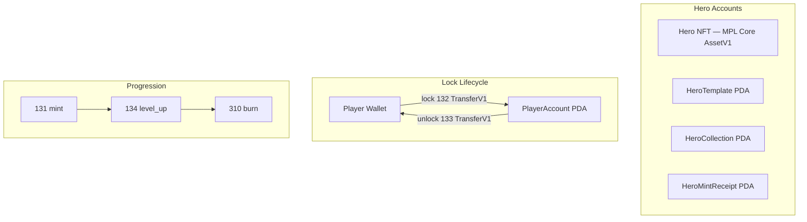
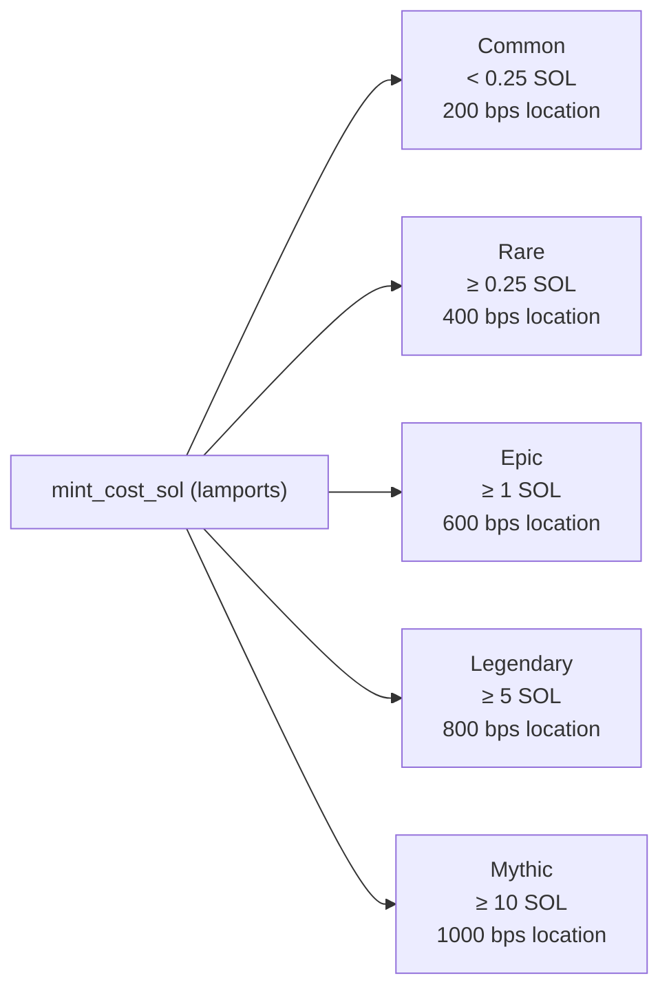
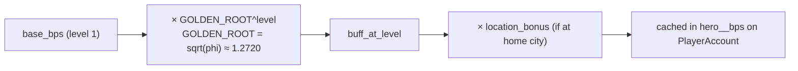
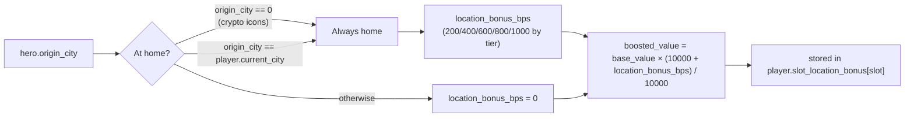

# Hero System

> MPL Core NFT heroes that provide deterministic, level-scaled buffs through the golden-root progression formula.

## Overview

Heroes are **MPL Core NFTs** (the `p-core` program), not program-owned accounts. All mutable hero state (level, XP, buff values) lives in the NFT's Attributes plugin. The program derives hero stats by parsing those attributes at runtime — no separate hero program account exists per mint.

Supporting program accounts: `HeroTemplate` (DAO-configured stat template), `HeroCollection` (shared collection), and `HeroMintReceipt` (per-player per-template mint gate).



## Instructions

| ID | Instruction | Description |
|----|-------------|-------------|
| 130 | `create_template` | Admin: create a `HeroTemplate` config (DAO) |
| 131 | `mint` | Mint a hero NFT; pays SOL; creates receipt PDA |
| 132 | `lock` | Transfer NFT wallet → `PlayerAccount` PDA; activates buffs |
| 133 | `unlock` | Transfer NFT `PlayerAccount` PDA → wallet; deactivates buffs |
| 134 | `level_up` | Consume fragments to advance hero level by 1 |
| 135 | `assign_defensive` | Set which locked slot is used for PvP defense |
| 136 | `create_collection` | Admin: initialize the shared `HeroCollection` PDA |
| 310 | `burn` | Destroy a hero NFT (must be in wallet); receive locked NOVI |
| 311 | `update_supply_cap` | Admin: change a template's mint supply cap |

**Meditation (IDs 137–139)** is the Sanctuary system, not documented here. See [Sanctuary](./sanctuary.md).

[Source: processor/hero/](../../../programs/novus_mundus/src/processor/hero/)

---

## HeroTemplate Account

All heroes of the same type share one `HeroTemplate` PDA configured by the DAO:

```rust
pub struct HeroTemplate {
    pub account_key: u8,           // 1  — discriminator
    pub template_id: u16,          // 2  — unique ID (0–65535)
    pub name: [u8; 32],            // 32 — ASCII name
    pub hero_type: u8,             // 1  — HeroType enum (Offensive/Defensive/Economic/Hybrid)
    pub category: u8,              // 1  — HeroCategory enum (Historical/Mythological/CryptoIcons/Gaming/Original)
    pub mint_cost_sol: u64,        // 8  — lamports; determines tier
    pub supply_cap: u32,           // 4  — 0 = unlimited
    pub minted_count: u32,         // 4  — current live supply
    pub enabled: bool,             // 1
    pub event_exclusive: bool,     // 1  — only mintable during active event
    pub required_player_level: u8, // 1
    pub meditation_city_id: u16,   // 2  — 0 = anywhere (crypto icon heroes)
    pub buffs: [BuffConfig; 4],    // 4 × 5 = 20 bytes — up to 4 buff stats
    pub bump: u8,                  // 1
    pub _padding: [u8; 3],         // 3
}
// PDA: [HERO_TEMPLATE_SEED, template_id_le2]

pub struct BuffConfig {
    pub stat: u8,       // 1 — BuffStat enum value (0=None)
    pub base_bps: u16,  // 2 — base buff at level 1 in basis points
    pub _reserved: [u8; 2],
}
```

[Source: state/hero.rs](../../../programs/novus_mundus/src/state/hero.rs)

---

## Hero Tiers

Tier is derived at runtime from `template.mint_cost_sol` (lamports):



| Tier | Name | Min Cost (lamports) | Location Bonus |
|------|------|---------------------|---------------|
| 0 | Common | < 250,000,000 (0.25 SOL) | 200 bps (2%) |
| 1 | Rare | ≥ 250,000,000 | 400 bps (4%) |
| 2 | Epic | ≥ 1,000,000,000 (1 SOL) | 600 bps (6%) |
| 3 | Legendary | ≥ 5,000,000,000 (5 SOL) | 800 bps (8%) |
| 4 | Mythic | ≥ 10,000,000,000 (10 SOL) | 1000 bps (10%) |

> **Old-docs trap:** There is no "Uncommon" tier. The five tiers are Common, Rare, Epic, Legendary, and Mythic.

[Source: state/hero.rs — `tier_from_mint_cost`](../../../programs/novus_mundus/src/state/hero.rs)

---

## Buff Stats

Heroes provide up to 4 buffs from the `BuffStat` enum:

| Value | Stat | Cached On Player |
|-------|------|-----------------|
| 0 | None | — |
| 1 | AttackPower | `hero_attack_bps` |
| 2 | DefensePower | `hero_defense_bps` |
| 3 | CashCollectionRate | `hero_economy_bps` |
| 4 | XpGain | `hero_xp_gain_bps` |
| 5 | TrainingCostReduction | `hero_training_cost_reduction_bps` |
| 6 | RallyCapacity | `hero_rally_capacity_bps` |
| 7 | CriticalHitChance | `hero_crit_chance_bps` |
| 8 | SynchronyBonus | `hero_synchrony_bonus_bps` |
| 9 | ResourceCapacity | `hero_resource_capacity_bps` |
| 10 | WeaponEfficiency | `hero_weapon_efficiency_bps` |
| 11 | StaminaRegen | `hero_stamina_regen_bps` |
| 12 | ProduceGeneration | `hero_produce_generation_bps` |
| 13 | UnitCapacity | `hero_unit_capacity_bps` |
| 14 | EncounterDamage | `hero_encounter_damage_bps` |
| 15 | LootBonus | `hero_loot_bonus_bps` |
| 16 | ArmorEfficiency | `hero_armor_efficiency_bps` |
| 17 | MiningAffinity | not cached — applied at expedition claim |
| 18 | FishingAffinity | not cached — applied at expedition claim |

[Source: state/hero.rs — BuffStat enum](../../../programs/novus_mundus/src/state/hero.rs)

---

## Buff Scaling Formula

Buff value at any level is deterministically calculated:



```
buff_at_level = base_bps * GOLDEN_ROOT^level

GOLDEN_ROOT = sqrt(phi) = 1.2720196495140689

// Implementation: libm::pow(GOLDEN_ROOT, level as f64)
// Level 0 returns base_bps unchanged (0 exponent → 1.0)
```

Example: `base_bps = 500`, level 5:
```
500 * 1.2720^5 = 500 * 3.326 ≈ 1663 bps (≈16.6%)
```

[Source: state/hero.rs — BuffConfig::value_at_level](../../../programs/novus_mundus/src/state/hero.rs)

---

## NFT Attributes (On-Chain Format)

Every hero NFT carries **up to** 9 MPL Core Attributes (5 fixed + up to 4 buff slots):

| Attribute Key | Type | Description |
|--------------|------|-------------|
| `Level` | u32 | Current hero level |
| `XP` | u32 | Meditation XP accumulated |
| `Template` | u16 | Template ID (immutable) |
| `Serial` | u32 | Mint serial number (immutable) |
| `Origin` | u16 | Origin/meditation city ID (immutable) |
| Buff key (e.g. `Attack`) | u32 | Buff value at current level |
| Buff key (e.g. `Defense`) | u32 | Buff value at current level |
| Buff key (e.g. `Encounter`) | u32 | Buff value at current level |
| Buff key (e.g. `Loot`) | u32 | Buff value at current level |

> **Attribute count:** Heroes carry **up to** 9 attributes. Heroes with fewer than 4 active buff slots (i.e. some `BuffConfig.stat == None`) carry fewer attributes — only non-None buff slots produce attribute entries.

Buff attribute keys are returned by `get_buff_stat_name(stat)`:

| BuffStat value | Attribute key |
|----------------|--------------|
| 1 — AttackPower | `Attack` |
| 2 — DefensePower | `Defense` |
| 3 — CashCollectionRate | `Economy` |
| 4 — XpGain | `XPGain` |
| 5 — TrainingCostReduction | `Training` |
| 6 — RallyCapacity | `Rally` |
| 7 — CriticalHitChance | `Crit` |
| 8 — SynchronyBonus | `Synchrony` |
| 9 — ResourceCapacity | `Storage` |
| 10 — WeaponEfficiency | `Weapon` |
| 11 — StaminaRegen | `Stamina` |
| 12 — ProduceGeneration | `Produce` |
| 13 — UnitCapacity | `Units` |
| 14 — EncounterDamage | `Encounter` |
| 15 — LootBonus | `Loot` |
| 16 — ArmorEfficiency | `Armor` |
| 17 — MiningAffinity | `Unknown` |
| 18 — FishingAffinity | `Unknown` |

> **Note on stats 17 & 18:** `get_buff_stat_name()` returns `"Unknown"` for MiningAffinity and FishingAffinity — these two buffs are **never applied to player buff fields** and will not appear as named attributes. MiningAffinity and FishingAffinity affect expedition outcomes directly at expedition claim time, bypassing the player buff cache entirely.

[Source: helpers/hero.rs — build_hero_nft_attributes](../../../programs/novus_mundus/src/helpers/hero.rs)
[Source: helpers/nft_parser.rs](../../../programs/novus_mundus/src/helpers/nft_parser.rs)

---

## Mint — `mint` (ID 131)

**Instruction data (2 bytes):**
```
[0..2] template_id: u16 (LE)
```

**Guards:**
- Template enabled, supply cap not exceeded, event_exclusive check
- `player.level >= template.required_player_level`
- `HeroMintReceipt` PDA `[HERO_MINT_RECEIPT_SEED, player_account, template_id_le2]` must not yet exist (one per player per template)

**Actions:**
1. Transfer SOL (`template.mint_cost_sol`) from minter wallet to treasury.
2. Create 0-byte `HeroMintReceipt` PDA (existence proves prior mint).
3. MPL Core `CreateV1` → new `AssetV1` owned by minter.
4. MPL Core `AddPluginV1` → attach Attributes plugin with all 9 attributes at level 1.
5. Increment `template.minted_count`.
6. If `sanctuary_level >= 5`: credit locked NOVI bonus to `player.locked_novi`.

**Sanctuary mint bonus:**
```
bonus_bps = 500 (lv 5–9) | 1000 (lv 10–14) | 1500 (lv 15–19) | 2000 (lv 20+)
novi_equiv  = mint_cost_lamports / 10000
mint_bonus  = novi_equiv * bonus_bps / 10000
```

---

## Lock — `lock` (ID 132)

**Instruction data (1 byte):**
```
[0] slot_index: u8   // 0, 1, or 2
```

**Guards:**
- `EXT_RALLY` extension unlocked
- Sanctuary (estate building) level ≥ 1
- Slot must be empty (`player.active_hero_at(slot_index) == NULL_PUBKEY`)
- Hero must be in the player's wallet (NFT owner == signer)
- `can_lock_hero(estate, current_locked_count)` — maximum concurrent locks depends on Sanctuary level

**Actions:**
1. MPL Core `TransferV1` — moves NFT from owner wallet to `PlayerAccount` PDA.
2. Parse hero attributes from NFT.
3. Verify HeroTemplate PDA from parsed `template_id`.
4. Calculate location-synergy bonus if hero's `origin_city` matches player's `current_city`.
5. Apply buffs to player's cached stats (`hero_attack_bps`, etc.) with location bonus.
6. Set `player.active_heroes[slot_index] = hero_mint`.

---

## Unlock — `unlock` (ID 133)

Reverses lock. MPL Core `TransferV1` moves NFT from `PlayerAccount` PDA back to owner wallet. Removes buff contribution from player's cached stats.

---

## Level Up — `level_up` (ID 134)

No instruction data. Always increments level by exactly 1.

**Guards:**
- `EXT_HEROES` extension unlocked
- Sanctuary level ≥ 1
- `player.fragments >= fragment_cost`
- `parsed_hero.level < hero_level_cap(estate)`

**Fragment cost:**
```
fragment_cost = 10 * (1.5 ^ current_level)

// Sanctuary level cap:
// Lv  1–4:  cap =  10
// Lv  5–9:  cap =  25
// Lv 10–14: cap =  50
// Lv 15+:   cap = 100
```

**Actions:**
1. Deduct fragments from `player.fragments`.
2. If hero is locked: apply buff delta (new level − old level) to cached player stats.
3. MPL Core `UpdatePluginV1` → rewrite all 9 NFT attributes with new level and recalculated buff values.

---

## Assign Defensive — `assign_defensive` (ID 135)

**Instruction data (1 byte):**
```
[0] slot_index: u8   // 0, 1, or 2
```

Sets `player.defensive_hero_slot = slot_index`. The hero in that slot provides its buffs when the player is attacked. The slot must be occupied (not `NULL_PUBKEY`).

---

## Burn — `burn` (ID 310)

**Instruction data (2 bytes):**
```
[0..2] template_id: u16 (LE)
```

**Guards:**
- Hero must be in the player's **wallet** (not locked in any active slot)
- NFT owner must be the signer

**Burn reward (locked NOVI):**
```
// Note: level.max(1) is used — a level-0 hero burns as if level 1
novi_reward = tier_base * level.max(1)^2

// tier_base values:
// Common (0):    500
// Rare (1):    5,000
// Epic (2):   20,000
// Legendary (3): 100,000
// Mythic (4):    250,000
```

**Actions:**
1. MPL Core `BurnV1` — destroys the NFT.
2. Credit `novi_reward` to `player.locked_novi`.
3. Decrement `template.minted_count` (supply becomes recyclable).
4. Close `HeroMintReceipt` PDA (allows this player to mint the same template again).

[Source: processor/hero/burn.rs](../../../programs/novus_mundus/src/processor/hero/burn.rs)

---

## Location Synergy

When a player arrives in a new city (via `intercity_complete` or `intercity_teleport`), all locked heroes are re-evaluated for location synergy:



```
is_at_home = (hero.origin_city == 0)        // crypto icons always at home
           || (hero.origin_city == player.current_city)

location_bonus_bps = if is_at_home { location_bonus_for_tier(tier) } else { 0 }

// Applied multiplicatively to each buff value:
boosted_value = base_value * (10000 + location_bonus_bps) / 10000
```

The per-slot location bonus is stored in `player.slot_location_bonus[0..2]` for unlock reversal.

---

## HeroMintReceipt PDA

A 0-byte account at `[HERO_MINT_RECEIPT_SEED, player_account, template_id_le2]`. Its existence (non-zero lamports) proves the player already minted this template. Burning the hero closes the receipt, allowing a re-mint.

---

## Client Integration

```typescript
import {
  buildMintHeroIx,
  buildLockHeroIx,
  buildLevelUpHeroIx,
  buildBurnHeroIx,
} from "@novus-mundus/sdk";

// Mint
const mintIx = buildMintHeroIx({
  minter:              wallet.publicKey,
  playerAccount:       playerPDA,
  heroTemplate:        templatePDA,
  heroMint:            newMintKeypair.publicKey,
  heroCollection:      collectionPDA,
  treasury:            treasuryAddress,
  gameEngine:          gameEnginePDA,
  mintReceipt:         receiptPDA,
  estateAccount:       estatePDA,
  templateId:          42,   // u16
});

// Lock into slot 0
const lockIx = buildLockHeroIx({
  owner:           wallet.publicKey,
  playerAccount:   playerPDA,
  heroMint:        mintAddress,
  heroTemplate:    templatePDA,
  heroCollection:  collectionPDA,
  estateAccount:   estatePDA,
  slotIndex:       0,       // u8
});

// Level up
const levelUpIx = buildLevelUpHeroIx({
  owner:          wallet.publicKey,
  playerAccount:  playerPDA,
  heroMint:       mintAddress,
  heroTemplate:   templatePDA,
  heroCollection: collectionPDA,
  gameEngine:     gameEnginePDA,
  estateAccount:  estatePDA,
});

// Burn (hero must be in wallet)
const burnIx = buildBurnHeroIx({
  owner:          wallet.publicKey,
  playerAccount:  playerPDA,
  heroAsset:      mintAddress,
  heroTemplate:   templatePDA,
  heroCollection: collectionPDA,
  mintReceipt:    receiptPDA,
  templateId:     42,   // u16
});
```

---

Next: [Research](./research.md)
