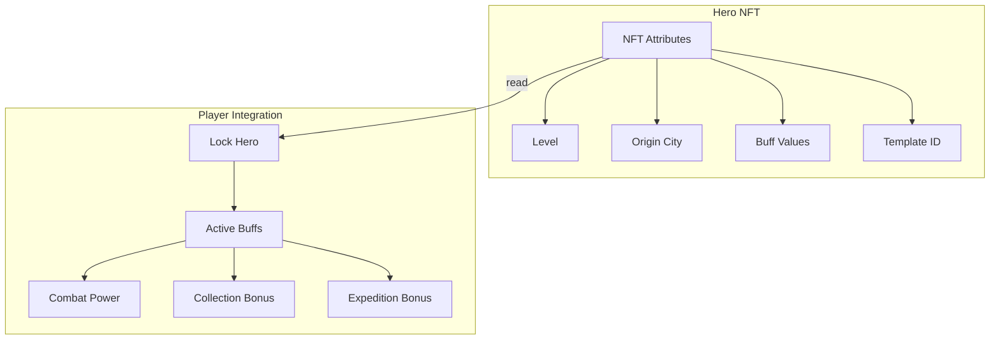
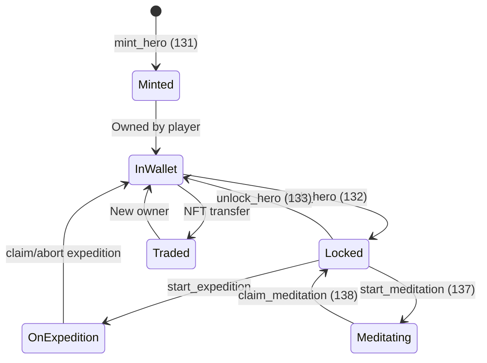
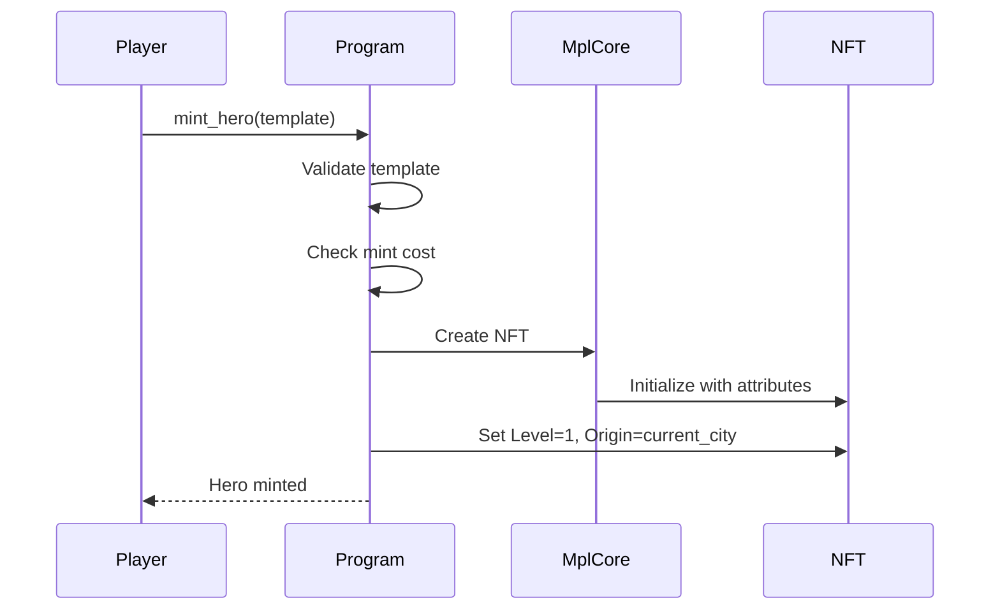
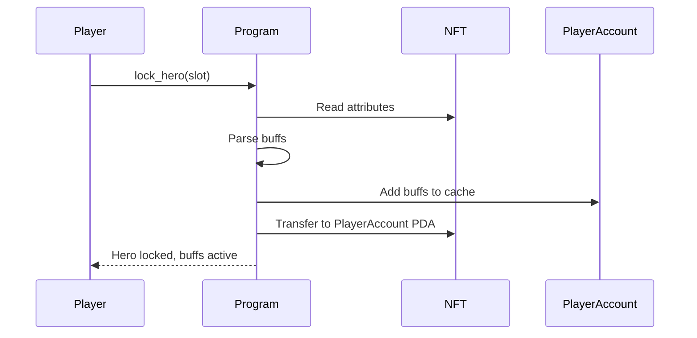
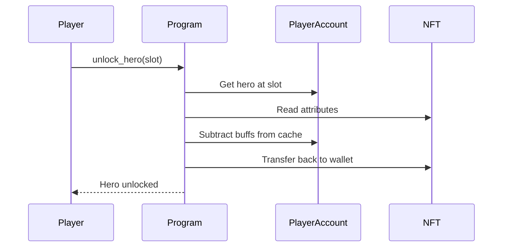
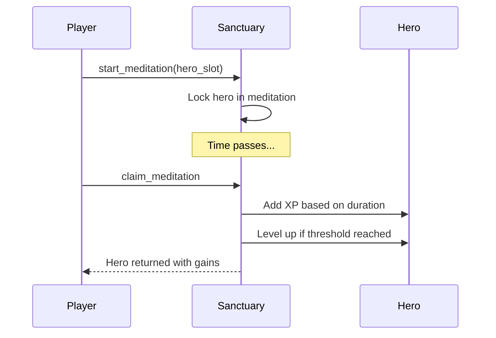

# Hero System

> NFT-based heroes that provide buffs and special abilities in Novus Mundus.

## System Overview

Heroes are **MPL Core NFTs** whose state lives entirely in on-chain NFT attributes. This makes heroes truly portable, tradeable, and verifiable.



## Hero Attributes

Each hero NFT contains these on-chain attributes:

| Attribute | Type | Description |
|-----------|------|-------------|
| `Level` | u32 | Current level (1-100) |
| `Template` | u16 | Hero template ID |
| `Serial` | u32 | Unique serial number |
| `Origin` | u16 | Origin city ID |
| `XP` | u32 | Meditation experience |
| Buff slots | u16 | Up to 4 buff values |

### Buff Types

| Buff | ID | Effect |
|------|-----|--------|
| AttackPower | 1 | +X% attack in combat |
| DefensePower | 2 | +X% defense in combat |
| CashCollectionRate | 3 | +X% cash collection |
| XpGain | 4 | +X% experience gain |
| TrainingCostReduction | 5 | -X% unit training cost |
| RallyCapacity | 6 | +X% rally unit capacity |
| CriticalHitChance | 7 | +X% critical hit chance |
| SynchronyBonus | 8 | +X% team synergy |
| ResourceCapacity | 9 | +X% storage capacity |
| WeaponEfficiency | 10 | +X% weapon effectiveness |
| StaminaRegen | 11 | +X% stamina recovery |
| ProduceGeneration | 12 | +X% produce yield |
| UnitCapacity | 13 | +X% unit cap |
| EncounterDamage | 14 | +X% PvE damage |
| LootBonus | 15 | +X% loot drops |
| ArmorEfficiency | 16 | +X% armor effectiveness |
| MiningAffinity | 17 | +X% mining expedition yield |
| FishingAffinity | 18 | +X% fishing expedition yield |

[Source: state/hero.rs](../../../programs/novus_mundus/src/state/hero.rs)

---

## Hero Lifecycle



### Minting

**Instruction:** `131 - mint_hero`

Heroes are minted from templates defined by the game:



**Mint Attributes Set:**
- Level: 1
- Template: From instruction
- Serial: Auto-incremented
- Origin: Player's current city
- XP: 0
- Buffs: Calculated from template base values

[Source: processor/hero/mint.rs](../../../programs/novus_mundus/src/processor/hero/mint.rs)

### Locking

**Instruction:** `132 - lock_hero`

Locking a hero activates its buffs on the player:



**Locking Requirements:**
1. Sanctuary building at required level
2. Available hero slot (1-5 based on Sanctuary)
3. Hero must be in player's wallet

**Buff Caching:**
When a hero is locked, its buffs are added to PlayerAccount cached totals:
```
player.hero_attack_bps += hero_attack_buff
player.hero_defense_bps += hero_defense_buff
// etc.
```

This allows combat to read buffs without parsing NFTs.

[Source: processor/hero/lock.rs](../../../programs/novus_mundus/src/processor/hero/lock.rs)

### Unlocking

**Instruction:** `133 - unlock_hero`

Unlocking removes buffs and returns the NFT:



[Source: processor/hero/unlock.rs](../../../programs/novus_mundus/src/processor/hero/unlock.rs)

---

## Buff Scaling

Hero buffs scale with level using the **Golden Ratio (φ)**:

```
buff_at_level = base_bps × (√φ)^level
```

Where:
- `base_bps` = Base buff value in basis points
- `φ` ≈ 1.618 (Golden Ratio)
- `√φ` ≈ 1.272

### Scaling Example

| Level | Multiplier | 500 base → |
|-------|------------|------------|
| 1 | 1.00 | 500 |
| 5 | 1.65 | 825 |
| 10 | 2.73 | 1,365 |
| 20 | 7.43 | 3,715 |
| 50 | 149.6 | 74,800 |
| 100 | 22,377 | 11,188,500 |

This creates meaningful progression while keeping early levels valuable.

[Source: logic/calculate_buff_at_level](../../../programs/novus_mundus/src/logic/mod.rs)

---

## Location Synergy

Heroes have an **origin city** set at mint time. When locked in their origin city, they receive bonus effectiveness.

### Origin Bonus Tiers

| Hero Tier | Origin Bonus |
|-----------|--------------|
| Common | +1% |
| Uncommon | +3% |
| Rare | +5% |
| Epic | +7% |
| Legendary | +10% |

### Checking Origin

```
is_at_home = (hero.origin_city == 0) || (hero.origin_city == player.current_city)
```

City 0 means "everywhere" - these heroes (like CryptoIcons) are always "at home."

[Source: state/hero.rs](../../../programs/novus_mundus/src/state/hero.rs) - `is_hero_at_home`

---

## Expedition Affinity

Heroes with MiningAffinity or FishingAffinity provide bonus yields on expeditions:

### Affinity Bonus

```
expedition_yield = base_yield × (1 + affinity_bps / 10000)
```

### Origin City Bonus (Expeditions)

When a hero's origin city matches the expedition location AND the hero has the relevant affinity:

```
origin_bonus = +25% (2500 bps)
```

This stacks multiplicatively:
```
final_yield = base × (1 + affinity) × (1 + origin_bonus)
```

**Example:**
- Base yield: 1,000 gems
- Hero with 2000 bps MiningAffinity: +20%
- Origin matches: +25%
- Final: 1,000 × 1.20 × 1.25 = 1,500 gems

[Source: processor/expedition/claim.rs](../../../programs/novus_mundus/src/processor/expedition/claim.rs)

---

## Meditation System

Heroes can meditate at the Sanctuary to gain XP and levels.

**Instructions:** `137 - start_meditation`, `138 - claim_meditation`

### Meditation Flow



### XP Calculation

```
xp_gained = duration_hours × xp_per_hour × (1 + sanctuary_bonus)
```

| Sanctuary Level | XP per Hour | Max Hours |
|-----------------|-------------|-----------|
| 1-5 | 100 | 8 |
| 6-10 | 150 | 12 |
| 11-15 | 200 | 16 |
| 16-20 | 300 | 24 |

### Leveling

```
xp_for_level(n) = base_xp × φ^(n-1)
```

[Source: processor/sanctuary/](../../../programs/novus_mundus/src/processor/sanctuary/)

---

## Hero Templates

Heroes are defined by templates that specify:

| Field | Description |
|-------|-------------|
| template_id | Unique identifier |
| name | Hero name |
| rarity | Common to Legendary |
| buffs | Array of (stat, base_value) |
| meditation_city_id | Origin city (0 = universal) |
| mint_cost_sol | Minting price |

### Creating Templates

**Instruction:** `130 - create_template`

Only admin can create templates. Templates are stored in HeroTemplate accounts.

[Source: processor/hero/create_template.rs](../../../programs/novus_mundus/src/processor/hero/create_template.rs)

---

## Hero Gallery Reference

See [HERO_GALLERY.md](../../HERO_GALLERY.md) for the complete list of available heroes with their:
- Names and lore
- Buff configurations
- Origin cities
- Rarity tiers

---

## Client Integration

### Parsing Hero NFT

```javascript
async function parseHeroNft(connection, mintAddress) {
  const asset = await fetchAsset(connection, mintAddress);

  // Extract attributes from MPL Core
  const attributes = asset.attributes;

  return {
    level: parseInt(attributes.find(a => a.key === 'Level')?.value || '1'),
    template: parseInt(attributes.find(a => a.key === 'Template')?.value || '0'),
    origin: parseInt(attributes.find(a => a.key === 'Origin')?.value || '0'),
    xp: parseInt(attributes.find(a => a.key === 'XP')?.value || '0'),
    buffs: parseBuffs(attributes)
  };
}
```

### Displaying Hero Buffs

```javascript
function formatBuff(stat, value) {
  const percentage = (value / 100).toFixed(1);
  const statNames = {
    1: 'Attack',
    2: 'Defense',
    17: 'Mining',
    18: 'Fishing',
    // ...
  };
  return `+${percentage}% ${statNames[stat] || 'Unknown'}`;
}
```

### Lock/Unlock Validation

```javascript
function canLockHero(player, estate, heroMint) {
  const sanctuaryLevel = getBuildingLevel(estate, BuildingType.MeditationChamber);
  const maxHeroes = getMaxLockedHeroes(sanctuaryLevel);
  const currentLocked = player.active_heroes.filter(h => h !== NULL_PUBKEY).length;

  if (currentLocked >= maxHeroes) {
    return { canLock: false, reason: `Max ${maxHeroes} heroes at Sanctuary Lv${sanctuaryLevel}` };
  }

  return { canLock: true };
}
```

---

*Heroes are the soul of your army. Choose wisely, level diligently, and deploy strategically.*

---

Next: [Expeditions](./expeditions.md)
