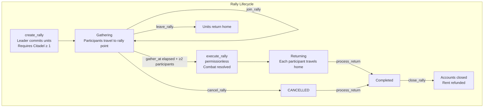
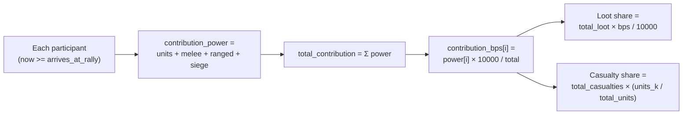
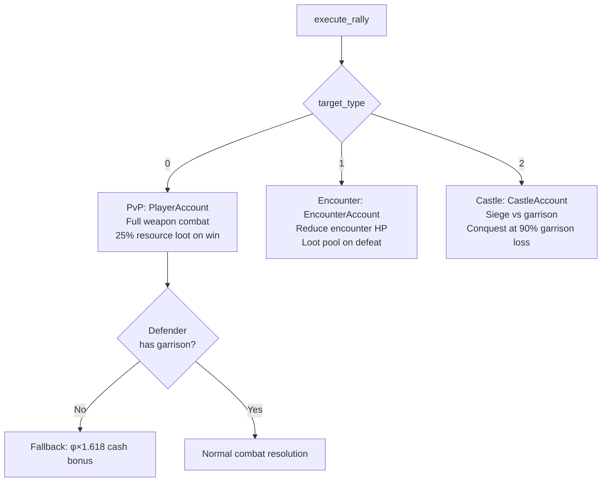
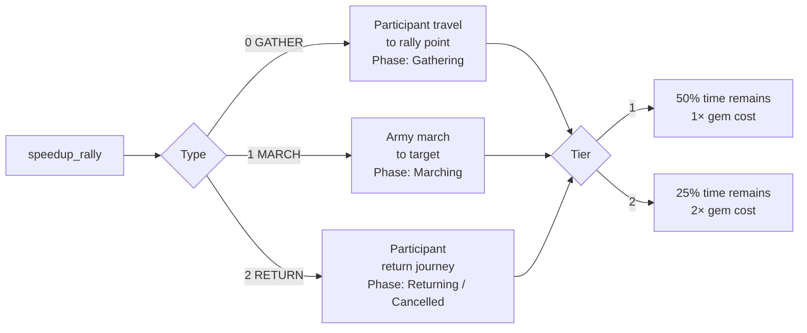
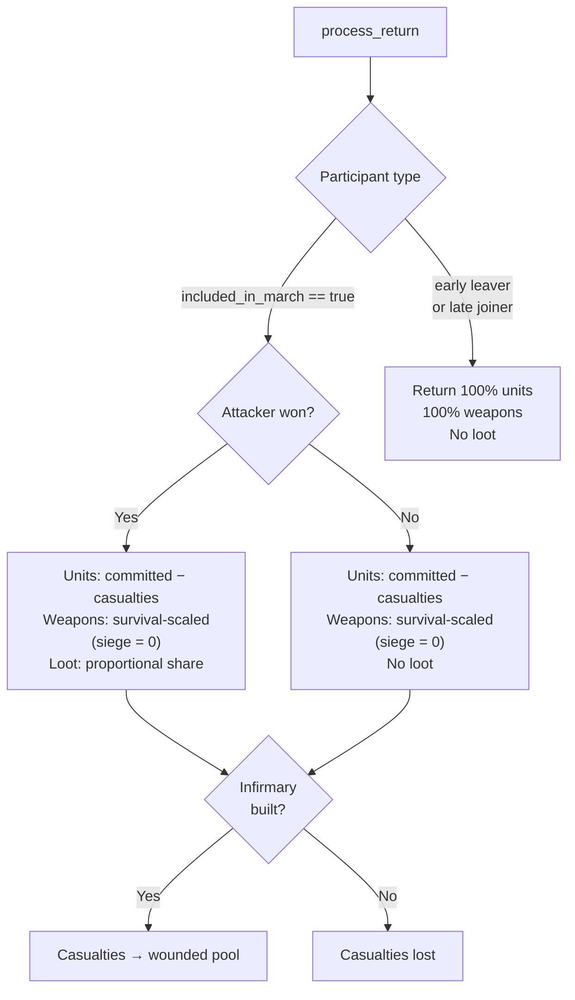

# Rally System

> Coordinated team assaults on player cities, enemy encounters, and contested castles — with per-participant unit commitment, buff snapshots, and proportional loot distribution.

## System Overview

A rally is a multi-player military operation where teammates pool units and weapons for a single combined attack. The architecture uses **separate `RallyParticipant` accounts** — one per joiner — so units, buff snapshots, casualties, and loot shares are all tracked individually without bloating the central `RallyAccount`.

Rallies are **kingdom-scoped** (`game_engine` field enforced on every load).



## Instructions

| ID | Instruction | Description |
|----|-------------|-------------|
| 60 | `create_rally` | Create rally, auto-join as leader, commit units/weapons |
| 61 | `join_rally` | Join an existing rally in Gathering phase |
| 62 | `execute_rally` | Permissionless: resolve combat after `gather_at` elapses |
| 63 | `leave_rally` | Leave during Gathering phase, start return journey |
| 64 | `cancel_rally` | Creator cancels during Gathering; others process returns individually |
| 65 | `process_return` | Permissionless: return units, distribute loot, close participant account |
| 66 | `speedup_rally` | Spend gems to speed up gather travel, march, or return |
| 67 | `close_rally` | Permissionless: close `RallyAccount` once all participants returned |

[Source: processor/rally/](../../../programs/novus_mundus/src/processor/rally/)

---

## RallyStatus Enum

The `status: u8` field on `RallyAccount` encodes the current phase. Clients must match against these numeric values.

| Value | Variant | Description |
|-------|---------|-------------|
| 0 | `Gathering` | Participants joining and traveling to rally point |
| 1 | `Marching` | Reserved for future two-phase march |
| 2 | `Combat` | Reserved; execute currently completes atomically |
| 3 | `Returning` | Execute completed; each participant returning home |
| 4 | `Completed` | All participants returned; account closable via `close_rally` |
| 5 | `Cancelled` | Creator cancelled during Gathering; participants each call `process_return` |

---

## Participation Requirements

| Role | Building Requirement | Team Requirement |
|------|---------------------|-----------------|
| Rally Creator | Citadel ≥ level 1 (Estate building) | Must be on a team |
| Rally Joiner | None | Same team as creator |

The Citadel provides two bonuses to the **creator's** rally:
- **Capacity bonus:** `+5% max participants per Citadel level` (500 bps/level).
- **Damage bonus:** `+0.5% rally damage per Citadel level` (50 bps/level).

Max participants formula:
```
base_max = RallyCaps.max_rally_size(tier)
hero_adjusted = base_max × (10000 + hero_rally_capacity_bps) / 10000
max_participants = hero_adjusted × (10000 + citadel_bonus_bps) / 10000  (capped at 255)
```

---

## Create Instruction Data (108 bytes)

| Offset | Field | Type | Description |
|--------|-------|------|-------------|
| 0 | `rally_id` | u64 LE | Unique ID for PDA derivation |
| 8 | `target` | [u8;32] | Target address (player, encounter, or castle) |
| 40 | `target_type` | u8 | 0=player, 1=encounter, 2=castle |
| 41 | `gather_duration` | i64 LE | Recruiting window (seconds); default `3600` if ≤ 0 |
| 49 | `target_city` | u16 LE | City where target is located |
| 51 | `units_1` | u64 LE | Tier 1 units committed |
| 59 | `units_2` | u64 LE | Tier 2 units committed |
| 67 | `units_3` | u64 LE | Tier 3 units committed |
| 75 | `melee` | u64 LE | Melee weapons committed |
| 83 | `ranged` | u64 LE | Ranged weapons committed |
| 91 | `siege` | u64 LE | Siege weapons committed |
| 99 | `team_id` | u64 LE | Team ID for PDA validation |
| 107 | `hero_slot_index` | u8 | 255 = no hero; 0–2 = commit hero from slot |

**Optional accounts (hero commitment):** accounts[9] = hero_mint, accounts[10] = hero_template.

## Join Instruction Data (57 bytes)

| Offset | Field | Type | Description |
|--------|-------|------|-------------|
| 0–47 | `units_1/2/3, melee, ranged, siege` | u64 LE × 6 | Resources committed |
| 48 | `team_id` | u64 LE | Team ID for PDA validation |
| 56 | `hero_slot_index` | u8 | 255 = no hero |

---

## Execute Logic

`execute_rally` (ID 62) is **permissionless** and accepts either `Gathering` or `Marching` status.

### Guards

- `participant_count >= MIN_RALLY_PARTICIPANTS` (= **2**)
- `now >= rally.execute_at` (set equal to `gather_at` at creation)

### Contribution and Power

Only participants whose travel time has elapsed (`now >= arrives_at_rally`) are included in the march:

```
contribution_power[i] = units_committed + melee_committed + ranged_committed + siege_committed
total_contribution = Σ contribution_power[i]
contribution_bps[i] = contribution_power[i] × 10000 / total_contribution
```



### Damage Calculation

Leader buffs (snapshotted at `create_rally`) apply to the entire rally:

```
base_damage = calculate_damage_output(
    total_units, total_weapons, drive_by=true,
    leader_research_attack_bps, leader_research_crit_chance_bps,
    leader_research_crit_damage_bps, leader_hero_attack_bps,
    leader_hero_weapon_efficiency_bps, leader_hero_crit_chance_bps,
    leader_equipped_weapon_bonus_bps
)
total_damage = base_damage × (10000 + citadel_damage_bonus_bps) / 10000
```

### Target Types

| `target_type` | Target Account | Combat |
|--------------|---------------|--------|
| 0 | `PlayerAccount` | Full weapon combat; 25% resource loot on win |
| 1 | `EncounterAccount` | Reduce encounter health; loot pool on defeat |
| 2 | `CastleAccount` | Siege vs garrison; conquest trigger at 90% garrison loss |

**Fallback bonus (PvP):** if target has no defensive garrison, attacker wins the cash loot with a **φ (1.618×) multiplier** on cash.



### Weapon Return

After execute, weapons returned via `process_return` follow:

```
survival_ratio_bps = total_surviving_units × 10000 / total_units_committed
melee_returned = melee_committed × survival_ratio_bps / 10000
ranged_returned = ranged_committed × survival_ratio_bps / 10000
siege_returned = 0  // siege weapons are consumed in combat
```

> **Note:** The `weapons_returned()` method in `state/rally.rs` explicitly sets `siege_returned = 0u64` — siege weapons are always consumed and never returned, unlike reinforcement siege weapons which use survival scaling.

---

## Speedup System (Instruction 66)

Three speedup types, two tiers each. Anyone can pay for any speedup.

| Type byte | Target | Valid Phase |
|-----------|--------|-------------|
| 0 (GATHER) | Participant's travel to rally point | Gathering |
| 1 (MARCH) | Entire army's march to target | Marching |
| 2 (RETURN) | Participant's return journey | Returning / Cancelled |

| Speedup Tier | Time Remaining After | Gem Cost Multiplier |
|-------------|---------------------|---------------------|
| 1 | 50% | 1× |
| 2 | 25% | 2× |

```
gem_cost = ceil(remaining_seconds / 60) × gem_cost_per_minute × tier_multiplier
```



---

## Process Return Outcomes

| Participant Type | Units Returned | Weapons Returned | Loot |
|-----------------|---------------|-----------------|------|
| Marcher (win) | committed − casualties | survival-scaled melee + ranged; siege = 0 | Full proportional share |
| Marcher (lose) | committed − casualties | survival-scaled melee + ranged; siege = 0 | None |
| Early leaver (via `leave_rally`) | 100% of committed | 100% of committed | None |
| Late joiner (missed march) | 100% of committed | 100% of committed | None |



Casualties and wounded units are transferred to the player's estate Infirmary (if built) during `process_return`.

After all participants have returned (`returned_count >= participant_count`), the `RallyAccount` transitions to `Completed`. `close_rally` then closes it and returns rent to the creator's wallet.

---

## Sequence: Full Rally

```mermaid
sequenceDiagram
    participant Leader
    participant Member
    participant Program
    participant RallyAccount
    participant RallyParticipant

    Leader->>Program: create_rally (108 bytes data)
    Program->>RallyAccount: Create PDA [RALLY_SEED, game_engine, creator_wallet, rally_id LE]
    Program->>RallyParticipant: Create leader's participant PDA
    Program->>RallyAccount: status = Gathering

    Member->>Program: join_rally (57 bytes data)
    Program->>RallyParticipant: Create member's participant PDA, snapshot buffs
    Program->>RallyAccount: participant_count++

    Note over Program: gather_at elapses

    Anyone->>Program: execute_rally (permissionless)
    Program->>Program: Aggregate marched participants
    Program->>Program: Resolve combat (target type 0/1/2)
    Program->>RallyParticipant: Write casualties + loot shares for each participant
    Program->>RallyAccount: status = Returning

    Anyone->>Program: process_return (per participant)
    Program->>PlayerAccount: Return surviving units, weapons, loot
    Program->>RallyParticipant: Close PDA (rent → participant wallet)
    Program->>RallyAccount: returned_count++; if all returned → Completed

    Anyone->>Program: close_rally (permissionless)
    Program->>RallyAccount: Close PDA (rent → creator wallet)
```

---

## Account Structures

### RallyAccount

The `RallyAccount` size is computed at compile time via `core::mem::size_of::<RallyAccount>()`. Key fields:

```rust
pub struct RallyAccount {
    pub account_key: u8,
    pub game_engine: Address,               // kingdom reference
    pub id: u64,                            // unique rally ID
    pub creator: Address,                   // creator's WALLET pubkey
    pub team: Address,                      // team pubkey
    pub rally_city: u16,                    // where units gather
    pub target_city: u16,
    pub target_type: u8,                    // 0=player, 1=encounter, 2=castle
    pub target: Address,
    pub created_at: i64,
    pub gather_at: i64,                     // recruiting deadline + execute time
    pub execute_at: i64,                    // legacy alias for gather_at
    pub march_started_at: i64,
    pub arrive_at: i64,
    pub march_duration: i32,
    // Leader buff snapshots (7 fields × u16):
    pub leader_research_attack_bps: u16,
    pub leader_research_crit_chance_bps: u16,
    pub leader_research_crit_damage_bps: u16,
    pub leader_hero_attack_bps: u16,
    pub leader_hero_weapon_efficiency_bps: u16,
    pub leader_hero_crit_chance_bps: u16,
    pub leader_equipped_weapon_bonus_bps: u16,
    pub min_participants: u8,
    pub max_participants: u8,
    pub participant_count: u8,
    pub arrived_count: u8,
    pub marched_count: u8,
    pub returned_count: u8,
    pub total_units: u64,
    pub total_melee_weapons: u64,
    pub total_ranged_weapons: u64,
    pub total_siege_weapons: u64,
    pub total_power: u64,
    pub total_casualties: u64,
    pub attack_damage_dealt: u64,
    pub defense_damage_received: u64,
    pub total_loot_cash: u64,
    pub total_loot_locked_novi: u64,
    pub total_loot_melee: u64,
    pub total_loot_ranged: u64,
    pub total_loot_siege: u64,
    pub total_loot_produce: u64,
    pub total_loot_vehicles: u64,
    pub total_loot_fragments: u64,
    pub total_loot_gems: u64,
    pub status: u8,                         // RallyStatus enum
    pub fallback_triggered: bool,
    pub attacker_won: bool,
    pub bump: u8,
}
```

**PDA seeds:** `[b"rally", game_engine, creator_wallet, rally_id:u64 LE]`

> **Note:** `creator` is the **wallet pubkey** (signer), not the player account PDA. This matches the PDA derivation in `derive_pda`.

### RallyParticipant

The `RallyParticipant` size is computed at compile time via `core::mem::size_of::<RallyParticipant>()`. Key fields:

```rust
pub struct RallyParticipant {
    pub account_key: u8,
    pub rally_id: u64,
    pub rally_creator: Address,             // creator's wallet (PDA seed)
    pub participant: Address,               // this participant's wallet pubkey
    pub home_city: u16,
    // Committed at join time:
    pub units_committed_1: u64,
    pub units_committed_2: u64,
    pub units_committed_3: u64,
    pub melee_weapons_committed: u64,
    pub ranged_weapons_committed: u64,
    pub siege_weapons_committed: u64,
    // Buff snapshots (7 fields × u16):
    pub research_attack_bps: u16,
    pub research_crit_chance_bps: u16,
    pub research_crit_damage_bps: u16,
    pub hero_attack_bps: u16,
    pub hero_weapon_efficiency_bps: u16,
    pub hero_crit_chance_bps: u16,
    pub equipped_weapon_bonus_bps: u16,
    pub hero: Address,                      // committed hero mint (NULL if none)
    pub hero_power_contribution: u64,
    pub travel_started_at: i64,
    pub arrives_at_rally: i64,
    pub travel_duration: i32,
    pub arrived_at_rally: bool,
    pub included_in_march: bool,
    pub returned: bool,
    pub is_leader: bool,
    // Set by execute:
    pub casualties_1: u64,
    pub casualties_2: u64,
    pub casualties_3: u64,
    pub loot_cash: u64,
    pub loot_locked_novi: u64,
    pub loot_melee: u64,
    pub loot_ranged: u64,
    pub loot_siege: u64,
    pub loot_produce: u64,
    pub loot_vehicles: u64,
    pub loot_fragments: u64,
    pub loot_gems: u64,
    pub return_started_at: i64,
    pub return_duration: i32,
    pub contribution_power: u64,
    pub contribution_bps: u16,              // basis points of total power
    pub bump: u8,
}
```

**PDA seeds:** `[b"rally_participant", game_engine, rally_creator_wallet, rally_id:u64 LE, participant_wallet]`

---

## Client Integration

```typescript
import { PublicKey } from "@solana/web3.js";

function findRallyPda(
  gameEngine: PublicKey,
  creatorWallet: PublicKey,
  rallyId: bigint,
  programId: PublicKey
) {
  const idBuf = Buffer.alloc(8);
  idBuf.writeBigUInt64LE(rallyId);
  return PublicKey.findProgramAddressSync(
    [Buffer.from("rally"), gameEngine.toBuffer(), creatorWallet.toBuffer(), idBuf],
    programId
  );
}

function findRallyParticipantPda(
  gameEngine: PublicKey,
  creatorWallet: PublicKey,
  rallyId: bigint,
  participantWallet: PublicKey,
  programId: PublicKey
) {
  const idBuf = Buffer.alloc(8);
  idBuf.writeBigUInt64LE(rallyId);
  return PublicKey.findProgramAddressSync(
    [
      Buffer.from("rally_participant"),
      gameEngine.toBuffer(),
      creatorWallet.toBuffer(),
      idBuf,
      participantWallet.toBuffer(),
    ],
    programId
  );
}

// Check if a participant is in march (execute) window
function isEligibleToExecute(rally: RallyAccount, now: number): boolean {
  return (
    (rally.status === 0 /* Gathering */ || rally.status === 1 /* Marching */) &&
    rally.participantCount >= 2 &&
    now >= rally.executeAt
  );
}
```

---

Next: [Reinforcements](./reinforcements.md)

*United in purpose, divided in glory — every siege weapon is a one-way investment.*
