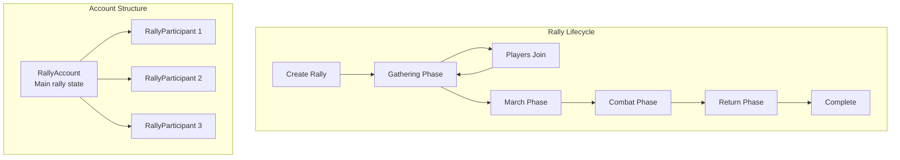
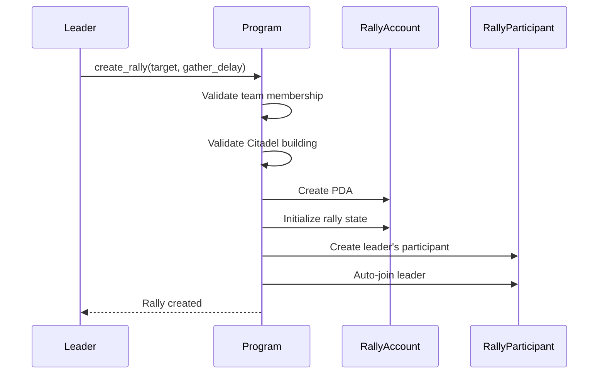
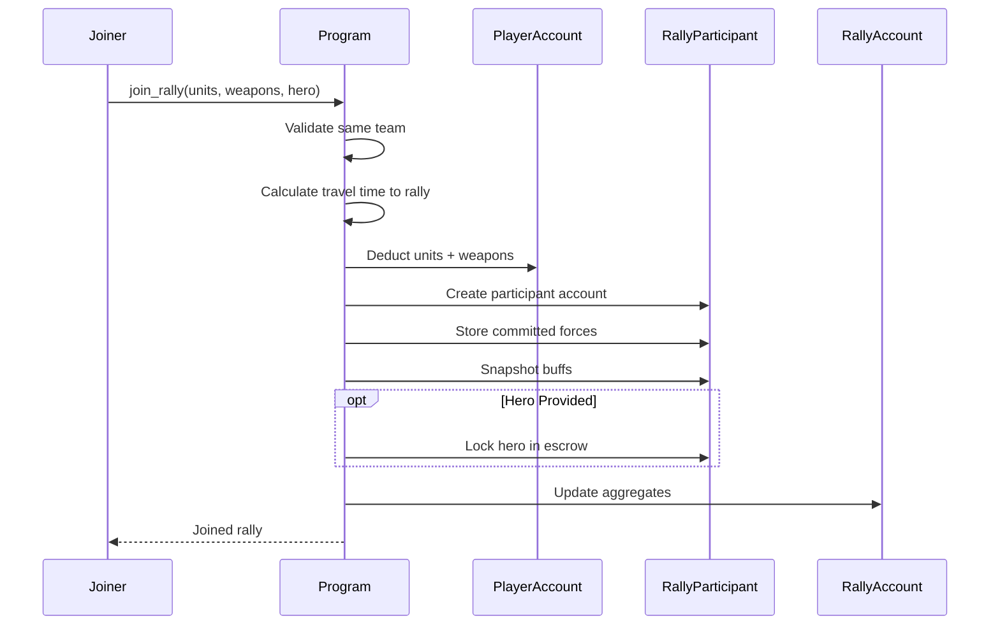
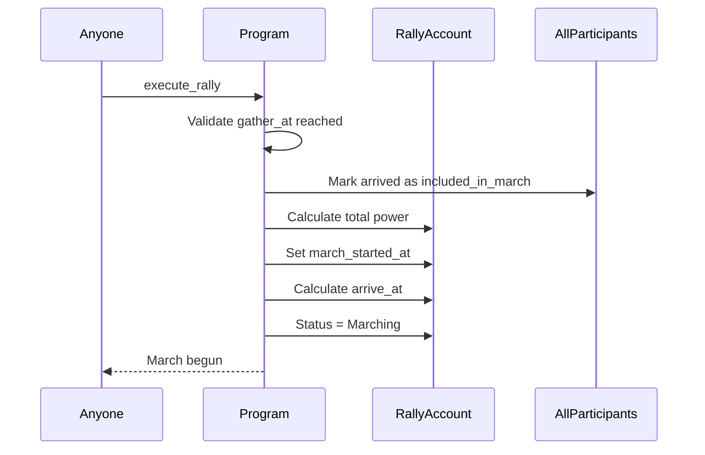
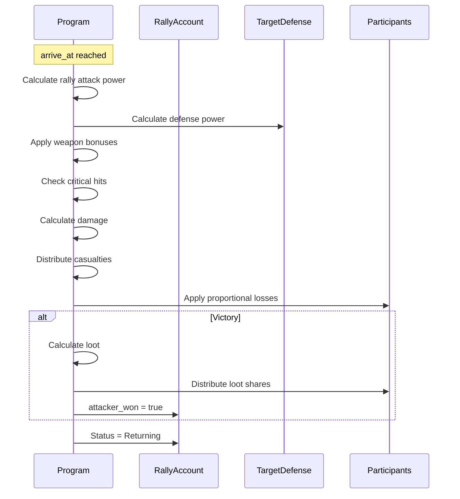
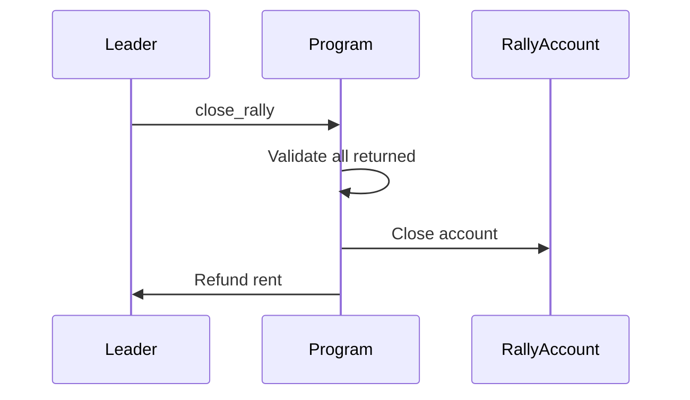

# Rally System

> Coordinated group attacks on cities with the new RallyParticipant architecture.

## System Overview

Rallies are **coordinated group attacks** where team members combine forces to assault city defenses. The system uses a two-account architecture: `RallyAccount` for the rally itself and `RallyParticipant` accounts for each joiner.



## Instructions

| ID | Instruction | Description |
|----|-------------|-------------|
| 60 | `create_rally` | Start a new group attack |
| 61 | `join_rally` | Join with units/weapons/hero |
| 62 | `execute_rally` | Launch the march |
| 63 | `leave_rally` | Leave before march |
| 64 | `cancel_rally` | Leader cancels rally |
| 65 | `process_return` | Handle returning participant |
| 66 | `speedup_rally` | Speed up march/return |
| 67 | `close_rally` | Clean up completed rally |

[Source: processor/rally/](../../../programs/novus_mundus/src/processor/rally/)

---

## Account Architecture

### RallyAccount

The main rally state account, created by the leader.

```
RallyAccount:
├── id: u64                     // Unique rally ID
├── creator: Pubkey             // Rally leader
├── team: Pubkey                // Team this belongs to
│
├── // Location
├── rally_city: u16             // Gathering city
├── target_city: u16            // Attack target
├── target_type: u8             // 0=player, 1=encounter
├── target: Pubkey              // Target address
│
├── // Timing
├── created_at: i64
├── gather_at: i64              // Join deadline
├── execute_at: i64             // When march starts
├── march_started_at: i64       // Actual march start
├── arrive_at: i64              // Combat time
├── march_duration: i32
│
├── // Leader's Buffs (apply to whole rally)
├── leader_research_attack_bps: u16
├── leader_research_crit_chance_bps: u16
├── leader_hero_attack_bps: u16
├── leader_hero_weapon_efficiency_bps: u16
├── leader_equipped_weapon_bonus_bps: u16
│
├── // Participants
├── min_participants: u8
├── max_participants: u8        // Max 10
├── participant_count: u8
├── arrived_count: u8
├── marched_count: u8
├── returned_count: u8
│
├── // Aggregated Forces
├── total_units: u64
├── total_melee_weapons: u64
├── total_ranged_weapons: u64
├── total_siege_weapons: u64
├── total_power: u64
│
├── // Combat Results
├── total_casualties: u64
├── attack_damage_dealt: u64
├── defense_damage_received: u64
│
├── // Loot
├── total_loot_cash: u64
├── total_loot_locked_novi: u64
├── total_loot_melee/ranged/siege: u64
├── total_loot_produce/vehicles/fragments/gems: u64
│
├── // Status
├── status: u8                  // RallyStatus enum
├── fallback_triggered: bool
├── attacker_won: bool
└── bump: u8
```

**Seeds:** `["rally", creator_pubkey, rally_id_bytes]`

### RallyParticipant

Per-joiner state account. Each participant pays rent for their own account.

```
RallyParticipant:
├── rally_id: u64
├── rally_creator: Pubkey
├── participant: Pubkey         // This joiner's wallet
├── home_city: u16              // Return destination
│
├── // Units Committed (deducted at join)
├── units_committed_1/2/3: u64
│
├── // Weapons Committed
├── melee_weapons_committed: u64
├── ranged_weapons_committed: u64
├── siege_weapons_committed: u64
│
├── // Buffs Snapshotted at Join
├── research_attack_bps: u16
├── hero_attack_bps: u16
├── equipped_weapon_bonus_bps: u16
│
├── // Hero
├── hero: Pubkey                // Committed hero NFT
├── hero_power_contribution: u64
│
├── // Travel to Rally Point
├── travel_started_at: i64
├── arrives_at_rally: i64
├── travel_duration: i32
│
├── // Status Flags
├── arrived_at_rally: bool
├── included_in_march: bool
├── returned: bool
├── is_leader: bool
│
├── // Combat Casualties
├── casualties_1/2/3: u64
│
├── // Personal Loot Share
├── loot_cash: u64
├── loot_locked_novi: u64
├── loot_melee/ranged/siege: u64
├── loot_produce/vehicles/fragments/gems: u64
│
├── // Return Journey
├── return_started_at: i64
├── return_duration: i32
│
├── // Contribution
├── contribution_power: u64
├── contribution_bps: u16       // % of rally power
└── bump: u8
```

**Seeds:** `["rally_participant", creator_pubkey, rally_id_bytes, participant_pubkey]`

---

## Rally Status Enum

| Status | Value | Description |
|--------|-------|-------------|
| Gathering | 0 | Joiners traveling to rally point |
| Marching | 1 | Army marching to target |
| Combat | 2 | Battle being resolved |
| Returning | 3 | Participants returning home |
| Completed | 4 | All returned, ready to close |
| Cancelled | 5 | Rally cancelled, all returning |

---

## Rally Lifecycle

### Phase 1: Creation

**Instruction:** `60 - create_rally`



**Requirements:**
- Leader must be in a team
- Citadel building required (level affects capacity)
- Leader pays NOVI cost + rent for both accounts

### Phase 2: Gathering

**Instruction:** `61 - join_rally`

Joiners commit their forces during the gathering phase:



**Key Points:**
- Units and weapons are **immediately deducted** from PlayerAccount
- Buffs are **snapshotted** at join time (can't upgrade mid-rally)
- Heroes are **transferred to RallyParticipant PDA** (escrow)
- Joiner pays rent for their RallyParticipant account

### Phase 3: March

**Instruction:** `62 - execute_rally`

When `gather_at` time is reached (or early if all arrived):



**Late Joiners:**
Players who haven't arrived at rally point by execute time are **not included** in the march. They get their forces back but don't share in loot.

### Phase 4: Combat

Combat resolution happens automatically when `arrive_at` is reached:



### Phase 5: Return

**Instruction:** `65 - process_return`

Each participant processes their return individually:

```mermaid
sequenceDiagram
    participant Participant
    participant Program
    participant RallyParticipant
    participant PlayerAccount

    Note over Participant: return time elapsed
    Participant->>Program: process_return
    Program->>RallyParticipant: Get surviving units
    Program->>RallyParticipant: Get personal loot
    Program->>PlayerAccount: Return units + loot
    opt Hero Committed
        Program->>PlayerAccount: Return hero NFT
    end
    Program->>RallyParticipant: Close account (refund rent)
    Program->>RallyAccount: Increment returned_count
```

### Phase 6: Cleanup

**Instruction:** `67 - close_rally`

After all participants have returned:



---

## Weapon System in Rallies

Weapons provide combat bonuses and are **consumed** in battle:

### Weapon Types

| Weapon | Attack Bonus | Notes |
|--------|--------------|-------|
| Melee | +20% | Proportional loss with casualties |
| Ranged | +30% | Proportional loss with casualties |
| Siege | +50% | Fully consumed in combat |

### Weapon Efficiency

Research and hero buffs improve weapon effectiveness:

```
weapon_bonus = (weapons × base_bonus) × (1 + weapon_efficiency_bps/10000)
```

### Weapon Survival

Melee and ranged weapons survive proportionally to units:

```
survival_ratio = surviving_units / total_units
weapons_returned = weapons_committed × survival_ratio
```

Siege weapons are **always consumed** (they breach defenses).

---

## Power Calculation

Rally power aggregates all participants:

```
participant_power = Σ(units × unit_attack) × (1 + all_buffs)

rally_power = Σ(participant_power) × leader_bonus

where leader_bonus includes:
- leader_research_attack_bps
- leader_hero_attack_bps
- leader_equipped_weapon_bonus_bps
```

---

## Loot Distribution

Loot is distributed by **contribution percentage**:

```
participant_loot = total_loot × (contribution_bps / 10000)

contribution_bps = (participant_power / total_power) × 10000
```

**Example:**
| Participant | Power | Share |
|-------------|-------|-------|
| Leader | 50,000 | 40% |
| Member A | 37,500 | 30% |
| Member B | 25,000 | 20% |
| Member C | 12,500 | 10% |
| **Total** | 125,000 | 100% |

---

## Citadel Building Requirements

| Citadel Level | Max Participants | Rally Damage Bonus |
|---------------|------------------|-------------------|
| 1-4 | 3 | +1-4% |
| 5-9 | 5 | +5-9% |
| 10-14 | 7 | +10-14% |
| 15-19 | 9 | +15-19% |
| 20 | 10 | +20% |

---

## Speedup System

**Instruction:** `66 - speedup_rally`

Speeds up march or return time:

| Tier | Time Reduction | Cost Multiplier |
|------|----------------|-----------------|
| 1 | 50% | 1x |
| 2 | 75% | 2x |

```
gem_cost = remaining_minutes × 75 × tier_multiplier
```

---

## Cancel & Leave

### Cancel Rally (Leader Only)

**Instruction:** `64 - cancel_rally`

- Only during Gathering phase
- All participants begin returning home
- No combat occurs
- Forces returned after travel time

### Leave Rally

**Instruction:** `63 - leave_rally`

- Only during Gathering phase
- Forces returned immediately (no combat)
- RallyParticipant account closed

---

## Client Integration

### Create Rally

```javascript
async function createRally(connection, wallet, targetCity, gatherDelaySecs) {
  const rallyId = await getNextRallyId(connection, wallet);

  const [rallyPda] = PublicKey.findProgramAddress(
    [Buffer.from("rally"), wallet.toBuffer(), rallyId.toBuffer()],
    PROGRAM_ID
  );

  const [participantPda] = PublicKey.findProgramAddress(
    [Buffer.from("rally_participant"), wallet.toBuffer(), rallyId.toBuffer(), wallet.toBuffer()],
    PROGRAM_ID
  );

  const ix = createRallyInstruction({
    targetCity,
    gatherDelay: gatherDelaySecs,
    // Leader's units/weapons automatically committed
  });

  return sendTransaction(connection, wallet, [ix]);
}
```

### Join Rally

```javascript
async function joinRally(connection, wallet, rallyCreator, rallyId, commitment) {
  const [rallyPda] = PublicKey.findProgramAddress(
    [Buffer.from("rally"), rallyCreator.toBuffer(), rallyId.toBuffer()],
    PROGRAM_ID
  );

  const [participantPda] = PublicKey.findProgramAddress(
    [Buffer.from("rally_participant"), rallyCreator.toBuffer(), rallyId.toBuffer(), wallet.toBuffer()],
    PROGRAM_ID
  );

  const ix = joinRallyInstruction({
    units1: commitment.units1,
    units2: commitment.units2,
    units3: commitment.units3,
    meleeWeapons: commitment.melee,
    rangedWeapons: commitment.ranged,
    siegeWeapons: commitment.siege,
    heroMint: commitment.hero || null,
  });

  return sendTransaction(connection, wallet, [ix]);
}
```

### Display Rally Status

```javascript
function getRallyStatus(rally, participants) {
  const now = Date.now() / 1000;

  switch (rally.status) {
    case 0: // Gathering
      return {
        phase: 'gathering',
        timeRemaining: rally.gatherAt - now,
        participantCount: rally.participantCount,
        arrivedCount: rally.arrivedCount,
        canExecute: now >= rally.gatherAt || rally.arrivedCount === rally.participantCount
      };

    case 1: // Marching
      return {
        phase: 'marching',
        timeRemaining: rally.arriveAt - now,
        totalPower: rally.totalPower
      };

    case 3: // Returning
      const myParticipant = participants.find(p => p.participant === wallet);
      const returnComplete = now >= myParticipant.returnStartedAt + myParticipant.returnDuration;
      return {
        phase: 'returning',
        won: rally.attackerWon,
        myLoot: calculateMyLoot(myParticipant),
        canProcessReturn: returnComplete
      };

    case 4: // Completed
      return { phase: 'completed', canClose: rally.allReturned() };
  }
}
```

---

*Rallies are the ultimate test of coordination. Unite your team, commit your forces, and strike as one.*

---

Next: [Reinforcements](./reinforcements.md)
