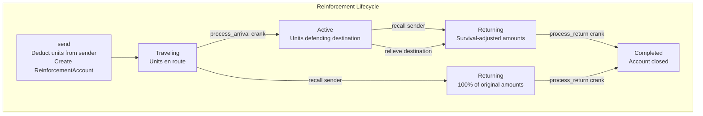
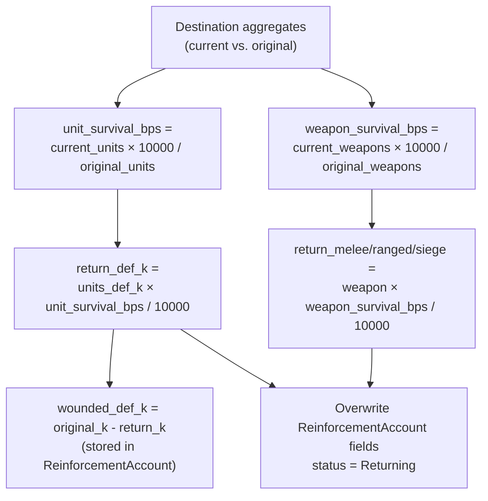
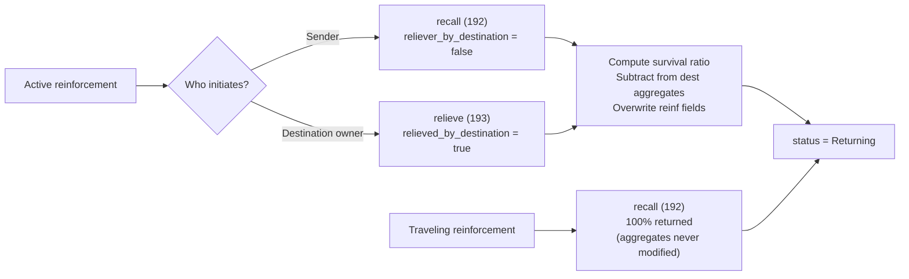
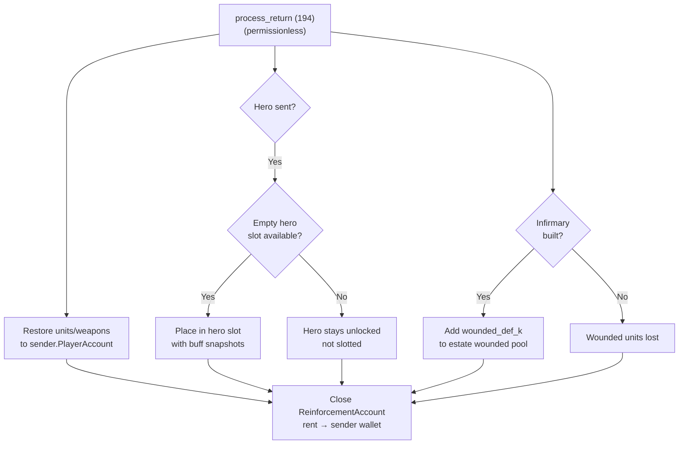
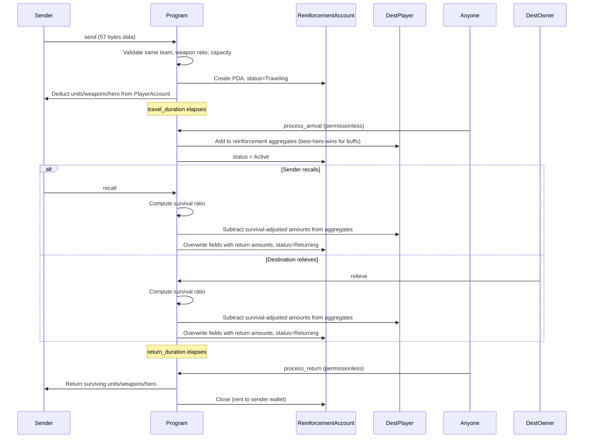

# Reinforcement System

> Send defensive units, weapons, and heroes to protect teammates or garrison castles — with survival-scaled returns and permissionless crank processing.

## System Overview

The Reinforcement System allows teammates to lend defensive forces across city boundaries. One `ReinforcementAccount` tracks the sent units from a single sender to a single destination. The destination's `PlayerAccount` maintains aggregate totals that combat systems read directly; individual senders retain proportional ownership for recovery on recall or relief.

Reinforcements are **kingdom-scoped** (`game_engine` enforced at load time).



## Instructions

| ID | Instruction | Description |
|----|-------------|-------------|
| 190 | `send` | Create `ReinforcementAccount`, deduct units/weapons from sender |
| 191 | `process_arrival` | Permissionless crank: mark Active, add to destination aggregates |
| 192 | `recall` | Sender initiates return (works on Active or Traveling) |
| 193 | `relieve` | Destination owner sends reinforcement back (Active only) |
| 194 | `process_return` | Permissionless crank: return surviving units/weapons, close account |
| 195 | `speedup` | Sender spends gems to reduce travel or return time |

[Source: processor/reinforcement/](../../../programs/novus_mundus/src/processor/reinforcement/)

---

## Send Constraints

| Constraint | Rule |
|-----------|------|
| Same kingdom | Sender and destination must share `game_engine` |
| Same team | Both must be on the same team; team must not be disbanded |
| "Military Logistics" research | Destination must have the research unlocked |
| Weapon ratio | `total_weapons <= total_units` (more weapons than soldiers is invalid) |
| Receive capacity | `destination.total_reinforcement_units + total_units_sent <= MAX_REINFORCEMENT_RECEIVE × hero_multiplier` |
| Not self | Cannot reinforce own account |
| Sender not traveling | `sender.is_traveling_any()` must be false |
| At least 1 unit | `total_units > 0` |

`MAX_REINFORCEMENT_RECEIVE = 10_000`. The hero multiplier applies if the destination has a `hero_unit_capacity_bps` buff active.

---

## Send Instruction Data (57 bytes)

| Offset | Field | Type | Description |
|--------|-------|------|-------------|
| 0 | `units_def_1` | u64 LE | Tier 1 defensive units |
| 8 | `units_def_2` | u64 LE | Tier 2 defensive units |
| 16 | `units_def_3` | u64 LE | Tier 3 defensive units |
| 24 | `melee_weapons` | u64 LE | Melee weapons |
| 32 | `ranged_weapons` | u64 LE | Ranged weapons |
| 40 | `siege_weapons` | u64 LE | Siege weapons |
| 48 | `hero_slot` | u8 | 0–2 = commit hero from slot; 255 = no hero |
| 49 | `team_id` | u64 LE | Team ID for PDA validation |

**Optional account:** `accounts[9]` = hero NFT mint (required when `hero_slot < 3`).

### Two PDA Types

| Target | Seed | Use |
|--------|------|-----|
| Player reinforcement | `[b"reinforcement", game_engine, sender_wallet, destination_wallet]` | Teammate-to-teammate |
| Castle garrison | `[b"garrison", game_engine, sender_wallet, castle_pubkey]` | Team member-to-castle |

Only **one** `ReinforcementAccount` may exist per sender→destination pair within a kingdom at any time.

---

## Travel and Arrival

Travel time uses intercity speed from the `GameEngine.theme_travel_speeds_kmh` config. Same-city reinforcements arrive instantly (`travel_duration = 0`).

`process_arrival` (ID 191) is a **permissionless crank** with no instruction data:

```
Guards:
  status == Traveling
  now >= arrives_at
  destination_type == Player (castle garrison handled separately)
Actions:
  destination.team_section.reinforcement_def_1 += units_def_1
  destination.team_section.reinforcement_def_2 += units_def_2
  destination.team_section.reinforcement_def_3 += units_def_3
  destination.team_section.reinforcement_melee  += melee_weapons
  destination.team_section.reinforcement_ranged += ranged_weapons
  destination.team_section.reinforcement_siege  += siege_weapons
  destination.team_section.reinforcement_original_units  += total_units
  destination.team_section.reinforcement_original_weapons += total_weapons
  // Hero buffs: best-hero-wins (MAX, not sum)
  reinforcement_hero_defense_bps   = max(existing, hero_defense_bps)
  reinforcement_hero_weapon_eff_bps = max(existing, hero_weapon_eff_bps)
  reinforcement_hero_armor_eff_bps  = max(existing, hero_armor_eff_bps)
  reinforcement_source_count += 1
  status = Active
```

---

## Recall and Relieve

Both instructions compute a **survival ratio** from the destination's current vs. original aggregates, then adjust the `ReinforcementAccount` fields in place. `process_return` then reads the adjusted fields.

### Survival Ratio Formula

```
unit_survival_bps   = reinforcement_def_current_total × 10000 / reinforcement_original_units
weapon_survival_bps = reinforcement_weapon_current_total × 10000 / reinforcement_original_weapons
```

### Return Amounts (Active Recall)

```
return_def_1 = units_def_1 × unit_survival_bps / 10000
return_def_2 = units_def_2 × unit_survival_bps / 10000
return_def_3 = units_def_3 × unit_survival_bps / 10000
return_melee = melee_weapons × weapon_survival_bps / 10000
return_ranged = ranged_weapons × weapon_survival_bps / 10000
return_siege = siege_weapons × weapon_survival_bps / 10000
```



> **Note:** Unlike rally siege weapons which are always consumed, **reinforcement siege weapons use survival scaling** on return. A reinforcement recalled while active returns a proportional fraction of its siege weapons based on destination health.

Wounded units (originals − returns) are stored in `wounded_def_1/2/3` on the `ReinforcementAccount` and transferred to the sender's estate Infirmary during `process_return` (if the Infirmary building exists).

### Traveling Recall

If recalled while still in `Traveling` status, no aggregates were ever added, so 100% of original units and weapons are returned.

### Recall vs. Relieve

| Action | Initiator | Status Required | `relieved_by_destination` |
|--------|-----------|-----------------|--------------------------|
| `recall` | Sender | Active or Traveling | `false` |
| `relieve` | Destination owner | Active only | `true` |



---

## Process Return

`process_return` (ID 194) is **permissionless** and has no instruction data:

```
Guards:
  status == Returning OR Completed
  if Returning: now >= return_started_at + return_duration
Actions:
  sender.defensive_unit_1 += return_units_1
  sender.defensive_unit_2 += return_units_2
  sender.defensive_unit_3 += return_units_3
  sender.melee_weapons    += return_melee
  sender.ranged_weapons   += return_ranged
  sender.siege_weapons    += return_siege
  if hero != NULL: restore to first empty hero slot (or keep unlocked if slots full)
  if Infirmary built: add wounded_def_1/2/3 to estate wounded pool
  Zero account data, transfer lamports to sender_owner wallet (close)
```



---

## Speedup System (Instruction 195)

Only the sender may speed up their reinforcement. Works on `Traveling` or `Returning` status.

| Tier | Time Remaining After | Gem Cost Multiplier |
|------|---------------------|---------------------|
| 1 | 50% of remaining | 1× |
| 2 | 25% of remaining | 2× |

```
gem_cost = ceil(remaining_seconds / 60) × gem_cost_per_minute × tier_multiplier
```

The instruction data is a single byte: `speedup_tier:u8`.

---

## Sequence: Full Reinforcement



---

## Account Structure

### ReinforcementAccount

The size is computed at compile time via `core::mem::size_of::<ReinforcementAccount>()`.

```rust
pub struct ReinforcementAccount {
    pub account_key: u8,
    pub game_engine: Address,               // 32 - kingdom reference
    pub sender: Address,                    // 32 - sender's WALLET pubkey
    pub destination: Address,               // 32 - destination wallet (Player) or castle pubkey
    pub destination_type: u8,              // 0=Player, 1=Castle
    pub bump: u8,
    pub sender_city: u16,
    pub destination_city: u16,
    pub _padding_loc: [u8; 2],
    // Original amounts sent (overwritten to survival-adjusted on recall/relieve):
    pub units_def_1: u64,
    pub units_def_2: u64,
    pub units_def_3: u64,
    pub melee_weapons: u64,
    pub ranged_weapons: u64,
    pub siege_weapons: u64,
    pub hero: Address,                      // NULL if no hero
    pub hero_defense_bps: u16,
    pub hero_weapon_eff_bps: u16,
    pub hero_armor_eff_bps: u16,
    pub _padding_hero: [u8; 2],
    pub sent_at: i64,
    pub travel_duration: i32,
    pub wounded_def_1: u32,                // casualties set during recall
    pub arrives_at: i64,
    pub return_started_at: i64,
    pub return_duration: i32,
    pub wounded_def_2: u32,
    pub status: u8,                        // ReinforcementStatus enum
    pub relieved_by_destination: bool,
    pub _padding_status: [u8; 2],
    pub wounded_def_3: u32,
    pub combats_participated: u64,
}
```

### Status Enum

| Value | Variant | Description |
|-------|---------|-------------|
| 0 | `Traveling` | Units en route to destination |
| 1 | `Active` | Units actively defending |
| 2 | `Returning` | Units traveling back to sender |
| 3 | `Completed` | Return complete, ready to close |

### Target Enum

| Value | Variant | PDA seed prefix |
|-------|---------|----------------|
| 0 | `Player` | `b"reinforcement"` |
| 1 | `Castle` | `b"garrison"` |

---

## Client Integration

```typescript
import { PublicKey } from "@solana/web3.js";

// Derive player reinforcement PDA
function findReinforcementPda(
  gameEngine: PublicKey,
  senderWallet: PublicKey,
  destinationWallet: PublicKey,
  programId: PublicKey
) {
  return PublicKey.findProgramAddressSync(
    [
      Buffer.from("reinforcement"),
      gameEngine.toBuffer(),
      senderWallet.toBuffer(),
      destinationWallet.toBuffer(),
    ],
    programId
  );
}

// Derive castle garrison PDA
function findGarrisonPda(
  gameEngine: PublicKey,
  senderWallet: PublicKey,
  castle: PublicKey,
  programId: PublicKey
) {
  return PublicKey.findProgramAddressSync(
    [
      Buffer.from("garrison"),
      gameEngine.toBuffer(),
      senderWallet.toBuffer(),
      castle.toBuffer(),
    ],
    programId
  );
}

// Check if process_return is ready
function canProcessReturn(reinf: ReinforcementAccount, nowSecs: number): boolean {
  if (reinf.status === 3 /* Completed */) return true;
  if (reinf.status !== 2 /* Returning */) return false;
  return nowSecs >= reinf.returnStartedAt + reinf.returnDuration;
}
```

---

Next: [Teams](./teams.md)

*Borrowed blades return diminished — but returned at all is better than lost forever.*
