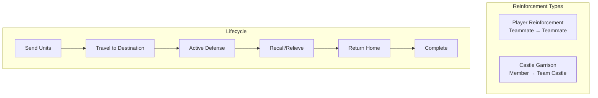
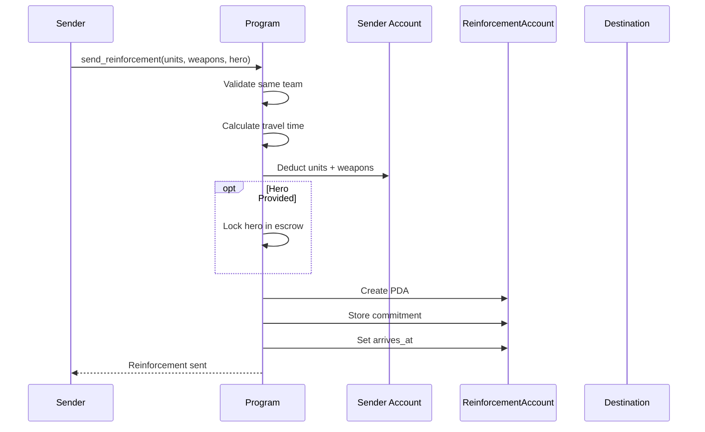
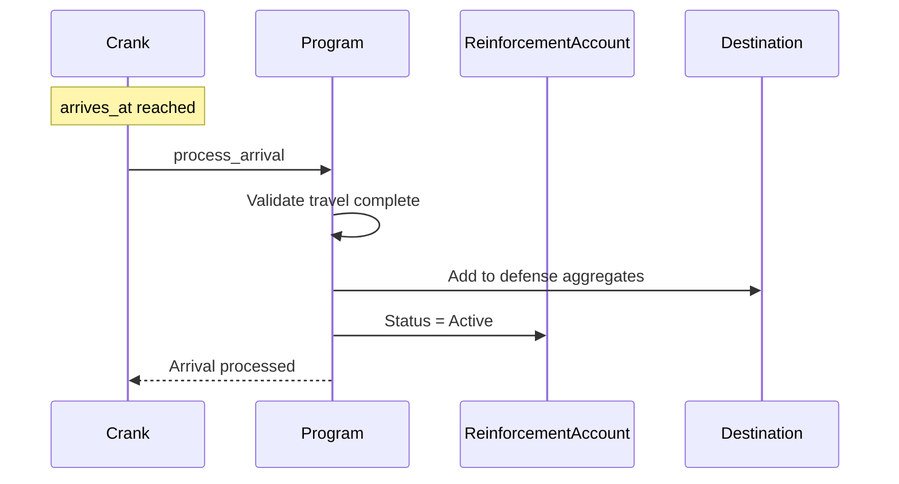
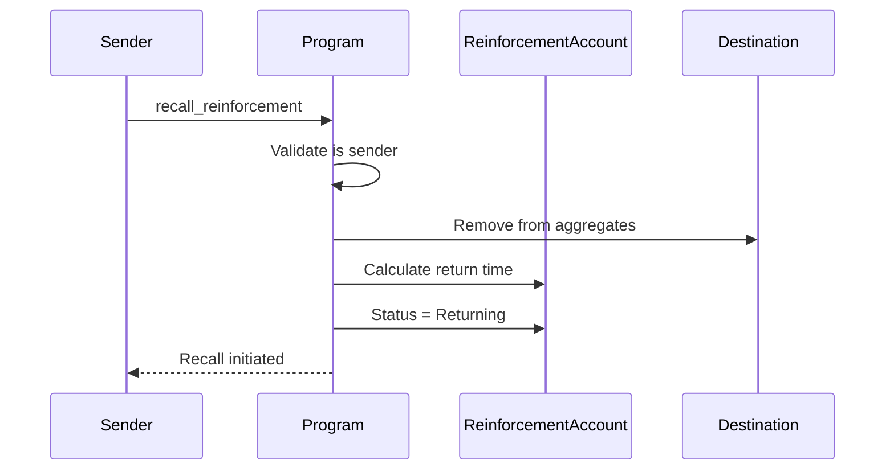
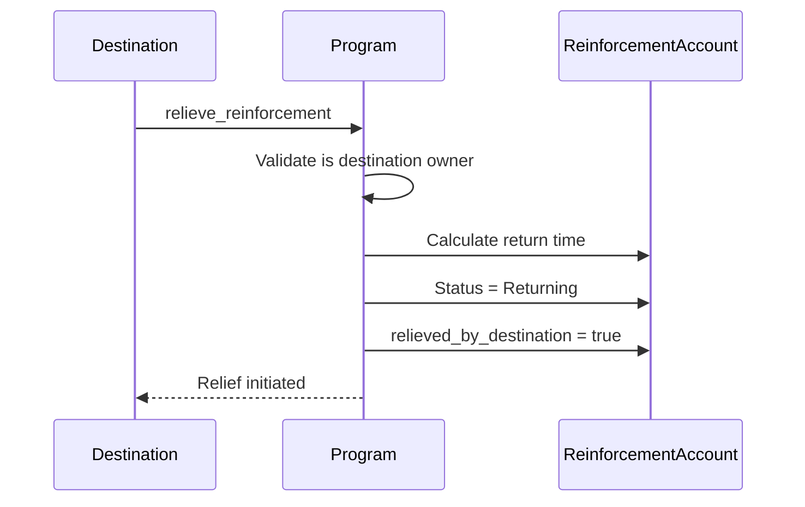
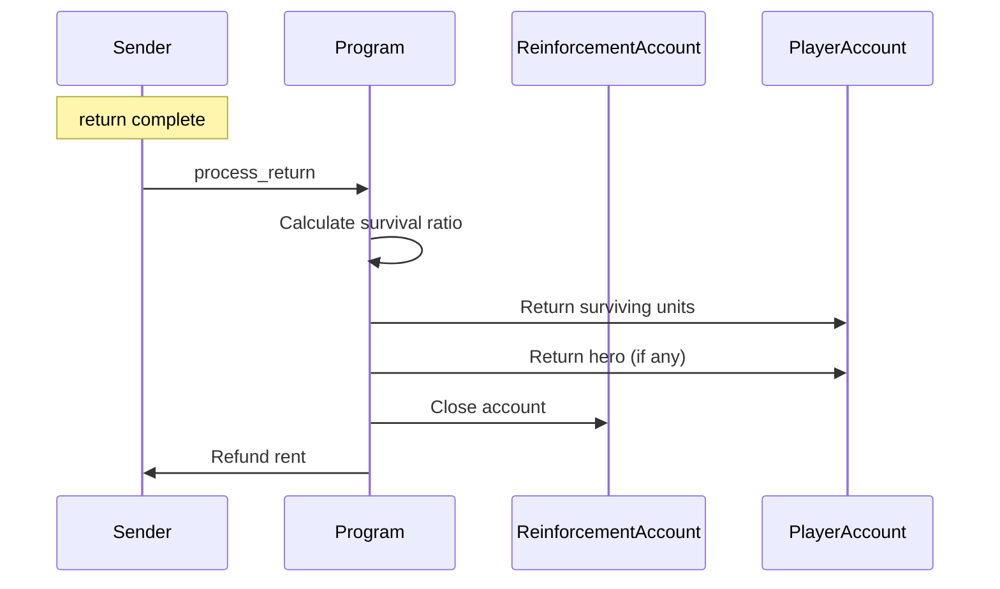

# Reinforcement System

> Sending units to defend teammates and garrison castles.

## System Overview

Reinforcements allow team members to **send defensive units** to protect each other. The system supports two destination types: **Player** (teammate) and **Castle** (team structure).



## Instructions

| ID | Instruction | Description |
|----|-------------|-------------|
| 70 | `send_reinforcement` | Send units to teammate |
| 71 | `send_garrison` | Send units to castle |
| 72 | `process_arrival` | Mark arrival at destination |
| 73 | `recall_reinforcement` | Sender recalls their units |
| 74 | `relieve_reinforcement` | Destination sends units home |
| 75 | `process_return` | Complete return and close |
| 76 | `speedup_reinforcement` | Speed up travel |

[Source: processor/reinforcement/](../../../programs/novus_mundus/src/processor/reinforcement/)

---

## ReinforcementAccount Structure

A single unified account type handles both player reinforcements and castle garrisons:

```
ReinforcementAccount:
├── // Identity
├── sender: Pubkey              // Who sent the reinforcement
├── destination: Pubkey         // PlayerAccount OR CastleAccount
│
├── // Type & Location
├── destination_type: u8        // 0=Player, 1=Castle
├── bump: u8
├── sender_city: u16            // For return travel calc
├── destination_city: u16
│
├── // Units Sent
├── units_def_1: u64            // Tier 1 defense units
├── units_def_2: u64            // Tier 2 defense units
├── units_def_3: u64            // Tier 3 defense units
│
├── // Weapons Sent
├── melee_weapons: u64
├── ranged_weapons: u64
├── siege_weapons: u64
│
├── // Hero
├── hero: Pubkey                // NULL_PUBKEY if none
├── hero_defense_bps: u16       // Snapshotted buff
├── hero_weapon_eff_bps: u16
├── hero_armor_eff_bps: u16
│
├── // Travel Timing
├── sent_at: i64
├── travel_duration: i32
├── arrives_at: i64
│
├── // Return Timing
├── return_started_at: i64      // 0 if not returning
├── return_duration: i32
│
├── // Status
├── status: u8                  // ReinforcementStatus enum
├── relieved_by_destination: bool
│
└── combats_participated: u64   // Defense battles fought
```

### PDA Seeds

**Player Reinforcement:** `["reinforcement", sender, destination_player]`

**Castle Garrison:** `["garrison", sender, castle]`

Only one reinforcement per sender→destination pair allowed.

---

## Reinforcement Status

| Status | Value | Description |
|--------|-------|-------------|
| Traveling | 0 | Units en route to destination |
| Active | 1 | Actively defending destination |
| Returning | 2 | Units traveling home |
| Completed | 3 | Ready for account closure |

---

## Reinforcement vs Garrison

| Aspect | Player Reinforcement | Castle Garrison |
|--------|---------------------|-----------------|
| Destination | Teammate's PlayerAccount | Team's CastleAccount |
| Seeds | `["reinforcement", ...]` | `["garrison", ...]` |
| Defense applies to | That player's defense | Castle's defense |
| Recall authority | Sender OR destination | Sender only |
| Combat events | Player PvP attacks | Castle sieges |

---

## Lifecycle Flow

### Sending Reinforcement

**Instruction:** `70 - send_reinforcement` / `71 - send_garrison`



### Arrival Processing

**Instruction:** `72 - process_arrival`



### Active Defense

While active, reinforcement contributes to destination's defense:

```
destination_defense_power = own_units + Σ(reinforcement_units)
destination_weapon_bonus = own_weapons + Σ(reinforcement_weapons)
```

### Recall (Sender Initiates)

**Instruction:** `73 - recall_reinforcement`



### Relieve (Destination Initiates)

**Instruction:** `74 - relieve_reinforcement`



### Return Processing

**Instruction:** `75 - process_return`



---

## Survival Calculation

Units may be lost if the destination was attacked while reinforcement was active:

```
survival_ratio = destination.current_defense_units / destination.original_defense_units

returned_units_1 = units_def_1 × survival_ratio
returned_units_2 = units_def_2 × survival_ratio
returned_units_3 = units_def_3 × survival_ratio

// Weapons proportional to unit survival
returned_melee = melee_weapons × survival_ratio
returned_ranged = ranged_weapons × survival_ratio
// Siege consumed in defense
returned_siege = 0
```

**Key Point:** The destination tracks aggregate defense counts. When battles occur, casualties are distributed proportionally across all defending sources (own units + all reinforcements).

---

## Hero in Reinforcement

Heroes can be committed to reinforce defense:

### Commitment

- Hero NFT is transferred to ReinforcementAccount PDA
- Defense buffs are snapshotted at send time
- Hero cannot be used elsewhere while committed

### Buffs Applied

```
hero_defense_bps → Destination defense multiplier
hero_weapon_eff_bps → Weapon effectiveness
hero_armor_eff_bps → Damage reduction
```

### Return

Hero is always returned (not consumed in combat).

---

## Travel Time

```
distance_km = haversine(sender_city.coords, destination_city.coords)
base_speed = theme_travel_speed
travel_time = (distance_km / base_speed) * 3600

// Return uses same calculation
return_time = travel_time  // Same distance
```

---

## Speedup System

**Instruction:** `76 - speedup_reinforcement`

| Tier | Reduction | Cost |
|------|-----------|------|
| 1 | 50% | 75 gems/minute |
| 2 | 75% | 150 gems/minute |

Works for both outbound travel and return travel.

---

## Defense Aggregates

Destinations track defense aggregates for combat:

### PlayerAccount Defense Fields

```
PlayerAccount:
├── total_reinforcement_units: u64
├── total_reinforcement_melee: u64
├── total_reinforcement_ranged: u64
├── active_reinforcement_count: u8
└── max_reinforcement_slots: u8    // Based on building
```

### CastleAccount Defense Fields

```
CastleAccount:
├── garrison_units: u64
├── garrison_melee: u64
├── garrison_ranged: u64
├── garrison_siege: u64
├── garrison_count: u8
└── max_garrison_slots: u8
```

---

## Restrictions

### Cannot Send Reinforcement When

| Condition | Reason |
|-----------|--------|
| Not same team | Team membership required |
| Already reinforcing that destination | One per sender→destination |
| Destination at max reinforcements | Slot limit reached |
| Currently traveling | Must complete current travel |
| In active rally | Must complete rally first |

### Cannot Recall When

| Condition | Reason |
|-----------|--------|
| Still traveling | Must wait for arrival |
| Already returning | Already recalled |
| Destination under attack | Combat lock (optional) |

---

## Client Integration

### Send Reinforcement

```javascript
async function sendReinforcement(
  connection,
  wallet,
  destinationPlayer,
  units,
  weapons,
  hero
) {
  // Validate team membership
  const senderTeam = await getPlayerTeam(connection, wallet.publicKey);
  const destTeam = await getPlayerTeam(connection, destinationPlayer);

  if (!senderTeam || !destTeam || senderTeam.id !== destTeam.id) {
    throw new Error('Must be in same team');
  }

  const [reinforcementPda] = PublicKey.findProgramAddress(
    [
      Buffer.from("reinforcement"),
      wallet.publicKey.toBuffer(),
      destinationPlayer.toBuffer()
    ],
    PROGRAM_ID
  );

  const ix = sendReinforcementInstruction({
    destination: destinationPlayer,
    unitsDef1: units.tier1,
    unitsDef2: units.tier2,
    unitsDef3: units.tier3,
    meleeWeapons: weapons.melee,
    rangedWeapons: weapons.ranged,
    siegeWeapons: weapons.siege,
    heroMint: hero || null
  });

  return sendTransaction(connection, wallet, [ix]);
}
```

### Display Active Reinforcements

```javascript
async function getActiveReinforcements(connection, player) {
  // Find all reinforcements sent by player
  const sentReinforcements = await findReinforcementsBySender(connection, player);

  // Find all reinforcements received by player
  const receivedReinforcements = await findReinforcementsByDestination(connection, player);

  return {
    sent: sentReinforcements.map(r => ({
      destination: r.destination,
      units: r.totalUnits(),
      weapons: r.totalWeapons(),
      status: getStatusName(r.status),
      hasHero: r.hero !== NULL_PUBKEY,
      arrivalTime: r.status === 0 ? r.arrivesAt : null,
      returnTime: r.status === 2 ? r.returnCompletesAt() : null,
      canRecall: r.status === 1
    })),

    received: receivedReinforcements.map(r => ({
      sender: r.sender,
      units: r.totalUnits(),
      weapons: r.totalWeapons(),
      status: getStatusName(r.status),
      canRelieve: r.status === 1
    })),

    totalDefenseBonus: receivedReinforcements
      .filter(r => r.status === 1)
      .reduce((sum, r) => sum + r.totalUnits(), 0)
  };
}
```

### Recall UI

```javascript
function renderReinforcementCard(reinforcement, isOwner) {
  const status = getStatusName(reinforcement.status);

  return `
    ${isOwner ? 'Sent to' : 'From'}: ${formatAddress(
      isOwner ? reinforcement.destination : reinforcement.sender
    )}
    Units: ${reinforcement.totalUnits()}
    Status: ${status}

    ${reinforcement.status === 0 ? `
      Arriving in: ${formatDuration(reinforcement.arrivesAt - Date.now()/1000)}
      [Speedup]
    ` : ''}

    ${reinforcement.status === 1 ? `
      Combats: ${reinforcement.combatsParticipated}
      ${isOwner ? '[Recall]' : '[Relieve]'}
    ` : ''}

    ${reinforcement.status === 2 ? `
      Returning in: ${formatDuration(reinforcement.returnCompletesAt() - Date.now()/1000)}
      [Speedup]
    ` : ''}

    ${reinforcement.status === 3 ? `
      [Complete Return]
    ` : ''}
  `;
}
```

---

*Reinforcements turn individual strength into collective might. Defend your allies, and they will defend you.*

---

Next: [Forge](./forge.md)
