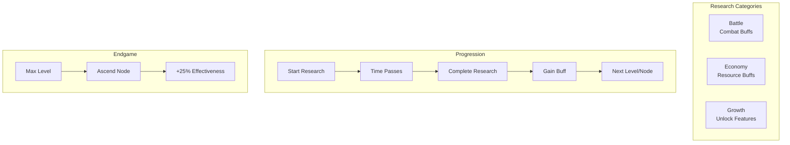
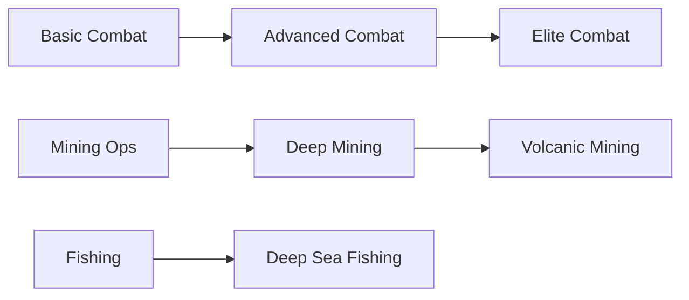
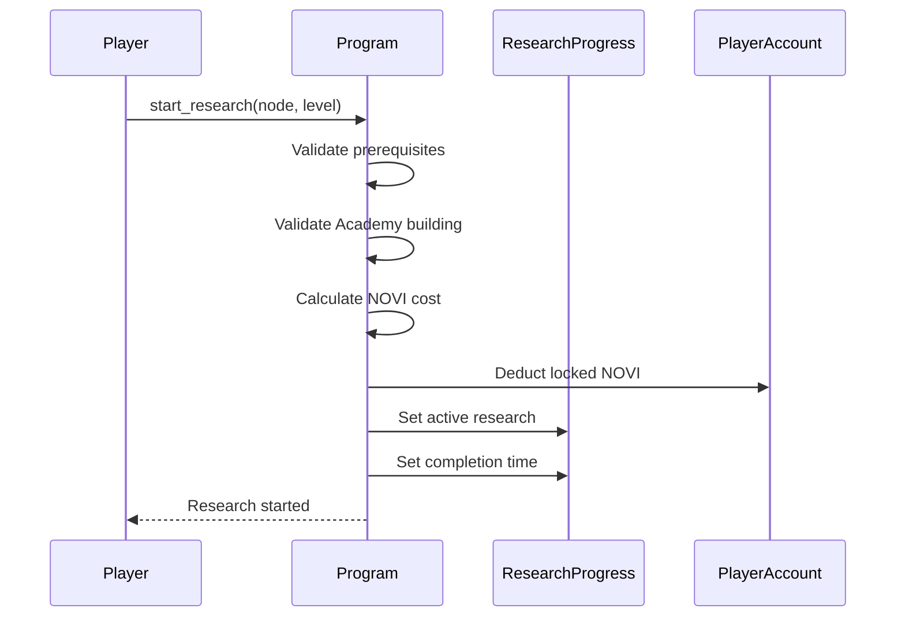
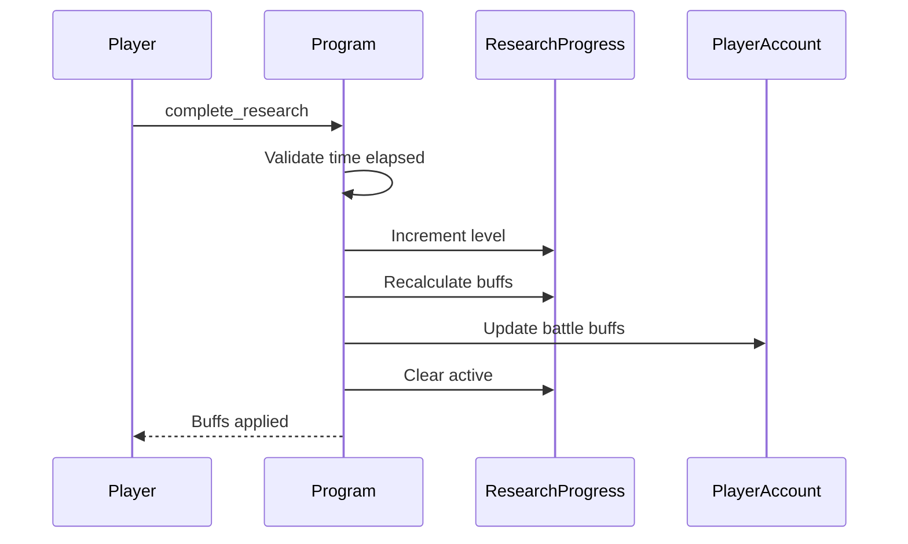

# Research System

> Technology tree, research categories, and the ascension prestige mechanic.

## System Overview

The Research System is the **primary progression unlock mechanism** in Novus Mundus. Players research technologies to unlock new abilities, gain permanent buffs, and eventually ascend for prestige bonuses.



## Instructions

| ID | Instruction | Description |
|----|-------------|-------------|
| 120 | `initialize_template` | Create research definition (admin) |
| 121 | `create_progress` | Create player's research account |
| 122 | `start_research` | Begin researching a node |
| 123 | `complete_research` | Finish research |
| 124 | `speed_up_research` | Reduce remaining time |
| 125 | `cancel_research` | Abandon active research |
| 126 | `update_template` | Modify research template (admin) |
| 127 | `ascend` | Prestige a maxed research node |

[Source: processor/research/](../../../programs/novus_mundus/src/processor/research/)

---

## Research Categories

### Battle (Category 0)

Combat-focused research that improves military effectiveness.

| Node | Buff Type | Effect |
|------|-----------|--------|
| AttackPower | +X% attack | Combat damage |
| DefensePower | +X% defense | Damage reduction |
| UnitCapacity | +X% capacity | More troops |
| CriticalHitChance | +X% crit | Lucky hits |
| CriticalHitDamage | +X% crit damage | Stronger crits |
| RallyCapacity | +X% rally units | Larger rallies |
| EncounterSuccess | +X% PvE | Better vs mobs |
| LootBonus | +X% loot | More rewards |
| UnitTrainingSpeed | +X% training | Faster hiring |
| AmbushDamage | +X% ambush | Surprise attacks |

### Economy (Category 1)

Resource generation and efficiency buffs.

| Node | Buff Type | Effect |
|------|-----------|--------|
| ProductionEfficiency | +X% production | All resource yields |
| ResourceCapacity | +X% storage | Larger stockpiles |
| MarketTaxReduction | -X% tax | Cheaper trades |
| TradeSpeed | +X% trade speed | Faster transactions |
| MiningOutput | +X% mining | Expedition gems |
| CashGeneration | +X% cash | Collection bonus |
| ConstructionSpeed | +X% build speed | Faster upgrades |
| UpkeepReduction | -X% upkeep | Lower unit costs |
| BlackMarketAccess | Level unlock | Special shop items |
| TaxCollection | +X% taxes | Team treasury |

### Growth (Category 2)

Feature unlocks and quality-of-life improvements.

| Node | Buff Type | Effect |
|------|-----------|--------|
| DailyRewardsSystem | Unlock | Daily login rewards |
| **MiningOperations** | Unlock | Mining expeditions |
| **FishingIndustry** | Unlock | Fishing expeditions |
| LootMagnetism | +X% range | Auto-pickup range |
| ReputationMastery | +X% rep | Faster reputation |
| StaminaVitality | +X% stamina | More actions |
| SynchronyStreak | +X% streak | Daily streak bonus |
| FragmentDiscovery | +X% fragments | Crafting materials |
| GemProspecting | +X% gems | Gem drop rate |
| CollectionMastery | +X% collection | Hero buff bonus |
| TravelSpeed | +X% speed | Faster movement |

**Note:** Mining and Fishing are **gate unlocks** - you must complete these before starting expeditions.

[Source: state/research.rs](../../../programs/novus_mundus/src/state/research.rs)

---

## Research Templates

Each research node is defined by a template account:

```
ResearchTemplate:
├── research_type: u8       // Node ID (0-29)
├── category: u8            // Battle/Economy/Growth
├── max_level: u8           // 5-25 depending on node
├── base_time_seconds: u32  // Base time for level 1
├── base_novi_cost: u64     // NOVI cost for level 1
├── buff_type: u8           // ResearchBuffType enum
├── buff_per_level_bps: u16 // Buff per level (basis points)
├── prerequisite_research: u8 // Required prior research (255=none)
├── prerequisite_level: u8  // Required level of prereq
├── gem_cost_per_minute: u16 // Speedup cost
└── is_active: bool         // DAO can disable nodes
```

**Seeds:** `["research_template", research_type]`

---

## Research Progress

Each player has a `ResearchProgress` account tracking their state:

```
ResearchProgress:
├── player: Pubkey           // Owner
├── current_research: u8     // Active node (255=none)
├── current_level: u8        // Level being researched
├── started_at: i64          // Start timestamp
├── completes_at: i64        // Completion timestamp
├── completed_levels: [u8; 30] // Level per node
├── total_gems_spent: u64    // Speedup tracking
├── total_novi_spent: u64    // Investment tracking
├── buff_cache_version: u32  // Invalidation counter
│
├── // Economy buffs (stored here, not PlayerAccount)
├── production_efficiency_bps: u16
├── resource_capacity_bps: u16
├── ... (other economy buffs)
│
├── // Ascension
├── ascended_nodes: u32      // Bitfield (bit N = node N ascended)
└── total_ascensions: u8     // Count of ascended nodes
```

**Seeds:** `["research", player_pubkey]`

---

## Cost & Time Scaling

Research costs and times scale exponentially:

### NOVI Cost

```
cost(level) = base_cost × 1.8^level
```

### Time

```
time(level) = base_time × 1.5^level
```

### Example (Base: 1,000 NOVI, 1 hour)

| Level | NOVI Cost | Time |
|-------|-----------|------|
| 1 | 1,000 | 1h |
| 5 | 18,895 | 7.6h |
| 10 | 357,047 | 57.7h |
| 15 | 6,746,640 | 437h |
| 20 | 127,482,273 | 3,325h |

---

## Prerequisite System

Research nodes can require other nodes as prerequisites:



**Checking Prerequisites:**
```
can_research = (prerequisite == 255) ||
               (player.completed_levels[prerequisite] >= required_level)
```

---

## Research Flow

### Starting Research



### Completing Research



---

## Academy Building Requirement

Research requires an Academy building:

| Academy Level | Research Access |
|---------------|-----------------|
| 1-4 | Basic nodes only |
| 5-9 | Intermediate nodes |
| 10-14 | Advanced nodes |
| 15-19 | Expert nodes |
| 20 | All nodes |

Academy also provides **research speed bonus**:
```
speed_bonus_bps = 100 × φ^(academy_level - 1)
actual_time = base_time × (1 - speed_bonus_bps/10000)
```

---

## Speedup System

**Instruction:** `124 - speed_up_research`

Players can spend gems to reduce remaining time:

| Level Range | Gems per Minute |
|-------------|-----------------|
| 1-5 | 1 |
| 6-10 | 2 |
| 11-15 | 5 |
| 16-20 | 10 |
| 21-25 | 20 |

**Speedup Calculation:**
```
remaining_minutes = (completes_at - now) / 60
gem_cost = remaining_minutes × gems_per_minute
```

---

## Ascension System

When a research node reaches **max level**, it can be **ascended** for a permanent +25% effectiveness bonus.

### Ascension Requirements

1. Research node at maximum level
2. All prerequisites also at max level
3. Ascension cost (varies by node)

### Ascension Benefits

```
ascended_buff = base_buff × 1.25
```

**Example:**
- Attack Power Lv 20: +2000 bps (+20%)
- After Ascension: +2500 bps (+25%)

### Tracking Ascension

```rust
// Bitfield: bit N = node N is ascended
ascended_nodes: u32

// Check if ascended
is_ascended = (ascended_nodes & (1 << research_type)) != 0

// Ascend a node
ascended_nodes |= (1 << research_type)
```

[Source: processor/research/ascend.rs](../../../programs/novus_mundus/src/processor/research/ascend.rs)

---

## Buff Application

### Battle Buffs → PlayerAccount

Battle research buffs are stored directly on PlayerAccount for fast combat resolution:

```
player.research_attack_bps += buff_value
player.research_defense_bps += buff_value
// etc.
```

### Economy Buffs → ResearchProgress

Economy buffs are stored on ResearchProgress to avoid bloating PlayerAccount:

```
research_progress.production_efficiency_bps = total_buff
research_progress.resource_capacity_bps = total_buff
// etc.
```

### Recalculation

When research completes, `recalculate_buffs()` iterates all completed research and recomputes buff totals, including ascension bonuses.

---

## Client Integration

### Check Research Status

```javascript
async function getResearchStatus(connection, player) {
  const [progressPda] = PublicKey.findProgramAddress(
    [Buffer.from("research"), player.toBuffer()],
    PROGRAM_ID
  );

  const progress = await fetchResearchProgress(connection, progressPda);

  if (progress.currentResearch === 255) {
    return { status: 'idle', canStart: true };
  }

  const now = Date.now() / 1000;
  if (now >= progress.completesAt) {
    return { status: 'ready', canComplete: true };
  }

  return {
    status: 'researching',
    node: progress.currentResearch,
    level: progress.currentLevel,
    remainingSeconds: progress.completesAt - now,
    speedupCost: calculateSpeedupCost(progress)
  };
}
```

### Display Research Tree

```javascript
function getNodeStatus(progress, template) {
  const level = progress.completedLevels[template.researchType];
  const isAscended = (progress.ascendedNodes & (1 << template.researchType)) !== 0;

  // Check prerequisites
  let canResearch = true;
  if (template.prerequisiteResearch !== 255) {
    const prereqLevel = progress.completedLevels[template.prerequisiteResearch];
    if (prereqLevel < template.prerequisiteLevel) {
      canResearch = false;
    }
  }

  return {
    level,
    maxLevel: template.maxLevel,
    isMaxed: level >= template.maxLevel,
    isAscended,
    canResearch: canResearch && level < template.maxLevel,
    canAscend: level >= template.maxLevel && !isAscended,
    currentBuff: calculateBuff(template, level, isAscended)
  };
}
```

---

*Research is the foundation of power. Choose your path wisely - Battle for strength, Economy for wealth, or Growth for versatility.*

---

Next: [Rallies](./rallies.md)
