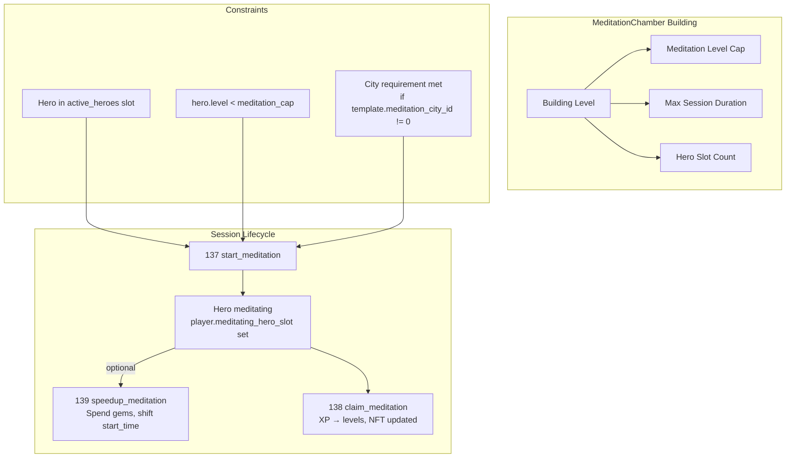
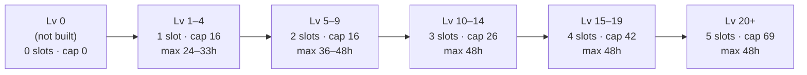
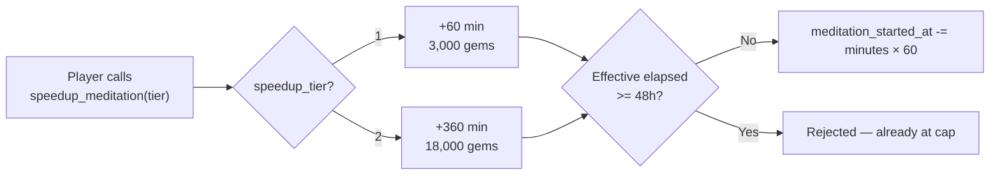
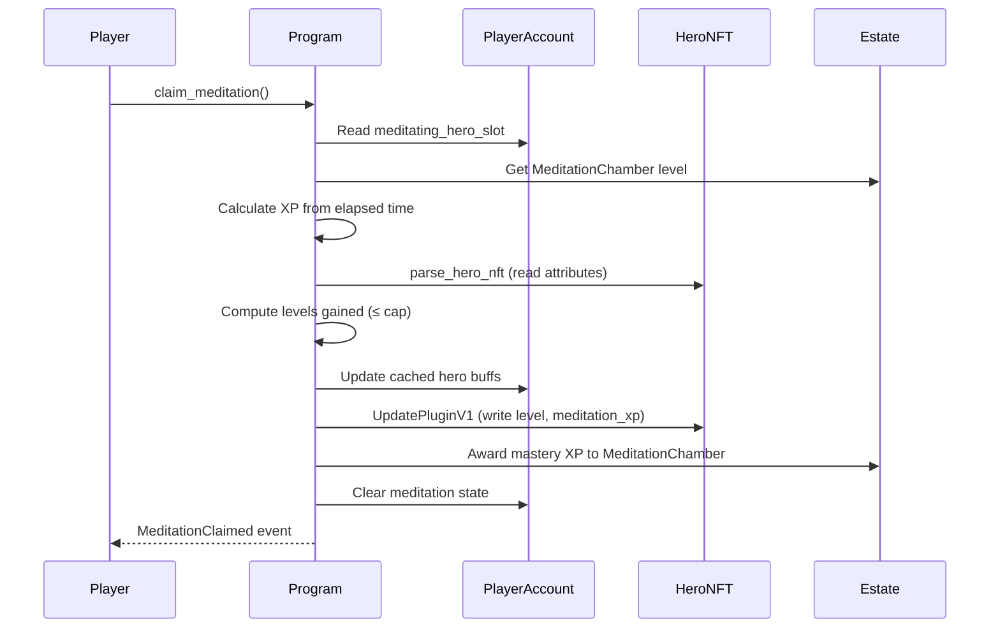

# Sanctuary System

> Passive hero leveling through meditation — a slow path to power that costs nothing but time.

## System Overview

The Sanctuary (built around the **MeditationChamber** building) enables a two-phase hero progression model:

- **Phase 1 — Meditation** (this system): Free, passive XP accumulation. Extremely slow. Works up to a φ-based level cap determined by the MeditationChamber building level.
- **Phase 2 — Fragments** (`hero/level_up`): Costs crafting fragments. Faster. Required to go beyond the meditation cap.

Meditation state lives entirely on `PlayerAccount` — there is no dedicated meditation account.



## Instructions

| ID | Instruction | Description |
|----|-------------|-------------|
| 137 | `start_meditation` | Begin meditation for a locked hero |
| 138 | `claim_meditation` | End session, grant XP + levels, update NFT |
| 139 | `speedup_meditation` | Spend gems to advance meditation time |

[Source: processor/sanctuary/](../../../programs/novus_mundus/src/processor/sanctuary/)

---

## MeditationChamber Building

The MeditationChamber building (`BuildingType::MeditationChamber = 9`) governs all sanctuary behaviour. It is a **Tier 2** building.

### Building Level Effects



| MeditationChamber Level | Hero Slots | Meditation Cap | Max Session Duration |
|------------------------|------------|----------------|---------------------|
| 0 (not built) | 0 | 0 | 0 |
| 1–4 | 1 | 16 (Lv 5 equivalent) | 24h + 0–9h |
| 5–9 | 2 | 16 | 24h + 12–24h |
| 10–14 | 3 | 26 | 48h (cap) |
| 15–19 | 4 | 42 | 48h (cap) |
| 20+ | 5 | 69 | 48h (cap) |

**Session duration formula:** `24 + (level - 1) × 3` hours, capped at 48h.

**Meditation cap formula:** `floor(10 × φ^(sanctuary_level / 5))` with linear interpolation for partial exponents.

- Lv 5: `10 × φ¹ ≈ 16`
- Lv 10: `10 × φ² ≈ 26`
- Lv 15: `10 × φ³ ≈ 42`
- Lv 20: `10 × φ⁴ ≈ 69`

Once `hero.level >= cap`, meditation is blocked. The player must use fragments (`hero/level_up`) for further leveling.

[Source: helpers/estate.rs](../../../programs/novus_mundus/src/helpers/estate.rs)

---

## XP Formula

```
xp_per_hour = sanctuary_level × 20
total_xp    = xp_per_hour × min(elapsed_seconds, max_duration) / 3600
```

| MeditationChamber Lv | XP/hour | Hours per level (levels 1–19) | Hours per level (levels 20+) |
|---------------------|---------|-------------------------------|------------------------------|
| 5 | 100 | 2–38h (varies by level) | ~112h+ |
| 10 | 200 | 1–19h (varies by level) | ~56h+ |
| 20 | 400 | 0.5–9.5h (varies by level) | ~28h+ |

### XP Required per Level

Two-tier XP system:

| Level range | XP required to reach next level |
|-------------|--------------------------------|
| Lv 0 → 1 | 200 |
| Lv 1–19 | `200 × current_level` (linear) |
| Lv 20+ | `11,200 × 1.1^(level − 20)` (compound weekly base) |

At Sanctuary Lv 10 (200 XP/hr) assuming 8h/day:
- Levels 1–19 total: ~38,000 XP ≈ 24 days
- Levels 20–26 total: ~85,000 XP ≈ 9 weeks
- Full path to cap (Lv 26): ~3.5 months

---

## Speedup

`speedup_meditation` shifts `meditation_started_at` backward, making the elapsed time appear larger when `claim_meditation` is called.



| Tier | Time Added | Gem Cost |
|------|-----------|----------|
| 1 | +60 min (1 hour) | 3,000 gems (60 min × 50 gems/min) |
| 2 | +360 min (6 hours) | 18,000 gems (360 min × 50 gems/min) |

**Cost formula:** `minutes × MEDITATION_SPEEDUP_GEMS_PER_MINUTE (50)`

**Cap:** Speedup is rejected once the effective elapsed time reaches the absolute maximum (48h). There is no per-tier cost multiplier — both tiers cost 1× gems-per-minute.

> **Note:** The `speedup_tier` parameter affects only how many minutes are added (60 vs 360), not the per-minute gem rate. Both tiers pay 50 gems per minute.

[Source: processor/sanctuary/speedup_meditation.rs](../../../programs/novus_mundus/src/processor/sanctuary/speedup_meditation.rs)

---

## Claim Flow

`claim_meditation` performs:

1. Verifies the hero in `player.meditating_hero_slot` matches `hero_mint`
2. Reads `MeditationChamber` building level from `EstateAccount`
3. Calculates `elapsed = min(now - meditation_started_at, max_duration)`
4. Computes `xp_earned`
5. Parses hero NFT attributes (`parse_hero_nft`)
6. Calculates levels gained (capped at `meditation_level_cap`)
7. Updates player's cached hero buffs via `add_buff_delta_to_player`
8. Writes new `level` and `meditation_xp` to hero NFT via MPL Core `UpdatePluginV1` (game_engine PDA signs)
9. Awards MeditationChamber mastery XP (1 XP per hour meditated)
10. Clears `player.meditating_hero_slot = 255` and `meditation_started_at = 0`



---

## Meditation State on PlayerAccount

Meditation state is embedded directly in `PlayerAccount` — no separate account exists:

| Field | Access | Meaning |
|-------|--------|---------|
| `meditating_hero_slot` | getter/setter | Slot index 0–2; 255 = not meditating |
| `meditation_started_at` | getter/setter | Unix timestamp when meditation began |

`player.is_hero_meditating()` returns `true` when `meditating_hero_slot != 255`.

> **Note:** `AccountKey::SanctuaryMeditation = 48` exists in the enum but corresponds to no on-chain account — meditation state is stored entirely within `PlayerAccount`.

[Source: processor/sanctuary/start_meditation.rs](../../../programs/novus_mundus/src/processor/sanctuary/start_meditation.rs)

---

## Hero Requirements

To meditate, a hero must:

1. Be in an `active_heroes` slot (locked in `PlayerAccount`)
2. Have `hero.level < meditation_level_cap(sanctuary_level)`
3. If `HeroTemplate.meditation_city_id != 0`, the player must currently be in that city

Only **one hero** can meditate at a time. `player.is_hero_meditating()` must be false to start.

While meditating, the hero is **excluded from combat buff calculations** — its bonuses are temporarily removed from the player's cached buff totals.

---

## Mastery System

`MeditationChamber.mastery_xp` accumulates **1 XP per hour** of completed meditation. Mastery level-ups use a **flat 100 XP per mastery level** (`while mastery_xp >= 100 { mastery_xp -= 100; mastery_level += 1 }`). Mastery level is capped at 100.

The `estate.blessed_hero` field (set by the daily MeditationChamber mini-game) provides additional daily bonuses outside this system.

---

## City Requirement

`HeroTemplate.meditation_city_id` can specify that a hero must be in a particular city to meditate. If `meditation_city_id == 0`, no city restriction applies.

This is verified at `start_meditation` against `player.current_city`.

---

## Client Integration

```typescript
import {
  createStartMeditationInstruction,
  createClaimMeditationInstruction,
  createSpeedupMeditationInstruction,
} from '@novus-mundus/sdk';

// Start meditation for hero in slot 0
const startIx = createStartMeditationInstruction(
  { owner, gameEngine, heroMint, heroTemplateId: template.templateId },
  { heroSlot: 0 }
);

// Claim after elapsed time (no minimum enforced — early claim just earns less XP)
const claimIx = createClaimMeditationInstruction(
  { owner, gameEngine, heroMint, heroTemplateId: template.templateId }
);

// Speedup: add 1 hour for 3,000 gems
const speedupIx = createSpeedupMeditationInstruction(
  { owner, gameEngine },
  { speedupTier: 1 }
);

// Check meditation status from PlayerAccount
const playerPda = derivePlayerPda(gameEngine, owner);
const player = await fetchPlayerAccount(connection, playerPda);
const isMeditating = player.meditatingHeroSlot !== 255;
```

---

*Meditation is the patient path. Those who invest time in their heroes unlock power that cannot be bought — only cultivated.*

---

Next: [Rallies](./rallies.md)
