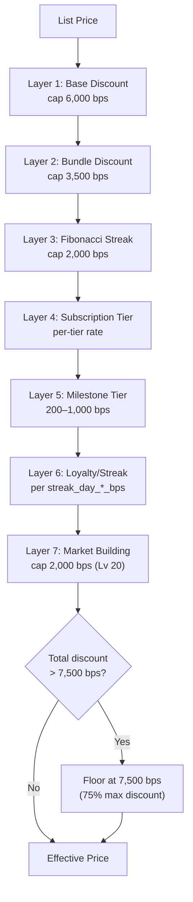
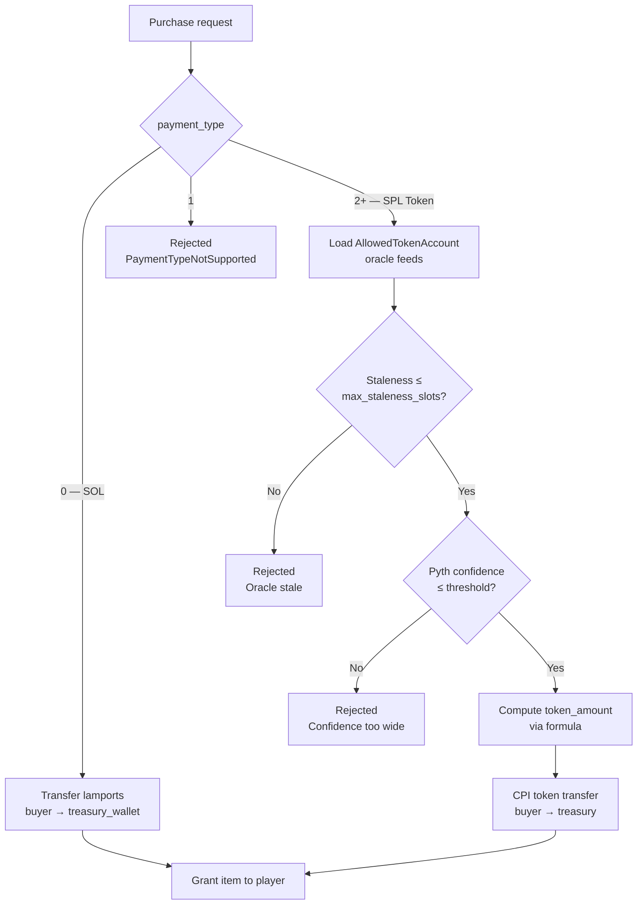
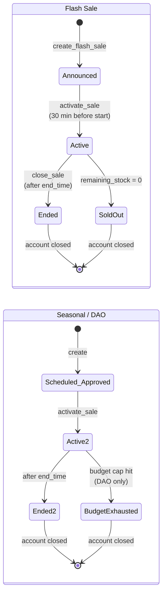
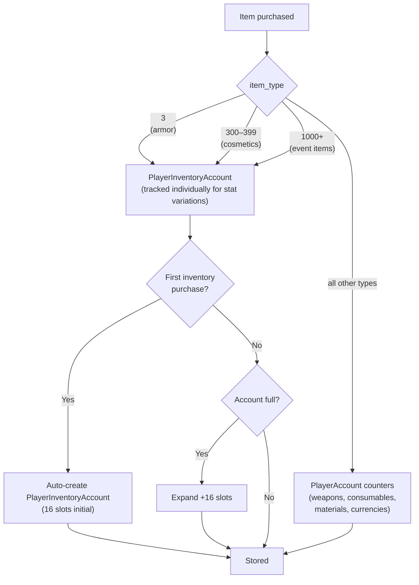
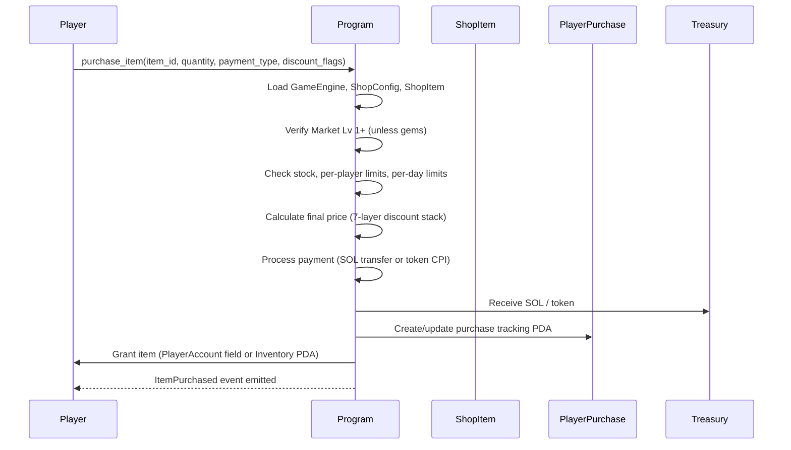

# Shop System

> Seven multiplicative discount layers, five sale types, and oracle-based token payment — every purchase is priced to reward engagement.

## System Overview

The Shop System is the primary monetisation and item-distribution mechanism in Novus Mundus. A global `ShopConfig` account (one per kingdom) defines discount caps and milestone thresholds. Individual items and bundles are persistent PDAs. Six time-limited sale vehicles layer additional discounts, all multiplicatively stacked against a hard 7,500 bps total cap.

```mermaid
graph TB
    subgraph "Admin Operations"
        DAO[DAO / Admin] -->|init_config| SC[ShopConfig PDA]
        DAO -->|create_item| SI[ShopItem PDAs]
        DAO -->|create_bundle| BU[Bundle PDAs]
        DAO -->|create_flash_sale| FS[FlashSale PDA]
        DAO -->|create_daily_deal| DD[DailyDeal PDAs]
        DAO -->|create_weekly_sale| WS[WeeklySale PDA]
        DAO -->|create_seasonal_sale| SS[SeasonalSale PDA]
        DAO -->|create_dao_promotion| DP[DAOPromotion PDA]
    end

    subgraph "Player Purchases"
        P[Player] -->|purchase_item| SI
        P -->|purchase_bundle| BU
        P -->|purchase_flash_sale| FS
    end

    subgraph "Discount Layers"
        L1[1. Base Discount]
        L2[2. Bundle Discount]
        L3[3. Fibonacci Streak]
        L4[4. Subscription Tier]
        L5[5. Milestone]
        L6[6. Loyalty/Streak]
        L7[7. Market Building]
        L1 --> L2 --> L3 --> L4 --> L5 --> L6 --> L7
    end
```



## Instructions

| ID | Instruction | Description |
|----|-------------|-------------|
| 140 | `init_config` | Create ShopConfig PDA (admin, once per kingdom) |
| 141 | `create_item` | Define a new purchasable ShopItem |
| 142 | `create_bundle` | Define a bundle of items at a combined price |
| 143 | `purchase_item` | Buy a shop item (SOL or whitelisted token) |
| 144 | `purchase_bundle` | Buy a bundle |
| 145 | `create_flash_sale` | Create a time-limited flash sale |
| 146 | `purchase_flash_sale` | Buy during an active flash sale |
| 147 | `close_sale` | Close an ended/sold-out sale (rent refund) |
| 148 | `create_daily_deal` | Create a rotating daily deal slot |
| 149 | `rotate_daily_deal` | Advance a daily deal to its next item |
| 150 | `create_weekly_sale` | Create a week-long themed sale |
| 151 | `update_item` | Modify shop item parameters |
| 152 | `create_seasonal_sale` | Create an event-tied seasonal sale |
| 153 | `create_dao_promotion` | Create a community-voted promotion |
| 154 | `update_bundle` | Modify bundle parameters |
| 155 | `update_config` | Update global ShopConfig |
| 156 | `activate_sale` | Manually activate an announced sale |
| 157 | `create_allowed_token` | Whitelist a token for payment |
| 158 | `update_allowed_token` | Update oracle settings for a token |
| 159 | `close_allowed_token` | Remove token from whitelist |
| 300 | `purchase_novi` | Buy NOVI with SOL (see [Currencies](../03-economy/currencies.md)) |

[Source: processor/shop/](../../../programs/novus_mundus/src/processor/shop/)

---

## Account Structures

### ShopConfigAccount

**PDA:** `["shop_config", game_engine]`

```rust
pub struct ShopConfigAccount {
    pub account_key: u8,
    // Discount caps (basis points)
    pub max_base_discount_bps: u16,      // 6000 (60%)
    pub max_bundle_discount_bps: u16,    // 3500 (35%)
    pub max_fib_discount_bps: u16,       // 2000 (20%)
    pub max_total_discount_bps: u16,     // 7500 (75%)
    // Sale limits
    pub max_flash_sales_per_day: u8,
    pub max_daily_deals: u8,
    pub flash_sale_min_duration_secs: u16,
    pub flash_sale_max_duration_secs: u16,
    // Milestone thresholds (lamports)
    pub bronze_threshold: u64,
    pub silver_threshold: u64,
    pub gold_threshold: u64,
    pub platinum_threshold: u64,
    pub diamond_threshold: u64,
    // Milestone discount rates (basis points)
    pub bronze_discount_bps: u16,        // 200 (2%)
    pub silver_discount_bps: u16,        // 400 (4%)
    pub gold_discount_bps: u16,          // 600 (6%)
    pub platinum_discount_bps: u16,      // 800 (8%)
    pub diamond_discount_bps: u16,       // 1000 (10%)
    // Loyalty streak discounts
    pub streak_day_2_bps: u16,
    pub streak_day_3_bps: u16,
    pub streak_day_5_bps: u16,
    pub streak_day_7_bps: u16,
    // Global stats
    pub total_sol_collected: u64,
    pub total_novi_burned: u64,
    pub next_flash_sale_id: u64,
    // SOL oracle config (for token payment conversion)
    pub sol_pyth_feed: Address,           // Pyth SOL/USD
    pub sol_switchboard_feed: Address,    // Switchboard SOL/USD
    pub sol_max_staleness_slots: u16,
    pub sol_confidence_threshold_bps: u16,
    pub bump: u8,
}
```

### ShopItemAccount

**PDA:** `["shop_item", game_engine, item_id_le_bytes]` (item_id: u32)

```rust
pub struct ShopItemAccount {
    pub account_key: u8,
    pub item_type: u16,                  // maps to ItemType enum
    pub category: u8,                    // 0=Equipment, 1=Consumable, 2=Material, 3=Cosmetic, 4=Currency
    pub rarity: u8,                      // 0=Common .. 4=Legendary
    pub quantity_per_purchase: u16,      // units received per purchase
    pub base_stats_bps: u16,
    pub price_sol_lamports: u64,         // 0 = not sold for SOL
    pub available_from: i64,             // 0 = always
    pub available_until: i64,            // 0 = no end
    pub max_global_stock: u64,           // 0 = unlimited
    pub current_global_stock: u64,
    pub max_per_player: u32,             // 0 = unlimited
    pub max_per_day: u16,                // 0 = unlimited
    pub is_active: bool,
    pub is_featured: bool,
    pub bump: u8,
}
```

### BundleAccount

**PDA:** `["bundle", game_engine, bundle_id_le_bytes]` (bundle_id: u32)

```rust
pub struct BundleItem {
    pub item_id: u32,
    pub quantity: u32,
}

pub struct BundleAccount {
    pub account_key: u8,
    pub tier: u8,                        // 0=Starter..4=Supreme
    pub category: u8,
    pub item_count: u8,                  // 2–10
    pub requires_subscription: u8,       // 0=None, 1=Rookie+..4=Legendary
    pub savings_bps: u16,
    pub is_active: bool,
    pub items: [BundleItem; 10],         // up to 10 items (item_id + quantity)
    pub price_sol_lamports: u64,
    pub available_from: i64,
    pub available_until: i64,
    pub total_purchases: u64,
    pub total_revenue_lamports: u64,
    pub bump: u8,
}
```

Bundle tiers and their inherent discounts:

| Tier | Name | Min Items | Base Discount |
|------|------|-----------|---------------|
| 0 | Starter | 2 | 10% (1,000 bps) |
| 1 | Combat | 3 | 15% (1,500 bps) |
| 2 | Crafter | 4 | 20% (2,000 bps) |
| 3 | Explorer | 5 | 25% (2,500 bps) |
| 4 | Supreme | 6+ | 35% (3,500 bps) |

### PlayerPurchaseAccount

**PDA:** `["player_purchase", player_wallet, item_id_le_bytes]`

Tracks per-player purchase counts for daily and lifetime limit enforcement. Closable once an item is delisted or lifetime limit is reached.

```rust
pub struct PlayerPurchaseAccount {
    pub account_key: u8,
    pub lifetime_purchased: u64,
    pub purchased_today: u64,
    pub last_purchase_day: u64,   // day number (timestamp / 86400)
    pub bump: u8,
}
```

### Sale Account Types

| Account | PDA Seeds | Lifecycle |
|---------|-----------|-----------|
| `FlashSaleAccount` | `["flash_sale", game_engine, sale_id_u64_le]` | Closable after status=Ended or SoldOut |
| `DailyDealAccount` | `["daily_deal", game_engine, slot_index_u8]` | Persistent, updated in place |
| `WeeklySaleAccount` | `["weekly_sale", game_engine, week_number_u64_le]` | Closable after week ends |
| `SeasonalSaleAccount` | `["seasonal_sale", game_engine, event_pubkey]` | Closable when status=Ended |
| `DAOPromotionAccount` | `["dao_promo", game_engine, proposal_id_u64_le]` | Closable when Ended or BudgetExhausted |
| `AllowedTokenAccount` | `["allowed_token", game_engine, token_mint]` | Closable (DAO-controlled) |

[Source: state/shop.rs](../../../programs/novus_mundus/src/state/shop.rs)

---

## Discount System

### 7-Layer Multiplicative Stack

All discount layers are applied multiplicatively, not additively. The final effective price is:

```
effective_price = list_price × ∏(1 - discount_i/10000)
```

floored so the total discount never exceeds `max_total_discount_bps = 7500` (75%).



| Layer | Source | Cap |
|-------|--------|-----|
| 1. Base | Item-level `price_sol_lamports` negotiation | 6,000 bps |
| 2. Bundle | Bundle tier discount | 3,500 bps |
| 3. Fibonacci | Consecutive daily purchase streak | 2,000 bps |
| 4. Subscription | Player subscription tier | Per-tier (see Subscription doc) |
| 5. Milestone | Lifetime spend tier | 200–1,000 bps |
| 6. Loyalty/Streak | Daily purchase streak | Per `streak_day_*_bps` fields |
| 7. Market Building | `market_discount_bps` from estate | Up to 2,000 bps (Lv 20) |

**Combined cap:** `max_total_discount_bps = 7500` (75% maximum discount).

### Milestone Tiers

Lifetime spend is measured in lamports paid to treasury. Configured in `ShopConfigAccount`.

| Tier | Default Discount | Threshold (configurable) |
|------|-----------------|--------------------------|
| Bronze | 200 bps (2%) | Configurable in ShopConfig |
| Silver | 400 bps (4%) | Configurable |
| Gold | 600 bps (6%) | Configurable |
| Platinum | 800 bps (8%) | Configurable |
| Diamond | 1,000 bps (10%) | Configurable |

### Market Building Discount

A player's Market building provides a daily shop discount, applied as Layer 7:

```
market_discount_bps = min(market_level × 100, 2000)  // 1% per level, capped at 20%
```

**Market Lv 1+ is required to purchase any item except gems.** Gem purchases bypass the Market building gate.

---

## Payment Types



| `payment_type` | Description |
|----------------|-------------|
| 0 | SOL — transfer lamports from buyer to `treasury_wallet` |
| 1 | Rejected (`PaymentTypeNotSupported`) |
| 2+ | SPL Token — uses `AllowedTokenAccount` oracle to convert USD price to token amount |

Token payments use dual oracle support (Pyth or Switchboard pull feeds). The `AllowedTokenAccount` stores per-token oracle feeds and a staleness limit in **slots** (not seconds). A per-token `discount_bps` reward is available for paying in that token.

```
token_amount = sol_cost_lamports × (sol_usd / token_usd) × 10^token_decimals / 10^9
```

Where `10^9` normalises from lamports (SOL has 9 decimals) and `10^token_decimals` scales the result to the token's native units.

Price data is validated for staleness (`max_staleness_slots`) and Pyth confidence interval (`confidence_threshold_bps`) before use.

---

## Sale Types



### Flash Sale

- Status lifecycle: `Announced(0)` → `Active(1)` → `Ended(2)` or `SoldOut(3)`.
- Announced 30 minutes before start.
- Discount capped at 5,000 bps (50%).
- Has a `max_stock` and `remaining_stock` — sells out when stock hits 0.
- Closable when `Ended` or `SoldOut`; rent returns to `payer`.

### Daily Deal

- Persistent per-slot PDAs (slot_index u8), updated in place by `rotate_daily_deal`.
- Pre-computed next deal: `next_item_id` and `next_discount_bps` stored for atomic rotation.
- Discount range: 1,500–4,000 bps (15–40%).

### Weekly Sale

- One per week (keyed by `week_number`).
- Themed by `WeeklySaleTheme`: Combat, Defense, Resource, Growth, Expedition.
- Per-category discounts via `category_discounts: [u16; 4]`.
- Closable after `ends_at`; rent to `payer`.

### Seasonal Sale

- Keyed by event pubkey (tied to an event account).
- Up to 10 featured items with individual `featured_discounts_bps`.
- Global `global_discount_bps` applies to all items.
- `spend_threshold` unlocks an `exclusive_cosmetic_id` for high spenders.
- Status: `Scheduled(0)` → `Active(1)` → `Ended(2)`.

### DAO Promotion

- Community-voted; requires DAO authority to create.
- Per-category discounts: equipment, consumable, material, cosmetic, global.
- `max_discount_budget_lamports` caps total discount given.
- Status: `Approved(0)` → `Active(1)` → `Ended(2)` or `BudgetExhausted(3)`.

---

## Item Routing on Purchase



When fulfilling a purchase, the program routes items based on `item_type`:

```rust
// Item types routed to PlayerInventoryAccount (separate PDA)
fn is_inventory_item_type(item_type: u16) -> bool {
    matches!(item_type, 3 | 300..=399 | 1384..)
}
// 1000–1383 falls through to fulfill_item's cosmetic branches (badge/title/
// color/frame for 1000–1255; reserved + rejected for 1256–1383).
// All other types → direct PlayerAccount fields (counters/totals).
```

- `item_type == 3`: armor pieces (tracked individually for stat variations)
- `item_type 300–399`: legacy inventory items
- `item_type 1000–1255`: cosmetics — routed through `fulfill_item` →
  `CosmeticsSection.owned_<kind> |= 1 << id`, NOT the separate inventory PDA
- `item_type 1256–1383`: reserved cosmetic effects/poses — currently
  rejected with `InvalidParameter` until wired
- `item_type 1384+`: future "true inventory" event items
- All other types (weapons, consumables, materials, currencies) → PlayerAccount counters

The `PlayerInventoryAccount` PDA is derived from the player PDA (NOT the
buyer wallet) — `PlayerInventoryHeader::derive_pda(player_pda)` — and
auto-creates / auto-expands (16 slots initial, +16 per expansion) when the
first inventory item lands. Chain callers must pass `player_account.address()`,
not `buyer.address()`, to `add_to_inventory`.

[Source: helpers/inventory.rs](../../../programs/novus_mundus/src/helpers/inventory.rs)

---

## Purchase Flow



---

## Client Integration

```typescript
import { purchaseItemInstruction, purchaseBundleInstruction } from "@novus-mundus/sdk";

// Purchase a single item with SOL, applying daily-deal discount
const purchaseIx = purchaseItemInstruction({
  buyer: wallet.publicKey,
  playerAccount: playerPda,
  gameEngine: gameEnginePda,
  shopConfig: shopConfigPda,
  shopItem: shopItemPda,
  playerPurchase: playerPurchasePda,
  treasury: treasuryWallet,
  systemProgram: SystemProgram.programId,
  inventoryAccount: inventoryPda,       // auto-created if needed
  estateAccount: estatePda,             // for Market building discount
  // Optional: apply daily-deal discount
  dailyDeal: dailyDealPda,
  itemId: 42,
  quantity: 1,
  paymentType: 0,           // 0 = SOL
  discountFlags: 1,         // bit 0 = DISCOUNT_DAILY_DEAL
  dailyDealSlot: 0,
});

// Purchase a bundle
const bundleIx = purchaseBundleInstruction({
  buyer: wallet.publicKey,
  playerAccount: playerPda,
  gameEngine: gameEnginePda,
  shopConfig: shopConfigPda,
  bundle: bundlePda,
  treasury: treasuryWallet,
  systemProgram: SystemProgram.programId,
  estateAccount: estatePda,
  bundleId: 7,
  paymentType: 0,
});
```

---

*Discounts stack multiplicatively — the more engaged you are across subscription, milestones, streak, and building upgrades, the lower your effective purchase price.*

---

Next: [Subscription](./subscription.md)
