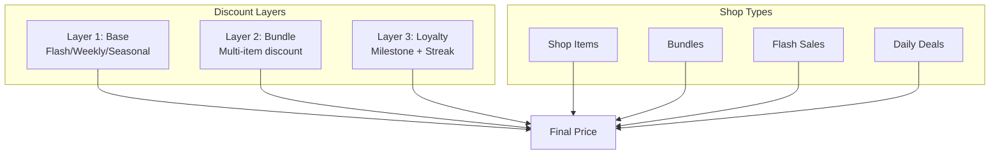
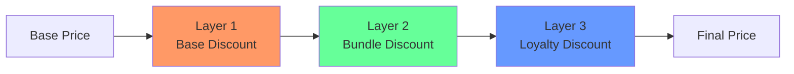
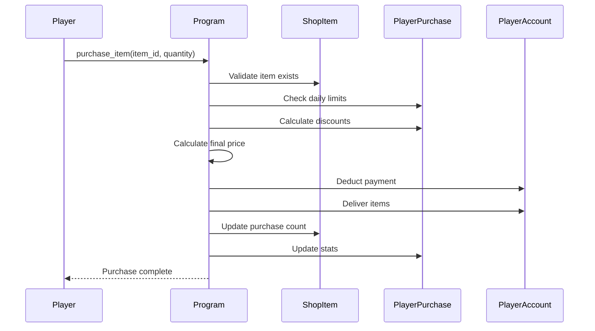
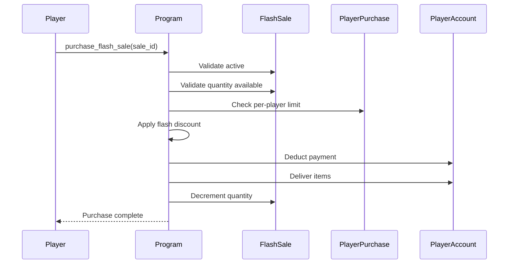

# Shop System

> Multi-layered discount system, items, bundles, and time-limited sales.

## System Overview

The Shop System provides a sophisticated **multi-layer discount** mechanism with items, bundles, flash sales, and loyalty rewards. Multiple discounts stack multiplicatively up to configured caps.



## Instructions

| ID | Instruction | Description |
|----|-------------|-------------|
| 140 | `initialize_shop` | Create shop config (admin) |
| 141 | `create_item` | Define shop item |
| 142 | `create_bundle` | Create item bundle |
| 143 | `purchase_item` | Buy single item |
| 144 | `purchase_bundle` | Buy bundle |
| 145 | `activate_flash_sale` | Start flash sale |
| 146 | `purchase_flash_sale` | Buy during flash sale |
| 147 | `update_daily_deal` | Refresh daily deals |
| 148 | `activate_sale` | Start promotional sale |

[Source: processor/shop/](../../../programs/novus_mundus/src/processor/shop/)

---

## ShopConfigAccount

Global shop configuration:

```
ShopConfigAccount:
├── // Discount Caps (basis points)
├── max_base_discount_bps: u16     // Layer 1 cap (6000 = 60%)
├── max_bundle_discount_bps: u16   // Layer 2 cap (3500 = 35%)
├── max_fib_discount_bps: u16      // Layer 3 cap (2000 = 20%)
├── max_total_discount_bps: u16    // Combined cap (7500 = 75%)
│
├── // Sale Limits
├── max_flash_sales_per_day: u8
├── max_daily_deals: u8
├── flash_sale_min_duration_secs: u16
├── flash_sale_max_duration_secs: u16
│
├── // Milestone Thresholds (lamports)
├── bronze_threshold: u64
├── silver_threshold: u64
├── gold_threshold: u64
├── platinum_threshold: u64
├── diamond_threshold: u64
│
├── // Milestone Discount Rates (bps)
├── bronze_discount_bps: u16       // 200 = 2%
├── silver_discount_bps: u16       // 400 = 4%
├── gold_discount_bps: u16         // 600 = 6%
├── platinum_discount_bps: u16     // 800 = 8%
├── diamond_discount_bps: u16      // 1000 = 10%
│
├── // Loyalty Streak Discounts (bps)
├── streak_day_2_bps: u16
├── streak_day_3_bps: u16
├── streak_day_5_bps: u16
├── streak_day_7_bps: u16
│
├── // Global Stats
├── total_sol_collected: u64
├── total_novi_burned: u64
│
├── next_flash_sale_id: u64
└── bump: u8
```

**Seeds:** `["shop_config", game_engine_pubkey]`

---

## Discount System

### Three-Layer Architecture



### Layer 1: Base Discounts

Sources for base discounts:

| Source | Max | Description |
|--------|-----|-------------|
| Flash Sale | 60% | Time-limited deep discounts |
| Weekly Sale | 40% | Weekly rotating items |
| Seasonal Sale | 50% | Holiday/event sales |
| DAO Promotion | 30% | Governance-approved |

**Cap:** `max_base_discount_bps` (default 60%)

### Layer 2: Bundle Discounts

Buying multiple items together:

| Bundle Size | Discount |
|-------------|----------|
| 2 items | 5% |
| 3 items | 10% |
| 4 items | 15% |
| 5+ items | 20% |

**Cap:** `max_bundle_discount_bps` (default 35%)

### Layer 3: Loyalty Discounts

Two sub-components:

#### Milestone Discounts

Based on total lifetime SOL spent:

| Milestone | Threshold | Discount |
|-----------|-----------|----------|
| Bronze | 1 SOL | 2% |
| Silver | 5 SOL | 4% |
| Gold | 20 SOL | 6% |
| Platinum | 100 SOL | 8% |
| Diamond | 500 SOL | 10% |

#### Streak Discounts

Consecutive days of purchases:

| Streak | Discount |
|--------|----------|
| Day 2 | 1% |
| Day 3 | 2% |
| Day 5 | 3% |
| Day 7+ | 5% |

**Combined Layer 3 Cap:** `max_fib_discount_bps` (default 20%)

### Final Price Calculation

```rust
fn calculate_final_price(base_price: u64, discounts: &Discounts, config: &ShopConfig) -> u64 {
    // Layer 1: Apply base discount (capped)
    let layer1_discount = min(discounts.base_discount_bps, config.max_base_discount_bps);
    let after_l1 = base_price * (10000 - layer1_discount) / 10000;

    // Layer 2: Apply bundle discount (capped)
    let layer2_discount = min(discounts.bundle_discount_bps, config.max_bundle_discount_bps);
    let after_l2 = after_l1 * (10000 - layer2_discount) / 10000;

    // Layer 3: Apply loyalty discount (capped)
    let layer3_discount = min(
        discounts.milestone_bps + discounts.streak_bps,
        config.max_fib_discount_bps
    );
    let after_l3 = after_l2 * (10000 - layer3_discount) / 10000;

    // Final cap check
    let total_discount = 10000 - (after_l3 * 10000 / base_price);
    if total_discount > config.max_total_discount_bps {
        return base_price * (10000 - config.max_total_discount_bps) / 10000;
    }

    after_l3
}
```

**Example:**
- Base price: 10,000 NOVI
- Flash sale: 30% off (Layer 1)
- Bundle of 3: 10% off (Layer 2)
- Gold milestone + 3-day streak: 8% off (Layer 3)

```
After L1: 10,000 × 0.70 = 7,000
After L2: 7,000 × 0.90 = 6,300
After L3: 6,300 × 0.92 = 5,796 NOVI
Total discount: 42%
```

---

## Shop Items

### ShopItemAccount

```
ShopItemAccount:
├── item_id: u64
├── name: [u8; 32]
├── name_len: u8
├── item_type: u8              // ItemType enum
├── base_price_novi: u64       // Price in NOVI
├── base_price_sol: u64        // Price in SOL (lamports)
├── daily_purchase_limit: u8
├── total_purchase_limit: u32
├── total_purchased: u32
├── is_active: bool
└── bump: u8
```

**Seeds:** `["shop_item", game_engine, item_id_bytes]`

### Item Types

| Type | Value | Delivers |
|------|-------|----------|
| Units | 0 | Operatives (tier in data) |
| Weapons | 1 | Melee/Ranged/Siege |
| Equipment | 2 | Crafting materials |
| Currency | 3 | Gems/Cash/Fragments |
| Cosmetic | 4 | Skins, decorations |
| Booster | 5 | Temporary buffs |

---

## Bundles

### BundleAccount

```
BundleAccount:
├── bundle_id: u64
├── name: [u8; 32]
├── name_len: u8
├── items: [BundleItem; 10]    // Up to 10 items
├── item_count: u8
├── base_price_novi: u64       // Bundle price
├── base_price_sol: u64
├── bundle_discount_bps: u16   // Additional bundle discount
├── available_from: i64
├── available_until: i64
├── purchase_limit: u32
├── total_purchased: u32
├── is_active: bool
└── bump: u8
```

### BundleItem

```
BundleItem:
├── item_id: u64
└── quantity: u16
```

**Seeds:** `["bundle", game_engine, bundle_id_bytes]`

---

## Flash Sales

### FlashSaleAccount

```
FlashSaleAccount:
├── sale_id: u64
├── item_id: u64               // Item on sale
├── discount_bps: u16          // Sale discount
├── started_at: i64
├── ends_at: i64
├── quantity_available: u32
├── quantity_sold: u32
├── max_per_player: u8
├── is_active: bool
└── bump: u8
```

**Seeds:** `["flash_sale", game_engine, sale_id_bytes]`

### Flash Sale Rules

- Duration: 15 minutes to 4 hours (configurable)
- Max per day: Configurable (default 4)
- Deep discounts: Up to 60%
- Limited quantity: Creates urgency

---

## Daily Deals

### DailyDealAccount

```
DailyDealAccount:
├── deal_id: u64
├── item_id: u64
├── discount_bps: u16
├── rotation_day: u32          // Day number since epoch
├── purchase_count: u32
├── is_active: bool
└── bump: u8
```

**Seeds:** `["daily_deal", game_engine, deal_id_bytes]`

Rotates every 24 hours with new items.

---

## Player Purchase Tracking

### PlayerPurchaseAccount

```
PlayerPurchaseAccount:
├── player: Pubkey
├── total_sol_spent: u64       // For milestone tracking
├── total_novi_spent: u64
├── last_purchase_day: u32     // For streak tracking
├── current_streak: u8
├── longest_streak: u8
├── milestone_tier: u8         // 0=none, 1=bronze, ..., 5=diamond
│
├── // Daily limits
├── purchases_today: [ItemPurchase; 20]
├── purchases_today_count: u8
├── today_day: u32
│
└── bump: u8
```

**Seeds:** `["player_purchase", player_pubkey]`

---

## Purchase Flow

### Purchase Item

**Instruction:** `143 - purchase_item`



### Purchase Bundle

**Instruction:** `144 - purchase_bundle`

Similar flow but applies bundle discount layer.

### Purchase Flash Sale

**Instruction:** `146 - purchase_flash_sale`



---

## Client Integration

### Display Shop

```javascript
async function getShopItems(connection, gameEngine) {
  const items = await fetchAllShopItems(connection, gameEngine);
  const player = await getPlayerPurchaseAccount(connection, wallet.publicKey);

  return items.filter(i => i.isActive).map(item => {
    const discounts = calculateDiscounts(item, player, currentSales);
    const finalPrice = calculateFinalPrice(item.basePriceNovi, discounts, shopConfig);

    return {
      id: item.itemId,
      name: decodeItemName(item.name, item.nameLen),
      type: getItemTypeName(item.itemType),
      basePrice: item.basePriceNovi,
      finalPrice,
      discount: Math.floor((1 - finalPrice / item.basePriceNovi) * 100),
      dailyRemaining: item.dailyPurchaseLimit - getDailyPurchases(player, item.itemId),
      isOnSale: discounts.baseBps > 0
    };
  });
}
```

### Display Discounts

```javascript
function renderDiscountBreakdown(basePrice, discounts, finalPrice) {
  const layers = [];

  if (discounts.baseBps > 0) {
    layers.push(`Flash/Sale: -${discounts.baseBps / 100}%`);
  }
  if (discounts.bundleBps > 0) {
    layers.push(`Bundle: -${discounts.bundleBps / 100}%`);
  }
  if (discounts.milestoneBps > 0) {
    layers.push(`${discounts.milestoneTier} Member: -${discounts.milestoneBps / 100}%`);
  }
  if (discounts.streakBps > 0) {
    layers.push(`Day ${discounts.streak} Streak: -${discounts.streakBps / 100}%`);
  }

  const totalDiscount = Math.floor((1 - finalPrice / basePrice) * 100);

  return `
    Base Price: ${formatNovi(basePrice)}
    ${layers.map(l => `  ${l}`).join('\n')}
    ────────────────
    Final Price: ${formatNovi(finalPrice)} (-${totalDiscount}%)
  `;
}
```

### Flash Sale Alert

```javascript
async function checkFlashSales(connection, gameEngine) {
  const sales = await fetchActiveFlashSales(connection, gameEngine);
  const now = Date.now() / 1000;

  return sales
    .filter(s => s.isActive && now < s.endsAt && s.quantityAvailable > s.quantitySold)
    .map(sale => ({
      id: sale.saleId,
      itemId: sale.itemId,
      discount: sale.discountBps / 100,
      remaining: sale.quantityAvailable - sale.quantitySold,
      endsIn: sale.endsAt - now
    }));
}
```

### Purchase with Confirmation

```javascript
async function purchaseWithPreview(connection, wallet, itemId, quantity) {
  // Get current discounts
  const item = await getShopItem(connection, itemId);
  const player = await getPlayerPurchaseAccount(connection, wallet.publicKey);
  const discounts = calculateAllDiscounts(item, player);

  const preview = {
    item: item.name,
    quantity,
    baseTotal: item.basePriceNovi * quantity,
    discounts: formatDiscountBreakdown(discounts),
    finalTotal: calculateFinalPrice(item.basePriceNovi * quantity, discounts),
    loyaltyProgress: {
      currentStreak: player.currentStreak,
      nextStreakBonus: getNextStreakBonus(player.currentStreak),
      milestoneProgress: getMilestoneProgress(player.totalSolSpent)
    }
  };

  // Show preview to user
  if (await confirmPurchase(preview)) {
    const ix = purchaseItemInstruction({ itemId, quantity });
    return sendTransaction(connection, wallet, [ix]);
  }
}
```

---

## Constants

| Constant | Value | Description |
|----------|-------|-------------|
| `MAX_PURCHASE_PER_ITEM` | 100 | Daily purchase limit |
| `FLASH_SALE_DURATION` | 3,600 | Default 1 hour |
| `DAILY_DEAL_ROTATION` | 86,400 | 24 hour rotation |
| `MAX_BUNDLE_ITEMS` | 10 | Items per bundle |
| `MAX_DAILY_PURCHASES` | 20 | Different items per day |

---

*The Shop rewards loyalty. Buy smart, build streaks, and watch your discounts grow.*

---

Next: [Formulas](../05-formulas/phi-scaling.md)
