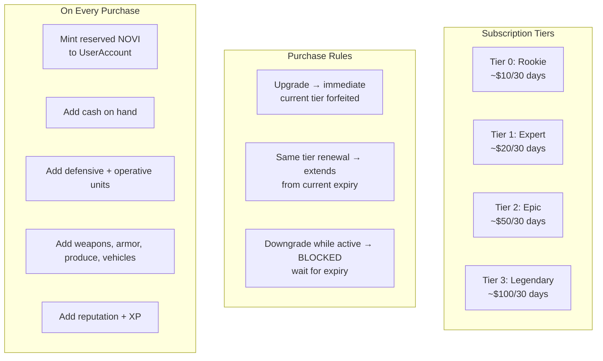
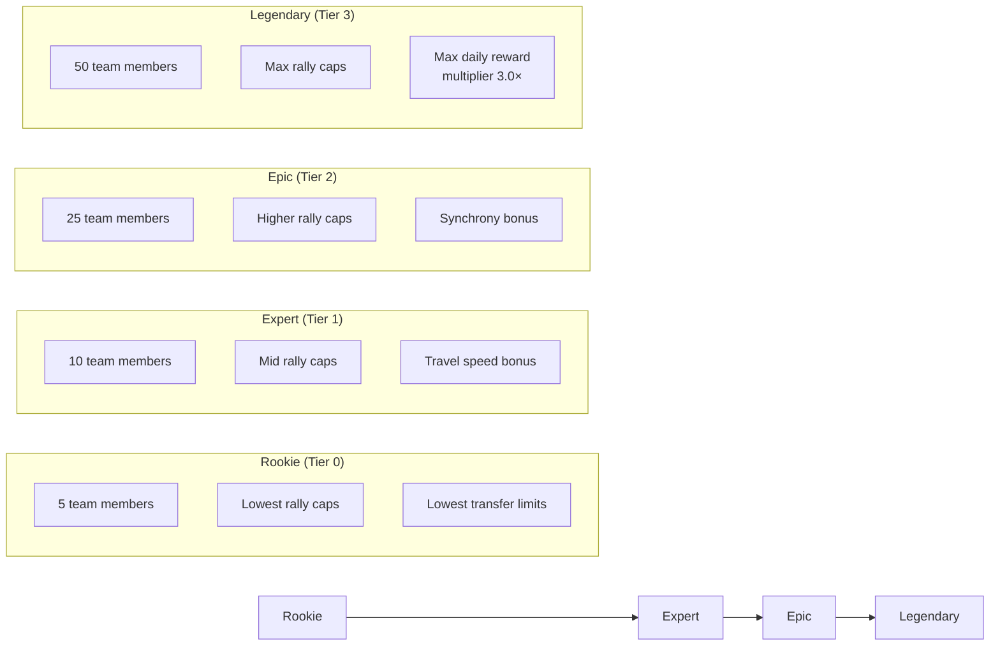
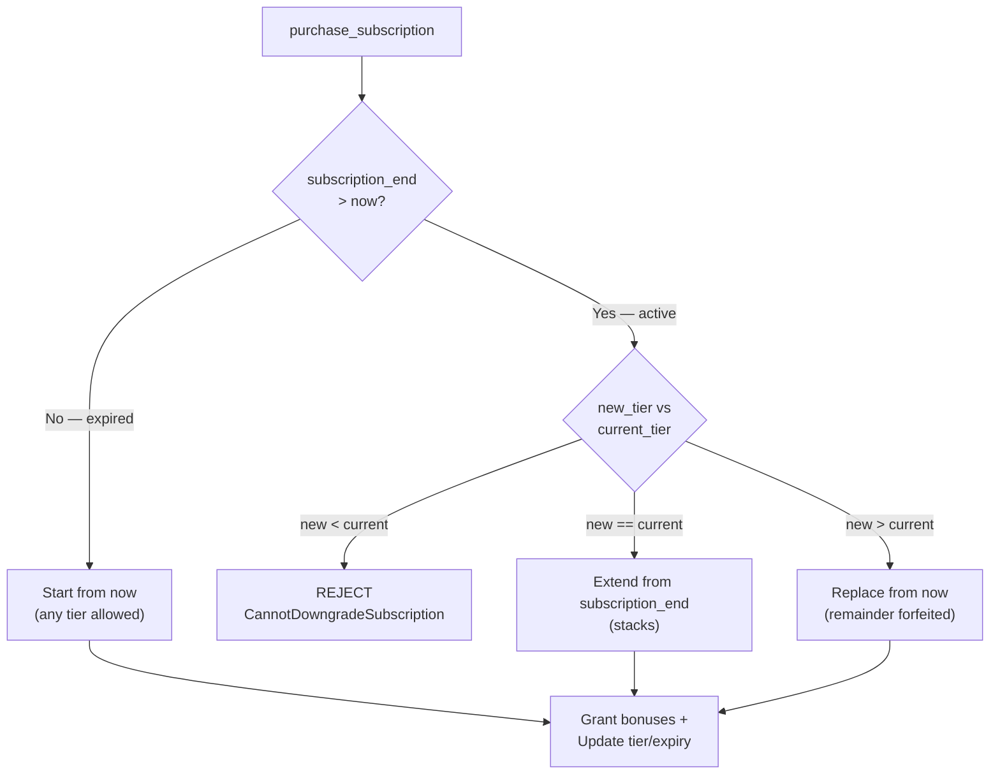
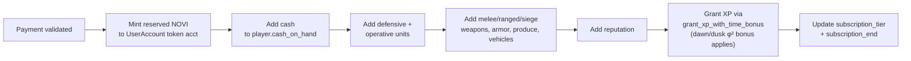
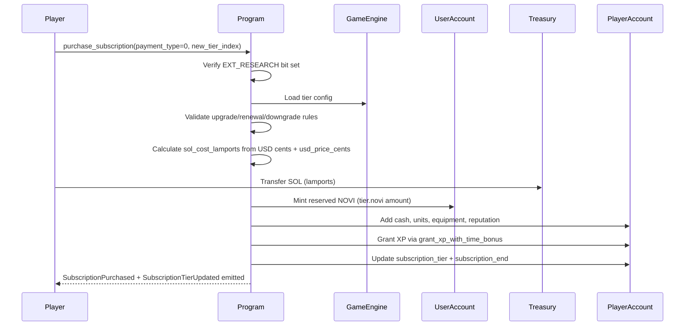

# Subscription System

> Four premium tiers — Rookie, Expert, Epic, Legendary — with immediate resource bonuses and persistent generation multipliers.

## System Overview

The Subscription System grants players persistent, time-bounded benefits stored on their `PlayerAccount`. Subscriptions are purchased with SOL, an offchain payment (Stripe/PayPal via backend co-signature), or a whitelisted SPL token. Bonuses are granted on **every** purchase and renewal — not just the first. Tier configuration (costs, durations, bonuses) is live-updatable by DAO without a program upgrade.



## Instructions

| ID | Instruction | Description |
|----|-------------|-------------|
| 100 | `purchase_subscription` | Buy or renew a subscription tier |
| 101 | `update_tier` | Update SubscriptionTier config in GameEngine (DAO only) |
| 102 | `downgrade_expired` | Reset expired subscription to tier 0 (permissionless) |

[Source: processor/subscription/](../../../programs/novus_mundus/src/processor/subscription/)

---

## SubscriptionTier Struct

Four `SubscriptionTier` entries are embedded directly in `GameEngine.subscription_tiers[4]`. They are updated via `update_tier` (instruction 101) without redeploying the program.

```rust
pub struct SubscriptionTier {
    pub name: [u8; 16],                  // "Rookie\0...", "Expert\0...", etc.
    pub tier_index: u8,                  // 0–3
    // Configuration
    pub cost_in_usd_cents: u64,          // e.g. 1000 = $10.00
    pub duration_days: u32,              // e.g. 30
    pub generation_multiplier: u64,      // daily NOVI generation multiplier (raw factor)
    pub max_locked_novi: u64,            // maximum locked NOVI capacity at this tier
    pub daily_reward_multiplier: u64,    // bps: 10000=1.0×, 15000=1.5×, 30000=3.0×
    pub synchrony_bonus: u32,            // bps: e.g. 500 = 5% synchrony bonus

    // Bonuses granted on EVERY purchase/renewal
    pub novi: u64,                       // reserved NOVI minted (withdrawable!)
    pub cash: u64,                       // cash on hand added
    pub du_1: u64,                       // defensive unit 1 count
    pub du_2: u64,
    pub du_3: u64,
    pub op_1: u64,                       // operative unit 1 count
    pub op_2: u64,
    pub op_3: u64,
    pub melee_weapons: u64,
    pub ranged_weapons: u64,
    pub siege_weapons: u64,
    pub armor: u64,
    pub produce: u64,
    pub vehicles: u64,
    pub reputation: u64,
    pub xp: u64,

    // Structural caps (also per-tier)
    pub rally_caps: RallyCaps,           // active rallies joined, created/day, troop contribution, size, duration
    pub max_team_members: u8,           // 5, 10, 25, 50
    pub max_daily_transfer_amount: u64,  // anti-Sybil: max cash transferred per day
    pub max_daily_transfer_count: u8,
    pub travel_speed_bonus_bps: u32,    // intercity + intracity travel speed bonus
}
```

[Source: state/game_engine.rs `SubscriptionTier`](../../../programs/novus_mundus/src/state/game_engine.rs)

---

## Tier Overview

Tier names are embedded in `SubscriptionTier.name`. Costs and durations are set at `GameEngine` initialization and are DAO-updatable:

| Index | Name | Default Cost | Default Duration |
|:-----:|------|:------------:|:----------------:|
| 0 | Rookie | Configured via DAO | 30 days |
| 1 | Expert | Configured via DAO | 30 days |
| 2 | Epic | Configured via DAO | 30 days |
| 3 | Legendary | Configured via DAO | 30 days |

---

## Tier Capability Overview



## Purchase Logic

### Payment Types

| `payment_type` | Mechanism |
|:--------------:|-----------|
| 0 | SOL — lamports transferred from buyer wallet to `game_engine.treasury_wallet` |
| 1 | Offchain — `payment_authority` (backend) co-signs; requires `game_engine.allow_offchain_payments == true` |
| 2 | SPL Token — oracle-priced via Pyth/Switchboard (same flow as shop token payments) |

### SOL Cost Formula

```
sol_cost_lamports = (tier.cost_in_usd_cents × 1_000_000_000) / game_engine.usd_price_cents
```

Example: $10.00 tier, SOL at $100 (10,000 cents):
```
sol_cost = (1000 × 1_000_000_000) / 10_000 = 100_000_000 lamports = 0.1 SOL
```

### Upgrade / Renewal Rules



```
if player.subscription_end > now:
    if new_tier < current_tier → REJECT (CannotDowngradeSubscription)
    if new_tier == current_tier → extend from subscription_end
    if new_tier > current_tier → replace from now (cheaper tier forfeited)
else:
    any tier → start from now
```

| Scenario | Expiry Base |
|----------|-------------|
| Same tier while active | `subscription_end` (stacks) |
| Upgrade while active | `now` (forfeits remainder) |
| Any tier while expired | `now` |

### Bonus Grants (on every purchase)



On every successful purchase or renewal the program:

1. **Mints reserved NOVI** (`tier.novi`) to `user_novi_ata` (UserAccount's NOVI token account). Also increments `user_data.reserved_novi` and sets `reserved_novi_earned_at = now`.
2. Adds `tier.cash` to `player_data.cash_on_hand`.
3. Adds `tier.du_1/du_2/du_3` to `player_data.defensive_unit_*`.
4. Adds `tier.op_1/op_2/op_3` to `player_data.operative_unit_*`.
5. Adds `tier.melee_weapons`, `tier.ranged_weapons`, `tier.siege_weapons`, `tier.armor`, `tier.produce`, `tier.vehicles` to the corresponding `PlayerAccount` fields.
6. Adds `tier.reputation` to `player_data.reputation`.
7. Grants `tier.xp` XP via `grant_xp_with_time_bonus()` (dawn/dusk golden hours apply φ² bonus).

> **Note:** Reserved NOVI is minted to the **UserAccount** PDA's token account, not to the wallet directly. Use `reserved_to_locked` or `withdraw_reserved` (instructions 15/16) to convert or withdraw it.

### Prerequisite

Players must have the `EXT_RESEARCH` extension bit set on their `PlayerAccount` before purchasing a subscription. This ensures the player has completed initial research onboarding.

---

## update_tier (Instruction 101)

DAO-only. Updates a single `SubscriptionTier` in `GameEngine.subscription_tiers[tier_index]` without a program upgrade.

- **Authority:** `game_engine.authority` must sign.
- **Data:** `tier_index: u8` + serialized `SubscriptionTier` struct (raw bytes).
- **Validation:** `new_tier.tier_index` must match the `tier_index` parameter.
- Increments `game_engine.version` on success.

[Source: processor/subscription/update_tier.rs](../../../programs/novus_mundus/src/processor/subscription/update_tier.rs)

---

## downgrade_expired (Instruction 102)

Permissionless cranker instruction. Resets `player.subscription_tier` to 0 when `subscription_end <= now`.

- Accepts a single `[writable] player_account` argument.
- No-ops silently if subscription is still active or already tier 0.
- Emits `SubscriptionExpired` event with `old_tier` and timestamp.
- `subscription_end` is **not** cleared — it retains the historical expiry timestamp.

This instruction is intended for crank bots and UI page-load cleanup to maintain accurate tier state without requiring the player to perform any action.

[Source: processor/subscription/downgrade_expired.rs](../../../programs/novus_mundus/src/processor/subscription/downgrade_expired.rs)

---

## Effective Tier

`PlayerAccount.get_effective_tier(now)` returns `subscription_tier` if `subscription_end > now`, otherwise `0`. All systems that gate on subscription tier (event joins, transfer limits, rally caps) use the effective tier rather than the raw stored value.

---

## PlayerAccount Fields

Subscription state is stored directly on `PlayerAccount` (no separate subscription PDA):

| Field | Type | Description |
|-------|------|-------------|
| `subscription_tier` | `u8` | Current tier index (0–3) |
| `subscription_end` | `i64` | Unix timestamp of expiry |

Tier-specific caps (rally caps, team size, transfer limits, travel speed) are looked up dynamically from `game_engine.subscription_tiers[subscription_tier]` at instruction execution time — they are not cached on `PlayerAccount`.

---

## Purchase Flow



---

## Client Integration

```typescript
import { purchaseSubscriptionInstruction } from "@novus-mundus/sdk";

// SOL payment
const purchaseIx = purchaseSubscriptionInstruction({
  player: playerPda,
  user: userPda,
  owner: wallet.publicKey,
  paymentAuthority: NULL_PUBLIC_KEY,   // not required for SOL payment
  treasuryWallet: treasuryPubkey,
  userNoviAta: userNoviTokenAccount,
  noviMint: noviMintAddress,
  gameEngine: gameEnginePda,
  tokenProgram: TOKEN_PROGRAM_ID,
  systemProgram: SystemProgram.programId,
  paymentType: 0,           // 0 = SOL
  newTierIndex: 1,          // Expert
});

// Downgrade cleanup (permissionless — e.g., on page load)
const downgradeIx = downgradeExpiredInstruction({
  playerAccount: playerPda,
});
```

---

*Subscription tiers compound your empire's growth rate — every renewal floods your coffers with units, resources, and reserved NOVI, then extends your generation multiplier for another cycle.*

---

Next: [Arena](./arena.md)
