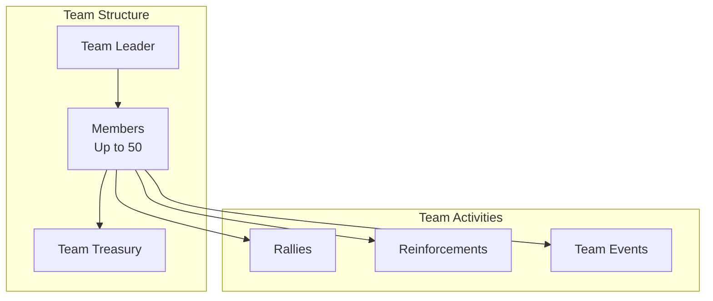
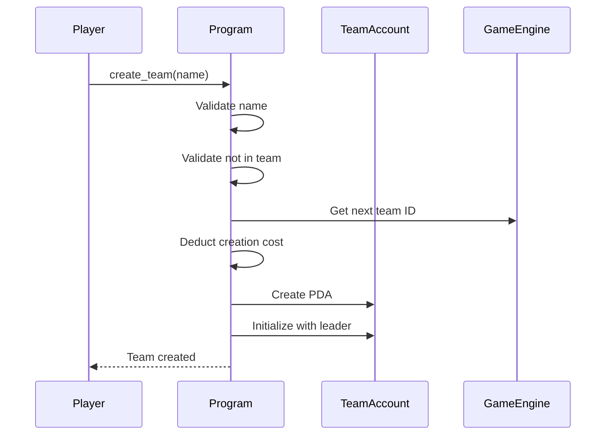
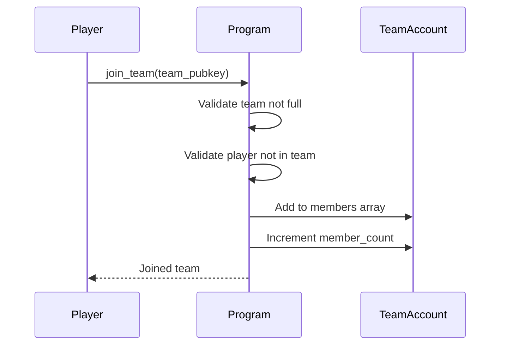
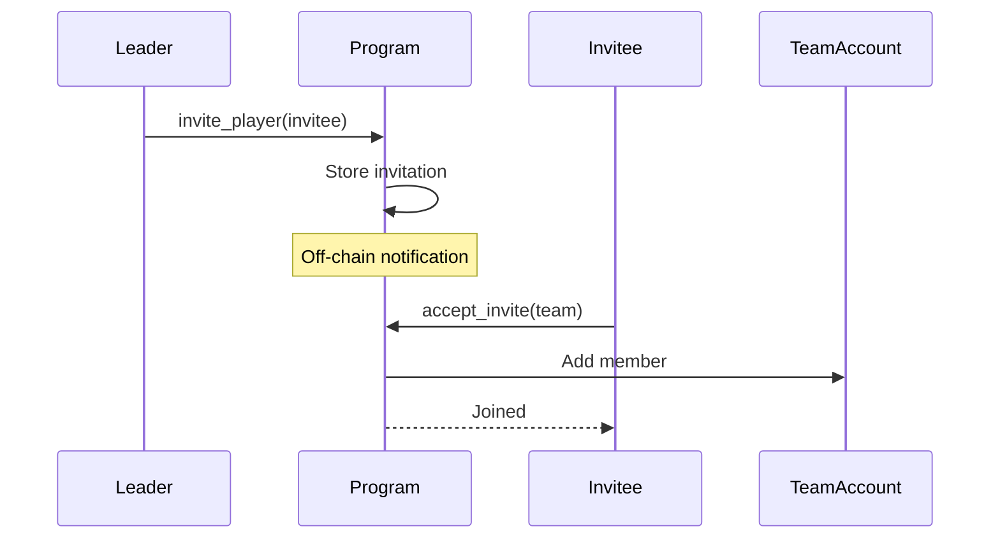
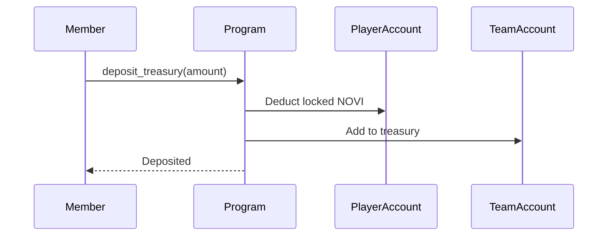
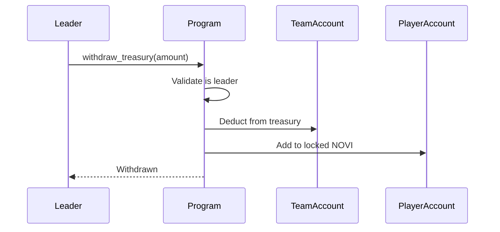
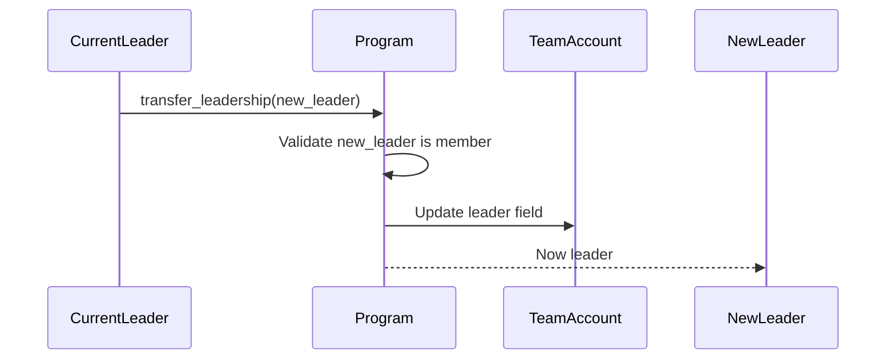
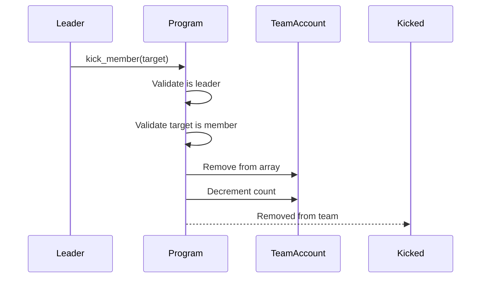
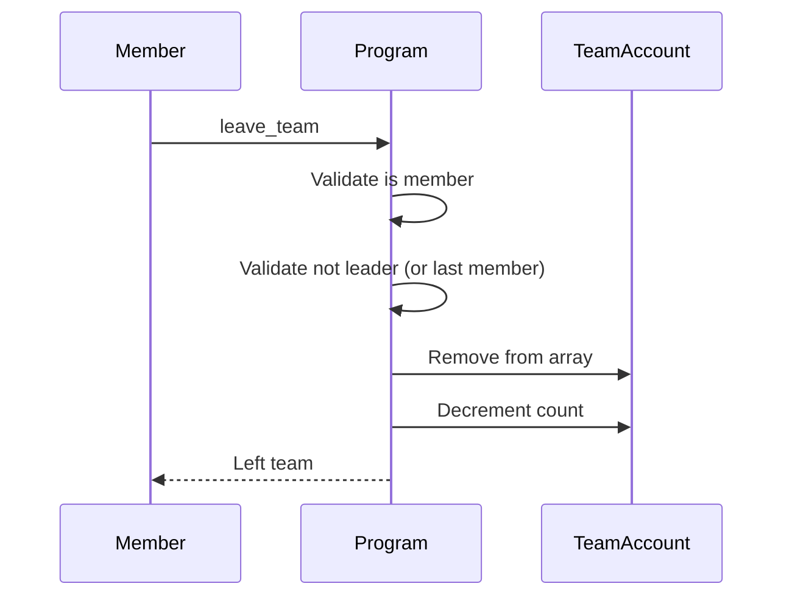
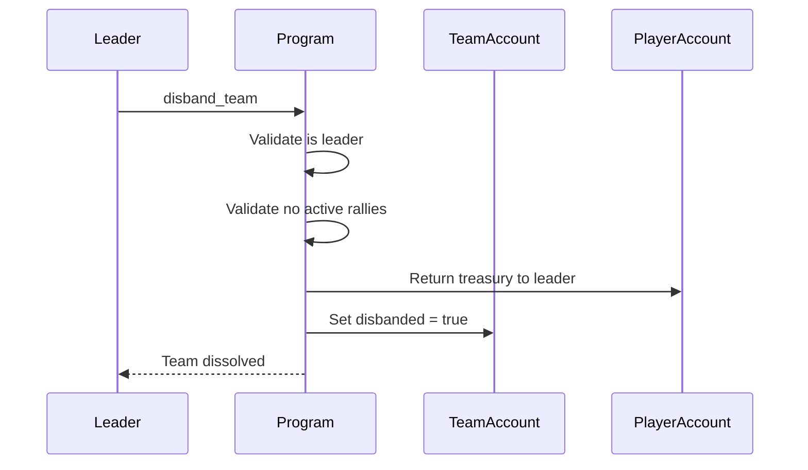

# Team System

> Guild/clan organization, treasury management, and team operations.

## System Overview

Teams are **persistent social organizations** that enable coordinated gameplay. Members share a treasury, can send reinforcements, and participate in rallies together.



## Instructions

| ID | Instruction | Description |
|----|-------------|-------------|
| 50 | `create_team` | Create a new team |
| 51 | `join_team` | Join an existing team |
| 52 | `leave_team` | Leave current team |
| 53 | `deposit_treasury` | Add funds to treasury |
| 54 | `invite_player` | Invite player to team |
| 55 | `accept_invite` | Accept team invitation |
| 56 | `transfer_leadership` | Hand over leadership |
| 57 | `kick_member` | Remove member from team |
| 58 | `disband_team` | Dissolve the team |
| 59 | `withdraw_treasury` | Leader withdraws funds |

[Source: processor/team/](../../../programs/novus_mundus/src/processor/team/)

---

## TeamAccount Structure

```
TeamAccount:
├── id: u64                    // Unique team ID
├── leader: Pubkey             // Current leader
├── name: [u8; 32]             // Team name bytes
├── name_len: u8               // Name length
├── disbanded: bool            // True if dissolved
├── bump: u8                   // PDA bump
│
├── members: [Pubkey; 50]      // Member array
├── member_count: u8           // Current count (0-50)
│
├── created_at: i64            // Creation timestamp
├── treasury: u64              // NOVI balance
│
└── _reserved: [u8; 64]        // Future expansion
```

**Seeds:** `["team", team_id_bytes]`

**Size:** ~1,768 bytes

---

## Team Lifecycle

### Creating a Team

**Instruction:** `50 - create_team`



**Requirements:**
- Player not already in a team
- Name passes validation rules
- NOVI cost: 10,000 (configurable)

### Joining a Team

Teams support two join methods:

#### Direct Join

**Instruction:** `51 - join_team`



#### Invitation Flow



**Instruction:** `54 - invite_player`, `55 - accept_invite`

---

## Treasury System

### Depositing Funds

**Instruction:** `53 - deposit_treasury`



Any member can deposit to the treasury.

### Withdrawing Funds

**Instruction:** `59 - withdraw_treasury`



**Only the leader** can withdraw from treasury.

### Treasury Uses

| Use | Description |
|-----|-------------|
| Rally Costs | Fund team rallies |
| Event Entry | Enter team competitions |
| Member Bonuses | Distribute rewards |
| Castle Upkeep | Maintain team castle (future) |

---

## Leadership

### Transfer Leadership

**Instruction:** `56 - transfer_leadership`



### Kick Member

**Instruction:** `57 - kick_member`

Only the leader can remove members:



**Note:** Cannot kick yourself (use `leave_team`) or when you're the last member (use `disband_team`).

---

## Leaving & Disbanding

### Leave Team

**Instruction:** `52 - leave_team`



**Leaders cannot leave** unless they:
1. Transfer leadership first, OR
2. Are the last member (use disband)

### Disband Team

**Instruction:** `58 - disband_team`



**Requirements:**
- Must be leader
- No active rallies
- Treasury automatically returned to leader

---

## Team Validation

### Membership Checks

```rust
/// Check if player is team member
pub fn is_member(&self, player: &Pubkey) -> bool {
    self.members().iter().any(|m| m == player)
}

/// Check if player is team leader
pub fn is_leader(&self, player: &Pubkey) -> bool {
    &self.leader == player
}

/// Check if team is full
pub fn is_full(&self) -> bool {
    self.member_count >= 50
}

/// Check if team is active
pub fn is_active(&self) -> bool {
    !self.disbanded && self.leader != NULL_PUBKEY
}
```

### Name Validation Rules

| Rule | Requirement |
|------|-------------|
| Length | 3-32 characters |
| Characters | Alphanumeric + underscore |
| No profanity | Filtered word list |
| Unique | Not already taken |

---

## Team Benefits

### Rally Participation

Team membership is required for rallies:
- Only team members can join each other's rallies
- Leader buffs apply to entire rally
- Loot shared among participants

### Reinforcements

Team members can reinforce each other:
- Send units to defend teammates
- Garrison team castles
- Shared defense calculations

### Team Events

Some events are team-based:
- Combined score leaderboards
- Team vs team competitions
- Exclusive team rewards

---

## Client Integration

### Display Team Info

```javascript
async function getTeamInfo(connection, teamId) {
  const [teamPda] = PublicKey.findProgramAddress(
    [Buffer.from("team"), teamId.toBuffer()],
    PROGRAM_ID
  );

  const team = await fetchTeamAccount(connection, teamPda);

  return {
    id: team.id,
    name: decodeTeamName(team.name, team.nameLen),
    leader: team.leader,
    members: team.members.slice(0, team.memberCount),
    memberCount: team.memberCount,
    treasury: team.treasury,
    isActive: !team.disbanded,
    createdAt: new Date(team.createdAt * 1000)
  };
}
```

### Check Membership

```javascript
function getPlayerTeamStatus(player, teams) {
  for (const team of teams) {
    if (team.members.some(m => m.equals(player))) {
      return {
        inTeam: true,
        teamId: team.id,
        teamName: team.name,
        isLeader: team.leader.equals(player)
      };
    }
  }
  return { inTeam: false };
}
```

### Create Team UI

```javascript
async function createTeam(connection, wallet, teamName) {
  // Validate name client-side first
  if (!isValidTeamName(teamName)) {
    throw new Error('Invalid team name');
  }

  // Check player not already in team
  const playerStatus = await getPlayerTeamStatus(wallet.publicKey);
  if (playerStatus.inTeam) {
    throw new Error('Already in a team');
  }

  const nextTeamId = await getNextTeamId(connection);

  const [teamPda] = PublicKey.findProgramAddress(
    [Buffer.from("team"), nextTeamId.toBuffer()],
    PROGRAM_ID
  );

  const ix = createTeamInstruction({
    name: teamName,
    teamId: nextTeamId
  });

  return sendTransaction(connection, wallet, [ix]);
}
```

### Team Management UI

```javascript
function renderTeamManagement(team, currentUser) {
  const isLeader = team.leader.equals(currentUser);

  return `
    Team: ${team.name}
    Members: ${team.memberCount}/50
    Treasury: ${formatNovi(team.treasury)} NOVI

    ${team.members.map(member => `
      - ${formatAddress(member)} ${member.equals(team.leader) ? '(Leader)' : ''}
        ${isLeader && !member.equals(currentUser) ? '[Kick] [Transfer Leadership]' : ''}
    `).join('\n')}

    ${isLeader ? `
      [Deposit to Treasury] [Withdraw from Treasury]
      [Invite Player] [Disband Team]
    ` : `
      [Deposit to Treasury] [Leave Team]
    `}
  `;
}
```

---

## Constants

| Constant | Value | Description |
|----------|-------|-------------|
| `MAX_TEAM_MEMBERS` | 50 | Maximum members |
| `TEAM_NAME_MAX_LENGTH` | 32 | Name character limit |
| `TEAM_CREATION_COST` | 10,000 | NOVI to create |

---

*Teams transform individuals into empires. Build alliances, pool resources, and conquer together.*

---

Next: [Reinforcements](./reinforcements.md)
