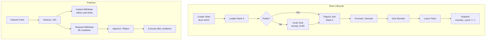
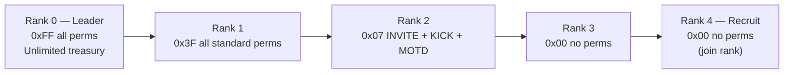
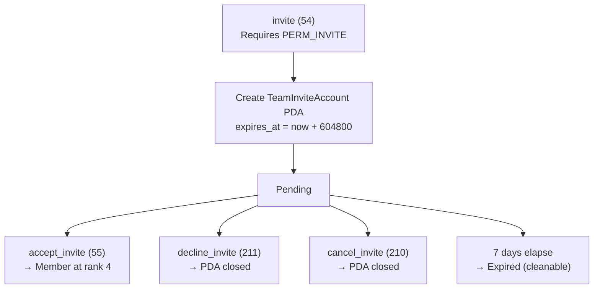
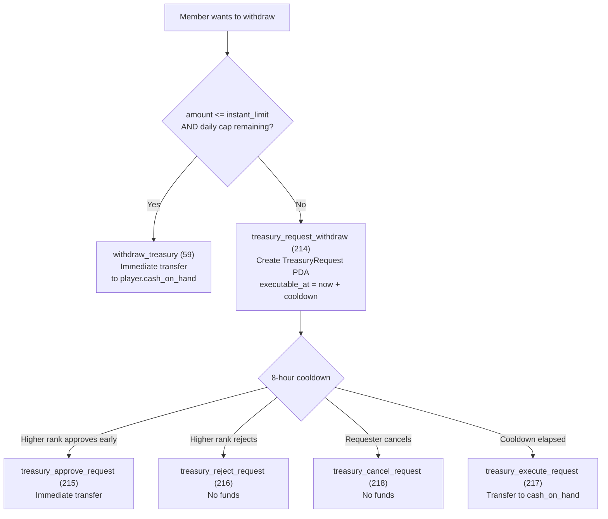
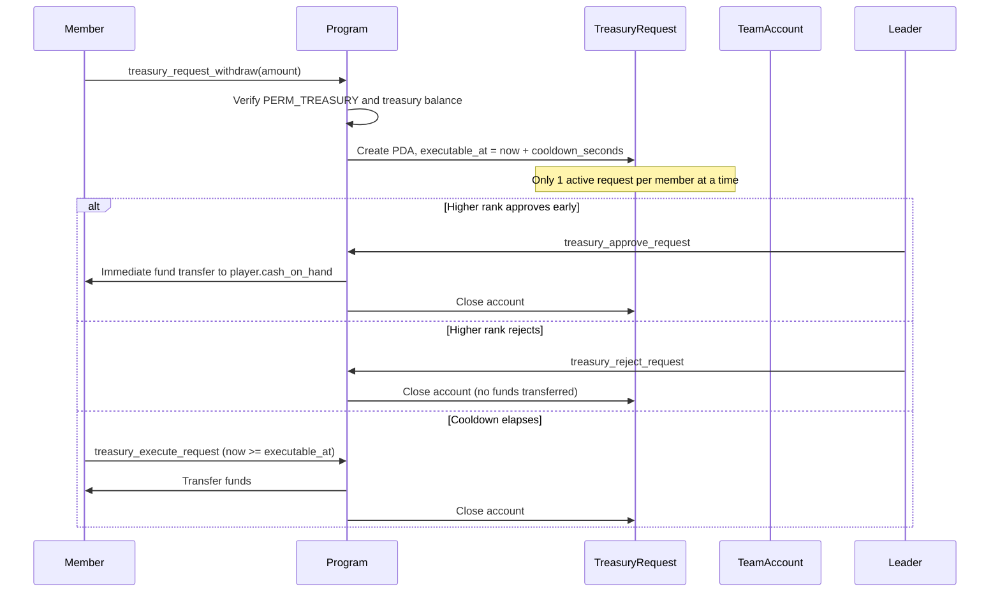
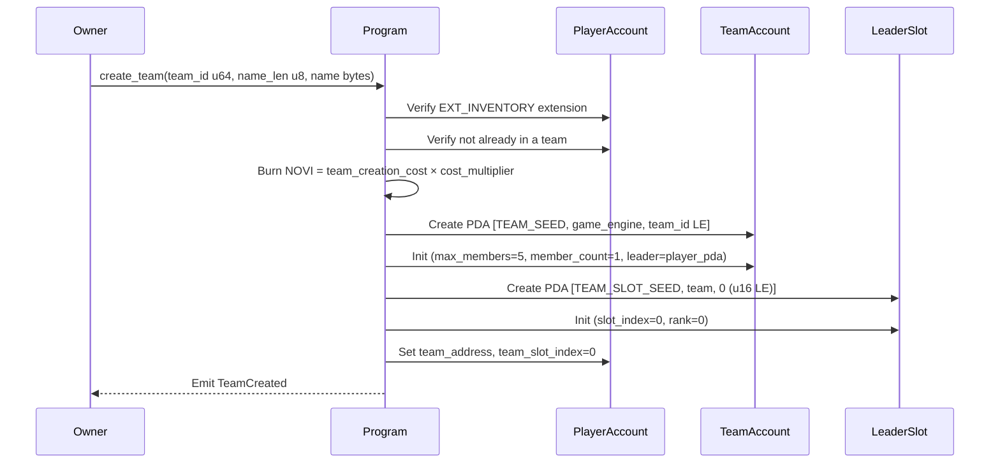

# Team System

> Kingdom-scoped guilds with hierarchical ranks, permissioned treasury, and multi-sig withdrawal governance.

## System Overview

The Team System provides the social infrastructure for Novus Mundus. Every team is **kingdom-scoped**: a team belongs to exactly one `GameEngine` and its members must be players within that same kingdom. Teams unlock cooperative combat (rallies) and resource sharing (reinforcements).



## Instructions

| ID | Instruction | Description |
|----|-------------|-------------|
| 50 | `create_team` | Create team, burn NOVI, leader auto-joins at Rank 0 |
| 51 | `join_team` | Join a public team (no invite required) |
| 52 | `leave_team` | Leave team, close member slot, rent returned |
| 53 | `deposit_treasury` | Deposit cash into team treasury |
| 54 | `invite` | Invite a player to a private team |
| 55 | `accept_invite` | Accept a pending team invite |
| 56 | `transfer_leadership` | Transfer Rank 0 to another member |
| 57 | `kick_member` | Remove a lower-ranked member (requires `PERM_KICK` and outranking target) |
| 58 | `disband` | Dissolve team (requires `member_count == 1`) |
| 59 | `withdraw_treasury` | Instant treasury withdrawal within per-rank limits |
| 210 | `cancel_invite` | Cancel a pending outbound invite |
| 211 | `decline_invite` | Invitee rejects an invite |
| 212 | `set_motd` | Set message of the day (requires `PERM_MOTD`) |
| 213 | `update_settings` | Change public/auto-accept flags and min level (requires `PERM_SETTINGS`) |
| 214 | `treasury_request_withdraw` | Create a `TreasuryRequest` for amounts above instant limit |
| 215 | `treasury_approve_request` | Higher-ranked member approves a pending request immediately |
| 216 | `treasury_reject_request` | Higher-ranked member rejects a pending request |
| 217 | `treasury_execute_request` | Requester executes their request after cooldown elapses |
| 218 | `treasury_cancel_request` | Requester cancels their own pending request |
| 219 | `update_treasury_settings` | Reconfigure per-rank limits, daily caps, and cooldown hours |
| 220 | `promote_member` | Decrease a member's rank number (more power) |
| 221 | `demote_member` | Increase a member's rank number (less power) |

[Source: processor/team/](../../../programs/novus_mundus/src/processor/team/)

---

## Rank System

Ranks run **0** (most powerful, leader) through **4** (least powerful, recruit). A lower rank number outranks a higher one.

| Rank | Default Permissions Bitfield | Effective Permissions |
|------|-----------------------------|-----------------------|
| 0 (Leader) | `0xFF` | All permissions, unlimited treasury |
| 1 | `0x3F` | All standard permissions |
| 2 | `0x07` | INVITE, KICK, MOTD |
| 3 | `0x00` | None |
| 4 | `0x00` | None (join rank) |



### Permission Bits

| Bit | Constant | Capability |
|-----|----------|------------|
| 0 | `PERM_INVITE` | Send team invites |
| 1 | `PERM_KICK` | Kick members with a higher rank number |
| 2 | `PERM_MOTD` | Set message of the day |
| 3 | `PERM_PROMOTE` | Promote or demote members below own rank |
| 4 | `PERM_TREASURY` | Access treasury withdrawals |
| 5 | `PERM_SETTINGS` | Change team settings |

Per-rank permission bitfields are fully configurable via `update_settings` / `update_treasury_settings`. Rank 0 always has unlimited treasury access regardless of bitfield state.

### Kick and Promote Guards

```
kick_member:    rank_has_permission(actor_rank, PERM_KICK) && actor_rank < target_rank
promote_member: rank_has_permission(actor_rank, PERM_PROMOTE) && actor_rank < target_new_rank
demote_member:  rank_has_permission(actor_rank, PERM_PROMOTE) && actor_rank < target_rank
```

---

## Member Capacity

Teams start at the Rookie (tier 0) cap and can be upgraded.

| Tier Index | `MAX_TEAM_MEMBERS_BY_TIER` |
|------------|---------------------------|
| 0 (Rookie) | 5 |
| 1 | 10 |
| 2 | 25 |
| 3 | 50 |

New teams are created at tier 0: `max_members = 5`.

---

## Invite System

`TeamInviteAccount` is a PDA that persists until accepted, declined, cancelled, or expired. One invite per `(team, invitee)` pair.

- **Default expiry:** `TEAM_INVITE_EXPIRY = 604800` seconds (7 days). `expires_at = created_at + 604800`.
- **Seeds:** `[TEAM_INVITE_SEED, team_pubkey, invitee_player_pubkey]`



```
TeamInviteAccount (136 bytes):
├── account_key: u8
├── team: Address      // 32 - Team pubkey
├── invitee: Address   // 32 - Invitee player account pubkey
├── bump: u8
├── inviter: Address   // 32 - Who sent invite (display only)
├── created_at: i64
├── expires_at: i64    // created_at + 604800
└── _reserved: [u8; 8]
```

---

## Treasury System



### Instant Withdrawal (Instruction 59)

`withdraw_treasury` succeeds immediately when both guards pass:

```
amount <= get_instant_limit(rank)
amount <= get_daily_cap(rank) - slot.treasury_withdrawn_today
```

Default limits per rank (Rank 0 = unlimited, index maps rank 1→0, rank 2→1, etc.):

| Rank | `treasury_instant_limit` | `treasury_daily_cap` |
|------|--------------------------|----------------------|
| 0 (Leader) | Unlimited (`u64::MAX`) | Unlimited |
| 1 | 1 000 | 5 000 |
| 2 | 100 | 500 |
| 3 | 0 | 0 |
| 4 | 0 | 0 |

Daily counters (`treasury_withdrawn_today` in `TeamMemberSlot`) reset when `unix_timestamp / 86400` changes.

### Multi-Sig Request Flow (Instructions 214–218)

For amounts exceeding instant limits, a `TreasuryRequest` PDA is created with a cooldown.



- **Default cooldown:** 8 hours (`DEFAULT_COOLDOWN_HOURS = 8`). Range: 1–72 hours.
- **Request expiry:** 7 days after creation (if never actioned).
- **PDA seeds:** `[TREASURY_REQUEST_SEED, team_pubkey, requester_player_pubkey]`

---

## Create Team Flow



**Instruction data layout (create_team):** `team_id:u64 LE | name_len:u8 | name:[u8; name_len]` — minimum 9 bytes; name 3–32 chars.

---

## Account Structures

### TeamAccount (280 bytes)

```rust
pub struct TeamAccount {
    pub account_key: u8,
    pub game_engine: Address,               // 32 - kingdom reference
    pub id: u64,                            // 8  - unique team ID (PDA seed)
    pub leader: Address,                    // 32 - leader's PLAYER ACCOUNT pubkey (not wallet)
    pub bump: u8,
    pub disbanded: bool,
    pub _padding0: [u8; 6],
    pub name: [u8; 32],                     // UTF-8, 3–32 chars
    pub name_len: u8,
    pub _padding1: [u8; 7],
    pub member_count: u16,
    pub max_members: u16,
    pub _padding2: [u8; 4],
    pub created_at: i64,
    pub last_activity: i64,
    pub treasury: u64,
    pub settings: u8,                       // bit0=SETTING_PUBLIC, bit1=SETTING_AUTO_ACCEPT
    pub min_level_to_join: u8,
    pub role_permissions: [u8; 5],          // index = rank (0..4)
    pub _padding3: u8,
    pub motd: [u8; 32],                     // UTF-8
    pub motd_len: u8,
    pub _padding4: [u8; 7],
    pub treasury_instant_limit: [u64; 4],  // index 0=Rank1, 1=Rank2, 2=Rank3, 3=Rank4
    pub treasury_daily_cap: [u64; 4],
    pub treasury_cooldown_hours: u8,        // 1–72
    pub _treasury_reserved: [u8; 7],
}
```

**PDA seeds:** `[b"team", game_engine, team_id:u64 LE]`

> **Note:** The compile-time size assertion at the bottom of `state/team.rs` is `[(); 280]`. The `leader` field stores the **player account pubkey**, not the owner wallet address.

### TeamMemberSlot (104 bytes)

Each member occupies one slot PDA. Account existence equals membership. Closing it (leave / kick) returns rent to the leaving member's wallet.

```rust
pub struct TeamMemberSlot {
    pub account_key: u8,
    pub team: Address,                      // 32 - team pubkey
    pub player: Address,                    // 32 - player ACCOUNT pubkey (not wallet)
    pub joined_at: i64,
    pub slot_index: u16,
    pub bump: u8,
    pub rank: u8,                           // 0 = leader .. 4 = lowest
    pub _reserved: [u8; 4],
    pub treasury_withdrawn_today: u64,
    pub last_treasury_day: u16,             // unix_ts / 86400 for daily reset
    pub _treasury_padding: [u8; 6],
}
```

**PDA seeds:** `[b"team_slot", team_pubkey, slot_index:u16 LE]`

### TreasuryRequest (112 bytes)

```rust
pub struct TreasuryRequest {
    pub account_key: u8,
    pub team: Address,          // 32
    pub requester: Address,     // 32 - requester's player account pubkey
    pub amount: u64,
    pub created_at: i64,
    pub executable_at: i64,     // created_at + cooldown_seconds
    pub bump: u8,
    pub _reserved: [u8; 15],
}
```

**PDA seeds:** `[b"treasury_request", team_pubkey, requester_player_pubkey]`

---

## Client Integration

```typescript
import { PublicKey } from "@solana/web3.js";
import BN from "bn.js";

// Derive team PDA
function findTeamPda(gameEngine: PublicKey, teamId: bigint, programId: PublicKey) {
  const teamIdBuf = Buffer.alloc(8);
  teamIdBuf.writeBigUInt64LE(teamId);
  return PublicKey.findProgramAddressSync(
    [Buffer.from("team"), gameEngine.toBuffer(), teamIdBuf],
    programId
  );
}

// Derive member slot PDA
function findTeamSlotPda(team: PublicKey, slotIndex: number, programId: PublicKey) {
  const slotBuf = Buffer.alloc(2);
  slotBuf.writeUInt16LE(slotIndex);
  return PublicKey.findProgramAddressSync(
    [Buffer.from("team_slot"), team.toBuffer(), slotBuf],
    programId
  );
}

// Check if rank can withdraw instantly
function canWithdrawInstant(
  team: TeamAccount,
  slot: TeamMemberSlot,
  amount: bigint,
  nowMs: number
): boolean {
  if (slot.rank === 0) return true; // leader unlimited
  const idx = slot.rank - 1;
  const limit = team.treasuryInstantLimit[idx];
  const cap = team.treasuryDailyLimit[idx];
  const todayDay = BigInt(Math.floor(nowMs / 86_400_000));
  const withdrawn = BigInt(slot.lastTreasuryDay) === todayDay
    ? slot.treasuryWithdrawnToday
    : 0n;
  return amount <= limit && amount <= cap - withdrawn;
}
```

---

Next: [Events](./events.md)

*Rank is a number, but trust is the only currency the treasury cannot quantify.*
